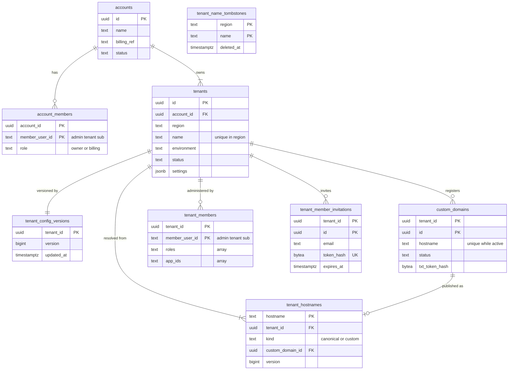
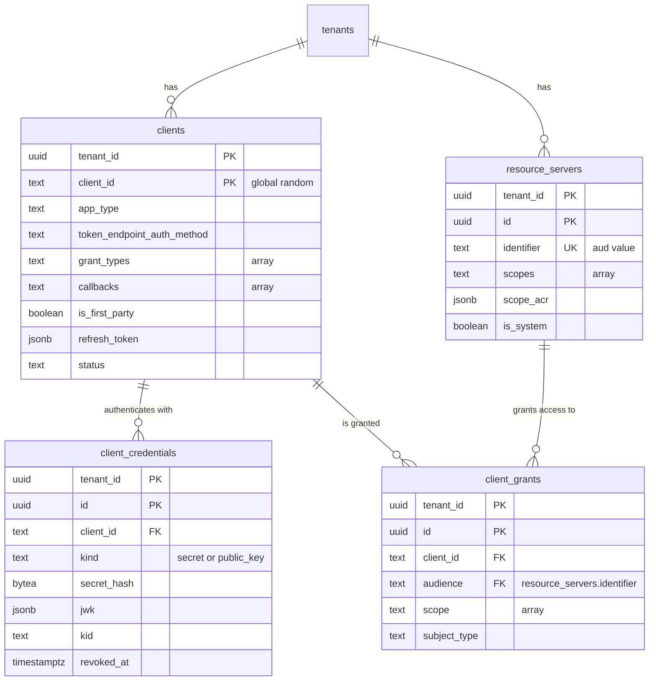

# Data model: アカウント・テナント・アプリ・API・ホスト名

[data-model.md](../data-model.md) の一部。規約（ID、RLS、型、削除、秘密の列、パーティション）は、そちらの 2 節に従う。振る舞いは [tenants-and-applications.md](../tenants-and-applications.md)、[custom-domains.md](../custom-domains.md)、[dashboard.md](../dashboard.md)、[ADR-0002](../../decisions/0002-tenancy-and-isolation.md)、[ADR-0030](../../decisions/0030-accounts-tenants-and-members.md)、[ADR-0031](../../decisions/0031-application-and-api-registration.md)、[ADR-0032](../../decisions/0032-tenant-config-cache.md)、[ADR-0038](../../decisions/0038-custom-domain-verification-and-certificates.md)、[ADR-0039](../../decisions/0039-hostname-resolution-and-issuer.md) を正とする。

## 1. ER 図

### 1.1 アカウント・テナント・ホスト名（テナントの外を含む）

`tenant_name_tombstones` は、他の表と関係を持たない（名前と地域だけ）。

### 1.2 アプリ・API・M2M の許可

## 2. テナントの外の表

どの表も RLS を持たない。理由と、読める・書ける主体は [data-model.md](../data-model.md) の 3 節にある。

### accounts

請求と契約の単位。1 つのアカウントが複数のテナントを持つ（ADR-0030）。

| 列 | 型 | NULL | 既定 | 説明 |
| --- | --- | --- | --- | --- |
| `id` | `uuid` | NO | `uuidv7()` | |
| `name` | `text` | NO | | 表示名（会社名など） |
| `billing_ref` | `text` | YES | | 請求の仕組みの参照（請求の設計はまだない） |
| `status` | `text` | NO | `'active'` | `active`・`suspended`・`closed` |
| `created_at` / `updated_at` | `timestamptz` | NO | `now()` | |

- 主キー：`(id)`。
- 保持：アカウントのすべてのテナントが消えてから、`platform` が消す。
- S1 の規模：約 5,000 行（テナント 1 万、平均 2 テナント/アカウントと仮定）。

### account_members

アカウントの管理者（`owner`・`billing`）。人は管理用のテナント（`admin`）のユーザーである（[ADR-0036](../../decisions/0036-dashboard-login-via-admin-tenant.md)）。

| 列 | 型 | NULL | 既定 | 説明 |
| --- | --- | --- | --- | --- |
| `account_id` | `uuid` | NO | | → `accounts.id` |
| `member_user_id` | `text` | NO | | 管理用のテナントのユーザーの `user_id`（トークンの `sub`）。[data-model.md](../data-model.md) の 2.4 節の例外 |
| `role` | `text` | NO | | `owner`・`billing`。`CHECK` |
| `created_at` | `timestamptz` | NO | `now()` | |

- 主キー：`(account_id, member_user_id)`。
- 索引：`(member_user_id)`（ダッシュボードの「自分のアカウント」の一覧）。
- 検査：アカウントに `owner` が 1 人以上いることは、削除の関数で守る（最後の `owner` は外せない）。
- S1 の規模：約 1 万行。

### tenants

テナントの根。解決とコンテキストの設定の前に読むので RLS の外に置く。秘密を持たない。

| 列 | 型 | NULL | 既定 | 説明 |
| --- | --- | --- | --- | --- |
| `id` | `uuid` | NO | `uuidv7()` | `tenant_id` の値 |
| `account_id` | `uuid` | NO | | → `accounts.id` |
| `region` | `text` | NO | | S1 は `jp` だけ。作成後に変えない（ADR-0002） |
| `name` | `text` | NO | | `^[a-z0-9][a-z0-9-]{1,61}[a-z0-9]$`。作成後に変えない |
| `environment` | `text` | NO | | `development`・`staging`・`production`。昇格だけ許す（ADR-0030） |
| `status` | `text` | NO | `'active'` | `active`・`suspended`・`deleting` |
| `status_changed_at` | `timestamptz` | NO | `now()` | |
| `settings` | `jsonb` | NO | `'{}'` | テナントの設定の束（`mfa_policy`、`attack_protection`、`account_linking`、`org_name_in_tokens`、`passkey_enrollment_prompt` など）。Zod で検証する |
| `session_idle_minutes` | `integer` | NO | `4320` | 5〜144,000（[sessions-and-sso.md](../sessions-and-sso.md) の 3.4 節） |
| `session_absolute_minutes` | `integer` | NO | `10080` | `session_idle_minutes` 以上、525,600 以下 |
| `session_persistent` | `boolean` | NO | `true` | |
| `log_retention_days` | `smallint` | NO | | `1`・`5`・`10`・`30`。本番の既定 30、本番以外 5（[logs-and-streams.md](../logs-and-streams.md) の 4.2 節） |
| `webauthn_rp_id` | `text` | YES | | 最初にパスキーを有効にした時点で固定（[mfa-and-passkeys.md](../mfa-and-passkeys.md) の 5.2.1 節） |
| `created_at` / `updated_at` | `timestamptz` | NO | `now()` | |
| `deleted_at` | `timestamptz` | YES | | `deleting` にした時刻。30 日の猶予の起点（ADR-0055） |

- 主キー：`(id)`。
- 一意：`UNIQUE (region, name)`。
- 索引：`(account_id)`（アカウントのテナントの一覧）、`(status) WHERE status <> 'active'`（停止・削除のジョブ）。
- 検査：`CHECK (session_absolute_minutes >= session_idle_minutes)`、`environment`・`status`・`log_retention_days` の値の一覧。
- 行の変更は、`tenant_config_versions.version` を同じトランザクションで上げる（ADR-0032）。
- 保持：`deleting` から 30 日で、全テナントテーブルの行と鍵の暗号文を消し、最後にこの行を消す。名前は `tenant_name_tombstones` に残す。
- S1 の規模：約 1 万行（本番 3,000）。

### tenant_name_tombstones

削除したテナントの名前。再利用を禁じる（[tenants-and-applications.md](../tenants-and-applications.md) の 3.2 節）。

| 列 | 型 | NULL | 既定 | 説明 |
| --- | --- | --- | --- | --- |
| `region` | `text` | NO | | |
| `name` | `text` | NO | | |
| `deleted_at` | `timestamptz` | NO | | |

- 主キー：`(region, name)`。作成の関数が、`tenants` と両方を見る。
- 保持：消さない。
- S1 の規模：数千行。

### tenant_config_versions

テナントの設定のバージョン。全タスクが 5 秒ごとにポーリングで読む（ADR-0032）。

| 列 | 型 | NULL | 既定 | 説明 |
| --- | --- | --- | --- | --- |
| `tenant_id` | `uuid` | NO | | → `tenants.id` |
| `version` | `bigint` | NO | `1` | 設定の表を変えるトランザクションが 1 増やす |
| `updated_at` | `timestamptz` | NO | `now()` | |

- 主キー：`(tenant_id)`。
- 索引：`(updated_at)`（ポーリングの `updated_at > :last`）。
- バージョンを上げる表（設定の表）：`tenants`、`clients`、`client_credentials`、`resource_servers`、`client_grants`、`connections`、`connection_clients`、`branding_themes`、`branding_texts`、`legal_documents`、`email_templates`、`email_providers`、`trigger_bindings`、`organizations` と `organization_connections`（E14）。CI で、これらへの書き込みがバージョンを上げる関数を呼ぶことを確かめる（[tenants-and-applications.md](../tenants-and-applications.md) の 10 節）。
- S1 の規模：約 1 万行。

### tenant_hostnames

ホスト名 → テナントの解決の正本。各タスクがメモリーに全件を持つ（ADR-0039）。持ち主は custom-domains の領域。

| 列 | 型 | NULL | 既定 | 説明 |
| --- | --- | --- | --- | --- |
| `hostname` | `text` | NO | | 小文字、Punycode、末尾の点なし、ポートなし |
| `tenant_id` | `uuid` | NO | | → `tenants.id` |
| `kind` | `text` | NO | | `canonical`・`custom` |
| `custom_domain_id` | `uuid` | YES | | `kind = 'custom'` のとき `custom_domains.id` |
| `status` | `text` | NO | `'active'` | `active` だけ。外すときは行を消す |
| `is_default_for_email` | `boolean` | NO | `false` | メールのリンクに使うホスト名 |
| `version` | `bigint` | NO | | 変更の順（シーケンス `tenant_hostnames_version_seq`）。差分の読み込みに使う |
| `updated_at` | `timestamptz` | NO | `now()` | |

- 主キー：`(hostname)`。ホスト名の一意はテナントをまたぐ。
- 外部キー：`tenant_id` → `tenants (id)`。`custom_domain_id` には張らない（`custom_domains` は RLS の表で、主キーが複合のため。遷移の関数が整合を守る）。
- 索引：`(version)`（起動後の差分の読み込み）、`(tenant_id)`（テナントの削除、ダッシュボード）。
- 検査：`CHECK ((kind = 'custom') = (custom_domain_id IS NOT NULL))`、`UNIQUE (tenant_id) WHERE kind = 'canonical'`（標準のホスト名はテナントに 1 つ）。
- 書くのは `mgmt_app` の遷移の関数だけ。消した行は、差分の読み込みのために `outbox` の `tenant_hostname.changed` で知らせる。
- S1 の規模：約 1.3 万行（標準 1 万＋カスタムドメイン）。

## 3. テナントテーブル

### tenant_members

ダッシュボードの管理者とロール（[dashboard.md](../dashboard.md) の 5 節）。

| 列 | 型 | NULL | 既定 | 説明 |
| --- | --- | --- | --- | --- |
| `tenant_id` | `uuid` | NO | | |
| `member_user_id` | `text` | NO | | 管理用のテナントの `user_id`（`sub`）。[data-model.md](../data-model.md) の 2.4 節の例外 |
| `roles` | `text[]` | NO | | `admin`・`editor_connections`・`editor_keys`・`editor_apps`・`editor_users`・`viewer_users`・`viewer_config`（E14 で `editor_organizations`） |
| `app_ids` | `text[]` | NO | `'{}'` | `editor_apps` のときに限るアプリの `client_id` |
| `invited_by` | `text` | YES | | 招待した管理者の `member_user_id`。最初の管理者は NULL |
| `created_at` / `updated_at` | `timestamptz` | NO | `now()` | |

- 主キー：`(tenant_id, member_user_id)`。
- 索引：`(member_user_id)` は RLS の下では使えない。ダッシュボードの「自分のテナント」の一覧は、`mgmt_app` が持つ関数 `dashboard_list_my_tenants(member_user_id)` が引く（関数の中で使う索引として `(member_user_id, tenant_id)` を持つ）。
- 検査：`roles` が空でない。最後の `admin` は外せない（関数で守る）。
- S1 の規模：約 3 万行。

### tenant_member_invitations

管理者の招待。トークンは 256 ビットの乱数で、SHA-256 だけを持つ。有効 7 日。

| 列 | 型 | NULL | 既定 | 説明 |
| --- | --- | --- | --- | --- |
| `tenant_id` | `uuid` | NO | | |
| `id` | `uuid` | NO | `uuidv7()` | |
| `email` | `text` | NO | | 招待先（小文字に正規化） |
| `roles` | `text[]` | NO | | |
| `app_ids` | `text[]` | NO | `'{}'` | |
| `token_hash` | `bytea` | NO | | SHA-256 |
| `invited_by` | `text` | NO | | `member_user_id` |
| `expires_at` | `timestamptz` | NO | | 作成＋7 日 |
| `accepted_at` | `timestamptz` | YES | | |
| `revoked_at` | `timestamptz` | YES | | |
| `created_at` | `timestamptz` | NO | `now()` | |

- 主キー：`(tenant_id, id)`。
- 一意：`(tenant_id, token_hash)`（受諾のときの引き当て）。
- 索引：`(tenant_id, email) WHERE accepted_at IS NULL AND revoked_at IS NULL`（二重の招待の防止と一覧）。
- 保持：受諾・失効・期限切れから 30 日で消す。
- S1 の規模：数千行。

### clients

アプリケーション（ADR-0031）。**主キーは外に出す `client_id`**（[data-model.md](../data-model.md) の 2.2 節の例外）。

| 列 | 型 | NULL | 既定 | 説明 |
| --- | --- | --- | --- | --- |
| `tenant_id` | `uuid` | NO | | |
| `client_id` | `text` | NO | | 32 文字の base62 の乱数。全体で一意になるように作るが、照合は必ず `(tenant_id, client_id)` |
| `name` | `text` | NO | | |
| `app_type` | `text` | NO | | `spa`・`native`・`regular_web`・`m2m`。作成後に変えない |
| `token_endpoint_auth_method` | `text` | NO | | `none`・`client_secret_basic`・`client_secret_post`・`private_key_jwt` |
| `grant_types` | `text[]` | NO | | `authorization_code`・`refresh_token`・`client_credentials`・`urn:ietf:params:oauth:grant-type:device_code` |
| `callbacks` | `text[]` | NO | `'{}'` | 100 件まで。完全一致（ADR-0006） |
| `allowed_logout_urls` | `text[]` | NO | `'{}'` | 100 件まで |
| `web_origins` | `text[]` | NO | `'{}'` | 100 件まで |
| `allowed_origins` | `text[]` | NO | `'{}'` | 100 件まで（CORS） |
| `initiate_login_uri` | `text` | YES | | |
| `is_first_party` | `boolean` | NO | `true` | |
| `require_pkce` | `boolean` | NO | `true` | |
| `refresh_token` | `jsonb` | NO | | `rotation`、`leeway_seconds`（0〜60）、`lifetime_seconds`、`idle_lifetime_seconds`、`binding`（`session`・`independent`）（ADR-0003、ADR-0008、ADR-0029） |
| `oidc_backchannel_logout` | `jsonb` | YES | | `backchannel_logout_uri` など（ADR-0028） |
| `client_metadata` | `jsonb` | NO | `'{}'` | 文字列の値だけ。キー 10 件、値 255 文字 |
| `legacy_token_endpoint_aud` | `boolean` | NO | `false` | `private_key_jwt` の `aud` の互換。GA から 12 か月で列ごと消す |
| `organization_usage` | `text` | NO | `'deny'` | `deny`・`allow`・`require`（E14） |
| `organization_require_behavior` | `text` | YES | | `pre_login_prompt`・`post_login_prompt`・`no_prompt`（E14） |
| `require_pushed_authorization_requests` | `boolean` | NO | `false` | PAR（MVP の後） |
| `status` | `text` | NO | `'active'` | `active`・`disabled`（漏えい時の一時的な無効化） |
| `created_at` / `updated_at` | `timestamptz` | NO | `now()` | |

- 主キー：`(tenant_id, client_id)`。
- 検査：`app_type` × `token_endpoint_auth_method` × `grant_types` の組（[tenants-and-applications.md](../tenants-and-applications.md) の 4.1 節）は Zod と作成の関数で確かめる。DB では `CHECK (app_type IN (...))` などの値の一覧だけを持つ。
- 索引：主キーだけ（設定のスナップショットはテナント単位で全件を読む）。
- 削除：物理削除。子の `client_credentials`・`client_grants`・`connection_clients`・`session_clients`・`grants` を同じトランザクションで消し、発行済みのリフレッシュトークンの系列を `revoke_reason = 'admin'` で失効させる。
- S1 の規模：約 10 万行（テナントあたり平均 10）。

### client_credentials

クライアントの秘密と `private_key_jwt` の公開鍵の唯一の表（2026-09-27 の統合。ADR-0007）。

| 列 | 型 | NULL | 既定 | 説明 |
| --- | --- | --- | --- | --- |
| `tenant_id` | `uuid` | NO | | |
| `id` | `uuid` | NO | `uuidv7()` | |
| `client_id` | `text` | NO | | → `clients` |
| `kind` | `text` | NO | | `secret`・`public_key` |
| `secret_hash` | `bytea` | YES | | `kind = 'secret'`：`<brand>_cs_...` の SHA-256。作成時に 1 回だけ表示 |
| `jwk` | `jsonb` | YES | | `kind = 'public_key'`：RSA 2048 ビット以上か P-256 |
| `kid` | `text` | YES | | `kind = 'public_key'` |
| `created_at` | `timestamptz` | NO | `now()` | |
| `expires_at` | `timestamptz` | YES | | ローテーションで古い方に付ける |
| `last_used_at` | `timestamptz` | YES | | 1 分に 1 回まで書く |
| `revoked_at` | `timestamptz` | YES | | |

- 主キー：`(tenant_id, id)`。
- 外部キー：`(tenant_id, client_id)` → `clients` `ON DELETE CASCADE`。
- 検査：`CHECK ((kind = 'secret' AND secret_hash IS NOT NULL AND jwk IS NULL) OR (kind = 'public_key' AND jwk IS NOT NULL AND kid IS NOT NULL AND secret_hash IS NULL))`。
- 一意：`(tenant_id, client_id, kid) WHERE kind = 'public_key' AND revoked_at IS NULL`。
- 索引：`(tenant_id, client_id) WHERE revoked_at IS NULL`（スナップショットの組み立て、「種類ごとに有効なものは 2 つまで」の確認）。
- 認証の経路は DB を読まない。スナップショットに `secret_hash` と `jwk` を載せて照合する。
- 保持：失効から 90 日で消す（監査は `audit_events` に残る）。
- S1 の規模：約 15 万行。

### resource_servers

API（ADR-0031）。スコープは列（配列）で持ち、別の表を持たない。

| 列 | 型 | NULL | 既定 | 説明 |
| --- | --- | --- | --- | --- |
| `tenant_id` | `uuid` | NO | | |
| `id` | `uuid` | NO | `uuidv7()` | |
| `identifier` | `text` | NO | | `aud` の値。URI。作成後に変えない |
| `name` | `text` | NO | | |
| `scopes` | `text[]` | NO | `'{}'` | `^[a-zA-Z0-9:_.\-]{1,280}$`、1,000 まで |
| `scope_acr` | `jsonb` | NO | `'{}'` | スコープ → 求める `acr`（[mfa-and-passkeys.md](../mfa-and-passkeys.md) の 6.4 節） |
| `token_lifetime_seconds` | `integer` | NO | `86400` | ADR-0008 の範囲 |
| `signing_alg` | `text` | NO | | テナントの鍵のアルゴリズム（`RS256`・`PS256`・`ES256`） |
| `allow_offline_access` | `boolean` | NO | `false` | |
| `skip_consent_for_first_party` | `boolean` | NO | `true` | |
| `is_system` | `boolean` | NO | `false` | Management API（`https://<tenant host>/api/v2/`）。削除・変更できない |
| `created_at` / `updated_at` | `timestamptz` | NO | `now()` | |

- 主キー：`(tenant_id, id)`。
- 一意：`(tenant_id, identifier)`（`client_grants.audience` の外部キーの先）。
- 検査：`is_system` の行は、更新・削除の関数が拒否する。
- S1 の規模：約 3 万行。

### client_grants

M2M の許可（アプリ × API × スコープ）。

| 列 | 型 | NULL | 既定 | 説明 |
| --- | --- | --- | --- | --- |
| `tenant_id` | `uuid` | NO | | |
| `id` | `uuid` | NO | `uuidv7()` | |
| `client_id` | `text` | NO | | |
| `audience` | `text` | NO | | `resource_servers.identifier` |
| `scope` | `text[]` | NO | | API の `scopes` の部分集合 |
| `subject_type` | `text` | NO | `'client'` | MVP は `client` だけ |
| `organization_usage` | `text` | YES | | E14 の後（組織の M2M） |
| `created_at` / `updated_at` | `timestamptz` | NO | `now()` | |

- 主キー：`(tenant_id, id)`。
- 一意：`(tenant_id, client_id, audience, subject_type)`。
- 外部キー：`(tenant_id, client_id)` → `clients` `ON DELETE CASCADE`、`(tenant_id, audience)` → `resource_servers (tenant_id, identifier)` `ON DELETE CASCADE`。
- API からスコープを消したら、同じトランザクションで含む許可から外し、監査に残す。
- Management API は、要求ごとにこの表を読んでトークンの許可を確かめる（[ADR-0034](../../decisions/0034-management-api-authorization.md)）。索引は一意の制約が受ける。
- S1 の規模：約 5 万行。

### custom_domains

カスタムドメインの状態（ADR-0038）。持ち主は custom-domains の領域。解決の表 `tenant_hostnames` には `ready` のものだけを書く。

| 列 | 型 | NULL | 既定 | 説明 |
| --- | --- | --- | --- | --- |
| `tenant_id` | `uuid` | NO | | |
| `id` | `uuid` | NO | `uuidv7()` | |
| `hostname` | `text` | NO | | 小文字、Punycode、末尾の点なし |
| `status` | `text` | NO | `'pending_verification'` | `pending_verification`・`verified`・`provisioning`・`ready`・`failed`・`suspended`・`deleting` |
| `status_reason` | `text` | YES | | `txt_not_found`・`caa_forbidden`・`cname_mismatch`・`cert_failed` など |
| `txt_token_hash` | `bytea` | NO | | `_<brand>-challenge.<hostname>` の 128 ビットの値の SHA-256 |
| `cname_target` | `text` | NO | | `<tenant-id>.edge.jp.<brand>.<domain>` |
| `cf_tenant_id` | `text` | YES | | CloudFront の配信のテナントの ID |
| `cert_status` | `text` | YES | | `pending`・`issued`・`renewing`・`failed` |
| `cert_not_after` | `timestamptz` | YES | | |
| `last_checked_at` | `timestamptz` | YES | | |
| `txt_missing_since` | `timestamptz` | YES | | 7 日で警告、30 日で `suspended` |
| `is_default` | `boolean` | NO | `true` | メールに使う既定（S2 で 1 テナントに複数） |
| `created_at` / `updated_at` | `timestamptz` | NO | `now()` | |
| `deleted_at` | `timestamptz` | YES | | |

- 主キー：`(tenant_id, id)`。
- 一意（テナントをまたぐ）：`CREATE UNIQUE INDEX custom_domains_active_hostname ON custom_domains (hostname) WHERE status IN ('verified','provisioning','ready','suspended')`。同じホスト名を `pending_verification` の間は複数のテナントが持てる。先に TXT を通した方だけが `verified` になる。書き込みは `mgmt_app` の遷移の関数だけ。
- 索引：`(status, last_checked_at)`（Worker の 5 分・24 時間の確認のジョブ。`platform` の関数がテナントをまたいで引き、テナントのコンテキストで読み直す）。
- 検査：S1 は 1 テナント 1 つ（`UNIQUE (tenant_id) WHERE deleted_at IS NULL`）。S2 で外す。
- 保持：`deleting` の後 30 日は同じテナントだけが戻せる。その後に物理削除。
- S1 の規模：約 3,000 行。
