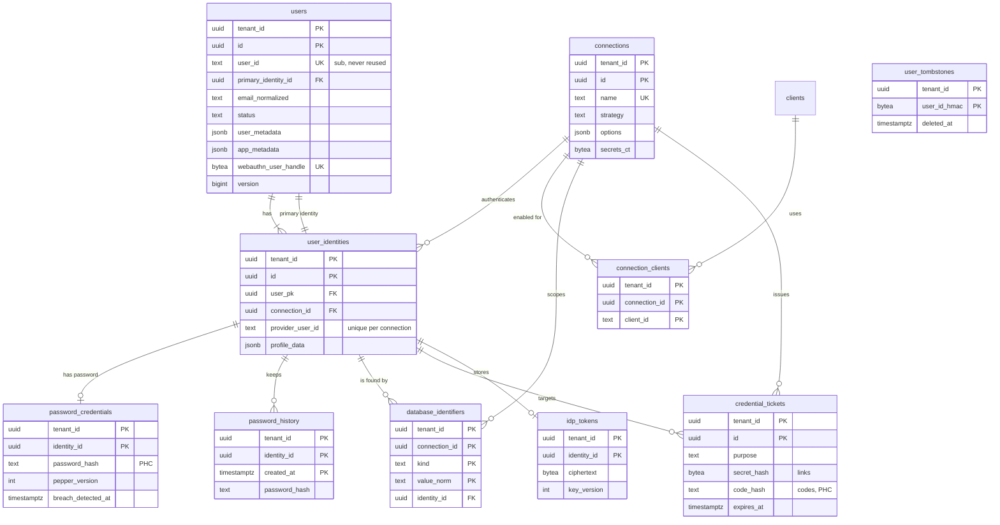
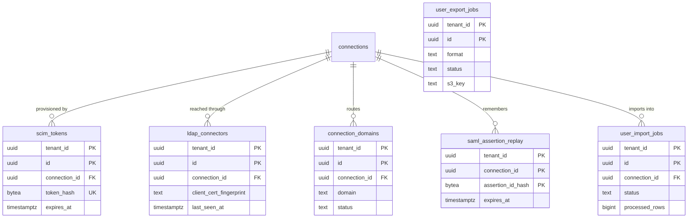

# Data model: ユーザー・接続・資格情報

[data-model.md](../data-model.md) の一部。規約は、そちらの 2 節に従う。振る舞いは [users-and-profiles.md](../users-and-profiles.md)、[connections.md](../connections.md)、[ADR-0014](../../decisions/0014-connection-abstraction.md)〜[ADR-0020](../../decisions/0020-user-search-and-lifecycle.md)、[ADR-0004](../../decisions/0004-credential-storage.md) を正とする。

## 1. ER 図

### 1.1 ユーザーと接続（MVP）

`user_tombstones` は `users` の行が消えた後も残るので、外部キーを持たない。

### 1.2 MVP の後（インポート・エクスポート、SCIM、エンタープライズ接続）

## 2. ユーザー

### users

エンドユーザー（ADR-0018）。`id` は内部の結合に、`user_id` は外（`sub`）に使う。

| 列 | 型 | NULL | 既定 | 説明 |
| --- | --- | --- | --- | --- |
| `tenant_id` | `uuid` | NO | | |
| `id` | `uuid` | NO | `uuidv7()` | 内部。他の表は `user_pk` で参照する |
| `user_id` | `text` | NO | | `usr_` ＋ 22 文字、またはインポートで指定した値（`^[A-Za-z0-9_\-|.:@]{1,255}$`） |
| `primary_identity_id` | `uuid` | NO | | → `user_identities.id`。`DEFERRABLE INITIALLY DEFERRED`（作成で両方を同じトランザクションに書くため） |
| `email` | `text` | YES | | 表示用 |
| `email_normalized` | `text` | YES | | `lower(NFKC(email))`。一意にしない（接続が違えば同じアドレスがありうる） |
| `email_verified` | `boolean` | NO | `false` | |
| `username` | `text` | YES | | データベース接続だけ |
| `name`、`given_name`、`family_name`、`nickname` | `text` | YES | | |
| `picture` | `text` | YES | | `https:` だけ |
| `locale` | `text` | YES | | |
| `user_metadata` | `jsonb` | NO | `'{}'` | 直列化して 16 KiB 以下 |
| `app_metadata` | `jsonb` | NO | `'{}'` | 直列化して 16 KiB 以下 |
| `status` | `text` | NO | `'active'` | `active`・`blocked`・`deleted`（墓石） |
| `blocked_at` | `timestamptz` | YES | | |
| `blocked_by` | `text` | YES | | `admin`・`brute_force`・`scim`・`breached_password` |
| `deleted_at` | `timestamptz` | YES | | 墓石にした時刻 |
| `webauthn_user_handle` | `bytea` | NO | | 64 バイトの乱数（個人を特定しない） |
| `last_login_at` | `timestamptz` | YES | | outbox から Worker が遅れて書く |
| `last_ip` | `inet` | YES | | テナントが記録しないことを選べる |
| `logins_count` | `bigint` | NO | `0` | |
| `version` | `bigint` | NO | `1` | 楽観ロック（`If-Match`） |
| `created_at` / `updated_at` | `timestamptz` | NO | `now()` | |

- 主キー：`(tenant_id, id)`。
- 一意：`(tenant_id, user_id)`、`(tenant_id, webauthn_user_handle)`。
- 外部キー：`(tenant_id, primary_identity_id)` → `user_identities (tenant_id, id)` `DEFERRABLE INITIALLY DEFERRED`。
- 検査：`CHECK (octet_length(user_metadata::text) <= 16384)`、`app_metadata` も同じ。`CHECK ((status = 'deleted') = (deleted_at IS NOT NULL))`。
- 索引（検索。[users-and-profiles.md](../users-and-profiles.md) の 6 節）：

  | 索引 | 受ける問い合わせ |
  | --- | --- |
  | `(tenant_id, email_normalized)` | `email:` の完全一致・前方一致、リンクの候補の引き当て |
  | `(tenant_id, created_at)` | 範囲と並べ替え |
  | `(tenant_id, last_login_at)` | 同上 |
  | `(tenant_id, lower(username))` | `username:` |
  | `GIN (name gin_trgm_ops)` | `name:` の前方一致 |
  | `GIN (user_metadata jsonb_path_ops)`、`GIN (app_metadata jsonb_path_ops)` | メタデータのスカラーの完全一致 |
  | `(tenant_id, status) WHERE status <> 'active'` | ブロック・墓石の一覧、30 日の物理削除のジョブ |

- 削除：墓石（`status = 'deleted'`、プロフィール・メタデータ・`last_ip` を消す）。同じトランザクションで資格情報・ID・セッション・系列を物理削除し、`user_tombstones` に入れる。30 日後に行を物理削除する（ADR-0055）。
- S1 の規模：2,000 万行、約 40 GB（索引を含め約 100 GB。[capacity.md](../capacity.md) の 2.4 節）。

### user_tombstones

削除した `user_id` の HMAC。`sub` の再割り当てを防ぐ。消さない。

| 列 | 型 | NULL | 既定 | 説明 |
| --- | --- | --- | --- | --- |
| `tenant_id` | `uuid` | NO | | |
| `user_id_hmac` | `bytea` | NO | | HMAC-SHA-256（テナントの鍵、`user_id`） |
| `deleted_at` | `timestamptz` | NO | | |

- 主キー：`(tenant_id, user_id_hmac)`。作成・インポートの関数が、`users` と両方を見る。
- 保持：テナントの削除まで。
- S1 の規模：年に数百万行と見込む（削除の率は未検証）。

### user_identities

接続ごとの外部の ID。持ち主は users-and-profiles と connections の共有（ADR-0014）。

| 列 | 型 | NULL | 既定 | 説明 |
| --- | --- | --- | --- | --- |
| `tenant_id` | `uuid` | NO | | |
| `id` | `uuid` | NO | `uuidv7()` | |
| `user_pk` | `uuid` | NO | | → `users.id` |
| `connection_id` | `uuid` | NO | | → `connections.id` |
| `provider_user_id` | `text` | NO | | IdP の安定した ID（OIDC の `sub`、GitHub の数値）。データベース接続は本システムが作る不透明な値 |
| `profile_data` | `jsonb` | NO | `'{}'` | IdP の属性（16 KiB 以下） |
| `email_normalized` | `text` | YES | | |
| `email_verified` | `boolean` | NO | `false` | |
| `linked_at` | `timestamptz` | YES | | 作成時の ID は NULL |
| `created_at` / `updated_at` | `timestamptz` | NO | `now()` | |

- 主キー：`(tenant_id, id)`。
- 一意：`(tenant_id, connection_id, provider_user_id)`（ソーシャルのログインでの引き当てと、同時の作成の競合の解決）。
- 外部キー：`(tenant_id, user_pk)` → `users` `ON DELETE CASCADE`、`(tenant_id, connection_id)` → `connections` `ON DELETE RESTRICT`（接続の削除は、ユーザーの ID を先に消す非同期のジョブで行う）。
- 索引：`(tenant_id, user_pk)`（ユーザーの ID の一覧）。
- 検査：ユーザーの ID は 0 個にならない（解除の関数が主の ID を外さない）。
- S1 の規模：約 2,500 万行。

## 3. 接続と資格情報

### connections

接続（ADR-0014）。`options` は `strategy` ごとの Zod で検証する（`authentication_methods`、`password_policy`、`identifiers`、`store_idp_tokens`、`sync_user_profile`、`disable_signup`、同意の方式 `consent_method` など）。

| 列 | 型 | NULL | 既定 | 説明 |
| --- | --- | --- | --- | --- |
| `tenant_id` | `uuid` | NO | | |
| `id` | `uuid` | NO | `uuidv7()` | |
| `name` | `text` | NO | | `[a-z0-9-]{1,128}` |
| `strategy` | `text` | NO | | `database`・`google`・`apple`・`line`・`github`（後で `saml`・`oidc`・`entra`・`google_workspace`・`ldap`） |
| `display_name` | `text` | YES | | |
| `options` | `jsonb` | NO | | 秘密を含めない |
| `secrets_ct` | `bytea` | YES | | IdP のクライアントシークレットなど。テナントの DEK で AES-256-GCM、AAD = `tenant_id|id|'connection'`。IdP 向けの秘密鍵は `external_idp_keys` に置く |
| `secrets_key_ver` | `integer` | YES | | `tenant_data_keys.version` |
| `is_domain_connection` | `boolean` | NO | `false` | エンタープライズの振り分け（後） |
| `version` | `integer` | NO | `0` | |
| `created_at` / `updated_at` | `timestamptz` | NO | `now()` | |

- 主キー：`(tenant_id, id)`。
- 一意：`(tenant_id, name)`。
- 検査：`CHECK ((secrets_ct IS NULL) = (secrets_key_ver IS NULL))`。
- 設定のスナップショットに `secrets_ct` を載せない。使う瞬間に復号する（[tenants-and-applications.md](../tenants-and-applications.md) の 9 節）。
- S1 の規模：約 3 万行（上限はテナントあたり 50）。

### connection_clients

アプリごとの接続の有効化。

| 列 | 型 | NULL | 既定 | 説明 |
| --- | --- | --- | --- | --- |
| `tenant_id` | `uuid` | NO | | |
| `connection_id` | `uuid` | NO | | |
| `client_id` | `text` | NO | | |

- 主キー：`(tenant_id, connection_id, client_id)`。
- 外部キー：両方の親へ `ON DELETE CASCADE`。
- 索引：`(tenant_id, client_id)`（アプリの有効な接続の一覧）。
- S1 の規模：約 20 万行。

### password_credentials

データベース接続のパスワード（ADR-0004）。

| 列 | 型 | NULL | 既定 | 説明 |
| --- | --- | --- | --- | --- |
| `tenant_id` | `uuid` | NO | | |
| `identity_id` | `uuid` | NO | | → `user_identities.id` |
| `password_hash` | `text` | NO | | PHC 形式（Argon2id、または取り込んだ bcrypt） |
| `pepper_version` | `integer` | NO | | → `pepper_versions.version` |
| `changed_at` | `timestamptz` | NO | | |
| `breach_detected_at` | `timestamptz` | YES | | 漏えいの一覧にあった時刻。再設定まで保つ（[attack-protection.md](../attack-protection.md) の 5.4 節） |

- 主キー：`(tenant_id, identity_id)`。
- 外部キー：`(tenant_id, identity_id)` → `user_identities` `ON DELETE CASCADE`。
- 索引：`(pepper_version)` は RLS の下では使えないので持たない。版ごとの件数は `platform` の日次のジョブが数える（`pepper_versions.hash_count`）。
- S1 の規模：約 1,500 万行（データベース接続の利用者を 7 割と仮定）。

### password_history

再利用の禁止（`history_size` > 0 のとき）。

| 列 | 型 | NULL | 既定 | 説明 |
| --- | --- | --- | --- | --- |
| `tenant_id` | `uuid` | NO | | |
| `identity_id` | `uuid` | NO | | |
| `created_at` | `timestamptz` | NO | | |
| `password_hash` | `text` | NO | | Argon2id の PHC |

- 主キー：`(tenant_id, identity_id, created_at)`。
- 外部キー：`user_identities` へ `ON DELETE CASCADE`。
- 保持：`history_size` を超えた古い行は、変更の関数が同じトランザクションで消す。
- S1 の規模：`history_size` を使うテナントだけ。数百万行以下。

### database_identifiers

データベース接続の中の識別子の一意（メールアドレス・ユーザー名）。

| 列 | 型 | NULL | 既定 | 説明 |
| --- | --- | --- | --- | --- |
| `tenant_id` | `uuid` | NO | | |
| `connection_id` | `uuid` | NO | | |
| `kind` | `text` | NO | | `email`・`username` |
| `value_norm` | `text` | NO | | 小文字、NFC。ドメインは Punycode |
| `identity_id` | `uuid` | NO | | |

- 主キー：`(tenant_id, connection_id, kind, value_norm)`（ログインの引き当てと一意）。
- 外部キー：`user_identities` へ `ON DELETE CASCADE`、`connections` へ `ON DELETE CASCADE`。
- 索引：`(tenant_id, identity_id)`（メールアドレスの変更で古い行を消す）。
- S1 の規模：約 1,800 万行。

### credential_tickets

メールの確認のリンク、パスワードの再設定のリンク、サインアップの確認のコード。

| 列 | 型 | NULL | 既定 | 説明 |
| --- | --- | --- | --- | --- |
| `tenant_id` | `uuid` | NO | | |
| `id` | `uuid` | NO | `uuidv7()` | |
| `purpose` | `text` | NO | | `signup_code`・`verify_email`・`reset_password` |
| `connection_id` | `uuid` | NO | | |
| `identity_id` | `uuid` | YES | | `signup_code` は NULL（ユーザーがまだない） |
| `email_norm` | `text` | YES | | |
| `secret_hash` | `bytea` | YES | | リンク（256 ビット）の SHA-256 |
| `code_hash` | `text` | YES | | 6 桁のコードの Argon2id の PHC（ADR-0004） |
| `attempts` | `smallint` | NO | `0` | コードの試行（5 回まで） |
| `expires_at` | `timestamptz` | NO | | 再設定 60 分（上限 24 時間）、確認 5 日、コード 15 分 |
| `consumed_at` | `timestamptz` | YES | | |
| `transaction_id` | `uuid` | YES | | → `login_transactions.id`（外部キーは張らない。トランザクションはパーティションで消える） |
| `created_at` | `timestamptz` | NO | `now()` | |

- 主キー：`(tenant_id, id)`。
- 検査：`CHECK ((purpose = 'signup_code') = (code_hash IS NOT NULL))`、`CHECK ((purpose <> 'signup_code') = (secret_hash IS NOT NULL))`。
- 一意：`(tenant_id, secret_hash) WHERE secret_hash IS NOT NULL`（リンクの引き当て）。
- 索引：`(tenant_id, identity_id, purpose) WHERE consumed_at IS NULL`（再設定の完了で他の未使用のチケットを無効化）、`(tenant_id, connection_id, email_norm, purpose) WHERE consumed_at IS NULL`（サインアップのコードの照合）、`(expires_at)`（削除のジョブ）。
- 保持：期限か消費から 1 日で消す（1 時間ごとのジョブ）。
- S1 の規模：数十万行。

### idp_tokens

ソーシャル IdP のトークン。`options.store_idp_tokens = true` の接続だけ（ADR-0016）。

| 列 | 型 | NULL | 既定 | 説明 |
| --- | --- | --- | --- | --- |
| `tenant_id` | `uuid` | NO | | |
| `identity_id` | `uuid` | NO | | |
| `ciphertext` | `bytea` | NO | | アクセス・リフレッシュのトークンの JSON。AAD = `tenant_id|identity_id|'idp_tokens'` |
| `key_version` | `integer` | NO | | `tenant_data_keys.version` |
| `expires_at` | `timestamptz` | YES | | |
| `updated_at` | `timestamptz` | NO | `now()` | |

- 主キー：`(tenant_id, identity_id)`。
- 外部キー：`user_identities` へ `ON DELETE CASCADE`。
- 取り出し（`read:user_idp_tokens`）は監査に残す。
- S1 の規模：保存を選んだ接続だけ。数十万行と見込む。

## 4. MVP の後

### user_import_jobs、user_export_jobs

一括のインポート・エクスポート（[users-and-profiles.md](../users-and-profiles.md) の 8 節）。同時のジョブはテナントごとに 2 つ。

| 列 | 型 | NULL | 既定 | 説明 |
| --- | --- | --- | --- | --- |
| `tenant_id` | `uuid` | NO | | |
| `id` | `uuid` | NO | `uuidv7()` | |
| `connection_id` | `uuid` | YES | | インポートの先（インポートだけ） |
| `mode` | `text` | NO | | インポート：`import`・`validate_only`、エクスポート：`export` |
| `format` | `text` | NO | | `jsonl`・`csv`（エクスポートだけ） |
| `upsert` | `boolean` | NO | `false` | インポートだけ |
| `status` | `text` | NO | `'pending'` | `pending`・`running`・`completed`・`failed`・`cancelled` |
| `s3_key` | `text` | YES | | 入力・出力のファイル（[stores.md](stores.md) の 2 節） |
| `processed_rows`、`failed_rows` | `bigint` | NO | `0` | 再開の位置 |
| `result_s3_key` | `text` | YES | | 失敗の行の一覧（個人の値を書かない） |
| `requested_by` | `text` | NO | | 管理者の `member_user_id` か `client_id` |
| `created_at` / `updated_at` | `timestamptz` | NO | `now()` | |
| `completed_at` | `timestamptz` | YES | | |

- 2 つの表は同じ形（エクスポートは `connection_id`・`upsert` を使わない）。主キー：`(tenant_id, id)`。
- 索引：`(tenant_id, status) WHERE status IN ('pending','running')`（同時の数の確認）。
- 保持：ファイルは 7 日、行は 90 日。
- S1 の規模：数千行。

### scim_tokens

SCIM の Bearer トークン（`<brand>_scim_` ＋ 256 ビット）。接続ごとに 2 つまで。

| 列 | 型 | NULL | 既定 | 説明 |
| --- | --- | --- | --- | --- |
| `tenant_id` | `uuid` | NO | | |
| `id` | `uuid` | NO | `uuidv7()` | |
| `connection_id` | `uuid` | NO | | |
| `token_hash` | `bytea` | NO | | SHA-256 |
| `expires_at` | `timestamptz` | NO | | 最長 1 年 |
| `last_used_at` | `timestamptz` | YES | | |
| `revoked_at` | `timestamptz` | YES | | |
| `created_at` | `timestamptz` | NO | `now()` | |

- 主キー：`(tenant_id, id)`。一意：`(tenant_id, token_hash)`（SCIM のエンドポイントはホスト名でテナントを決めてから引く）。
- 保持：期限・失効から 90 日。

### ldap_connectors

LDAP のコネクタ（外向きの WebSocket、相互 TLS）。

| 列 | 型 | NULL | 既定 | 説明 |
| --- | --- | --- | --- | --- |
| `tenant_id` | `uuid` | NO | | |
| `id` | `uuid` | NO | `uuidv7()` | |
| `connection_id` | `uuid` | NO | | |
| `name` | `text` | NO | | |
| `client_cert_fingerprint` | `bytea` | NO | | クライアント証明書の SHA-256 |
| `status` | `text` | NO | | `online`・`offline`・`revoked` |
| `last_seen_at` | `timestamptz` | YES | | |
| `version` | `text` | YES | | コネクタの版 |
| `created_at` | `timestamptz` | NO | `now()` | |

- 主キー：`(tenant_id, id)`。一意：`(client_cert_fingerprint)` は RLS の外で効く索引（受け口が証明書からテナントを決めるため。書き込みは `mgmt_app` の関数だけ。`custom_domains` の一意の索引と同じ扱い）。

### connection_domains

エンタープライズ接続への振り分けのドメイン（DNS の TXT で確認）。

| 列 | 型 | NULL | 既定 | 説明 |
| --- | --- | --- | --- | --- |
| `tenant_id` | `uuid` | NO | | |
| `id` | `uuid` | NO | `uuidv7()` | |
| `connection_id` | `uuid` | NO | | |
| `domain` | `text` | NO | | 小文字、Punycode |
| `txt_token_hash` | `bytea` | NO | | |
| `status` | `text` | NO | `'pending'` | `pending`・`verified`・`failed` |
| `verified_at` | `timestamptz` | YES | | |
| `created_at` | `timestamptz` | NO | `now()` | |

- 主キー：`(tenant_id, id)`。一意：`(tenant_id, domain) WHERE status = 'verified'`（テナントの中で 1 つの接続だけ）。

### saml_assertion_replay

SAML のアサーションの再利用の防止（ADR-0017）。

| 列 | 型 | NULL | 既定 | 説明 |
| --- | --- | --- | --- | --- |
| `tenant_id` | `uuid` | NO | | |
| `connection_id` | `uuid` | NO | | |
| `assertion_id_hash` | `bytea` | NO | | アサーションの `ID` の SHA-256 |
| `expires_at` | `timestamptz` | NO | | アサーションの `NotOnOrAfter` |

- 主キー：`(tenant_id, connection_id, assertion_id_hash)`。`INSERT ... ON CONFLICT DO NOTHING` で 2 回目を拒否する。
- 保持：期限の後に 1 時間ごとのジョブで消す。
