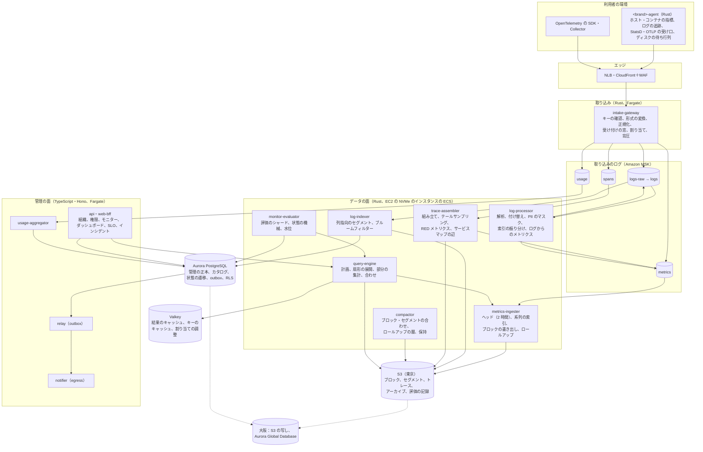

# Architecture: Datadog

全体像と横断的な方針。領域ごとの設計は、同じディレクトリに領域ごとのファイルとして置く（まだない。計画は 7 節）。品質の戦略は [quality.md](../quality.md)、Epic と Story は [roadmap.md](../roadmap.md)、SLO と運用は [runbooks/](../runbooks/README.md) にある。

## 1. 全体構成

### 1.1 コンテキスト

```
 利用者のシステム（ホスト、コンテナ、Kubernetes、サーバーレス、アプリ）
  <brand>-agent、OpenTelemetry の SDK と Collector、HTTP の API の送り手
      │ HTTPS（OTLP/HTTP、OTLP/gRPC、メトリクス・ログの API）。<Brand>-Api-Key
      ▼
┌──── 本システム（intake・otlp・api・app.<brand>.<domain>）────────────────────────────────┐
│  取り込み、メトリクス（TSDB とクエリ）、ログ（パイプライン、保存と検索）、トレース（組み立て、     │
│  サービスマップ）、モニターとアラート、ダッシュボード、SLO とインシデント、組織と権限、利用量の計測  │
└───────────────────────────────────────────────────────────────────────────┘
   ▲ Web の画面（運用の担当者、開発者）  ▲ 公開 API（アプリケーションキー）  │ 外向き
   │ SSO（SAML・OIDC）、SCIM               │ Terraform のプロバイダー         ▼
 利用者の組織の人                        利用者の自動化                     通知（メール、チャット、汎用の Webhook、
                                                                             オンコールのサービス）、課金のシステムへの利用量
```

### 1.2 コンテナ



| コンテナ | 責務 |
| --- | --- |
| `<brand>-agent` | 利用者のホストで動く。ホスト・プロセス・コンテナ（Docker・containerd・Kubernetes の kubelet）のメトリクス、ファイルとコンテナのログの追跡、StatsD（タグの拡張）と OTLP の受け口。送れないときはディスクの待ち行列（既定 2 GB）に溜め、待って送り直す。Rust の 1 つのバイナリ（[ADR-0001](../decisions/0001-platform-and-stack.md)） |
| `intake-gateway` | キーの確認、OTLP・StatsD・本システムの API の形式を内部の形式（Protobuf）に変換、タグの正規化と系列の鍵の計算、受け付けの窓の確認、テナントの割り当て、MSK への書き込みの確定の後に 202。状態を持たない（[ADR-0002](../decisions/0002-intake-log-on-msk.md)、[ADR-0003](../decisions/0003-tenancy-cells-and-isolation.md)） |
| MSK | 取り込みのログ。信号ごとのトピック、テナントごとのパーティションの組（シャッフルシャーディング）。保持 24 時間。データの面の WAL（[ADR-0002](../decisions/0002-intake-log-on-msk.md)） |
| `metrics-ingester` | パーティションを受け持ち、直近 2 時間をメモリーのヘッドに持つ。系列の索引、カーディナリティの上限、1 時間のブロックを S3 へ書き出し、1 分・1 時間のロールアップを同時に作る。シャードごとに 2 つの写し（[ADR-0004](../decisions/0004-tsdb-storage-engine.md)、[ADR-0006](../decisions/0006-cardinality-policy.md)） |
| `log-processor` | パイプライン（解析、付け替え、PII のマスク）、索引への振り分け（除外のフィルター、1 日の上限）、ログから作るメトリクス。結果を `logs` のトピックへ |
| `log-indexer` | 処理したログを列指向のセグメントにして S3 に置き、カタログ（Aurora）に載せる。セグメントごとにブルームフィルターと列の統計を持つ。アーカイブにも書く（[ADR-0005](../decisions/0005-log-storage-columnar-with-bloom.md)） |
| `trace-assembler` | `trace_id` でパーティションを分けたスパンを、トレースごとにまとめ、テールサンプリングで残すものを決める。残したトレースを S3 へ。すべてのスパンから RED メトリクスとサービスマップの辺を作り、`metrics` のトピックへ（traces-and-sampling の領域） |
| `compactor` | 小さなセグメントとブロックの合わせ、保持の層の移し（[ADR-0009](../decisions/0009-retention-tiers-on-s3.md)）、保持の期限の削除 |
| `query-engine` | クエリの IR の計画、時間とシャードへの扇形の展開、保存の側での部分の集計、合わせ、結果のキャッシュ。テナントごとの公平なキュー（[ADR-0007](../decisions/0007-query-language.md)） |
| `monitor-evaluator` | モニターをシャードに分け、評価の時刻ごとに、取り込みの水位を待ってクエリを実行し、グループごとの状態を遷移させる。遷移を Aurora と outbox に書く（[ADR-0008](../decisions/0008-monitor-evaluation-model.md)） |
| `api`・`web-bff` | 管理の面。組織、利用者、役割、キー、モニター・ダッシュボード・SLO・インシデントの定義、利用量の表示。TypeScript・Hono |
| `relay`・`notifier` | outbox を読み、通知（メール、チャット、Webhook、オンコールのサービス）を専用の egress から送る。重ねずに少なくとも 1 回 |
| `usage-aggregator` | 取り込みの段の利用量を時間ごとにまとめる（usage-and-billing の領域） |
| Aurora | 管理の面の正本（組織、利用者、定義、状態の遷移、利用量）、ログのセグメントのカタログ。FORCE RLS |
| S3 | データの面の正本（ブロック、セグメント、トレース、アーカイブ、評価の記録）。大阪へ CRR |
| Valkey | クエリの結果のキャッシュ、キーの確認のキャッシュ、割り当ての調整。失ってよい |

原則は 6 つ。

- **取り込みのログを背骨にする。** 取り込みは MSK に書いて確定したら 202 を返す。保存・索引・組み立て・計測は MSK を読む消費者で、互いに待たない。消費者が遅れても、利用者への応答は遅れない。読み直しで同じ結果になるように作る（[ADR-0002](../decisions/0002-intake-log-on-msk.md)）。
- **時間で区切り、不変のファイルにする。** メトリクスは 1 時間のブロック、ログとトレースは数十秒〜数分のセグメントにして S3 に置き、書き換えない。合わせと保持は新しいファイルを書いて古いものを消す（[ADR-0004](../decisions/0004-tsdb-storage-engine.md)、[ADR-0005](../decisions/0005-log-storage-columnar-with-bloom.md)、[ADR-0009](../decisions/0009-retention-tiers-on-s3.md)）。
- **計算をデータの近くへ押す。** クエリは保存の側で絞り込みと部分の集計を行い、合わせる側には集計の途中の値（合計・個数・最小・最大、スケッチ）だけを返す。
- **テナントはすべての鍵の先頭に。** MSK のパーティションの組、系列の鍵、S3 のパス、キャッシュの鍵、評価のシャードは `tenant_id` を持つ。割り当てと公平なキューを、取り込み・保存・クエリ・評価の各段に置く（[ADR-0003](../decisions/0003-tenancy-cells-and-isolation.md)）。
- **1 つのクエリの言語、1 つのエンジン。** 画面、API、モニター、SLO、ダッシュボードは同じ IR を同じエンジンで実行する（[ADR-0007](../decisions/0007-query-language.md)）。
- **評価は決定的に、水位を見て。** モニターは取り込みの水位で「データがそろった」ことを確かめてから評価し、入力の写しを残して再生できるようにする（[ADR-0008](../decisions/0008-monitor-evaluation-model.md)）。

### 1.3 主要な流れ

**A. メトリクスを受け取り、クエリに出す**

1. エージェントが 15 秒ごとに集めた点をまとめ、`intake.<brand>.<domain>` へ送る（圧縮した本文、`<Brand>-Api-Key`）。
2. `intake-gateway` がキーを確かめ（メモリーのキャッシュ、60 秒）、テナントを決める。タグを正規化し（小文字の鍵、値の長さの上限、並べ替え）、系列の鍵（`tenant_id`、指標の名前、並べたタグの 128 ビットのハッシュ）を計算する。受け付けの窓（過去 1 時間・未来 10 分）の外の点を拒んで数える。
3. テナントのトークンバケットで量を確かめる。超えたら 429 と `Retry-After` を返す（エージェントはディスクに溜めて待つ）。
4. テナントのパーティションの組から、系列の鍵のハッシュでパーティションを選び、MSK に書く。`acks=all` の確定の後に 202 を返す（[ADR-0002](../decisions/0002-intake-log-on-msk.md)）。
5. `metrics-ingester`（2 つの写し）がパーティションを読み、系列の索引を引く。新しい系列ならカーディナリティの上限を確かめる（[ADR-0006](../decisions/0006-cardinality-policy.md)）。点をヘッドのチャンクに圧縮して足す。この時点でクエリに出る。
6. 1 時間の区切りから 70 分たつと（遅れの窓 60 分＋猶予 10 分）、写しの片方（貸し出しの持ち主）がその時間のブロック（生の点、1 分・1 時間のロールアップ、系列の索引）を S3 に書き、ブロックの一覧（マニフェスト）とオフセットを確定する（[ADR-0004](../decisions/0004-tsdb-storage-engine.md)）。

**B. ダッシュボードのクエリ**

1. 画面がウィジェットのクエリ（`avg:system.cpu.user{env:prod} by {host}` の形）を送る。`web-bff` が IR にコンパイルし、役割のデータのアクセスの制限を AND で足す（[ADR-0007](../decisions/0007-query-language.md)）。
2. `query-engine` が窓を時間で分ける。直近 2 時間はインジェスター、それより前は S3 のブロック（窓が長ければロールアップの層）から読む計画を作る。
3. 各保存の側で、系列の索引でタグの条件を絞り、時間の集計（例：60 秒ごとの平均）と、グループのタグによる空間の集計の途中の値を作って返す。
4. 合わせる側が途中の値を合わせ、式と関数を当てる。直近 2 時間より前の部分の結果は、時間の区切りに合わせて Valkey にキャッシュする。

**C. モニターを評価して通知する**

1. `monitor-evaluator` のシャードが、受け持つモニターの評価の時刻 t（1 分ごと）に、取り込みの水位（全パーティションで t＋評価の遅らせ までの取り込みが反映済み）を待つ。
2. 同じ形のクエリをまとめて実行し、グループ（例：`host`）ごとの値を得る。状態の機械（OK・警告・アラート・データなし）に当て、回復の閾値・連続の回数・フラッピングの規則で遷移を決める（[ADR-0008](../decisions/0008-monitor-evaluation-model.md)）。
3. 遷移があれば、遷移・入力の写しの位置・通知の依頼を、Aurora の 1 つのトランザクションで書く（outbox）。`notifier` がチャネルへ送る。重ねないための鍵は（モニター、グループ、遷移の番号）。

**D. ログを受け取り、検索する**

1. ログは `logs-raw` に入り、`log-processor` が組織のパイプライン（解析、付け替え、PII のマスク）を当てる。マスクの前の値は、この段の外へ出さない。
2. 索引の規則（索引ごとのフィルター、除外のフィルター、1 日の上限）で、索引に入れるかを決める。すべてのログはアーカイブへ流れる。ログから作るメトリクスは、索引に入れるかに関わらず数える。
3. `log-indexer` が 10 秒か 64 MiB ごとに列指向のセグメントを S3 に置き、カタログに載せる。検索はカタログで時刻と索引を絞り、ブルームフィルターでセグメントを絞ってから、列を読む（[ADR-0005](../decisions/0005-log-storage-columnar-with-bloom.md)）。

**E. トレースを組み立てる**

1. スパンは `trace_id` でパーティションを選ぶので、1 つのトレースのスパンは 1 つの `trace-assembler` に集まる。
2. すべてのスパンから、サービス・リソースごとの RED メトリクスと、サービスの間の辺（呼び出しの数、エラー、所要時間）を数え、`metrics` のトピックへ送る。ヘッドサンプリングで間引かれたスパンは、重み（採択の確率の逆数）で数える。
3. 最後のスパンから 30 秒（最大 5 分）たったトレースを完成とみなし、テールサンプリングの規則（エラー、遅いもの、まれなもの、テナントの予算の中の確率の採択）で残すかを決める。残したトレースを S3 のセグメントに置く（traces-and-sampling の領域）。

### 1.4 本家の形（確かめたこと）

| 項目 | 本家 | 出典 |
| --- | --- | --- |
| サイト | 9 つ。日本は AP1 | [Datadog Sites](https://docs.datadoghq.com/getting_started/site/) |
| カスタムメトリクスの数え方 | 指標の名前とタグの値の組で 1 つ。時間ごとの数の月の平均。分布は組ごとに 5 つ、パーセンタイルでさらに 5 つ | [Custom Metrics Billing](https://docs.datadoghq.com/account_management/billing/custom_metrics/) |
| 受け付けの窓 | メトリクスは未来 10 分・過去 1 時間。ログは過去 18 時間。同じ時刻とタグの組は最後の値 | [Submit metrics](https://docs.datadoghq.com/api/latest/metrics/submit-metrics.md)、[Send logs](https://docs.datadoghq.com/api/latest/logs/send-logs.md)、[Historical Metrics Ingestion](https://docs.datadoghq.com/metrics/custom_metrics/historical_metrics/) |
| 保持 | メトリクス 15 か月。索引に入れたスパン 15 日か 30 日。ログはプラン | [Data collection, resolution and retention](https://docs.datadoghq.com/developers/guide/data-collection-resolution-retention/) |
| 時系列の保存 | Rust の LSM。Kafka のパーティションごとの取り込み、シャードごとの単一スレッド、段の圧縮、ファイルごとの時刻とブルームフィルター。Gorilla に倣った圧縮から SIMD のコーデックへ。系列の索引は別のサービス | [Rust timeseries engine](https://www.datadoghq.com/blog/engineering/rust-timeseries-engine/) |
| イベント（ログ）の保存 | オブジェクトストレージの上の列指向。書き込み・圧縮・読み出しを分け、Kafka から読む | [Introducing Husky](https://www.datadoghq.com/blog/engineering/introducing-husky/) |
| 分布 | 相対誤差を保証する、合わせられるスケッチ | [DDSketch](https://www.datadoghq.com/blog/engineering/computing-accurate-percentiles-with-ddsketch/) |
| ログの索引とアーカイブ | 索引ごとの除外のフィルター・保持・1 日の上限。索引に入らなくてもアーカイブとログからのメトリクスへ流れる。アーカイブからの再水和 | [Log Indexes](https://docs.datadoghq.com/logs/log_configuration/indexes/)、[Rehydrating](https://docs.datadoghq.com/logs/log_configuration/rehydrating/) |
| トレースのサンプリング | エージェントのヘッドサンプリング（1 秒 10 トレース）、エラーとまれなもののサンプラー。APM のメトリクスはサンプリングの前から | [Ingestion Mechanisms](https://docs.datadoghq.com/tracing/trace_pipeline/ingestion_mechanisms/)、[Ingestion Controls](https://docs.datadoghq.com/tracing/trace_pipeline/ingestion_controls/) |
| モニター | 評価の窓、評価の遅らせ（最大 24 時間）、データなしの扱いの選択肢、マルチアラート、回復の閾値 | [Monitor Configuration](https://docs.datadoghq.com/monitors/configuration/) |
| キー | API キーは組織の単位、既定 50 本。アプリケーションキーは利用者に属しスコープを持つ | [API and Application Keys](https://docs.datadoghq.com/account_management/api-app-keys/) |
| テールサンプリング、ホストの数え方、SLA、内部のクエリの計画の形 | 公式の資料で確かめられなかった（**未検証**） | — |

いずれも 2026-10-09 に確認。この設計は振る舞いを参考にするが、本家のコード・エージェント・内部の形式は使わない（[リポジトリ共通の ADR-0007](../../../../docs/decisions/0007-no-reuse-of-original-implementation.md)）。

**本家との意図した違い**：

| 項目 | 本家 | 本システム | 理由・根拠 |
| --- | --- | --- | --- |
| 分布のスケッチ | DDSketch（本家の設計） | OpenTelemetry の指数のヒストグラム（底 2、スケールで分解能を決める）を、保存とクエリの形にする | OTLP の分布をそのまま受けて変換の誤差を足さない。相対誤差と合わせやすさは同じ性質を持つ（distributions-and-sketches の領域で ADR にする） |
| トレースの SDK | 本家の言語ごとのトレーサー | 持たない。OpenTelemetry の SDK と Collector を使う | 作る量を核に集める。標準に寄せる |
| トレースのサンプリング | エージェントのヘッドサンプリングが主（テールは未検証） | ヘッドに加え、サーバーでテールサンプリングを行う | エラーと遅いトレースを確実に残す（traces-and-sampling の領域） |
| アーカイブの置き場所 | 利用者のクラウドのバケット | MVP は本システムの S3（東京）。利用者のバケットは MVP の後 | 書き込みの権限の設計を後にする。データの所在を国内に固める（法務の L2） |
| データの所在 | AP1 は日本。他のサイトもある | すべて日本（東京、DR は大阪） | 日本を最初の市場にする |
| ヘッダーとキー | 本家の名前を含む | `<Brand>-Api-Key`、`<brand>_ik_` | リポジトリ共通の ADR-0006 |

## 2. 規模の段階

| 段階 | 組織 | 監視するホスト | 有効な系列 | 取り込む点 | ログ | スパン | モニター（グループ） | クエリ | 構成 |
| --- | --- | --- | --- | --- | --- | --- | --- | --- | --- |
| S1（MVP） | 1,000 | 5 万 | 1 億 | 平均 500 万点/秒、ピーク 1,000 万点/秒 | 取り込み 50 TB/日（ピーク 1.5 GB/秒）、索引 10 TB/日 | 取り込み 200 万/秒、保持 10% | 50 万（グループ 1,000 万） | ピーク 3,000 件/秒（うちモニター 2,000） | 東京の 1 リージョン・3 AZ に 1 つのセル。MSK 1 クラスタ。大阪に管理の面のウォームスタンバイと S3 の写し |
| S2 | 1 万 | 50 万 | 10 億 | 平均 5,000 万点/秒、ピーク 1 億点/秒 | 500 TB/日、索引 100 TB/日 | 2,000 万/秒 | 500 万（1 億） | 3 万件/秒 | 東京に 4〜8 つのセル。大きな組織は専用のセル。セルの割り当ての表を全体で持つ |
| S3 | 5 万 | 300 万 | 60 億 | 平均 3 億点/秒、ピーク 6 億点/秒 | 3 PB/日、索引 500 TB/日 | 1 億/秒 | 3,000 万（6 億） | 20 万件/秒 | 東京に数十のセル。海外のリージョン（組織をリージョンに固定） |

- 数値は本システムの想定。本家の利用者の数、取り込みの量は、公開の資料で確かめなかった（**未検証**）。
- 点の量は、ホストあたり 1,500 系列（システム、コンテナ、統合のメトリクス）を 15 秒ごと、カスタムメトリクスと RED メトリクスを足して見込んだ。有効な系列は、直近 1 時間に点のあった系列。
- ログは組織あたり平均 50 GB/日、索引に入れる割合を 20% と見込んだ。スパンは要求あたり 20 スパンの平均。
- モニターは組織あたり 500、グループは 1 モニターあたり平均 20。
- S1 の保存（S3）は、メトリクスの生の点 1 点あたり平均 1.5 バイト（`tsdb-codec-poc` で確かめる）で 1 日 0.65 TB、ログのセグメント（圧縮で 1/8）で 1 日 6 TB の索引と 6 TB のアーカイブを見込む。
- 段階を上げる基準は infrastructure の領域、負荷と費用のモデルは capacity の領域で決める。

### 2.1 費用のモデル

利用量の単位（ホスト、カスタムメトリクス 100 系列、ログの取り込み 1 GB、索引 100 万件、スパン 1 GB）ごとの原価を、次の和で見る。単価は capacity の領域で、AWS の東京の公開の価格から入れる。

```
原価 = 取り込み（ゲートウェイの CPU、NLB・CloudFront の転送、MSK のブローカーと保存）
     ＋ データの面の計算（インジェスターのメモリーと NVMe、プロセッサー、組み立て、合わせ）
     ＋ S3（層ごとの保存、PUT・GET の要求、大阪への写し）
     ＋ クエリ（扇形の展開の計算、S3 の範囲の読み出し、キャッシュ）
     ＋ 評価（モニターのクエリ）
     ＋ 管理の面（Aurora、Valkey、Fargate）
```

- 最も大きいのは、インジェスターのメモリー（有効な系列に比例）と MSK（取り込みの量に比例）と見込む。系列の上限（[ADR-0006](../decisions/0006-cardinality-policy.md)）と、ログの索引の選び方が、原価の制御の主な手段になる。
- S1 の予算の仮の値（本システムの想定）は、カスタムメトリクス 100 系列・月あたり 0.5 USD、ログの取り込み 1 GB あたり 0.03 USD、索引 100 万件・15 日あたり 0.4 USD。capacity の領域で、PoC の計測と公開の価格で置き換える。

## 3. 非機能要件

| ID | 項目 | S1 の目標 | 備考 |
| --- | --- | --- | --- |
| NFR-001 | 取り込みの応答 | 受け付け（202）p99 300ms（本文 500 KB まで）。割り当ての超過は 429 と `Retry-After` で即時に返す | [ADR-0002](../decisions/0002-intake-log-on-msk.md) |
| NFR-002 | クエリに出るまで | 202 から、メトリクス p95 10 秒・p99 30 秒。ログ p95 20 秒・p99 60 秒。トレース（完成の判断の後）p95 90 秒。RED メトリクス p99 60 秒 | 本システムの水位の計測 |
| NFR-003 | クエリの速さ | メトリクス：1 時間の窓・結果 1,000 系列以下 p99 1 秒、1 日 p99 2 秒、15 か月（1 時間のロールアップ）p99 5 秒。ログ：15 分の検索 p95 1 秒、24 時間 p95 5 秒、ファセットの集計 p95 3 秒。トレース：ID で引く p99 1 秒 | [ADR-0007](../decisions/0007-query-language.md) |
| NFR-004 | モニターの評価 | 評価の予定の時刻（＋評価の遅らせ）から評価の完了まで p99 30 秒。遷移から通知の送信まで p95 10 秒。本システムの遅れでの誤ったデータなしの通知 0 件 | [ADR-0008](../decisions/0008-monitor-evaluation-model.md) |
| NFR-005 | 耐久性 | 202 を返したデータの消失 0。AZ の障害で RPO 0。リージョンの障害で、管理の面 RPO 1 分・RTO 1 時間。テレメトリーは RPO 30 分（S3 の写し）、取り込みの再開 RTO 1 時間、過去のデータのクエリ RTO 4 時間 | [ADR-0002](../decisions/0002-intake-log-on-msk.md)、[ADR-0009](../decisions/0009-retention-tiers-on-s3.md) |
| NFR-006 | 可用性 | 取り込み 月間 99.95%。クエリと画面 月間 99.9%。モニターの評価と通知 月間 99.95% | 本家の SLA は公式の資料で確かめなかった（**未検証**） |
| NFR-007 | 分離 | 他の組織・データのアクセスの制限の外のデータが届いた事象 0 件。割り当ての 10 倍を送るテナントがいる間も、他のテナントの NFR-002 と NFR-003 を満たす | [ADR-0003](../decisions/0003-tenancy-cells-and-isolation.md) |
| NFR-008 | 遅れたデータ | メトリクスは過去 1 時間・未来 10 分、ログは過去 18 時間まで受け、窓の中の遅れた点はロールアップを含めて正しく集計に入る。窓の外は拒み、拒んだ数を指標で見せる | [ADR-0004](../decisions/0004-tsdb-storage-engine.md) |
| NFR-009 | カーディナリティ | 組織ごとの有効な系列の上限（既定は契約の量の 2 倍）、指標ごとの上限（既定 10 万）、新しい系列の作成 1 万/秒（組織）。超過は溢れの系列に数え、5 分以内に利用者に知らせる | [ADR-0006](../decisions/0006-cardinality-policy.md) |
| NFR-010 | 集計の正しさ | 圧縮は値をビットで同じに戻す。ロールアップの合計・個数・最小・最大は正確。パーセンタイルの相対誤差 1.1% 以内（スケール 5 を保てる値の範囲の中） | [quality.md](../quality.md) |
| NFR-011 | ダッシュボード | 20 ウィジェットのダッシュボードの最初の表示 p95 2 秒。ライブの更新は 1 時間以下の窓で 30 秒ごと。同じ組織の同じクエリは 1 回の実行にまとめる | dashboards の領域 |
| NFR-012 | 利用量 | 参照の数え方との差 0.1% 以内。時間ごとの利用量が 2 時間以内に画面と API に出る | usage-and-billing の領域 |
| NFR-013 | エージェントの負荷 | 1,000 系列・ログ 1 MB/秒のホストで、CPU 1 コアの 2% 未満、メモリー 150 MB 以下。送れない間はディスクに 2 GB まで溜める | intake-and-agent の領域 |

## 4. 技術スタック

| 層 | 選定 | 理由 |
| --- | --- | --- |
| 管理の面の言語 | TypeScript（Hono＋Zod） | 他の題材と同じ（[ADR-0001](../decisions/0001-platform-and-stack.md)） |
| データの面の言語 | Rust（取り込み、インジェスター、ログの処理と保存、組み立て、クエリ、評価）。非同期は Tokio、シャードごとの単一スレッド | [ADR-0001](../decisions/0001-platform-and-stack.md)。共通の基盤からの外れ |
| エージェント | Rust の 1 つのバイナリ（Linux・Windows、コンテナのイメージ、Kubernetes の DaemonSet） | [ADR-0001](../decisions/0001-platform-and-stack.md) |
| 取り込みのログ | Amazon MSK（Kafka のプロトコル）。3 AZ、複製 3、`min.insync.replicas=2` | [ADR-0002](../decisions/0002-intake-log-on-msk.md)。共通の基盤（SQS・SNS）からの外れ |
| 取り込みの形式 | OTLP（gRPC・HTTP、Protobuf）、StatsD（タグの拡張）、本システムの JSON の API。内部は Protobuf | intake-and-agent、otlp-and-api-keys の領域 |
| 時系列の保存 | 自前の TSDB（ヘッドとブロック、`codec_id` 1 は Gorilla の形、ロールアップ）。S3 とインスタンスの NVMe のキャッシュ | [ADR-0004](../decisions/0004-tsdb-storage-engine.md) |
| ログ・トレースの保存 | 自前の列指向のセグメント（zstd、辞書、ブルームフィルター）を S3 に。カタログは Aurora | [ADR-0005](../decisions/0005-log-storage-columnar-with-bloom.md) |
| 分布 | 指数のヒストグラム（OpenTelemetry の形、最大 512 の区間、既定のスケール 5） | distributions-and-sketches の領域 |
| 管理の DB | Aurora PostgreSQL 18、FORCE RLS と `SET LOCAL`、ID は UUIDv7、outbox | [ADR-0003](../decisions/0003-tenancy-cells-and-isolation.md) |
| キャッシュ | ElastiCache Valkey | 他の題材と同じ。失ってよい部品 |
| 非同期（管理の面） | transactional outbox → SNS・SQS | 他の題材と同じ |
| 実行基盤 | 管理の面と状態を持たない部品は ECS Fargate。状態を持つデータの面（インジェスター、インデクサー、組み立て、クエリの読み手）は ECS の EC2 のキャパシティープロバイダー（NVMe を持つインスタンス） | [ADR-0001](../decisions/0001-platform-and-stack.md)。共通の基盤からの外れ |
| オブジェクトストレージ | S3（SSE-KMS とバケットキー、保持の層、大阪への CRR） | [ADR-0009](../decisions/0009-retention-tiers-on-s3.md) |
| IaC | Terraform | 他の題材と同じ |
| 自己監視 | OpenTelemetry（ADOT）→ 別の AWS アカウントの AMP・CloudWatch・Managed Grafana。呼び出しは CloudWatch のアラームとオンコールのサービスの直接の連携 | [runbooks/](../runbooks/README.md) の 5 節。observability の領域 |
| フラグ | AWS AppConfig | 他の題材と同じ |
| Web の画面 | React（TypeScript）、グラフは Canvas の自前の描画 | dashboards の領域 |
| テスト | Rust の `cargo test`・proptest・cargo-fuzz、Vitest・fast-check、自前の参照の実装と再生の枠、自前の負荷の生成器、Testcontainers（PostgreSQL 18、Valkey、Kafka）、LocalStack、Playwright | [quality.md](../quality.md) |

## 5. 主な決定

どれも `accepted`。0001〜0009 は最初の設計の起票。状態の一覧は [decisions/README.md](../decisions/README.md)。

| ADR | 決定 |
| --- | --- |
| [0001](../decisions/0001-platform-and-stack.md) | 管理の面は共通の基盤（TypeScript・Hono、Aurora、Fargate）を引き継ぎ、データの面（取り込み、保存、クエリ、評価）とエージェントは Rust で書く。状態を持つデータの面は ECS の EC2（NVMe）で動かす |
| [0002](../decisions/0002-intake-log-on-msk.md) | 取り込みのログに Amazon MSK を使い、MSK の確定の後に 202 を返す。信号ごとのトピック、テナントごとのパーティションの組、保持 24 時間。MSK はデータの面の WAL で、消費者は読み直しで同じ結果になるように作る |
| [0003](../decisions/0003-tenancy-cells-and-isolation.md) | 組織をテナントにし、共有のセルに置く（大きな組織は専用のセル）。データの鍵の先頭に `tenant_id`、管理の DB は FORCE RLS。取り込み・保存・クエリ・評価の各段に、割り当て、シャッフルシャーディング、重み付きの公平なキューを置く |
| [0004](../decisions/0004-tsdb-storage-engine.md) | 自前の TSDB：系列の鍵は 128 ビットのハッシュ、直近 2 時間をメモリーのヘッドに持ち、1 時間の不変のブロックを S3 に書く。`codec_id` 1 は時刻の差分の差分と値の XOR。ブロックの書き出しで 1 分・1 時間のロールアップ（合計・個数・最小・最大・最後、ヒストグラム）を作る。遅れの窓は 1 時間 |
| [0005](../decisions/0005-log-storage-columnar-with-bloom.md) | ログとトレースは、転置索引ではなく、列指向のセグメントとブルームフィルター（語と日本語の 2-gram）で保存・検索する。セグメントは S3、カタログは Aurora。索引とアーカイブを分ける |
| [0006](../decisions/0006-cardinality-policy.md) | 組織・指標ごとの有効な系列の上限と、新しい系列の作成の速さの上限を、インジェスターで強制する。超過は溢れの系列に数えて知らせる。組織は指標ごとに、クエリに残すタグを選べる |
| [0007](../decisions/0007-query-language.md) | 自前のメトリクスのクエリの言語（`集計:指標{条件} by {タグ}`、関数、式）と、ログ・トレースの検索の文法を持ち、すべてを型付きの IR にコンパイルして 1 つのエンジンで実行する。PromQL は MVP の後 |
| [0008](../decisions/0008-monitor-evaluation-model.md) | モニターは、シャードに分けた評価器が、決まった時刻に取り込みの水位を待ってクエリで評価する（流れの中の評価はしない）。グループごとの状態の機械で、遷移と入力の写しを残し、再生で同じ結果になる |
| [0009](../decisions/0009-retention-tiers-on-s3.md) | 保持の層：ホット（メモリー・NVMe）、ウォーム（S3 Standard）、コールド（S3 Glacier Instant Retrieval のアーカイブ）。メトリクスは生 15 日・1 分 63 日・1 時間 15 か月。ログの索引は 3・7・15・30 日、アーカイブは 1 年。保持はブロック・セグメントの単位で消す |

領域ごとの ADR は、7 節の番号の範囲で起票する。リポジトリ共通の決定（開発プロセス、ブランチモデル、本家の名前・接頭辞を使わない規則の [ADR-0006](../../../../docs/decisions/0006-brand-neutral-identifiers.md)、本家の実装を核に使わない規則の [ADR-0007](../../../../docs/decisions/0007-no-reuse-of-original-implementation.md)）は、ルートの [docs/decisions/](../../../../docs/decisions/README.md) にある。

## 6. リスクと未解決事項

品質の面のリスクの順位と対策は [quality.md](../quality.md) の 1 節にある。ここは設計の面のリスクを書く。

- **静かな値の誤り**：圧縮・合わせ・ロールアップの誤りは、エラーにならずにグラフの値を変える。利用者は誤った値で判断し、アラートが鳴らない。参照の実装との比べ、ブロックごとのチェックサムと統計の照合、見張りの系列で抑える（[ADR-0004](../decisions/0004-tsdb-storage-engine.md)、[quality.md](../quality.md)）。
- **カーディナリティの爆発**：利用者がリクエストの ID をタグに入れると、インジェスターのメモリーが尽き、同じシャードの他のテナントが巻き込まれる。系列の作成の速さの上限、テナントごとのメモリーの割り当て、溢れの系列で抑える（[ADR-0006](../decisions/0006-cardinality-policy.md)）。
- **取り込みの崩壊**：障害のときに全テナントの量が同時に増える。MSK の書き込みの上限に当たると、全員の取り込みが止まる。割り当て、優先度での間引き（エージェントの待ち行列に返す）、MSK の余裕（ピークの 2 倍）で抑える（[ADR-0002](../decisions/0002-intake-log-on-msk.md)、[ADR-0003](../decisions/0003-tenancy-cells-and-isolation.md)）。
- **誤ったアラートと鳴らないアラート**：本システムの遅れ・インジェスターの再起動・遅れたデータで、データなしや閾値の誤った判定が出る。水位を待つ評価、不完全の扱い、再生の試験で抑える（[ADR-0008](../decisions/0008-monitor-evaluation-model.md)）。
- **重いクエリ**：長い窓・多くの系列のクエリが、クエリの読み手と S3 の読み出しを使い切る。費用の見積もりでの受け付け、テナントごとの並行の上限、ロールアップの層の自動の選択で抑える（[ADR-0007](../decisions/0007-query-language.md)）。
- **テナントの漏れ**：結果のキャッシュの鍵、タグの値の補完、サービスマップ、ログのファセットの候補から、他の組織や制限の外のデータが漏れる。鍵の先頭の `tenant_id` とデータのアクセスの制限の IR への付加を、すべての経路で同じにする（[ADR-0003](../decisions/0003-tenancy-cells-and-isolation.md)）。
- **PII のマスクの漏れ**：パイプラインの規則の前の段（`logs-raw`）やエラーのログに、マスクの前の値が残る。`logs-raw` の保持を短くし（24 時間）、処理の外へ出さない（logs-pipeline の領域）。
- **自己監視の循環**：本システムが止まると、本システムで本システムを監視していれば気づけない。別のアカウントの独立した経路で監視し、外からの見張りで端から端まで確かめる（[runbooks/](../runbooks/README.md) の 5 節）。
- **テールサンプリングのメモリー**：完成を待つトレースをメモリーに持つ。長いトレース・大きな急増で溢れる。完成の待ちの上限、トレースあたりのスパンの上限、溢れたら確率の採択に落とす（traces-and-sampling の領域）。
- **法令**：法務の確認待ちの事項がある（[intent.md](../intent.md) の「法務の確認待ち」の L1〜L9）。結論が出るまで、そこに挙げた Epic の spec を承認しない。

### 決定（2026-10-09、既定案）

PM の方針（本家に寄せ、判断が要るところは推奨の既定案で進める）により、最初の設計で次のとおり決めた。法務の判断が要るものは決めず、[intent.md](../intent.md) の「法務の確認待ち」に残した。どれも領域の文書の工程と E1〜E13 の PoC・試験で覆りうる。

- **データの面の言語**：Rust。Go より、ガベージコレクションの止まりがなく、系列あたりのメモリーを詰められ、SIMD の圧縮を書きやすい（[ADR-0001](../decisions/0001-platform-and-stack.md)）。
- **取り込みのバス**：MSK。Kinesis は 1 シャードの上限と GB/秒の費用、自前の WAL は作る量で外した（[ADR-0002](../decisions/0002-intake-log-on-msk.md)）。
- **時系列の圧縮**：`codec_id` 1 は Gorilla の形（時刻の差分の差分、値の XOR）。文書と検証の例が多く、参照の実装と比べやすい。浮動小数点の別の圧縮（ALP など）は `tsdb-codec-poc` で比べ、良ければ `codec_id` 2 として足す（[ADR-0004](../decisions/0004-tsdb-storage-engine.md)）。
- **分布のスケッチ**：DDSketch ではなく、OpenTelemetry の指数のヒストグラム（底 2、最大 512 の区間、スケール 5 で相対誤差およそ 1.1%。最大と最小の比が 2^16（約 6.5 万倍。1ms〜1 分ほど）までを、スケール 5 のまま持てる。幅が広すぎればスケールを下げ、下げたことを結果に示す）を保存とクエリの形にする。OTLP の分布をそのまま受け、合わせるときはスケールを下げて揃える。本家の実装のライブラリは使わない（distributions-and-sketches の領域で ADR にする）。
- **ログの保存**：列指向とブルームフィルター。OpenSearch のような転置索引は、取り込みの GB あたりの索引の費用が重く、汎用の部品を核に据えることになる（[ADR-0005](../decisions/0005-log-storage-columnar-with-bloom.md)）。
- **トレースの SDK**：自前では持たず、OpenTelemetry の SDK を使う。W3C Trace Context の `traceparent` を正とし、`tracestate` の本システムの鍵は `<brand>`。
- **テールサンプリング**：完成の待ち 30 秒（最大 5 分）。規則の既定は、エラーのトレースをすべて、サービス・リソースごとに遅い上位 1%、まれな組を 1 秒 5 件、残りはテナントの予算の中の確率で採択（traces-and-sampling の領域）。
- **モニターの評価**：決まった時刻の評価（1 分ごと）。流れの中の評価は、S2 で評価の量が足りなくなったら別の ADR で足す（[ADR-0008](../decisions/0008-monitor-evaluation-model.md)）。
- **フラッピング**：回復の閾値（任意）、「N 回続けて」の条件（既定 1）、30 分に 6 回を超える遷移でフラッピングとし、通知を 1 回にまとめる（monitors-and-alerting の領域）。
- **インシデント管理**：MVP に軽いものを含める（宣言、重さ、担当、タイムライン、通知、振り返りの雛形）。オンコールの当番の表は持たず、外部のオンコールのサービスに渡す（slos-and-incidents の領域）。
- **RUM と合成監視**：MVP の後。RUM は法務の L4 の後。
- **アーカイブ**：本システムの S3（東京、Glacier Instant Retrieval）に 1 年。利用者のバケットは MVP の後（[ADR-0009](../decisions/0009-retention-tiers-on-s3.md)）。
- **自己監視**：別の AWS アカウントの AMP・CloudWatch と、外からの見張り（見張りの系列が出ること、見張りのモニターが鳴ること）で行う。本システムのモニターで本システムを呼び出さない（[runbooks/](../runbooks/README.md) の 5 節）。
- **本家の名前**：識別子は `<Brand>`・`<brand>`（リポジトリ共通の ADR-0006）。

持ち越し（法務、計測・PoC・選定で決めるもの）：

| 項目 | いつ・どう決めるか |
| --- | --- |
| 法務の確認待ち（L1〜L9） | [intent.md](../intent.md) の「法務の確認待ち」。結論まで、そこに挙げた Story の spec を承認しない |
| MSK のブローカーの構成、パーティションの数、費用 | E2 の前の `msk-throughput-poc` |
| 時系列のコーデックの比べ（Gorilla の形と ALP など） | E3 の前の `tsdb-codec-poc` |
| インジェスターの系列あたりのメモリー | E3 の前の `ingester-memory-poc` |
| ブルームフィルターの誤検出の率、日本語の 2-gram | E5 の前の `log-bloom-poc` |
| テールサンプリングの待ちとメモリー | E6 の前の `tail-sampling-memory-poc` |
| S2 のセルの分け方、大きな組織の専用のセルの基準 | infrastructure の領域 |
| 費用の単価（MSK、EC2、S3） | capacity の領域。公開の価格で入れる |
| 本家の振る舞いで未確認のもの（テールサンプリング、ホストの数え方、ログの保持の選択肢、SLA） | 各領域の文書で公式の資料で確かめる。確かめられなければ未検証のまま、本システムの値を使う |

## 7. 領域の文書（計画）

各領域の文書は、まだない。領域の担当は、下の表の番号の範囲の中で ADR を採番する（範囲の外に出るときは、この表を先に更新する）。持ち主は、どれも Dev が書き、下の「レビュー」の列のロールが確認する。

| ファイル | 範囲 | ADR | レビュー | 関わる Epic |
| --- | --- | --- | --- | --- |
| `intake-and-agent.md` | エージェント（収集、ログの追跡、StatsD、OTLP の受け口、ディスクの待ち行列、更新と配布）、`intake-gateway`（形式の変換、正規化、受け付けの窓、背圧、429・503 の返し方）、テナントの割り当ての調整 | 0010–0013 | QA、Ops | E2 |
| `otlp-and-api-keys.md` | OTLP の受け口（gRPC・HTTP、資源の属性とタグの対応、意味の規約）、取り込みのキーとアプリケーションキー（形式、ハッシュでの保存、スコープ、失効の伝わり、シークレットスキャン） | 0014–0015 | セキュリティ | E2 |
| `metrics-model-and-cardinality.md` | 指標の種類（gauge・count・rate・分布）、名前とタグの規則、系列の鍵、単位、カーディナリティの上限と溢れ、クエリに残すタグの選択 | 0016–0018 | QA | E3、E4 |
| `tsdb-storage-engine.md` | ヘッド、チャンクとコーデック、ブロックの形式、系列の索引、ブロックの書き出しと貸し出し、ロールアップ、合わせ、遅れたデータ、写しと再生、照合 | 0019–0023 | QA、Ops | E3 |
| `metrics-query-engine.md` | クエリの言語、IR、計画、扇形の展開、部分の集計、時間の揃え、補間、カウンターの戻り、関数と式、結果のキャッシュ、費用の見積もりと受け付け | 0024–0027 | QA | E4 |
| `distributions-and-sketches.md` | 指数のヒストグラム、スケールと合わせ、パーセンタイルの誤差、ロールアップでの扱い、OTLP と StatsD の分布の受け方 | 0028–0029 | QA | E4 |
| `logs-pipeline.md` | パイプラインの規則（解析、付け替え、属性の型）、PII のマスク（検出の種類、日本の番号の形式）、索引の振り分け、除外のフィルター、1 日の上限、ログから作るメトリクス、ライブテール | 0030–0032 | セキュリティ、QA | E5 |
| `log-storage-and-search.md` | セグメントの形式、ブルームフィルター、カタログ、合わせ、検索の文法、ファセット、保持、アーカイブ、再水和、削除の請求（法務の L5） | 0033–0036 | QA、Ops | E5 |
| `traces-and-sampling.md` | スパンのモデル、W3C Trace Context、ヘッドとテールのサンプリング、組み立て、トレースの保存、サービスマップ、RED メトリクス、トレースとログの結び付け | 0037–0040 | QA | E6 |
| `monitors-and-alerting.md` | モニターの種類、評価の窓と頻度、状態の機械、データなし、マルチアラート、回復の閾値とフラッピング、ミュートとダウンタイム、評価のシャードと再生 | 0041–0044 | QA、Ops | E7 |
| `notifications-and-integrations.md` | 通知のチャネル、本文の雛形と変数、重ねない仕組み、再試行、Webhook の署名、オンコールのサービスとの連携（解決の同期）、egress | 0045–0046 | セキュリティ、Ops | E8 |
| `dashboards.md` | ウィジェット、テンプレートの変数、クエリの束ね、ライブの更新、キャッシュ、共有、画面の描画 | 0047–0048 | QA | E9 |
| `slos-and-incidents.md` | SLO の種類、エラーバジェット、バーンレートのアラート、インシデントの宣言・重さ・タイムライン・振り返り | 0049–0050 | QA | E10 |
| `tenancy-and-rbac.md` | 組織、利用者、チーム、役割と権限、独自の役割、SSO・SCIM、データのアクセスの制限、監査ログ、サービスのアカウント | 0051–0053 | セキュリティ | E11 |
| `usage-and-billing.md` | 利用量の単位と数え方（ホスト、カスタムメトリクス、ログ、スパン）、計測の経路、時間ごとの集計、上限と通知、課金のシステムへの受け渡し | 0054–0055 | QA、PM | E12 |
| `security.md` | 脅威モデル、キーと秘密、暗号化と鍵、PII の扱い、通信の制限、監査、開示の請求の手順（法務の L1・L5・L6） | 0056–0058 | セキュリティ | E1、E11、E13 |
| `data-model.md` | データモデルの索引（管理の DB の表、S3 のパス、MSK のトピックとメッセージ） | なし（各領域の ADR を参照する） | QA | 全 Epic |
| `infrastructure.md` | AWS のアカウントとネットワーク、セルの構成と割り当て、EC2 のキャパシティー、MSK の構成、egress、DR（大阪）、段階を上げる基準 | 0059–0061 | Ops | E1、E13 |
| `observability.md` | 自己監視（別のアカウントの経路、見張りの系列とモニター、水位の計測）、SLI、ドッグフーディングの範囲 | 0062–0063 | Ops | E1、E13 |
| `capacity.md` | 負荷のモデル（点・ログ・スパン・クエリ・評価）、部品ごとの必要量、費用のモデル、負荷試験 | 0064 | Ops | E13 |
| `delivery.md` | CI/CD、データの面の段階のデプロイ（シャードごと、写しを片方ずつ）、形式のバージョンの更新の順序、エージェントの配布、フラグ、スキーマの変更 | 0065–0066 | QA、Ops | E1、E2、E13 |

- 次に採番する ADR は 0067。

## 8. Epic

Epic と Story の計画は [roadmap.md](../roadmap.md) にある（PM が持つ）。E1〜E13 が MVP（S1）。各 Epic の品質の重点と合否基準は [quality.md](../quality.md) の 5 節にある。

| Epic | 目的 |
| --- | --- |
| E1 | 基盤：AWS・Terraform・CI、Aurora と RLS、MSK、ECS（Fargate と EC2）、S3、フラグ、自己監視の独立した経路、監査ログ、大阪の骨格 |
| E2 | 取り込み：`intake-gateway`、キー、OTLP、割り当てと背圧、エージェント |
| E3 | 時系列の保存：系列の索引、ヘッド、コーデック、ブロック、ロールアップ、合わせ、保持の層 |
| E4 | メトリクスのクエリ：クエリの言語と IR、エンジン、分布、カーディナリティの制御 |
| E5 | ログ：パイプライン、PII のマスク、保存と検索、ライブテール、アーカイブと再水和 |
| E6 | トレース：組み立て、テールサンプリング、サービスマップ、RED メトリクス |
| E7 | モニター：評価のエンジン、状態の機械、データなし、マルチアラート、フラッピング、再生 |
| E8 | 通知と連携 |
| E9 | ダッシュボード |
| E10 | SLO とインシデント |
| E11 | 組織・権限・データのアクセスの制限・監査 |
| E12 | 利用量の計測 |
| E13 | 本番の準備と GA の判定：負荷試験、うるさい隣人の試験、DR の訓練、外部のペンテスト |
| E14 以降（MVP の後） | RUM、合成監視、異常検知、PromQL の互換、利用者のバケットへのアーカイブ、履歴のメトリクス、海外のリージョン |
