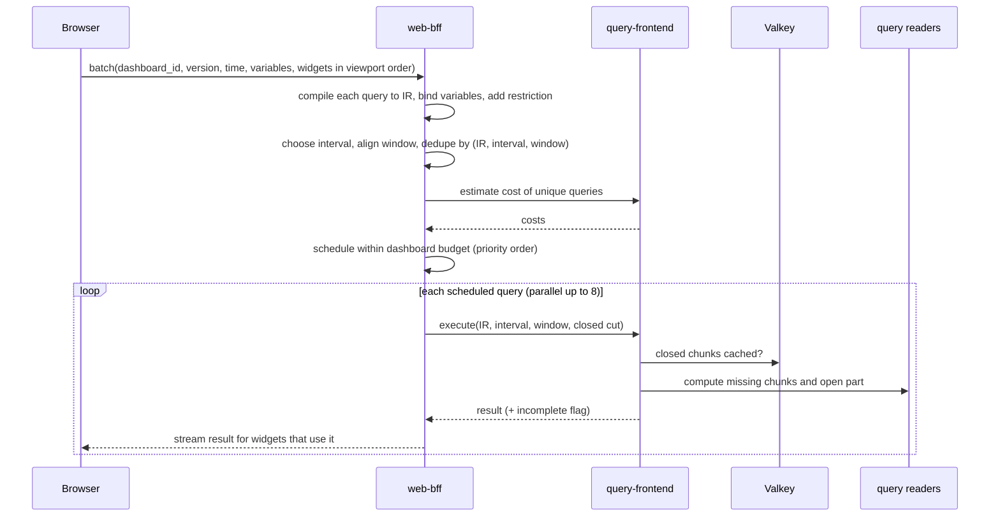

# Dashboards: Datadog

ダッシュボードを決める。ダッシュボードとウィジェットの定義とバージョン、テンプレートの変数、読み込みのクエリの束ねと重ねの除き、ダッシュボードごとの費用の予算、区間の揃えと閉じた時間の範囲のキャッシュ、ライブの更新、共有の範囲（公開のダッシュボードを持つか）を扱う。

前提となる決定は次のとおり。

- すべてのクエリは IR を通し、1 つのエンジンで実行する。データのアクセスの制限は IR に AND で足す。閉じた時間の部分の結果は（`tenant_id`、IR のハッシュ、区間、時間の区切り）で Valkey にキャッシュし、削除・保持の変更で組織の世代を上げる。費用の見積もりと受け付け、「不完全」の印（[ADR-0007](../decisions/0007-query-language.md)）
- クエリは組織ごとの並行の上限と重み付きの公平なキュー。評価のクエリとは別の読み手の組（[ADR-0003](../decisions/0003-tenancy-cells-and-isolation.md)）
- 20 ウィジェットの最初の表示 p95 2 秒、ライブの更新は 1 時間以下の窓で 30 秒ごと、同じ組織の同じクエリは 1 回の実行にまとめる（NFR-011）
- 画面は React（TypeScript）、グラフは Canvas の自前の描画（[architecture/README.md](README.md) の 4 節）
- 法務の確認待ち：L9（画面の配置・ウィジェットの見た目を本家にどこまで寄せるか）、L3（本システムの画面の計測）

この文書で決めたことは次の ADR にある。

| ADR | 決定 |
| --- | --- |
| [0047](../decisions/0047-dashboard-query-batching-and-caching.md) | ダッシュボードの読み込みは、見えている順に並べたウィジェットのクエリを 1 つの束の要求にし、`web-bff` で IR にコンパイルして重ねを除き、ダッシュボードごとの費用の予算の中で優先度の順に実行する。窓は区間に揃え、水位より前の閉じた部分をキャッシュし、開いた部分だけを計算し直す。ライブの更新は差分のポーリングで、同じ開いた部分は 15 秒の間 1 回の実行を共有する |
| [0048](../decisions/0048-dashboard-sharing-scope.md) | 共有は組織の中のリンクだけにし、見る人の権限（データのアクセスの制限）で描く。リンクの状態（時間の範囲、変数の値）はサーバーに置き、URL に値を入れない。公開（認証なし）の共有と、外部への埋め込みは MVP に入れず、法務の L1・L2・L7・L9 の後に別の ADR で決める |

## 1. 範囲

- 扱う：
  - ダッシュボードとウィジェットの定義、配置、バージョン
  - ウィジェットの種類と、それぞれのクエリの形
  - テンプレートの変数
  - 読み込みの束ね、重ねの除き、予算、優先度
  - 区間の選び方と揃え、閉じた部分のキャッシュ
  - ライブの更新
  - 共有の範囲、権限
- 扱わない：
  - クエリの意味、計画、費用の見積もりの単位（[metrics-query-engine.md](metrics-query-engine.md)）
  - ログの検索の実行（[log-storage-and-search.md](log-storage-and-search.md)）
  - 役割と権限の定義（[tenancy-and-rbac.md](tenancy-and-rbac.md)）
  - 本システムの画面の計測（E9 の `ui-analytics`。法務の L3）
  - 画面の見た目の細部（デザインの文書。法務の L9）

## 2. 要件

| 要件 | 目標 | NFR |
| --- | --- | --- |
| 最初の表示 | 20 ウィジェットのダッシュボードで、見えているウィジェットがすべて描けるまで p95 2 秒 | NFR-011 |
| ライブの更新 | 1 時間以下の窓で 30 秒ごと | NFR-011 |
| 重ねの除き | 同じ組織・同じ制限・同じ IR・同じ区間のクエリは、同時に 1 回だけ実行する | NFR-011 |
| 値の一致 | 束ね・キャッシュ・差分の更新の結果が、ウィジェットを単独で計算し直した結果と同じ | quality.md の 2.2.1 節 C |
| 分離 | キャッシュ・束ね・共有のリンクから、他の組織・別の制限のデータが出ない | NFR-007 |
| うるさい隣人 | 大きなダッシュボードを多くの人が開いても、他の組織のクエリの p99 が NFR-003 の中 | NFR-007 |

## 3. 本家の形（確かめたこと）

- 本家の共有のダッシュボードには、公開（リンクを知っていれば誰でも、既定で 1 年で期限）、招待（メールのアドレスかドメイン）、埋め込み（参照元の許可、またはサーバーで作るトークン）がある。見る人には作った人の権限でデータを見せる。時間の範囲の選び方が限られ、約 60 秒ごとに更新する。トポロジーの図、一覧のウィジェットなどは共有のダッシュボードで表示されない（[Shared Dashboards](https://docs.datadoghq.com/dashboards/sharing/shared_dashboards/)、2026-10-09 に確認）。
- ダッシュボードのウィジェットの数の上限、テンプレートの変数の数、ライブの更新の間隔は、確かめなかった（**未検証**）。

## 4. 定義

### 4.1 ダッシュボード

| 項目 | 内容 |
| --- | --- |
| `title`、`description`、`tags` | — |
| `layout` | 12 列の格子。ウィジェットごとに（`x`、`y`、`w`、`h`） |
| `widgets` | 4.2 節。`group` のウィジェットの中に入れ子 1 段 |
| `template_variables` | 5 節 |
| `default_time` | 既定の時間の範囲（`last_1h` など）とライブか |
| `edit_roles` | 編集できる役割・チーム（空なら `dashboards_write` の権限を持つ全員） |
| `version` | 保存のたびに 1 増える |

- 保存は楽観の排他：要求に読んだ `version` を付け、違えば 409 を返して画面で差分を見せる。
- 直近 100 のバージョンを `dashboard_versions` に持ち、戻せる。
- JSON の定義は Zod のスキーマで確かめ、Terraform のプロバイダーと公開 API で同じ形を使う。

### 4.2 ウィジェット

| 種類 | クエリ | 出力 |
| --- | --- | --- |
| `timeseries` | メトリクスのクエリ（式を含む）を 1〜10 | 系列の並び（線・面・棒） |
| `query_value` | 同上を窓で 1 つの値に畳む（`avg`・`sum`・`last` など） | 1 つの値と、条件の色 |
| `toplist` | グループの上位 N（既定 10、最大 100） | 並べた値 |
| `table` | 同じグループのタグの複数のクエリ | グループごとの行と、クエリごとの列 |
| `heatmap` | 分布の指標 | 時間 × 値の区間の件数（指数のヒストグラムの区間を揃えたもの） |
| `log_stream` | ログの検索（索引） | 新しい順の N 件（既定 50） |
| `slo` | SLO の ID | SLI とエラーバジェットの残り（[slos-and-incidents.md](slos-and-incidents.md)） |
| `note` | なし | Markdown（サニタイズ。HTML と画像の外のリンクの読み込みを許さない） |
| `group` | なし | ウィジェットの入れ物 |

- どのクエリも、保存のときに IR にコンパイルできることを確かめる（WASM の `query-lang`、[ADR-0007](../decisions/0007-query-language.md)）。

## 5. テンプレートの変数

- 定義：名前（`$env`）、タグの鍵（`env`）、既定の値（1 つか複数か `*`）、選べる値の制限（任意の一覧）、複数の選択の可否。ダッシュボードあたり 20 まで。
- **束ね方**：クエリの文の中の `$env` は、構文解析で変数の参照の節（IR の `VarRef`）になる。読み込みのときに値を束ねる：
  - 1 つの値 → `env:prod` の条件
  - 複数 → `env IN (prod, stg)`
  - `*` → その条件を取り除く
- 文字列の置き換えはしない。変数の値に `}`・`OR` を入れても、クエリの構造は変わらない（[ADR-0047](../decisions/0047-dashboard-query-batching-and-caching.md)）。
- 値の候補は、タグの値の補完（制限を足した IR、直近 1 時間に出た値の上位 1,000）から出す。
- 保存した表示（`saved_views`）：変数の値と時間の範囲に名前を付けて保存する。

## 6. 読み込み

[ADR-0047](../decisions/0047-dashboard-query-batching-and-caching.md)。

### 6.1 流れ

- 画面は、ダッシュボードの全ウィジェットのクエリを、見えている順（画面の上から、見えているものを先）に並べて 1 つの束の要求で送る。結果は終わったものからストリームで返す（HTTP のストリーミングの応答）。
- `web-bff` が、変数を束ね、見る人の役割の制限を足して IR にし、（IR のハッシュ、区間、揃えた窓）で重ねを除く。
- 同時の実行は 1 つの束あたり 8。

### 6.2 区間と揃え

- 系列あたりの点の目安 `n = min(ウィジェットの幅（ピクセル） ÷ 2, 300)`。
- 区間 `I` は、次の段の中で `窓 ÷ n` 以上の最小のもの：1・5・10・15・30 秒、1・2・5・10・15・30 分、1・2・4・12 時間、1 日。
- 窓の始まりを `I` の倍数に切り下げ、終わりを今（ライブ）か指定の終わりにする。区間の起点は UTC の 0 時（[ADR-0007](../decisions/0007-query-language.md)）。
- 例：幅 800 ピクセルのグラフで 1 時間の窓 → `n = 300`、`3600 ÷ 300 = 12 秒` → `I = 15 秒`、240 点。1 日 → `288 秒` → `I = 5 分`。7 日 → `2016 秒` → `I = 1 時間`（ロールアップの層を使う）。

### 6.3 予算と優先度

- ダッシュボードの 1 回の読み込みの予算は、重ねを除いたクエリの費用の見積もりの合計で持つ（費用の単位は [metrics-query-engine.md](metrics-query-engine.md)）。既定は「1 時間の窓・1,000 系列のクエリ」の費用の 40 倍。
- 見えている順に予算から引いていき、予算を超えたクエリは「保留」にして、画面がスクロールで見えたときに改めて要求する。
- 1 つのクエリが予算の 1/4 を超えるときは、区間を 1 段粗くして見積もり直す（最大 2 段）。粗くしたことをウィジェットに示す。
- ログの `log_stream` と `toplist` は、件数の上限（50・100）で費用が抑えられるので、見積もりに読むバイトを使う。

### 6.4 例

20 ウィジェット、34 のクエリ、1 時間の窓、見る人 1 人。

| 段 | 結果 |
| --- | --- |
| 重ねの除き | `timeseries` と `query_value` で同じ IR・同じ区間のものなど 7 つが重なり、27 の実行 |
| キャッシュ | 閉じた部分（6.5 節）は前の読み込みでほぼキャッシュにあり、各クエリで開いた最後の 30 秒〜数分だけを計算 |
| 予算 | 見えている 14 ウィジェットの 19 の実行が予算の中。下の 6 ウィジェットの 8 の実行は保留 |
| 時間 | 1 つの実行 p95 300 ms 前後、8 並行で 19 → 3 波で約 0.9 秒。最初の表示 p95 2 秒に収まる見込み（E9 の負荷試験で確かめる） |

### 6.5 閉じた部分のキャッシュ

- 切れ目 `cut = floor(min(水位, 今) − 2I, I)`。`[窓の始まり, cut)` は閉じた部分、`[cut, 窓の終わり)` は開いた部分。
- 閉じた部分は、区間 60 個ごとのかたまり（`I = 15 秒` なら 15 分）に分け、（`tenant_id`、制限のハッシュ、IR のハッシュ、`I`、かたまりの始まり）を鍵に Valkey に持つ（TTL 6 時間）。組織の世代（削除・保持の変更で上がる）を鍵に含める（[ADR-0007](../decisions/0007-query-language.md)）。
- 区間の揃えのおかげで、時間がたっても同じかたまりが同じ鍵になる。ライブの 1 時間の窓は、1 回の更新で新しいかたまりを高々 1 つ足す。
- `query-frontend` の時間の区切りのキャッシュ（ブロックの単位、[metrics-query-engine.md](metrics-query-engine.md)）とは別の層で、ダッシュボードの区間ごとの最終の結果を持つ。
- 「不完全」の結果はキャッシュしない。

## 7. ライブの更新

- 更新の間隔：窓 1 時間以下 30 秒、1 日以下 1 分、7 日以下 5 分、それより長い窓 15 分。
- 画面は、ウィジェットごとに前の結果の `cut` を覚え、`since = cut` を付けて束の要求を送る。サーバーは `since` からの区間（かたまりと開いた部分）だけを返し、画面は古い区間を捨てて新しい区間を足す。
- 同じ開いた部分（同じ鍵と `cut`）は、`query-frontend` で同時の実行を 1 回にまとめ（singleflight）、結果を Valkey に 15 秒持つ。壁の大きな画面で同じダッシュボードを 100 人が開いても、開いた部分の実行は 15 秒に 1 回。
- タブが隠れたら止める。操作のない 30 分で 5 分ごとに落とす。
- WebSocket を使わず、ポーリングにする（キャッシュとロードバランサーの扱いが単純で、差分で量が小さいため）。

## 8. 共有と権限

[ADR-0048](../decisions/0048-dashboard-sharing-scope.md)。

- ダッシュボードは、組織の中で `dashboards_read` の権限を持つ人が見られる。データは**見る人の役割の制限**で描く（同じダッシュボードでも、制限の違う人には違う系列が出る）。キャッシュの鍵に制限のハッシュを含めるので、制限の同じ人どうしだけがキャッシュを共有する。
- 共有のリンク：`https://app.<brand>.<domain>/s/<短い ID>`。リンクの状態（ダッシュボード、時間の範囲、変数の値、選んだウィジェット）はサーバーの `dashboard_share_links` に持ち、URL に変数の値（タグの値）を入れない。リンクを開くには組織へのログインが要る。
- **公開（認証なし）の共有と外部への埋め込みは MVP に入れない。** 利用者のテレメトリー（個人のデータを含みうる）を組織の外の誰にでも見せることになり、委託の範囲（L1）、データの所在（L2、国外からの閲覧）、利用規約（L7）、画面の寄せ方（L9）の確認が要る。本家は公開・招待・埋め込みを持つ（3 節）ので、意図した違いになる。MVP の後に、法務の結論の後で別の ADR で決める。そのときの設計の候補は、作った人ではなくダッシュボードに結んだ読み取りのサービスのアカウントの権限で描く、期限の既定 30 日、窓の選び方を限る、ログの一覧のウィジェットを出さない、とする。

## 9. 上限

| 対象 | 上限（既定） |
| --- | --- |
| 1 つのダッシュボードのウィジェット | 100 |
| 1 つのウィジェットのクエリ | 10 |
| テンプレートの変数 | 20 |
| 1 つのウィジェットの系列 | 500（超えたら IR に上位 500 の制限を足し、そのことを示す） |
| 組織のダッシュボード | 10,000 |
| 定義の JSON | 1 MiB |
| 保存したバージョン | 直近 100 |
| 共有のリンク | 組織 10 万、作成から 1 年で失効（延長できる） |
| 束の同時の実行 | 8 |

## 10. 障害のときの振る舞い

| 事象 | 起きること | 備え |
| --- | --- | --- |
| Valkey が落ちる | キャッシュが効かない | すべてを計算する。予算で保留が増える。読み込みは遅くなるが値は同じ |
| クエリの読み手の過負荷 | 実行が遅れる・429 | 組織の公平なキュー。ウィジェットに「混み合っている」を出し、次の更新で再試行 |
| シャードが答えない | 結果が欠ける | 「不完全」の印をウィジェットに出す。キャッシュしない |
| 水位が遅れる | 開いた部分が長くなる | `cut` が水位で決まるので、遅れの間は開いた部分を毎回計算する。値の誤りにはならない |
| 保存の衝突 | 409 | 画面で差分を見せ、選ばせる |

## 11. data-model への項目

| 表・置き場 | 中身 | 主キー・索引 | 節 |
| --- | --- | --- | --- |
| `dashboards`（組織の表） | 題、説明、タグ、今のバージョン、編集の役割、作った人、削除 | `(tenant_id, dashboard_id)` | 4.1 |
| `dashboard_versions`（組織の表） | 定義の JSON、作った人、時刻 | `(tenant_id, dashboard_id, version)` | 4.1 |
| `saved_views`（組織の表） | 変数の値、時間の範囲、名前 | `(tenant_id, dashboard_id, view_id)` | 5 |
| `dashboard_share_links`（組織の表） | 短い ID、ダッシュボード、状態の JSON、作った人、失効 | `(tenant_id, link_id)`、短い ID の一意（組織をまたいで一意にするため、短い ID は 128 ビットの乱数の base62） | 8 |
| Valkey | `dash:{tenant}:{restriction}:{gen}:{ir}:{I}:{chunk}`（閉じた部分）、`open:{...}:{cut}`（15 秒） | 失ってよい | 6.5、7 |

- 短い ID から組織を引くため、`dashboard_share_links` の短い ID の引きは RLS の外の経路になる。代わりに、短い ID を開くには先に組織へのログインを求め、セッションの組織で `SET LOCAL` してから引く（他の組織の ID なら「見つからない」）。RLS の外の表を増やさない。

## 12. テスト

- **PROP-DSH-001（束ねても同じ）**：任意のウィジェットの集まりで、束ね・重ねの除き・予算の順序で得た各ウィジェットの結果が、ウィジェットを単独で実行した結果と一致する。
- **PROP-DSH-002（キャッシュしても同じ）**：任意の時刻の列と水位で、閉じた部分のキャッシュと開いた部分の合わせが、キャッシュなしの全計算と一致する。削除・保持の変更の後に古い結果を返さない。
- **PROP-DSH-003（差分の更新）**：任意の更新の列で、差分で足し続けた画面の系列が、その時点で全部を読み直した系列と一致する。
- **PROP-DSH-004（変数）**：任意の変数の値（記号、`OR`、`}`、空、`*`）で、束ねた IR が、同じ条件を手で書いたクエリの IR と一致し、構造が変わらない。
- **漏れの経路**：制限の違う 2 人が同じダッシュボードを開いても、互いのキャッシュの結果が出ない。共有のリンクの短い ID を他の組織のセッションで開くと「見つからない」（[quality.md](../quality.md) の 2.2.1 節 G）。
- **E2E**（Playwright）：ダッシュボードの作成、変数の切り替え、ライブの更新、保存の衝突。
- **負荷**：20 ウィジェットの最初の表示 p95 2 秒、同じダッシュボードを 100 人が開いたときの実行の数（E9・E13）。

## 13. Story の候補

| Epic | Story | 中身 |
| --- | --- | --- |
| E9 | `dashboard-model` | 4 節 |
| E9 | `widgets-timeseries-and-more` | 4.2 節。画面の寄せ方は法務：L9 |
| E9 | `template-variables` | 5 節（PROP-DSH-004） |
| E9 | `query-batching-and-live` | 6・7 節（ADR-0047。PROP-DSH-001〜003） |
| E9 | `dashboard-sharing` | 8 節（ADR-0048。漏れの経路） |

## 14. 未解決の問い

### 決定

2026-10-09 の既定案。

- **読み込み**：束の要求、IR での重ねの除き、ダッシュボードの予算と優先度、ストリームで返す（ADR-0047）。
- **キャッシュ**：区間に揃えたかたまり、水位で決める切れ目、開いた部分の 15 秒の共有（ADR-0047）。
- **ライブ**：差分のポーリング（ADR-0047）。
- **変数**：IR の節として束ねる。
- **共有**：組織の中のリンクだけ、見る人の権限、状態はサーバーに（ADR-0048）。

### 持ち越し

| 問い | いつ・どう決めるか |
| --- | --- |
| 公開の共有・埋め込み | **法務の確認待ち：L1・L2・L7・L9** の後に、別の ADR で決める |
| 画面の配置・ウィジェットの見た目の寄せ方 | **法務の確認待ち：L9** |
| 画面の計測 | **法務の確認待ち：L3**（E9 の `ui-analytics`） |
| ダッシュボードの予算の倍率（40 倍）と同時の実行（8） | E9 の負荷試験 |
| 本家との違い（公開の共有を持たない、見る人の権限で描く） | architecture/README.md の 1.4 節に行を足すことを提案する（この文書の持ち主の範囲の外） |
| 本家のウィジェットの上限、更新の間隔 | 公式の資料で確かめなかった（**未検証**） |
