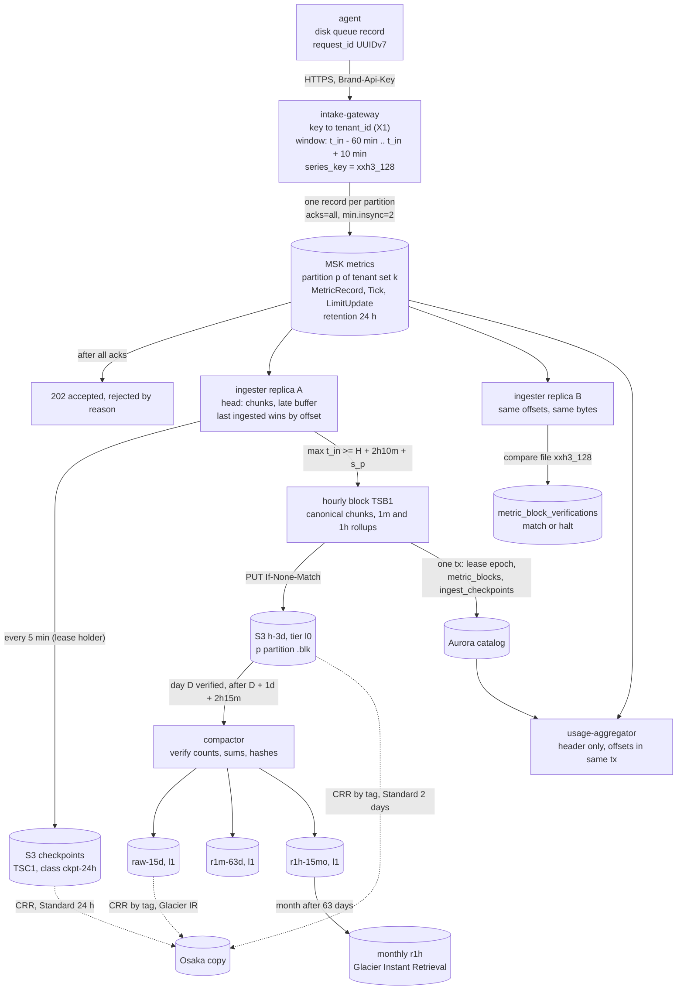

# Data model: Datadog

データモデルの正本。規約、置き場所、全体の ER 図、データの点の道筋、横断の不変条件、決めたことを、ここに置く。領域ごとの表の目録（列・キー・索引・CHECK・RLS・分割・保持・量）、ファイルの形式、Aurora の外の置き場所は [data-model/](data-model/) に置く。

- **列・制約・索引・ファイルの形式の正本は、このファイルと `data-model/` の各ファイル**である。領域の文書は振る舞いの正本で、各文書の「data-model への項目」の節は提案の記録として残す。両者が食い違ったら、このデータモデルに合わせて領域の文書を直す。
- 実装の変更（開発リポジトリの `changes/`）でマイグレーションや形式を変えるときは、同じ PR でここを更新する。Aurora の変更の順序は [delivery.md](delivery.md) の 7 節（広げる → 移す → 縮める）、形式の番号の更新の順序は同 6 節（読む側を先に、書く側を後に）。
- 方針の元は [ADR-0002](../decisions/0002-intake-log-on-msk.md)（MSK）、[ADR-0003](../decisions/0003-tenancy-cells-and-isolation.md)（テナント・セル・RLS・`maint`）、[ADR-0004](../decisions/0004-tsdb-storage-engine.md)（TSDB）、[ADR-0005](../decisions/0005-log-storage-columnar-with-bloom.md)（ログの保存）、[ADR-0009](../decisions/0009-retention-tiers-on-s3.md)（保持の区分と S3）、[ADR-0056](../decisions/0056-encryption-keys-and-secrets.md)（鍵）、[ADR-0057](../decisions/0057-data-lifecycle-and-deletion-framework.md)（ライフサイクル）、[ADR-0066](../decisions/0066-format-versioning-and-compatibility-windows.md)（形式の番号）。
- 「S1 の量」は、S1（組織 1,000、有効な系列 1 億、点 平均 500 万/秒、ログ 50 TB/日、スパン 200 万/秒、モニター 50 万）での**初期見積もり**である。元は [README.md](README.md) の 2 節と [capacity.md](capacity.md)。E13 の負荷試験で置き換える。
- 保持の期間の一部は**法務の確認待ち（L5・L6・L7）**である。結論まで、表の「保持」は既定の値を書き、[security.md](security.md) の 5.1 節と `maint.retention_policies` を正本にする。

## 1. ファイルの構成

| ファイル | 領域 | 表の数 |
| --- | --- | --- |
| [data-model/orgs-users-and-rbac.md](data-model/orgs-users-and-rbac.md) | 組織、利用者、セッション、所属、チーム、役割と権限、サービスのアカウント、データのアクセスの制限、SSO・SCIM、組織の設定、セルへの置き方と移し替え | 20 |
| [data-model/keys-and-intake.md](data-model/keys-and-intake.md) | 取り込みのキーとその索引、アプリケーションキー、OTLP の資源の属性、取り込みの割り当て、パーティションの組、エージェントの待ち行列 | 6 |
| [data-model/metrics-catalog-and-cardinality.md](data-model/metrics-catalog-and-cardinality.md) | 指標の情報、カーディナリティの上限と溢れ、クエリに残すタグの選択、系列の数の見積もり | 5 |
| [data-model/tsdb-formats.md](data-model/tsdb-formats.md) | 系列の鍵、ブロックのカタログ、確定の位置・貸し出し・写しの比べ、`TSB1`、`codec_id` 1・16、ロールアップ、ヘッド、`TSC1`、ヘッドの要約、照合 | 4 |
| [data-model/query-and-cache.md](data-model/query-and-cache.md) | クエリの受け付け、`RestrictedIr`、キャッシュの鍵、水位 | 1 |
| [data-model/logs-pipeline-and-indexes.md](data-model/logs-pipeline-and-indexes.md) | 設定の束のバージョン、パイプライン・処理器・引きの表、マスクの規則、索引・除外、ログから作るメトリクス、ファセット・ID の属性 | 10 |
| [data-model/log-segment-format.md](data-model/log-segment-format.md) | セグメント・アーカイブのカタログ、インデクサーの位置、再水和、削除の請求、`LSEG` 1、ブルームフィルター、墓標 | 6 |
| [data-model/traces.md](data-model/traces.md) | スパンのセグメント、時ごとの ID の索引、組み立ての位置、テールサンプリングの規則、`tidx` | 4 |
| [data-model/monitors-and-notifications.md](data-model/monitors-and-notifications.md) | モニター・バージョン・複合の子、遷移の記録、ダウンタイム、評価のシャード、通知の依頼・送信・試行・宛先・抑止、評価の記録 | 12 |
| [data-model/dashboards-slos-and-incidents.md](data-model/dashboards-slos-and-incidents.md) | ダッシュボード・バージョン・保存した表示・共有のリンク、SLO・除外・時の行・日の行、インシデント・番号・タイムライン・振り返り | 12 |
| [data-model/usage-and-billing.md](data-model/usage-and-billing.md) | 時間・ホスト・月の利用量、利用量の位置、数えたカタログの行、調整、契約、費用の上限 | 8 |
| [data-model/security-audit-and-lifecycle.md](data-model/security-audit-and-lifecycle.md) | outbox、アプリの秘密、サポートの許可、保持の方針、解約の消去、運用者のアクセス、監査の事象 | 6 |
| [data-model/ops-and-cells.md](data-model/ops-and-cells.md) | セル、DR の記録、入れ替え、形式の書く側の番号、キャパシティのレビュー（`maint`） | 5 |
| [data-model/stores.md](data-model/stores.md) | Aurora の外：MSK のトピックとメッセージ（制御のレコードと `Tick` を含む）、S3 のバケット・キー・タグ、Valkey、SNS・SQS、AppConfig、自己監視、NVMe | — |

合計：Aurora の 99 表（テナントの表 79、RLS の外の表 20：`public` 5・`maint` 15）。ER 図は 14 個（領域ごとに 13 個、4 節の全体図 1 個）。構造の図は 3 個（[`TSB1`](data-model/tsdb-formats.md)、[`LSEG`](data-model/log-segment-format.md)、5 節のデータの点の道筋）。バイトの並びを決めたファイルの形式は 9 個（`TSB1`、`codec_id` 1、`codec_id` 16、`TSC1`、`LSEG`、墓標 `LTMB`、`tidx`、`THBF`、`EVR1`）。

## 2. 置き場所

| 置き場所 | 中身 | テナントの分離 | 詳細 |
| --- | --- | --- | --- |
| Aurora PostgreSQL 18（リージョンに 1 つ。大阪に Global Database） | 管理の正本、カタログ、状態の遷移、outbox、利用量 | FORCE RLS と `SET LOCAL app.tenant_id`。RLS の外は 3.3 節の一覧だけ | 3 節、各 `data-model/` |
| MSK（セルごと） | 取り込みのログ（WAL）、制御のレコード、`Tick`、監査の事象 | メッセージの頭の先頭に `tenant_id`（認証の文脈から）。パーティションは組織の組 | [stores.md](data-model/stores.md) の 1 節 |
| インジェスターのメモリー（ヘッド） | 直近 約 2 時間 15 分の点、系列の索引 | 系列の鍵の入力の先頭に `tenant_id`。読み出しは `RestrictedIr` だけ | [tsdb-formats.md](data-model/tsdb-formats.md) の 5 節 |
| S3（リージョンにバケット 2＋log-archive、大阪に写し） | ブロック、チェックポイント、セグメント、アーカイブ、トレース、評価の記録、設定の束 | キーは `<cell>/<tenant_id>/…`。1 つのファイルに 1 つの組織。頭に `tenant_id` を持ち、読み手が確かめる | [stores.md](data-model/stores.md) の 2 節 |
| Valkey（セルごと） | 結果のキャッシュ、キーと権限のキャッシュ、割り当て、水位 | 鍵の先頭に組織、制限のハッシュと世代を含める。失ってよい | [stores.md](data-model/stores.md) の 3 節 |
| SNS・SQS | 通知の依頼、outbox の事象 | ID だけを運び、本文は組織の文脈で Aurora から読む | [stores.md](data-model/stores.md) の 4 節 |
| インスタンスの NVMe | 読み手のキャッシュ、チェックポイントの一時の置き場 | キャッシュの鍵の先頭に `tenant_id`。失ってよい | [stores.md](data-model/stores.md) の 7 節 |
| AppConfig | `release.*`・`ops.*`・`pii_defaults` | 組織のデータを持たない | [stores.md](data-model/stores.md) の 5 節 |
| selfmon のアカウント（大阪） | 自己監視の指標・ログ・見張り | ID と数と理由のコードだけ | [stores.md](data-model/stores.md) の 6 節 |
| エージェント | ディスクの待ち行列、ログの位置 | 利用者のホストの中 | [keys-and-intake.md](data-model/keys-and-intake.md) の 3 節 |

## 3. 規約

### 3.1 スキーマ

| スキーマ | 中身 | RLS |
| --- | --- | --- |
| `public` | テナントの表（79）と、RLS の外の登録簿 `users`・`user_mfa_factors`・`sessions`・`tenant_cells`・`intake_keys_index` | テナントの表は FORCE RLS（3.3 節）。登録簿はロールで絞る |
| `maint` | 組織を持たない運用の表（貸し出し、オフセット、照合、セル、入れ替え、形式、キャパシティ、保持の方針、DR、運用者のアクセス、解約の消去） | なし。保守と X2・X3・X4 のロールだけ |

- `maint` の表はテレメトリーの値・タグの値・ログの本文を持たず、組織の ID・オフセット・数・状態だけを持つ（[ADR-0003](../decisions/0003-tenancy-cells-and-isolation.md) の 2026-10-09 の注記）。

### 3.2 ID

| 種類 | 型 | 作り方 | 対象 |
| --- | --- | --- | --- |
| UUIDv7 | `uuid` | PostgreSQL 18 の `uuidv7()` | `tenant_id`、`user_id`、`key_id`、`monitor_id`、`dashboard_id`、`slo_id`、`incident_id`、`request_id`（通知）、`delivery_id`、`job_id`、`request_id`（削除）など、ほぼすべての行の ID |
| 決定的な 16 バイト | `bytea` | 決まった入力の xxh3_128（D-3） | `block_id`、`segment_id`、`file_id`（不変のファイルのカタログ。読み直しで同じ行になる） |
| 系列の鍵 | `bytea`（16） | `xxh3_128(tenant_id ‖ 名前 ‖ 並べたタグ)` | MSK、ヘッド、ブロック。Aurora には持たない（[tsdb-formats.md](data-model/tsdb-formats.md) の 1.1 節） |
| グループのハッシュ | `bytea`（16） | `xxh3_128(group_key)` | `monitor_transitions.group_hash`（D-11） |
| `log_id` | 16 バイト | 取り込みの時刻の 48 ビット＋乱数 80 ビット | MSK、セグメント。Aurora には持たない |
| `trace_id`・`span_id` | 16・8 バイト | OTLP のまま | セグメント、`tidx` |
| 秘密のハッシュ | `bytea`（32） | SHA-256（塩なし。乱数 190 ビット） | `intake_keys.key_hash`、`application_keys.key_hash`、`scim_tokens.token_hash`、`sessions.session_hash` |
| 組織の中の番号 | `bigint` | 行のロックの下で振る | `incidents.number`、`pipeline_config_versions.version`、`downtime_set_versions.version`、`monitor_versions.version` |
| 短い ID | `text` | 128 ビットの乱数の base62（22 文字） | `dashboard_share_links.short_id` |
| `tenant_ref` | `text` | `tenant_id` の base62（22 文字、秘密ではない） | アプリケーションキーと SCIM の端点（D-19） |
| `cell_id` | `text` | `<region>-c<n>`（例 `apne1-c1`） | `maint.cells`、S3 のキーの先頭、`maint` の表の主キー（D-2） |

- API と JSON では ID を UUID の文字列で返す。16 バイトの `bytea` の ID は 32 文字の 16 進で返す。

### 3.3 テナントと RLS

[ADR-0003](../decisions/0003-tenancy-cells-and-isolation.md) の形を、表の単位で次のように決める。

**テナントの表**（`tenant_id` を持ち、主キーとすべての索引の先頭に置く）。ポリシーは `tenant_id` だけで絞る。

```sql
ALTER TABLE <t> ENABLE ROW LEVEL SECURITY;
ALTER TABLE <t> FORCE ROW LEVEL SECURITY;
CREATE POLICY tenant_scope ON <t>
  USING      (tenant_id = current_setting('app.tenant_id')::uuid)
  WITH CHECK (tenant_id = current_setting('app.tenant_id')::uuid);
```

- `current_setting` の `missing_ok` を使わない。`app.tenant_id` がなければ問い合わせ自体が失敗する（安全側）。
- `app.tenant_id` は認証の文脈（取り込みのキー、セッション、アプリケーションキーの `tenant_ref`）からだけ決める。要求の本文やクエリの文字列から取らない。
- 組織をまたいで回す作業（X2）は、組織を 1 つずつ `SET LOCAL` してトランザクションを分ける。
- テナントの表の一覧は、各 `data-model/` のファイルの頭の表にある。CI のスキーマの検査は、すべてのテナントの表に FORCE RLS とこのポリシーがあることと、RLS の外の表が下の一覧と一致することを確かめる。

**RLS の外の表**（ADR-0003 の一覧の具体。D-1）。

| スキーマ | 表 | 読む・書くロール | ADR-0003 の項目 |
| --- | --- | --- | --- |
| `public` | `users`、`user_mfa_factors`、`sessions` | `auth` | 「`users`、`sessions`、メールアドレスから利用者の解決」（`user_mfa_factors` は利用者の一部。D-27） |
| `public` | `tenant_cells` | 書く `cell_assigner`（X4）、読む `intake`・`query`・`api` | 「`tenant_cells`」 |
| `public` | `intake_keys_index` | 読む `intake`（X1、関数だけ）、書く `api` | 「`intake_keys_index`」 |
| `maint` | `ingest_checkpoints`、`ingest_shard_leases`、`metric_block_verifications` | `ingester`（X2） | 組織を持たない運用の表 |
| `maint` | `eval_shard_leases` | `evaluator`（X2） | 同上 |
| `maint` | `indexer_offsets`、`assembler_offsets`、`usage_offsets` | `indexer`・`assembler`・`usage`（X2） | 同上 |
| `maint` | `cells`、`rollouts`、`format_versions`、`capacity_reviews`、`retention_policies`、`dr_events`、`operator_access_log` | `ops`（読むのは全ロール：`cells`・`retention_policies`・`format_versions`・`dr_events`） | 同上 |
| `maint` | `tenant_purge_runs` | `purge`（X2） | この工程で足した（D-27。ADR-0003 に注記） |

- ADR-0003 の「outbox の読み出しの位置、SLI の集計」は表を作らない。outbox の読み出しの位置は `outbox.relayed_at`・`notification_requests.relayed_at` とその部分索引で持ち（D-34）、SLI は selfmon の AMP で集計する（[stores.md](data-model/stores.md) の 6 節）。

**組織をまたぐ経路**（X1〜X4。それぞれ専用の DB のロールを通す。一覧にない経路を足すときは、先に ADR-0003 を直す）。

| 経路 | 中身 | DB のロール | 触れる表 |
| --- | --- | --- | --- |
| X1 | キーの確認 | `intake`（関数 `resolve_intake_key(key_hash)` だけ） | `intake_keys_index` |
| X2 | システムの作業：ブロック・セグメントの確定、合わせ、保持、利用量、評価、通知の送信、解約の消去。組織を 1 つずつ文脈に設定して回す | `ingester`・`compactor`・`indexer`・`assembler`・`evaluator`・`notifier`・`usage`・`limits`・`purge`・`deletion` | 各テナントの表、`maint` の各表 |
| X3 | `relay` の outbox の読み出し | `relay`（`outbox`・`notification_requests` の `SELECT` と `UPDATE (relayed_at)` だけ、`BYPASSRLS`） | `outbox`、`notification_requests` |
| X4 | セルの割り当てと移し替え、組織の作成 | `cell_assigner`（関数 `create_tenant()`、`move_tenant()`） | `tenant_cells`、`tenants`（作成）、`cell_moves`、`partition_set_changes`（移し替えの `k`） |

- ゲートウェイは、キーで決めた組織の文脈で `tenant_quotas`・`partition_set_changes`・`otlp_resource_attribute_rules` を読む（組織をまたぐ一括の読み出しをしない。D-20）。

### 3.4 DB のロール

サービスごとにロールを分ける。人の常時のアクセスはない（JIT と break-glass だけ。[security.md](security.md) の 8 節）。

| ロール | 使う | 主な権限 |
| --- | --- | --- |
| `migrator` | マイグレーション | 所有者。DDL |
| `api` | `api`・`web-bff` | テナントの表の読み書き（データの面が書く表は読むだけ）、`outbox`・`notification_requests`（インシデント）の `INSERT` |
| `auth` | ログイン、SSO、SCIM | `users`・`user_mfa_factors`・`sessions`、`memberships`・`team_members`・`role_assignments`（`source` が `sso`・`scim`・`jit` の行） |
| `intake` | `intake-gateway`・`intake-router` | X1 の関数、`tenant_cells` の読み出し、組織の文脈の `tenant_quotas`・`partition_set_changes`・`otlp_resource_attribute_rules` の読み出し |
| `ingester` | `metrics-ingester` | `metric_metadata` の `INSERT`、`metric_blocks` の `INSERT`、`cardinality_overflow_events`・`outbox` の `INSERT`、`maint.ingest_*`・`metric_block_verifications` |
| `compactor` | `compactor` | `metric_blocks`・`log_segments`・`log_archive_files`・`trace_segments`・`trace_hours` の書き込み、`retention_policies` の読み出し |
| `indexer`・`assembler` | `log-indexer`・アーカイブの書き手、`trace-assembler` | カタログの `INSERT`、`maint.indexer_offsets`・`assembler_offsets` |
| `evaluator` | `monitor-evaluator`・`slo-calculator` | `monitors`・`monitor_versions`・`downtimes`・`slos` の読み出し、`monitor_transitions`・`notification_requests`・`slo_hourly`・`slo_daily` の書き込み、`maint.eval_shard_leases` |
| `notifier` | `notifier` | `notification_deliveries`・`notification_attempts`、`notification_targets` の健康の列、`email_suppressions`、`incident_events` の `INSERT`、`integration_secrets` の読み出し（復号の鍵の方針も `notifier` だけ） |
| `usage` | `usage-aggregator`・`billing-export` | `usage_*`、`maint.usage_offsets`、カタログの読み出し、`intake_keys`・`application_keys` の `last_used_at` |
| `limits` | `limits-coordinator` | `cardinality_limits`・`cardinality_limit_overrides`・`metric_tag_selections`・`tenant_quotas` の読み出し |
| `query` | `query-frontend` | 組織の文脈のカタログ・`query_tenant_limits`・`tenants` の読み出し、`tenant_cells`・`maint.dr_events` の読み出し |
| `deletion` | `deletion-worker`・`rehydrator` | `deletion_*`・`rehydration_jobs`・`log_indexes`（履歴の索引）、カタログの `tombstone_gen` |
| `purge` | `tenant-purge` | 組織の行の削除、`maint.tenant_purge_runs` |
| `relay`・`cell_assigner` | X3・X4 | 3.3 節 |
| `ops` | 運用のツール | `maint` の運用の表。サポートの読み出しは、対象の組織の文脈（`SET LOCAL`）で `support_access_grants` を確かめてから、読み取りの役割で行う（組織をまたぐ経路にしない） |

- どのロールにも、追記だけの表（`monitor_transitions`・`incident_events`・`monitor_versions`・`pipeline_config_versions`・`downtime_set_versions`・`maint.operator_access_log`）の `UPDATE` を与えない。削除は保持のジョブ（分割を落とす）だけ。

### 3.5 Aurora の外のテナントの分離

データの面の保存は RLS で守れない（[ADR-0003](../decisions/0003-tenancy-cells-and-isolation.md)）。次の規則で守る。

| 置き場所 | 守り方 |
| --- | --- |
| MSK のメッセージ | 頭の先頭に `tenant_id`。ゲートウェイは認証の文脈から入れ、本文の `tenant_id` を拒む。`Tick` だけは組織を持たない |
| 系列 | 系列の鍵の入力の先頭に `tenant_id`。別の組織の同じ名前・タグは別の系列 |
| ブロック・セグメント・アーカイブ・`tidx`・評価の記録・チェックポイント | 1 つのファイルに 1 つの組織。キーは `<cell>/<tenant_id>/…`。頭に `tenant_id` を持ち、読み手は計画の `tenant_id` と比べてから読む（D-31） |
| クエリ | `query-frontend` は `RestrictedIr` だけを受ける。読み手も `tenant_id` と制限の節を確かめ直す（[query-and-cache.md](data-model/query-and-cache.md) の 3 節） |
| キャッシュ（Valkey、NVMe） | 鍵の先頭に組織、続けて制限のハッシュと世代 |
| S3 の運用のオブジェクト | 組織のデータを持つものは `<cell>/<tenant_id>/` の下だけ（D-39）。`<cell>/<role>/` の下は組織の ID と番号だけ |
| lint | S3 のキー・キャッシュの鍵を作る関数は `TenantId` を最初の引数に取るものだけ。データの面で `tenant_id` を本文・タグ・クエリの文字列から読むコードを禁止 |

### 3.6 時刻と単位

- Aurora の時刻は `timestamptz`（UTC で保存）。API は RFC 3339 の UTC で返し、画面は組織の時間帯（既定 `Asia/Tokyo`）で見せる。
- データの面の時刻は整数：メトリクスの点とブロックはミリ秒（`ts_ms`・`t_in_ms`）、ログとスパンはナノ秒（`timestamp_ns`・`start_ns`）。Aurora のカタログの `t_min`・`t_max` はマイクロ秒に切り捨てた値で、範囲の判断は切り捨てても外さない向き（`t_min` は切り下げ、`t_max` は切り上げ）にする。
- 時間の区切りは UTC の 1 時間（ブロック、`hour` の列）。利用量の月と請求は日本時間の暦の月（D-32）。日本時間は UTC と時間の区切りが揃う。
- 判断の時刻：データの面は取り込みの時刻と水位（ストリーム）で判断し、壁の時計を使わない。管理の面の期限（貸し出し、セッション、キー）は DB の `now()`。
- 単位：大きさはバイト（`bigint`）、件数は `bigint`、時間の長さは列の名前に単位を付ける（`_s`・`_ms`・`_ns`・`_days`）。割合は `numeric`（0〜1）、SLO の目標だけは百分率（`numeric(8,5)`）。
- 列の名前：時刻は `_at`、時間・日・月の区切りは `hour`・`day`・`month`・`minute`、期限は `expires_at`。

### 3.7 バージョンと形式の番号

| 値 | 置き場所 | 進め方 | 意味 |
| --- | --- | --- | --- |
| `codec_id` | チャンクの頭、ブロックの頭、`metric_blocks.codec_float`・`codec_hist` | 新しい ID を足す。古い ID の読み出しを消さない。1〜15 浮動小数点、16〜31 分布 | [ADR-0004](../decisions/0004-tsdb-storage-engine.md)、[ADR-0021](../decisions/0021-block-format-v1.md) |
| ブロックの形式 | `TSB1` の頭、`metric_blocks.format_version` | 新しい番号を足す（今は 1） | 同上 |
| `LSEG` の形式 | 頭、`log_segments.format_version` | 同上（今は 1） | [ADR-0033](../decisions/0033-log-segment-format-and-tokenizer.md) |
| `tokenizer_version` | フッター、カタログ | 上げても古い関数を残す。引く側はセグメントのバージョンで語を作る | 同上 |
| MSK の頭の `format_version` | すべてのメッセージ | 保持（24 時間）の後に古い番号を消してよい | [ADR-0066](../decisions/0066-format-versioning-and-compatibility-windows.md) |
| チェックポイント `TSC1`、評価の記録 `EVR1`・`EVS1`、`tidx`、`THBF`、墓標 `LTMB` | 各ファイルの頭 | 同上（チェックポイントは 24 時間、評価の記録は 30 日の後） | この文書（D-30） |
| `ir_version` | `monitor_versions`・`dashboard_versions`・`slos`・`log_metrics` | 文から毎回作る。上げる前に再生で比べる | [delivery.md](delivery.md) の 6.3 節 |
| `eval_code_version` | `monitor_transitions` | 再生は記録したバージョンのコードで行う | [ADR-0041](../decisions/0041-monitor-state-machine.md) |
| 書く側の番号 | `maint.format_versions` | 読む側が全セルに行き渡ってから、計画作業で上げる | [ADR-0066](../decisions/0066-format-versioning-and-compatibility-windows.md) |
| `pipeline_config_version`・`scrub_rules_version` | `pipeline_config_versions`、`logs` の各ログ | 変更のたびに上げる | [ADR-0030](../decisions/0030-log-pipeline-execution-model.md) |
| `downtime_set_version` | `downtime_set_versions`、遷移の記録 | 変更のたびに上げる | [ADR-0043](../decisions/0043-downtimes-as-evaluation-input.md) |
| `authz_version` | `tenants` | 役割・所属・データセット・チームの変更で上げる | [ADR-0051](../decisions/0051-roles-permissions-and-data-access-restrictions.md) |
| `query_cache_generation` | `tenants`、Valkey `qgen:` | 削除の請求・保持・タグの選択・制限の定義の変更で上げる | [ADR-0026](../decisions/0026-query-cache-and-admission.md) |
| `tombstone_gen` | カタログ、墓標のファイルの名前 | 墓標を書くたびに上げる（累積） | [ADR-0036](../decisions/0036-personal-data-deletion-tombstones.md) |
| `epoch` | 貸し出し、`LimitUpdate`、`cardinality_limits` | 持ち主・上限が変わるたびに上げる。古い `epoch` を拒む | [ADR-0017](../decisions/0017-cardinality-admission-via-control-records.md)、[ADR-0020](../decisions/0020-block-flush-commit-and-replay.md) |

- トリガーで、`authz_version`・`query_cache_generation`・`tombstone_gen`・`epoch`・`incident_counters.next_number` を下げる更新を拒む。
- **形式・圧縮・ロールアップ・評価の規則をフラグにしない。** どれもコードのバージョンとして出す（[AGENTS.md](../../AGENTS.md)）。

### 3.8 分割と保持

| 表 | 分割（S1） | DB に置く期間 | その後 |
| --- | --- | --- | --- |
| `metric_blocks` | `time_start` の月 | ブロックの保持（最長 15 か月）＋`deleted` の 14 日 | 中が空の分割を `DROP` |
| `log_segments`・`trace_segments`・`log_archive_files` | `hour` の月 | 区分の保持＋14 日（アーカイブ 1 年） | 同上 |
| `monitor_transitions` | `t` の月 | 90 日（D-11） | `DROP` |
| `notification_requests` | `created_at` の日 | 30 日 | `DROP` |
| `notification_deliveries`・`notification_attempts` | `request_created_at` の月 | 30 日 | 月の分割を `DROP`、月の途中は日次で消す |
| `cardinality_overflow_events` | `minute` の月 | 90 日 | `DROP` |
| `slo_hourly` | `hour` の月 | 92 日（D-28） | `DROP` |
| `slo_daily` | `day` の年 | 400 日 | 日次で消す |
| `incident_events` | `recorded_at` の月 | インシデントと同じ（**L6 の確認待ち**） | 落とさない |
| `usage_hourly` | `hour` の月 | 25 か月（**L7 の確認待ち**） | `DROP` |
| `usage_hosts_hourly` | `hour` の日 | 40 日 | `DROP` |
| `outbox` | `created_at` の日 | 全部送って 1 日 | `DROP` |
| `maint.operator_access_log` | `at` の月 | 1 年（**L6 の確認待ち**） | `DROP` |
| 分割しない表 | — | 各表の「保持」 | 日次のジョブ |

- 分割した表の主キーと一意の制約は、分割の鍵を含める（PostgreSQL の制約。D-4）。分割した表への外部キーは張らず、論理の参照にする（各 ER 図の注記）。
- 分割は `pg_partman` で先に作る（日 14 個、月 3 個、年 1 個）。大きな表の索引の追加は新しい分割から作り、古い分割は計画作業で足す（[delivery.md](delivery.md) の 7.1 節）。

### 3.9 保持の区分と S3 のタグ

- 区分（`class`）は [ADR-0009](../decisions/0009-retention-tiers-on-s3.md) の一覧（`h-3d`・`raw-15d`・`r1m-63d`・`r1h-15mo`・`idx-<N>d`・`rehyd-<N>d`・`archive-1y`・`audit-<N>d`・`eval-30d`・`ckpt-24h`）に、`config` を足す（D-40）。値の表は [stores.md](data-model/stores.md) の 2.1 節。
- カタログの `class` の列は、S3 のオブジェクトのタグ `class` と同じ値（D-5）。`tier`（`l0`・`l1`）もカタログに持つ（セグメント）。
- 正の削除はカタログを先に `deleting` にしてクエリの計画から外し、東京と大阪の両方のオブジェクトを消してから `deleted` にする。S3 のライフサイクル（保持＋1 日）は後ろの守り。バケットのバージョニングの古いバージョンは 7 日。

### 3.10 命名と型

- 表は英語の複数形の `snake_case`、列は `snake_case`、参照は `<単数形>_id`。主体を指す列は `principal_type`・`principal_id`、操作した人は `created_by`・`updated_by`・`requested_by`。
- 状態の列は `state`（インシデントだけは画面の言葉に合わせて `status`）。値は小文字の `snake_case`。モニターの状態だけは `OK`・`WARN`・`ALERT`・`NO_DATA`（決定表と同じ）。
- 列挙は `text` と `CHECK (… IN (…))`（PostgreSQL の enum を使わない。値を足すマイグレーションを広げるだけにするため）。
- 形の決まった入れ子で検索しないもの（`definition`、`config`、`bundle`、`events`、`counts`）は `jsonb`。形は `packages/contract` の Zod で検証してから書く。
- 配列は上限の小さい集合（タグの鍵、役割の ID、宛先の種類）だけ。
- 秘密は平文で持たない。ハッシュの列は `*_hash`、封筒の暗号化の列は `ciphertext`・`*_ciphertext`。
- 本家の名前を識別子に使わない。本システムが作る指標・タグは `<brand>.`、キーの接頭辞は `<brand>_ik_`・`<brand>_ak_`（[リポジトリ共通の ADR-0006](../../../../docs/decisions/0006-brand-neutral-identifiers.md)）。

### 3.11 暗号化

[ADR-0056](../decisions/0056-encryption-keys-and-secrets.md)、[security.md](security.md) の 4 節。鍵はデータの種類ごと・リージョンごとに分け、マルチリージョンの鍵を使わない。組織ごとの鍵（BYOK）を持たない。

| 鍵 | 使う場所 |
| --- | --- |
| `kms-telemetry` | S3 のブロック・セグメント・トレース・評価の記録・チェックポイント・設定の束 |
| `kms-archive` | S3 のアーカイブ（再水和の読み出しの権限を別のロールに絞る） |
| `kms-msk` | MSK の保存時 |
| `kms-aurora` | Aurora（大阪の二次は大阪の鍵） |
| `kms-secrets` | Aurora の封筒の暗号化の列（`integration_secrets`、`user_mfa_factors.totp_secret_ciphertext`、`deletion_requests.query_ciphertext`） |
| `kms-cache` | Valkey |
| `kms-audit` | log-archive の監査 |
| `kms-selfmon` | 自己監視のアカウント |

- ハッシュだけを持つ秘密：取り込みのキー、アプリケーションキー、SCIM のトークン、セッション（SHA-256）。パスワードは Argon2id。
- 消去は鍵の破棄ではなく、行とオブジェクトを本当に消すことで行う（[ADR-0057](../decisions/0057-data-lifecycle-and-deletion-framework.md)）。

### 3.12 セル

- セルは MSK・データの面・Valkey・S3 の接頭辞 `<cell>/` の単位（[ADR-0003](../decisions/0003-tenancy-cells-and-isolation.md)）。Aurora とバケットはリージョンで 1 つ。
- 組織 → セルは `tenant_cells`（区切り `from_ts` で複数の行。D-17）。データの面の運用の表（`maint` の貸し出し・オフセット）は `cell_id` を主キーの先頭に持つ。
- 移し替えは点の時刻の 1 時間の区切り `H` で書き込み先を分け、過去のファイルを写して確かめてから元を消す（[ADR-0053](../decisions/0053-child-orgs-and-tenant-cell-moves.md)、`cell_moves`）。

### 3.13 削除・墓標・消去

| 対象 | 方法 | 根拠 |
| --- | --- | --- |
| ブロック・セグメント（保持の期限、合わせの後） | カタログを `deleting` → 東京と大阪のオブジェクトを消す → `deleted` → 14 日で行を消す | [ADR-0009](../decisions/0009-retention-tiers-on-s3.md)、[ADR-0022](../decisions/0022-compaction-and-rollup-tiers.md) |
| ログ・スパンの個人のデータ | 墓標（`.tomb-<gen>`、カタログの `tombstone_gen`）で隠し、`compactor` の書き直しで消す。法的な保全の間は書き直しを止める | [ADR-0036](../decisions/0036-personal-data-deletion-tombstones.md)（期限は **L5**） |
| メトリクスのタグの個人のデータ | 系列ごとブロックを書き直して点を落とす。系列の表の墓標の欄は予約（L5 の結論まで 0） | [ADR-0021](../decisions/0021-block-format-v1.md)、[ADR-0057](../decisions/0057-data-lifecycle-and-deletion-framework.md) |
| 組織の解約 | `tenants.lifecycle_state`：`active → suspended → purging → purged`。`maint.tenant_purge_runs` で置き場所ごとに消して確かめる | [security.md](security.md) の 5.3 節（猶予は **L5・L7**） |
| 結果のキャッシュ | `tenants.query_cache_generation` を上げる | [ADR-0026](../decisions/0026-query-cache-and-admission.md) |
| 辺の表 | `role_assignments`・`dataset_grants`・`team_members` は取り消しで行を消す（履歴は監査ログ） | [ADR-0052](../decisions/0052-identity-sso-scim-keys-and-audit-trail.md) |
| 追記だけの表 | 更新しない。保持のジョブが分割を落とす | 3.4 節 |

## 4. 全体の ER 図

領域をまたぐ主な関係だけを描く。列は主キーと主な列だけで、詳細は各領域の図にある。

- 分割した表・`maint` の表・RLS の外の表との関係は論理の参照で、DB の外部キーを張らないものがある（各ファイルに書く）。
- 線は参照の向きで描く。子の側の参照の列が NULL を許すもの（任意の参照）と、`principal_type`・`object_kind` で先の表が分かれるもの（多態の参照）も `||--o{` で描き、各図の注記で「任意」「多態」と書く（Mermaid の書き方を 5 つの形に限るため）。

```mermaid
erDiagram
    tenants ||--o{ tenants : "parent of"
    tenants ||--|{ tenant_cells : "placed in"
    cells ||--o{ tenant_cells : "hosts"
    users ||--o{ memberships : "joins"
    tenants ||--o{ memberships : "has"
    tenants ||--o{ roles : "defines"
    roles ||--o{ role_assignments : "assigned"
    memberships ||--o{ role_assignments : "receives"
    tenants ||--o{ data_access_datasets : "restricts"
    tenants ||--o| tenant_settings : "configured by"
    tenants ||--o{ intake_keys : "owns"
    intake_keys ||--o| intake_keys_index : "indexed by"
    tenants ||--o{ application_keys : "owns"
    tenants ||--|{ partition_set_changes : "partition set"
    tenants ||--o{ metric_metadata : "names"
    metric_metadata ||--o{ metric_tag_selections : "keeps tags"
    tenants ||--o{ metric_blocks : "stores"
    cells ||--o{ ingest_checkpoints : "partitions"
    tenants ||--o{ pipeline_config_versions : "configures"
    tenants ||--o{ log_indexes : "routes"
    log_indexes ||--o{ log_segments : "contains"
    tenants ||--o{ log_archive_files : "archives"
    tenants ||--o{ trace_segments : "keeps"
    tenants ||--o{ trace_hours : "indexes"
    tenants ||--o{ monitors : "defines"
    monitors ||--|{ monitor_versions : "versioned"
    monitors ||--o{ monitor_transitions : "transitions"
    monitors ||--o{ notification_requests : "one request per evaluation"
    notification_requests ||--o{ notification_deliveries : "fans out"
    notification_targets ||--o{ notification_deliveries : "to"
    tenants ||--o{ dashboards : "has"
    tenants ||--o{ slos : "defines"
    slos ||--o{ slo_hourly : "hours"
    tenants ||--o{ incidents : "declares"
    incidents ||--|{ incident_events : "timeline"
    tenants ||--o{ usage_hourly : "metered"
    metric_blocks ||--o| usage_ingested_objects : "counted once"
    tenants ||--o{ outbox : "emits"
    tenants ||--o{ integration_secrets : "holds"

    tenants {
        uuid tenant_id PK
        uuid parent_tenant_id FK
        text lifecycle_state
        bigint authz_version
        bigint query_cache_generation
    }
    cells {
        text cell_id PK
    }
    tenant_cells {
        uuid tenant_id PK
        timestamptz from_ts PK
        text cell_id FK
    }
    users {
        uuid user_id PK
        text email_normalized UK
    }
    memberships {
        uuid tenant_id PK
        uuid user_id PK
    }
    roles {
        uuid tenant_id PK
        uuid role_id PK
    }
    role_assignments {
        uuid tenant_id PK
        text principal_type PK
        uuid principal_id PK
        uuid role_id PK
    }
    data_access_datasets {
        uuid tenant_id PK
        uuid dataset_id PK
    }
    tenant_settings {
        uuid tenant_id PK
    }
    intake_keys {
        uuid tenant_id PK
        uuid key_id PK
        bytea key_hash UK
    }
    intake_keys_index {
        bytea key_hash PK
        uuid tenant_id
    }
    application_keys {
        uuid tenant_id PK
        uuid key_id PK
    }
    partition_set_changes {
        uuid tenant_id PK
        timestamptz effective_hour PK
        smallint k
    }
    metric_metadata {
        uuid tenant_id PK
        text metric_name PK
        text type
    }
    metric_tag_selections {
        uuid tenant_id PK
        text metric_name PK
        timestamptz effective_hour PK
    }
    metric_blocks {
        uuid tenant_id PK
        bytea block_id PK
        timestamptz time_start PK
        text kind
        text state
    }
    ingest_checkpoints {
        text cell_id PK
        integer partition PK
        timestamptz flushed_hour
    }
    pipeline_config_versions {
        uuid tenant_id PK
        bigint version PK
    }
    log_indexes {
        uuid tenant_id PK
        uuid index_id PK
    }
    log_segments {
        uuid tenant_id PK
        bytea segment_id PK
        timestamptz hour PK
    }
    log_archive_files {
        uuid tenant_id PK
        bytea file_id PK
        timestamptz hour PK
    }
    trace_segments {
        uuid tenant_id PK
        bytea segment_id PK
        timestamptz hour PK
    }
    trace_hours {
        uuid tenant_id PK
        timestamptz hour PK
    }
    monitors {
        uuid tenant_id PK
        uuid monitor_id PK
    }
    monitor_versions {
        uuid tenant_id PK
        uuid monitor_id PK
        integer version PK
    }
    monitor_transitions {
        uuid tenant_id PK
        uuid monitor_id PK
        bytea group_hash PK
        bigint seq PK
        timestamptz t PK
    }
    notification_requests {
        uuid tenant_id PK
        uuid request_id PK
        text dedup_key UK
    }
    notification_deliveries {
        uuid tenant_id PK
        uuid delivery_id PK
    }
    notification_targets {
        uuid tenant_id PK
        uuid target_id PK
    }
    dashboards {
        uuid tenant_id PK
        uuid dashboard_id PK
    }
    slos {
        uuid tenant_id PK
        uuid slo_id PK
    }
    slo_hourly {
        uuid tenant_id PK
        uuid slo_id PK
        timestamptz hour PK
    }
    incidents {
        uuid tenant_id PK
        uuid incident_id PK
        bigint number UK
    }
    incident_events {
        uuid tenant_id PK
        uuid incident_id PK
        uuid event_id PK
    }
    usage_hourly {
        uuid tenant_id PK
        timestamptz hour PK
        text unit PK
        text class PK
    }
    usage_ingested_objects {
        uuid tenant_id PK
        text object_kind PK
        bytea object_id PK
    }
    outbox {
        uuid tenant_id PK
        uuid id PK
    }
    integration_secrets {
        uuid tenant_id PK
        uuid secret_id PK
    }
```



## 5. データの点の道筋

メトリクスの 1 つの点が、エージェントから S3 の層まで進む道筋。どの段も、出力とオフセットを同じ記録で確定し、読み直しで同じ結果を作る（[ADR-0002](../decisions/0002-intake-log-on-msk.md)）。



- **受け付けの窓と閉じる時刻**：点の時刻 `ts` は `t_in − 60 分 ≤ ts ≤ t_in + 10 分`。時間 `[H, H+1h)` は、パーティションの最大の `t_in` が `H + 2 時間 10 分 + s_p`（`s_p` は 0〜5 分）に届いたら閉じる。閉じた時間に点を足さない。
- **2 つの写し**：A と B は同じオフセットの範囲から、バイトまで同じブロックを作る。貸し出しの持ち主だけが PUT と確定を行い、もう一方は全体の xxh3_128 を比べる。
- **層**：時間のブロック（`h-3d`、`l0`）→ 日の 3 つのファイル（`l1`）→ 月の 1 時間のロールアップ（コールド）。ロールアップはどれも生の点から作る。
- ログ・スパンの道筋は同じ形で、出力が `LSEG` のセグメントとカタログ（`log_segments`・`trace_segments`）、位置が `maint.indexer_offsets`・`assembler_offsets` になる（[log-segment-format.md](data-model/log-segment-format.md)、[traces.md](data-model/traces.md)）。

## 6. 横断の不変条件

| 不変条件 | 守り方（DB・形式・試験） | 根拠 |
| --- | --- | --- |
| **202 は MSK の確定の後だけ** | `acks=all`、`min.insync.replicas=2`。応答の関数を確定の結果の型からだけ呼べる（lint）。一部の失敗は 503 | [ADR-0002](../decisions/0002-intake-log-on-msk.md)、[ADR-0011](../decisions/0011-intake-gateway-pipeline-and-watermark-ticks.md) |
| **`tenant_id` は認証の文脈からだけ、すべての鍵の先頭** | RLS のポリシー（3.3 節）、MSK の頭、系列の鍵の入力、S3 のキー、キャッシュの鍵、ファイルの頭。読み手は頭の `tenant_id` を確かめる（D-31） | [ADR-0003](../decisions/0003-tenancy-cells-and-isolation.md) |
| **出力より先にオフセットを進めない** | カタログの行と位置（`ingest_checkpoints`・`indexer_offsets`・`assembler_offsets`・`usage_offsets`）を 1 つのトランザクションで、前の位置を条件に書く。`log-processor` は Kafka のトランザクション | [ADR-0002](../decisions/0002-intake-log-on-msk.md)、[ADR-0020](../decisions/0020-block-flush-commit-and-replay.md)、[ADR-0040](../decisions/0040-trace-storage-and-id-lookup.md)、[ADR-0055](../decisions/0055-exactly-once-usage-aggregation-and-overage.md) |
| **2 つの写しはバイトまで同じブロックを作る** | 正規のチャンク、決定的な並べ方、汎用の圧縮を中に使わない（[tsdb-formats.md](data-model/tsdb-formats.md) の 3.1 節）。`metric_block_verifications`、ヘッドの要約、食い違いで `halted` | [ADR-0004](../decisions/0004-tsdb-storage-engine.md)、[ADR-0020](../decisions/0020-block-flush-commit-and-replay.md)、[ADR-0021](../decisions/0021-block-format-v1.md)、[ADR-0065](../decisions/0065-stateful-rollout-with-replica-handoff.md) |
| **遅れの窓は区切りから 70 分（＋0〜5 分）で閉じ、閉じた時間に点を足さない** | ゲートウェイの窓、閉じる条件 `H + 2h10m + s_p`、`ingest_checkpoints.flushed_hour` の条件つきの更新、`late_after_flush` の 1 件で呼び出し | [ADR-0004](../decisions/0004-tsdb-storage-engine.md)、[ADR-0020](../decisions/0020-block-flush-commit-and-replay.md) |
| **同じ系列・同じ時刻は後に取り込んだものが勝つ** | 同じ系列は 1 つのパーティション（[ADR-0019](../decisions/0019-partition-mapping-and-head-layout.md)）、オフセットの順。読み直しでも同じ | [ADR-0004](../decisions/0004-tsdb-storage-engine.md) |
| **水位はストリームだけから決まる** | `Tick` と生きているゲートウェイの最後の `t_in` の最小（`F_p`）。壁の時計を使わない（組み立ての 60 秒の例外は記録） | [ADR-0011](../decisions/0011-intake-gateway-pipeline-and-watermark-ticks.md)、[ADR-0008](../decisions/0008-monitor-evaluation-model.md)、[ADR-0037](../decisions/0037-trace-assembly-and-completion.md) |
| **圧縮は可逆、`codec_id` は使い回さない** | `codec_id` 1 はビットのまま XOR、16 は汎用の圧縮なし。新しい ID を足し、古い読み出しを消さない。`maint.format_versions` | [ADR-0004](../decisions/0004-tsdb-storage-engine.md)、[ADR-0021](../decisions/0021-block-format-v1.md)、[ADR-0066](../decisions/0066-format-versioning-and-compatibility-windows.md) |
| **ロールアップは生の点から決まる値だけ** | 合計・個数・最小・最大・最後、分布はヒストグラム。平均は持たない。1 時間を 1 分から作らない | [ADR-0004](../decisions/0004-tsdb-storage-engine.md)、[ADR-0022](../decisions/0022-compaction-and-rollup-tiers.md) |
| **確かめてから消す** | 合わせは統計の区画の `point_count`・`raw_sum`・`canonical_xxh3_64` が一致してからカタログを入れ替え、10 分の後に消す。保持の削除はカタログが先 | [ADR-0022](../decisions/0022-compaction-and-rollup-tiers.md)、[ADR-0009](../decisions/0009-retention-tiers-on-s3.md) |
| **ログ・スパンから作る系列は 1 つの書き手だけが出す** | `derived-partials`（鍵は系列の鍵）→ `derived-metrics-aggregator`。出どころごとの折り込み済みの刻みで重ねを除く | [ADR-0032](../decisions/0032-index-routing-and-derived-metrics.md)、[ADR-0039](../decisions/0039-red-metrics-and-service-map-before-sampling.md) |
| **利用量は 1 回だけ数える** | `usage_offsets` の条件つきの更新と `usage_hourly` の加算を 1 トランザクション。カタログの行は `usage_ingested_objects` の一意。`logs` は `src_positions` でも除く | [ADR-0055](../decisions/0055-exactly-once-usage-aggregation-and-overage.md) |
| **クエリのエンジンは組織をまたいで読まない（`RestrictedIr`）** | `query-frontend` は `RestrictedIr` だけを受ける（型と lint）。述語は葉のすべてに AND。キャッシュの鍵に制限のハッシュと世代 | [ADR-0051](../decisions/0051-roles-permissions-and-data-access-restrictions.md)、[ADR-0007](../decisions/0007-query-language.md)、[ADR-0026](../decisions/0026-query-cache-and-admission.md) |
| **モニターの `step()` は決定的** | 入力は `monitor_versions`・前の状態・値と完全さ・`t`。グループは鍵の順。遷移の記録にバージョン・`downtime_set_version`・`authz_version`・`eval_code_version`・入力の写しの位置。再生で同じ遷移 | [ADR-0041](../decisions/0041-monitor-state-machine.md)、[ADR-0008](../decisions/0008-monitor-evaluation-model.md)、[ADR-0043](../decisions/0043-downtimes-as-evaluation-input.md) |
| **不完全の評価でデータなし・回復に遷移しない** | `monitor_transitions.complete`。水位の待ちの上限 5 分。DR の失った範囲（`maint.dr_events.loss_ranges`） | [ADR-0008](../decisions/0008-monitor-evaluation-model.md)、[ADR-0061](../decisions/0061-dr-stage-up-and-cell-expansion.md) |
| **通知を重ねない** | `notification_requests.dedup_key` の一意、送信の行の `(request_id, target_id, unit)` の一意、`<Brand>-Delivery-Id` | [ADR-0045](../decisions/0045-notification-delivery-model.md) |
| **マスクの前の値を索引・保存に入れない** | `logs-raw`（24 時間）と `log-processor` のメモリーだけ。`logs` と `derived-partials` にはマスクの後だけ。`scrub_rules_version` | [ADR-0031](../decisions/0031-pii-scrubbing-before-routing.md) |
| **ブルームフィルターに偽陰性がない** | 作る側と引く側で同じ `tokenizer_version` の関数。セグメントがバージョンを持つ | [ADR-0033](../decisions/0033-log-segment-format-and-tokenizer.md) |
| **墓標の行は返さない** | 読み手は条件の前に墓標を当てる。墓標のあるセグメントで辞書の近道を使わない。キャッシュの世代を上げる | [ADR-0036](../decisions/0036-personal-data-deletion-tombstones.md) |
| **指標の型は最初の 1 つで固定** | `metric_metadata` の `INSERT … ON CONFLICT DO NOTHING`、`type` の更新を拒むトリガー | [ADR-0016](../decisions/0016-metric-types-and-cumulative-conversion.md) |
| **1 つのファイルに 1 つの組織** | ブロック・セグメント・アーカイブ・`tidx`・評価の記録・チェックポイントは `<cell>/<tenant_id>/` の下（D-39） | [ADR-0003](../decisions/0003-tenancy-cells-and-isolation.md) |

## 7. この工程で決めたこと（2026-10-09）

領域の文書と ADR の間で、名前・列・置き場所が決まっていなかったところを、推奨の案で決めた。ADR の決定は変えていない。[README.md](README.md) の 6 節にも要点を書いた。

| # | 決めたこと | 理由 |
| --- | --- | --- |
| D-1 | スキーマは `public` と `maint`。RLS の外の表は `public` の 5 と `maint` の 15（3.3 節） | ADR-0003 の一覧を表の名前で具体にし、CI で照らせるようにする |
| D-2 | セルの列の名前は `cell_id`（領域の文書の `cell` を直した） | `tenant_cells.cell_id` と揃える |
| D-3 | 不変のファイルのカタログの ID（`block_id`・`segment_id`・`file_id`）は、決まった入力の xxh3_128 の 16 バイト | 読み直し・作り直しで同じ行になり、確定が冪等になる |
| D-4 | 分割した表の主キー・一意の制約は分割の鍵を含める。分割した表へは外部キーを張らない | PostgreSQL の分割の制約 |
| D-5 | カタログの `class` は保持の区分（S3 のタグと同じ）。ブロックの種類は `kind`。`superseded_by` の代わりに `compaction_run_id` と `superseded_at` | 時間のブロックと日のファイルは多対多で、1 つの参照の列に収まらない |
| D-6 | カタログの状態を `active`・`superseded`・`deleting`・`deleted` に揃えた（ログの `replaced` を直した） | 合わせと保持の削除を同じ規則で扱う |
| D-7 | `metric_block_stats` の表を作らない。見積もりはブロックの統計の区画を範囲の GET で読み、`series_count` を代わりの上限にする | 指標 × 時間のブロックの行は 1 時間 約 1,200 万行で Aurora に合わない。統計はブロックに既にある |
| D-8 | `metric_metadata.source`（送り手）と `conversion`（分布の取り込みの変換）を分けた | 2 つの領域の文書が同じ列に別の意味の値を入れていた |
| D-9 | `cardinality_limits`（組織）と `cardinality_limit_overrides`（指標）に分けた | 主キーを NULL なしで持つ |
| D-10 | `cardinality_overflow_events` の主キーに `partition` を足す。貸し出しの持ち主だけが書き、同じトランザクションで `outbox` に知らせを書く | パーティションごとに 1 分 1 行。`api` が組織をまたいで新しい行を探さない |
| D-11 | `monitor_transitions` はグループを `group_hash` で持ち、主キーに `t` を含め、保持は 90 日 | 長いグループの鍵を主キーに入れない。量（90 日で 約 13 億行）を Aurora の容量に収める |
| D-12 | 評価の主体の列：`eval_principal_type`（`roles`・`team`・`service_account`）、`eval_principal_id`、`eval_role_ids`（保存した時点の役割の写し）。`slos` も同じ | monitors（作った人の役割）と tenancy（チームかサービスのアカウント）の書き方を 1 つにする |
| D-13 | ダウンタイムはバージョンの行にし、`downtime_set_versions.members` は（ID、バージョン）の組。複合の子は複合のバージョンごと | 再生で、その時の定義を正しく使う |
| D-14 | 通知の依頼は `dedup_key` で一意。送信の行の分割の鍵は依頼の作成の時刻。ふだんの再試行は SQS の遅延、組織ごとの掃除は回復だけ | 分割した表の一意の制約に分割の鍵が要る。組織をまたぐ索引を作らない |
| D-15 | 通知の宛先の秘密は `integration_secrets` に置き、`notification_targets.secret_id` で指す | security の `integration_secrets` と notifications の「設定は暗号化」を 1 つにする |
| D-16 | `tenant_settings` の表を定義し、各領域の「`tenant_settings` に足す列」を集めた。アプリケーションキーの送り元の範囲は組織ごと（`application_keys` の列にしない） | tenancy の 7.3 節（組織ごと）に合わせる |
| D-17 | `tenant_cells` の主キーは `(tenant_id, from_ts)`。1 つの組織に区切りごとの行 | ADR-0053 の「`(tenant_id, new_cell, from_ts = H)` を足す」を表にする |
| D-18 | データセットのタグの鍵は `data_access_outside_policy` に持ち、データセットは外部キーで参照する | 「信号ごとにタグの鍵は 1 つ」を DB で守る |
| D-19 | SCIM の端点の URL に `tenant_ref` を入れ、RLS の中でトークンを引く | RLS の外の表を増やさない（アプリケーションキーと同じ形） |
| D-20 | ゲートウェイは、キーで決めた組織の文脈で割り当て・パーティションの組・資源の属性の規則を読む | X1 の経路を増やさない |
| D-21 | 組織の作成（申し込み・子の組織）は X4 の関数 `create_tenant()` で、`tenant_cells` の最初の行と同じトランザクション | 新しい行の `tenant_id` は作る人の文脈と違う |
| D-22 | `log_indexes.kind`（`standard`・`audit`・`rehydrated`）。監査の索引と履歴の索引も同じ表 | カタログの `index_id` を 1 つの表で引く |
| D-23 | 索引の 1 日の上限の Valkey の鍵を `idxq:{tenant_id}:{index_id}:{day}` にした | 取り込みの割り当ての `quota:` と名前が紛れる |
| D-24 | 権限の名前を `logs.data.delete`・`dashboards.read`・`dashboards.write` に揃えた | `<領域>.<対象>.<操作>` の規則（ADR-0051） |
| D-25 | `processor_batches` は S3 のオブジェクトにし、組のバージョンが変わったときだけ書く | バッチごとの PUT を避ける。読み直しは最後のファイルで足りる |
| D-26 | `maint.usage_offsets` の主キーに `cell_id`、出どころの位置を `src_positions` の列に持つ | セルごとに MSK がある。出どころの除去（ADR-0055 の注記）を同じ行の条件つきの更新に乗せる |
| D-27 | `maint.tenant_purge_runs` を足し、`user_mfa_factors` は `users` の扱いにした（ADR-0003 に注記） | 解約の消去の記録は組織の行を消した後も残す |
| D-28 | `slo_hourly` の保持は 92 日。日の行への畳みは 3 日のまま | 窓の始まりが時の単位に揃うので、90 日の窓の端の時の行が要る |
| D-29 | `codec_id` 16 のチャンクの長さはバイト。120 点か 65,535 バイトで閉じる | 区間 512 の点で u16 の長さを超えうる。区切りは中身だけで決まる |
| D-30 | ファイルの細部を決めた：リトルエンディアン、`TSB1` の頭・区画の表・末尾、`TSC1`、`LSEG` の頭・ページ・フッター、`LTMB`、`tidx`、`THBF`、`EVR1`・`EVS1` | ADR は区画の一覧だけを決めていた |
| D-31 | 読み手はファイルの頭の `tenant_id` を計画の `tenant_id` と比べ、違えば読まない（SEV1 の候補） | キーの誤りで他の組織のファイルを読んでも漏らさない |
| D-32 | 時間の区切りは UTC、利用量の月は日本時間 | 請求は日本の暦。日本時間は時間の区切りが UTC と揃う |
| D-33 | `TagSelectionUpdate` の書き手は `limits-coordinator`（outbox から） | 書き手が決まっていなかった。制御のレコードの書き手を 1 つにする |
| D-34 | 汎用の `outbox` の表を置き、通知の依頼は専用の `notification_requests`。outbox の読み出しの位置は `relayed_at` の列 | ADR-0003 の「outbox の読み出しの位置」に別の表を作らない |
| D-35 | `usage_monthly` は子の組織の行を `source_tenant_id` で親に写し、送ったバージョンを持つ | 親から子のデータの面を読まない。冪等の鍵のバージョン |
| D-36 | インシデントの重さの名前と既定の通知の先は `tenant_settings.incident_severities` | 組織の設定を 1 行に集める |
| D-37 | `log_lookup_tables` を足した | `lookup` の処理器の表の置き場所がなかった |
| D-38 | `metric_blocks` に系列の種類ごとの数（標準・カスタム・分布）と `origin` を持つ | usage-and-billing の提案を採った |
| D-39 | 組織のデータを持つ S3 のオブジェクトは `<cell>/<tenant_id>/` の下だけ。評価のスナップショット、集め直しの段のチェックポイント、写しの食い違いの調べのキーを直した | ADR-0003 の「1 つのファイルに 1 つの組織」。スナップショットはグループのタグの値を持つ |
| D-40 | S3 の区分に `config`（設定の束。消さない）を足す（ADR-0009 に注記） | タグのない PUT は拒むので区分が要る |
| D-41 | エージェントのディスクの待ち行列のレコードに `request_id` を持つ | 送り直しで同じ `<Brand>-Request-Id` を送るため |

領域の文書の直し（この工程）：

| 文書 | 直したこと |
| --- | --- |
| [tenancy-and-rbac.md](tenancy-and-rbac.md) | 4 節の ER 図の `tenant_cells` の多重度（D-17）。5.1 節の権限に `logs.data.delete`（D-24）。15 節の `application_keys` の行から `allowed_cidrs` を外し、`tenant_cells` の主キー（D-16・D-17） |
| [dashboards.md](dashboards.md) | 4.1・8 節の権限の名前（D-24） |
| [log-storage-and-search.md](log-storage-and-search.md) | 5.2〜5.4 節の `replaced` を `superseded` に（D-6）。10.1 節の権限の名前（D-24）。13 節の `indexer_offsets` の主キー（D-2） |
| [logs-pipeline.md](logs-pipeline.md) | 9.2 節と 14 節の Valkey の鍵（D-23）。14 節の `processor_batches`・集め直しの段のチェックポイントのキー（D-25・D-39） |
| [tsdb-storage-engine.md](tsdb-storage-engine.md) | 6.3・6.5 節と 13 節の `cell_id`、`quarantine` のキー、`superseded_by`（D-2・D-5・D-39） |
| [traces-and-sampling.md](traces-and-sampling.md) | 14 節の `assembler_offsets` の主キー（D-2） |
| [monitors-and-alerting.md](monitors-and-alerting.md) | 11・15 節のスナップショットのキー、`eval_shard_leases`・`monitor_transitions` の主キー（D-2・D-11・D-39） |
| [metrics-model-and-cardinality.md](metrics-model-and-cardinality.md) | 11 節の `cardinality_limits` の分け方、`cardinality_overflow_events` の主キー、`source`（D-8・D-9・D-10） |
| [distributions-and-sketches.md](distributions-and-sketches.md) | 10 節の `conversion` の列（D-8） |
| [metrics-query-engine.md](metrics-query-engine.md) | 7.1 節と 10 節の系列の数の見積もり（D-7） |
| [usage-and-billing.md](usage-and-billing.md) | 14 節の `usage_offsets` の主キー（D-26） |
| [slos-and-incidents.md](slos-and-incidents.md) | 5.4 節と 10 節の時の行の保持（D-28） |
| [README.md](README.md) | 冒頭と 6・7 節の data-model の行。6 節に「決定（2026-10-09、データモデル）」 |
| [../README.md](../README.md) | 文書の一覧の data-model の行 |
| ADR の注記 | [ADR-0003](../decisions/0003-tenancy-cells-and-isolation.md)（D-27）、[ADR-0009](../decisions/0009-retention-tiers-on-s3.md)（D-40）、[ADR-0032](../decisions/0032-index-routing-and-derived-metrics.md)（D-23）、[ADR-0036](../decisions/0036-personal-data-deletion-tombstones.md)・[ADR-0048](../decisions/0048-dashboard-sharing-scope.md)（D-24）、[ADR-0026](../decisions/0026-query-cache-and-admission.md)（D-7）。決定は変えていない |

## 8. 段階ごとの変化

| 段階 | 変化 |
| --- | --- |
| S1 | Aurora 1 クラスタ（writer `db.r8g.4xlarge`＋reader 2、約 2 TB。最大は `monitor_transitions` と `log_segments`）。セル `apne1-c0`・`apne1-c1`。MSK 1 クラスタ |
| S2 | 共有のセルを 4〜8 に増やし、`intake-router` が `intake_keys_index` → `tenant_cells` で振り分ける。カタログ（`metric_blocks`・`log_segments`・`trace_segments`・`monitor_transitions`）の Aurora の分け方は、S2 の前に別の ADR で決める（[README.md](README.md) の 6 節の持ち越し） |
| S3 | セルを数十にし、海外のリージョンに組織を固定する。管理の面の登録簿（`users`・`tenant_cells`・`intake_keys_index`）だけを全体で持つ形を検討する |

## 9. 持ち越し

| 項目 | いつ・どう決めるか |
| --- | --- |
| 保持の期間（監査ログ、運用者のアクセス、解約の猶予、削除の請求、利用量、インシデント） | 法務の L5・L6・L7。結論まで既定の値（3.8 節、`maint.retention_policies`） |
| メトリクスの系列の削除の請求の手段（系列の表の墓標の欄を使うか、書き直しだけか） | 法務の L5 の後。それまで欄は 0 |
| `monitor_transitions` の量（90 日で 約 13 億行）と Aurora の容量・I/O | E7 の負荷試験。多ければ、遷移の記録を S3 の評価の記録に寄せ、Aurora は直近 30 日にする案を ADR で決める |
| ブロックの統計の区画の範囲の GET の遅れ（見積もり） | E4 の `query-engine` の試験。遅ければ日のファイルの統計だけを Aurora に写す |
| `TSB1`・`LSEG` の大きさの効き（系列の表の可変長、ページの頭）と `codec_id` 16 の 65,535 バイトの区切りの頻度 | E3 の前の `tsdb-codec-poc`、E5 の前の `log-bloom-poc` |
| 集め直しの段のチェックポイントを組織ごとにしたときの PUT の数 | E5 の `derived-metrics`。多ければ組織をまとめた暗号化のファイルを検討する（ADR-0003 との整合を先に決める） |
| 本家の内部の保存の形 | 公開の資料にない（**未検証**のまま。本システムの形を使う） |
