# Data model: ダッシュボード・SLO・インシデント

[data-model.md](../data-model.md) の一部。規約はそちらの 3 節に従う。振る舞いは [dashboards.md](../dashboards.md)（4〜8 節）と [slos-and-incidents.md](../slos-and-incidents.md)（4〜7 節）を正とする。決定は [ADR-0047](../../decisions/0047-dashboard-query-batching-and-caching.md)〜[ADR-0050](../../decisions/0050-incident-timeline.md)。

| 表 | 置き場所 | 書く |
| --- | --- | --- |
| `dashboards`、`dashboard_versions`、`saved_views`、`dashboard_share_links` | テナントの表 | `api`（`web-bff`） |
| `slos`、`slo_corrections` | テナントの表 | `api` |
| `slo_hourly` | テナントの表、`hour` の月の分割 | `slo-calculator`（X2） |
| `slo_daily` | テナントの表、`day` の年の分割 | `slo-calculator`（X2） |
| `incidents`、`incident_counters`、`incident_postmortems` | テナントの表 | `api` |
| `incident_events` | テナントの表、`recorded_at` の月の分割 | `api`、`notifier`（`notification_sent`・`oncall_acknowledged`。X2） |

## 1. ER 図

```mermaid
erDiagram
    tenants ||--o{ dashboards : "has"
    dashboards ||--|{ dashboard_versions : "versioned"
    dashboards ||--o{ saved_views : "saves"
    dashboards ||--o{ dashboard_share_links : "shared by"
    tenants ||--o{ slos : "defines"
    slos ||--o{ slo_corrections : "excludes"
    slos ||--o{ slo_hourly : "hour rows"
    slos ||--o{ slo_daily : "day rows"
    monitors ||--o{ slos : "monitor SLO source"
    slos ||--o{ monitors : "burn rate monitors"
    tenants ||--o| incident_counters : "numbers"
    tenants ||--o{ incidents : "declares"
    incidents ||--|{ incident_events : "timeline"
    incident_events ||--o| incident_events : "corrects"
    incidents ||--o{ incident_postmortems : "postmortem versions"
    monitor_transitions ||--o{ incident_events : "referenced"
    notification_deliveries ||--o{ incident_events : "referenced"

    tenants {
        uuid tenant_id PK
    }
    dashboards {
        uuid tenant_id PK
        uuid dashboard_id PK
        text title
        integer current_version
        uuid_array edit_role_ids
        uuid_array edit_team_ids
        timestamptz deleted_at
    }
    dashboard_versions {
        uuid tenant_id PK
        uuid dashboard_id PK
        integer version PK
        jsonb definition
        integer ir_version
    }
    saved_views {
        uuid tenant_id PK
        uuid dashboard_id PK
        uuid view_id PK
        text name
        jsonb variables
        jsonb time_range
    }
    dashboard_share_links {
        uuid tenant_id PK
        uuid link_id PK
        text short_id UK
        uuid dashboard_id FK
        jsonb state
        timestamptz expires_at
    }
    monitors {
        uuid tenant_id PK
        uuid monitor_id PK
    }
    monitor_transitions {
        uuid tenant_id PK
        uuid monitor_id PK
    }
    notification_deliveries {
        uuid tenant_id PK
        uuid delivery_id PK
    }
    slos {
        uuid tenant_id PK
        uuid slo_id PK
        integer version
        text kind "metric monitor"
        numeric target
        smallint_array windows_days
        text timezone
        uuid monitor_id FK
    }
    slo_corrections {
        uuid tenant_id PK
        uuid slo_id PK
        uuid correction_id PK
        text rrule
    }
    slo_hourly {
        uuid tenant_id PK
        uuid slo_id PK
        timestamptz hour PK
        float8 good
        float8 total
        text state "provisional confirmed"
    }
    slo_daily {
        uuid tenant_id PK
        uuid slo_id PK
        date day PK
        float8 good
        float8 total
    }
    incident_counters {
        uuid tenant_id PK
        bigint next_number
    }
    incidents {
        uuid tenant_id PK
        uuid incident_id PK
        bigint number UK
        smallint severity
        text status
        uuid commander_user_id
    }
    incident_events {
        uuid tenant_id PK
        uuid incident_id PK
        uuid event_id PK
        timestamptz recorded_at PK
        text kind
        timestamptz occurred_at
        uuid corrects_event_id
    }
    incident_postmortems {
        uuid tenant_id PK
        uuid incident_id PK
        integer version PK
        text markdown
    }
```

- `monitors` と `slos` の 2 本の線は任意の参照（`slos.monitor_id` はモニターの SLO だけ、`monitors.slo_id` はバーンレート・残りのモニターだけ）。`incident_events.corrects_event_id` も任意。
- `incident_events` から `monitor_transitions`・`notification_deliveries` への参照は、値を写さない ID の参照（分割した表なので外部キーを張らない）。表示のときに、見る人がそのモニターを見られなければ「見られない出来事 1 件」とだけ出す。

## 2. ダッシュボード

### 2.1 `dashboards`

見出し（[dashboards.md](../dashboards.md) の 4.1 節）。定義の中身は `dashboard_versions`。

| 列 | 型 | NULL | 既定 | 説明 |
| --- | --- | --- | --- | --- |
| `tenant_id`・`dashboard_id` | `uuid` | NOT NULL | `uuidv7()` | |
| `title` | `text` | NOT NULL | — | |
| `description` | `text` | NULL | — | |
| `tags` | `text[]` | NOT NULL | `'{}'` | |
| `current_version` | `integer` | NOT NULL | `1` | 楽観の排他（違えば 409） |
| `edit_role_ids`・`edit_team_ids` | `uuid[]` | NOT NULL | `'{}'` | 両方空なら `dashboards.write` を持つ全員 |
| `created_by`・`created_at`・`updated_at`・`deleted_at` | — | — | — | |

- キー：PK `(tenant_id, dashboard_id)`。FK `(tenant_id, dashboard_id, current_version)` → `dashboard_versions`（遅延の制約）。
- 索引：`(tenant_id, updated_at DESC) WHERE deleted_at IS NULL` — 一覧。`(tenant_id, tags) USING gin`。
- 見るのは `dashboards.read` を持つ人。データは見る人の役割の制限で描く（[ADR-0048](../../decisions/0048-dashboard-sharing-scope.md)）。
- RLS：テナントの表。保持：削除の印の 30 日後に消す。S1 の量：約 10 万行。

### 2.2 `dashboard_versions`

| 列 | 型 | NULL | 既定 | 説明 |
| --- | --- | --- | --- | --- |
| `tenant_id`・`dashboard_id` | `uuid` | NOT NULL | — | |
| `version` | `integer` | NOT NULL | — | |
| `definition` | `jsonb` | NOT NULL | — | 配置、ウィジェット（入れ子 1 段）、テンプレートの変数（20 まで）、既定の時間（Zod のスキーマ） |
| `ir_version` | `integer` | NOT NULL | — | 保存のときの IR のバージョン（クエリの文から毎回作る） |
| `created_by`・`created_at` | — | — | — | |

- キー：PK `(tenant_id, dashboard_id, version)`。トリガー：更新を拒む。直近 100 のバージョンだけを残す（古いものを消す）。
- RLS：テナントの表。S1 の量：約 500 万行。

### 2.3 `saved_views`

保存した表示（変数の値と時間の範囲。[dashboards.md](../dashboards.md) の 5 節）。

| 列 | 型 | NULL | 既定 | 説明 |
| --- | --- | --- | --- | --- |
| `tenant_id`・`dashboard_id` | `uuid` | NOT NULL | — | |
| `view_id` | `uuid` | NOT NULL | `uuidv7()` | |
| `name` | `text` | NOT NULL | — | |
| `variables` | `jsonb` | NOT NULL | — | `{"$env": ["prod"]}` |
| `time_range` | `jsonb` | NOT NULL | — | 相対（`last_1h`）か絶対 |
| `created_by`・`created_at` | — | — | — | |

- キー：PK `(tenant_id, dashboard_id, view_id)`。UK `(tenant_id, dashboard_id, name)`。FK → `dashboards`（`ON DELETE CASCADE`）。
- RLS：テナントの表。S1 の量：約 20 万行。

### 2.4 `dashboard_share_links`

組織の中の共有のリンク（`/s/<短い ID>`。[dashboards.md](../dashboards.md) の 8 節）。状態を URL に入れない。公開（認証なし）の共有は持たない。

| 列 | 型 | NULL | 既定 | 説明 |
| --- | --- | --- | --- | --- |
| `tenant_id`・`link_id` | `uuid` | NOT NULL | `uuidv7()` | |
| `short_id` | `text` | NOT NULL | — | 128 ビットの乱数の base62（22 文字） |
| `dashboard_id` | `uuid` | NOT NULL | — | |
| `state` | `jsonb` | NOT NULL | — | 時間の範囲、変数の値、選んだウィジェット |
| `created_by`・`created_at` | — | — | — | |
| `expires_at` | `timestamptz` | NOT NULL | 作成から 1 年 | 延長できる |
| `revoked_at` | `timestamptz` | NULL | — | |

- キー：PK `(tenant_id, link_id)`。UK `short_id`（全体で一意。RLS は一意の索引に効かないので、組織をまたいで重ならない）。
- 引き方：開くには先にログインを求め、セッションの組織で `SET LOCAL` してから `short_id` で引く。他の組織の ID なら「見つからない」。RLS の外の表を足さない。
- CHECK：`short_id ~ '^[0-9A-Za-z]{22}$'`。
- RLS：テナントの表。保持：失効の 30 日後に消す。S1 の量：約 50 万行。

## 3. SLO

### 3.1 `slos`

SLO の定義（[slos-and-incidents.md](../slos-and-incidents.md) の 4 節、[ADR-0049](../../decisions/0049-slo-computation-and-burn-rate.md)）。バージョンを上げると、影響する時の行を暫定に戻して計算し直す。

| 列 | 型 | NULL | 既定 | 説明 |
| --- | --- | --- | --- | --- |
| `tenant_id`・`slo_id` | `uuid` | NOT NULL | `uuidv7()` | |
| `version` | `integer` | NOT NULL | `1` | |
| `name` | `text` | NOT NULL | — | |
| `kind` | `text` | NOT NULL | — | `metric`・`monitor` |
| `good_query`・`total_query` | `text` | NULL | — | `metric` のとき。どちらも count のクエリ（IR の型で確かめる） |
| `ir_version` | `integer` | NULL | — | |
| `monitor_id` | `uuid` | NULL | — | `monitor` のとき |
| `monitor_group_keys` | `text[]` | NULL | — | 選んだグループ（NULL はすべて） |
| `target` | `numeric(8,5)` | NOT NULL | — | 90〜99.999 |
| `warning_target` | `numeric(8,5)` | NULL | — | |
| `windows_days` | `smallint[]` | NOT NULL | `'{30}'` | 7・30・90 から 3 つまで |
| `timezone` | `text` | NOT NULL | `'Asia/Tokyo'` | 日の区切り |
| `no_data_counts_as_bad` | `boolean` | NOT NULL | `false` | モニターの SLO のデータなし |
| `eval_principal_type`・`eval_principal_id`・`eval_role_ids` | — | — | — | `monitors` と同じ（D-12） |
| `created_by`・`created_at`・`updated_at`・`deleted_at` | — | — | — | |

- キー：PK `(tenant_id, slo_id)`。FK `(tenant_id, monitor_id)` → `monitors`。
- CHECK：`kind IN (…)`、`(kind = 'metric') = (good_query IS NOT NULL AND total_query IS NOT NULL)`、`(kind = 'monitor') = (monitor_id IS NOT NULL)`、`target BETWEEN 90 AND 99.999`、`windows_days <@ '{7,30,90}'` かつ `cardinality(windows_days) BETWEEN 1 AND 3`。
- 評価のシャードは `monitors` と同じ計算（`xxh3_64(tenant_id ‖ slo_id) mod 4096`）。
- RLS：テナントの表。S1 の量：約 5 万行。

### 3.2 `slo_corrections`

除外の期間（1 回か RRULE）。変えると影響する時の行を暫定に戻す。

| 列 | 型 | NULL | 既定 | 説明 |
| --- | --- | --- | --- | --- |
| `tenant_id`・`slo_id`・`correction_id` | `uuid` | NOT NULL | `correction_id` は `uuidv7()` | |
| `start_at`・`end_at` | `timestamptz` | NULL | — | 1 回 |
| `rrule` | `text` | NULL | — | 繰り返し |
| `duration_s` | `integer` | NULL | — | |
| `timezone` | `text` | NOT NULL | `'Asia/Tokyo'` | |
| `reason` | `text` | NOT NULL | — | |
| `created_by`・`created_at`・`deleted_at` | — | — | — | |

- キー：PK `(tenant_id, slo_id, correction_id)`。FK → `slos`。CHECK：`(start_at IS NOT NULL) <> (rrule IS NOT NULL)`。
- RLS：テナントの表。S1 の量：数万行。

### 3.3 `slo_hourly`

時の行（[slos-and-incidents.md](../slos-and-incidents.md) の 5.1 節）。

| 列 | 型 | NULL | 既定 | 説明 |
| --- | --- | --- | --- | --- |
| `tenant_id`・`slo_id` | `uuid` | NOT NULL | — | |
| `hour` | `timestamptz` | NOT NULL | — | 分割の鍵 |
| `good`・`total` | `float8` | NOT NULL | — | メトリクスの SLO は count の和（重みつきで小数になりうる）、モニターの SLO は秒 |
| `state` | `text` | NOT NULL | `'provisional'` | `provisional`・`confirmed` |
| `slo_version` | `integer` | NOT NULL | — | |
| `folded` | `boolean` | NOT NULL | `false` | 日の行に畳んだ |
| `computed_at` | `timestamptz` | NOT NULL | `now()` | |

- キー：PK `(tenant_id, slo_id, hour)`。
- 確定：メトリクスの SLO は時の終わりから 70 分（ブロックの書き出しと同じ）、モニターの SLO は元のモニターの `evaluated_through` が時の終わりを越えたら。除外の期間の変更だけが `confirmed` を `provisional` に戻す。
- CHECK：`good >= 0 AND total >= good`、`date_trunc('hour', hour) = hour`。
- 分割：`hour` の月。保持：**92 日**（窓の始まりは時の単位に揃うので、最長の窓 90 日の端の日の時の行が要る。D-28）。日の行への畳みは確定から 3 日で行う。
- RLS：テナントの表。S1 の量：約 1.1 億行（5 万 × 24 × 92）。

### 3.4 `slo_daily`

日の行（SLO の時間帯の日）。窓の SLI は日の行と時の行と今の時の和。

| 列 | 型 | NULL | 既定 | 説明 |
| --- | --- | --- | --- | --- |
| `tenant_id`・`slo_id` | `uuid` | NOT NULL | — | |
| `day` | `date` | NOT NULL | — | 分割の鍵 |
| `good`・`total` | `float8` | NOT NULL | — | |
| `slo_version` | `integer` | NOT NULL | — | |

- キー：PK `(tenant_id, slo_id, day)`。分割：`day` の年。保持：400 日。
- RLS：テナントの表。S1 の量：約 2,000 万行。

## 4. インシデント

### 4.1 `incident_counters`

組織ごとの連番（`INC-128`）。`UPDATE … SET next_number = next_number + 1 RETURNING` の行のロックで振る。

| 列 | 型 | NULL | 既定 | 説明 |
| --- | --- | --- | --- | --- |
| `tenant_id` | `uuid` | NOT NULL | — | |
| `next_number` | `bigint` | NOT NULL | `1` | |

- キー：PK `tenant_id`。トリガー：下げる更新を拒む。RLS：テナントの表。S1 の量：約 1,000 行。

### 4.2 `incidents`

[slos-and-incidents.md](../slos-and-incidents.md) の 7.1・7.2 節。重さの名前と、重さごとの既定の通知の先は `tenant_settings.incident_severities`（D-36）。

| 列 | 型 | NULL | 既定 | 説明 |
| --- | --- | --- | --- | --- |
| `tenant_id`・`incident_id` | `uuid` | NOT NULL | `uuidv7()` | |
| `number` | `bigint` | NOT NULL | — | |
| `title` | `text` | NOT NULL | — | |
| `severity` | `smallint` | NOT NULL | — | 1〜5（`SEV-1`〜`SEV-5`） |
| `status` | `text` | NOT NULL | `'active'` | `active`・`stable`・`resolved`・`completed` |
| `commander_user_id` | `uuid` | NULL | — | |
| `responder_user_ids` | `uuid[]` | NOT NULL | `'{}'` | |
| `services` | `text[]` | NOT NULL | `'{}'` | RED・サービスマップの `service` |
| `customer_impact` | `boolean` | NOT NULL | `false` | |
| `impact_description` | `text` | NULL | — | |
| `impact_start_at`・`impact_end_at` | `timestamptz` | NULL | — | |
| `linked_monitor_ids`・`linked_dashboard_ids`・`linked_slo_ids` | `uuid[]` | NOT NULL | `'{}'` | |
| `extra_target_ids` | `uuid[]` | NOT NULL | `'{}'` | インシデントごとの追加の通知の先 |
| `declared_by`・`declared_at`・`resolved_at`・`completed_at` | — | — | — | |

- キー：PK `(tenant_id, incident_id)`。UK `(tenant_id, number)`。
- 索引：`(tenant_id, status, declared_at DESC)` — 一覧。
- CHECK：`severity BETWEEN 1 AND 5`、`status IN (…)`、`impact_end_at IS NULL OR impact_end_at >= impact_start_at`。
- トリガー：状態の遷移を `active ⇄ stable → resolved → completed`、`resolved → active` に限る。項目の変更ごとに `incident_events` に行を書くのは `api` の同じトランザクション。
- RLS：テナントの表。保持：組織の削除まで（**L6 の確認待ち**）。S1 の量：数万行。

### 4.3 `incident_events`

タイムライン（追記だけ。[slos-and-incidents.md](../slos-and-incidents.md) の 7.3 節、[ADR-0050](../../decisions/0050-incident-timeline.md)）。

| 列 | 型 | NULL | 既定 | 説明 |
| --- | --- | --- | --- | --- |
| `tenant_id`・`incident_id` | `uuid` | NOT NULL | — | |
| `event_id` | `uuid` | NOT NULL | `uuidv7()` | |
| `recorded_at` | `timestamptz` | NOT NULL | `now()` | 書いた時刻。分割の鍵 |
| `occurred_at` | `timestamptz` | NOT NULL | — | 起きた時刻（メモは過去にできる） |
| `kind` | `text` | NOT NULL | — | `declared`・`status_changed`・`severity_changed`・`field_changed`・`note_added`・`note_corrected`・`monitor_event`・`notification_sent`・`oncall_acknowledged`・`postmortem_created` |
| `actor_type` | `text` | NOT NULL | — | `user`・`system` |
| `actor_id` | `uuid` | NULL | — | |
| `content` | `jsonb` | NOT NULL | `'{}'` | 前後の値、メモ（Markdown、64 KiB まで、サニタイズ） |
| `ref_transition` | `jsonb` | NULL | — | `monitor_transitions` の鍵（`monitor_id`、`group_hash`、`seq`、`kind`、`renotify_n`、`t`） |
| `ref_delivery_id` | `uuid` | NULL | — | `notification_deliveries` |
| `corrects_event_id` | `uuid` | NULL | — | `note_corrected` の元 |

- キー：PK `(tenant_id, incident_id, event_id, recorded_at)`。
- 索引：`(tenant_id, incident_id, occurred_at, recorded_at, event_id)` — 表示の並び。
- CHECK：`kind IN (…)`、`kind <> 'note_corrected' OR corrects_event_id IS NOT NULL`、`kind <> 'monitor_event' OR ref_transition IS NOT NULL`。
- トリガー：更新と削除を拒む（組織の削除を除く）。
- 通知：宣言・状態・重さの変更で `notification_requests` に `dedup_key = 'inc:<incident_id>:<event_id>'` を書く（同じトランザクション）。
- 分割：`recorded_at` の月（大きさの管理だけ。分割を落とさない）。保持：インシデントと同じ。
- RLS：テナントの表。S1 の量：数百万行。

### 4.4 `incident_postmortems`

振り返り（Markdown、バージョンつき）。`resolved` で雛形を作る。

| 列 | 型 | NULL | 既定 | 説明 |
| --- | --- | --- | --- | --- |
| `tenant_id`・`incident_id` | `uuid` | NOT NULL | — | |
| `version` | `integer` | NOT NULL | — | |
| `markdown` | `text` | NOT NULL | — | 1 MiB まで |
| `created_by`・`created_at` | — | — | — | |

- キー：PK `(tenant_id, incident_id, version)`。FK → `incidents`。トリガー：更新を拒む。
- RLS：テナントの表。保持：インシデントと同じ。S1 の量：数万行。
