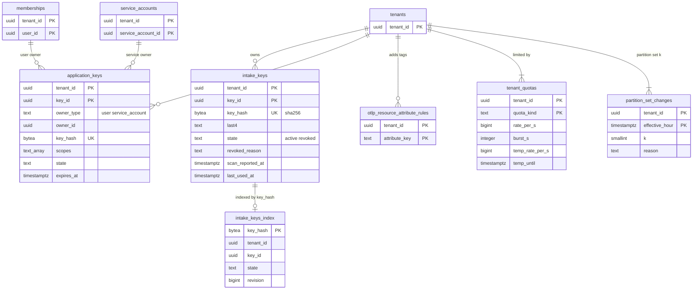

# Data model: キーと取り込み

[data-model.md](../data-model.md) の一部。規約はそちらの 3 節に従う。振る舞いは [otlp-and-api-keys.md](../otlp-and-api-keys.md)（6〜8 節）と [intake-and-agent.md](../intake-and-agent.md)（4〜6 節）を正とする。決定は [ADR-0003](../../decisions/0003-tenancy-cells-and-isolation.md)（X1）、[ADR-0010](../../decisions/0010-agent-disk-queue-and-retry.md)〜[ADR-0012](../../decisions/0012-intake-quota-coordination.md)、[ADR-0014](../../decisions/0014-otlp-mapping-and-resource-attributes.md)、[ADR-0015](../../decisions/0015-key-format-validation-and-revocation.md)、[ADR-0019](../../decisions/0019-partition-mapping-and-head-layout.md)。MSK のレコードの形は [stores.md](stores.md) の 1 節。

| 表 | 置き場所 | 書く | 読む |
| --- | --- | --- | --- |
| `intake_keys` | テナントの表 | `api` | `api`、`usage-aggregator`（最後に使った時刻） |
| `intake_keys_index` | `public`、RLS の外 | `api`（`intake_keys` と同じトランザクション） | `intake-gateway`・`intake-router`（X1） |
| `application_keys` | テナントの表 | `api` | `api`（`tenant_ref` で `SET LOCAL` してから） |
| `otlp_resource_attribute_rules` | テナントの表 | `api` | `intake-gateway`（組織の文脈） |
| `tenant_quotas` | テナントの表 | `api`（運用の画面）、`billing-sync` | `intake-gateway`、`limits-coordinator`、`log-processor` |
| `partition_set_changes` | テナントの表 | `api`（運用の画面、割り当ての変更から） | `intake-gateway`、`metrics-ingester`、`query-frontend` |

- **ゲートウェイの読み方**（D-20）：ゲートウェイは、キーで決めた `tenant_id` で `SET LOCAL app.tenant_id` をしてから、その組織の `tenant_quotas`・`partition_set_changes`・`otlp_resource_attribute_rules` を読み、プロセスのメモリーに 60 秒持つ。組織をまたぐ一括の読み出しをしない。X1 の経路（`intake_keys_index`）は増やさない。

## 1. ER 図

- `intake_keys_index` は `intake_keys` の写しで、DB の外部キーを張らない（RLS の外の表から RLS の表へ張らない）。2 つは `api` の同じトランザクションで書き、毎日突き合わせる（`revision` の一致）。
- `application_keys` の持ち主は `owner_type` で分かれる多態の参照（トリガーで確かめる）。

## 2. 表

### 2.1 `intake_keys`

取り込みのキーの正本（[otlp-and-api-keys.md](../otlp-and-api-keys.md) の 7 節）。値は作成のときに 1 回だけ見せ、保存しない。

| 列 | 型 | NULL | 既定 | 説明 |
| --- | --- | --- | --- | --- |
| `tenant_id` | `uuid` | NOT NULL | — | |
| `key_id` | `uuid` | NOT NULL | `uuidv7()` | ログ・監査・利用量に出すのはこれだけ |
| `name` | `text` | NOT NULL | — | |
| `key_hash` | `bytea` | NOT NULL | — | `SHA-256(<brand>_ik_…)`。塩なし（乱数 190 ビット） |
| `last4` | `text` | NOT NULL | — | 最後の 4 文字 |
| `state` | `text` | NOT NULL | `'active'` | `active`・`revoked` |
| `created_by` | `uuid` | NOT NULL | — | |
| `created_at` | `timestamptz` | NOT NULL | `now()` | |
| `revoked_at` | `timestamptz` | NULL | — | |
| `revoked_reason` | `text` | NULL | — | `admin`・`secret_scanning` |
| `scan_reported_at` | `timestamptz` | NULL | — | シークレットスキャンの通報。24 時間の後に自動で失効 |
| `last_used_at` | `timestamptz` | NULL | — | 時間の単位に切り捨て（`usage-aggregator` が `usage` から書く） |

- キー：PK `(tenant_id, key_id)`。UK `key_hash`（全体で一意。`intake_keys_index` と同じ）。
- 索引：`(tenant_id, state)` — 画面の一覧と組織あたり 50 本の上限。`(scan_reported_at) WHERE state = 'active' AND scan_reported_at IS NOT NULL` は組織をまたぐので使わず、失効の作業は通報の受け付けが outbox に予約した 24 時間後の仕事で行う。
- CHECK：`octet_length(key_hash) = 32`、`state IN (…)`、`state = 'revoked'` なら `revoked_at`・`revoked_reason` が NOT NULL、`revoked_reason IN ('admin','secret_scanning')`。
- トリガー：`revoked` から `active` に戻す更新を拒む。
- RLS：テナントの表。保持：失効の後 400 日で消す（**L6 の確認待ち**）。S1 の量：約 2 万行。

### 2.2 `intake_keys_index`

キーの確認の入口（[ADR-0003](../../decisions/0003-tenancy-cells-and-isolation.md) の X1）。テレメトリーを持たない。

| 列 | 型 | NULL | 既定 | 説明 |
| --- | --- | --- | --- | --- |
| `key_hash` | `bytea` | NOT NULL | — | |
| `tenant_id` | `uuid` | NOT NULL | — | |
| `key_id` | `uuid` | NOT NULL | — | |
| `state` | `text` | NOT NULL | — | `active`・`revoked` |
| `revision` | `bigint` | NOT NULL | `1` | 変更のたびに 1 上げる（突き合わせ） |
| `updated_at` | `timestamptz` | NOT NULL | `now()` | |

- キー：PK `key_hash`。
- RLS：なし。読むのは `intake`（ゲートウェイ、S2 の `intake-router`）の X1 のロールだけで、`SELECT` は関数 `resolve_intake_key(key_hash)` だけに許す。書くのは `api`。
- キャッシュ：ゲートウェイの L1（100 万件、`fetched_at` から 60 秒）と Valkey `ik:{hash}`（[stores.md](stores.md) の 3 節）。
- 保持：`intake_keys` と同じ。S1 の量：約 2 万行。

### 2.3 `application_keys`

公開 API のキー（[otlp-and-api-keys.md](../otlp-and-api-keys.md) の 8 節、[tenancy-and-rbac.md](../tenancy-and-rbac.md) の 7.3 節）。形は `<brand>_ak_<tenant_ref>_<乱数 32><チェックサム 6>`。

| 列 | 型 | NULL | 既定 | 説明 |
| --- | --- | --- | --- | --- |
| `tenant_id` | `uuid` | NOT NULL | — | |
| `key_id` | `uuid` | NOT NULL | `uuidv7()` | |
| `owner_type` | `text` | NOT NULL | — | `user`・`service_account` |
| `owner_id` | `uuid` | NOT NULL | — | |
| `name` | `text` | NOT NULL | — | |
| `key_hash` | `bytea` | NOT NULL | — | SHA-256 |
| `last4` | `text` | NOT NULL | — | |
| `scopes` | `text[]` | NULL | — | 権限の部分集合。NULL は持ち主の権限そのまま |
| `state` | `text` | NOT NULL | `'active'` | `active`・`revoked` |
| `created_at` | `timestamptz` | NOT NULL | `now()` | |
| `expires_at` | `timestamptz` | NULL | — | 既定は作成から `tenant_settings.app_key_default_ttl_days` |
| `revoked_at` | `timestamptz` | NULL | — | |
| `revoked_reason` | `text` | NULL | — | `admin`・`owner_deactivated`・`secret_scanning`・`expired` |
| `last_used_at` | `timestamptz` | NULL | — | 時間の単位 |

- キー：PK `(tenant_id, key_id)`。UK `(tenant_id, key_hash)`。
- 索引：`(tenant_id, owner_type, owner_id) WHERE state = 'active'` — 持ち主の停止で 60 秒以内に止める、利用者あたり 20 本の上限。`(tenant_id, expires_at) WHERE state = 'active'` — 期限の 14 日前の知らせ（X2 で組織ごと）。
- CHECK：`owner_type IN (…)`、`octet_length(key_hash) = 32`、`scopes` の各要素が権限の形（2.7 節と同じ正規表現）。
- 送り元の範囲は組織ごと（`tenant_settings.app_key_allowed_cidrs`。キーの列にしない。D-16）。
- 実効の権限はスコープと持ち主の今の権限の積。キーで制限の述語を外せない。
- RLS：テナントの表。保持：失効・期限の後 400 日（**L6 の確認待ち**）。S1 の量：約 5 万行。

### 2.4 `otlp_resource_attribute_rules`

組織が足した、タグにする資源の属性の鍵（最大 20。[otlp-and-api-keys.md](../otlp-and-api-keys.md) の 6.1 節）。決めた 12 個の対応はコードに持つ。

| 列 | 型 | NULL | 既定 | 説明 |
| --- | --- | --- | --- | --- |
| `tenant_id` | `uuid` | NOT NULL | — | |
| `attribute_key` | `text` | NOT NULL | — | 小文字にした鍵がそのままタグの鍵になる |
| `created_by`・`created_at` | — | — | — | |

- キー：PK `(tenant_id, attribute_key)`。CHECK：`attribute_key ~ '^[a-z][a-z0-9_.\-/]{0,199}$'`。トリガー：組織あたり 20。
- RLS：テナントの表。S1 の量：約 5,000 行。

### 2.5 `tenant_quotas`

取り込みの割り当て（[intake-and-agent.md](../intake-and-agent.md) の 6.1 節、[ADR-0012](../../decisions/0012-intake-quota-coordination.md)）。上限の値は運用のパラメーターで、コードの定数で上書きしない。

| 列 | 型 | NULL | 既定 | 説明 |
| --- | --- | --- | --- | --- |
| `tenant_id` | `uuid` | NOT NULL | — | |
| `quota_kind` | `text` | NOT NULL | — | `metric_points`・`body_bytes`・`log_events`・`log_bytes`・`spans` |
| `rate_per_s` | `bigint` | NOT NULL | — | 1 秒の量 `Q` |
| `burst_s` | `integer` | NOT NULL | `10` | バケットの深さ（秒） |
| `source` | `text` | NOT NULL | `'contract'` | `contract`・`manual` |
| `temp_rate_per_s` | `bigint` | NULL | — | 一時の引き上げ・引き下げ |
| `temp_until` | `timestamptz` | NULL | — | |
| `temp_reason` | `text` | NULL | — | 理由のコード |
| `updated_by`・`updated_at` | — | — | — | |

- キー：PK `(tenant_id, quota_kind)`。
- CHECK：`rate_per_s > 0`、`burst_s BETWEEN 1 AND 60`、`(temp_rate_per_s IS NULL) = (temp_until IS NULL)`。
- `metric_points` の値は `partition_set_changes.k` の計算（`k = clamp(ceil(Q ÷ 1 万), 4, 256)`、かつ割り当て ÷ 5 MB/秒 以上）にも使う。割り当ての合計はセルの容量の 1.5 倍まで（`ops.oversubscription_ratio`、[ADR-0064](../../decisions/0064-capacity-headroom-and-load-test-gates.md)）。
- RLS：テナントの表。S1 の量：約 5,000 行。

### 2.6 `partition_set_changes`

組織のパーティションの組の大きさ `k` の履歴（[ADR-0019](../../decisions/0019-partition-mapping-and-head-layout.md)、[tsdb-storage-engine.md](../tsdb-storage-engine.md) の 3.2 節）。点の時刻の時間ごとに効く `k` は「`effective_hour ≤ 時間` の最後の行」。

| 列 | 型 | NULL | 既定 | 説明 |
| --- | --- | --- | --- | --- |
| `tenant_id` | `uuid` | NOT NULL | — | |
| `effective_hour` | `timestamptz` | NOT NULL | — | 1 時間の区切り。作成から 2 時間以上先 |
| `k` | `smallint` | NOT NULL | — | 4〜256 |
| `reason` | `text` | NOT NULL | — | `initial`・`quota_change`・`cell_move`・`manual` |
| `created_by`・`created_at` | — | — | — | |

- キー：PK `(tenant_id, effective_hour)`。
- CHECK：`k BETWEEN 4 AND 256`、`date_trunc('hour', effective_hour) = effective_hour`。
- トリガー：`INSERT` の `effective_hour >= now() + interval '2 hours'`（最初の行 `reason = 'initial'` は除く）。行を変えない・消さない（過去の時間の点のパーティションが変わるため。保持の中の行は不変）。
- `metrics` のトピックのパーティションの数 `P` を変えるときも、同じ規則で効く時刻を決める（[delivery.md](../delivery.md) の 7.3 節）。
- RLS：テナントの表。保持：最も古いブロックの保持（15 か月）を過ぎた行を消す（ただし今効いている行は残す）。S1 の量：数千行。

## 3. エージェントの手元の置き場所

Aurora の表ではないが、送信の形の正本としてここに書く（[intake-and-agent.md](../intake-and-agent.md) の 4.4・4.5 節、[ADR-0010](../../decisions/0010-agent-disk-queue-and-retry.md)）。

| 置き場所 | 形 |
| --- | --- |
| `<data_dir>/queue/<signal>/<seq>.seg` | 16 MiB のセグメントのファイルの列。レコード：`len u32 LE ‖ crc32c u32 LE ‖ signal u8 ‖ oldest_ts_ms i64 LE ‖ request_id [16] ‖ body`。`crc32c` は `signal` から `body` の終わりまで。`fsync` は 5 秒ごと |
| `<data_dir>/positions.json` | ログの追跡の位置（ファイルの識別子、オフセット） |
| ホストの ID | クラウドのインスタンスの ID、なければ OS の machine-id の SHA-256（`host_key`。[usage-and-billing.md](../usage-and-billing.md) の 4.1 節） |

- `request_id` は本文ごとの UUIDv7 で、送り直しでも同じ（`<Brand>-Request-Id`）。CRC の合わないレコードは捨てて `<brand>.agent.dropped_payloads{reason:corrupt}` に数える。
