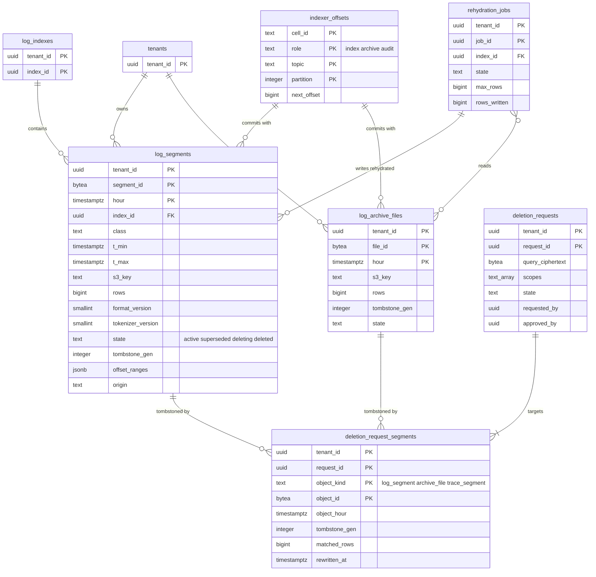
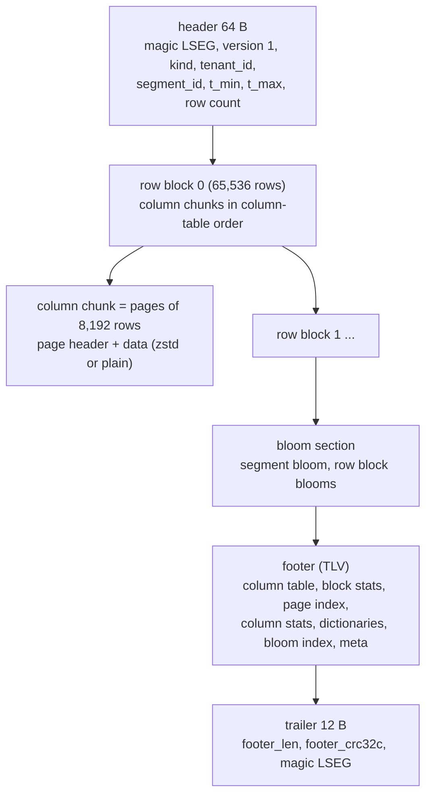

# Data model: ログのセグメント（`LSEG` 1、ブルームフィルター、墓標、カタログ）

[data-model.md](../data-model.md) の一部。規約はそちらの 3 節に従う。振る舞いは [log-storage-and-search.md](../log-storage-and-search.md)（4・5・8〜10 節）を正とする。決定は [ADR-0005](../../decisions/0005-log-storage-columnar-with-bloom.md)、[ADR-0033](../../decisions/0033-log-segment-format-and-tokenizer.md)〜[ADR-0036](../../decisions/0036-personal-data-deletion-tombstones.md)、[ADR-0057](../../decisions/0057-data-lifecycle-and-deletion-framework.md)。トレースのスパンのセグメントも同じ形式で、違いは [traces.md](traces.md)。

| 表 | 置き場所 | 書く |
| --- | --- | --- |
| `log_segments` | テナントの表、`hour` の月の分割 | `log-indexer`（X2）、`compactor`（X2）、`rehydrator`、`deletion-worker`、`cell-move`（X4） |
| `log_archive_files` | テナントの表、`hour` の月の分割 | アーカイブの書き手（`log-indexer` の別の役割。X2）、`deletion-worker` |
| `maint.indexer_offsets` | `maint` | `log-indexer`、アーカイブの書き手 |
| `rehydration_jobs` | テナントの表 | `api`、`rehydrator` |
| `deletion_requests`、`deletion_request_segments` | テナントの表 | `api`、`deletion-worker` |

## 1. ER 図

- `rehydration_jobs` から `log_segments` への線は任意の参照（`origin = rehydration` の行だけ）。`deletion_request_segments` の先は `object_kind` で分かれる多態の参照。
- `log_segments`・`log_archive_files` は分割した表なので、`deletion_request_segments` と `rehydration_jobs` からの線は論理の参照（外部キーを張らない）。`indexer_offsets` との線も論理の参照（`maint`）。

## 2. 表

### 2.1 `log_segments`

索引・再水和・監査の索引のセグメントのカタログ（[log-storage-and-search.md](../log-storage-and-search.md) の 5.2 節）。1 行が S3 の 1 つの不変の `.lseg`。

| 列 | 型 | NULL | 既定 | 説明 |
| --- | --- | --- | --- | --- |
| `tenant_id` | `uuid` | NOT NULL | — | |
| `segment_id` | `bytea` | NOT NULL | — | 16 バイト。インデクサーは `xxh3_128(partition ‖ first_offset ‖ tenant_id ‖ index_id ‖ hour)`、再水和は `xxh3_128(job_id ‖ file_id)`、合わせは中身の xxh3_128（D-3） |
| `hour` | `timestamptz` | NOT NULL | — | ログの時刻の時。分割の鍵 |
| `index_id` | `uuid` | NOT NULL | — | 索引（`audit`・履歴の索引を含む） |
| `class` | `text` | NOT NULL | — | `idx-<N>d`・`rehyd-<N>d`・`audit-<N>d` |
| `tier` | `text` | NOT NULL | — | `l0`（10 秒ごとの小さなもの）・`l1`（合わせの後・再水和） |
| `t_min`・`t_max` | `timestamptz` | NOT NULL | — | 行の時刻の最小・最大 |
| `s3_key` | `text` | NOT NULL | — | [stores.md](stores.md) の 2.2 節 |
| `bytes`・`rows` | `bigint` | NOT NULL | — | |
| `format_version` | `smallint` | NOT NULL | `1` | `LSEG` のバージョン |
| `tokenizer_version` | `smallint` | NOT NULL | `1` | |
| `state` | `text` | NOT NULL | `'active'` | `active`・`superseded`・`deleting`・`deleted`（D-6） |
| `tombstone_gen` | `integer` | NOT NULL | `0` | 0 は墓標なし。墓標は `<s3_key>.tomb-<gen>` |
| `offset_ranges` | `jsonb` | NULL | — | `[{"p": 17, "from": 100, "to": 250}]`。インデクサーのセグメントだけ（読み直しで重ねないため） |
| `origin` | `text` | NOT NULL | — | `indexer`・`compaction`・`rehydration`・`cell_move` |
| `rehydration_job_id` | `uuid` | NULL | — | |
| `compaction_run_id` | `uuid` | NULL | — | |
| `created_at` | `timestamptz` | NOT NULL | `now()` | |
| `superseded_at`・`deleting_at`・`deleted_at` | `timestamptz` | NULL | — | |

- キー：PK `(tenant_id, segment_id, hour)`（D-4）。UK `(tenant_id, s3_key, hour)`。
- 索引：
  - `(tenant_id, index_id, t_max) WHERE state = 'active'` — 検索の計画（`t_max ≥ from` かつ `t_min < to`）。
  - `(tenant_id, index_id, hour) WHERE tier = 'l0' AND state = 'active'` — 合わせ（時の終わり＋20 分、小さなもの 8 個以上）。
  - `(tenant_id, hour) WHERE tombstone_gen > 0 AND state = 'active'` — 墓標のあるものの書き直しを先に。
- CHECK：`state IN (…)`、`origin IN (…)`、`tier IN ('l0','l1')`、`t_max >= t_min`、`date_trunc('hour', hour) = hour`、`octet_length(segment_id) = 16`、`origin <> 'rehydration' OR rehydration_job_id IS NOT NULL`。
- トリガー：`state` の遷移は `metric_blocks` と同じ。`tombstone_gen` を下げる更新を拒む。
- 確定：S3 の PUT（`If-None-Match`）の成功の後、`log_segments` の行と `maint.indexer_offsets` を 1 つのトランザクションで書く（[ADR-0005](../../decisions/0005-log-storage-columnar-with-bloom.md)）。読み直しで同じ行なら `ON CONFLICT DO NOTHING`。
- 保持：検索は `今 − 索引の保持` より古い行を出さない。`compactor` が時の終わり＋保持を過ぎた行を `deleting` にしてから東京と大阪で消す。`deleted` の行は 14 日残す。分割は中が空になったら `DROP`。
- RLS：テナントの表。S1 の量：同時に 約 150 万行（小さなもの 約 144 万、合わせた後 30 日で 約 150 万）。1 秒 約 200 行の書き込み（[capacity.md](../capacity.md) の 5.1 節）。

### 2.2 `log_archive_files`

アーカイブのファイルのカタログ（[log-storage-and-search.md](../log-storage-and-search.md) の 8.1 節）。すべてのログ（振り分けの結果に依らない）を、（組織、ログの時刻の時）ごとに 1 時間か 1 GiB で書く。

| 列 | 型 | NULL | 既定 | 説明 |
| --- | --- | --- | --- | --- |
| `tenant_id` | `uuid` | NOT NULL | — | |
| `file_id` | `bytea` | NOT NULL | — | `xxh3_128(partition ‖ first_offset ‖ tenant_id ‖ hour ‖ "archive")` |
| `hour` | `timestamptz` | NOT NULL | — | 分割の鍵 |
| `s3_key` | `text` | NOT NULL | — | `<cell>/<tenant_id>/logs/archive-1y/…/<file_id>.lseg`（`<brand>-archive-apne1`） |
| `bytes`・`rows` | `bigint` | NOT NULL | — | |
| `t_min`・`t_max` | `timestamptz` | NOT NULL | — | |
| `format_version`・`tokenizer_version` | `smallint` | NOT NULL | `1` | ブルームフィルターなし（フッターに `bloom: none`） |
| `tombstone_gen` | `integer` | NOT NULL | `0` | |
| `offset_ranges` | `jsonb` | NOT NULL | — | |
| `state` | `text` | NOT NULL | `'active'` | `active`・`superseded`（書き直し）・`deleting`・`deleted` |
| `created_at`・`deleted_at` | `timestamptz` | — | — | |

- キー：PK `(tenant_id, file_id, hour)`。
- 索引：`(tenant_id, hour) WHERE state = 'active'` — 再水和の見積もりと実行（期間のファイル）。
- 保持：1 年（`archive-1y`）。Glacier Instant Retrieval の最小の保存の期間（90 日）より前に消さない（削除の請求の書き直しを除く）。
- RLS：テナントの表。S1 の量：1 年で 約 900 万行（組織 1,000 × 24 × 365）。

### 2.3 `maint.indexer_offsets`

インデクサーとアーカイブの書き手のパーティションの確定の位置（[log-storage-and-search.md](../log-storage-and-search.md) の 5.1 節）。

| 列 | 型 | NULL | 既定 | 説明 |
| --- | --- | --- | --- | --- |
| `cell_id` | `text` | NOT NULL | — | |
| `role` | `text` | NOT NULL | — | `index`・`archive`・`audit` |
| `topic` | `text` | NOT NULL | — | `logs`・`audit` |
| `partition` | `integer` | NOT NULL | — | |
| `next_offset` | `bigint` | NOT NULL | — | 開いているバッファーの最も古いオフセットの手前 |
| `updated_at` | `timestamptz` | NOT NULL | `now()` | |

- キー：PK `(cell_id, role, topic, partition)`。
- 進め方：`UPDATE … SET next_offset = $new WHERE … AND next_offset = $old`。0 行ならトランザクションを捨てる。読み直しは `next_offset` から読み、カタログの `offset_ranges` の中のオフセットを飛ばす。
- RLS：なし（`maint`）。S1 の量：約 2,000 行。

### 2.4 `rehydration_jobs`

再水和の作業（[log-storage-and-search.md](../log-storage-and-search.md) の 8.2 節、[ADR-0035](../../decisions/0035-log-rehydration-jobs.md)）。

| 列 | 型 | NULL | 既定 | 説明 |
| --- | --- | --- | --- | --- |
| `tenant_id`・`job_id` | `uuid` | NOT NULL | `uuidv7()` | |
| `index_id` | `uuid` | NULL | — | 作った履歴の索引（`log_indexes.kind = 'rehydrated'`）。`running` の前に作る |
| `from_ts`・`to_ts` | `timestamptz` | NOT NULL | — | 31 日まで |
| `query` | `text` | NOT NULL | — | 検索の条件 |
| `restriction_hash` | `bytea` | NOT NULL | — | 作った人の役割の制限（実行は作った人の今の制限で IR を作り直す。違えば止める） |
| `max_rows` | `bigint` | NOT NULL | `100000000` | 最大 10 億 |
| `retention_days` | `smallint` | NOT NULL | `15` | 3・7・15・30 |
| `state` | `text` | NOT NULL | `'queued'` | `queued`・`estimating`・`awaiting_confirm`・`running`・`completed`・`limit_reached`・`failed`・`cancelled`・`expired` |
| `estimate_files`・`estimate_bytes` | `bigint` | NULL | — | 読むファイルとバイト |
| `confirmed_by`・`confirmed_at` | — | NULL | — | 利用者の確かめ |
| `files_done`・`bytes_read`・`rows_written` | `bigint` | NOT NULL | `0` | 進み |
| `last_file_hour` | `timestamptz` | NULL | — | 時刻の順に読んだ最後のファイルの時（やり直しの位置） |
| `error_code` | `text` | NULL | — | |
| `created_by`・`created_at`・`finished_at`・`expires_at` | — | — | — | |

- キー：PK `(tenant_id, job_id)`。UK `(tenant_id, index_id) WHERE index_id IS NOT NULL`。
- 索引：`(tenant_id, state) WHERE state IN ('queued','estimating','awaiting_confirm','running')` — 組織あたり同時 2 つの上限と、作業者の取り出し（X2）。
- CHECK：`to_ts > from_ts AND to_ts - from_ts <= interval '31 days'`、`max_rows BETWEEN 1 AND 1000000000`、`retention_days IN (3,7,15,30)`、`state IN (…)`。
- 利用量：読んだアーカイブのバイトと戻した件数を、それぞれの単位で数える（[usage-and-billing.md](usage-and-billing.md)）。
- RLS：テナントの表。保持：`expired` の 90 日後に消す。S1 の量：数千行。

### 2.5 `deletion_requests`

個人のデータの削除の請求（[log-storage-and-search.md](../log-storage-and-search.md) の 10 節、[ADR-0036](../../decisions/0036-personal-data-deletion-tombstones.md)）。期限・範囲・証跡の文言は **L5 の確認待ち**。

| 列 | 型 | NULL | 既定 | 説明 |
| --- | --- | --- | --- | --- |
| `tenant_id`・`request_id` | `uuid` | NOT NULL | `uuidv7()` | |
| `query_ciphertext` | `bytea` | NULL | — | 検索の条件（個人のデータを含む）。`kms-secrets` の封筒の暗号化。完了の 30 日後に NULL にする |
| `query_kms_key_id` | `text` | NULL | — | |
| `from_ts`・`to_ts` | `timestamptz` | NOT NULL | — | |
| `scopes` | `text[]` | NOT NULL | — | `index`・`archive`・`rehydrated`・`traces` |
| `reason_code` | `text` | NOT NULL | — | |
| `state` | `text` | NOT NULL | `'received'` | `received`・`approved`・`rejected`・`matching`・`hidden`・`rewriting`・`completed`・`failed` |
| `requested_by` | `uuid` | NOT NULL | — | 権限 `logs.data.delete`（D-24） |
| `approved_by` | `uuid` | NULL | — | 別の管理者 |
| `counts` | `jsonb` | NOT NULL | `'{}'` | 範囲ごとの対象の件数・書き直したファイルの数（値を含めない） |
| `legal_hold_blocked` | `boolean` | NOT NULL | `false` | 法的な保全で書き直しを止めている |
| `created_at`・`approved_at`・`hidden_at`・`completed_at`・`query_purged_at` | `timestamptz` | — | — | |

- キー：PK `(tenant_id, request_id)`。
- CHECK：`state IN (…)`、`state NOT IN ('approved','matching','hidden','rewriting','completed') OR approved_at IS NOT NULL`。
- 承認：`approved_by <> requested_by` を求める。`tenant_settings.deletion_single_approver` が真の組織だけ、承認の関数が `approved_by = requested_by` を許す（CHECK では他の表を読めないので関数で守る）。
- `hidden` に入るトランザクションで `tenants.query_cache_generation` を上げる。
- RLS：テナントの表。保持：完了の後 1 年（条件の暗号文は 30 日で消す。**L5 の確認待ち**）。S1 の量：数千行。

### 2.6 `deletion_request_segments`

請求と、墓標を書いたセグメント・アーカイブのファイル・トレースのセグメントの対応。

| 列 | 型 | NULL | 既定 | 説明 |
| --- | --- | --- | --- | --- |
| `tenant_id`・`request_id` | `uuid` | NOT NULL | — | |
| `object_kind` | `text` | NOT NULL | — | `log_segment`・`archive_file`・`trace_segment` |
| `object_id` | `bytea` | NOT NULL | — | `segment_id`・`file_id` |
| `object_hour` | `timestamptz` | NOT NULL | — | 分割した表を引く鍵 |
| `tombstone_gen` | `integer` | NOT NULL | — | この請求で書いた世代 |
| `matched_rows` | `bigint` | NOT NULL | — | |
| `rewritten_at` | `timestamptz` | NULL | — | 書き直しが済んだ時刻 |

- キー：PK `(tenant_id, request_id, object_kind, object_id)`。FK `(tenant_id, request_id)` → `deletion_requests`。
- 索引：`(tenant_id, request_id) WHERE rewritten_at IS NULL` — `completed` の判定。
- RLS：テナントの表。保持：請求と同じ。S1 の量：請求あたり数百〜数万行。

## 3. 形式 `LSEG` バージョン 1

[ADR-0033](../../decisions/0033-log-segment-format-and-tokenizer.md)、[log-storage-and-search.md](../log-storage-and-search.md) の 4.1 節。索引のセグメント、アーカイブのファイル、再水和のセグメント、トレースのセグメントが同じ形式を使う。数値はリトルエンディアン、`varint` は LEB128。バイトの細部はこの文書で決めた（D-30）。

### 3.1 構造

### 3.2 頭（64 バイト）

| 位置 | 大きさ | 項目 | 値 |
| --- | --- | --- | --- |
| 0 | 4 | `magic` | `LSEG` |
| 4 | 2 | `format_version` | `1` |
| 6 | 1 | `kind` | 1 索引、2 アーカイブ、3 再水和、4 スパン、5 監査 |
| 7 | 1 | `flags` | bit0 ブルームフィルターあり、bit1 行のブロックのブルームフィルターを省いた |
| 8 | 16 | `tenant_id` | 読み手は計画の `tenant_id` と比べる（D-31） |
| 24 | 16 | `segment_id` | カタログの `segment_id`・`file_id` |
| 40 | 8 | `t_min_ns` | i64 |
| 48 | 8 | `t_max_ns` | i64 |
| 56 | 4 | `row_count` | u32 |
| 60 | 4 | `header_crc32c` | `bytes[0..60]` の CRC32C |

### 3.3 行のブロックとページ

- 行はログの `timestamp` の順（同じ時刻は `log_id` の順）。スパンは `start` の順。
- 行のブロックは 65,536 行（最後は短くてよい）。ブロックの中に、列の表の順に列のかたまりを置く。列のかたまりはページ（8,192 行）の並び。
- ページの頭（12 バイト）：`encoding` u8、`compression` u8（0 なし、1 zstd）、`flags` u8（bit0 null のビットマップあり）、予約 u8、`row_count` u32、`uncompressed_len` u32。続けて（あれば）null のビットマップ、値。ページの CRC32C はフッターのページの索引に持つ。

| `encoding` | 使う列 | 形 |
| --- | --- | --- |
| 1 差分とビットの詰め込み | `timestamp`・`ingest_time`（i64 ナノ秒）、整数の属性 | 最初の値 i64、差分の zigzag をビット幅ごとに詰める |
| 2 固定 16 バイト | `log_id`・`trace_id` | |
| 3 固定 8 バイト | `span_id`・`parent_span_id` | |
| 4 ページの辞書 | 値の種類がページで 256 以下の文字列 | 辞書（`varint len ‖ bytes`）＋値ごとの u8 |
| 5 文字列の並び | 本文（`message`、zstd レベル 3。アーカイブは 9）、種類の多い文字列 | `varint len ‖ bytes` の並び |
| 6 f64 | 浮動小数点の属性 | |
| 7 真偽のビットマップ | 真偽の属性 | |
| 8 セグメントの辞書 | 値の種類がセグメントで 1,000 以下の列（`service`・`status`・`host`・`source`・`index_id` など） | フッターの辞書の番号（varint） |

- 決まった列：`timestamp`、`log_id`、`ingest_time`、`host`、`service`、`status`、`source`、`index_id`、`trace_id`・`span_id`、`message`。スパンの決まった列は [traces.md](traces.md) の 3 節。
- 属性の列：属性の道と型（文字列・i64・f64・真偽）の組ごとに 1 列。1 つのセグメントの列は 2,000 まで。超えたら出現の少ない道から `_rest`（道 → 値の JSON の並び）の 1 列にまとめる。宣言したファセット（`log_facets`）の道は必ず独立の列にする。

### 3.4 ブルームフィルターの節

- 分割ブロックの形（Apache Parquet の仕様の SBBF と同じビットの置き方）：1 つの語は 256 ビットの 1 つのブロックに入り、ブロックの中で 8 ビットを立てる。ハッシュは `xxh3_64(語の UTF-8)`、ブロックの番号は `((h >> 32) × ブロックの数) >> 32`。語あたり 10 ビットを目安（誤検出 1% 前後）。
- 並び：セグメントのブルームフィルター、続けて行のブロックごとのもの。各ブルームフィルターは `num_blocks u32 ‖ ビット列`。
- 合計が圧縮の後のセグメントの 10% を超えるときは行のブロックのものを省き、頭の `flags` の bit1 とフッターに書く。
- 語の分け方は `tokenizer_version` 1（[log-storage-and-search.md](../log-storage-and-search.md) の 4.2 節）。引く側はセグメントのバージョンの関数で語を作る。3 桁以下の数字だけの語は入れず、引く側はその語を「ある」とみなす。**偽陰性があってはならない。**
- アーカイブのファイルはブルームフィルターを持たない（`flags` の bit0 = 0）。

### 3.5 フッター

`type u16 ‖ len u32 ‖ payload` の並びを次の順で置く。

| `type` | 中身 |
| --- | --- |
| 1 列の表 | 列ごとに番号、道、型、`encoding`、印（決まった列・属性・`_rest`・ファセット・ID の属性） |
| 2 行のブロックの統計 | ブロックごとに開始の位置 u64、行の数 u32、最小・最大の時刻 |
| 3 ページの索引 | （ブロック、列、ページ）ごとに位置 u64、圧縮の後の長さ u32、CRC32C u32 |
| 4 列の統計 | （ブロック、列）ごとに最小・最大（型の値）、null の数、値の種類の数の推定 |
| 5 辞書 | 値の種類が 1,000 以下の列の値と、値ごとの件数（セグメントの全体）。ファセットの近道に使う（墓標のあるセグメントでは使わない） |
| 6 ブルームフィルターの索引 | セグメントと行のブロックごとの位置と長さ、語あたりのビット、省いた印。アーカイブは `bloom: none` |
| 7 付帯 | `tokenizer_version`、書き手のバージョン、`offset_ranges`、出どころ（索引の ID・作業の ID・アーカイブのファイルの ID） |

- 末尾（12 バイト）：`footer_len u32 ‖ footer_crc32c u32 ‖ magic "LSEG"`。
- 読み出しは末尾の 64 KiB を 1 回の範囲の GET で読み、フッターが長ければ 2 回目で残りを読む。

### 3.6 墓標のファイル（`.tomb-<gen>`）

[log-storage-and-search.md](../log-storage-and-search.md) の 10.2 節。セグメントと同じキーに `.tomb-<gen>` を足す。前の世代の行を含む累積。

| 部分 | 形 |
| --- | --- |
| 頭（44 バイト） | `magic` `LTMB`、`format_version` u16 = 1、予約 u16、`tenant_id` 16、`segment_id` 16、`gen` u32 |
| 本体 | 隠す行の番号（セグメントの中の行の順序、0 から）の Roaring のビットマップ（ポータブルの直列化） |
| 末尾 | `crc32c` u32 |

- 読み手は、カタログの `tombstone_gen` が 0 でなければフッターの後に墓標を読み（NVMe にキャッシュ）、条件を評価する前に行を除く。
- 書き直し（`compactor`）の新しいセグメントには、墓標の行も、その語のブルームフィルターのビットも入らない。法的な保全の間は、墓標は付けるが書き直しを止める。
