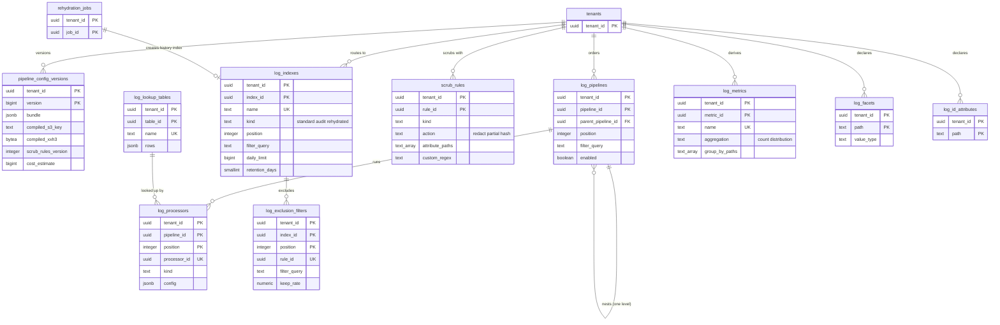

# Data model: ログのパイプラインと索引

[data-model.md](../data-model.md) の一部。規約はそちらの 3 節に従う。振る舞いは [logs-pipeline.md](../logs-pipeline.md)（6〜11 節）と [log-storage-and-search.md](../log-storage-and-search.md)（4.2・7 節）を正とする。決定は [ADR-0030](../../decisions/0030-log-pipeline-execution-model.md)〜[ADR-0032](../../decisions/0032-index-routing-and-derived-metrics.md)、[ADR-0033](../../decisions/0033-log-segment-format-and-tokenizer.md)。`logs-raw`・`logs`・`derived-partials` のメッセージの形は [stores.md](stores.md) の 1 節。

**編集の正本と実行の形を分ける。** 組織が画面・API・Terraform で直すのは 2〜8 節の表（編集の正本）。`api` は変更のたびに、パイプライン・処理器・マスクの規則・索引・除外・ログから作るメトリクス・引きの表を 1 つの設定の束にまとめ、バージョン `N` を上げて `pipeline_config_versions` に書き、コンパイルの結果を S3 に置く。`log-processor` は束だけを読み、編集の表を読まない（[ADR-0030](../../decisions/0030-log-pipeline-execution-model.md)）。

| 表 | 置き場所 | 書く |
| --- | --- | --- |
| `pipeline_config_versions` | テナントの表 | `api`（束の検証とコンパイルの後） |
| `log_pipelines`、`log_processors`、`log_lookup_tables` | テナントの表 | `api` |
| `scrub_rules` | テナントの表 | `api` |
| `log_indexes`、`log_exclusion_filters` | テナントの表 | `api`、`rehydrator`（履歴の索引） |
| `log_metrics` | テナントの表 | `api` |
| `log_facets`、`log_id_attributes` | テナントの表 | `api` |

## 1. ER 図

- `log_pipelines` の自分への線（親）、`log_processors.lookup_table_id`、`log_indexes.rehydration_job_id` は任意の参照。

## 2. 表

### 2.1 `pipeline_config_versions`

設定の束のバージョン（[logs-pipeline.md](../logs-pipeline.md) の 7.4 節）。行は不変。

| 列 | 型 | NULL | 既定 | 説明 |
| --- | --- | --- | --- | --- |
| `tenant_id` | `uuid` | NOT NULL | — | |
| `version` | `bigint` | NOT NULL | — | 組織の中で単調に増える `N` |
| `bundle` | `jsonb` | NOT NULL | — | 束の全体（パイプライン、処理器、マスクの規則、索引、除外、ログから作るメトリクス、引きの表の参照、`tenant_settings` のマスクの列） |
| `compiled_s3_key` | `text` | NOT NULL | — | `<cell>/<tenant_id>/config/pipelines/v<N>.bin` |
| `compiled_xxh3` | `bytea` | NOT NULL | — | コンパイルの結果の xxh3_128（`log-processor` が読んで確かめる） |
| `compiler_version` | `text` | NOT NULL | — | `log-pipeline` の crate のバージョン |
| `scrub_rules_version` | `integer` | NOT NULL | — | マスクの規則の部分の番号。各ログに書く |
| `cost_estimate` | `bigint` | NOT NULL | — | 1 件あたりの手順の見積もり |
| `created_by`・`created_at` | — | — | — | |

- キー：PK `(tenant_id, version)`。
- 作り方：`api` は `SELECT max(version) … FOR UPDATE`（組織の `tenant_settings` の行のロック）で次の番号を取り、同じトランザクションで `outbox` に `pipeline-config-updated(tenant, N)` を書く。S3 の PUT は行の確定の前に終える（`log-processor` が行を見たら必ずファイルがある）。
- トリガー：更新と削除を拒む（保持のジョブを除く）。`version` を飛ばさない。
- RLS：テナントの表。保持：最新の 100 と、直近 30 日に作ったもの（MSK の読み直し 24 時間より長く）。S1 の量：約 10 万行。

### 2.2 `log_pipelines`・`log_processors`

パイプラインと処理器（[logs-pipeline.md](../logs-pipeline.md) の 7.1〜7.3 節）。入れ子は 1 段。

| `log_pipelines` の列 | 型 | NULL | 既定 | 説明 |
| --- | --- | --- | --- | --- |
| `tenant_id`・`pipeline_id` | `uuid` | NOT NULL | `uuidv7()` | |
| `parent_pipeline_id` | `uuid` | NULL | — | 入れ子のとき親 |
| `position` | `integer` | NOT NULL | — | 同じ親の中の順 |
| `name` | `text` | NOT NULL | — | |
| `filter_query` | `text` | NOT NULL | `'*'` | 検索の文法 |
| `enabled` | `boolean` | NOT NULL | `true` | |
| `updated_by`・`updated_at` | — | — | — | |

| `log_processors` の列 | 型 | NULL | 既定 | 説明 |
| --- | --- | --- | --- | --- |
| `tenant_id`・`pipeline_id` | `uuid` | NOT NULL | — | |
| `position` | `integer` | NOT NULL | — | パイプラインの中の順 |
| `processor_id` | `uuid` | NOT NULL | `uuidv7()` | `pipeline.errors` に書く ID |
| `kind` | `text` | NOT NULL | — | `json_parser`・`grok_parser`・`kv_parser`・`attribute_remapper`・`date_remapper`・`status_remapper`・`service_remapper`・`message_remapper`・`trace_id_remapper`・`category`・`arithmetic`・`string_builder`・`url_parser`・`user_agent_parser`・`lookup` |
| `config` | `jsonb` | NOT NULL | — | 種類ごとの設定（Zod で検証。grok の規則は 10 まで、`category` は 50 まで） |
| `lookup_table_id` | `uuid` | NULL | — | `lookup` のとき |
| `enabled` | `boolean` | NOT NULL | `true` | |

- キー：`log_pipelines` PK `(tenant_id, pipeline_id)`、UK `(tenant_id, parent_pipeline_id, position)`（`NULLS NOT DISTINCT`）、FK `(tenant_id, parent_pipeline_id)` → `log_pipelines`。`log_processors` PK `(tenant_id, pipeline_id, position)`、UK `(tenant_id, processor_id)`、FK → `log_pipelines`（`ON DELETE CASCADE`）、FK `(tenant_id, lookup_table_id)` → `log_lookup_tables`。
- トリガー：親が親を持つ行を拒む（1 段）。入れ子のパイプラインは処理器だけを持つ。
- 並びの変更は束の全体の置き換え（`PUT pipelines`）で行い、`position` の一意は遅延の制約（`DEFERRABLE INITIALLY DEFERRED`）にする。
- RLS：テナントの表。S1 の量：パイプライン 約 2 万行、処理器 約 15 万行。

### 2.3 `log_lookup_tables`

`lookup` の処理器が引く表（組織ごと、1 つの表 1 万行まで。[logs-pipeline.md](../logs-pipeline.md) の 7.2 節）。この文書で足した（D-37）。

| 列 | 型 | NULL | 既定 | 説明 |
| --- | --- | --- | --- | --- |
| `tenant_id`・`table_id` | `uuid` | NOT NULL | `uuidv7()` | |
| `name` | `text` | NOT NULL | — | |
| `rows` | `jsonb` | NOT NULL | — | `{"<key>": "<value>"}`。1 万行まで |
| `updated_by`・`updated_at` | — | — | — | |

- キー：PK `(tenant_id, table_id)`。UK `(tenant_id, name)`。CHECK：`pg_column_size(rows) <= 4194304`。
- RLS：テナントの表。S1 の量：数千行。

### 2.4 `scrub_rules`

PII のマスクの組織の規則（[logs-pipeline.md](../logs-pipeline.md) の 8 節、[ADR-0031](../../decisions/0031-pii-scrubbing-before-routing.md)）。既定の有効化は `tenant_settings.scrub_default_profile`（**L1 の確認待ち**）。本システムのキーの形（`secret_key`）は案に依らず常に伏せる提案（L1）。

| 列 | 型 | NULL | 既定 | 説明 |
| --- | --- | --- | --- | --- |
| `tenant_id`・`rule_id` | `uuid` | NOT NULL | `uuidv7()` | |
| `position` | `integer` | NOT NULL | — | 同じ長さの一致の優先の順（組み込みの種類の後） |
| `kind` | `text` | NOT NULL | — | `email`・`phone_jp`・`credit_card`・`my_number`・`ipv4`・`ipv6`・`jwt`・`secret_key`・`custom` |
| `action` | `text` | NOT NULL | `'redact'` | `redact`・`partial`・`hash` |
| `attribute_paths` | `text[]` | NULL | — | 対象の属性の道。NULL は本文とすべての文字列の属性 |
| `numeric_paths` | `text[]` | NULL | — | 数の属性を文字列として調べる道 |
| `custom_regex` | `text` | NULL | — | `custom` のとき。線形の時間の正規表現（後方参照・先読みなし） |
| `exclude_reserved_ips` | `boolean` | NOT NULL | `true` | `ipv4`・`ipv6` で予約のアドレスを除く |
| `enabled` | `boolean` | NOT NULL | `true` | |
| `updated_by`・`updated_at` | — | — | — | |

- キー：PK `(tenant_id, rule_id)`。UK `(tenant_id, position)`。
- CHECK：`kind IN (…)`、`action IN (…)`、`(kind = 'custom') = (custom_regex IS NOT NULL)`。
- 変更は次の束のバージョンからだけ効き、過去のログに遡らない（画面で示す）。
- RLS：テナントの表。S1 の量：約 1 万行。

### 2.5 `log_indexes`

索引（[logs-pipeline.md](../logs-pipeline.md) の 9 節、[ADR-0005](../../decisions/0005-log-storage-columnar-with-bloom.md)）。監査の索引 `audit` と、再水和の履歴の索引も同じ表に持つ（D-22）。

| 列 | 型 | NULL | 既定 | 説明 |
| --- | --- | --- | --- | --- |
| `tenant_id`・`index_id` | `uuid` | NOT NULL | `uuidv7()` | `logs` のメッセージの `route` に入る |
| `name` | `text` | NOT NULL | — | |
| `kind` | `text` | NOT NULL | `'standard'` | `standard`・`audit`（組織に 1 つ、本システムが作る）・`rehydrated` |
| `position` | `integer` | NULL | — | 振り分けの順。`standard` だけ |
| `filter_query` | `text` | NULL | — | `standard` だけ |
| `daily_limit` | `bigint` | NULL | — | 1 日の件数の上限。NULL はなし |
| `day_boundary` | `time` | NOT NULL | `'00:00'` | 日の区切りの時刻 |
| `day_timezone` | `text` | NOT NULL | `'Asia/Tokyo'` | |
| `retention_days` | `smallint` | NOT NULL | — | `standard`・`rehydrated` は 3・7・15・30、`audit` は 3・7・15・30・90（既定 90。**L6 の確認待ち**） |
| `rehydration_job_id` | `uuid` | NULL | — | `rehydrated` のとき |
| `expires_at` | `timestamptz` | NULL | — | `rehydrated` の保持の終わり |
| `created_by`・`created_at`・`updated_at` | — | — | — | |

- キー：PK `(tenant_id, index_id)`。UK `(tenant_id, name)`。UK `(tenant_id, position) WHERE kind = 'standard'`。UK `(tenant_id) WHERE kind = 'audit'`。
- CHECK：
  - `kind IN (…)`
  - `(kind = 'standard') = (position IS NOT NULL AND filter_query IS NOT NULL)`
  - `kind <> 'rehydrated' OR (rehydration_job_id IS NOT NULL AND expires_at IS NOT NULL)`
  - `retention_days IN (3,7,15,30) OR (kind = 'audit' AND retention_days = 90)`
  - `kind = 'audit'` なら `daily_limit IS NULL`（除外・上限・課金の対象にしない）
- 保持の区分は `idx-<retention_days>d`、`rehyd-<N>d`、`audit-<N>d`（[stores.md](stores.md) の 2.1 節）。保持を短くすると切り捨ての時刻がすぐ変わり、長くすると新しいセグメントから新しい区分に書く。保持の変更で `tenants.query_cache_generation` を上げる。
- RLS：テナントの表。S1 の量：約 1 万行。

### 2.6 `log_exclusion_filters`

索引ごとの除外（サンプリングの率つき。[ADR-0032](../../decisions/0032-index-routing-and-derived-metrics.md)）。

| 列 | 型 | NULL | 既定 | 説明 |
| --- | --- | --- | --- | --- |
| `tenant_id`・`index_id` | `uuid` | NOT NULL | — | |
| `position` | `integer` | NOT NULL | — | 最初に合ったものを使う |
| `rule_id` | `uuid` | NOT NULL | `uuidv7()` | 決定的なサンプリングのハッシュの入力 |
| `name` | `text` | NOT NULL | — | |
| `filter_query` | `text` | NOT NULL | — | |
| `keep_rate` | `numeric(7,6)` | NOT NULL | — | 索引に残す割合（0〜1）。`xxh3_64(tenant_id ‖ index_id ‖ rule_id ‖ log_id) / 2^64 < keep_rate` なら残す |
| `enabled` | `boolean` | NOT NULL | `true` | |

- キー：PK `(tenant_id, index_id, position)`。UK `(tenant_id, rule_id)`。FK → `log_indexes`（`ON DELETE CASCADE`）。
- CHECK：`keep_rate BETWEEN 0 AND 1`。`rule_id` を変えない（変えると同じログの判断が変わる。変えるときは新しい行）。
- RLS：テナントの表。S1 の量：約 2 万行。

### 2.7 `log_metrics`

ログから作るメトリクス（[logs-pipeline.md](../logs-pipeline.md) の 10 節）。系列は `derived-partials` と `derived-metrics-aggregator` を通り、1 系列を 1 つの書き手で出す。

| 列 | 型 | NULL | 既定 | 説明 |
| --- | --- | --- | --- | --- |
| `tenant_id`・`metric_id` | `uuid` | NOT NULL | `uuidv7()` | |
| `name` | `text` | NOT NULL | — | 指標の名前。`<brand>.` は使えない |
| `filter_query` | `text` | NOT NULL | — | |
| `aggregation` | `text` | NOT NULL | — | `count`・`distribution` |
| `value_path` | `text` | NULL | — | `distribution` の数の属性 |
| `group_by_paths` | `text[]` | NOT NULL | `'{}'` | 10 まで。マスクの後の値がタグになる |
| `ir_version` | `integer` | NOT NULL | — | 保存のときの IR のバージョン（[delivery.md](../delivery.md) の 6.3 節） |
| `ir_pinned_until` | `timestamptz` | NULL | — | 古い意味の固定（90 日まで） |
| `enabled` | `boolean` | NOT NULL | `true` | |
| `created_by`・`created_at`・`updated_at` | — | — | — | |

- キー：PK `(tenant_id, metric_id)`。UK `(tenant_id, name)`。
- CHECK：`name !~ '^<brand>\.'`（実際の接頭辞で書く）、`aggregation IN (…)`、`(aggregation = 'distribution') = (value_path IS NOT NULL)`、`cardinality(group_by_paths) <= 10`。
- 作った指標は `metric_metadata` に `source = 'derived'` で入る。系列はカスタムメトリクスとして数える。
- RLS：テナントの表。S1 の量：約 1 万行。

### 2.8 `log_facets`・`log_id_attributes`

ファセット（組織あたり 1,000）と ID の属性（20 まで。`trace_id`・`span_id` は組み込み）。どちらも束に入り、セグメントの列の作り方と語の分け方に効く（[log-storage-and-search.md](../log-storage-and-search.md) の 4.1・4.2・7 節）。

| `log_facets` の列 | 型 | NULL | 既定 | 説明 |
| --- | --- | --- | --- | --- |
| `tenant_id` | `uuid` | NOT NULL | — | |
| `path` | `text` | NOT NULL | — | 属性の道（`http.status_code`） |
| `value_type` | `text` | NOT NULL | — | `string`・`int`・`double`・`bool` |
| `display_name` | `text` | NULL | — | |
| `created_by`・`created_at` | — | — | — | |

| `log_id_attributes` の列 | 型 | NULL | 既定 | 説明 |
| --- | --- | --- | --- | --- |
| `tenant_id` | `uuid` | NOT NULL | — | |
| `path` | `text` | NOT NULL | — | 値をそのまま `道=値` の 1 語にする |
| `created_by`・`created_at` | — | — | — | |

- キー：`log_facets` PK `(tenant_id, path)`（同じ道で型の違う列は、ファセットでは 1 つの型だけ選ぶ）。`log_id_attributes` PK `(tenant_id, path)`。
- トリガー：上限（1,000・20）。予約属性（`service`・`status`・`host`・`source`）は既定のファセットで、行を持たない。
- ID の属性の追加は、新しいセグメントからだけ効く（古いセグメントでは語がないので、その道の条件はブルームフィルターで絞らずに列を読む）。
- RLS：テナントの表。S1 の量：約 20 万行と 約 5,000 行。

## 3. `log-processor` のバッチの記録（S3）

[logs-pipeline.md](../logs-pipeline.md) の 7.4 節の `processor_batches`。Aurora の表にしない（D-25）。

- キー：`<cell>/log-processor/batches/p<partition>/<start_offset 20 桁>.bin`（組織をまたぐ運用の記録。テレメトリーを持たない）。
- 中身：`logs-raw` のパーティション、`start_offset`、そのバッチで使った組織ごとの `pipeline_config_version` の組。
- 書くのは、組の中のどれかの組織のバージョンが前のバッチと変わったときだけ。トランザクションの確定の前に置く。読み直しでは、`start_offset ≤ 読み直しの位置` の最後のファイルの組を使う。変わらない間は書かないので、PUT はバージョンの切り替え（設定の変更）の回数だけになる。
- 保持：区分 `ckpt-24h`（ライフサイクルで 24 時間＋1 日。MSK の 24 時間より長い）。ただし、組の最新のファイルはバージョンが変わるまで要るので、`log-processor` は 12 時間ごとに今の組を書き直す。

## 4. 振り分けと 1 日の上限の数え

- 振り分けの結果は `logs` のメッセージの `route`（`indexed(index_id)`・`excluded(index_id, rule_id)`・`over_quota(index_id)`・`unrouted`）。Aurora に書かない。
- 1 日の上限の数えは Valkey `idxq:{tenant_id}:{index_id}:{day}`（D-23。取り込みの割り当ての `quota:` と名前を分けた）。失ってよい。`day` は索引の時間帯の日。
