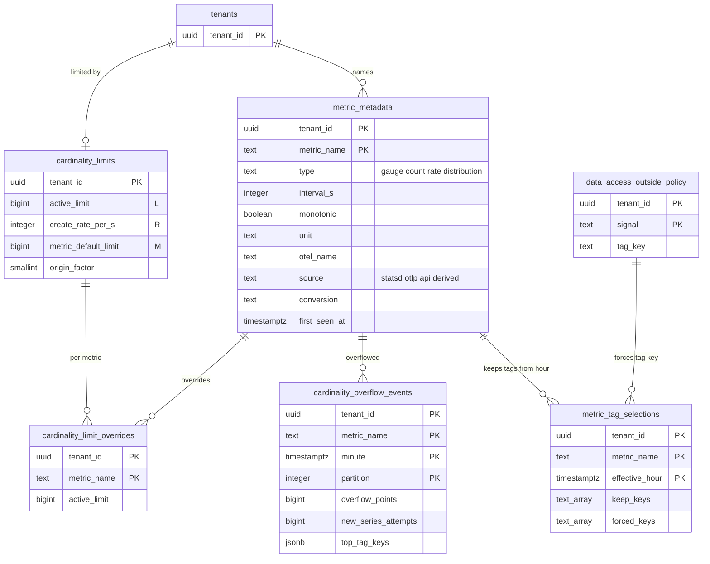

# Data model: 指標の情報とカーディナリティ

[data-model.md](../data-model.md) の一部。規約はそちらの 3 節に従う。振る舞いは [metrics-model-and-cardinality.md](../metrics-model-and-cardinality.md)（4〜8 節）と [distributions-and-sketches.md](../distributions-and-sketches.md)（6 節）を正とする。決定は [ADR-0006](../../decisions/0006-cardinality-policy.md)、[ADR-0016](../../decisions/0016-metric-types-and-cumulative-conversion.md)〜[ADR-0018](../../decisions/0018-tag-selection-preaggregation.md)、[ADR-0029](../../decisions/0029-distribution-ingest-conversions.md)。系列の鍵の作り方は [tsdb-formats.md](tsdb-formats.md) の 1 節、制御のレコードの形は [stores.md](stores.md) の 1.3 節。

| 表 | 置き場所 | 書く |
| --- | --- | --- |
| `metric_metadata` | テナントの表 | `metrics-ingester`（新しい名前の型の固定。X2）、`api`（単位・説明） |
| `cardinality_limits`、`cardinality_limit_overrides` | テナントの表 | `api`（運用の画面） |
| `cardinality_overflow_events` | テナントの表、月の分割 | `metrics-ingester`（貸し出しの持ち主だけ。X2） |
| `metric_tag_selections` | テナントの表 | `api` |

## 1. ER 図

- `cardinality_overflow_events` と `metric_tag_selections` から `metric_metadata` への線は論理の参照（分割した表から張らない。名前は指標の一覧と同じ規則）。

## 2. 表

### 2.1 `metric_metadata`

指標の型と情報（[metrics-model-and-cardinality.md](../metrics-model-and-cardinality.md) の 4.2・4.3 節）。型は最初に見たもので固定し、行は不変の部分を持つ。

| 列 | 型 | NULL | 既定 | 説明 |
| --- | --- | --- | --- | --- |
| `tenant_id` | `uuid` | NOT NULL | — | |
| `metric_name` | `text` | NOT NULL | — | `^[a-z][a-z0-9_.]{0,199}$`。小文字にした後 |
| `type` | `text` | NOT NULL | — | `gauge`・`count`・`rate`・`distribution`。**不変** |
| `interval_s` | `integer` | NULL | — | rate の間隔（取り込みで count に直す） |
| `monotonic` | `boolean` | NOT NULL | `false` | 累積の単調の印 |
| `cumulative` | `boolean` | NOT NULL | `false` | 点を `(ts, start, v)` で持つ（OTLP の cumulative） |
| `unit` | `text` | NULL | — | 組織が直せる |
| `unit_history` | `jsonb` | NOT NULL | `'[]'` | `[{unit, from_ts, by}]` |
| `otel_name` | `text` | NULL | — | OpenTelemetry の元の名前（`-`・`/` を `_` にする前） |
| `description` | `text` | NULL | — | 組織が直せる。4 KiB まで |
| `source` | `text` | NOT NULL | — | 最初の送り手：`statsd`・`otlp`・`api`・`derived`（ログ・スパンから作る指標、`<brand>.*`） |
| `conversion` | `text` | NOT NULL | `'none'` | 分布・Summary の取り込みの変換：`none`・`native_exponential`・`statsd_values`・`api_values`・`explicit_buckets`・`summary`（[distributions-and-sketches.md](../distributions-and-sketches.md) の 6 節。D-8） |
| `first_seen_at` | `timestamptz` | NOT NULL | — | 取り込みの時刻 `t_in`。**不変** |
| `updated_by`・`updated_at` | — | — | — | |

- キー：PK `(tenant_id, metric_name)`。
- 作り方：インジェスターが新しい名前を見たら `INSERT … ON CONFLICT DO NOTHING` してから読み、勝った型を使う。どの写し・どの読み直しでも同じ答えになる。
- CHECK：`metric_name ~ '^[a-z][a-z0-9_.]{0,199}$'`、`type IN (…)`、`type = 'rate'` なら `interval_s > 0`、`conversion IN (…)`、`conversion IN ('native_exponential','statsd_values','api_values','explicit_buckets')` なら `type = 'distribution'`。
- トリガー：`type`・`first_seen_at`・`source`・`cumulative` の更新を拒む。組織あたり 10 万（`too_many_metrics`）。
- 索引：`(tenant_id, metric_name text_pattern_ops)` — 指標の一覧と補完（前方一致）。補完の結果は制限を足した IR で絞る（指標の名前は制限の外でも見せる。[tenancy-and-rbac.md](../tenancy-and-rbac.md) の 6.3 節）。
- RLS：テナントの表。保持：最後の点から 15 か月（最長の保持）で消す（`compactor` が月に 1 回、X2）。S1 の量：約 200 万行（組織あたり平均 2,000）。

### 2.2 `cardinality_limits`・`cardinality_limit_overrides`

上限（[metrics-model-and-cardinality.md](../metrics-model-and-cardinality.md) の 7.2 節）。組織の上限と指標ごとの上書きを 2 つの表に分けた（D-9）。

| `cardinality_limits` の列 | 型 | NULL | 既定 | 説明 |
| --- | --- | --- | --- | --- |
| `tenant_id` | `uuid` | NOT NULL | — | |
| `active_limit` | `bigint` | NOT NULL | — | `L`。既定は契約の 2 倍（試用 10 万） |
| `create_rate_per_s` | `integer` | NOT NULL | `10000` | `R` |
| `metric_default_limit` | `bigint` | NOT NULL | `100000` | `M` |
| `origin_factor` | `smallint` | NOT NULL | `4` | タグの選択の元の系列の上限 `origin_factor × L` |
| `overflow_metric_cap` | `integer` | NOT NULL | `10000` | 溢れの系列を持つ指標の数の上限 |
| `epoch` | `bigint` | NOT NULL | `1` | 変更で 1 上げる。`LimitUpdate.epoch` の元 |
| `changed_by`・`change_reason`・`updated_at` | — | — | — | |

| `cardinality_limit_overrides` の列 | 型 | NULL | 既定 | 説明 |
| --- | --- | --- | --- | --- |
| `tenant_id` | `uuid` | NOT NULL | — | |
| `metric_name` | `text` | NOT NULL | — | |
| `active_limit` | `bigint` | NOT NULL | — | この指標の `M` |
| `changed_by`・`change_reason`・`updated_at` | — | — | — | |

- キー：`cardinality_limits` PK `tenant_id`。`cardinality_limit_overrides` PK `(tenant_id, metric_name)`、FK `tenant_id` → `cardinality_limits`。
- CHECK：すべての値 `> 0`、`origin_factor BETWEEN 1 AND 16`。
- 変更は `limits-coordinator` が次の分に読み、`LimitUpdate` を組織のパーティションのすべてに書く（[stores.md](stores.md) の 1.3 節）。上書きの変更でも `cardinality_limits.epoch` を上げる（トリガー）。
- RLS：テナントの表。S1 の量：1,000 行と 数千行。

### 2.3 `cardinality_overflow_events`

溢れの記録（[metrics-model-and-cardinality.md](../metrics-model-and-cardinality.md) の 7.5 節）。値（タグの値）を持たない。

| 列 | 型 | NULL | 既定 | 説明 |
| --- | --- | --- | --- | --- |
| `tenant_id` | `uuid` | NOT NULL | — | |
| `metric_name` | `text` | NOT NULL | — | |
| `minute` | `timestamptz` | NOT NULL | — | 取り込みの時刻の分の区切り。分割の鍵 |
| `partition` | `integer` | NOT NULL | — | `metrics` のパーティション |
| `cell_id` | `text` | NOT NULL | — | |
| `overflow_points` | `bigint` | NOT NULL | — | 溢れの系列に入れた点 |
| `new_series_attempts` | `bigint` | NOT NULL | — | 作れなかった新しい系列の数 |
| `dropped_points` | `bigint` | NOT NULL | `0` | 溢れの系列の上限（1 万の指標）を超えて数えるだけの点 |
| `limit_hit` | `text` | NOT NULL | — | `partition_total`・`metric`・`tenant`・`create_rate`・`origin` |
| `top_tag_keys` | `jsonb` | NOT NULL | `'[]'` | `[{key, estimated_values}]` を 3 つまで（HyperLogLog の推定） |

- キー：PK `(tenant_id, metric_name, minute, partition)`（D-10。パーティションごとに 1 分 1 行）。
- 書き方：貸し出しの持ち主の写しだけが書き、同じトランザクションで `outbox` に `cardinality.overflow`（組織・指標・分）を書く。`api` は outbox から知らせを作り、同じ（組織、指標）は 1 時間に 1 回にまとめる。読み直しの再書き込みは `ON CONFLICT DO NOTHING`。
- 索引：PK の前の部分 — 画面の指標ごとの時系列。`(tenant_id, minute)` — 利用量の画面の「溢れた点」。
- CHECK：`date_trunc('minute', minute) = minute`、`jsonb_array_length(top_tag_keys) <= 3`。
- 分割：`minute` の月。保持：90 日（分割を `DROP`）。
- RLS：テナントの表。S1 の量：溢れのある（組織、指標、パーティション）だけ。平常で 1 日 数万行（初期見積もり）。

### 2.4 `metric_tag_selections`

クエリに残すタグの選択（[metrics-model-and-cardinality.md](../metrics-model-and-cardinality.md) の 8 節、[ADR-0018](../../decisions/0018-tag-selection-preaggregation.md)）。変更は次の 1 時間の区切りから効き、過去のブロックは書き換えない。

| 列 | 型 | NULL | 既定 | 説明 |
| --- | --- | --- | --- | --- |
| `tenant_id` | `uuid` | NOT NULL | — | |
| `metric_name` | `text` | NOT NULL | — | |
| `effective_hour` | `timestamptz` | NOT NULL | — | 効く時間の区切り |
| `keep_keys` | `text[]` | NULL | — | 残すタグの鍵。NULL は選択を外す（すべて残す） |
| `forced_keys` | `text[]` | NOT NULL | `'{}'` | データセットのタグの鍵（落とせない。自動で足す） |
| `changed_by`・`created_at` | — | — | — | |

- キー：PK `(tenant_id, metric_name, effective_hour)`。
- 時間 `H` に効く選択は「`effective_hour ≤ H` の最後の行」。`api` は行を足すときに `TagSelectionUpdate{tenant_id, metric, keep_keys ∪ forced_keys, effective_hour}` を outbox に書き、`limits-coordinator` が組織のパーティションのすべてへ MSK で届ける。
- CHECK：`date_trunc('hour', effective_hour) = effective_hour`、`keep_keys IS NULL OR cardinality(keep_keys) <= 100`。
- トリガー：組織あたり選択のある指標 1,000（409）。`effective_hour` は次の区切り以後。過去の行を変えない。
- 変更で `tenants.query_cache_generation` を上げる（[ADR-0026](../../decisions/0026-query-cache-and-admission.md)）。
- RLS：テナントの表。保持：15 か月を過ぎた行を消す（効いている行は残す）。S1 の量：数万行。

## 3. 系列の数の見積もり（表にしない）

クエリの費用の見積もり（[metrics-query-engine.md](../metrics-query-engine.md) の 7.1 節）に要る「指標ごとの系列の数」は、Aurora の表に持たない（D-7）。

- 各ブロック（時間・日・月）の「統計」の区画に、指標ごとの系列の数がある（[tsdb-formats.md](tsdb-formats.md) の 4.8 節）。`query-frontend` は計画のときに、窓の `metric_blocks` の行から区画の表の位置を知り、統計の区画を範囲の GET で読んでメモリーと NVMe に持つ（ファイルは不変なので無効化しない）。
- 読めないとき（キャッシュの外れの時間切れ）は、`metric_blocks.series_count`（ブロックの全系列）を上の見積もりに使う。
- 理由：指標 × 時間のブロックの行は S1 で 1 時間 約 1,200 万行になり、Aurora の書き込みに合わない。統計はブロックに既にある。
