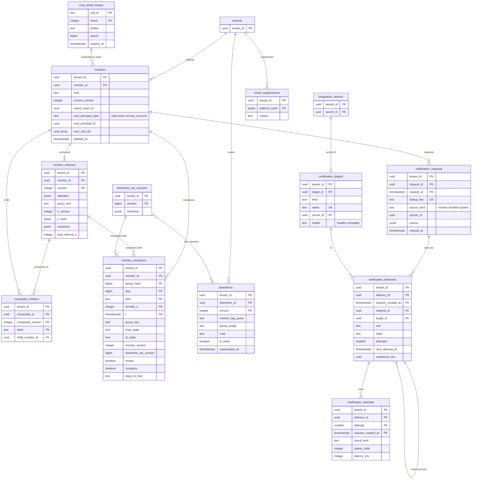

# Data model: モニターと通知

[data-model.md](../data-model.md) の一部。規約はそちらの 3 節に従う。振る舞いは [monitors-and-alerting.md](../monitors-and-alerting.md)（4〜11 節）と [notifications-and-integrations.md](../notifications-and-integrations.md)（4〜7 節）を正とする。決定は [ADR-0008](../../decisions/0008-monitor-evaluation-model.md)、[ADR-0041](../../decisions/0041-monitor-state-machine.md)〜[ADR-0046](../../decisions/0046-notification-templates-and-webhook-signing.md)、[ADR-0051](../../decisions/0051-roles-permissions-and-data-access-restrictions.md)。

| 表 | 置き場所 | 書く |
| --- | --- | --- |
| `monitors`、`monitor_versions`、`composite_children` | テナントの表 | `api` |
| `monitor_transitions` | テナントの表、`t` の月の分割 | `monitor-evaluator`（X2。通知の依頼と同じトランザクション） |
| `downtimes`、`downtime_set_versions` | テナントの表 | `api` |
| `maint.eval_shard_leases` | `maint` | `monitor-evaluator`・`slo-calculator` |
| `notification_requests` | テナントの表（outbox）、`created_at` の日の分割 | `monitor-evaluator`、`api`（インシデント） |
| `notification_deliveries`、`notification_attempts` | テナントの表、`request_created_at` の月の分割 | `notifier`（X2） |
| `notification_targets`、`email_suppressions` | テナントの表 | `api`、`notifier`（健康の状態、抑止） |

グループの状態（[monitors-and-alerting.md](../monitors-and-alerting.md) の 7.1 節）は表にしない。評価器のメモリーと、5 分ごとの S3 のスナップショット（4.2 節）と、遷移の記録から作り直す。

## 1. ER 図



- `notification_targets.secret_id`（メールは NULL）と `notification_deliveries.coalesced_into` は任意の参照。
- `monitor_transitions`・`notification_*` は分割した表なので、そこへの線と、そこからの線は論理の参照（外部キーを張らない）。`eval_shard_leases` との線は `xxh3_64(tenant_id ‖ monitor_id) mod 4096` で決まる計算の関係。

## 2. 表

### 2.1 `monitors`

モニターの見出し（[monitors-and-alerting.md](../monitors-and-alerting.md) の 4 節）。定義の中身は `monitor_versions`。

| 列 | 型 | NULL | 既定 | 説明 |
| --- | --- | --- | --- | --- |
| `tenant_id`・`monitor_id` | `uuid` | NOT NULL | `uuidv7()` | |
| `name` | `text` | NOT NULL | — | |
| `kind` | `text` | NOT NULL | — | `metric`・`metric_change`・`log`・`apm`・`composite`・`slo_burn_rate`・`slo_budget` |
| `current_version` | `integer` | NOT NULL | `1` | |
| `owner_team_id` | `uuid` | NULL | — | 持ち主のチーム（作った人が去っても残る） |
| `created_by` | `uuid` | NOT NULL | — | |
| `eval_principal_type` | `text` | NOT NULL | `'roles'` | 評価の主体：`roles`（保存した人の役割の写し）・`team`・`service_account`（D-12） |
| `eval_principal_id` | `uuid` | NULL | — | `team`・`service_account` のとき |
| `eval_role_ids` | `uuid[]` | NULL | — | `roles` のとき、保存した時点の役割 |
| `tags` | `text[]` | NOT NULL | `'{}'` | ダウンタイムのモニターの選び方に使う |
| `priority` | `smallint` | NULL | — | 1〜5 |
| `slo_id` | `uuid` | NULL | — | `slo_burn_rate`・`slo_budget` のとき |
| `created_at`・`updated_at`・`deleted_at` | `timestamptz` | — | — | 削除は印（遷移の記録の保持の間） |

- キー：PK `(tenant_id, monitor_id)`。FK `(tenant_id, monitor_id, current_version)` → `monitor_versions`（`DEFERRABLE INITIALLY DEFERRED`。新しいバージョンの行と同じトランザクションで進める）。
- 索引：`(tenant_id) WHERE deleted_at IS NULL` — 評価器がシャードの組織のモニターを読む（X2）。`(tenant_id, tags) USING gin` — ダウンタイムのタグの条件。
- CHECK：`kind IN (…)`、`eval_principal_type IN (…)`、`(eval_principal_type = 'roles') = (eval_role_ids IS NOT NULL)`、`(eval_principal_type <> 'roles') = (eval_principal_id IS NOT NULL)`、`kind NOT LIKE 'slo_%' OR slo_id IS NOT NULL`。
- 保存する人は、評価の主体の見える範囲を自分も見られる必要がある（`api` の `can()`）。主体の制限が変わったら、バージョンを上げずに次の評価から新しい述語を使い、遷移の記録に `authz_version` を残す。
- トリガー：組織あたり 5,000（`deleted_at IS NULL`）。
- RLS：テナントの表。保持：削除の印の 90 日後に消す（遷移の記録と同じ）。S1 の量：約 50 万行。

### 2.2 `monitor_versions`

定義のバージョン（[monitors-and-alerting.md](../monitors-and-alerting.md) の 4.2 節）。行は不変。評価は `t` の時点で有効なバージョンを使う。

| 列 | 型 | NULL | 既定 | 説明 |
| --- | --- | --- | --- | --- |
| `tenant_id`・`monitor_id` | `uuid` | NOT NULL | — | |
| `version` | `integer` | NOT NULL | — | |
| `definition` | `jsonb` | NOT NULL | — | 4.2 節の全項目（比べ、閾値、回復の閾値、窓、遅らせ、回数、データなしの方針、グループの保持、新しいグループの待ち、再通知、本文の雛形、優先度、タグ） |
| `query_text` | `text` | NOT NULL | — | クエリの文（実行のたびに IR を作る） |
| `ir_version` | `integer` | NOT NULL | — | 保存のときの IR のバージョン |
| `ir_hash` | `bytea` | NOT NULL | — | 保存のときの IR のハッシュ（同じクエリのまとめ、`definition_reset` の判定） |
| `ir_pinned_until` | `timestamptz` | NULL | — | 古い意味の固定（90 日まで。[delivery.md](../delivery.md) の 6.3 節） |
| `group_by` | `text[]` | NOT NULL | `'{}'` | 4 つまで |
| `recipients` | `jsonb` | NOT NULL | `'[]'` | 雛形を解析した条件つきの宛先（`[{target_id or team_handle, when}]`） |
| `eval_interval_s` | `integer` | NOT NULL | — | 窓から決まる頻度（60・600・1800） |
| `window_s`・`delay_s` | `integer` | NOT NULL | — | |
| `effective_from` | `timestamptz` | NOT NULL | `now()` | |
| `created_by`・`created_at` | — | — | — | |

- キー：PK `(tenant_id, monitor_id, version)`。FK → `monitors`。
- CHECK：`window_s BETWEEN 60 AND 172800`、`delay_s BETWEEN 0 AND 86400`、`cardinality(group_by) <= 4`、`eval_interval_s IN (60, 600, 1800)`、`octet_length(ir_hash) = 16`。閾値の大小の規則は保存のときに `api` が確かめる。
- トリガー：更新と削除を拒む。
- RLS：テナントの表。保持：モニターと一緒に消す（遷移の記録の保持より前のバージョンは、参照がなければ 90 日で消す）。S1 の量：約 300 万行。

### 2.3 `composite_children`

複合モニターの子（[monitors-and-alerting.md](../monitors-and-alerting.md) の 10 節）。複合のバージョンごとに持つ（再生で同じ子を使うため。D-13）。

| 列 | 型 | NULL | 既定 | 説明 |
| --- | --- | --- | --- | --- |
| `tenant_id`・`composite_id` | `uuid` | NOT NULL | — | |
| `composite_version` | `integer` | NOT NULL | — | |
| `label` | `text` | NOT NULL | — | 式の `a`・`b` |
| `child_monitor_id` | `uuid` | NOT NULL | — | 同じ組織、複合でない |
| `warn_as_true` | `boolean` | NOT NULL | `false` | |

- キー：PK `(tenant_id, composite_id, composite_version, label)`。FK `(tenant_id, composite_id, composite_version)` → `monitor_versions`、FK `(tenant_id, child_monitor_id)` → `monitors`。
- 索引：`(tenant_id, child_monitor_id)` — 子の削除の前の確かめ。
- トリガー：子は 10 まで、子が `composite` なら拒む、`label ~ '^[a-z]$'`。
- RLS：テナントの表。S1 の量：数万行。

### 2.4 `monitor_transitions`

遷移の記録（[monitors-and-alerting.md](../monitors-and-alerting.md) の 11 節）。追記だけ。通知の依頼と同じトランザクションで書く。

| 列 | 型 | NULL | 既定 | 説明 |
| --- | --- | --- | --- | --- |
| `tenant_id`・`monitor_id` | `uuid` | NOT NULL | — | |
| `group_hash` | `bytea` | NOT NULL | — | `xxh3_128(group_key)`。単一のアラートは空の文字列のハッシュ（D-11） |
| `group_key` | `text` | NOT NULL | — | グループのタグの `key:value` を鍵の順に `,` でつないだもの（評価の主体の制限の中の値） |
| `seq` | `bigint` | NOT NULL | — | グループの遷移の番号。`renotify` などは直前の `seq` |
| `kind` | `text` | NOT NULL | — | `transition`・`renotify`・`flapping_start`・`flapping_end`・`downtime_end`・`group_removed`・`definition_reset` |
| `renotify_n` | `integer` | NOT NULL | `0` | 再通知の番号 |
| `t` | `timestamptz` | NOT NULL | — | 評価の時刻。分割の鍵 |
| `from_state`・`to_state` | `text` | NOT NULL | — | `OK`・`WARN`・`ALERT`・`NO_DATA` |
| `monitor_version` | `integer` | NOT NULL | — | |
| `downtime_set_version` | `bigint` | NOT NULL | — | |
| `authz_version` | `bigint` | NOT NULL | — | 評価に使った述語のバージョン |
| `eval_code_version` | `text` | NOT NULL | — | 評価のコードのバージョン（再生で使う） |
| `muted` | `boolean` | NOT NULL | `false` | |
| `value` | `float8` | NULL | — | 値なしは NULL |
| `complete` | `boolean` | NOT NULL | — | 評価の完全さ |
| `decision_row` | `smallint` | NULL | — | 決定表（DT）の行の番号（「なぜ鳴ったか」） |
| `input_s3_key` | `text` | NULL | — | 入力の写し（4.1 節） |
| `input_offset` | `bigint` | NULL | — | 写しのファイルの中の位置 |
| `recorded_at` | `timestamptz` | NOT NULL | `now()` | |

- キー：PK `(tenant_id, monitor_id, group_hash, seq, kind, renotify_n, t)`（分割の鍵を含める）。この組から `t` を除いたものが通知の重ねない鍵（[ADR-0045](../../decisions/0045-notification-delivery-model.md)）。
- 索引：`(tenant_id, t)` — 組織の出来事の一覧、SLO（モニターの SLO の時の行）。`(tenant_id, monitor_id, group_hash, t DESC)` — 複合の子の最後の状態、画面のグループの履歴。
- CHECK：`kind IN (…)`、状態の値、`octet_length(group_hash) = 16`、`renotify_n >= 0`。
- トリガー：更新と削除を拒む（保持のジョブを除く）。
- 分割：`t` の月。保持：90 日（分割を `DROP`。D-11）。インシデントのタイムラインの参照は、保持の外では「記録は保持の外」と出す。
- RLS：テナントの表。S1 の量：平常 1 秒 170 行（障害の日 1,000）、1 日 約 1,500 万行、90 日で 約 13 億行（初期見積もり。Aurora の容量 約 2 TB の大部分。[capacity.md](../capacity.md) の 5.1 節）。

### 2.5 `downtimes`

ダウンタイムとミュート（[monitors-and-alerting.md](../monitors-and-alerting.md) の 9 節、[ADR-0043](../../decisions/0043-downtimes-as-evaluation-input.md)）。変更は新しいバージョンの行にし、古い行を残す（再生で同じ定義を使うため。D-13）。

| 列 | 型 | NULL | 既定 | 説明 |
| --- | --- | --- | --- | --- |
| `tenant_id`・`downtime_id` | `uuid` | NOT NULL | — | |
| `version` | `integer` | NOT NULL | — | |
| `monitor_ids` | `uuid[]` | NULL | — | モニターの ID の並び |
| `monitor_tag_query` | `text` | NULL | — | モニターのタグの条件（どちらか一方） |
| `group_scope` | `text` | NOT NULL | `'*'` | グループのタグの条件（入れ子 2 段まで） |
| `schedule_kind` | `text` | NOT NULL | — | `once`・`recurring` |
| `start_at`・`end_at` | `timestamptz` | NULL | — | `once`。ミュートは `end_at` を省ける |
| `rrule` | `text` | NULL | — | `recurring` |
| `duration_s` | `integer` | NULL | — | 1 回の長さ |
| `timezone` | `text` | NOT NULL | `'Asia/Tokyo'` | |
| `until_at`・`occurrences` | — | NULL | — | 繰り返しの終わり |
| `notify_end_states` | `text[]` | NOT NULL | `'{ALERT,WARN,NO_DATA}'` | 終わりの通知の対象 |
| `notify_recovery_inside` | `boolean` | NOT NULL | `true` | 間の最初の回復を知らせる |
| `is_mute` | `boolean` | NOT NULL | `false` | 画面のミュートのボタン |
| `created_by`・`created_at` | — | — | — | |
| `superseded_at`・`canceled_at` | `timestamptz` | NULL | — | |

- キー：PK `(tenant_id, downtime_id, version)`。UK `(tenant_id, downtime_id) WHERE superseded_at IS NULL`。
- CHECK：`(monitor_ids IS NULL) <> (monitor_tag_query IS NULL)`、`schedule_kind = 'once'` なら `start_at IS NOT NULL`、`schedule_kind = 'recurring'` なら `rrule IS NOT NULL AND duration_s > 0`。
- 変更のたびに `downtime_set_versions` に新しいバージョンを足し、outbox（`downtime-set-updated`）で評価器に配る。トリガー：組織の有効な行 1,000。
- RLS：テナントの表。保持：`superseded_at`・`canceled_at` の 90 日後（再生の範囲の後）に消す。S1 の量：約 20 万行。

### 2.6 `downtime_set_versions`

組織のダウンタイムの集まりのバージョン（[ADR-0043](../../decisions/0043-downtimes-as-evaluation-input.md)）。評価器は `t` の評価に使ったバージョンを遷移の記録に書く。

| 列 | 型 | NULL | 既定 | 説明 |
| --- | --- | --- | --- | --- |
| `tenant_id` | `uuid` | NOT NULL | — | |
| `version` | `bigint` | NOT NULL | — | 単調 |
| `members` | `jsonb` | NOT NULL | — | `[[downtime_id, version], …]`（そのバージョンで有効な定義） |
| `created_at` | `timestamptz` | NOT NULL | `now()` | |

- キー：PK `(tenant_id, version)`。トリガー：更新と削除を拒む（保持のジョブを除く）。
- RLS：テナントの表。保持：90 日（参照する遷移の記録と同じ。最新のバージョンは残す）。S1 の量：数十万行。

### 2.7 `maint.eval_shard_leases`

評価のシャード（仮想 4,096）の貸し出し（[ADR-0008](../../decisions/0008-monitor-evaluation-model.md)）。`slo-calculator` も同じシャードを使う。

| 列 | 型 | NULL | 既定 | 説明 |
| --- | --- | --- | --- | --- |
| `cell_id` | `text` | NOT NULL | — | |
| `shard` | `integer` | NOT NULL | — | 0〜4095 |
| `holder` | `text` | NULL | — | タスクの ID |
| `epoch` | `bigint` | NOT NULL | `0` | |
| `expires_at` | `timestamptz` | NULL | — | 30 秒、10 秒ごとに延ばす |
| `last_snapshot_key` | `text` | NULL | — | 最後のスナップショット（持ち主の交代で読む） |

- キー：PK `(cell_id, shard)`。CHECK：`shard BETWEEN 0 AND 4095`。
- RLS：なし（`maint`）。S1 の量：4,096 行。

### 2.8 `notification_requests`

通知の依頼（outbox。[notifications-and-integrations.md](../notifications-and-integrations.md) の 4 節、[ADR-0045](../../decisions/0045-notification-delivery-model.md)）。1 つのモニターの 1 回の評価、またはインシデントの 1 つの出来事ごとに 1 行。

| 列 | 型 | NULL | 既定 | 説明 |
| --- | --- | --- | --- | --- |
| `tenant_id`・`request_id` | `uuid` | NOT NULL | `uuidv7()` | |
| `created_at` | `timestamptz` | NOT NULL | `now()` | 分割の鍵 |
| `dedup_key` | `text` | NOT NULL | — | `mon:<monitor_id>:<t のミリ秒>`・`inc:<incident_id>:<event_id>`・`sys:<kind>:<id>`（D-14） |
| `source_kind` | `text` | NOT NULL | — | `monitor`・`incident`・`system`（溢れ・上限・評価できない、など） |
| `source_id` | `uuid` | NOT NULL | — | |
| `source_version` | `integer` | NULL | — | 描くためのモニターのバージョン |
| `events` | `jsonb` | NOT NULL | — | グループごとの出来事の並び（グループのタグ、種類、前後の状態、`seq`、値、閾値、`suppressed`） |
| `channel_kinds` | `text[]` | NOT NULL | — | SNS の属性（SQS のフィルター） |
| `relayed_at` | `timestamptz` | NULL | — | `relay` が SNS に出した時刻 |

- キー：PK `(tenant_id, request_id, created_at)`。UK `(tenant_id, dedup_key, created_at)`。重ねない鍵は日をまたがない（評価の再試行は同じ日の中）ので、日の分割の中の一意で足りる。読み直しの同じ依頼は `ON CONFLICT DO NOTHING`。
- 索引：`(created_at) WHERE relayed_at IS NULL` — `relay` の読み出し（X3、`BYPASSRLS`）。
- 分割：`created_at` の日。保持：30 日（送信の行と同じ）。
- RLS：テナントの表（書き込みは組織の文脈。読み出しは X3 の `relay`）。S1 の量：1 日 約 500 万行。

### 2.9 `notification_deliveries`

宛先ごとの送信の行（[notifications-and-integrations.md](../notifications-and-integrations.md) の 5 節）。`delivery_id` が `<Brand>-Delivery-Id` とメールの `Message-ID` になる。

| 列 | 型 | NULL | 既定 | 説明 |
| --- | --- | --- | --- | --- |
| `tenant_id`・`delivery_id` | `uuid` | NOT NULL | `uuidv7()` | |
| `request_created_at` | `timestamptz` | NOT NULL | — | 依頼の `created_at`。分割の鍵（D-14） |
| `request_id` | `uuid` | NOT NULL | — | |
| `target_id` | `uuid` | NOT NULL | — | |
| `unit` | `text` | NOT NULL | — | まとめの単位：`group:<group_hash の 16 進>`・`summary:<event_kind>`・`rate_summary:<窓>` |
| `state` | `text` | NOT NULL | `'pending'` | `pending`・`sending`・`delivered`・`retry_wait`・`failed`・`suppressed`・`held`・`delayed`・`coalesced`・`cancelled` |
| `attempts` | `smallint` | NOT NULL | `0` | 8 まで |
| `next_attempt_at` | `timestamptz` | NULL | — | |
| `lease_owner`・`lease_expires_at` | — | NULL | — | 60 秒のリース |
| `coalesced_into` | `uuid` | NULL | — | まとめの 1 通の `delivery_id` |
| `oncall_dedup_key` | `text` | NULL | — | `<tenant_id>:<monitor_id>:<group のハッシュ>`・`<tenant_id>:incident:<番号>` |
| `last_error_code` | `text` | NULL | — | 応答の本文は保存しない |
| `created_at`・`delivered_at` | `timestamptz` | — | — | |

- キー：PK `(tenant_id, delivery_id, request_created_at)`。UK `(tenant_id, request_id, target_id, unit, request_created_at)`（`INSERT … ON CONFLICT DO NOTHING`）。
- 索引：`(tenant_id, state, next_attempt_at) WHERE state IN ('pending','retry_wait','delayed','held')` — 回復の掃除（X2 で組織ごとに 30 秒。ふだんの再試行は SQS の遅延のメッセージで行う。D-14）。`(tenant_id, target_id, created_at)` — 宛先の履歴、50 回続けての失敗。
- CHECK：`state IN (…)`、`attempts BETWEEN 0 AND 8`、`state <> 'coalesced' OR coalesced_into IS NOT NULL`。
- 分割：`request_created_at` の月。保持：30 日（[ADR-0045](../../decisions/0045-notification-delivery-model.md)。古い分割を `DROP` し、月の途中の分は日次で消す）。
- RLS：テナントの表。S1 の量：1 日 約 500 万行（初期見積もり）。

### 2.10 `notification_attempts`

試行（時刻、結果の種類、状態のコード、遅れ）。

| 列 | 型 | NULL | 既定 | 説明 |
| --- | --- | --- | --- | --- |
| `tenant_id`・`delivery_id` | `uuid` | NOT NULL | — | |
| `attempt` | `smallint` | NOT NULL | — | 1〜8 |
| `request_created_at` | `timestamptz` | NOT NULL | — | 分割の鍵 |
| `at` | `timestamptz` | NOT NULL | — | |
| `result_kind` | `text` | NOT NULL | — | `ok`・`connect_error`・`timeout`・`http_5xx`・`http_429`・`http_408`・`http_4xx`・`ssrf_blocked`・`redirect` |
| `status_code` | `integer` | NULL | — | |
| `latency_ms` | `integer` | NOT NULL | — | |

- キー：PK `(tenant_id, delivery_id, attempt, request_created_at)`。分割・保持は `notification_deliveries` と同じ。
- RLS：テナントの表。S1 の量：送信の行の 約 1.1 倍。

### 2.11 `notification_targets`

通知の宛先（[notifications-and-integrations.md](../notifications-and-integrations.md) の 6・7 節）。秘密（チャットの URL、Webhook の署名の秘密、オンコールの鍵、固定のヘッダー）は `integration_secrets` に置く（D-15）。

| 列 | 型 | NULL | 既定 | 説明 |
| --- | --- | --- | --- | --- |
| `tenant_id`・`target_id` | `uuid` | NOT NULL | `uuidv7()` | |
| `kind` | `text` | NOT NULL | — | `email`・`chat_slack`・`chat_teams`・`webhook`・`oncall_pagerduty`・`oncall_opsgenie` |
| `name` | `text` | NOT NULL | — | 雛形の `@chat:<名前>` など。メールはアドレス |
| `config` | `jsonb` | NOT NULL | `'{}'` | 秘密でない設定（本文の形、Webhook の JSON の雛形、送らない状態） |
| `secret_id` | `uuid` | NULL | — | `integration_secrets` |
| `health` | `text` | NOT NULL | `'healthy'` | `healthy`・`unhealthy`（50 回続けての失敗） |
| `consecutive_failures` | `integer` | NOT NULL | `0` | |
| `verified_at` | `timestamptz` | NULL | — | メールの確認 |
| `created_by`・`created_at`・`deleted_at` | — | — | — | 削除で未送信の行を `cancelled` にする |

- キー：PK `(tenant_id, target_id)`。UK `(tenant_id, kind, name) WHERE deleted_at IS NULL`。FK `(tenant_id, secret_id)` → `integration_secrets`。
- CHECK：`kind IN (…)`、`kind = 'email' OR secret_id IS NOT NULL`。
- RLS：テナントの表。秘密の復号は `notifier` のロールだけ（[ADR-0058](../../decisions/0058-untrusted-senders-egress-and-operator-access.md)）。S1 の量：約 3 万行。

### 2.12 `email_suppressions`

メールの抑止（[notifications-and-integrations.md](../notifications-and-integrations.md) の 7.1 節）。アドレスはハッシュで持つ。

| 列 | 型 | NULL | 既定 | 説明 |
| --- | --- | --- | --- | --- |
| `tenant_id` | `uuid` | NOT NULL | — | |
| `address_hash` | `bytea` | NOT NULL | — | 小文字にしたアドレスの SHA-256 |
| `reason` | `text` | NOT NULL | — | `bounce`・`complaint`・`unsubscribe` |
| `at` | `timestamptz` | NOT NULL | `now()` | |

- キー：PK `(tenant_id, address_hash)`。RLS：テナントの表。保持：1 年。S1 の量：数千行。

## 3. ステートマシンの入力と出力（表にしない）

```
step(monitor_version, prev_group_state, (value | none, complete), t) -> (next_group_state, events)
notify_decide(monitor_version, group_state, events, t, downtime_set_version) -> notification decisions
```

- どちらも純粋な関数。壁の時計・乱数・処理の順序を使わない（グループは `group_key` の順に当てる）。再生は、同じ入力（スナップショット、入力の写し、`monitor_versions`、`downtimes` のバージョン、`eval_code_version`）から同じ `monitor_transitions` を作る（[ADR-0041](../../decisions/0041-monitor-state-machine.md)、[ADR-0042](../../decisions/0042-flapping-and-renotify.md)）。

## 4. 評価の記録（S3）

形式の細部はこの文書で決めた（D-30）。どちらも組織の接頭辞の下に置く（D-39）。

### 4.1 入力の写し（`EVR1` バージョン 1）

- キー：`<cell>/<tenant_id>/evals/eval-30d/<yyyy>/<mm>/<dd>/<hh>/<shard>-<minute>.rec`。1 分ごとに、シャードの組織ごとのバッファーを書く。保持 30 日。
- 中身：`magic "EVR1" ‖ version u16 ‖ tenant_id ‖ shard u16 ‖ minute_ms i64`、続けて評価ごとの記録 `len u32 ‖ (monitor_id, t, monitor_version, downtime_set_version, authz_version, eval_code_version, complete, ir_hash, groups: [(group_key, value | none)])`、末尾に `xxh3_128`。記録は遷移のあった評価のすべてと、遷移のない評価の 1% の抜き取り。
- `monitor_transitions.input_s3_key`・`input_offset` が記録を指す。

### 4.2 スナップショット（`EVS1` バージョン 1）

- キー：`<cell>/<tenant_id>/evals/snapshots/<shard>/<seq>.snap`（区分 `eval-30d`、保持は最新の 3 つと 24 時間。D-39）。5 分ごと。
- 中身：その組織のシャードの全グループの状態（[monitors-and-alerting.md](../monitors-and-alerting.md) の 7.1 節の項目）と `evaluated_through`。持ち主の交代と再生の始まりに使う。
- Valkey の `evaluated_through:{tenant_id}:{monitor_id}` は失ってよい写しで、正はスナップショットと遷移の記録。
