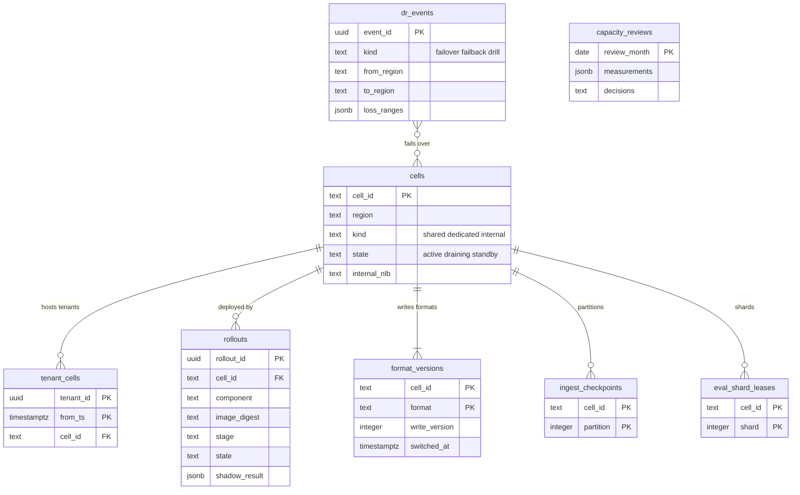

# Data model: 運用とセル（`maint` スキーマ）

[data-model.md](../data-model.md) の一部。規約はそちらの 3 節に従う。振る舞いは [infrastructure.md](../infrastructure.md)（6・7 節）、[delivery.md](../delivery.md)（4.2・6 節）、[capacity.md](../capacity.md)（10 節）を正とする。決定は [ADR-0003](../../decisions/0003-tenancy-cells-and-isolation.md)（`maint` の一覧）、[ADR-0061](../../decisions/0061-dr-stage-up-and-cell-expansion.md)、[ADR-0064](../../decisions/0064-capacity-headroom-and-load-test-gates.md)〜[ADR-0066](../../decisions/0066-format-versioning-and-compatibility-windows.md)。

`maint` の表はテレメトリーの値・タグの値・ログの本文を持たず、組織の ID・オフセット・数・状態だけを持つ（ADR-0003 の 2026-10-09 の注記）。`maint` の全表の一覧は [data-model.md](../data-model.md) の 3.4 節。この文書は、他の領域の文書に属さない運用の 5 表を定義する。

| 表 | 書く |
| --- | --- |
| `maint.cells` | 運用（Terraform の適用の後の登録） |
| `maint.dr_events` | IC と Ops の責任者（DR の手順） |
| `maint.rollouts` | `rollout-controller` |
| `maint.format_versions` | `rollout-controller`（書く側の切り替え） |
| `maint.capacity_reviews` | Ops（月次のレビュー） |

## 1. ER 図

## 2. 表

### 2.1 `maint.cells`

セル（[infrastructure.md](../infrastructure.md) の 7 節）。S1 は `apne1-c0`（社内の見張り）と `apne1-c1`（共有）。

| 列 | 型 | NULL | 既定 | 説明 |
| --- | --- | --- | --- | --- |
| `cell_id` | `text` | NOT NULL | — | `<region>-c<n>`（例 `apne1-c1`）。S3 のキーの先頭と同じ |
| `region` | `text` | NOT NULL | — | `ap-northeast-1`・`ap-northeast-3` |
| `kind` | `text` | NOT NULL | — | `shared`・`dedicated`・`internal` |
| `state` | `text` | NOT NULL | `'active'` | `active`・`draining`・`standby`（大阪の DR）・`retired` |
| `internal_nlb` | `text` | NULL | — | S2 の `intake-router` が送るセルの内部の NLB（PrivateLink） |
| `intake_host` | `text` | NULL | — | `<cell>.intake.<brand>.<domain>`（`<Brand>-Intake-Cell` で返す） |
| `metrics_partitions` | `integer` | NOT NULL | — | `metrics` のトピックのパーティションの数 `P` |
| `created_at`・`updated_at` | — | — | — | |

- キー：PK `cell_id`。CHECK：`cell_id ~ '^[a-z0-9]+-c[0-9]+$'`、`kind IN (…)`、`state IN (…)`。
- RLS：なし（`maint`）。読むのは全ロール。S1 の量：数行。

### 2.2 `maint.dr_events`

DR の切り替えの記録と、失った範囲（[infrastructure.md](../infrastructure.md) の 6.3 節、[ADR-0061](../../decisions/0061-dr-stage-up-and-cell-expansion.md)）。

| 列 | 型 | NULL | 既定 | 説明 |
| --- | --- | --- | --- | --- |
| `event_id` | `uuid` | NOT NULL | `uuidv7()` | |
| `kind` | `text` | NOT NULL | — | `failover`・`failback`・`drill` |
| `from_region`・`to_region` | `text` | NOT NULL | — | |
| `decided_by` | `text[]` | NOT NULL | — | IC と Ops の責任者 |
| `started_at`・`ended_at` | `timestamptz` | — | — | |
| `loss_ranges` | `jsonb` | NOT NULL | `'[]'` | `[{tenant_id, signal, from, to}]`。組織ごとの失った時刻の範囲（ID と時刻だけ） |
| `notes` | `text` | NULL | — | |

- キー：PK `event_id`。
- 失った範囲は、クエリの「不完全」の印と、モニターのその範囲でのデータなし・回復の抑止に使う（`query-frontend`・`monitor-evaluator` が起動時に読む）。
- RLS：なし（`maint`）。保持：消さない。S1 の量：数行。

### 2.3 `maint.rollouts`

状態を持つ部品の入れ替えの記録（[delivery.md](../delivery.md) の 4.2 節、[ADR-0065](../../decisions/0065-stateful-rollout-with-replica-handoff.md)）。

| 列 | 型 | NULL | 既定 | 説明 |
| --- | --- | --- | --- | --- |
| `rollout_id` | `uuid` | NOT NULL | `uuidv7()` | |
| `cell_id` | `text` | NOT NULL | — | |
| `component` | `text` | NOT NULL | — | `metrics-ingester`・`query-reader`・`log-indexer`・`monitor-evaluator` など |
| `image_digest` | `text` | NOT NULL | — | |
| `stage` | `text` | NOT NULL | — | `staging`・`apne1-c0`・本番のセル |
| `unit` | `text` | NULL | — | 入れ替えの単位（インジェスターの組 `g` と写し `A`・`B`、シャード） |
| `state` | `text` | NOT NULL | `'running'` | `running`・`paused`・`done`・`rolled_back` |
| `shadow_result` | `jsonb` | NULL | — | 影の比べ（系列の抜き取り 1,000、見張りの系列、ヘッドの要約 2 回）の一致と数 |
| `started_by` | `text` | NOT NULL | — | |
| `started_at`・`finished_at` | `timestamptz` | — | — | |

- キー：PK `rollout_id`。索引：`(cell_id, component, started_at DESC)`。
- `ops.rollout_paused` が立っている間は新しい行を `running` にしない（`rollout-controller` が確かめる）。
- RLS：なし（`maint`）。保持：1 年。S1 の量：1 年 数万行。

### 2.4 `maint.format_versions`

形式ごとの、書く側の今の番号（[delivery.md](../delivery.md) の 6 節、[ADR-0066](../../decisions/0066-format-versioning-and-compatibility-windows.md)）。読む側の番号の一覧は指標 `svc_formats_readable{format, version}` で出し、表に持たない。

| 列 | 型 | NULL | 既定 | 説明 |
| --- | --- | --- | --- | --- |
| `cell_id` | `text` | NOT NULL | — | |
| `format` | `text` | NOT NULL | — | `codec_float`・`codec_hist`・`tsb`・`lseg`・`tokenizer`・`msk_envelope`・`checkpoint`・`ir`・`eval_record`・`eval_code` |
| `write_version` | `integer` | NOT NULL | — | |
| `effective_hour` | `timestamptz` | NULL | — | インジェスターの形式は時間の区切りで切り替える（組の 2 つの写しが同じ区切りから） |
| `switched_at` | `timestamptz` | NOT NULL | `now()` | |
| `switched_by` | `text` | NOT NULL | — | |

- キー：PK `(cell_id, format)`。
- トリガー：`write_version` を上げる更新は、`rollout-controller` が全タスクで読めることを確かめた印（関数の引数）があるときだけ許す。戻す更新は許す（読む側は新しい番号を読み続ける）。
- 書く側はこの表を起動時と 60 秒ごとに読み、`effective_hour` から新しい番号で書く。
- RLS：なし（`maint`）。S1 の量：数十行。

### 2.5 `maint.capacity_reviews`

月次のキャパシティのレビュー（[capacity.md](../capacity.md) の 10 節）。

| 列 | 型 | NULL | 既定 | 説明 |
| --- | --- | --- | --- | --- |
| `review_month` | `date` | NOT NULL | — | 月の 1 日 |
| `measurements` | `jsonb` | NOT NULL | — | 使用率（ピーク）、MSK の書き込みの余裕、有効な系列、Aurora の writer の CPU、売りすぎの比、段階を上げる基準への近さ |
| `decisions` | `text` | NOT NULL | — | |
| `reviewed_by` | `text[]` | NOT NULL | — | |
| `created_at` | `timestamptz` | NOT NULL | `now()` | |

- キー：PK `review_month`。RLS：なし（`maint`）。保持：消さない。S1 の量：12 行/年。
