# Data model: 組織・利用者・権限

[data-model.md](../data-model.md) の一部。規約はそちらの 3 節に従う。振る舞いは [tenancy-and-rbac.md](../tenancy-and-rbac.md)（4〜10 節）を正とする。決定は [ADR-0003](../../decisions/0003-tenancy-cells-and-isolation.md)（RLS、X 経路）、[ADR-0051](../../decisions/0051-roles-permissions-and-data-access-restrictions.md)（権限、データのアクセスの制限）、[ADR-0052](../../decisions/0052-identity-sso-scim-keys-and-audit-trail.md)（SSO、SCIM）、[ADR-0053](../../decisions/0053-child-orgs-and-tenant-cell-moves.md)（子の組織、セルの移し替え）。

| 表 | 置き場所 | 書く |
| --- | --- | --- |
| `tenants` | テナントの表 | `api`。作成は X4 の関数 `create_tenant()`（D-21） |
| `users`、`user_mfa_factors`、`sessions` | `public`、RLS の外 | `auth` |
| `memberships`、`teams`、`team_members` | テナントの表 | `api`、`auth`（JIT・SSO・SCIM） |
| `roles`、`role_permissions`、`role_assignments`、`service_accounts` | テナントの表 | `api`、`auth`（SSO の対応） |
| `data_access_outside_policy`、`data_access_datasets`、`dataset_grants` | テナントの表 | `api` |
| `sso_configs`、`sso_group_mappings`、`scim_tokens` | テナントの表 | `api`、`auth` |
| `tenant_settings` | テナントの表 | `api` |
| `tenant_cells` | `public`、RLS の外 | X4（`cell_assigner`）だけ |
| `cell_moves` | テナントの表 | X4（`cell-move` のワークフロー） |

## 1. ER 図

```mermaid
erDiagram
    tenants ||--o{ tenants : "parent of (one level)"
    tenants ||--|{ tenant_cells : "placed in (by from_ts)"
    tenants ||--o{ cell_moves : "moved by"
    tenants ||--o| tenant_settings : "configured by"
    users ||--o{ memberships : "joins"
    tenants ||--o{ memberships : "has"
    users ||--o{ user_mfa_factors : "registers"
    users ||--o{ sessions : "signs in"
    tenants ||--o{ teams : "has"
    teams ||--o{ team_members : "has"
    memberships ||--o{ team_members : "is"
    tenants ||--o{ roles : "defines"
    roles ||--o{ role_permissions : "grants"
    roles ||--o{ role_assignments : "assigned"
    memberships ||--o{ role_assignments : "user principal"
    service_accounts ||--o{ role_assignments : "service principal"
    tenants ||--o{ service_accounts : "owns"
    tenants ||--o{ data_access_outside_policy : "per signal"
    data_access_outside_policy ||--o{ data_access_datasets : "tag key of"
    data_access_datasets ||--o{ dataset_grants : "granted"
    roles ||--o{ dataset_grants : "role principal"
    teams ||--o{ dataset_grants : "team principal"
    tenants ||--o| sso_configs : "uses"
    tenants ||--o{ sso_group_mappings : "maps"
    tenants ||--o{ scim_tokens : "issues"

    tenants {
        uuid tenant_id PK
        uuid parent_tenant_id FK "null or top level"
        text name
        text lifecycle_state "active suspended purging purged"
        boolean legal_hold
        bigint authz_version
        bigint query_cache_generation
        boolean is_canary
    }
    tenant_cells {
        uuid tenant_id PK
        timestamptz from_ts PK
        text cell_id FK
        text move_state
    }
    cell_moves {
        uuid tenant_id PK
        uuid move_id PK
        text from_cell_id
        text to_cell_id
        timestamptz boundary_h
        text state
    }
    tenant_settings {
        uuid tenant_id PK
        text scrub_default_profile
        uuid scrub_hmac_secret_id FK
        numeric trace_retention_budget
        text notification_data_level
    }
    users {
        uuid user_id PK
        text email_normalized UK
        text status
    }
    user_mfa_factors {
        uuid factor_id PK
        uuid user_id FK
        text kind "totp passkey"
    }
    sessions {
        bytea session_hash PK
        uuid user_id FK
        uuid tenant_id "current org"
        timestamptz absolute_expires_at
    }
    memberships {
        uuid tenant_id PK
        uuid user_id PK
        text state
        text idp_subject UK
    }
    teams {
        uuid tenant_id PK
        uuid team_id PK
        text handle UK
    }
    team_members {
        uuid tenant_id PK
        uuid team_id PK
        uuid user_id PK
    }
    roles {
        uuid tenant_id PK
        uuid role_id PK
        text name UK
        text managed_key "admin standard read_only or null"
    }
    role_permissions {
        uuid tenant_id PK
        uuid role_id PK
        text permission PK
    }
    role_assignments {
        uuid tenant_id PK
        text principal_type PK "user service_account"
        uuid principal_id PK
        uuid role_id PK
    }
    service_accounts {
        uuid tenant_id PK
        uuid service_account_id PK
        text name UK
    }
    data_access_outside_policy {
        uuid tenant_id PK
        text signal PK "metrics logs traces"
        text tag_key UK
        text outside "visible restricted"
    }
    data_access_datasets {
        uuid tenant_id PK
        uuid dataset_id PK
        text signal FK
        text tag_key FK
        text_array tag_values
    }
    dataset_grants {
        uuid tenant_id PK
        uuid dataset_id PK
        text principal_type PK "role team"
        uuid principal_id PK
    }
    sso_configs {
        uuid tenant_id PK
        text protocol "saml oidc"
        boolean sso_only
    }
    sso_group_mappings {
        uuid tenant_id PK
        uuid mapping_id PK
        text idp_group
        text target_type "role team"
        uuid target_id
    }
    scim_tokens {
        uuid tenant_id PK
        uuid token_id PK
        bytea token_hash UK
    }
```

- `memberships`・`service_accounts` から `role_assignments` への線は、`principal_type` で分かれる多態の参照である。DB の外部キーは張らず、トリガーで `principal_type` ごとの存在を確かめる（`dataset_grants`・`sso_group_mappings` も同じ）。
- `tenants` の自分への線（親）は任意の参照（最上位の組織は `parent_tenant_id` が NULL）。
- `users`・`sessions` は RLS の外で、`memberships.user_id` からの外部キーだけを張る（RLS の表から RLS の外の表への参照）。

## 2. 表

### 2.1 `tenants`

組織（テナントの単位）。定義元：[tenancy-and-rbac.md](../tenancy-and-rbac.md) の 4・9 節、[security.md](../security.md) の 5.3・5.5 節、[metrics-query-engine.md](../metrics-query-engine.md) の 6 節、[observability.md](../observability.md) の 3.1 節。

| 列 | 型 | NULL | 既定 | 説明 |
| --- | --- | --- | --- | --- |
| `tenant_id` | `uuid` | NOT NULL | `uuidv7()` | |
| `parent_tenant_id` | `uuid` | NULL | — | 親の組織。1 段だけ |
| `name` | `text` | NOT NULL | — | 表示の名前。200 文字まで |
| `lifecycle_state` | `text` | NOT NULL | `'active'` | `active`・`suspended`・`purging`・`purged` |
| `suspended_at` | `timestamptz` | NULL | — | 猶予（仮 30 日）の起点 |
| `legal_hold` | `boolean` | NOT NULL | `false` | 保持の削除・解約の消去・削除の請求の物理の消去を止める |
| `legal_hold_changed_at` | `timestamptz` | NULL | — | 付け外しは 2 人（本システムの監査に残す） |
| `authz_version` | `bigint` | NOT NULL | `1` | 役割・所属・データセット・チームの変更で 1 上げる |
| `query_cache_generation` | `bigint` | NOT NULL | `1` | 削除の請求・保持・タグの選択・制限の定義の変更で 1 上げる |
| `is_canary` | `boolean` | NOT NULL | `false` | 見張りの組織。SLO・利用量・課金から除く |
| `created_at`・`updated_at` | `timestamptz` | NOT NULL | `now()` | |

- キー：PK `tenant_id`。FK `parent_tenant_id` → `tenants`。
- 索引：`(parent_tenant_id) WHERE parent_tenant_id IS NOT NULL` — 親の画面の子の一覧、子の数の上限（100）。
- CHECK：`lifecycle_state IN (…)`、`parent_tenant_id <> tenant_id`、`lifecycle_state <> 'suspended' OR suspended_at IS NOT NULL`。
- トリガー：親が親を持つ組織を拒む（1 段）。`authz_version`・`query_cache_generation` を下げる更新を拒む。`lifecycle_state` は `active ↔ suspended → purging → purged` だけを許す。
- RLS：テナントの表（`tenant_id = app.tenant_id`）。作成は X4 の `create_tenant(parent?)`（`tenant_cells` の最初の行と同じトランザクション。D-21）。`purging` の後の行の削除は `purge`（X2）が最後に行う。
- 保持：`purged` の確かめの後に消す（[security.md](../security.md) の 5.3 節。猶予は **L5・L7 の確認待ち**）。
- S1 の量：約 1,000 行（見張りの組織 2 を含む）。

### 2.2 `users`

利用者（組織をまたぐ 1 人）。RLS の外（[ADR-0003](../../decisions/0003-tenancy-cells-and-isolation.md) の「`users`、`sessions`、メールアドレスから利用者の解決」）。

| 列 | 型 | NULL | 既定 | 説明 |
| --- | --- | --- | --- | --- |
| `user_id` | `uuid` | NOT NULL | `uuidv7()` | |
| `email` | `text` | NOT NULL | — | 受けたままの表記 |
| `email_normalized` | `text` | NOT NULL | — | 小文字・NFKC。ログインの引き |
| `display_name` | `text` | NULL | — | |
| `password_hash` | `text` | NULL | — | Argon2id の文字列。SSO だけの人は NULL |
| `status` | `text` | NOT NULL | `'active'` | `active`・`locked`・`deleted` |
| `created_at`・`last_login_at` | `timestamptz` | — | — | |

- キー：PK `user_id`。UK `email_normalized`。
- CHECK：`status IN (…)`、`password_hash IS NULL OR password_hash LIKE '$argon2id$%'`。
- RLS：なし。`auth` のロールだけが読み書きする。`api` は `memberships` を通した結合のビュー（`email`・`display_name` だけ）を読む。
- 保持：どの組織にも属さなくなって 30 日で消す（この文書で決めた。**L6 の確認待ち**）。S1 の量：約 10 万行。

### 2.3 `user_mfa_factors`

多要素の登録（TOTP、パスキー）。[tenancy-and-rbac.md](../tenancy-and-rbac.md) の 7.1 節。

| 列 | 型 | NULL | 既定 | 説明 |
| --- | --- | --- | --- | --- |
| `factor_id` | `uuid` | NOT NULL | `uuidv7()` | |
| `user_id` | `uuid` | NOT NULL | — | |
| `kind` | `text` | NOT NULL | — | `totp`・`passkey` |
| `totp_secret_ciphertext` | `bytea` | NULL | — | `kms-secrets` の封筒の暗号化 |
| `credential_id` | `bytea` | NULL | — | パスキーの ID |
| `public_key` | `bytea` | NULL | — | パスキーの公開鍵（COSE） |
| `sign_count` | `bigint` | NOT NULL | `0` | |
| `created_at`・`last_used_at` | `timestamptz` | — | — | |

- キー：PK `factor_id`。FK `user_id` → `users`（`ON DELETE CASCADE`）。UK `credential_id`。
- CHECK：`kind = 'totp'` なら `totp_secret_ciphertext IS NOT NULL`、`kind = 'passkey'` なら `credential_id`・`public_key` が NOT NULL。
- RLS：なし（`users` と同じ扱い。ADR-0003 の「`users`」に含める。D-27）。S1 の量：約 15 万行。

### 2.4 `sessions`

画面のセッション。アイドル 24 時間、絶対 30 日（組織が短くできる）。

| 列 | 型 | NULL | 既定 | 説明 |
| --- | --- | --- | --- | --- |
| `session_hash` | `bytea` | NOT NULL | — | Cookie の値の SHA-256（32 バイト） |
| `user_id` | `uuid` | NOT NULL | — | |
| `tenant_id` | `uuid` | NULL | — | 今選んでいる組織。`SET LOCAL app.tenant_id` の元 |
| `auth_method` | `text` | NOT NULL | — | `password_mfa`・`passkey`・`saml`・`oidc` |
| `reauth_at` | `timestamptz` | NULL | — | 危ない操作の再認証（10 分以内を求める） |
| `idle_expires_at`・`absolute_expires_at` | `timestamptz` | NOT NULL | — | |
| `revoked_at` | `timestamptz` | NULL | — | SCIM の停止で 60 秒以内に入れる |
| `created_at` | `timestamptz` | NOT NULL | `now()` | |

- キー：PK `session_hash`。FK `user_id` → `users`。
- 索引：`(user_id) WHERE revoked_at IS NULL` — 停止のときの一斉の取り消し。`(absolute_expires_at)` — 期限の掃除。
- CHECK：`octet_length(session_hash) = 32`。
- RLS：なし。`auth` だけ。`tenant_id` を選ぶときは、`memberships` に `active` の行があることを `auth` の関数で確かめる。
- 保持：期限か取り消しの 1 日後に消す。S1 の量：約 5 万行。

### 2.5 `memberships`

組織への所属。

| 列 | 型 | NULL | 既定 | 説明 |
| --- | --- | --- | --- | --- |
| `tenant_id` | `uuid` | NOT NULL | — | |
| `user_id` | `uuid` | NOT NULL | — | |
| `state` | `text` | NOT NULL | `'active'` | `active`・`deactivated` |
| `source` | `text` | NOT NULL | — | `invite`・`jit`・`scim` |
| `idp_subject` | `text` | NULL | — | IdP の不変の ID（SAML の永続の `NameID`、OIDC の `sub`）。メールアドレスで結ばない |
| `joined_at`・`deactivated_at` | `timestamptz` | — | — | |

- キー：PK `(tenant_id, user_id)`。FK `user_id` → `users`。UK `(tenant_id, idp_subject) WHERE idp_subject IS NOT NULL`。
- 索引：`(user_id)` は RLS の外の `auth` の関数（組織の一覧）が使う。
- CHECK：`state IN (…)`、`source IN (…)`。
- RLS：テナントの表。保持：`deactivated` は 1 年で消す（監査ログに残る）。S1 の量：約 12 万行。

### 2.6 `teams`・`team_members`

チームと所属。モニターの持ち主、データセットの付与、通知の宛先（`@team:<handle>`）に使う。SCIM の `Groups` はチームに対応する。

| `teams` の列 | 型 | NULL | 既定 | 説明 |
| --- | --- | --- | --- | --- |
| `tenant_id`・`team_id` | `uuid` | NOT NULL | `team_id` は `uuidv7()` | |
| `handle` | `text` | NOT NULL | — | `[a-z0-9-]{1,64}` |
| `name` | `text` | NOT NULL | — | |
| `scim_group_id` | `text` | NULL | — | SCIM の `Groups` の ID |
| `created_at` | `timestamptz` | NOT NULL | `now()` | |

| `team_members` の列 | 型 | NULL | 既定 | 説明 |
| --- | --- | --- | --- | --- |
| `tenant_id`・`team_id`・`user_id` | `uuid` | NOT NULL | — | |
| `source` | `text` | NOT NULL | `'manual'` | `manual`・`scim`・`sso` |
| `added_at` | `timestamptz` | NOT NULL | `now()` | |

- キー：`teams` PK `(tenant_id, team_id)`、UK `(tenant_id, handle)`、UK `(tenant_id, scim_group_id) WHERE scim_group_id IS NOT NULL`。`team_members` PK `(tenant_id, team_id, user_id)`、FK `(tenant_id, team_id)` → `teams`、FK `(tenant_id, user_id)` → `memberships`。
- 索引：`team_members (tenant_id, user_id)` — 人の所属チーム（述語と `can()` の作成）。
- 変更のたびに `tenants.authz_version` を上げる（トリガー）。RLS：テナントの表。S1 の量：チーム 約 2 万行、所属 約 30 万行。

### 2.7 `roles`・`role_permissions`

役割と権限。管理の役割（管理者・標準・読み取り）の中身はコードのバージョンで決め、行には持たない（[tenancy-and-rbac.md](../tenancy-and-rbac.md) の 5.2 節）。

| `roles` の列 | 型 | NULL | 既定 | 説明 |
| --- | --- | --- | --- | --- |
| `tenant_id`・`role_id` | `uuid` | NOT NULL | `role_id` は `uuidv7()` | |
| `name` | `text` | NOT NULL | — | |
| `managed_key` | `text` | NULL | — | `admin`・`standard`・`read_only`。独自の役割は NULL |
| `created_at`・`updated_at` | `timestamptz` | NOT NULL | `now()` | |

| `role_permissions` の列 | 型 | NULL | 既定 | 説明 |
| --- | --- | --- | --- | --- |
| `tenant_id`・`role_id` | `uuid` | NOT NULL | — | |
| `permission` | `text` | NOT NULL | — | `<領域>.<対象>.<操作>`（[tenancy-and-rbac.md](../tenancy-and-rbac.md) の 5.1 節）か `unrestricted:<signal>` |

- キー：`roles` PK `(tenant_id, role_id)`、UK `(tenant_id, name)`、UK `(tenant_id, managed_key) WHERE managed_key IS NOT NULL`。`role_permissions` PK `(tenant_id, role_id, permission)`、FK → `roles`（`ON DELETE CASCADE`）。
- CHECK：`managed_key IN ('admin','standard','read_only')`。`permission ~ '^[a-z_]+\.[a-z_]+\.[a-z_]+$' OR permission ~ '^unrestricted:(metrics|logs|traces)$'`。権限の名前が一覧にあることは `packages/authz` の表とアプリで確かめる（DB は形だけ）。
- トリガー：`managed_key` のある役割に `role_permissions` の行を足すのを拒む。組織の独自の役割は 100 まで。
- RLS：テナントの表。S1 の量：役割 約 1 万行、権限 約 30 万行。

### 2.8 `role_assignments`

主体（利用者の所属かサービスのアカウント）への役割の付与。

| 列 | 型 | NULL | 既定 | 説明 |
| --- | --- | --- | --- | --- |
| `tenant_id` | `uuid` | NOT NULL | — | |
| `principal_type` | `text` | NOT NULL | — | `user`・`service_account` |
| `principal_id` | `uuid` | NOT NULL | — | `user_id` か `service_account_id` |
| `role_id` | `uuid` | NOT NULL | — | |
| `source` | `text` | NOT NULL | `'manual'` | `manual`・`sso`（ログインごとに当て直す）・`jit` |
| `granted_by` | `uuid` | NULL | — | |
| `granted_at` | `timestamptz` | NOT NULL | `now()` | |

- キー：PK `(tenant_id, principal_type, principal_id, role_id)`。FK `(tenant_id, role_id)` → `roles`。
- 索引：`(tenant_id, role_id)` — 役割の削除の前の確かめ、管理者が 1 人以上残ることの確かめ。
- トリガー：`principal_type` ごとに `memberships`・`service_accounts` の存在を確かめる。管理者の役割の最後の付与を消す操作を拒む。変更で `authz_version` を上げる。
- RLS：テナントの表。取り消しは行を消す（履歴は監査ログ）。S1 の量：約 15 万行。

### 2.9 `service_accounts`

人ではない主体。アプリケーションキーだけで認証する（[tenancy-and-rbac.md](../tenancy-and-rbac.md) の 7.3 節）。

| 列 | 型 | NULL | 既定 | 説明 |
| --- | --- | --- | --- | --- |
| `tenant_id`・`service_account_id` | `uuid` | NOT NULL | `uuidv7()` | |
| `name` | `text` | NOT NULL | — | |
| `state` | `text` | NOT NULL | `'active'` | `active`・`disabled` |
| `created_by` | `uuid` | NOT NULL | — | |
| `created_at`・`disabled_at` | `timestamptz` | — | — | |

- キー：PK `(tenant_id, service_account_id)`。UK `(tenant_id, name)`。
- RLS：テナントの表。S1 の量：約 1 万行（見張りの組織の読み取りのアカウントを含む）。

### 2.10 `data_access_outside_policy`

信号ごとの「データセットの外」の扱いと、データセットのタグの鍵（[tenancy-and-rbac.md](../tenancy-and-rbac.md) の 6.1 節）。信号ごとにタグの鍵は 1 つなので、鍵をここに持ち、データセットは外部キーで参照する（D-18）。

| 列 | 型 | NULL | 既定 | 説明 |
| --- | --- | --- | --- | --- |
| `tenant_id` | `uuid` | NOT NULL | — | |
| `signal` | `text` | NOT NULL | — | `metrics`・`logs`・`traces` |
| `tag_key` | `text` | NOT NULL | — | 例：メトリクスとトレースは `team`、ログは `service` |
| `outside` | `text` | NOT NULL | `'visible'` | `visible`・`restricted` |
| `updated_by`・`updated_at` | — | — | — | |

- キー：PK `(tenant_id, signal)`。UK `(tenant_id, signal, tag_key)`（データセットの外部キーの先）。
- 鍵を変えると、その組織の全指標のタグの選択に鍵を足す（[tenancy-and-rbac.md](../tenancy-and-rbac.md) の 6.4 節。`metric_tag_selections.forced_keys`）。変更で `authz_version` と `query_cache_generation` を上げる。
- RLS：テナントの表。S1 の量：約 3,000 行。

### 2.11 `data_access_datasets`・`dataset_grants`

| `data_access_datasets` の列 | 型 | NULL | 既定 | 説明 |
| --- | --- | --- | --- | --- |
| `tenant_id`・`dataset_id` | `uuid` | NOT NULL | `uuidv7()` | |
| `name` | `text` | NOT NULL | — | |
| `signal` | `text` | NOT NULL | — | |
| `tag_key` | `text` | NOT NULL | — | `data_access_outside_policy.tag_key` と同じ |
| `tag_values` | `text[]` | NOT NULL | — | 1〜10 個。条件は `tag_key IN (tag_values)` |
| `created_by`・`updated_at` | — | — | — | |

| `dataset_grants` の列 | 型 | NULL | 既定 | 説明 |
| --- | --- | --- | --- | --- |
| `tenant_id`・`dataset_id` | `uuid` | NOT NULL | — | |
| `principal_type` | `text` | NOT NULL | — | `role`・`team` |
| `principal_id` | `uuid` | NOT NULL | — | |

- キー：`data_access_datasets` PK `(tenant_id, dataset_id)`、UK `(tenant_id, name)`、FK `(tenant_id, signal, tag_key)` → `data_access_outside_policy (tenant_id, signal, tag_key)`（`ON UPDATE CASCADE`）。`dataset_grants` PK `(tenant_id, dataset_id, principal_type, principal_id)`、FK → `data_access_datasets`（`ON DELETE CASCADE`）。
- CHECK：`cardinality(tag_values) BETWEEN 1 AND 10`、`principal_type IN ('role','team')`。
- トリガー：組織のデータセット 100、データセットあたり主体 50。変更で `authz_version`・`query_cache_generation` を上げる。
- RLS：テナントの表。S1 の量：データセット 約 2 万行、付与 約 10 万行。

### 2.12 `sso_configs`・`sso_group_mappings`

組織ごとの SSO（[tenancy-and-rbac.md](../tenancy-and-rbac.md) の 7.2 節）。子の組織は親の設定を引き継がない。

| `sso_configs` の列 | 型 | NULL | 既定 | 説明 |
| --- | --- | --- | --- | --- |
| `tenant_id` | `uuid` | NOT NULL | — | |
| `protocol` | `text` | NOT NULL | — | `saml`・`oidc` |
| `idp_entity_id` | `text` | NOT NULL | — | SAML の EntityID か OIDC の issuer |
| `idp_metadata` | `text` | NULL | — | SAML のメタデータの XML（公開の情報） |
| `oidc_client_id` | `text` | NULL | — | |
| `secret_ref` | `text` | NULL | — | OIDC のクライアントの秘密・SP の署名の鍵の Secrets Manager の ARN |
| `group_attribute` | `text` | NOT NULL | `'groups'` | 対応表に使う属性・クレーム |
| `sso_only` | `boolean` | NOT NULL | `false` | SAML-strict |
| `break_glass_user_ids` | `uuid[]` | NOT NULL | `'{}'` | パスキーの入口を残す管理者（2 人まで） |
| `jit_default_role_id` | `uuid` | NULL | — | 既定は読み取りの役割 |
| `enabled` | `boolean` | NOT NULL | `false` | |
| `updated_by`・`updated_at` | — | — | — | |

| `sso_group_mappings` の列 | 型 | NULL | 既定 | 説明 |
| --- | --- | --- | --- | --- |
| `tenant_id`・`mapping_id` | `uuid` | NOT NULL | `uuidv7()` | |
| `idp_group` | `text` | NOT NULL | — | IdP のグループの値 |
| `target_type` | `text` | NOT NULL | — | `role`・`team` |
| `target_id` | `uuid` | NOT NULL | — | |

- キー：`sso_configs` PK `tenant_id`。`sso_group_mappings` PK `(tenant_id, mapping_id)`、UK `(tenant_id, idp_group, target_type, target_id)`。
- CHECK：`cardinality(break_glass_user_ids) <= 2`、`protocol = 'oidc'` なら `oidc_client_id IS NOT NULL`。
- 索引：`sso_group_mappings (tenant_id, idp_group)` — ログインごとの当て直し。
- RLS：テナントの表。ログインの入口（組織の特定の前）は、組織の短い名前の URL から `auth` が `tenant_id` を決めて `SET LOCAL` する。S1 の量：設定 約 500 行、対応 約 1 万行。

### 2.13 `scim_tokens`

SCIM 2.0 のトークン（ハッシュだけ）。SCIM の端点の URL は `/scim/v2/<tenant_ref>/…`（`tenant_ref` は `tenant_id` の base62。アプリケーションキーと同じ）にし、`auth` は `tenant_ref` で `SET LOCAL` してから RLS の中でハッシュを引く。組織を決めるための RLS の外の表を足さない（D-19）。

| 列 | 型 | NULL | 既定 | 説明 |
| --- | --- | --- | --- | --- |
| `tenant_id`・`token_id` | `uuid` | NOT NULL | `uuidv7()` | |
| `token_hash` | `bytea` | NOT NULL | — | SHA-256（32 バイト） |
| `last4` | `text` | NOT NULL | — | |
| `created_by` | `uuid` | NOT NULL | — | |
| `created_at`・`last_used_at`・`revoked_at` | `timestamptz` | — | — | |

- キー：PK `(tenant_id, token_id)`。UK `(tenant_id, token_hash)`。
- CHECK：`octet_length(token_hash) = 32`。RLS：テナントの表。保持：失効の後 400 日（キーと同じ。**L6 の確認待ち**）。S1 の量：約 1,000 行。

### 2.14 `tenant_settings`

組織ごとの設定を 1 行に集める（各領域の文書の「`tenant_settings` に足す列」をここで定義した。D-16）。

| 列 | 型 | NULL | 既定 | 説明（定義元） |
| --- | --- | --- | --- | --- |
| `tenant_id` | `uuid` | NOT NULL | — | |
| `scrub_default_profile` | `text` | NULL | — | `A`・`B`・`C`。**L1 の確認待ち**の間は NULL（組織が選ぶ）（[logs-pipeline.md](../logs-pipeline.md) の 8.5 節） |
| `scrub_hmac_secret_id` | `uuid` | NULL | — | マスクの `hash` の鍵（`integration_secrets`。同 8.2 節） |
| `trace_retention_budget` | `numeric(5,4)` | NOT NULL | `0.10` | 取り込みのバイトに対する保持の割合（[traces-and-sampling.md](../traces-and-sampling.md) の 8.2 節） |
| `assembler_memory_quota_bytes` | `bigint` | NULL | — | 組み立てのメモリーの割り当て。NULL は契約から（最小 64 MiB。同 6.4 節） |
| `notification_data_level` | `text` | NOT NULL | `'minimal'` | `minimal`・`samples`（**L2 の確認待ち**。[notifications-and-integrations.md](../notifications-and-integrations.md) の 6.3 節） |
| `app_key_allowed_cidrs` | `cidr[]` | NULL | — | アプリケーションキーで呼べる送り元（[tenancy-and-rbac.md](../tenancy-and-rbac.md) の 7.3 節） |
| `app_key_default_ttl_days` | `integer` | NULL | `365` | NULL は無期限（警告） |
| `session_idle_s`・`session_absolute_s` | `integer` | NOT NULL | `86400`・`2592000` | 短くだけできる |
| `incident_severities` | `jsonb` | NOT NULL | 既定の 5 段 | 重さの名前と説明、重さごとの既定の通知の先（[slos-and-incidents.md](../slos-and-incidents.md) の 7.1 節。D-36） |
| `default_timezone` | `text` | NOT NULL | `'Asia/Tokyo'` | 画面と日の区切りの既定 |
| `deletion_single_approver` | `boolean` | NOT NULL | `false` | 削除の請求を承認なしにできる（1 人の組織。[log-storage-and-search.md](../log-storage-and-search.md) の 10.1 節） |
| `updated_by`・`updated_at` | — | — | — | |

- キー：PK `tenant_id`。FK `tenant_id` → `tenants`、FK `(tenant_id, scrub_hmac_secret_id)` → `integration_secrets`。
- CHECK：`scrub_default_profile IN ('A','B','C')`、`trace_retention_budget BETWEEN 0.001 AND 1`、`notification_data_level IN ('minimal','samples')`、`session_absolute_s <= 2592000`、`session_idle_s <= 86400`。
- 変更は設定の束のバージョン（`pipeline_config_versions`）に入るもの（マスク）と入らないものがある。マスクの列の変更は設定の束を作り直す（[logs-pipeline.md](../logs-pipeline.md) の 7.4 節）。
- RLS：テナントの表。S1 の量：約 1,000 行。

### 2.15 `tenant_cells`

組織 → セル（[ADR-0003](../../decisions/0003-tenancy-cells-and-isolation.md) の RLS の外の表、[ADR-0053](../../decisions/0053-child-orgs-and-tenant-cell-moves.md)）。移し替えのたびに行を足し、区切り `from_ts` で 2 つのセルを分ける（D-17）。

| 列 | 型 | NULL | 既定 | 説明 |
| --- | --- | --- | --- | --- |
| `tenant_id` | `uuid` | NOT NULL | — | |
| `from_ts` | `timestamptz` | NOT NULL | — | 点の時刻（スパンは取り込みの時刻）がこれ以後なら、この行のセル。最初の行は `-infinity` |
| `cell_id` | `text` | NOT NULL | — | `maint.cells` |
| `move_state` | `text` | NOT NULL | `'steady'` | `steady`・`dual`（区切りの前後で 2 つのセル）・`copying`・`verifying`・`done` |
| `created_at`・`updated_at` | `timestamptz` | NOT NULL | `now()` | |

- キー：PK `(tenant_id, from_ts)`。FK `cell_id` → `maint.cells`。
- 索引：PK — ゲートウェイ・`intake-router`・`query-frontend` の「組織の行を `from_ts` の順に」（メモリーに 60 秒）。
- CHECK：`from_ts = '-infinity' OR date_trunc('hour', from_ts) = from_ts`（1 時間の区切り）、`move_state IN (…)`。
- トリガー：新しい行の `from_ts` は、今の次の 1 時間の区切りの 10 分以上先（[tenancy-and-rbac.md](../tenancy-and-rbac.md) の 10.2 節）。
- RLS：なし。書くのは X4 のロール `cell_assigner` だけ。読むのは `intake`・`query`・`api` のロール（`tenant_id` と `cell_id` だけでテレメトリーを持たない）。
- 保持：移し替えが `done` になり、元のセルの保持が尽きたら古い行を消す。S1 の量：約 1,000 行。

### 2.16 `cell_moves`

移し替えの記録と、写しの確かめの結果（数とチェックサムだけ）。

| 列 | 型 | NULL | 既定 | 説明 |
| --- | --- | --- | --- | --- |
| `tenant_id`・`move_id` | `uuid` | NOT NULL | `uuidv7()` | |
| `from_cell_id`・`to_cell_id` | `text` | NOT NULL | — | |
| `boundary_h` | `timestamptz` | NOT NULL | — | 区切り `H`（`tenant_cells.from_ts`） |
| `state` | `text` | NOT NULL | `'planned'` | `planned`・`dual_write`・`copying`・`verifying`・`cutover`・`cleanup`・`done`・`halted` |
| `copy_policy` | `jsonb` | NOT NULL | — | 信号・区分ごとに「写す」「期限まで区切りを残す」 |
| `verification` | `jsonb` | NULL | — | 区分ごとのファイルの数、系列の点の数・合計の照合、行の数・チェックサムの一致 |
| `split_traces` | `bigint` | NOT NULL | `0` | `H` をまたいで分かれたトレースの数 |
| `decided_by` | `text` | NOT NULL | — | Ops の判断者 |
| `started_at`・`finished_at` | `timestamptz` | — | — | |

- キー：PK `(tenant_id, move_id)`。UK `(tenant_id) WHERE state NOT IN ('done','halted')`（同時に 1 つ）。
- CHECK：`from_cell_id <> to_cell_id`、`date_trunc('hour', boundary_h) = boundary_h`。
- RLS：テナントの表。書くのは X4 のワークフロー。保持：1 年。S1 の量：数十行。
