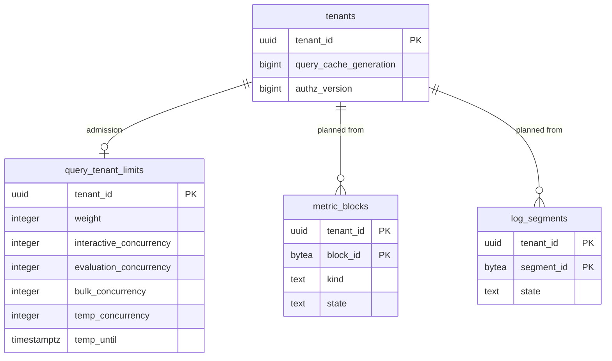

# Data model: クエリとキャッシュ

[data-model.md](../data-model.md) の一部。規約はそちらの 3 節に従う。振る舞いは [metrics-query-engine.md](../metrics-query-engine.md)（4〜7 節）、[tenancy-and-rbac.md](../tenancy-and-rbac.md)（6 節）、[dashboards.md](../dashboards.md)（5〜7 節）を正とする。決定は [ADR-0007](../../decisions/0007-query-language.md)、[ADR-0024](../../decisions/0024-query-ir-default-semantics.md)〜[ADR-0026](../../decisions/0026-query-cache-and-admission.md)、[ADR-0047](../../decisions/0047-dashboard-query-batching-and-caching.md)、[ADR-0051](../../decisions/0051-roles-permissions-and-data-access-restrictions.md)。

この領域の Aurora の表は `query_tenant_limits` の 1 つだけ。残りは、表にしない形（IR、キャッシュの鍵、水位）の正本である。

## 1. ER 図



## 2. 表

### 2.1 `query_tenant_limits`

クエリの受け付けと公平（[metrics-query-engine.md](../metrics-query-engine.md) の 7.2 節、[ADR-0026](../../decisions/0026-query-cache-and-admission.md)）。ログの検索（[ADR-0034](../../decisions/0034-log-search-execution-plan.md)）も同じ行を使う。

| 列 | 型 | NULL | 既定 | 説明 |
| --- | --- | --- | --- | --- |
| `tenant_id` | `uuid` | NOT NULL | — | |
| `weight` | `integer` | NOT NULL | — | DRR の 1 回の量の重み（契約の段階から） |
| `interactive_concurrency` | `integer` | NOT NULL | — | 対話の組の並行の上限 |
| `evaluation_concurrency` | `integer` | NOT NULL | — | 評価の組 |
| `bulk_concurrency` | `integer` | NOT NULL | — | 一括の組 |
| `log_search_concurrency` | `integer` | NOT NULL | — | ログ・トレースの検索 |
| `max_series` | `bigint` | NOT NULL | `1000000` | 系列の上限 |
| `max_raw_points` | `bigint` | NOT NULL | `1000000000` | 生の点の上限 |
| `temp_concurrency` | `integer` | NULL | — | 一時の引き下げ（運用。`ops.query_concurrency_per_tenant` は全体の上書き） |
| `temp_until` | `timestamptz` | NULL | — | |
| `temp_reason` | `text` | NULL | — | 理由のコード |
| `updated_by`・`updated_at` | — | — | — | |

- キー：PK `tenant_id`。CHECK：値はすべて `> 0`、`(temp_concurrency IS NULL) = (temp_until IS NULL)`。
- `query-frontend` が組織の文脈で読み、60 秒持つ。RLS：テナントの表。S1 の量：約 1,000 行。

## 3. クエリの IR（表にしない）

[metrics-query-engine.md](../metrics-query-engine.md) の 4.2 節、[tenancy-and-rbac.md](../tenancy-and-rbac.md) の 6.3 節。管理の面とデータの面の契約（Protobuf）で、`query-frontend` が受ける唯一の型。

```
RestrictedIr {
  ir_version: u32                       // 実行のたびに文から作る。保存しない（6.3 節）
  tenant_id: TenantId                   // 認証の文脈からだけ
  restriction: Predicate(Filter) | Unrestricted { reason }   // コンパイルの最後に必ず付く
  restriction_hash: [16]                // 述語の正規形の xxh3_128。Unrestricted は固定の値
  authz_version: u64                    // 述語を作った時点。評価の記録に残す
  body: QueryIR | FormulaIR | LogQueryIR
}
QueryIR  { metric, metric_type, preaggregated, filter, window{start_ms,end_ms}, interval_ms,
           align_origin_ms: 0, time_agg, space_agg{fn, group_by}, fill, unit_transform,
           functions, timeshift_ms }
LogQueryIR { indexes, filter, window, aggregations, group_by, limit, sort }
```

- `ir_hash` = 正規の直列化（欄の順、フィルターの項の並べ方、数の表記を決めたもの）の xxh3_128。キャッシュの鍵には窓を除いた `ir_hash_without_window` を使う。
- 述語は IR の葉（選ぶもの）のすべてに AND で足す。実行の側（読み手）でも、`tenant_id` と制限の節を確かめ直す。
- 保存した定義（モニター・SLO・ダッシュボード・ログから作るメトリクス）は、IR ではなく文と `ir_version` を持つ（[delivery.md](../delivery.md) の 6.3 節）。

## 4. キャッシュの鍵

どれも Valkey（セルごと、失ってよい）。鍵の先頭に組織、続けて制限のハッシュと世代を置く。一覧の正本は [stores.md](stores.md) の 3 節。

| 鍵 | 中身 | 期限 | 正本 |
| --- | --- | --- | --- |
| `qc:{tenant_id}:{restriction_hash}:{ir_hash_without_window}:{tier}:{interval}:{segment_start}:{gen}` | 閉じた区切りの形 A の空間の部分の集計（4 MiB まで） | 時間 24 時間、日・月 7 日 | [ADR-0026](../../decisions/0026-query-cache-and-admission.md) |
| `qgen:{tenant_id}` | `tenants.query_cache_generation` の写し | 7 日 | 同上 |
| `dash:{tenant_id}:{restriction_hash}:{gen}:{ir_hash}:{interval}:{chunk_start}` | ダッシュボードの閉じた部分（区間 60 個のかたまり） | 6 時間 | [ADR-0047](../../decisions/0047-dashboard-query-batching-and-caching.md) |
| `open:{tenant_id}:{restriction_hash}:{gen}:{ir_hash}:{interval}:{cut}` | 開いた部分（singleflight の結果） | 15 秒 | 同上 |
| `wm:{tenant_id}:{signal}` | 組織・信号ごとの水位 `F`（`metrics`・`logs`・`traces`・`derived-metrics`） | 60 秒 | [ADR-0008](../../decisions/0008-monitor-evaluation-model.md) |
| `authz:{tenant_id}:{principal}` | 権限の集合と述語、`authz_version` | 10 分 | [tenancy-and-rbac.md](../tenancy-and-rbac.md) の 5.3 節 |

- `gen` は `qgen:{tenant_id}` の値。上げると古い鍵は読まれずに期限で消える。Valkey に届かないときは Aurora の `tenants` から読む。
- 「不完全」の結果はどの層にも置かない。
- `restriction_hash` を鍵に入れるので、制限の違う人どうしは結果を共有しない（漏れの経路。[quality.md](../../quality.md) の 2.2.1 節 G）。

## 5. 水位

[ADR-0011](../../decisions/0011-intake-gateway-pipeline-and-watermark-ticks.md)、[ADR-0008](../../decisions/0008-monitor-evaluation-model.md)。

| 段 | 値 | 決め方 |
| --- | --- | --- |
| パーティション `F_p` | 消費者（インジェスター、インデクサー、組み立て、`derived-metrics-aggregator`）ごと | 生きているゲートウェイ（最大の `t_in` から 30 秒以内にレコードがある）の最後の `t_in` の最小。`draining` の `Tick` で外す |
| 組織・信号 `F` | `query-frontend` が 1 秒ごと | 組織のパーティションの組の `F_p` の最小。`derived-metrics` は書き手の処理の水位の最小 |
| 置き場所 | Valkey `wm:{tenant_id}:{signal}` | 失えば `query-frontend` が作り直す。評価器は 1 秒ごとに読む |

- 水位はストリームだけから決まる。壁の時計で進めない（例外：組み立ての水位が 60 秒止まったときの壁の時計の経路。[ADR-0037](../../decisions/0037-trace-assembly-and-completion.md)。その区間を記録する）。
