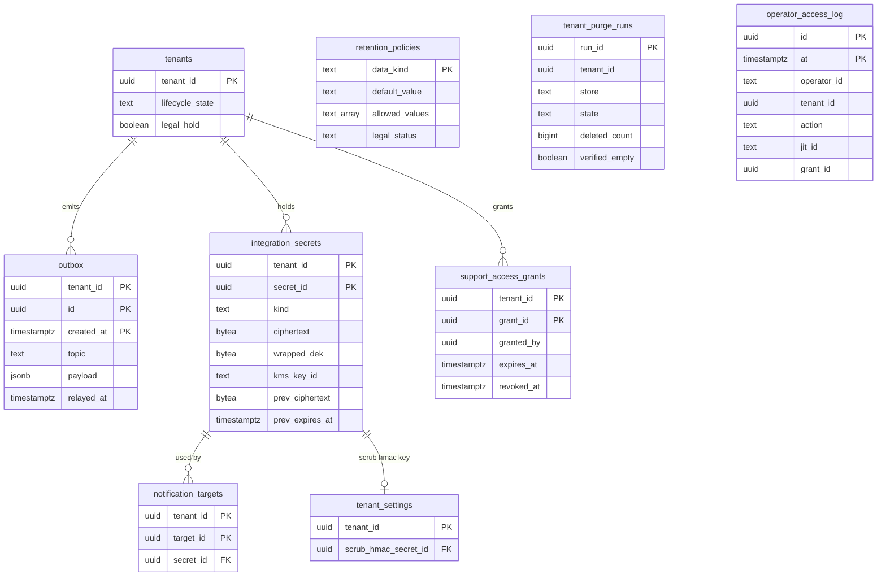

# Data model: セキュリティ・監査・ライフサイクル

[data-model.md](../data-model.md) の一部。規約はそちらの 3 節に従う。振る舞いは [security.md](../security.md)（4・5・7・8 節）と [tenancy-and-rbac.md](../tenancy-and-rbac.md)（8 節）を正とする。決定は [ADR-0052](../../decisions/0052-identity-sso-scim-keys-and-audit-trail.md)、[ADR-0056](../../decisions/0056-encryption-keys-and-secrets.md)〜[ADR-0058](../../decisions/0058-untrusted-senders-egress-and-operator-access.md)。保持の期間の多くは**法務の確認待ち（L5・L6・L7）**で、結論まで `retention_policies` の既定の値を使う。

| 表 | 置き場所 | 書く |
| --- | --- | --- |
| `outbox` | テナントの表、`created_at` の日の分割 | すべての書き込みのサービス（組織の文脈）。読み出しは `relay`（X3） |
| `integration_secrets` | テナントの表 | `api`（作成・回し）。復号は `notifier`・`log-processor`（HMAC の鍵）だけ |
| `support_access_grants` | テナントの表 | `api`（組織の管理者） |
| `maint.retention_policies` | `maint` | 運用（法務の結論で変える） |
| `maint.tenant_purge_runs` | `maint` | `tenant-purge`（X2） |
| `maint.operator_access_log` | `maint`、`at` の月の分割 | 運用のツール、JIT の仕組み |

## 1. ER 図

- `maint` の表（`retention_policies`・`tenant_purge_runs`・`operator_access_log`）は組織の表と線を描かない。`tenant_id`・`grant_id` は任意の論理の参照で、`tenant_purge_runs` は組織の行を消した後も残す必要があるので `maint` に置く（D-27）。
- `integration_secrets` から `notification_targets`・`tenant_settings` への線は任意の参照（メールの宛先と、マスクの `hash` を使わない組織は NULL）。

## 2. 表

### 2.1 `outbox`

変更と同じトランザクションで書く事象の待ち行列（`relay` が SNS・MSK に出す）。通知の依頼だけは専用の `notification_requests`（[monitors-and-notifications.md](monitors-and-notifications.md) の 2.8 節）に書く（D-34）。

| 列 | 型 | NULL | 既定 | 説明 |
| --- | --- | --- | --- | --- |
| `tenant_id` | `uuid` | NOT NULL | — | |
| `id` | `uuid` | NOT NULL | `uuidv7()` | 冪等の鍵（下流はこれで重ねを除く） |
| `created_at` | `timestamptz` | NOT NULL | `now()` | 分割の鍵 |
| `topic` | `text` | NOT NULL | — | 下の表 |
| `payload` | `jsonb` | NOT NULL | — | ID と数と理由のコード（設定の変更の監査は前後の値を持つ） |
| `relayed_at` | `timestamptz` | NULL | — | |

| `topic` | 出す先 | 中身 |
| --- | --- | --- |
| `audit.change` | MSK `audit` | 変更の監査（[tenancy-and-rbac.md](../tenancy-and-rbac.md) の 8.1 節） |
| `audit.auth` | MSK `audit` | ログイン、失敗、再認証、キーの使用の初回 |
| `audit.operator` | MSK `audit` | 運用者のアクセス（組織の監査ログに見せる分） |
| `pipeline-config-updated` | SNS → `log-processor` | `(tenant_id, version)` |
| `downtime-set-updated` | SNS → `monitor-evaluator` | `(tenant_id, version)` |
| `trace-rules-updated`、`spend-cap-changed` | SNS → `trace-assembler`・`log-processor` | |
| `tag-selection-updated`、`limits-changed` | SNS → `limits-coordinator` | 制御のレコードを MSK に書く元 |
| `cardinality.overflow` | SNS → `api`（知らせ） | `(tenant_id, metric, minute)` |
| `catalog.segment-changed` | SNS → `log-searcher` | NVMe のキャッシュを捨てる |
| `usage-finalized` | SNS → `billing-export` | `(tenant_id, period, unit, version)` |
| `key-scan-revoke-due` | SNS（24 時間の遅延） | シークレットスキャンの通報からの失効 |

- キー：PK `(tenant_id, id, created_at)`。
- 索引：`(created_at) WHERE relayed_at IS NULL` — `relay` の読み出し。ADR-0003 の「outbox の読み出しの位置」は、この列と索引で持つ（別の表を作らない。D-34）。
- RLS：テナントの表。書き込みは `WITH CHECK (tenant_id = app.tenant_id)`。読み出しと `relayed_at` の更新は X3 の `relay`（`BYPASSRLS`、この 2 表の `SELECT` と `UPDATE (relayed_at)` だけ）。
- 分割：`created_at` の日。保持：全部送って 1 日の後に分割を `DROP`。S1 の量：1 日 約 1,000 万行（監査の変更と認証を含む。初期見積もり）。

### 2.2 `integration_secrets`

アプリの秘密（[security.md](../security.md) の 4.3 節、[ADR-0056](../../decisions/0056-encryption-keys-and-secrets.md)）。`kms-secrets` の封筒の暗号化。新旧を 24 時間並べる。

| 列 | 型 | NULL | 既定 | 説明 |
| --- | --- | --- | --- | --- |
| `tenant_id`・`secret_id` | `uuid` | NOT NULL | `uuidv7()` | |
| `kind` | `text` | NOT NULL | — | `webhook_signing`・`chat_webhook_url`・`oncall_routing_key`・`webhook_headers`・`scrub_hmac` |
| `ciphertext` | `bytea` | NOT NULL | — | データの鍵で暗号化した値 |
| `wrapped_dek` | `bytea` | NOT NULL | — | `kms-secrets` で包んだデータの鍵 |
| `kms_key_id` | `text` | NOT NULL | — | 鍵の ID（東京と大阪で別） |
| `prev_ciphertext`・`prev_wrapped_dek` | `bytea` | NULL | — | 回す前の値（Webhook の署名を 2 つ並べる） |
| `prev_expires_at` | `timestamptz` | NULL | — | 作り直しから 24 時間 |
| `created_by`・`created_at`・`rotated_at` | — | — | — | |

- キー：PK `(tenant_id, secret_id)`。
- CHECK：`kind IN (…)`、`(prev_ciphertext IS NULL) = (prev_expires_at IS NULL)`。
- `scrub_hmac` は既定で回さない（回すと同じ値の HMAC が変わることを組織に示す）。
- RLS：テナントの表。人のロールは列を読めない（`api` は `kind` と作成の時刻だけのビューを読む）。保持：参照がなくなって 30 日。S1 の量：約 3 万行。

### 2.3 `support_access_grants`

サポートの許可（[security.md](../security.md) の 8 節、[ADR-0058](../../decisions/0058-untrusted-senders-egress-and-operator-access.md)）。組織の管理者が付け、72 時間まで。

| 列 | 型 | NULL | 既定 | 説明 |
| --- | --- | --- | --- | --- |
| `tenant_id`・`grant_id` | `uuid` | NOT NULL | `uuidv7()` | |
| `granted_by` | `uuid` | NOT NULL | — | 組織の管理者 |
| `scope` | `text` | NOT NULL | `'read_only'` | 読み取りの役割だけ |
| `ticket_ref` | `text` | NULL | — | サポートの問い合わせの番号 |
| `created_at` | `timestamptz` | NOT NULL | `now()` | |
| `expires_at` | `timestamptz` | NOT NULL | — | |
| `revoked_at` | `timestamptz` | NULL | — | |

- キー：PK `(tenant_id, grant_id)`。CHECK：`expires_at <= created_at + interval '72 hours'`、`scope = 'read_only'`。
- 運用者の読み出しは、この行（有効）＋ JIT（4 時間）のときだけ。使うたびに `operator_access_log` と組織の監査（`audit.operator`）の両方に書く。
- RLS：テナントの表。運用のツールは、対象の組織の文脈（`SET LOCAL app.tenant_id`）で有効な行を確かめる（組織をまたぐ経路にしない）。保持：1 年（**L6 の確認待ち**）。S1 の量：数千行。

### 2.4 `maint.retention_policies`

保持の既定の値の正本（[security.md](../security.md) の 5.1 節、[ADR-0057](../../decisions/0057-data-lifecycle-and-deletion-framework.md)）。`compactor`・画面・各表の保持のジョブが同じ表を読む。

| 列 | 型 | NULL | 既定 | 説明 |
| --- | --- | --- | --- | --- |
| `data_kind` | `text` | NOT NULL | — | 下の表 |
| `default_value` | `text` | NOT NULL | — | `15d`・`63d`・`15mo`・`1y`・`90d` など |
| `allowed_values` | `text[]` | NOT NULL | — | 組織が選べる値 |
| `legal_status` | `text` | NOT NULL | — | `confirmed`・`pending_L5`・`pending_L6`・`pending_L7` |
| `legal_ref` | `text` | NULL | — | 結論の記録 |
| `updated_by`・`updated_at` | — | — | — | |

| `data_kind`（初期の行） | 既定 | 選べる値 | 状態 |
| --- | --- | --- | --- |
| `metrics.raw`・`metrics.r1m`・`metrics.r1h` | 15d・63d・15mo | — | confirmed（ADR-0009） |
| `logs.index` | 15d | 3d・7d・15d・30d | confirmed |
| `logs.archive` | 1y | — | confirmed |
| `logs.rehydrated` | 15d | 3d・7d・15d・30d | confirmed |
| `traces` | 15d | — | confirmed |
| `evals.records` | 30d | — | confirmed |
| `audit.tenant_index` | 90d | 3d・7d・15d・30d・90d | pending_L6 |
| `audit.system` | 1y | — | pending_L6 |
| `tenant.grace_after_cancel` | 30d | — | pending_L5 |
| `monitor_transitions`・`notification_deliveries` | 90d・30d | — | confirmed（この文書） |

- キー：PK `data_kind`。RLS：なし（`maint`）。読むのは全ロール。CI が Terraform の S3 のライフサイクル（保持＋1 日）と比べる。

### 2.5 `maint.tenant_purge_runs`

解約の消去の進みと確かめ（[security.md](../security.md) の 5.3 節）。数だけを持つ。組織の行を消した後も残す。

| 列 | 型 | NULL | 既定 | 説明 |
| --- | --- | --- | --- | --- |
| `run_id` | `uuid` | NOT NULL | `uuidv7()` | |
| `tenant_id` | `uuid` | NOT NULL | — | 消す組織 |
| `store` | `text` | NOT NULL | — | `s3_tokyo`・`s3_osaka`・`aurora`・`valkey`・`msk` |
| `state` | `text` | NOT NULL | `'pending'` | `pending`・`deleting`・`waiting_versions`（7 日）・`verified`・`failed` |
| `deleted_count` | `bigint` | NOT NULL | `0` | 消したオブジェクト・行の数 |
| `verified_empty` | `boolean` | NULL | — | 接頭辞の一覧が空、行が 0 |
| `started_at`・`verified_at` | `timestamptz` | — | — | |

- キー：PK `(run_id)`。UK `(tenant_id, store)`。
- `legal_hold` の組織では作らない（`tenant-purge` が確かめる）。すべての `store` が `verified` になったら `tenants` の行を消し、確かめの記録を本システムの監査（log-archive）に写す。
- RLS：なし（`maint`）。保持：1 年（**L5・L7 の確認待ち**）。S1 の量：少ない。

### 2.6 `maint.operator_access_log`

運用者のアクセスの記録（[security.md](../security.md) の 7・8 節）。log-archive に日ごとのハッシュの連鎖で写す。

| 列 | 型 | NULL | 既定 | 説明 |
| --- | --- | --- | --- | --- |
| `id` | `uuid` | NOT NULL | `uuidv7()` | |
| `at` | `timestamptz` | NOT NULL | `now()` | 分割の鍵 |
| `operator_id` | `text` | NOT NULL | — | IAM Identity Center の利用者 |
| `tenant_id` | `uuid` | NULL | — | 触れた組織 |
| `action` | `text` | NOT NULL | — | `jit_grant`・`support_read`・`break_glass`・`kms_decrypt`・`flag_change` |
| `jit_id` | `text` | NULL | — | |
| `grant_id` | `uuid` | NULL | — | `support_access_grants` |
| `reason_code` | `text` | NOT NULL | — | |
| `approvers` | `text[]` | NOT NULL | `'{}'` | break-glass は 2 人 |

- キー：PK `(id, at)`。索引：`(tenant_id, at)` — 組織ごとの確かめ。
- トリガー：更新と削除を拒む（保持のジョブを除く）。
- 分割：`at` の月。保持：1 年（**L6 の確認待ち**）。RLS：なし（`maint`）。S1 の量：少ない。

## 3. 監査の事象（MSK `audit`）

[tenancy-and-rbac.md](../tenancy-and-rbac.md) の 8 節、[ADR-0052](../../decisions/0052-identity-sso-scim-keys-and-audit-trail.md)。表ではなく、`log-indexer` が組織の索引 `audit`（`log_indexes.kind = 'audit'`）のセグメントにする。

| 項目 | 説明 |
| --- | --- |
| 頭 | 共通の頭（[stores.md](stores.md) の 1.1 節） |
| `event_id` | UUIDv7（`outbox.id` か `query-frontend` が作る） |
| `kind` | `change`・`auth`・`data_read`・`operator` |
| `actor` | 主体の種類と ID（利用者・サービスのアカウント・キー・運用者・システム） |
| `target` | 対象の種類と ID |
| `action` | 理由のコードつきの操作の名前 |
| `data_read` | IR のハッシュ、信号、時間の範囲、結果の系列・行の数（値と条件の文字列は持たない） |
| `change` | 設定の前後の値（組織自身の設定。テレメトリーの値ではない） |

- `query-frontend` は結果を返す前に、タスクのローカルのディスクの待ち行列（最大 1 GB）に書いてから MSK へ送る。80% で新しい要求から外し、溢れたら新しいクエリを 503 で拒む。
- `audit-archiver` は組織・日ごとに、事象の並びのハッシュ `h_d = SHA-256(h_{d−1} ‖ SHA-256(その日の事象を event_id の順に並べたもの))` を作り、log-archive のアカウントの Object Lock のバケットへ写す（キーは [stores.md](stores.md) の 2.2 節）。毎日検算する。
