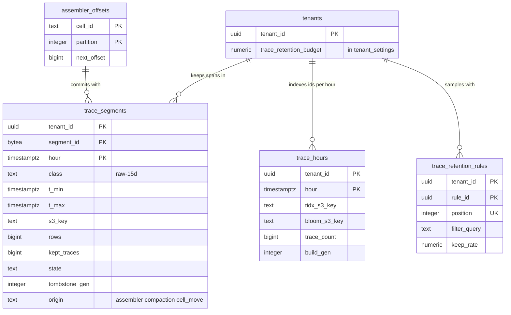

# Data model: トレース

[data-model.md](../data-model.md) の一部。規約はそちらの 3 節に従う。振る舞いは [traces-and-sampling.md](../traces-and-sampling.md)（4・6〜9 節）を正とする。決定は [ADR-0037](../../decisions/0037-trace-assembly-and-completion.md)〜[ADR-0040](../../decisions/0040-trace-storage-and-id-lookup.md)。スパンのセグメントの形式は [log-segment-format.md](log-segment-format.md) の 3 節（`LSEG` 1、`kind = 4`）。`spans` のメッセージの形は [stores.md](stores.md) の 1.5 節。

| 表 | 置き場所 | 書く |
| --- | --- | --- |
| `trace_segments` | テナントの表、`hour` の月の分割 | `trace-assembler`（X2）、`compactor`、`deletion-worker`、`cell-move` |
| `trace_hours` | テナントの表 | `compactor`（合わせの時）、`deletion-worker`（作り直し） |
| `maint.assembler_offsets` | `maint` | `trace-assembler` |
| `trace_retention_rules` | テナントの表 | `api`（権限 `apm.retention.write`） |

組み立ての途中の状態（トレースのバッファー、決定の記録 30 分、`latency` の p99、`rare` の組）は `trace-assembler` のメモリーにだけあり、表にしない。落ちたら確定の位置から読み直して同じ判断を作り直す。

## 1. ER 図



- `trace_hours` の `tidx` は、その時の合わせた後の `trace_segments` を `segment_id` で指す。合わせていない直近の時は `trace_hours` の行がないので、図に線を描かない（0 か 1 の親の形は、この図の書き方の 5 つの形にない）。

## 2. 表

### 2.1 `trace_segments`

残したトレースのスパンのセグメント（[traces-and-sampling.md](../traces-and-sampling.md) の 9.1 節）。列は `log_segments`（[log-segment-format.md](log-segment-format.md) の 2.1 節）と同じで、次だけが違う。

| 違う列 | 型 | NULL | 既定 | 説明 |
| --- | --- | --- | --- | --- |
| `index_id` | — | — | — | 持たない |
| `class` | `text` | NOT NULL | `'raw-15d'` | トレースの保持は 15 日の 1 つ |
| `segment_id` | `bytea` | NOT NULL | — | `xxh3_128(partition ‖ 最初のトレースの完成の刻み ‖ tenant_id)` |
| `kept_traces` | `bigint` | NOT NULL | — | 保持した件数（利用量の「スパンの保持」の元） |
| `kept_spans` | `bigint` | NOT NULL | — | |
| `origin` | `text` | NOT NULL | — | `assembler`・`compaction`・`cell_move`（利用量は `assembler` だけ数える） |
| `offset_ranges` | `jsonb` | NULL | — | `spans` のパーティションのオフセットの範囲 |

- キー：PK `(tenant_id, segment_id, hour)`。UK `(tenant_id, s3_key, hour)`。
- 索引：`(tenant_id, t_max) WHERE state = 'active'` — スパンの検索の計画。`(tenant_id, hour) WHERE tier = 'l0' AND state = 'active'` — 合わせ。
- 確定：S3 の PUT（`If-None-Match`）の後、行と `maint.assembler_offsets` を 1 つのトランザクションで書く（[ADR-0040](../../decisions/0040-trace-storage-and-id-lookup.md)）。同じ行なら飛ばす。
- 保持：15 日。合わせ・保持の削除は `log_segments` と同じ。
- RLS：テナントの表。S1 の量：同時に 約 100 万行（初期見積もり）。

### 2.2 `trace_hours`

時ごとの ID の索引（`tidx`）と時のブルームフィルターの置き場所（[traces-and-sampling.md](../traces-and-sampling.md) の 9.2 節）。合わせのときに（組織、時）ごとに作る。

| 列 | 型 | NULL | 既定 | 説明 |
| --- | --- | --- | --- | --- |
| `tenant_id` | `uuid` | NOT NULL | — | |
| `hour` | `timestamptz` | NOT NULL | — | |
| `tidx_s3_key` | `text` | NOT NULL | — | `<cell>/<tenant_id>/traces/raw-15d/<yyyy>/<mm>/<dd>/<hh>/tidx-<gen>.bin` |
| `bloom_s3_key` | `text` | NOT NULL | — | `…/<hh>/hbloom-<gen>.bin` |
| `trace_count` | `bigint` | NOT NULL | — | |
| `build_gen` | `integer` | NOT NULL | `1` | 遅れた断片の合わせ・削除の請求の書き直しで作り直すたびに上げる |
| `built_at` | `timestamptz` | NOT NULL | `now()` | |

- キー：PK `(tenant_id, hour)`。
- 合わせていない直近の時は行がなく、引きはセグメントのブルームフィルターを使う。
- RLS：テナントの表。保持：15 日。S1 の量：約 36 万行（1,000 × 360 時）。

### 2.3 `maint.assembler_offsets`

組み立ての確定の位置（[ADR-0040](../../decisions/0040-trace-storage-and-id-lookup.md)）。

| 列 | 型 | NULL | 既定 | 説明 |
| --- | --- | --- | --- | --- |
| `cell_id` | `text` | NOT NULL | — | |
| `partition` | `integer` | NOT NULL | — | `spans` のパーティション |
| `next_offset` | `bigint` | NOT NULL | — | 開いているバッファーと書き出していないセグメントのバッファーの、最も古いオフセットの手前 |
| `updated_at` | `timestamptz` | NOT NULL | `now()` | |

- キー：PK `(cell_id, partition)`。進め方は前の位置を条件にした `UPDATE`。
- RLS：なし（`maint`）。S1 の量：512 行。

### 2.4 `trace_retention_rules`

組織のテールサンプリングの規則 `tenant_rule`（[traces-and-sampling.md](../traces-and-sampling.md) の 8.1 節、[ADR-0038](../../decisions/0038-tail-sampling-rules-and-consistency.md)）。組み込みの規則（`error`・`latency`・`rare`・`probabilistic`）はコードにある。

| 列 | 型 | NULL | 既定 | 説明 |
| --- | --- | --- | --- | --- |
| `tenant_id`・`rule_id` | `uuid` | NOT NULL | `uuidv7()` | |
| `position` | `integer` | NOT NULL | — | 上から順に当てる |
| `name` | `text` | NOT NULL | — | `sampling.rule` に書く名前 |
| `filter_query` | `text` | NOT NULL | — | スパンの検索の条件（どれかのスパンが合えば） |
| `keep_rate` | `numeric(7,6)` | NOT NULL | — | 率 `p`。しきい値 `T_rule = (1 − p) × 2^56`、`R ≥ T_rule` で残す |
| `enabled` | `boolean` | NOT NULL | `true` | |
| `updated_by`・`updated_at` | — | — | — | |

- キー：PK `(tenant_id, rule_id)`。UK `(tenant_id, position)`（遅延の制約）。
- CHECK：`keep_rate BETWEEN 0 AND 1`。トリガー：組織あたり 50。
- 変更は outbox（`trace-rules-updated`）で `trace-assembler` に配り、次の刻みから効く。
- RLS：テナントの表。S1 の量：数千行。

## 3. スパンのセグメントの列

`LSEG` 1 の決まった列（スパン）。行は `start` の順。

| 列 | 型・符号化 | 元 |
| --- | --- | --- |
| `start` | i64 ナノ秒、差分とビットの詰め込み | `start_time_unix_nano` |
| `duration` | i64 ナノ秒 | 終わり − 始まり（負なら 0 と `clock_skew:true`） |
| `trace_id` | 固定 16 バイト | 128 ビット |
| `span_id`・`parent_span_id` | 固定 8 バイト | |
| `name`・`service`・`env`・`version`・`resource` | セグメントの辞書かページの辞書 | 4.1・4.2 節 |
| `kind` | セグメントの辞書 | `SERVER`・`CLIENT`・`PRODUCER`・`CONSUMER`・`INTERNAL` |
| `error`・`is_entry`・`late`・`truncated` | 真偽 | |
| `sampling_rule` | セグメントの辞書 | `error`・`tenant_rule:<name>`・`latency`・`rare`・`probabilistic` |
| `sampling_weight` | f64 | `w`、`probabilistic` は `w / p` |
| `ingest_time` | i64 ナノ秒 | |
| 属性の列 | 道と型ごと | `attributes`、`resource_attributes`（`resource.` を前に付ける）、`events`・`links` は JSON の文字列の列 |

- `trace_id`・`span_id` は ID の属性として `道=値` の語をブルームフィルターに入れる。
- 属性の値は `pii-scrub` の crate と組織の規則でマスクした後の値（[ADR-0031](../../decisions/0031-pii-scrubbing-before-routing.md)）。

## 4. `tidx` と時のブルームフィルター

形式の細部はこの文書で決めた（D-30）。

### 4.1 `tidx`（バージョン 1）

```
header  := magic "TIDX" ‖ version u16 = 1 ‖ reserved u16 ‖ tenant_id [16] ‖ hour_ms i64 ‖ build_gen u32
segments:= count u32 ‖ segment_id [16] × count            // この時のセグメント（番号は並びの位置）
entries := count u64 ‖ (trace_id [16] ‖ segment_no u32 ‖ row_block u16) × count   // trace_id の順
fences  := (trace_id [16] ‖ entry_index u64) every 4,096 entries
trailer := fences_offset u64 ‖ fence_count u32 ‖ reserved u32 ‖ xxh3_128 [16] ‖ magic "TIDX"
```

- 引き：末尾を読み、フェンスで範囲を決め、範囲の GET で 4,096 件のかたまりを読む（[traces-and-sampling.md](../traces-and-sampling.md) の 9.3 節）。
- 同じ `trace_id` の遅れた断片は、別の行として並ぶ（同じ `trace_id` が続く）。

### 4.2 時のブルームフィルター（バージョン 1）

```
magic "THBF" ‖ version u16 = 1 ‖ reserved u16 ‖ tenant_id [16] ‖ hour_ms i64
‖ num_blocks u32 ‖ bits (256-bit blocks, SBBF) ‖ crc32c u32
```

- 入れるのは、その時に残したトレースの `trace_id`（16 バイト）。語あたり 10 ビット。読み手の NVMe とメモリーにキャッシュする。
