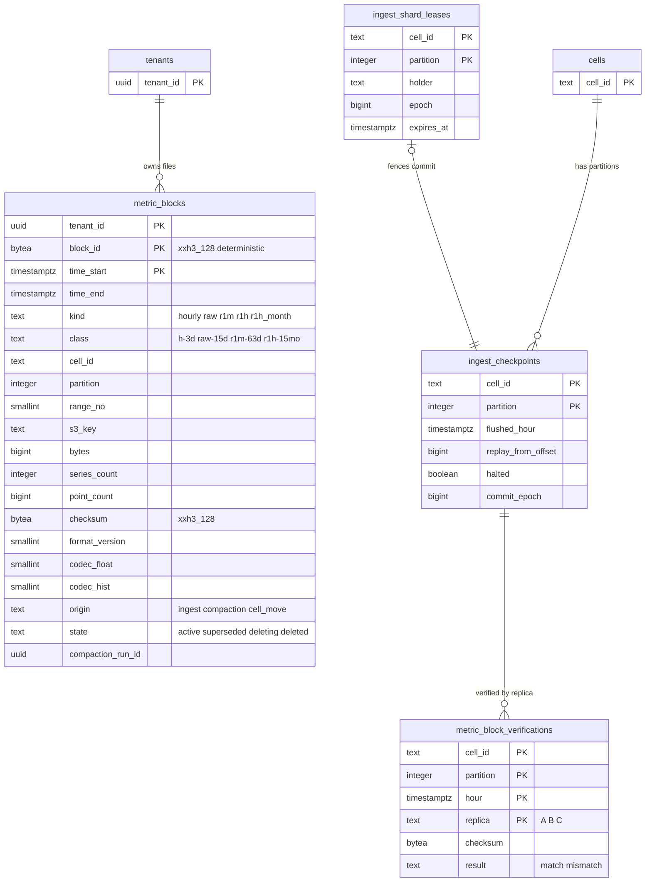
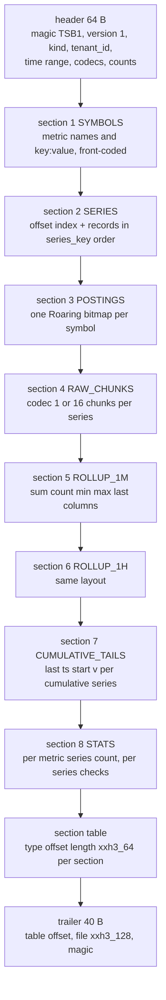

# Data model: TSDB の形式（系列の索引、ヘッド、ブロック、チャンク、ロールアップ、チェックポイント、照合）

[data-model.md](../data-model.md) の一部。規約はそちらの 3 節に従う。振る舞いは [tsdb-storage-engine.md](../tsdb-storage-engine.md) と [distributions-and-sketches.md](../distributions-and-sketches.md) の 7・8 節を正とする。決定は [ADR-0004](../../decisions/0004-tsdb-storage-engine.md)、[ADR-0019](../../decisions/0019-partition-mapping-and-head-layout.md)〜[ADR-0022](../../decisions/0022-compaction-and-rollup-tiers.md)、[ADR-0028](../../decisions/0028-exponential-histogram-storage-and-percentiles.md)、[ADR-0066](../../decisions/0066-format-versioning-and-compatibility-windows.md)。

この文書は 2 つの部分からなる。

- **Aurora の表**（2 節）：ブロックのカタログ `metric_blocks` と、組織を持たない `maint` の 3 表。
- **Aurora の外の形式**（1・3〜6 節）：系列の鍵、ヘッドの形、ブロックの形式のバージョン 1（`TSB1`）、チャンクの符号化（`codec_id` 1・16）、ロールアップ、チェックポイント（`TSC1`）、照合。形式の正本はこの文書で、バイトの並びを変えるときは形式のバージョンか `codec_id` を足す（[ADR-0066](../../decisions/0066-format-versioning-and-compatibility-windows.md)）。

## 1. 系列の鍵とパーティション

### 1.1 系列の鍵

[metrics-model-and-cardinality.md](../metrics-model-and-cardinality.md) の 5 節。ゲートウェイが計算して MSK のレコードに載せ、インジェスターが新しい系列のときに計算し直して比べる。

```
input = tenant_id (16 bytes, UUID の RFC 4122 のバイト順)
      ‖ u16 BE len ‖ metric name (UTF-8, lowercase)
      ‖ u16 BE count of tags
      ‖ for each tag in byte order of "key:value": u16 BE len ‖ "key:value"   (key-only tag: "key")
series_key = xxh3_128(input)      // 16 bytes, big-endian の 128 ビットの値として持つ
```

- 長さはビッグエンディアン（鍵の入力だけ。ファイルの数値はリトルエンディアン。3.1 節）。試験のベクトルは開発リポジトリに置く。
- 溢れの系列は、タグ `<brand>.cardinality_overflow:true` だけで同じ作り方をする。タグの選択の合わせた系列は、残すタグだけで作る。
- 衝突（同じ鍵で違うタグの組）は、新しい系列のときにタグを比べて検出し、点を拒んで運用のアラートにする。

### 1.2 パーティションとシャード

| 値 | 決め方 | 正本 |
| --- | --- | --- |
| 組織の組 | `score(t, p) = xxh3_64(tenant_id ‖ u16 LE p)` の上位 `k` 個を点数の順に | [ADR-0019](../../decisions/0019-partition-mapping-and-head-layout.md) |
| `k` | 点の時刻の時間に効く `partition_set_changes` の行 | [keys-and-intake.md](keys-and-intake.md) の 2.6 節 |
| 系列のパーティション | `組[jump(series_key の下位 64 ビット, k)]` | 同上 |
| シャード | 1 パーティション = 1 シャード = 1 スレッド。写し A・B が別の AZ で同じパーティションを読む | [tsdb-storage-engine.md](../tsdb-storage-engine.md) の 3.3 節 |
| 閉じるずらし `s_p` | `xxh3_64(cell_id ‖ u16 LE partition) mod 300` 秒 | [ADR-0020](../../decisions/0020-block-flush-commit-and-replay.md) の注記 |

- ある系列のある時間の点は、すべて 1 つのパーティションに入る。だから時間のブロック（組織、時間、パーティション）は、その時間の系列の点をすべて持つ。

## 2. 表

| 表 | 置き場所 | 書く |
| --- | --- | --- |
| `metric_blocks` | テナントの表、`time_start` の月の分割 | `metrics-ingester`（確定。X2）、`compactor`（合わせ・保持。X2）、`cell-move`（X4） |
| `maint.ingest_checkpoints` | `maint` | `metrics-ingester`（貸し出しの持ち主） |
| `maint.ingest_shard_leases` | `maint` | `metrics-ingester` |
| `maint.metric_block_verifications` | `maint` | `metrics-ingester`（もう一方の写し、3 つ目の作り直し） |



- `metric_blocks` と `maint` の表の間に線を描かない（RLS の表と `maint` の間に外部キーを張らない）。時間のブロックの行は `(cell_id, partition)` の `ingest_checkpoints` と同じ確定のトランザクションで書く。

### 2.1 `metric_blocks`

ブロックのカタログ（[tsdb-storage-engine.md](../tsdb-storage-engine.md) の 6.3・9 節）。1 行が S3 の 1 つの不変のファイル。

| 列 | 型 | NULL | 既定 | 説明 |
| --- | --- | --- | --- | --- |
| `tenant_id` | `uuid` | NOT NULL | — | |
| `block_id` | `bytea` | NOT NULL | — | 16 バイト。時間のブロックは `xxh3_128(cell_id ‖ tenant_id ‖ time_start ‖ partition)`、日・月のファイルは中身の `checksum` と同じ（D-3） |
| `time_start`・`time_end` | `timestamptz` | NOT NULL | — | `[time_start, time_end)`。分割の鍵は `time_start` |
| `kind` | `text` | NOT NULL | — | `hourly`・`raw`・`r1m`・`r1h`・`r1h_month`（ファイルの頭の `kind` と `flags` から決まる） |
| `class` | `text` | NOT NULL | — | 保持の区分。S3 のタグ `class` と同じ値（D-5） |
| `cell_id` | `text` | NOT NULL | — | |
| `partition` | `integer` | NULL | — | 時間のブロックだけ |
| `range_no` | `smallint` | NULL | — | 日・月のファイルの系列の鍵の範囲の番号（2 GiB を超えたとき） |
| `series_key_first`・`series_key_last` | `bytea` | NOT NULL | — | ファイルの系列の鍵の最小と最大（範囲で分けたときの計画） |
| `s3_key` | `text` | NOT NULL | — | [stores.md](stores.md) の 2.2 節 |
| `bytes` | `bigint` | NOT NULL | — | |
| `series_count` | `integer` | NOT NULL | — | 見積もりの代わりの上限（[metrics-catalog-and-cardinality.md](metrics-catalog-and-cardinality.md) の 3 節） |
| `series_standard`・`series_custom`・`series_distribution` | `integer` | NULL | — | 時間のブロック（`origin = ingest`）だけ。利用量のカスタムメトリクスの数え方（[usage-and-billing.md](../usage-and-billing.md) の 4.2 節） |
| `point_count` | `bigint` | NOT NULL | — | |
| `checksum` | `bytea` | NOT NULL | — | ファイルの全体の xxh3_128（3.4 節の末尾）。写しの比べに使う |
| `format_version` | `smallint` | NOT NULL | `1` | `TSB1` のバージョン |
| `codec_float`・`codec_hist` | `smallint` | NOT NULL | `1`・`16` | 分布のないファイルは `codec_hist = 0` |
| `origin` | `text` | NOT NULL | — | `ingest`・`compaction`・`cell_move` |
| `state` | `text` | NOT NULL | `'active'` | `active`・`superseded`・`deleting`・`deleted`（D-6） |
| `compaction_run_id` | `uuid` | NULL | — | 合わせで新しい行と古い行に同じ ID を入れる（区切りの対応） |
| `lease_epoch` | `bigint` | NULL | — | 確定した貸し出しの `epoch`（時間のブロック） |
| `created_at` | `timestamptz` | NOT NULL | `now()` | |
| `superseded_at`・`deleting_at`・`deleted_at` | `timestamptz` | NULL | — | |

- キー：PK `(tenant_id, block_id, time_start)`（分割の鍵を含める。D-4）。UK `(tenant_id, s3_key, time_start)`。
- 索引：
  - `(tenant_id, kind, time_start) WHERE state = 'active'` — クエリの計画（区切りと層の選び方。[ADR-0025](../../decisions/0025-query-plan-fanout-and-partials.md)）。
  - `(tenant_id, time_start) WHERE kind = 'hourly' AND state = 'active'` — `compactor` の「日 `D` の時間のブロックがすべて揃ったか」。
  - `(tenant_id, state, time_start) WHERE state IN ('superseded','deleting')` — 10 分の後の削除、保持の削除の続き。
- CHECK：
  - `kind IN (…)`、`state IN (…)`、`origin IN (…)`、`octet_length(block_id) = 16`、`octet_length(checksum) = 16`
  - `time_end > time_start`、`kind = 'hourly'` なら `partition IS NOT NULL AND time_end = time_start + interval '1 hour'`
  - `kind = 'hourly'` なら `class = 'h-3d'`。`raw` → `raw-15d`、`r1m` → `r1m-63d`、`r1h`・`r1h_month` → `r1h-15mo`
  - `codec_float BETWEEN 1 AND 15`、`codec_hist = 0 OR codec_hist BETWEEN 16 AND 31`
- トリガー：`state` は `active → superseded → deleting → deleted`、`active → deleting → deleted` だけを許す。`checksum`・`s3_key`・`bytes` の更新を拒む（ファイルは不変）。
- 確定（[ADR-0020](../../decisions/0020-block-flush-commit-and-replay.md)）：貸し出しの持ち主が、`ingest_shard_leases` の `epoch` を `FOR UPDATE` で確かめ、組織ごとに `SET LOCAL app.tenant_id` を切り替えて行を書き、`ingest_checkpoints` を `flushed_hour = H − 1` の条件で進める。同じトランザクション。読み直しで同じ行が来たら PK の衝突で飛ばす（`ON CONFLICT DO NOTHING` の後に `checksum` を比べる）。
- 合わせ（[ADR-0022](../../decisions/0022-compaction-and-rollup-tiers.md)）：前後の統計（系列ごとの点の数・生の値の合計・正規の点の列の xxh3_64）が一致したら、1 つのトランザクションで新しい行を `active`、古い行を `superseded` にする。10 分の後に古いファイルを東京と大阪で消し、`deleted` にする。
- 保持：`compactor` が `retention_policies` の期限で `deleting` にしてからファイルを消す（[ADR-0009](../../decisions/0009-retention-tiers-on-s3.md)）。`deleted` の行は S3 Inventory との突き合わせのため 14 日残し、その後に消す。分割は、中の行がすべて消えたら `DROP`。
- RLS：テナントの表。読むのは `query-frontend`（組織の文脈）と X2・X4 の作業。
- S1 の量：時間のブロック 1 時間 約 1.6 万行（組織 × 組）。生きている行は 約 300 万行（初期見積もり。時間のブロックは合わせで 2 日以内に `deleted`）。

### 2.2 `maint.ingest_checkpoints`

パーティションの確定の位置（[tsdb-storage-engine.md](../tsdb-storage-engine.md) の 6.3〜6.5 節）。組織を持たない。

| 列 | 型 | NULL | 既定 | 説明 |
| --- | --- | --- | --- | --- |
| `cell_id` | `text` | NOT NULL | — | |
| `partition` | `integer` | NOT NULL | — | `metrics` のパーティション |
| `flushed_hour` | `timestamptz` | NOT NULL | — | 確定した最後の時間 `H` |
| `replay_from_offset` | `bigint` | NOT NULL | — | 作り直しの開始の位置（`t_in ≥ H + 1h − 20 分` の最初のオフセット） |
| `commit_epoch` | `bigint` | NOT NULL | — | 確定した貸し出しの `epoch` |
| `halted` | `boolean` | NOT NULL | `false` | 写しの食い違いで書き出しを止めた |
| `halted_reason` | `text` | NULL | — | `replica_mismatch`・`manual` |
| `halted_at`・`updated_at` | `timestamptz` | — | — | 止めるのは 6 時間まで |

- キー：PK `(cell_id, partition)`。
- 確定の条件：`UPDATE … SET flushed_hour = $H, replay_from_offset = $o WHERE cell_id = $c AND partition = $p AND flushed_hour = $H − interval '1 hour' AND NOT halted`。0 行ならトランザクションを捨てる。
- CHECK：`date_trunc('hour', flushed_hour) = flushed_hour`、`replay_from_offset >= 0`。
- RLS：なし（`maint`）。書くのは `ingester`（X2）。S1 の量：1,024 行（セルごと）。

### 2.3 `maint.ingest_shard_leases`

書き出しの貸し出し（フェンシング）。期限 30 秒、10 秒ごとに延ばす。

| 列 | 型 | NULL | 既定 | 説明 |
| --- | --- | --- | --- | --- |
| `cell_id`・`partition` | — | NOT NULL | — | |
| `holder` | `text` | NOT NULL | — | タスクの ID と写し（`A`・`B`） |
| `epoch` | `bigint` | NOT NULL | `1` | 持ち主が変わるたびに 1 上げる |
| `expires_at` | `timestamptz` | NOT NULL | — | 明け渡しは `now()` にする（[ADR-0065](../../decisions/0065-stateful-rollout-with-replica-handoff.md)） |

- キー：PK `(cell_id, partition)`。
- 取り方：`UPDATE … SET holder = $me, epoch = epoch + 1, expires_at = now() + interval '30 seconds' WHERE … AND expires_at < now()`。時刻は DB の `now()`。
- トリガー：`epoch` を下げる更新を拒む。RLS：なし。S1 の量：1,024 行。

### 2.4 `maint.metric_block_verifications`

写しの比べの結果（[tsdb-storage-engine.md](../tsdb-storage-engine.md) の 6.3・6.5 節）。SLI「ブロックの写しの一致」の正。

| 列 | 型 | NULL | 既定 | 説明 |
| --- | --- | --- | --- | --- |
| `cell_id`・`partition` | — | NOT NULL | — | |
| `hour` | `timestamptz` | NOT NULL | — | |
| `replica` | `text` | NOT NULL | — | `A`・`B`・`C`（3 つ目の作り直し） |
| `checksum` | `bytea` | NOT NULL | — | パーティション・時間の全組織のブロックの `checksum` を `tenant_id` の順に並べた列の xxh3_128 |
| `result` | `text` | NOT NULL | — | `match`・`mismatch` |
| `quarantine_key` | `text` | NULL | — | 食い違ったファイルの `quarantine/` のキー |
| `verified_at` | `timestamptz` | NOT NULL | `now()` | |

- キー：PK `(cell_id, partition, hour, replica)`。
- 索引：`(result, verified_at) WHERE result = 'mismatch'` — 呼び出しと SLI。
- `mismatch` を書くトランザクションで `ingest_checkpoints.halted = true` にする。
- RLS：なし。保持：30 日（日次のジョブ）。S1 の量：1 日 約 2.5 万行。

## 3. ブロックの形式のバージョン 1（`TSB1`）

[ADR-0021](../../decisions/0021-block-format-v1.md)、[tsdb-storage-engine.md](../tsdb-storage-engine.md) の 7 節。時間のブロック・日のファイル・月のファイルは同じ形式で、区画の有無だけが違う。

### 3.1 共通の規則

- 数値はリトルエンディアン（系列の鍵の入力の長さだけはビッグエンディアン。1.1 節）。`varint` は符号なしの LEB128、`zigzag` は符号つきを符号なしに写したもの。
- `tenant_id`・`series_key` はバイト列のまま（UUID の RFC 4122 の順、128 ビットのビッグエンディアン）。
- 区画は 8 バイトの境界から始め、間を 0 で埋める。並べ方と符号化はすべて決定的にする（系列の鍵の順、記号のバイトの順、Roaring は正規の直列化）。**同じ入力から同じバイト**になることが、写しの比べ（[ADR-0004](../../decisions/0004-tsdb-storage-engine.md)）の前提である。
- 読み手は、頭の `tenant_id` が計画の `tenant_id` と同じことを確かめてから区画を読む。違えば読まずに止め、SEV1 の候補にする（D-31）。

### 3.2 構造



| `kind`（頭） | ファイル | 区画 |
| --- | --- | --- |
| 1 `hourly` | 時間のブロック | 1・2・3・4・5・6・7・8 |
| 2 `raw` | 日の生の点 | 1・2・3・4・8 |
| 3 `r1m` | 日の 1 分のロールアップ | 1・2・3・5・8 |
| 4 `r1h` | 日・月の 1 時間のロールアップ（月は `flags` の bit0） | 1・2・3・6・8 |

### 3.3 頭（64 バイト）

| 位置 | 大きさ | 項目 | 値 |
| --- | --- | --- | --- |
| 0 | 4 | `magic` | `TSB1`（`54 53 42 31`） |
| 4 | 2 | `format_version` | `1` |
| 6 | 1 | `kind` | 3.2 節の表 |
| 7 | 1 | `flags` | bit0 月のファイル、bit1 分布の系列を含む。他は 0 |
| 8 | 16 | `tenant_id` | |
| 24 | 8 | `time_start_ms` | i64。区間の始め（含む） |
| 32 | 8 | `time_end_ms` | i64。区間の終わり（含まない） |
| 40 | 1 | `codec_float` | `1`（1〜15） |
| 41 | 1 | `codec_hist` | `16`、分布がなければ `0`（16〜31） |
| 42 | 2 | `partition_or_range` | 時間のブロックはパーティション、他は範囲の番号 |
| 44 | 4 | `series_count` | u32 |
| 48 | 8 | `point_count` | u64。生の点（分布は点の数） |
| 56 | 2 | `section_count` | u16 |
| 58 | 2 | 予約 | 0 |
| 60 | 4 | `header_check` | `xxh3_64(bytes[0..60])` の下位 32 ビット |

### 3.4 区画の表と末尾

区画の表はファイルの末尾の 40 バイトの直前に置く。クエリは末尾を範囲の GET で読み、要る区画だけを読む。

| 区画の表の 1 項目（32 バイト） | 大きさ |
| --- | --- |
| `type` u16（1〜8）、`flags` u16（0）、予約 u32 | 8 |
| `offset` u64（ファイルの先頭から） | 8 |
| `length` u64 | 8 |
| `xxh3_64` u64（区画のバイトの） | 8 |

| 末尾（40 バイト） | 位置（末尾の先頭から） | 大きさ |
| --- | --- | --- |
| `table_offset` u64 | 0 | 8 |
| `table_length` u32 | 8 | 4 |
| `section_count` u16、予約 u16 | 12 | 4 |
| `file_xxh3_128`：ファイルの先頭から、この項目の直前までの xxh3_128 | 16 | 16 |
| 予約 u32 | 32 | 4 |
| `magic` `TSB1` | 36 | 4 |

- `file_xxh3_128` が `metric_blocks.checksum` と写しの比べの値になる。
- 区画の表は `type` の昇順。同じ `type` を 2 回持たない。

### 3.5 記号（区画 1）

- `count` u32、続けて記号をバイトの順に：`varint shared_prefix_len ‖ varint suffix_len ‖ suffix`（前の記号との共通の接頭辞を省く）。
- 記号の番号は並びの位置（0 から）。指標の名前と `key:value`（鍵だけのタグは `key`）を同じ辞書に入れる。

### 3.6 系列の表（区画 2）

- `count` u32、`record_offset` u32 × `count`（区画の先頭から。系列の番号で引く）、続けて記録。
- 記録は系列の鍵の順。

| 項目 | 形 | 説明 |
| --- | --- | --- |
| `series_key` | 16 バイト | |
| `metric_sym` | varint | |
| `tag_count`、`tag_syms` | varint、varint × n | 記号の番号の昇順 |
| `type` | u8 | 0 gauge、1 count（rate は count に直して持つ）、2 分布 |
| `flags` | u8 | bit0 累積、bit1 10 秒の区間の集計（溢れ・タグの選択）、bit2 溢れの系列、bit3 **予約：削除の請求の墓標**（L5 の結論まで 0。[ADR-0021](../../decisions/0021-block-format-v1.md)） |
| データの位置 | 区画 4〜7 のうちファイルにあるものの順に `varint offset ‖ varint length` | 区画の先頭からの位置。長さ 0 はデータなし |

### 3.7 転置の表（区画 3）

- 記号ごとに 1 つ。`count` u32（= 記号の数）、`bitmap_offset` u32 × `count`、続けて Roaring のビットマップ（ポータブルの直列化。`run_optimize` の後）。値は系列の番号。

### 3.8 統計（区画 8）

| 部分 | 形 | 使い道 |
| --- | --- | --- |
| 指標ごと | `count` u32、`(metric_sym varint, series_count varint)` を記号の順 | 費用の見積もり（[metrics-catalog-and-cardinality.md](metrics-catalog-and-cardinality.md) の 3 節）、利用量 |
| 系列ごと | 系列の順に `point_count varint ‖ raw_sum f64 ‖ canonical_xxh3_64 u64` | 合わせの前後の照合（[ADR-0022](../../decisions/0022-compaction-and-rollup-tiers.md)） |

- `canonical_xxh3_64`：正規の点の列（時刻の順・後勝ち）を `ts_ms i64 ‖ value のビット u64`（分布は `ts_ms ‖ codec 16 の点の本体`）で並べたバイトの xxh3_64。ヘッドの要約（5.3 節）も同じ値を使う。
- `raw_sum`：生の点の値を時刻の順に足したもの（分布は区間の合計の和）。合わせの前後で完全に一致すること（同じ順で足すため）。

### 3.9 累積の末尾（区画 7）

- 累積の系列（`flags` の bit0）ごとに、系列の順に `series_index u32 ‖ ts_ms i64 ‖ start_ms i64 ‖ 値`。値は f64、分布は `varint len ‖ codec 16 の点の本体`。
- 次の時間の最初の点の差を求める前の点になる（[ADR-0016](../../decisions/0016-metric-types-and-cumulative-conversion.md)）。

## 4. チャンクとロールアップの符号化

### 4.1 生のチャンク（区画 4）

- 系列ごとに、チャンクを時刻の順に並べる。チャンクは 120 点ごとの**正規のチャンク**（ヘッドのチャンクの区切りは使わない）。
- チャンクの頭（4 バイト）：`point_count` u8（1〜120）、`codec_id` u8、`body_len` u16。
- `codec_id` 1 では `body_len` は本体の**ビット**の長さ、`codec_id` 16 では本体の**バイト**の長さ。本体は 0 のビットでバイトの境界まで埋める。
- 10 秒の区間の集計の系列（`flags` の bit1）は、生のチャンクの代わりに、10 秒の区間でロールアップと同じ列（4.4 節）を持つ。

### 4.2 `codec_id` 1（浮動小数点）

[tsdb-storage-engine.md](../tsdb-storage-engine.md) の 5 節。ビットは各バイトの上位から詰める。

| 点 | 時刻 | 値 |
| --- | --- | --- |
| 1 つ目 | 64 ビット（`ts` ミリ秒） | 64 ビット（浮動小数点のビット） |
| 2 つ目 | 32 ビット（1 つ目との差） | XOR の符号化 |
| 3 つ目から | 差分の差分 `D` | XOR の符号化 |

| `D` の前置き | 範囲（ミリ秒） | ビット |
| --- | --- | --- |
| `0` | 0 | 1 |
| `10` ＋ 7 ビット | −63〜64 | 9 |
| `110` ＋ 12 ビット | −2,047〜2,048 | 15 |
| `1110` ＋ 20 ビット | −524,287〜524,288 | 24 |
| `1111` ＋ 64 ビット | それ以外 | 68 |

- 値の XOR `x`：`x = 0` は `0`。前の窓に収まれば `10` ＋ 窓の長さの意味のあるビット。それ以外は `11` ＋ 先頭の 0 の数（6 ビット）＋ 意味のあるビットの長さ − 1（6 ビット）＋ 意味のあるビット。
- 点は時刻と値を交互に書く（点 1 の時刻、点 1 の値、点 2 の時刻、…）。
- NaN の各ビットの形、−0.0、無限大、非正規化数をビットで同じに戻す。

### 4.3 `codec_id` 16（指数のヒストグラム）

[distributions-and-sketches.md](../distributions-and-sketches.md) の 7 節、[ADR-0028](../../decisions/0028-exponential-histogram-storage-and-percentiles.md)。

```
chunk body := varint time_bit_len ‖ time bits (codec 1 の時刻の符号化、バイトの境界まで 0 で埋める)
              ‖ point body × point_count
point body := flags u8            // bit0 has_negative, bit1 has_zero_threshold, bit2 min_max_estimated, bit3 lossy_source
              ‖ scale i8          // 5 以下、-10 以上
              ‖ count varint ‖ sum f64 ‖ min f64 ‖ max f64
              ‖ zero_count varint ‖ [zero_threshold f64]
              ‖ positive: offset zigzag-varint ‖ len varint ‖ counts varint × len
              ‖ [negative: same]
```

- 汎用の圧縮を中に使わない（ライブラリのバージョンで出力が変わらないため）。
- **チャンクの区切り**：120 点か、次の点を足すと本体が 65,535 バイトを超えるときに閉じる（D-29。区間 512 の点は 1 点 1 KiB を超えうるので、`body_len` の u16 に収める）。区切りは中身だけで決まるので、写しで同じになる。

### 4.4 ロールアップの列（区画 5・6、10 秒の区間の集計）

[ADR-0004](../../decisions/0004-tsdb-storage-engine.md)、[tsdb-storage-engine.md](../tsdb-storage-engine.md) の 9.1 節。どちらも**生の点から**作る（1 時間を 1 分から作らない）。

| 系列 | 列 |
| --- | --- |
| 浮動小数点 | `n varint`（区間の数）、時刻の列（`codec_id` 1 の時刻の符号化。連続する区間は 1 ビット）、続けて `sum`・`count`・`min`・`max`・`last` の 5 列。各列は `varint bit_len ‖ codec_id 1 の値の符号化` |
| 分布 | `n varint`、時刻の列、続けて区間ごとの `codec_id` 16 の点の本体（個数・合計・最小・最大を含む） |

- `count` も f64 として XOR で符号化する（整数の値はビットで戻る）。
- 普通の点は `(v, 1, v, v, v)`、10 秒の区間の集計は `(合計, 個数, 最小, 最大, 最後)` として同じ規則で合わせる。`last` は時刻の最も後の点（同じ時刻は後に取り込んだもの）。
- NaN の点は個数に数え、合計・最小・最大を NaN にする。平均は持たず、合計 ÷ 個数で求める。
- 合計は時刻の順に足す。1 時間の合計と 1 分の合計の和は、ビットで一致するとは限らない（層で足す順が違う。許容は `差 ≤ 1e-12 × Σ|x_i|`。[quality.md](../../quality.md) の 2.2.1 節 C）。

## 5. ヘッド

### 5.1 メモリーの形（S3 に置かない）

[tsdb-storage-engine.md](../tsdb-storage-engine.md) の 4 節、[ADR-0019](../../decisions/0019-partition-mapping-and-head-layout.md)。シャード（パーティション）ごとに持つ。

| 部分 | 中身 |
| --- | --- |
| 記号の辞書 | 指標の名前と `key:value` の文字列を 1 回だけ（参照で数える） |
| 系列の行 | 系列の鍵（16）、シャードの中の番号（4）、記号の参照、型、最後の `t_in`、状態（`active`・`inactive`・保留の型） |
| 時間ごとのチャンク | 開いている時間（最大 3）ごとに、閉じたチャンク（最大 120 点）と開いているチャンク |
| 遅れのバッファー | 時間ごとに最大 64 点の `(ts, value, offset)`。超えたら正規のチャンクに符号化し直す |
| 累積の末尾 | 前の時間のブロックの末尾の `(ts, start, v)` |
| 転置の表 | `key:value` → 系列の番号の Roaring |
| 上限の状態 | 有効な系列の数（組織・指標ごと）、作成のトークン、`LimitUpdate` の `epoch`、要求の ID（15 分）、溢れの HyperLogLog |
| 水位の状態 | ゲートウェイ → 最後の `t_in`、`F_p`（[ADR-0011](../../decisions/0011-intake-gateway-pipeline-and-watermark-ticks.md)） |

- 点を足す規則・読み出しの規則（`merge_head_points`）は [tsdb-storage-engine.md](../tsdb-storage-engine.md) の 4.2 節。同じ系列・同じ時刻は MSK のオフセットの後が勝つ。

### 5.2 チェックポイントの形式（`TSC1` バージョン 1）

ヘッドの差分の写し（[tsdb-storage-engine.md](../tsdb-storage-engine.md) の 4.3 節）。キーは `<cell>/<tenant_id>/checkpoints/ckpt-24h/<yyyy>/<mm>/<dd>/<hh>/p<partition>-<seq>.ckpt`、5 分ごと、1 時間ごとに全体。形式の細部はこの文書で決めた（D-30）。

| 部分 | 形 |
| --- | --- |
| 頭（48 バイト） | `magic` `TSC1`、`format_version` u16 = 1、`kind` u8（1 全体、2 差分）、`flags` u8、`tenant_id` 16、`partition` u16、予約 u16、`seq` u64、`base_seq` u64（差分の元。全体は 0） |
| 位置 | `read_offset` u64（次に読むオフセット）、`max_t_in_ms` i64、`flushed_hour_ms` i64 |
| 区画 | `type u16 ‖ len u32 ‖ payload` の並び：1 新しい系列（鍵、記号の文字列）、2 閉じたチャンク（系列の番号、時間、チャンクのバイト）、3 開いているチャンク、4 遅れのバッファー、5 累積の末尾、6 上限の状態（組織の分）、7 水位の状態 |
| 末尾 | `xxh3_128`（先頭からここまで）、`magic` `TSC1` |

- 読み直し：最後の全体のファイルから、`seq` の順に差分を当てる。`base_seq` の鎖が切れていたり、末尾のチェックサムが合わなければ、1 つ前の全体のファイル、なければ `ingest_checkpoints.replay_from_offset` から MSK を読む。
- 保持（24 時間）の後に古い形式を読むコードを消してよい（[ADR-0066](../../decisions/0066-format-versioning-and-compatibility-windows.md)）。

### 5.3 ヘッドの要約（ダイジェスト）

[tsdb-storage-engine.md](../tsdb-storage-engine.md) の 6.7 節。メモリーに 1 時間分を持ち、S3・Aurora に置かない。

```
at the first record whose t_in crosses a 5-minute boundary (epoch based):
digest = xxh3_128( for each open hour h ascending:
                     for each series in series_key order:
                       series_key ‖ canonical_xxh3_64(merge_head_points(series, h)) )
```

- 位置はストリームだけで決まるので、2 つの写しと入れ替えの新しいタスクは同じ値を作る。食い違いは `svc_ingester_head_digest_mismatch_total` に数える。

## 6. 照合

| 照合 | 頻度 | 使う列・値 | 外れたとき |
| --- | --- | --- | --- |
| 2 つの写しのブロック | 書き出しごと | `metric_blocks.checksum`、`metric_block_verifications` | `halted`、呼び出し（SEV2 から） |
| ヘッドの要約 | 5 分ごと | 5.3 節 | 写しの一致と同じ重さ |
| 合わせの前後 | 合わせごと | 統計の区画の `point_count`・`raw_sum`・`canonical_xxh3_64` | 合わせを止める（`ops.compaction_enabled`） |
| 区画のチェックサム | 読むたび | 区画の表の `xxh3_64` | その区画を読まず、別の写し（大阪）を試し、不完全の印 |
| ファイルの全体を読み直す | 毎日 0.1% | `file_xxh3_128` | SEV2 |
| S3 Inventory とカタログ | 毎週 | `metric_blocks.s3_key`・`state` | オブジェクトのない `active` の行は SEV1 の候補 |
| 見張りの系列 | 1 分ごと | `canary.*` を生・1 分・1 時間で | SEV1 の候補 |
| 閉じた時間への点 | 常時 | `<brand>.ingest.late_after_flush` | 1 件で呼び出し |
