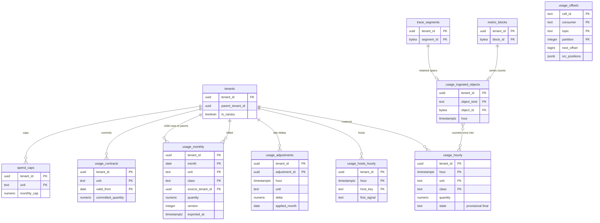

# Data model: 利用量と課金

[data-model.md](../data-model.md) の一部。規約はそちらの 3 節に従う。振る舞いは [usage-and-billing.md](../usage-and-billing.md)（4〜8 節）を正とする。決定は [ADR-0054](../../decisions/0054-metering-units-and-host-counting.md)、[ADR-0055](../../decisions/0055-exactly-once-usage-aggregation-and-overage.md)、[ADR-0002](../../decisions/0002-intake-log-on-msk.md) の注記（出どころでの重複の除去）。

| 表 | 置き場所 | 書く |
| --- | --- | --- |
| `usage_hourly`、`usage_hosts_hourly` | テナントの表、分割 | `usage-aggregator`（X2） |
| `maint.usage_offsets` | `maint` | `usage-aggregator` |
| `usage_ingested_objects` | テナントの表 | `usage-aggregator`（X2） |
| `usage_adjustments`、`usage_monthly` | テナントの表 | `usage-aggregator`（確定）、`billing-export`（送ったバージョン） |
| `usage_contracts`、`spend_caps` | テナントの表 | `api`（契約の同期、組織の管理者） |

- 時間 `hour` は UTC の 1 時間の区切り。月 `month` は日本時間の暦の月（翌月 1 日の 03:00 JST に確定）。日本時間は UTC と時間の区切りが揃うので、月は時間の行の和で作れる（D-32）。
- 見張りの組織（`tenants.is_canary`）は行を作らない。

## 1. ER 図

- `usage_ingested_objects` から `metric_blocks`・`trace_segments` への線は、`object_kind` で分かれる多態の論理の参照（分割した表）。
- `usage_offsets`（`maint`）は `usage_hourly` と同じトランザクションで進めるが、行どうしの対応を持たないので線を描かない。

## 2. 単位

`unit` と `class` の値（[usage-and-billing.md](../usage-and-billing.md) の 4 節）。課金しない数（拒否・429・溢れ）も同じ表に別の単位で持ち、画面で分ける。

| `unit` | `class` | 数え方 | 元 | 月 |
| --- | --- | --- | --- | --- |
| `hosts` | `-` | 時間ごとの異なる `host_key`（確定の時に `usage_hosts_hourly` から数える） | `metrics` の頭、`usage` のホストの報告 | 下位 99% の時間の最大 |
| `custom_metrics` | `-` | 時間ごとの異なる系列（重み：gauge・count・rate 1、分布 5） | `metric_blocks.series_custom`・`series_distribution`（`origin = ingest`、貸し出しの持ち主の行） | 時間の平均 |
| `log_ingested_bytes` | `-` | 展開の後のバイト | `logs-raw` の頭の `raw_bytes` | 合計 |
| `log_indexed_events` | `idx-3d`・`idx-7d`・`idx-15d`・`idx-30d` | 索引に振り分けた件数 | `logs` の `route` | 合計 |
| `log_rehydrated_bytes`・`log_rehydrated_events` | `rehyd-<N>d` | 読んだアーカイブのバイト、戻した件数 | `rehydration_jobs` | 合計 |
| `span_ingested_bytes` | `-` | OTLP の Protobuf の形のバイト | `spans` の頭の `raw_bytes` | 合計 |
| `span_retained` | `-` | 残したスパンの件数 | `trace_segments.kept_spans`（`origin = assembler`） | 合計 |
| `monitors_active`・`monitor_groups_evaluated` | `-` | 課金しない | 評価の記録 | 最大と平均 |
| `rejected_points`・`rejected_429`・`overflow_points` | 理由のコード | 課金しない | `usage` のトピック、溢れの記録 | 合計 |

## 3. 表

### 3.1 `usage_hourly`

時間・単位ごとの量（[ADR-0055](../../decisions/0055-exactly-once-usage-aggregation-and-overage.md)）。

| 列 | 型 | NULL | 既定 | 説明 |
| --- | --- | --- | --- | --- |
| `tenant_id` | `uuid` | NOT NULL | — | |
| `hour` | `timestamptz` | NOT NULL | — | 取り込みの時刻の時間（UTC）。分割の鍵 |
| `unit` | `text` | NOT NULL | — | 2 節 |
| `class` | `text` | NOT NULL | `'-'` | 2 節 |
| `quantity` | `numeric(24,0)` | NOT NULL | `0` | 増分を足す |
| `state` | `text` | NOT NULL | `'provisional'` | `provisional`・`final` |
| `finalized_at` | `timestamptz` | NULL | — | `H + 3 時間` に水位を確かめて |
| `updated_at` | `timestamptz` | NOT NULL | `now()` | |

- キー：PK `(tenant_id, hour, unit, class)`。
- 書き方（1 回だけ）：1 つのトランザクションで、(1) `maint.usage_offsets` を前の位置の条件で進め、(2) `INSERT … ON CONFLICT (…) DO UPDATE SET quantity = usage_hourly.quantity + EXCLUDED.quantity`。(1) が 0 行なら捨てる。`final` の行には足さず、`usage_adjustments` に入れる（トリガーで拒む）。
- CHECK：`quantity >= 0`、`state IN (…)`、`date_trunc('hour', hour) = hour`。
- 分割：`hour` の月。保持：25 か月（請求の確かめ。**L7 の確認待ち**）。
- RLS：テナントの表。S1 の量：1 日 約 30 万行（1,000 × 24 × 約 12 単位）。

### 3.2 `usage_hosts_hourly`

時間ごとの異なるホストの集合（[usage-and-billing.md](../usage-and-billing.md) の 5.1 節）。集合なので読み直しても同じ。

| 列 | 型 | NULL | 既定 | 説明 |
| --- | --- | --- | --- | --- |
| `tenant_id` | `uuid` | NOT NULL | — | |
| `hour` | `timestamptz` | NOT NULL | — | 分割の鍵 |
| `host_key` | `text` | NOT NULL | — | エージェントの安定の ID、OTLP の `host.id`（なければ `host.name`） |
| `first_signal` | `text` | NOT NULL | — | `metrics`・`agent_report`・`otlp` |

- キー：PK `(tenant_id, hour, host_key)`。`INSERT … ON CONFLICT DO NOTHING`。
- 分割：`hour` の日。保持：40 日（月の確定と調整の後は数だけが要る）。
- RLS：テナントの表。S1 の量：1 日 約 120 万行（5 万ホスト × 24）。

### 3.3 `maint.usage_offsets`

`usage-aggregator` の確定の位置と、出どころの位置（D-26）。

| 列 | 型 | NULL | 既定 | 説明 |
| --- | --- | --- | --- | --- |
| `cell_id` | `text` | NOT NULL | — | |
| `consumer` | `text` | NOT NULL | — | `usage-aggregator` の役割（`metrics`・`logs_raw`・`logs`・`spans`・`usage`・`catalog`） |
| `topic` | `text` | NOT NULL | — | |
| `partition` | `integer` | NOT NULL | — | |
| `next_offset` | `bigint` | NOT NULL | — | |
| `src_positions` | `jsonb` | NOT NULL | `'{}'` | `logs` だけ：`{"<logs-raw のパーティション>": 折り込み済みの最大の src_offset}`。それ以下の出どころのメッセージを飛ばす |
| `updated_at` | `timestamptz` | NOT NULL | `now()` | |

- キー：PK `(cell_id, consumer, topic, partition)`。
- 進め方：`UPDATE … SET next_offset = $end, src_positions = $new WHERE (cell_id, consumer, topic, partition) = (…) AND next_offset = $start`。
- RLS：なし（`maint`）。S1 の量：約 3,000 行。

### 3.4 `usage_ingested_objects`

カタログから数えた行の ID（同じブロック・セグメントを 2 回数えない。[usage-and-billing.md](../usage-and-billing.md) の 5.2 節）。

| 列 | 型 | NULL | 既定 | 説明 |
| --- | --- | --- | --- | --- |
| `tenant_id` | `uuid` | NOT NULL | — | |
| `object_kind` | `text` | NOT NULL | — | `metric_block`・`trace_segment`・`rehydration_job` |
| `object_id` | `bytea` | NOT NULL | — | `block_id`・`segment_id`・`job_id` のバイト |
| `hour` | `timestamptz` | NOT NULL | — | 数えた時間 |
| `ingested_at` | `timestamptz` | NOT NULL | `now()` | |

- キー：PK `(tenant_id, object_kind, object_id)`。`usage_hourly` への加算と同じトランザクションで `INSERT … ON CONFLICT DO NOTHING`、0 行なら加算しない。
- 読み方：`usage-aggregator` は組織ごとに（X2）、`metric_blocks`・`trace_segments` の `created_at` の新しい行を、前回の時刻の 10 分前から読む（重なりは一意の鍵で除く）。
- RLS：テナントの表。保持：40 日。S1 の量：1 日 約 40 万行。

### 3.5 `usage_adjustments`

確定の後に来た増分（[usage-and-billing.md](../usage-and-billing.md) の 5.3 節）。

| 列 | 型 | NULL | 既定 | 説明 |
| --- | --- | --- | --- | --- |
| `tenant_id`・`adjustment_id` | `uuid` | NOT NULL | `uuidv7()` | |
| `hour` | `timestamptz` | NOT NULL | — | 元の時間 |
| `unit`・`class` | `text` | NOT NULL | — | |
| `delta` | `numeric(24,0)` | NOT NULL | — | |
| `reason` | `text` | NOT NULL | — | `late_message`・`late_catalog`・`manual` |
| `applied_month` | `date` | NOT NULL | — | 月の確定の前なら元の月、後なら次の月（月の 1 日） |
| `created_at` | `timestamptz` | NOT NULL | `now()` | |

- キー：PK `(tenant_id, adjustment_id)`。索引：`(tenant_id, applied_month)`。
- RLS：テナントの表。保持：25 か月。S1 の量：少ない。

### 3.6 `usage_monthly`

月の確定の値。親の組織には、子の組織の行を `source_tenant_id` で写す（親から子のデータの面は読まない。[usage-and-billing.md](../usage-and-billing.md) の 6 節。D-35）。

| 列 | 型 | NULL | 既定 | 説明 |
| --- | --- | --- | --- | --- |
| `tenant_id` | `uuid` | NOT NULL | — | 行の持ち主（子の行の写しは親） |
| `month` | `date` | NOT NULL | — | 日本時間の月の 1 日 |
| `unit`・`class` | `text` | NOT NULL | — | |
| `source_tenant_id` | `uuid` | NOT NULL | — | 自分の行は `tenant_id` と同じ、子の写しは子の ID |
| `quantity` | `numeric(24,4)` | NOT NULL | — | 単位ごとの月の数え方（2 節） |
| `method` | `text` | NOT NULL | — | `p99_max`・`hourly_avg`・`sum` |
| `version` | `integer` | NOT NULL | `1` | 調整で作り直すたびに上げる |
| `finalized_at` | `timestamptz` | NOT NULL | — | |
| `exported_version`・`exported_at` | — | NULL | — | 課金のシステムへ送ったバージョン（冪等の鍵 `(tenant_id, period, unit, version)`） |

- キー：PK `(tenant_id, month, unit, class, source_tenant_id)`。
- 書き方：子の写しは、確定の作業が親の組織の文脈（`SET LOCAL app.tenant_id = 親`）で書く（X2）。
- 送り方：`billing-export` は outbox の `usage-finalized` から送り、毎日突き合わせる。
- RLS：テナントの表。保持：7 年（会計の記録。**L7 の確認待ち**）。S1 の量：1 年 約 15 万行。

### 3.7 `usage_contracts`・`spend_caps`

契約の量と費用の上限（[usage-and-billing.md](../usage-and-billing.md) の 7 節）。

| `usage_contracts` の列 | 型 | NULL | 既定 | 説明 |
| --- | --- | --- | --- | --- |
| `tenant_id` | `uuid` | NOT NULL | — | |
| `unit` | `text` | NOT NULL | — | |
| `valid_from` | `date` | NOT NULL | — | 月の 1 日 |
| `committed_quantity` | `numeric(24,4)` | NOT NULL | — | 月の契約の量 |
| `plan` | `text` | NOT NULL | — | `trial`・`standard`・`enterprise` |
| `source_ref` | `text` | NULL | — | 外部の契約の ID |
| `updated_at` | `timestamptz` | NOT NULL | `now()` | |

| `spend_caps` の列 | 型 | NULL | 既定 | 説明 |
| --- | --- | --- | --- | --- |
| `tenant_id` | `uuid` | NOT NULL | — | |
| `unit` | `text` | NOT NULL | — | |
| `monthly_cap` | `numeric(24,4)` | NOT NULL | — | 量の上限 |
| `notify_thresholds` | `smallint[]` | NOT NULL | `'{80,100,150}'` | 日割りで見た割合 |
| `updated_by`・`updated_at` | — | — | — | |

- キー：`usage_contracts` PK `(tenant_id, unit, valid_from)`。`spend_caps` PK `(tenant_id, unit)`。
- 上限に当たったときの振る舞い（ログは索引への振り分けを止める、スパンはエラーのトレースだけ、メトリクスは止めない）は単位で決まり、表に持たない。上限の状態は outbox で `log-processor`・`trace-assembler` に配り、設定の束（`pipeline_config_versions`）と組み立ての予算に入れる。
- RLS：テナントの表。S1 の量：数千行。
