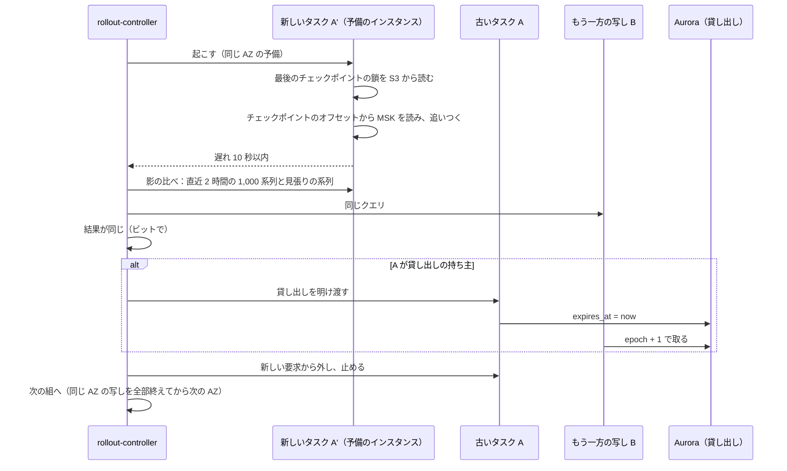
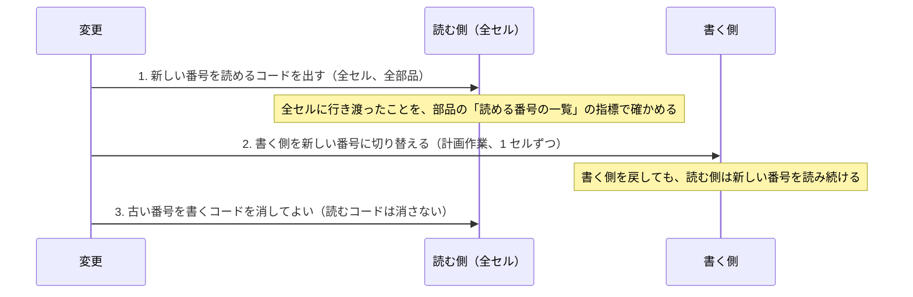

# Delivery: Datadog

CI/CD（Rust のデータの面と TypeScript の管理の面）、データの面の段階のデプロイ（セルごと、写しを片方ずつ）、状態を持つ部品をヘッドを失わずに入れ替える手順（引き継ぎと MSK からの読み直し）、エージェントの配布と互換、形式のバージョン（`codec_id`、ブロックとセグメントの形式、語の分け方、MSK のメッセージ、クエリの IR、評価の記録）の更新の順序、スキーマの変更の順序、フラグを決める。リリースの方針の正本は [runbooks/](../runbooks/README.md) の 3 節で、この文書はその実装を書く。

| ADR | 決定 |
| --- | --- |
| [0065](../decisions/0065-stateful-rollout-with-replica-handoff.md) | 状態を持つ部品は、予備のインスタンスに新しいタスクを先に起こし、チェックポイントと MSK から追いつかせ、もう一方の写しと影の比べ（直近 2 時間の抜き取りのクエリの一致）が通ってから古いタスクを止める。貸し出しは止める前に明け渡す。インジェスターは 1 つの AZ の写しを入れ替え終えてから次の AZ に進み、書き出しの窓（毎時 :08〜:20）には貸し出しの持ち主を止めない。ログのインデクサー・組み立て・評価は、確定の位置からの読み直しと、持ち主の交代の手順で 1 つずつ入れ替える |
| [0066](../decisions/0066-format-versioning-and-compatibility-windows.md) | 形式（`codec_id`、ブロック、セグメント、`tokenizer_version`、MSK のメッセージ、ヘッドのチェックポイント、クエリの IR、評価の記録）は、どれも数で番号を持ち、読む側を先に全セルへ出してから書く側を出す。古い番号の読み出しは消さない（MSK のメッセージとチェックポイントは保持の後に消してよい）。保存したモニター・SLO は文と `ir_version` を持ち、IR を上げるときは評価の記録の再生で新旧の結果を比べてから切り替える。エージェントは 6 か月前までのバージョンを受け、送信の形の変更はエージェントのバージョンを見てゲートウェイが受ける |

前提：デプロイとリリースの分け方、時間帯と凍結、自動のロールバックの条件、エージェントの段階の配布（[runbooks/](../runbooks/README.md) の 3 節）。形式をフラグにしない（[AGENTS.md](../../AGENTS.md)）。アカウントと群れは [infrastructure.md](infrastructure.md)、品質の関門は [quality.md](../quality.md)。

## 1. 変更からマージまで

- 他の題材と同じ：`<system>/<YYMMDD-slug>` のブランチ、変更ごとの worktree、Conventional Commits、PR の CI が緑で Dev のレビュー、`main` へ直接 push しない（リポジトリ共通の ADR-0002）。
- **人がレビューして確定する契約**（[roadmap.md](../roadmap.md) の「契約を先に固定する」）：取り込みの形式、系列の鍵、`codec_id`、ブロック・セグメントの形式、`tokenizer_version`、クエリの言語と IR の既定の意味、モニターの状態の遷移の決定表、キーの形式とヘッダー、Webhook の署名。これらのファイルは CODEOWNERS でテックリードと QA の承認を要る。
- 試験のベクトルの期待する値を変える PR は、QA の承認を要る（[quality.md](../quality.md) の 2.3 節）。

## 2. CI

### 2.1 PR の CI（必須）

| 段 | Rust（データの面、エージェント） | TypeScript（管理の面、画面） |
| --- | --- | --- |
| 形と静的な検査 | `cargo fmt --check`、`cargo clippy -D warnings`、`cargo deny`（ライセンス、禁止の依存：本家の実装と汎用の時系列・ログのデータベース。[ADR-0001](../decisions/0001-platform-and-stack.md)） | `pnpm lint`、`pnpm typecheck`、点の集計・状態の遷移を書くコードの禁止の lint（ADR-0001） |
| 単体・表駆動・試験のベクトル | `cargo nextest`（変更した crate とその依存元） | Vitest（`--changed`） |
| 性質ベース | proptest 2,000 試行（変更した crate） | fast-check 2,000 試行 |
| 参照の実装との比べ | `tsdb-ref`・`query-ref` 1 万件（`crates/tsdb`・`query-*` に触れたとき） | — |
| シミュレーター | `monitor-sim` 1 万の場面（`crates/monitor-eval` に触れたとき） | — |
| 結合 | Testcontainers（Kafka、PostgreSQL 18、Valkey）、LocalStack（S3） | 同左（API と RLS） |
| 形式の互換 | 6 節の「全バージョンの試験のベクトルを読める」「読む側が書く側より先」の検査 | — |
| WASM | `query-lang` の WASM のビルドと、ネイティブとの IR の一致の試験のベクトル（[ADR-0007](../decisions/0007-query-language.md)） | 画面が使う WASM のバージョンの固定 |
| テストの緩和の検出 | 削除・`#[ignore]`・期待値の変更を差分から見つけ、QA の承認を求める | `.skip`・期待値の変更 |
| 要件の追跡 | テスト名の `REQ-*`・`PROP-*` と spec の照合 | 同左 |

- ビルドはキャッシュ（sccache、Turborepo）を使い、PR の CI を 20 分以内に収める。超えたら、変更した crate に絞る範囲を見直す。

### 2.2 夜間の CI

| 中身 | 規模 |
| --- | --- |
| 性質ベース | 各 20 万試行 |
| 参照の実装との比べ | 大きな生成（系列 100 万、ログ 1,000 万件） |
| シミュレーター | 100 万の場面。失敗したシードは `monitor-sim/regressions/` へ |
| ファジング | cargo-fuzz、各 1 時間（取り込みの形式、展開、クエリの構文解析、チャンク・ブロック・セグメント・チェックポイントの復号） |
| 障害の注入 | ブローカーの停止、消費者の任意の位置での停止、S3 の 503、写しの片方の停止、時計のずれ（[quality.md](../quality.md) の 2.2.1 節 F） |
| 負荷とうるさい隣人 | staging の `stg-c1` で S1 の 1/20（[capacity.md](capacity.md) の 9 節、[ADR-0064](../decisions/0064-capacity-headroom-and-load-test-gates.md)） |
| 状態を持つ部品の入れ替えの試験 | staging で 4 節の入れ替えを 1 回流し、見張りの照合が 0 のまま |

- 夜間の CI が落ちたら、翌日のデータの面のデプロイを止める（直すまで）。

## 3. 成果物とフラグ

### 3.1 成果物

| 成果物 | 作り方 | 置き場所 |
| --- | --- | --- |
| サービスのイメージ（Rust・TypeScript） | 1 回ビルドし、同じダイジェストを dev → staging → prod へ昇格させる | shared の ECR |
| AMI（EC2 の群れ） | ECS に最適化した Amazon Linux 2023（ARM64）を月ごとに取り込み、群れごとの設定（NVMe の初期化、カーネルの設定）を足す | shared |
| 画面の資産と WASM | ハッシュつきの名前で S3 に置く | edge |
| エージェント | 5 節 | release |

### 3.2 フラグ

| フラグ | 使い方 |
| --- | --- |
| `release.*`（kebab-case） | 未完成の振る舞い（画面の機能、新しい API）。100% の後 30 日で消す |
| `ops.*`（snake_case） | 止めるだけのつまみ（`ops.intake_enabled`、`ops.compaction_enabled`、`ops.retention_delete_enabled`、`ops.notifications_enabled`、`ops.query_concurrency_per_tenant`）と、入れ替えの止め（`ops.rollout_paused`） |

- **形式・圧縮・ロールアップ・評価の規則をフラグにしない**（[AGENTS.md](../../AGENTS.md)）。これらは 6 節の番号とデプロイの順序で出す。
- データの面の Rust は、フラグを AppConfig から 30 秒ごとに読み、読めない間は最後の値を保つ。

## 4. デプロイ

### 4.1 順序

- セルごとに、検証のセル → 社内の見張りのセル → 本番のセルの順（[runbooks/](../runbooks/README.md) の 3 節）。社内の見張りのセルで 24 時間、見張りの照合・写しの一致・SLI を見てから次へ。
- セルの中の順：
  1. 管理の面のマイグレーション（広げる段だけ。7 節）
  2. 状態を持たない部品（`intake-gateway`、`log-processor`、`query-frontend`、`usage-aggregator`。Fargate のローリング、最小の健全 100%）
  3. 状態を持つ部品（4.2 節。インジェスター → 読み手 → インデクサー・合わせ → 組み立て → 評価）
  4. 管理の面（`api`・`web-bff` → `relay`・`notifier`）
  5. 画面の資産
- 形式の書く側を変える変更は、計画作業として別に出す（6 節）。

### 4.2 状態を持つ部品の入れ替え

ADR-0065。

**インジェスター**（1 つの組 = `metrics` のパーティション 64 個、写し A と B。[infrastructure.md](infrastructure.md) の 3.2 節）：

- **同時に止めるのは 1 つの写しだけ。** 組の写し A と B を同時に入れ替えない。A の AZ（`g mod 3`）の写しを全部入れ替え、次の書き出しで写しの一致（[tsdb-storage-engine.md](tsdb-storage-engine.md) の 6.3・6.5 節）が通ってから、B の AZ へ進む。
- **影の比べ**：新しいタスクが追いついた後、無作為の 1,000 系列と見張りの系列で、直近 2 時間のクエリを新しいタスクともう一方の写しに投げ、結果がビットで同じことを確かめる。加えて、追いついた後の最初の 2 つの 5 分の区切りで、ヘッドの要約（[tsdb-storage-engine.md](tsdb-storage-engine.md) の 6.7 節）がもう一方の写しと一致することを確かめる（統合の工程で採用）。違えば新しいタスクを止め、古いタスクを残し、入れ替えを止める（`ops.rollout_paused`）。
- **書き出しの窓**：時間の区切りの書き出し（毎時 :10〜:15。パーティションごとに 0〜5 分ずらす。[ADR-0020](../decisions/0020-block-flush-commit-and-replay.md)）の前後、:08〜:20 は貸し出しの持ち主を止めない。
- **追いつく時間**：チェックポイントは 5 分ごとなので、読み直すのは最大 5 分＋α。読み出しは取り込みの 10 倍の速さを見込み、1〜2 分で追いつく。チェックポイントの鎖が読めなければ `replay_from`（最大 約 2 時間 30 分前）から読み、15 分前後かかる。
- **所要**：S1 の 32 タスクを 1 つずつ、1 タスク 約 5 分で、1 セル 約 3 時間。平日 10〜15 時の時間帯（[runbooks/](../runbooks/README.md) の 3.1 節）に収まる。
- **予備がないとき**：入れ替えを始めない（予備の上で新しいタスクを先に起こすのが前提）。

**その他の部品**：

| 部品 | 入れ替え方 |
| --- | --- |
| `query-reader`・`log-searcher` | 1 つの AZ で 1 台ずつ。新しいタスクをランデブーハッシュの輪に入れ、古いタスクの担当を新しいタスクへ移してから止める。キャッシュは S3 から温まる（最初の数分はキャッシュの当たりが下がる） |
| `log-indexer` | 消費者のグループの協調的な再割り当て（cooperative sticky）。止める前に、手元のバッファーを書き出して確定する。確定の前に落ちても、確定の位置から読み直して重ならない（[log-storage-and-search.md](log-storage-and-search.md) の 5.1 節） |
| `log-processor` | Kafka のトランザクションで確定した位置から読み直す（[ADR-0030](../decisions/0030-log-pipeline-execution-model.md)）。下流は出どころの位置でも重複を除く（[ADR-0002](../decisions/0002-intake-log-on-msk.md) の注記）。Fargate のローリング |
| `trace-assembler` | パーティションを手放すときに開いているトレースを出さずに捨て、新しい持ち主が確定の位置（開いているバッファーの最も古いオフセットの手前）から読み直して同じ判断をする（[traces-and-sampling.md](traces-and-sampling.md)）。完成の待ち（30 秒〜5 分）分の読み直し |
| `monitor-evaluator` | 評価のシャードを 1 つずつ移す。状態のスナップショットとその後の遷移を読んで続ける。抜けは 10 分まで追う（[ADR-0008](../decisions/0008-monitor-evaluation-model.md)） |
| `compactor` | 作業の単位（組織・日）の終わりで止める。途中で止めても、確かめの前に古いものを消さないので失わない |

### 4.3 自動のロールバック

- 条件（[runbooks/](../runbooks/README.md) の 3 節）：取り込みの 5xx、202 の p99、取り込みからクエリまでの p99、評価の遅れ、写しのチェックサムの不一致、見張りの照合の不一致。
- 状態を持たない部品は、前のイメージへ戻す。状態を持つ部品は、入れ替えを止め、入れ替えたタスクを同じ手順（4.2 節）で前のイメージに戻す。形式の書く側を変えていなければ、前のイメージで読めない状態は生まれない（6 節）。

### 4.4 AMI とインスタンスの入れ替え

- 月ごとの AMI の更新は、4.2 節と同じ手順で群れごとに入れ替える（新しい AMI の予備のインスタンスに新しいタスク → 古いインスタンスを空けて終える）。
- インスタンスの予定のメンテナンスの知らせ（EventBridge）も同じ手順で、予定の 24 時間前までに移す。

## 5. エージェントの配布

### 5.1 署名と配布

| 形 | 署名 | 置き場所 |
| --- | --- | --- |
| deb・rpm | パッケージのリポジトリの署名の鍵（GPG） | `dl.<brand>.<domain>` の apt・yum のリポジトリ |
| msi（Windows） | コード署名の証明書 | `dl.<brand>.<domain>` |
| コンテナのイメージ | cosign（鍵を書き出せない署名のサービス）。SBOM と出どころの証明を添える | 公開のコンテナのレジストリ（本システムの名前空間） |
| Kubernetes の Helm のチャート | 同上 | `dl.<brand>.<domain>` |
| 更新の目録（自動の更新を選んだエージェント向け） | 目録の署名の鍵。エージェントは埋め込んだ公開鍵で確かめる | `dl.<brand>.<domain>` |

- 署名の鍵は release のアカウントに置き、署名のジョブは 2 人の承認で動く（[infrastructure.md](infrastructure.md) の 1 節、[security.md](security.md) の 3.4 節）。
- 本家のエージェントのコード・パッケージの形式を使わない（[ADR-0001](../decisions/0001-platform-and-stack.md)）。

### 5.2 段階の配布

- 列：`beta`（社内と希望する組織）→ `stable`。
- `stable` は、社内 → 1% → 10% → 50% → 100%、各段 48 時間以上（[runbooks/](../runbooks/README.md) の 3 節）。段階を効かせられるのは、自動の更新を選んだエージェント（更新の目録で、ホストの鍵のハッシュで段に入れる）と、`latest` のタグを追うコンテナのイメージ（タグを段ごとに動かす）。パッケージのリポジトリは 100% の段で公開する。
- 止める条件：送信の失敗の率、拒んだ点の率、エージェントの CPU とメモリーが前のバージョンの 1.5 倍（ゲートウェイの指標をエージェントのバージョンで分けて見る）。

### 5.3 互換

ADR-0066。

- ゲートウェイは、少なくとも 6 か月前までのエージェントのバージョンを受ける（[runbooks/](../runbooks/README.md) の 3 節）。エージェントは要求のヘッダー `<Brand>-Agent-Version` を送る。
- 送信の形（本システムの API の JSON・Protobuf）の変更は、項目を足すだけにし、ゲートウェイが古い形と新しい形の両方を受ける。項目の意味を変える・消すときは、新しい API のバージョン（`/api/v3/...`）を足し、古いものを 6 か月以上残す。
- 古いエージェントの廃止は、6 か月前に組織に知らせ（利用量の画面とメール）、その後は 426 と更新の案内を返す。止める前に、そのバージョンの送信の量を見る。
- OTLP は標準のバージョンに従う（[ADR-0014](../decisions/0014-otlp-mapping-and-resource-attributes.md)）。

## 6. 形式のバージョン

ADR-0066。

### 6.1 一覧

| 形式 | 番号 | 正本 | 古い番号の読み出し |
| --- | --- | --- | --- |
| 時系列のコーデック | `codec_id`（1〜15 浮動小数点、16〜31 分布） | [ADR-0004](../decisions/0004-tsdb-storage-engine.md)、[ADR-0021](../decisions/0021-block-format-v1.md) | 消さない（保持 15 か月の間、ブロックに残る） |
| ブロック | 形式のバージョン（頭の `TSB1` の後） | ADR-0021 | 消さない |
| ログ・トレースのセグメント | `LSEG` のバージョン | [ADR-0033](../decisions/0033-log-segment-format-and-tokenizer.md) | 消さない（アーカイブ 1 年） |
| 語の分け方 | `tokenizer_version` | ADR-0033 | 消さない（引く側はセグメントのバージョンで語を作る） |
| MSK のメッセージ | 頭の形式のバージョン（[ADR-0002](../decisions/0002-intake-log-on-msk.md)） | intake-and-agent | 保持（24 時間）の後に消してよい |
| ヘッドのチェックポイント | 形式のバージョン | [tsdb-storage-engine.md](tsdb-storage-engine.md) の 4.3 節 | 保持（24 時間）の後に消してよい |
| クエリの IR | `ir_version` | [ADR-0007](../decisions/0007-query-language.md)、[metrics-query-engine.md](metrics-query-engine.md) | 保存した定義は文から作り直すので、古い IR を実行しない（6.3 節） |
| 評価の記録（入力の写し） | 形式のバージョン | [ADR-0008](../decisions/0008-monitor-evaluation-model.md) | 保持（30 日）の間は消さない（再生に使う） |
| モニターの状態の遷移の決定表 | 定義のバージョンと評価のコードのバージョン | [ADR-0041](../decisions/0041-monitor-state-machine.md) | 再生は記録した評価のコードのバージョンで行う |

### 6.2 更新の順序

- 部品は起動時に「読める番号の一覧」を指標（`svc_formats_readable{format, version}`）で出す。書く側の切り替えの前に、`rollout-controller` が全セル・全タスクで新しい番号が読めることを確かめる。満たさなければ切り替えない。
- 書く側の切り替えは、デプロイと同じ段階（staging → `apne1-c0` → 本番のセル）で、計画作業の時間帯（[runbooks/](../runbooks/README.md) の 3.1 節）。
- **写しのバイトの一致**：インジェスターの 2 つの写しは同じバイトのブロックを作る必要がある。書く側の切り替えは、1 つの組の 2 つの写しを同じ時間の区切りから同時に切り替える（切り替えの時刻をブロックの区切りで決め、両方の写しが同じ値を読む）。片方だけを先に切り替えない。
- **新しい `codec_id`**：同じ入力から新旧の両方で同じ値に戻ることを試験のベクトルで確かめる（[quality.md](../quality.md) の 2.2.1 節 A）。合わせで古いブロックを新しい `codec_id` に書き直すかは別に決める（[ADR-0004](../decisions/0004-tsdb-storage-engine.md)）。
- **新しい `tokenizer_version`**：引く側は、検索の範囲のセグメントのバージョンごとに語を作る。新旧のセグメントが混ざる期間（索引の保持の最長 30 日、アーカイブ 1 年）も取りこぼしがないことを、性質ベーステストで確かめる。

### 6.3 クエリの IR とモニター

- 保存したモニター・SLO・ダッシュボード・ログから作るメトリクスは、文（クエリの文字列か画面の組み立ての形）と、保存したときの `ir_version` を持つ。実行のたびに、今の `query-lang` で文から IR を作る。
- `ir_version` を上げる変更（既定の意味の変更を含む）は、結果を変えうる。切り替えの前に：
  1. 評価の記録（直近 30 日）の抜き取りを、新旧の IR で再生し、遷移が変わるモニターを数える。
  2. ダッシュボードの抜き取りのクエリを新旧で比べ、値が変わる数を数える。
  3. 変わるものがあれば、PM と QA が判断する。利用者に変わることを知らせる。モニターごとに古い意味を残す選択（`ir_version` の固定）を一定の期間（90 日）許す。
- 画面の WASM の `query-lang` と、サーバーの `query-lang` は同じバージョンを使う。画面の資産は、置いた `query-lang` のバージョンと合わないサーバーに当たったら、作り直した IR をサーバーに任せる（画面の補完だけが古いバージョンで動く）。

## 7. スキーマの変更の順序

### 7.1 Aurora

- 広げる → 移す → 縮める の 3 段（他の題材と同じ）。広げる段（列・表・索引を足す）はデプロイの最初、縮める段（消す）は、コードが古い列を使わなくなったデプロイの後の別の変更。縮める段の後は前のバージョンへ戻さない（[runbooks/](../runbooks/README.md) の 3 節）。
- `FORCE ROW LEVEL SECURITY` とポリシーの検査を、マイグレーションの CI で全表に当てる（[ADR-0003](../decisions/0003-tenancy-cells-and-isolation.md)）。
- 大きな表（`log_segments`、遷移の記録）は月ごとの分割なので、索引の追加は新しい分割から作り、古い分割は計画作業で足す。

### 7.2 S3 のキーと区分

- キーの形（[ADR-0009](../decisions/0009-retention-tiers-on-s3.md)）を変えない。新しい保持の区分は、新しい `class` の値とタグ（[infrastructure.md](infrastructure.md) の 5.1 節）を足すだけにする。ライフサイクルと複製の規則を先に足し、書く側を後に切り替える。

### 7.3 MSK のトピック

- トピックとパーティションを足すのは、消費者がそれを読めるようになってから。パーティションの数を増やすと、組織のパーティションの組の計算が変わるので、組の変更の規則（2 時間以上先の区切りから効く。[ADR-0019](../decisions/0019-partition-mapping-and-head-layout.md)）に合わせて効く時刻を決める。

## 8. ホットフィックス

- 同じ経路（PR の CI、レビュー、イメージの昇格）を通す。CI の夜間の分と、社内の見張りのセルの 24 時間の観察を、Ops の判断で短くしてよい（最低 1 時間）。形式の書く側の変更は、ホットフィックスで出さない。

## 9. 指標

| 指標 | 目標 |
| --- | --- |
| PR の CI の時間 | 20 分以内 |
| 夜間の CI の連続の緑 | E3・E7 のリリースの合否は 7 日（[quality.md](../quality.md) の 5 節） |
| インジェスターの 1 セルの入れ替えの時間 | 約 3 時間（S1） |
| 入れ替えの影の比べの失敗 | 0 |
| デプロイの自動のロールバックの数 | 月ごとに見る |
| エージェントのバージョンの分布 | 6 か月より古いものの割合 |

## 10. Story の候補

| Epic | Story | 中身 |
| --- | --- | --- |
| E1 | `ci-pipeline-baseline` | 2.1・2.2 節（roadmap の Story） |
| E1 | `flags-appconfig` | 3.2 節 |
| E1 | `rollout-controller` | 4.1・4.2 節の順序、影の比べ、貸し出しの明け渡し、`ops.rollout_paused`、読める番号の確かめ |
| E1 | `ami-pipeline` | 3.1・4.4 節 |
| E2 | `agent-distribution` | 5 節（roadmap の Story） |
| E3 | `ingester-rolling-replace` | 4.2 節のインジェスターの手順と、staging の夜間の入れ替えの試験 |
| E4 | `ir-version-replay` | 6.3 節の新旧の再生と比べ（metrics-query-engine・monitors-and-alerting と共同） |

## 11. 未解決の問い

### 決定

2026-10-09 の既定案。E1・E3 で覆りうる。

- **状態を持つ部品**：予備に新しいタスクを先に起こし、追いつき、影の比べの後に古いものを止める（ADR-0065）。
- **形式**：読む側を先に全セルへ、書く側を後に。古い番号の読み出しを消さない（ADR-0066）。
- **IR**：文と `ir_version` を保存し、上げるときは再生で新旧を比べる（ADR-0066）。
- **エージェント**：6 か月前まで受ける（runbooks の値。ADR-0066）。

### 持ち越し

| 問い | いつ・どう決めるか |
| --- | --- |
| 影の比べの系列の数（1,000）が足りるか | E3 の `ingester-rolling-replace`。ヘッドの要約は統合の工程で採り、系列の比べに足した（[tsdb-storage-engine.md](tsdb-storage-engine.md) の 6.7 節） |
| `ir_version` の固定を許す期間（90 日） | PM と QA |
| 公開のコンテナのレジストリの選定 | E2 の `agent-distribution` |
| 合わせで古い `codec_id` を書き直すか | ADR-0004 のとおり別に決める |

## 12. quality.md・runbooks・data-model への項目

### quality.md

- 2.2 節の表に「状態を持つ部品の入れ替えの試験（夜間、staging）」の行を足す。
- 2.2.1 節 A に、6.2 節の「写しの 2 つを同じ区切りから切り替える」場面を足す。

### runbooks

- `deploy-and-rollback.md`：4.2 節の手順、影の比べの失敗のときの止め方、入れ替えの途中の戻し方。
- `format-rollout.md`：6.2 節の書く側の切り替えの手順と、読める番号の確かめ。

### data-model への項目

| 表・置き場所 | 中身 | 節 |
| --- | --- | --- |
| `rollouts`（保守のスキーマ） | セル、部品、イメージ、段、影の比べの結果、状態 | 4.2 |
| `format_versions`（保守のスキーマ） | 形式ごとの書く側の今の番号と、切り替えた時刻（セルごと） | 6.2 |
| モニター・SLO・ダッシュボードの定義に足す列 | `ir_version`、固定の期限 | 6.3 |
| AppConfig | `ops.rollout_paused` | 3.2 |
| 指標 | `svc_formats_readable{format, version}` | 6.2 |
