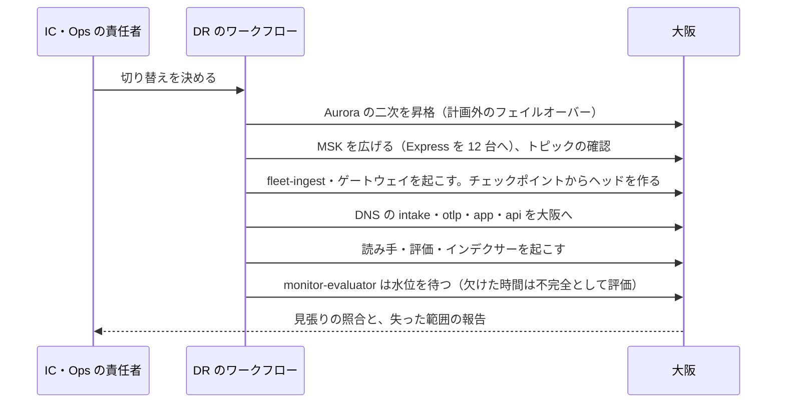

# Infrastructure: Datadog

AWS のアカウントとネットワーク、入口（取り込み・画面・API）、MSK の構成と大きさ、ECS の Fargate と EC2（NVMe）の群れ（インジェスター、読み手、インデクサー、組み立て、評価）、セルの構成と増やし方、S3 のバケットと大阪への CRR、DR（テレメトリーの RPO 30 分）、段階を上げる基準、Terraform、100 万点・ログ 1 GB・100 万スパンあたりの原価を決める。管理の面は他の題材（[Dropbox](../../../dropbox/docs/architecture/infrastructure.md)・[Google Calendar](../../../google-calendar/docs/architecture/infrastructure.md) の infrastructure.md）の形を引き継ぎ、データの面の事情だけを足す（[ADR-0001](../decisions/0001-platform-and-stack.md)）。

| ADR | 決定 |
| --- | --- |
| [0059](../decisions/0059-accounts-network-and-intake-edge.md) | アカウントは他の題材の形に、自己監視の `selfmon` と、エージェントの署名と配布の `release` を足す。取り込みは `intake`・`otlp` の NLB（TLS のリスナー、AZ をまたがない）からゲートウェイへ、画面と API は CloudFront＋WAF から ALB へ。データの面のサブネットはインターネットへの経路を持たず、外への送信は egress のサブネットの `notifier` だけ。S2 からは `intake-router` がキーからセルを引いて振り分ける |
| [0060](../decisions/0060-msk-express-and-ec2-fleets.md) | MSK は Express のブローカー（S1 は `express.m7g.8xlarge` × 12、3 AZ）にし、ストレージの管理をなくす。消費者は同じ AZ の写しから読む（ラックを意識した読み出し）。状態を持つ部品は、部品ごとの EC2 のキャパシティープロバイダー（インジェスターと組み立ては `r7gd`、メトリクスの読み手は `r7gd`、ログとトレースの読み手は `i4i`、インデクサーと合わせは `c7gd`、評価は `c7g`）に置き、AZ ごとに予備のインスタンスを 1 台持つ。インジェスターの 2 つの写しは別の AZ |
| [0061](../decisions/0061-dr-stage-up-and-cell-expansion.md) | 大阪は管理の面のウォームスタンバイ、小さな MSK（Express）と S3 の写しを常に持ち、データの面は切り替えのときに広げる。テレメトリーの RPO 30 分は、ヘッドのチェックポイント 5 分と CRR（Replication Time Control）15 分で守る。S3 の写しの規則はオブジェクトのタグ（区分と `l0`）で分け、合わせの前の小さなオブジェクトは大阪の Standard に 2 日だけ置く。段階を上げる基準は MSK の書き込み・インジェスターの系列・パーティションの数・Aurora で決め、上限の 60% で次のセルの準備を始める |

負荷と台数の根拠は [capacity.md](capacity.md)、CI とデプロイは [delivery.md](delivery.md)、自己監視の経路は [observability.md](observability.md)、暗号化と統制は [security.md](security.md) にある。数値のうち「初期見積もり」と書いたものは、PoC（`msk-throughput-poc`、`ingester-memory-poc` など）と E13 の負荷試験の前の仮の値である。AWS の仕様で確かめていないものは「未検証」と書く。

## 1. AWS アカウントの構成

ADR-0059。

| アカウント | OU | 中身 |
| --- | --- | --- |
| management | Root | Organizations、SCP、IAM Identity Center、請求 |
| security | Security | GuardDuty・Security Hub・Inspector の委任管理者 |
| log-archive | Security | 組織の CloudTrail、Config、VPC フローログ、本システムの監査と利用者の監査ログの写し（Object Lock、[security.md](security.md) の 7 節）。大阪へ写す |
| shared | Infrastructure | ECR（東京・大阪にレプリケーション）、Route 53（`<brand>.<domain>`）、Terraform の状態のバケット |
| edge | Infrastructure | CloudFront、WAF、ACM（us-east-1）、CloudFront のログ |
| release | Infrastructure | エージェントの署名の鍵、パッケージのリポジトリ（deb・rpm・msi）とコンテナのイメージの公開、更新の目録、配布の CloudFront（`dl.<brand>.<domain>`）。署名は 2 人の承認（[delivery.md](delivery.md) の 5 節） |
| selfmon | Infrastructure | 自己監視（AMP、CloudWatch、Grafana、`canary`、オンコールのサービスへの連携）。**大阪のリージョン**に置き、本番のどの部品にも依存しない（[observability.md](observability.md)、[ADR-0062](../decisions/0062-independent-self-monitoring-path.md)） |
| dev、staging | Workloads/NonProd | 開発・検証。staging は本番と同じ形のセル `stg-c1` を縮めた台数で持ち、負荷試験と DR の訓練のときだけ広げる |
| prod | Workloads/Prod | 本番（東京と大阪）。セルごとに分けたスタック |

- **SCP**（Workloads の OU）：東京・大阪以外のリージョンを禁止する（CloudFront・WAF・ACM・IAM の us-east-1 を除く）。データの所在の約束は**法務の確認待ち：L2**。CloudTrail・Config・GuardDuty の停止、KMS の鍵の削除の予約・無効化、Object Lock の解除、テレメトリーのバケットのバージョニングの停止を、break-glass 以外に禁止する。
- 本番のデータを本番のアカウントの外に出さない。selfmon には自己の計測（ID と数と理由のコード）だけが入る。
- selfmon は、本番と別の Route 53 のホストゾーン（`selfmon.<brand>-ops.<domain>`）と、別の Secrets Manager を持つ。IAM Identity Center は組織で共有するが、selfmon には Identity Center が止まったときの break-glass の IAM の利用者を 2 人分置く（[observability.md](observability.md) の 5 節）。

## 2. ネットワーク

ADR-0059。

### 2.1 prod の VPC（セルごと、東京・大阪で同じ形）

| サブネット | 置くもの | 外への経路 |
| --- | --- | --- |
| public | `nlb-intake`、`nlb-otlp`、`alb-app`、NAT ゲートウェイ | Internet Gateway |
| intake | `intake-gateway` | なし（受けるだけ）。MSK・Valkey・Aurora のリーダー（キーの引き）へ |
| data | `metrics-ingester`、`log-processor`、`log-indexer`、`trace-assembler`、`compactor`、`query-reader`、`log-searcher`、`monitor-evaluator`、`query-frontend`、`usage-aggregator` | **なし。** S3 のゲートウェイのエンドポイントと、インターフェースのエンドポイント（KMS、STS、ECR、CloudWatch Logs、AppConfig、Secrets Manager） |
| control | `api`、`web-bff`、`relay`、SSO・SCIM | NAT → Network Firewall（IdP のメタデータ・JWKS の許可リストだけ） |
| egress | `notifier` | 専用の NAT（Elastic IP を公開する）。VPC エンドポイントと isolated・data への経路を持たない |
| isolated | MSK、Aurora、ElastiCache（Valkey） | なし |

- データの面（`data`）は外への経路を持たない（[ADR-0058](../decisions/0058-untrusted-senders-egress-and-operator-access.md)）。依存の取得はビルドのときだけで、実行の時は ECR のエンドポイントから取る。
- セキュリティグループはサービスごとに入る側と出る側を明示する。MSK への書き込みは `intake-gateway`・`log-processor`・`trace-assembler`・`relay`・`query-frontend`（監査）だけ、読み出しは消費者だけに許す。
- セルごとに VPC を分ける。セルの間の通信は、`intake-router`（S2）と `query-frontend` のセルをまたぐ合わせ（移し替えの間。[tenancy-and-rbac.md](tenancy-and-rbac.md) の 10 節）だけで、PrivateLink（セルごとの内部の NLB）を通す。

### 2.2 入口とホスト名

| ホスト名 | 入口 | オリジン |
| --- | --- | --- |
| `intake.<brand>.<domain>` | NLB（TLS のリスナー、443） | `intake-gateway`（メトリクス・ログ・スパンの本システムの API、エージェント） |
| `otlp.<brand>.<domain>` | NLB（TLS のリスナー、443 と 4317） | `intake-gateway`（OTLP の HTTP と gRPC） |
| `app.<brand>.<domain>` | CloudFront＋WAF | S3（画面の資産）、`alb-app` → `web-bff` |
| `api.<brand>.<domain>` | CloudFront＋WAF | `alb-app` → `api`（公開 API、アプリケーションキー） |
| `dl.<brand>.<domain>` | CloudFront（release のアカウント） | S3（エージェントのパッケージ、更新の目録） |

- **取り込みは CloudFront を通さない。** 量が多く（S1 のピーク 1.5 GB/秒を超える）、CloudFront の要求の料金と、WAF の検査の費用が大きい。送り手の多くは日本の中にいる。入口の守りは、ゲートウェイの上限と割り当て（[ADR-0011](../decisions/0011-intake-gateway-pipeline-and-watermark-ticks.md)、[ADR-0012](../decisions/0012-intake-quota-coordination.md)）と、NLB の前の AWS Shield Standard に任せる。
- **NLB は AZ をまたいで配らない**（クロスゾーンの負荷分散を切る）。AZ をまたぐ転送の費用を避ける。DNS で 3 つの AZ の NLB のアドレスを返し、送り手が AZ にばらける。AZ の障害のときは、そのアドレスを DNS から外す（NLB の健康の確かめ）。
- **TLS は NLB で終端**し、ゲートウェイまで VPC の中で TLS を張り直す（[security.md](security.md) の 4.1 節）。NLB の TLS のリスナーの ALPN（HTTP/2 の gRPC を通す）の設定は E1 の `edge-and-intake-endpoints` で確かめる（**未検証**）。
- 画面と API の WAF：共通のルール、IP の評判、IP ごとのレート制限（`api` は 5 分 10 万）。

### 2.3 外への送信

| 送信 | 経路 | 理由 |
| --- | --- | --- |
| 通知（メール以外：チャット、汎用の Webhook、オンコールのサービス） | egress → 専用の NAT | 利用者の決める宛先。SSRF の拒否（[ADR-0058](../decisions/0058-untrusted-senders-egress-and-operator-access.md)） |
| メール | VPC エンドポイント（SES の API） | — |
| IdP のメタデータ・JWKS | control → NAT → Network Firewall | 組織が登録した IdP のホスト名を許可リストへ自動で足す |
| 自己の計測 | data・control の ADOT のコレクター → `selfmon-relay`（control のサブネットの ADOT のゲートウェイ）→ NAT → Network Firewall（大阪の AMP・CloudWatch Logs・トレースのエンドポイントだけ）。selfmon のアカウントのロールを引き受けて書く | [observability.md](observability.md) の 1 節 |

## 3. ECS サービスと配置

ADR-0059、ADR-0060。

### 3.1 Fargate（状態を持たない部品）

| サービス | 役割 | スケールの指標 |
| --- | --- | --- |
| `intake-gateway` | 取り込み（[intake-and-agent.md](intake-and-agent.md)） | CPU 50%、未確定のバイト |
| `log-processor` | パイプライン、PII のマスク、振り分け（[logs-pipeline.md](logs-pipeline.md)） | 消費の遅れ（水位） |
| `query-frontend` | クエリの計画と合わせ、監査の読み出しの記録 | CPU、待ち行列 |
| `usage-aggregator` | 利用量（[usage-and-billing.md](usage-and-billing.md)） | 消費の遅れ |
| `api`、`web-bff`、`relay`、`notifier`、SSO・SCIM | 管理の面 | CPU、outbox の最古の年齢 |

- すべて ARM64。管理の面は他の題材と同じ。

### 3.2 EC2 の群れ（状態を持つ部品）

ADR-0060。台数は [capacity.md](capacity.md) の 5 節（S1、初期見積もり）。

| 群れ（キャパシティープロバイダー） | 部品 | インスタンス | 台数（S1） | 置き方 |
| --- | --- | --- | --- | --- |
| `fleet-ingest` | `metrics-ingester` | `r7gd.4xlarge`（16 vCPU、128 GiB、950 GB NVMe） | 32（16 の組 × 2 つの写し）＋予備 3 | 組は `metrics` のパーティション 64 個（シャードは 1 パーティション 1 スレッド。[tsdb-storage-engine.md](tsdb-storage-engine.md) の 3.3 節）。組 `g` の写し A を AZ `g mod 3`、写し B を AZ `(g+1) mod 3` |
| `fleet-assemble` | `trace-assembler` | `r7gd.4xlarge` | 6＋予備 3 | AZ ごとに 2 |
| `fleet-mreader` | `query-reader`（メトリクスのブロック） | `r7gd.8xlarge`（32 vCPU、256 GiB、1.9 TB NVMe） | 9（ダッシュボードの組 6、評価の組 3）＋予備 3 | 組ごとに AZ ごと同じ数 |
| `fleet-lsearch` | `log-searcher`（ログとトレースのセグメント） | `i4i.8xlarge`（32 vCPU、256 GiB、2 × 3.75 TB NVMe） | 12＋予備 3 | AZ ごとに 4 |
| `fleet-index` | `log-indexer`、`compactor` | `c7gd.8xlarge`（32 vCPU、64 GiB、1.9 TB NVMe） | 10（インデクサー 6、合わせ 4）＋予備 3 | AZ ごと |
| `fleet-eval` | `monitor-evaluator` | `c7g.4xlarge`（16 vCPU、32 GiB） | 6＋予備 3 | AZ ごとに 2 |

- インスタンスの種類は AWS の公開の価格表（`AmazonEC2`、ap-northeast-1、2026-10-08 の公開分、2026-10-09 に取得）で、東京で提供されていることを確かめた。
- 1 つのインスタンスに 1 つのタスク（インジェスターの組の写し、読み手）を置く。同じ群れの中で部品を混ぜない（メモリーと NVMe の見積もりを単純にする）。
- **予備**：AZ ごとに 1 台を空けておき、デプロイ（[delivery.md](delivery.md) の 4 節の「新しいタスクを先に起こす」）とインスタンスの障害の置き換えに使う。
- **AMI**：ECS に最適化した Amazon Linux 2023（ARM64）。月ごとに更新し、デプロイと同じ段階で入れ替える（[delivery.md](delivery.md) の 4.4 節）。
- **インスタンスの退避の知らせ**（予定のメンテナンス）：EventBridge で受け、[delivery.md](delivery.md) の写しの入れ替えと同じ手順で、予備のインスタンスへ移す。

### 3.3 AZ の障害への備え

| 部品 | 1 つの AZ を失ったとき |
| --- | --- |
| MSK（Express、3 AZ） | 複製 3、`min.insync.replicas=2` で書き込みを続ける（[ADR-0002](../decisions/0002-intake-log-on-msk.md)）。残るブローカーで S1 のピークを受ける（4 節） |
| インジェスター | 失った AZ の写しの組は、もう一方の写しがクエリと書き出しを続ける。失った写しは予備・他の AZ のインスタンスで、チェックポイントと MSK から作り直す（数分。[ADR-0004](../decisions/0004-tsdb-storage-engine.md)） |
| 読み手、インデクサー、組み立て、評価 | 残る 2 AZ で最大負荷をさばける台数を常に持つ（平常の使用率を 2/3 以下）。組み立ては、失ったパーティションを残りが MSK から読み直す |
| ゲートウェイ（Fargate） | 残る AZ で広げる。NLB のアドレスを DNS から外す |
| Aurora | 別の AZ の reader へ自動でフェイルオーバー |

## 4. MSK

ADR-0060。

### 4.1 S1 の構成（初期見積もり）

| 項目 | 値 | 根拠 |
| --- | --- | --- |
| ブローカー | `express.m7g.8xlarge` × 12（AZ ごとに 4） | 書き込みのピーク 約 1.1 GB/秒（圧縮の後。[capacity.md](capacity.md) の 2 節）の 2 倍を、AZ を 1 つ失った 8 台で受ける。Express の `m7g.8xlarge` の持続の書き込み 250 MB/秒・読み出し 500 MB/秒（下の出典） |
| 書き込みの余裕 | 12 台で 3.0 GB/秒、AZ を失って 2.0 GB/秒 | ピーク 1.1 GB/秒の 2.7 倍と 1.8 倍 |
| 読み出し | 平均 約 1.2 GB/秒（消費者の数は信号ごとに 2〜3） | 12 台で 6.0 GB/秒 |
| パーティション | `metrics` 1,024、`logs-raw` 512、`logs` 512、`spans` 512、`audit` 64、`usage` 64、`derived-partials`（[ADR-0032](../decisions/0032-index-routing-and-derived-metrics.md)）64。写しを含めて 約 8,200、ブローカーあたり 約 690 | `express.m7g.8xlarge` の勧めの値 12,000（下の出典） |
| パーティションあたり | 最大 15 MB/秒（Express の上限） | 組織のパーティションの組の大きさ `k` を、組織の割り当て ÷ 5 MB/秒 以上にする（[ADR-0002](../decisions/0002-intake-log-on-msk.md) の `k` の決め方に足す） |
| 保持 | 24 時間 | ADR-0002 |
| 接続 | IAM の認証。ブローカーあたり 3,000 接続、作成 1 秒 100 | ゲートウェイのタスクの数 × パーティションの組の接続を、この中に収める（`msk-throughput-poc`） |

- **Express を選ぶ理由**：Standard のブローカーより、ブローカーあたりの書き込みが大きく（`m7g.16xlarge` で 500 MB/秒 対 153.8 MB/秒）、ストレージの大きさの管理がなく、広げるのと再配置が速い（下の出典）。障害の日の急増と、S2 でのブローカーの追加に効く。
- Express のブローカーは 3 AZ の構成だけで、Kafka のバージョンは 3.6・3.8・3.9・4.2（下の出典）。KStreams の全部は使えないが、本システムは使わない。
- **Kafka のトランザクション**（[ADR-0030](../decisions/0030-log-pipeline-execution-model.md)）が Express のブローカーで期待どおり動くことを、`msk-throughput-poc` で確かめる（**未検証**）。
- **ラックを意識した読み出し**：消費者に `client.rack` を AZ の ID で設定し、同じ AZ の写しから読む（Kafka の follower fetching）。AZ をまたぐ読み出しの転送の費用（0.01 USD/GB を両側で）を減らす。Express で有効にできるかは `msk-throughput-poc` で確かめる（**未検証**）。できなければ、AZ をまたぐ転送が月 約 4 万 USD 増える（[capacity.md](capacity.md) の 6 節）。
- インジェスターの 2 つの写しは、別の AZ から同じパーティションを読む。ラックを意識した読み出しでは、それぞれ自分の AZ の写しから読む。

### 4.2 運用の上限と見る指標

| 指標 | 呼び出しの基準 |
| --- | --- |
| ブローカーの書き込みの持続の値に対する割合 | 60% が 30 分 |
| 書き込みの絞り（Express の最大の値に当たる） | 1 件 |
| ISR の縮み、オフラインのパーティション | 1 件 |
| 消費者の遅れ（水位） | [runbooks/](../runbooks/README.md) の 4 節 |

## 5. データの置き場所（S1）

| 置き場所 | 中身 | 冗長 |
| --- | --- | --- |
| S3 `<brand>-telemetry-apne1` | ブロック、ログの索引のセグメント、トレース、評価の記録、ヘッドのチェックポイント、`audit` の索引 | バージョニング（古いものを 7 日）、大阪へ CRR（6 節） |
| S3 `<brand>-archive-apne1` | ログのアーカイブ（1 年、Glacier Instant Retrieval） | 同上。鍵を分ける（`kms-archive`） |
| MSK | 取り込みのログ（24 時間） | 3 AZ、複製 3 |
| Aurora PostgreSQL 18 | 管理の正本、カタログ、状態の遷移、outbox、利用量 | 3 AZ、Global Database で大阪へ |
| ElastiCache（Valkey） | 結果のキャッシュ、キーと権限のキャッシュ、割り当ての調整 | クラスタモード、レプリカ。失ってよい |
| インスタンスの NVMe | 読み手のキャッシュ、インジェスターの一時の置き場 | 失ってよい（S3 と MSK から作り直す） |
| AppConfig | `release.*`、`ops.*`、`pii_defaults` | 東京・大阪に同じ構成 |

### 5.1 S3 のキーと区分

- キーの形は [ADR-0009](../decisions/0009-retention-tiers-on-s3.md) の `<cell>/<tenant_id>/<signal>/<class>/<yyyy>/<mm>/<dd>/<hh>/<file>`。
- **保持の区分（`class`）はキーの先頭にないので、接頭辞でライフサイクルと複製の規則を絞れない。** そこで、オブジェクトを置くときに S3 のオブジェクトのタグ `class=<区分>` と `tier=l0|l1`（`l0` は合わせの前の小さなオブジェクト）を付け、ライフサイクルと複製の規則をタグで絞る（ADR-0061）。タグの保存は 1 万タグ・月 0.0065 USD（下の出典）で、S1 のオブジェクトの数では月 数十 USD に収まる。
- 接頭辞ごとの要求の上限（1 秒 PUT 3,500、GET 5,500）は、キーに `<tenant_id>` と時間が入るので、1 つの組織・1 時間に集中しない限り当たらない。大きな組織の読み出しの急増で 503 が出たら、読み手が待って送り直す。

## 6. 大阪と DR

ADR-0061。

### 6.1 平常の構成

| 部品 | 大阪の平常 |
| --- | --- |
| 管理の面 | ウォームスタンバイ（各サービス 1〜2 タスク、Aurora Global Database の二次に reader 1 台） |
| MSK | `express.m7g.large` × 3（空、トピックの定義だけ） |
| データの面の EC2 の群れ | 各群れ 0 台（キャパシティープロバイダーと起動の設定だけ）。`fleet-ingest` だけ予備の 3 台 |
| S3 | テレメトリー・アーカイブの写し（下の複製の規則） |
| ECR、Secrets Manager、AppConfig | レプリカ、同じ構成 |

### 6.2 S3 の複製の規則

| オブジェクト（タグ） | 大阪の保存クラス | 大阪の保持 |
| --- | --- | --- |
| `tier=l0`（合わせの前の小さなセグメント・時間のブロック） | Standard | 2 日（合わせの後のものが届くまで） |
| ヘッドのチェックポイント | Standard | 24 時間 |
| `tier=l1` のテレメトリー（合わせの後のブロック・セグメント、評価の記録） | Glacier Instant Retrieval | 東京と同じ区分の保持 |
| アーカイブ | Glacier Instant Retrieval | 1 年 |

- すべて Replication Time Control（15 分）つき。[ADR-0009](../decisions/0009-retention-tiers-on-s3.md) の「大阪の写しは Glacier Instant Retrieval（チェックポイントは Standard）」を、小さく短命なオブジェクトでは Standard にする形に具体にした。理由は、Glacier Instant Retrieval の 128 KB の最小の課金と 90 日の最小の保存の期間で、10 秒ごとの小さなセグメントを写すと、すぐ消すものに 90 日分を払うことになるため。
- 複製の規則をタグで絞ること、規則ごとに送り先の保存クラスを決めることは、E1 の `s3-buckets-baseline` で確かめる（**未検証**）。

### 6.3 リージョンの障害（NFR-005）

| 目標 | 守り方 |
| --- | --- |
| テレメトリー RPO 30 分 | ヘッドのチェックポイント（5 分ごと）＋CRR の Replication Time Control（15 分）＋余裕 10 分。チェックポイントと MSK の間の、S3 に書く前のデータ（最大 5 分＋写しの遅れ）を失いうる |
| 取り込みの再開 RTO 1 時間 | 大阪の MSK を広げ（Express の追加）、ゲートウェイとインジェスターを起こし、DNS の `intake`・`otlp` を大阪へ |
| 過去のデータのクエリ RTO 4 時間 | 読み手の群れを起こし、大阪のカタログ（Aurora の昇格した二次）と S3 の写しを読む。直近の時間のブロックは、ヘッドのチェックポイントから作り直したヘッドが答える |
| 管理の面 RPO 1 分・RTO 1 時間 | Aurora Global Database の計画外のフェイルオーバー（他の題材と同じ） |

- **失った範囲**：東京の最後のチェックポイント・CRR の届いた位置から、切り替えまでのデータ。組織ごとに範囲を記録し、クエリは「不完全」の印を返す（[ADR-0007](../decisions/0007-query-language.md)）。モニターは、その範囲でデータなし・回復の遷移をしない（[ADR-0008](../decisions/0008-monitor-evaluation-model.md) の不完全の扱い）。
- **エージェントのディスクの待ち行列**（2 GB。[ADR-0010](../decisions/0010-agent-disk-queue-and-retry.md)）は、取り込みの止まっている間のデータを溜め、大阪の再開の後に送り直す。受け付けの窓（過去 1 時間）の中なら、RPO の外のデータも戻る。
- 東京へ戻すのは計画作業で、大阪で受けた時間のブロックを東京へ写してから DNS を戻す。

### 6.4 大阪の待機の確認

| 確認 | 頻度 |
| --- | --- |
| CRR の遅れ（`ReplicationLatency`、`OperationsPendingReplication`） | 1 分（15 分を超えたら呼び出し） |
| 大阪の Terraform の plan に差分がない | 日次 |
| 大阪の EC2 の群れを起こせる容量（On-Demand のキャパシティの予約の要否） | 月次。インスタンスの種類ごとの大阪での提供と、起こせる台数を確かめる（**未検証**） |
| 大阪の MSK を 12 台へ広げる時間 | 半年ごとの DR の訓練で測る |

## 7. セル

ADR-0061。

### 7.1 S1

| セル | 中身 |
| --- | --- |
| `apne1-c0` | 社内の見張りのセル。社内の組織と `canary` の組織。本番のセルと同じ形を最小の台数で。デプロイの段階の 2 番目（[runbooks/](../runbooks/README.md) の 3 節） |
| `apne1-c1` | 共有のセル。すべての利用者の組織 |

- セルは、1 組の MSK、データの面の EC2 の群れと Fargate のサービス、Valkey、S3 の接頭辞（`<cell>/`）を持つ（[ADR-0003](../decisions/0003-tenancy-cells-and-isolation.md)）。管理の面（Aurora、`api`）とバケットはリージョンで 1 つ。

### 7.2 S2 のセルの増やし方

- 共有のセルを 4〜8 つに増やす。新しい組織は空きの大きいセルへ（[tenancy-and-rbac.md](tenancy-and-rbac.md) の 10.1 節）。
- **専用のセル**：ホスト 2 万以上か有効な系列 1 億以上の組織（[ADR-0003](../decisions/0003-tenancy-cells-and-isolation.md)）。移し替えは [ADR-0053](../decisions/0053-child-orgs-and-tenant-cell-moves.md)。
- **取り込みの振り分け**：`intake-router`（Rust、Fargate、状態なし）を `intake`・`otlp` の NLB の後ろに置き、キーのハッシュ → 組織 → セル（`tenant_cells`、メモリーのキャッシュ 60 秒）で、セルの内部の NLB（PrivateLink）へ送る。応答に `<Brand>-Intake-Cell` のヘッダーでセルのホスト名（`<cell>.intake.<brand>.<domain>`）を返し、エージェントはそれを覚えて次から直接送る（router を通らない）。移し替えのときは古いセルのゲートウェイが 421 を返し、エージェントは router に戻る。
- 1 つのセルの上限は 8 節の基準で決める。

## 8. Terraform

開発リポジトリの `infra/` に置く。状態ファイルは shared のバケット（東京、大阪へ写す）。

| ルートモジュール | 中身 | 変更の承認 |
| --- | --- | --- |
| `org/`、`security/` | Organizations、SCP、Identity Center、GuardDuty、log-archive | Ops の責任者＋セキュリティの担当 |
| `global/edge` | CloudFront（`app`・`api`）、WAF、ACM、Route 53 | Ops（WAF のルールは `security:sensitive`） |
| `release/` | 配布のバケット、署名の鍵 | Ops＋セキュリティの担当 |
| `selfmon/` | AMP、CloudWatch、Grafana、`canary`、オンコールの連携 | Ops |
| `regional/shared` | バケット（CRR、タグのライフサイクル）、Aurora、KMS | Ops。状態を持つリソースの削除・置き換えは CI で拒否 |
| `cell/<cell_id>` | VPC、NLB、MSK、Valkey、ECS のクラスタと群れ、サービス | Ops。MSK とキャパシティープロバイダーの削除は CI で拒否 |

- plan のポリシー検査（OPA・Checkov）で、次を拒否する。
  - `data`・`isolated`・`intake` のサブネットの経路表に NAT・IGW
  - `notifier` の他のタスクのロール・セキュリティグループに、インターネットへの出口
  - 人のロールに、テレメトリー・アーカイブのバケットの `GetObject`、`kms-telemetry`・`kms-archive` の復号、MSK のトピックの読み出し（[security.md](security.md) の 8 節）
  - テレメトリー・アーカイブのバケットのバージョニングの停止、古いバージョンのライフサイクルが 7 日と違う
  - NLB のクロスゾーンの負荷分散を有効にする
  - MSK の `min.insync.replicas` が 2 未満、保持が 24 時間と違う

## 9. 単位あたりの原価

[capacity.md](capacity.md) の 6 節の月の原価（S1、約 36 万 USD/月、±50%）を、信号ごとに割り振った値（割り振りの規則は [usage-and-billing.md](usage-and-billing.md) の 9 節）。

| 単位 | 原価（USD） | 大きい項目 |
| --- | --- | --- |
| メトリクス 100 万点 | 0.0080 | インジェスター（32%）、メトリクスの読み手（22%）、MSK とゾーンをまたぐ転送（18%） |
| メトリクス 有効な系列 1 つ・月 | 0.00105 | 同上 |
| ログ 取り込み 1 GB（アーカイブを含む） | 0.100 | MSK（33%）、アーカイブの大阪への写しの転送（16%）、アーカイブの保存（東京・大阪 15%） |
| ログ 索引 100 万件（区分の平均 15 日） | 0.056 | ログの読み手（84%） |
| スパン 100 万（取り込み） | 0.014 | MSK（43%）、組み立て（12%）、ゾーンをまたぐ転送（11%） |

- 前提：S1 の量で、ログ 1 件 500 バイト、スパン 400 バイト、MSK の圧縮はメトリクス 1 点 12 バイト・ログとスパン 1/5（本システムの想定。`msk-throughput-poc` で測る）。
- ログの取り込みは、[architecture/README.md](README.md) の 2.1 節の仮の予算（1 GB 0.03 USD）の約 3 倍。下げる手段は [usage-and-billing.md](usage-and-billing.md) の 9 節。

## 10. 段階を上げる判断の基準

ADR-0061。月次のキャパシティのレビュー（[capacity.md](capacity.md) の 7 節）で、セルごとに見る。どれかが基準を超えたら、次のセル（S2）の準備を始める。セルを増やして組織を移すのに 1 四半期かかる前提で、上限の 60% で始める。

| 指標 | セルの上限（想定） | 準備を始める基準 |
| --- | --- | --- |
| MSK の書き込みのピーク（圧縮の後） | 1 つのクラスタ 60 ブローカー（KRaft の上限）× `express.m7g.16xlarge` 500 MB/秒の 60% = 18 GB/秒。運用の上限はそれより小さく 6 GB/秒とする | 3.6 GB/秒 |
| MSK のパーティション（写しを含む） | ブローカーあたりの勧めの値の 70% | 50% |
| 有効な系列 | 10 億（インジェスターの組 160） | 6 億 |
| ピークのクエリ | 1 秒 1 万 | 1 秒 6,000 |
| Aurora の writer の CPU（ピークの p95）、カタログの行の数 | 70%、`log_segments` の月の分割 1 つ 10 億行 | 50% が 4 週、6 億行 |
| 最大の組織の大きさ | ホスト 2 万、系列 1 億 | 専用のセルの候補（7.2 節） |

- MSK のブローカーの数とクラスタの上限は下の出典。アカウントあたりのブローカーの上限（既定 90）は、セルを増やす前に引き上げを申請する（S1 の東京で 12＋3 = 15、大阪で 3）。
- Aurora はリージョンで 1 つ。S2 で writer の上限に近づいたら、カタログ（`log_segments`、`metric_blocks`）をセルごとの Aurora のクラスタへ分ける（別の ADR）。

## 11. Story の候補

| Epic | Story | 中身 |
| --- | --- | --- |
| E1 | `aws-accounts-and-network` | 1 節と 2.1 節、selfmon・release のアカウント、SCP。データの所在は法務：L2 |
| E1 | `edge-and-intake-endpoints` | 2.2 節の NLB（TLS、ALPN の確かめ、クロスゾーンを切る）、CloudFront＋WAF |
| E1 | `ecs-fargate-and-ec2-capacity` | 3 節の群れ、予備、AMI の更新の流れ、退避の知らせ |
| E1 | `msk-cluster-baseline` | 4 節（Express、パーティション、IAM、ラックを意識した読み出しの確かめ） |
| E1 | `s3-buckets-baseline` | 5.1 節のタグ、6.2 節の複製の規則、削除マーカーの写しの確かめ |
| E1 | `osaka-warm-standby` | 6.1 節と 6.4 節 |
| E2 | `msk-throughput-poc` | 4.1 節の書き込み・読み出し・トランザクション・ラックを意識した読み出しを Express で測る |
| E13 | `dr-failover-drill` | 6.3 節のワークフローと訓練（半年ごと） |
| E13 | `cost-baseline` | 9 節の単位あたりの原価を請求の実績で置き換える |
| S2 の前 | `intake-router` | 7.2 節 |

## 12. 未解決の問い

### 決定

2026-10-09 の既定案。E1・E2・E13 で覆りうる。

- **入口**：取り込みは NLB（TLS の終端、AZ をまたがない）、画面と API は CloudFront＋WAF（ADR-0059）。
- **MSK**：Express のブローカー、S1 は `express.m7g.8xlarge` × 12（ADR-0060）。
- **EC2 の群れ**：部品ごとのキャパシティープロバイダー、AZ ごとの予備（ADR-0060）。
- **DR**：大阪は管理の面のウォームスタンバイと小さな MSK、データの面は切り替えで広げる。S3 の写しはタグで分ける（ADR-0061）。
- **セル**：S1 は社内の見張りのセルと共有のセル。S2 は `intake-router`（ADR-0061）。

### 持ち越し

| 問い | いつ・どう決めるか |
| --- | --- |
| データの所在の約束（DR、運用者の参照） | **法務の確認待ち：L2** |
| Express での Kafka のトランザクション、ラックを意識した読み出し | E2 の `msk-throughput-poc`（**未検証**） |
| NLB の TLS のリスナーでの ALPN と gRPC | E1 の `edge-and-intake-endpoints`（**未検証**） |
| S3 の複製の規則のタグでの絞りと保存クラス、削除マーカーの写し | E1 の `s3-buckets-baseline`（**未検証**） |
| 大阪で EC2 の群れを起こせる容量（予約の要否） | E1 の `osaka-warm-standby`（**未検証**） |
| ログの取り込みの原価（予算の約 3 倍） | PM（[usage-and-billing.md](usage-and-billing.md) の 13 節） |
| S2 のカタログの Aurora の分け方 | S2 の前に別の ADR |

## 13. quality.md・runbooks・data-model への項目

### quality.md

- 2.2.1 節 F の DR の訓練に、6.3 節の「失った範囲」の記録と、不完全の印・モニターの扱いを確かめる項目を足す。
- E1 の合否基準に、8 節のポリシー検査を足す。

### runbooks

- `disaster-recovery.md`：6.3 節のワークフロー、MSK を広げる手順、失った範囲の記録と組織への知らせ。
- `msk-broker-incident.md`：4.2 節の指標、Express の絞りへの対応（割り当ての引き下げ、ブローカーの追加）。
- `ec2-fleet-capacity.md`：予備の使い切り、退避の知らせ、AMI の入れ替えの止め方。

### data-model への項目

| 表・置き場所 | 中身 | 節 |
| --- | --- | --- |
| `cells`（保守のスキーマ） | セルの ID、リージョン、種類（共有・専用・社内）、状態、内部の NLB のアドレス | 7 |
| `tenant_cells`（RLS の外。ADR-0003） | 組織 → セル（移し替えの列は [tenancy-and-rbac.md](tenancy-and-rbac.md)） | 7 |
| `dr_events` | 切り替えの記録、失った範囲（組織ごとの時刻の範囲） | 6.3 |
| S3 のオブジェクトのタグ | `class`、`tier`（`l0`・`l1`） | 5.1、6.2 |
| AppConfig | `ops.intake_enabled`（セルごと） | 6.3 |

## 出典

いずれも 2026-10-09 に確認・取得。

- AWS, [Amazon MSK Express brokers](https://docs.aws.amazon.com/msk/latest/developerguide/msk-broker-types-express.html)：Standard の 3 倍までの書き込み（`m7g.16xlarge` で 500 MB/秒 対 153.8 MB/秒）、ストレージの管理なし、3 AZ の構成だけ、Kafka 3.6・3.8・3.9・4.2
- AWS, [Amazon MSK quota](https://docs.aws.amazon.com/msk/latest/developerguide/limits.html)：アカウントあたりブローカー 90、クラスタあたり 60（KRaft）。Express の持続の書き込み・読み出し（`m7g.8xlarge` 250・500 MB/秒、`m7g.16xlarge` 500・1,000 MB/秒）、パーティションあたり最大 15 MB/秒、勧めのパーティションの数（`m7g.8xlarge` 12,000）、IAM の接続 3,000・作成 1 秒 100
- AWS, [Best practices for Standard brokers](https://docs.aws.amazon.com/msk/latest/developerguide/bestpractices.html)：複製 3、`min.insync.replicas` は 2、CPU を 60% 未満に保つ
- AWS, [Amazon MSK pricing](https://aws.amazon.com/msk/pricing/)：ブローカーの間の複製の転送は課金しない。クラスタの出入りは通常のデータ転送の料金
- AWS Price List API（[Using the bulk API](https://docs.aws.amazon.com/awsaccountbilling/latest/aboutv2/using-the-aws-price-list-bulk-api.html)）の公開の価格（ap-northeast-1）：
  - `AmazonMSK`（2026-09-11 の公開分）：`express.m7g.8xlarge` 8.432 USD/時、`express.m7g.large` 0.527 USD/時、Express の書き込み 0.015 USD/GB、保存 0.12 USD/GB・月
  - `AmazonEC2`（2026-10-08 の公開分。Linux、On-Demand）：`r7gd.4xlarge` 1.3154、`r7gd.8xlarge` 2.6309、`i4i.8xlarge` 3.221、`c7gd.8xlarge` 1.8448、`c7g.4xlarge` 0.7277 USD/時
  - `AmazonS3`（2026-09-28 の公開分）：Standard 最初の 50 TB 0.025・次の 450 TB 0.024・500 TB を超える分 0.023 USD/GB・月、Glacier Instant Retrieval 0.005 USD/GB・月・取り出し 0.03 USD/GB・PUT 0.02 USD/1,000、Standard の PUT 0.0047 USD/1,000・GET 0.00037 USD/1,000、タグ 0.0065 USD/1 万タグ・月、Replication Time Control（東京 → 大阪）0.015 USD/GB
  - `AWSDataTransfer`（2026-09-16 の公開分）：東京 → 大阪 0.09 USD/GB、AZ の間 0.01 USD/GB
  - `AWSELB`（2026-09-11 の公開分）：NLB 0.0243 USD/時、0.006 USD/LCU・時
