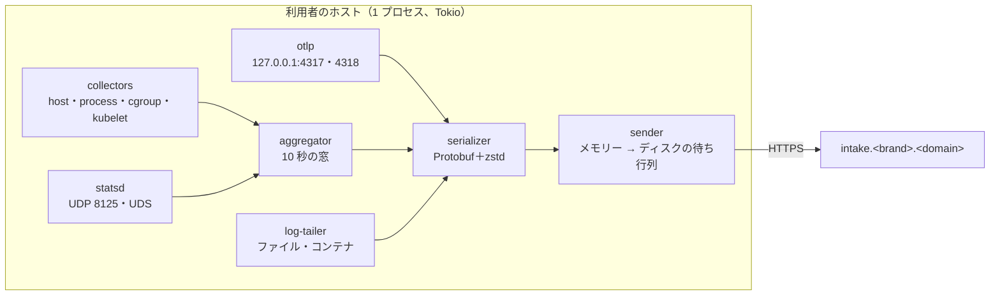
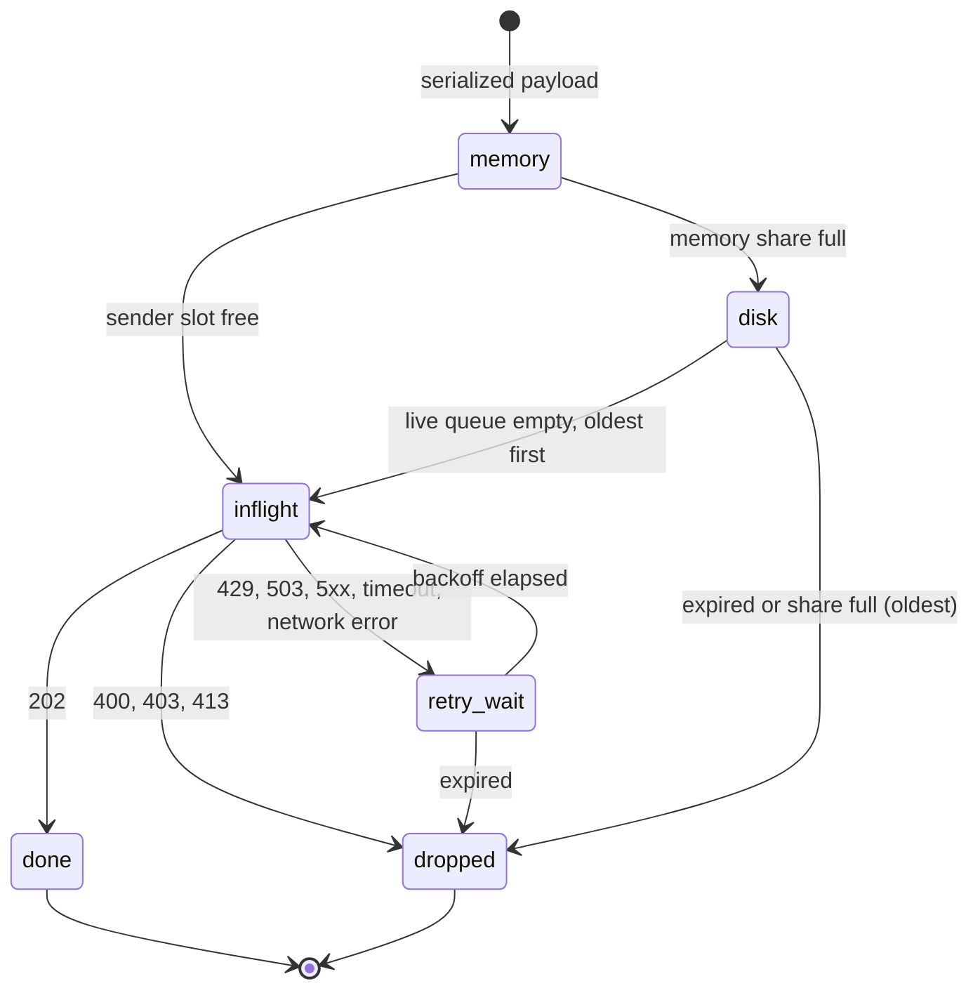
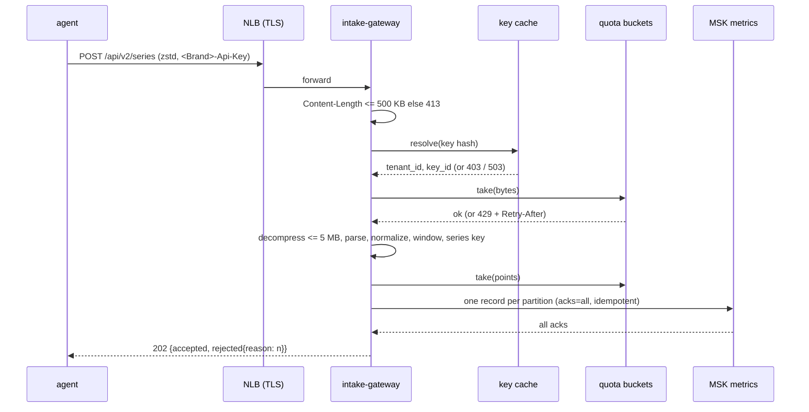

# Intake and agent: Datadog

利用者のホストで動くエージェント（`<brand>-agent`）と、取り込みの入口（`intake-gateway`）を決める。エージェントの収集・StatsD の受け口・送信の待ち行列・送り直し、ゲートウェイの処理の順序・正規化・受け付けの窓・MSK への書き込みと 202・背圧、テナントの割り当ての調整、取り込みの水位の刻みを扱う。

前提となる決定は次のとおり。

- データの面とエージェントは Rust（[ADR-0001](../decisions/0001-platform-and-stack.md)）
- MSK の確定の後に 202、トピックとテナントのパーティションの組（[ADR-0002](../decisions/0002-intake-log-on-msk.md)）
- `tenant_id` を鍵の先頭に、割り当てとシャッフルシャーディング（[ADR-0003](../decisions/0003-tenancy-cells-and-isolation.md)）
- 系列の鍵、受け付けの窓（過去 60 分・未来 10 分）、ゲートウェイが付ける取り込みの時刻（[ADR-0004](../decisions/0004-tsdb-storage-engine.md)）
- タグの数と長さの上限（[ADR-0006](../decisions/0006-cardinality-policy.md)）
- 評価が待つ取り込みの水位（[ADR-0008](../decisions/0008-monitor-evaluation-model.md)）

この文書で決めたことは次の ADR にある。

| ADR | 決定 |
| --- | --- |
| [0010](../decisions/0010-agent-disk-queue-and-retry.md) | エージェントの送信は、信号ごとのメモリーの待ち行列（合計 32 MiB）からディスクの待ち行列（合計 2 GiB、信号ごとの持ち分）へ溢れさせる。送り直しは指数の待ち（1 秒から 120 秒、全体のゆらぎ）と `Retry-After` の大きいほう。新しいデータを先に送り、受け付けの窓を過ぎるデータは送らずに数えて捨てる。並行の数は 429・503 で半分にし、成功で 1 ずつ戻す |
| [0011](../decisions/0011-intake-gateway-pipeline-and-watermark-ticks.md) | ゲートウェイは、本文の大きさ → キー → 割り当て（バイト）→ 展開 → 解析と正規化 → 窓 → 割り当て（点）→ パーティションごとに 1 レコード → `acks=all` の確定 → 202 の順で処理する。拒んだ点は理由ごとの数を 202 の本文で返す。確定の一部の失敗は 503 にし、送り直しはメトリクスでは同じ時刻の後勝ちで冪等になる。ゲートウェイは自分の書いていないパーティションへ 1 秒ごとに水位の刻みを書き、水位はゲートウェイごとの最後の取り込みの時刻の最小で決める |
| [0012](../decisions/0012-intake-quota-coordination.md) | 組織の取り込みの割り当ては、ゲートウェイごとのトークンバケットに、直前 10 秒の需要の割合で配る（Valkey で集計）。Valkey が使えない間は最後の配分を 60 秒保ち、その後は均等に配る。セルの MSK が混んだら、割り当てを超えている組織から先に 429 を返す |

## 1. 範囲

- 扱う：
  - エージェントの部品、収集の間隔、ホストとコンテナのメトリクス、StatsD の受け口と集計、OTLP の受け口（エージェントの中）、ログの追跡の位置の記録
  - エージェントの送信、待ち行列、送り直し、背圧、資源の予算、配布と更新
  - `intake-gateway` の処理の順序、本文の上限、正規化、受け付けの窓、応答の形、MSK のレコードの形、水位の刻み
  - テナントの割り当ての配り方、セルの混雑のときの優先
- 扱わない：
  - OTLP の資源の属性とタグの対応、キーの形式と確かめ方（[otlp-and-api-keys.md](otlp-and-api-keys.md)）
  - 指標の種類と名前の規則、系列の鍵の中身（[metrics-model-and-cardinality.md](metrics-model-and-cardinality.md)）
  - ログのパイプライン、PII のマスク（logs-pipeline.md）。この文書はエージェントがログを読んで送るところまで
  - スパンの扱いとサンプリング（traces-and-sampling.md）
  - 利用量の数え方（usage-and-billing.md）。この文書はゲートウェイが `usage` に書くところまで
  - MSK のブローカーの構成、NLB、セルの割り当て（infrastructure.md）、必要な台数（capacity.md）
  - パッケージの署名とリリースの段（delivery.md）

## 2. 要件

| 要件 | 目標 | NFR |
| --- | --- | --- |
| 受け付けの応答 | 500 KB までの要求の 202 が p99 300ms。割り当ての超過は 429 を即時に | NFR-001 |
| 確定の前に応えない | MSK の `acks=all`・`min.insync.replicas=2` の確定の前に 202 を返さない | NFR-005、K1 |
| クエリに出るまで | 202 からメトリクス p99 30 秒。そのうちゲートウェイから MSK の確定まで p99 300ms、水位の刻みの遅れ 1 秒 | NFR-002 |
| 取り込みの可用性 | 月間 99.95%（429 を除く） | NFR-006 |
| うるさい隣人 | 割り当ての 10 倍を送る組織がいても、他の組織の 202 の p99 と NFR-002 を保つ | NFR-007、K6 |
| 窓 | 窓の外の点を拒み、理由ごとの数を応答と `<brand>.intake.rejected_points` で見せる | NFR-008 |
| エージェントの負荷 | 1,000 系列・ログ 1 MB/秒のホストで CPU 1 コアの 2% 未満、メモリー 150 MB 以下。送れない間はディスクに 2 GiB まで | NFR-013 |

## 3. 本家の形（確かめたこと）

いずれも 2026-10-09 に確認。

| 項目 | 本家 | 出典 |
| --- | --- | --- |
| StatsD の拡張の形 | `<名前>:<値>\|<型>\|@<率>\|#<タグ>,...`。型は `c`・`g`・`ms`・`h`・`s`・`d`。時刻（`\|T`）とコンテナの ID（`\|c:`）を足せる | [Datagram Format and Shell Usage](https://docs.datadoghq.com/developers/dogstatsd/datagram_shell/) |
| 送れないときのエージェント | メトリクスをメモリーに持ち（上限は設定）、溢れたらディスクに書ける（設定で有効にする）。ディスクの使用率 80% までしか書かない。既定の大きさと送り直しの間隔はこのページにない | [Network Traffic](https://docs.datadoghq.com/agent/configuration/network/) |
| 収集の間隔 | エージェントのチェックは 15 秒 | [Data collection resolution](https://docs.datadoghq.com/developers/guide/data-collection-resolution/) |
| API の本文 | 1 回 500 KB、展開して 5 MB 未満。時刻は未来 10 分・過去 1 時間。超えると 413、絞ると 429 | [Submit metrics](https://docs.datadoghq.com/api/latest/metrics/submit-metrics.md) |
| エージェントの OTLP の受け口 | gRPC 4317、HTTP 4318 | [OTLP Ingestion by the Datadog Agent](https://docs.datadoghq.com/opentelemetry/setup/otlp_ingest_in_the_agent/) |
| エージェントの送り直しの間隔、優先、StatsD の集計の窓 | 公式の資料で確かめられなかった（**未検証**） | — |

本システムの値（待ち行列の大きさ、送り直しの間隔、10 秒の集計の窓）は自前で決めた。本家のエージェントのコードと設定の形式は使わない（[リポジトリ共通の ADR-0007](../../../../docs/decisions/0007-no-reuse-of-original-implementation.md)）。

## 4. エージェント

### 4.1 部品



- 1 つのバイナリ・1 つのプロセス。非同期は Tokio の現在のスレッドの実行系を 2 つ（収集・集計と、送信）に分ける。重い処理（ログの圧縮）は 1 つの作業のスレッドに回す。
- 設定はファイル（YAML）と環境の変数。遠隔の設定の配布は MVP に含めない。
- エージェント自身の指標（`<brand>.agent.*`：待ち行列の大きさ、捨てた数、送り直しの数、時計のずれ）を同じ経路で送る。

### 4.2 収集

| 収集の対象 | 間隔 | 中身 |
| --- | --- | --- |
| ホスト | 15 秒 | CPU（`system.cpu.user` など）、メモリー、ディスク、ネットワーク、負荷。Linux は `/proc`、Windows は PDH |
| コンテナ | 15 秒 | cgroup v2 の CPU・メモリー・I/O。containerd・Docker の API で名前とイメージを引く |
| Kubernetes | 15 秒 | kubelet の `/stats/summary` と Pod の一覧。`kube_namespace`、`kube_deployment` などのタグ |
| ホストの情報 | 30 分 | OS、CPU の数、クラウドのインスタンスの ID。`host` の解決に使う |
| StatsD | 受けるたび | 10 秒の窓で集計（4.3 節） |

- **ホストの名前**：設定の `hostname` → クラウドのメタデータのインスタンスの ID → OS のホスト名、の順で決め、`host` のタグにする。決めた結果と理由をエージェントの起動のログに出す。利用量のホストの数は、この `host` から数える（usage-and-billing.md）。
- 点の時刻は、収集の予定の時刻（最初の時刻 ＋ n × 15 秒、ミリ秒）にする。実際に読んだ時刻のゆらぎを入れない。時刻の差分の差分が 0 になり、圧縮が 1 点 1 ビットに近づく（[tsdb-storage-engine.md](tsdb-storage-engine.md) の 5 節）。
- 最初の時刻は 15 秒の倍数に揃えず、ホストの名前のハッシュで 0〜15 秒にずらす（揃えると全ホストの送信が同じ秒に集まる）。

### 4.3 StatsD の受け口

- 形式は StatsD のタグの拡張の形（3 節）を受ける。互換は振る舞いで、本家のエージェントのコードは使わない。`|T`（時刻）は gauge・count だけ受け、集計せずにそのまま送る。`|c:` はコンテナの ID としてタグの付与に使う。
- 解析の上限：1 つのデータグラム 8 KiB、タグ 100、名前 200 バイト。超えたものは捨てて `<brand>.agent.statsd.invalid{reason}` に数える。
- **集計**：10 秒の窓（エポックから 10 秒の倍数）ごとに、（名前、型、並べたタグ）を鍵に集計する。

| 型 | 窓の中の集計 | 送る形 |
| --- | --- | --- |
| `c` | 値 ÷ 率 の合計 | count（間隔 10 秒） |
| `g` | 最後の値 | gauge |
| `s` | 異なる値の数 | gauge |
| `d`・`h`・`ms` | 値を指数のヒストグラム（スケール 5）に足す。重みは 1 ÷ 率 | 分布（[distributions-and-sketches.md](distributions-and-sketches.md) の 6 節） |

- `h`・`ms` も分布として送る。本家がエージェントの中で `h`・`ms` をどう集計するかは、公式の資料で確かめなかった（**未検証**）。違う振る舞いになりうる。本システムは集計の正しさ（合わせられること）を優先する。[architecture/README.md](README.md) の 1.4 節への行の追加を、統合の工程に頼む（12 節の持ち越し）。
- 窓の鍵の数は 20 万まで（約 40 MiB）。超えた新しい鍵の点は捨てて数える。

### 4.4 ログの追跡

- ファイルの識別は（デバイス、inode）、Windows はファイルの ID。位置（識別、オフセット、最後の行の先頭の 64 バイトのハッシュ）を 5 秒ごとにローカルのファイルに書く。回転（名前の変更、切り詰め）は識別とハッシュで見分ける。
- 複数行は、設定の正規表現（行の始まり）でまとめる。1 件の上限は 1 MiB で、超えた分は切り、`<brand>.truncated:true` の属性を付ける。
- 位置は、送信の待ち行列（4.5 節）に入れた後に進める。ディスクの待ち行列に入れば、エージェントの再起動でも失わない。
- パイプラインと PII のマスクはサーバー側で行う（logs-pipeline.md）。エージェントの側のマスクは MVP に含めない。

### 4.5 送信の待ち行列（ADR-0010）

信号ごとに待ち行列を持つ。メモリーの待ち行列が溢れたら、ディスクの待ち行列（セグメントのファイル）へ移す。

| 信号 | メモリー | ディスクの持ち分 | 1 回の要求 |
| --- | --- | --- | --- |
| メトリクス | 16 MiB | 512 MiB | 圧縮して 500 KB 以下、展開して 5 MB 以下 |
| ログ | 12 MiB | 1,280 MiB | 1,000 件、展開して 5 MB 以下 |
| トレース（OTLP の中継） | 4 MiB | 256 MiB | 展開して 5 MB 以下 |

- ディスクの待ち行列は 16 MiB のセグメントのファイルの列。各レコードは（長さ、CRC32C、信号、最も古い点の時刻、本文）。読み出しで CRC が合わないレコードは捨てて数える。
- ディスクの使用率が 80% を超えたら、ディスクに書かない（メモリーが溢れた分は捨てて数える）。
- **期限**：メトリクスのレコードで、最も古い点が「今 − 55 分」より古いものは送らずに捨て、`<brand>.agent.dropped_payloads{reason:expired}` に数える。ゲートウェイの窓（60 分）で拒まれるものを送らないため。5 分は時計のずれと送信の時間の余裕。ログは「今 − 17 時間 30 分」。
- 持ち分が溢れたら、その信号の最も古いレコードを捨てる（`reason:queue_full`）。



### 4.6 送り直しと背圧（ADR-0010）

- **待ち**：`n` 回目の失敗の後の待ちは `max(Retry-After, random(0, min(120 秒, 1 秒 × 2^n)))`（全体のゆらぎ）。`Retry-After` がなければ後ろの項だけ。
- **要求の ID**：本文ごとに UUIDv7 を作り、`<Brand>-Request-Id` で送る。送り直しでも変えない（5.4 節）。
- **並行**：信号ごとに送信中の要求を最大 4。429・503 を受けたら半分（最小 1）、成功が 30 秒続くたびに 1 足す。
- **順序**：新しいデータ（メモリーの待ち行列）を先に送る。メモリーが空のときだけ、ディスクの古いものから送る。古いデータを送り切るまで新しいデータが遅れると、ダッシュボードとモニターが今の状態を見られないため。
- **応答ごとの扱い**：

| 応答 | エージェントの扱い |
| --- | --- |
| 202 | 終わり。本文の `rejected` を `<brand>.agent.rejected_points{reason}` に足す |
| 400（形式）、413（大きさ） | 送り直さない。捨てて数える（413 は本文を分けられるなら 2 つに分けて送り直す） |
| 403（キー） | 送り直さない。信号ごとの送信を 60 秒止め、エラーを起動のログと状態の画面に出す。データは待ち行列に残す |
| 429（割り当て） | `Retry-After` を守る。並行を半分に |
| 503（MSK の確定ができない、ゲートウェイの混雑） | 同上 |
| 5xx（他）、時間切れ（30 秒）、接続の失敗 | 指数の待ち |

**例：MSK の 3 分の障害**（メトリクス、1,000 系列のホスト）

- 15 秒ごとの要求は約 1,000 点、圧縮して約 6 KB。
- 0 秒：503（`Retry-After: 2`）。待ち 2 秒。並行 4 → 2。
- 以後の失敗の待ちの上限は 4、8、16、32、64、120 秒。ゆらぎで、同じゲートウェイに戻るエージェントの山がならされる。
- 3 分で 12 個の要求（約 72 KB）がメモリーに溜まる。ディスクには行かない。
- 回復の後：新しい要求を先に送り、溜まった 12 個を古い順に送る。全部 55 分より新しいので捨てない。

**例：2 時間の障害**（ログ 1 MB/秒、圧縮で 1/8）

- ログは 1 秒 128 KB。メモリーの 12 MiB は約 96 秒で溢れ、ディスクの 1,280 MiB は約 2 時間 46 分で溢れる。2 時間の障害では捨てない。
- メトリクスは 2 時間で約 2.9 MB で、持ち分の中。ただし回復の時点で 55 分より古いものは捨てる（約 65 分ぶん）。1 時間より古い点の取り込みは MVP の後（intent.md の E18）。

### 4.7 資源の予算

NFR-013 の 150 MB の内訳。リリースごとに負荷の生成器で測る（10 節）。

| 部品 | 上限 |
| --- | --- |
| 送信の待ち行列（メモリー） | 32 MiB |
| StatsD の集計の鍵 | 40 MiB（20 万の鍵） |
| ログの追跡のバッファー | 16 MiB（ファイル 500 まで） |
| OTLP の受け口のバッファー | 16 MiB（超えたら 503 を返す） |
| 実行系・TLS・その他 | 40 MiB |

- CPU：圧縮は zstd の水準 3。ログ 1 MB/秒の圧縮が CPU の 2% の大半を使う見込みで、`agent-core` で測る。
- ディスクの書き込みは 1 秒 1 回にまとめ、`fsync` は 5 秒ごと。電源断で最大 5 秒ぶんを失いうる（ディスクの待ち行列は、ゲートウェイが 202 を返す前のデータで、耐久性の約束の外）。

### 4.8 配布と更新

- パッケージ：deb・rpm（Linux、x86_64・arm64）、msi（Windows）、コンテナのイメージ、Kubernetes の DaemonSet の Helm チャート。署名とリポジトリは delivery.md。
- **自動の更新は MVP に含めない。** 利用者のパッケージの管理（apt、yum、Helm）で更新する。エージェントは自分のバージョンを `<brand>.agent.running{version}` で送り、画面で古いバージョンを示す。
- ゲートウェイは、エージェントのバージョンの下限を持つ。下限より古いバージョンの要求も受ける（データを失わせない）が、応答のヘッダー `<Brand>-Agent-Deprecated: 1` を返し、画面で知らせる。

## 5. 取り込みのゲートウェイ

### 5.1 処理の順序（ADR-0011）



1. **大きさ**：`Content-Length` が 500 KB を超えたら 413。チャンクの転送でも、読みながら 500 KB で切る。
2. **キー**：`<Brand>-Api-Key` を確かめ、`tenant_id` を決める（[otlp-and-api-keys.md](otlp-and-api-keys.md) の 7 節）。`tenant_id` を本文から読まない。
3. **割り当て（バイト）**：本文のバイトで組織のバケットを引く。足りなければ 429。展開と解析の CPU を使う前に断る。
4. **展開**：zstd・gzip・deflate。展開の量を数えながら読み、5 MB を超えたら 413（圧縮の爆弾を防ぐ）。
5. **解析と正規化**：JSON か Protobuf。タグの正規化（5.2 節）、系列の鍵の計算（[metrics-model-and-cardinality.md](metrics-model-and-cardinality.md) の 5 節）。
6. **窓**：取り込みの時刻 `t_in`（このゲートウェイの時計、ミリ秒）に対し、点の時刻 `ts` が `t_in − 60 分 ≤ ts ≤ t_in + 10 分` のものだけを受ける（[ADR-0004](../decisions/0004-tsdb-storage-engine.md)）。境界ちょうどは受ける。
7. **割り当て（点）**：受けた点の数でバケットを引く。足りなければ、要求の全体を 429 にする（一部だけ書かない）。
8. **パーティション**：点を系列ごとに、テナントのパーティションの組から選んだパーティションに分ける（[tsdb-storage-engine.md](tsdb-storage-engine.md) の 3 節）。1 つの要求から、パーティションごとに 1 つのレコードを作る。
9. **書き込み**：冪等のプロデューサー、`acks=all`、`linger.ms=5`、`delivery.timeout.ms=2000`。すべてのレコードの確定を待つ。
10. **応答**：すべて確定したら 202。1 つでも失敗したら 503（`Retry-After: 1〜5 秒` のゆらぎ）。

- **一部の確定の失敗**：書けたパーティションの点は残る。エージェントが要求の全体を送り直すと、同じ点がもう一度入るが、同じ系列・同じ時刻の点は後勝ち（同じ値）なので結果は変わらない（[ADR-0004](../decisions/0004-tsdb-storage-engine.md)）。利用量の数え方も、時間ごとの異なる系列の数なので変わらない。ログとスパンの送り直しの重複の扱いは、レコードに載せる `request_id`（5.4 節）を使って logs-pipeline.md・traces-and-sampling.md が決める。
- **ゲートウェイの混雑**：MSK に未確定で抱えるバイトがゲートウェイあたり 256 MiB を超えたら、新しい要求に 503 を返す。メモリーを守る。

### 5.2 正規化

| 対象 | 規則 | 違反のとき |
| --- | --- | --- |
| 指標の名前 | [metrics-model-and-cardinality.md](metrics-model-and-cardinality.md) の 4 節 | 点を拒む（`invalid_name`） |
| タグの鍵 | 前後の空白を除き、小文字に。`[a-z][a-z0-9_.\-/]*`、200 バイトまで | 点を拒む（`invalid_tag`・`tag_too_long`） |
| タグの値 | 前後の空白を除く。大文字小文字は保つ。制御文字は不可。200 バイトまで | 同上 |
| 値のないタグ（`prod`） | 鍵だけのタグとして持つ | — |
| 重複 | 同じ「鍵:値」を 1 つに | — |
| 並べ方 | 「鍵:値」のバイトの順 | — |
| タグの数 | 100 まで（エージェントのホストのタグを含む） | 点を拒む（`too_many_tags`） |
| `<brand>.` で始まる指標・タグ | 本システムが作るもの。利用者の送るものは拒む | 点を拒む（`reserved_name`） |
| 値 | 64 ビットの浮動小数点。NaN と無限大は gauge で受け、count では拒む | `invalid_value` |

- 切り詰めて受けることはしない（[ADR-0006](../decisions/0006-cardinality-policy.md)）。切り詰めると、別の系列が同じ系列に合わさるため。

### 5.3 応答の形

| 状態 | 本文・ヘッダー | 送り直し |
| --- | --- | --- |
| 202 | `{"accepted": n, "rejected": {"too_old": a, "too_far_future": b, "invalid_tag": c, ...}}` | しない（拒んだ点は直らない） |
| 400 | 形式の誤り（解析できない）。理由のコード | しない |
| 403 | キーがない・無効・失効 | しない |
| 413 | 本文が大きすぎる | 分けて送る |
| 429 | 割り当ての超過。`Retry-After`（秒） | する |
| 503 | MSK の確定の失敗、ゲートウェイの混雑、キーの確認ができない | する |

- 拒んだ点の数は、組織の指標 `<brand>.intake.rejected_points{reason, metric_type}` にも、ゲートウェイが 10 秒ごとにまとめて書く（指標の名前は書かない。タグの値の漏れと系列の増加を避けるため）。利用者は画面の「取り込みの状況」で見る。

### 5.4 MSK のレコード

```
MetricRecord {
  tenant_id: bytes(16)        // 先頭。認証の文脈から
  format_version: u16         // 1
  t_in_ms: i64                // ゲートウェイの時計
  gateway_id: u32
  host_keys: [string]         // このレコードの点のホストの鍵（利用量のホストの数え方。usage-and-billing.md の 4.1 節）
  request_id: bytes(16)       // エージェントの <Brand>-Request-Id（UUIDv7、送り直しでも同じ）。なければゲートウェイが作る
  series: [ SeriesPoints {
      series_key: bytes(16)   // xxh3_128
      metric: string, tags: [string], type: enum, unit: string?
      points: [ (ts_ms: i64, value: f64) ] | hist: [ (ts_ms, ExpHistogram) ]
      start_ts_ms: i64?       // 累積の指標の始まり（OTLP）
  } ]
}
Tick { gateway_id: u32, t_in_ms: i64, draining: bool }
```

- `request_id`：エージェントは要求の本文ごとに UUIDv7 を作り、ヘッダー `<Brand>-Request-Id` で送る。送り直しでも同じ値にする。インジェスターは、溢れの系列の集計で送り直しの重なりを除くのに使う（[metrics-model-and-cardinality.md](metrics-model-and-cardinality.md) の 7.4 節）。ログ・スパンの重複の除去にも使える。
- Kafka のレコードの時刻（CreateTime）に `t_in_ms` を入れる。オフセットを時刻で引くために使う（[tsdb-storage-engine.md](tsdb-storage-engine.md) の 6 節）。
- レコードの本文は zstd で圧縮する。1 レコード 1 MiB まで（超えるパーティションの分は 2 つのレコードに分ける）。
- タグは毎回の点に載せる。インジェスターは新しい系列のときだけ使う。載せる量の費用は `msk-throughput-poc` で測り、重ければ「系列の鍵だけを載せ、新しい系列はインジェスターが問い合わせる」形を別の ADR で検討する。

### 5.5 水位の刻み（ADR-0011）

モニターの評価は、組織のパーティションの「取り込みの時刻 `F` 以前の点は反映済み」を待つ（[ADR-0008](../decisions/0008-monitor-evaluation-model.md)）。ゲートウェイは多数あり、時計もずれるので、パーティションの中のレコードの `t_in` は単調でない。そこで次のように決める。

- 各ゲートウェイは、パーティションごとに、自分の書くレコードの `t_in` を単調にする（同じゲートウェイの中の時計の戻りは、前の値に揃える）。冪等のプロデューサーで、同じゲートウェイから同じパーティションへの順序は保たれる。
- 各ゲートウェイは、直前の 1 秒に書いていないパーティションへ、`Tick` を書く。S1 でゲートウェイ 60・パーティション 1,024 として、最大で 1 秒 6.1 万の小さなレコード（約 3 MB/秒）で、取り込みの量に比べて小さい。
- インジェスターは、パーティションごとに「ゲートウェイ → 最後の `t_in`」を持つ。**水位 `F_p` は、生きているゲートウェイの最後の `t_in` の最小**とする。生きているとは、パーティションで最も大きい `t_in` から 30 秒以内に、そのゲートウェイのレコードがあること。止まったゲートウェイはそれ以上書けないので、外してよい。
- 止める前のゲートウェイは `draining: true` の `Tick` を書き、外れてよいことを示す（30 秒を待たない）。
- インジェスターは `F_p` を `query-frontend` に出し、組織の水位はその組織の組のパーティションの `F_p` の最小にする。

**例**：ゲートウェイ A・B・C がパーティション 17 に書く。最後の `t_in` が A 12:00:05.2、B 12:00:04.9、C 12:00:05.6 なら `F_17 = 12:00:04.9`。B が 12:00:10 に落ち、最も大きい `t_in` が 12:00:35 を超えると B は外れ、`F_17` は A と C の最小に進む。

## 6. テナントの割り当て（ADR-0012）

### 6.1 割り当ての種類

| 割り当て | 単位 | 既定 |
| --- | --- | --- |
| メトリクスの点 | 点/秒 | 契約の量（有効な系列 × 1 系列あたり 1/15 点/秒 × 3 倍） |
| 本文のバイト | バイト/秒（圧縮の後） | 契約の量から |
| ログ | 件/秒、バイト/秒 | 契約の量から（logs-pipeline.md） |
| スパン | 件/秒 | 契約の量から（traces-and-sampling.md） |

- 1 秒の割り当てに加え、10 秒ぶんまでの突発を許す（バケットの深さ = 10 × 1 秒の量）。

### 6.2 ゲートウェイへの配り方

- 各ゲートウェイは、組織ごとのトークンバケットを持つ。10 秒ごとに、直前 10 秒に受けた量（拒んだ量を含む需要）を Valkey に足す（`quota:{cell}:{tenant}:{window}` のハッシュ、ゲートウェイごとの欄）。
- ゲートウェイ `g` の次の 10 秒の量は `Q × d_g ÷ Σd`。ただし最小は `Q ÷ (4 × N)`（`N` は生きているゲートウェイの数）。新しい接続が来たゲートウェイが 0 で断らないため。最小を足した分だけ全体が `Q` を超えうるが、上限は `Q × 1.25`。
- 需要のない組織（直前 10 秒に 0）は、`Q ÷ N` を配る。
- **Valkey が使えない間**：最後の配分を 60 秒保ち、その後は `Q ÷ N` にする。NLB が接続をほぼ均等に配るので、均等の配分でも大きく外れない。Valkey は失ってよい部品で、取り込みを止めない。

**例**：組織の割り当て `Q = 10 万点/秒`、ゲートウェイ 4 つ、需要が 6 万・2 万・1 万・1 万なら、配分は 6 万・2 万・1 万・1 万。組織が障害で 10 倍（100 万点/秒）を送ると、需要の割合は変わらないので配分も同じ。毎秒 90 万点ぶんの要求が 429 になる。`Retry-After` は、その組織のバケットが要求の点の数を満たすまでの秒（最小 1 秒、最大 60 秒）。

### 6.3 セルの混雑

- MSK の書き込みの遅れ（確定の p99）とブローカーの受信のバイトを、ゲートウェイが 1 秒ごとに見る。

| 段 | 条件 | 振る舞い |
| --- | --- | --- |
| 通常 | 確定の p99 < 200ms かつ 受信 < 容量の 70% | 6.2 節のとおり |
| 混雑 1 | 確定の p99 ≥ 200ms か 受信 ≥ 70% | 突発（バケットの深さ）を 1 秒ぶんに縮める。割り当ての 100% を超えた組織は即時に 429 |
| 混雑 2 | 確定の p99 ≥ 1 秒か 受信 ≥ 90% | 割り当ての 80% を超えた組織にも 429。割り当ての中の組織の取り込みは最後まで守る（[ADR-0003](../decisions/0003-tenancy-cells-and-isolation.md)） |

- どの段も、セルの外の値（他のセルの混雑）を見ない。段の切り替えは 10 秒続いたときだけにし、ばたつかせない。

## 7. 失敗と回復

| 事象 | 起きること | 備え |
| --- | --- | --- |
| MSK のブローカーの 1 台の停止 | `min.insync.replicas=2` は保たれる。確定の遅れが増える | 202 は確定の後だけ。混雑の段（6.3 節）で割り当ての超過から断る |
| MSK の書き込みの全面の失敗 | 202 を返せない | 503 と `Retry-After`。エージェントはディスクに溜める（4.5 節） |
| ゲートウェイの停止 | 送信中の要求が切れる | エージェントが送り直す。後勝ちで重複は害がない。水位は 30 秒で止まったゲートウェイを外す |
| ゲートウェイの時計のずれ | 窓の判断がずれる | Amazon Time Sync で合わせ、ずれ 100ms 超で運用のアラート。10 分を超えるずれは、ブロックの書き出しの余裕（[ADR-0004](../decisions/0004-tsdb-storage-engine.md)）を超えるので、ゲートウェイを止める |
| エージェントの時計のずれ | 点が窓の外になる | 拒んだ数を 202 で返す。エージェントは `Date` のヘッダーとの差を `<brand>.agent.clock_offset` で送り、5 分を超えたら状態の画面に警告 |
| Valkey の停止 | 割り当ての集計ができない | 60 秒は最後の配分、その後は均等（6.2 節） |
| キーの確認の先（Aurora）の停止 | 新しいキーを確かめられない | [otlp-and-api-keys.md](otlp-and-api-keys.md) の 7.3 節 |
| エージェントのディスクの満杯 | 待ち行列に書けない | 使用率 80% で書かない。捨てた数を数える |

## 8. 上限

| 対象 | 値 | 超えたとき |
| --- | --- | --- |
| メトリクスの API の本文 | 500 KB（圧縮の後）、展開して 5 MB | 413 |
| OTLP の本文 | [otlp-and-api-keys.md](otlp-and-api-keys.md) の 9 節 | 413・`RESOURCE_EXHAUSTED` |
| 1 つの要求の系列 | 1 万 | 413 |
| 受け付けの窓 | 過去 60 分・未来 10 分 | 点を拒む |
| タグ | 100、鍵・値 200 バイト | 点を拒む |
| ゲートウェイの未確定のバイト | 256 MiB | 503 |
| MSK の確定の待ち | 2 秒 | 503 |
| エージェントの待ち行列 | メモリー 32 MiB、ディスク 2 GiB | 古いものから捨てて数える |
| StatsD のデータグラム | 8 KiB | 捨てて数える |
| StatsD の集計の鍵 | 20 万 | 捨てて数える |

## 9. data-model への項目

| 表・置き場 | 中身 | 主キー・索引 | 節 |
| --- | --- | --- | --- |
| MSK `metrics` | `MetricRecord`、`Tick`。レコードの時刻は `t_in_ms` | パーティションの鍵は 5.1 節の 8 | 5.4、5.5 |
| MSK `usage` | ゲートウェイが 10 秒ごとにまとめた組織・信号ごとのバイトと件数、拒んだ数 | テナント | 5.3 |
| Valkey | `quota:{cell}:{tenant}:{window}`（ゲートウェイごとの需要）、期限 60 秒 | — | 6.2 |
| Valkey | `gw:{cell}:{gateway_id}`（生きているゲートウェイの数を数える）、期限 30 秒 | — | 6.2 |
| `tenant_quotas`（テナントの表） | 信号ごとの割り当て、突発の秒、契約の由来、一時の引き上げの期限と理由 | `(tenant_id, signal)` | 6.1 |
| AppConfig `ops.agent_min_version` | エージェントのバージョンの下限（非推奨の印を返す境目）。Aurora の表にしない | — | 4.8 |
| エージェントのローカル | ディスクの待ち行列（`<data_dir>/queue/<signal>/<seq>.seg`）、ログの位置（`<data_dir>/positions.json`） | — | 4.4、4.5 |


## 10. テスト

決定表：

- **DT-INT-001（応答）**：本文の大きさ（≤500 KB・超）× キー（有効・無効・失効・確認不能）× 割り当て（中・超）× 展開の大きさ × MSK（全部確定・一部失敗・全部失敗）→ 状態の値と本文。
- **DT-INT-002（窓）**：`ts − t_in` が −60 分ちょうど、−60 分 −1ms、+10 分ちょうど、+10 分 +1ms、0。
- **DT-INT-003（エージェントの送り直し）**：5.3 節の応答ごとの扱い、`Retry-After` の有無、期限の切れ。

性質ベーステスト：

- **PROP-INT-001（確定の前に応えない）**：任意の MSK の遅れ・失敗の列で、202 を返した要求の全レコードが確定済みである（障害の注入、quality.md の 2.2.1 節 F）。
- **PROP-INT-002（送り直しで結果が変わらない）**：任意の要求の列を、任意の一部の確定の失敗と送り直しで流しても、インジェスターの読み出しの結果が、1 回だけ書いた場合と一致する。
- **PROP-INT-003（正規化の決定性）**：タグの並べ替え・重複・前後の空白・鍵の大文字を任意に変えても、同じ系列の鍵になる。違う系列が同じ鍵にならない（長さの接頭辞の符号化）。
- **PROP-INT-004（水位）**：任意のゲートウェイの時計のずれ（10 分未満）、停止、送信の順序で、`F_p` より前の `t_in` のレコードがすべて読み終わっている。
- **PROP-INT-005（割り当て）**：任意の需要の配分で、全ゲートウェイの受けた量の 10 秒の和が `Q × 1.25 × 10` 秒ぶんを超えない。割り当ての中の組織は 429 を受けない（混雑 2 を除く）。
- **PROP-INT-006（エージェントの待ち行列）**：任意の障害の長さと量で、捨てた数・送った数・残りの数の和が作った数と一致する。ディスクの持ち分を超えない。

結合・負荷：

- Testcontainers の Kafka：ブローカーを止めて 202 が返らない。`min.insync.replicas` を満たさないときに 503。
- 負荷：S1 のピークの 2 倍で 202 の p99（`msk-throughput-poc`）。うるさい隣人の場面（quality.md の 2.2.1 節 E）。
- エージェント：1,000 系列・ログ 1 MB/秒のホストで CPU とメモリーを、リリースごとに測る（NFR-013）。
- ファジング：JSON・Protobuf・StatsD の解析、展開。

## 11. Story の候補

| Epic | Story | 中身 |
| --- | --- | --- |
| E2 | `msk-throughput-poc` | 5.4 節のレコードの大きさ、`Tick` の量、確定の p99 |
| E2 | `intake-gateway-metrics` | 5.1〜5.4 節（ADR-0011、DT-INT-001・002、PROP-INT-001〜003） |
| E2 | `ingest-watermarks` | 5.5 節（PROP-INT-004）。インジェスターの側は tsdb-storage-engine.md |
| E2 | `tenant-quotas-and-backpressure` | 6 節（ADR-0012、PROP-INT-005） |
| E2 | `agent-core` | 4.1、4.2、4.5〜4.7 節（ADR-0010、DT-INT-003、PROP-INT-006） |
| E2 | `statsd-wire-format` | 4.3 節 |
| E2 | `agent-containers-and-k8s` | 4.2 節 |
| E2 | `agent-log-tailing` | 4.4 節 |
| E2 | `agent-distribution` | 4.8 節 |
| E2 | `load-generator` | 10 節の負荷 |

## 12. 未解決の問い

### 決定

2026-10-09 の既定案。

- **エージェントの待ち行列**：メモリー 32 MiB → ディスク 2 GiB、信号ごとの持ち分、新しいものを先に（ADR-0010）。
- **要求の原子性**：パーティションごとのレコードで書き、一部の失敗は 503。メトリクスは後勝ちで冪等（ADR-0011）。Kafka のトランザクションは使わない。
- **水位**：ゲートウェイの刻みと、ゲートウェイごとの最後の `t_in` の最小（ADR-0011）。
- **割り当て**：需要の割合で配り、Valkey がなければ均等（ADR-0012）。
- **StatsD の `h`・`ms`**：分布として送る。
- **自動の更新**：MVP に含めない。

### 持ち越し

| 問い | いつ・どう決めるか |
| --- | --- |
| タグを毎回載せる費用（MSK の転送と保存） | `msk-throughput-poc`。重ければ「新しい系列だけタグを載せる」形を ADR にする |
| `Tick` の量（S2 でゲートウェイ・パーティションが増えたとき） | S2 の前に capacity.md で見積もる。多ければ刻みの間隔を 2 秒に |
| エージェントの CPU 2% の実測 | `agent-core` |
| エージェントの側の PII のマスク | logs-pipeline.md と法務の L1 の結論の後 |
| StatsD の `h`・`ms` を分布にする本家との違い | [architecture/README.md](README.md) の 1.4 節の「本家との意図した違い」への行の追加を、統合の工程で行う |
| 本家のエージェントの送り直しの間隔と StatsD の集計の窓 | 公式の資料で確かめられなかった（**未検証**）。本システムの値を使う |

## 出典

いずれも 2026-10-09 に確認。

- Datadog Docs, [Datagram Format and Shell Usage](https://docs.datadoghq.com/developers/dogstatsd/datagram_shell/)
- Datadog Docs, [Network Traffic](https://docs.datadoghq.com/agent/configuration/network/)
- Datadog Docs, [Data collection resolution](https://docs.datadoghq.com/developers/guide/data-collection-resolution/)
- Datadog Docs, [Submit metrics (API)](https://docs.datadoghq.com/api/latest/metrics/submit-metrics.md)
- Datadog Docs, [OTLP Ingestion by the Datadog Agent](https://docs.datadoghq.com/opentelemetry/setup/otlp_ingest_in_the_agent/)
