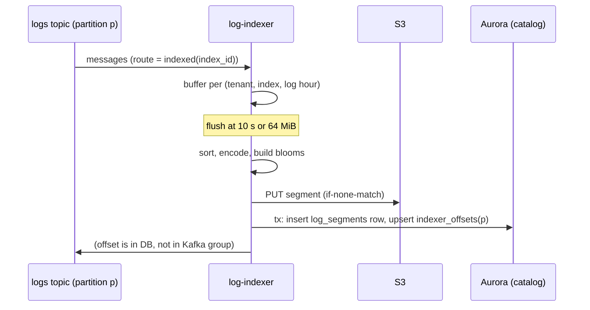
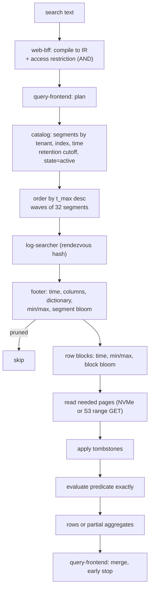
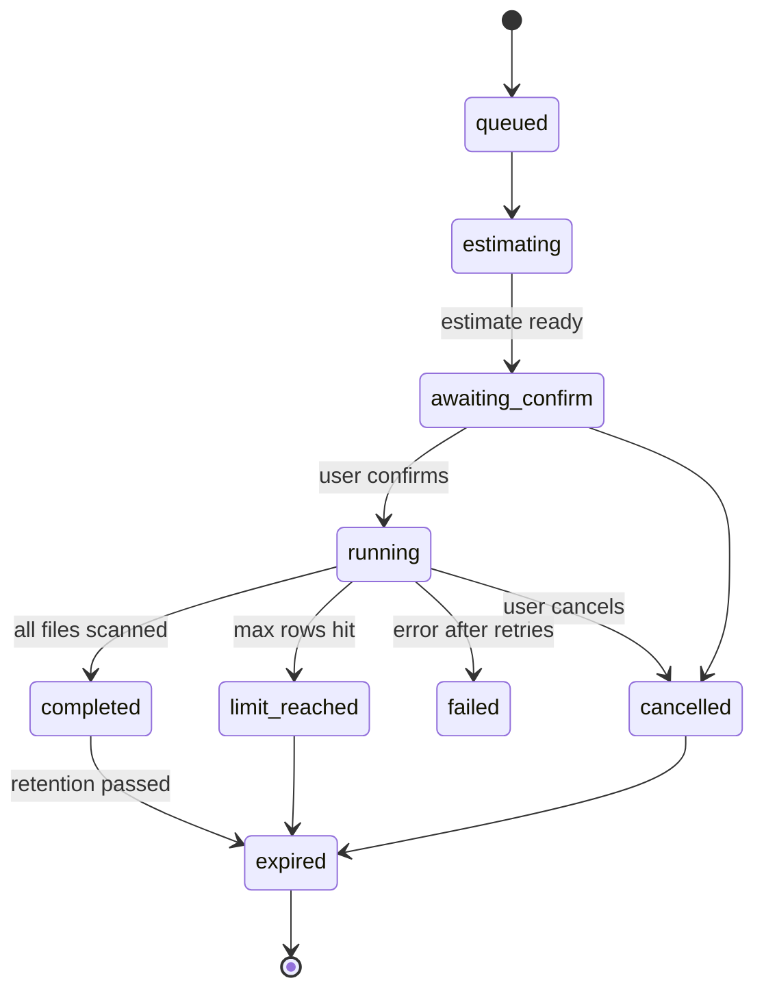
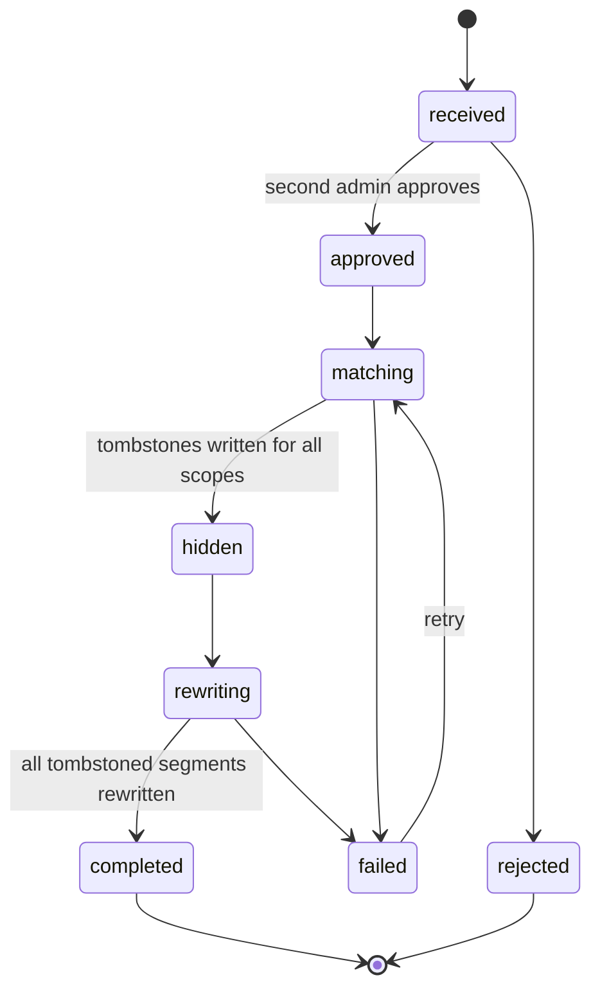

# Log Storage and Search: Datadog

ログの保存と検索を決める。セグメントの形式と NVMe・S3 での置き方、語の分け方とブルームフィルター、カタログ、書き込みと合わせ、検索の実行の計画（時刻での絞り込み、ブルームフィルター、走査）、ファセットと集計、索引とアーカイブの分け方、再水和、保持、不変のファイルの中の個人のデータの削除を扱う。

前提となる決定は次のとおり。

- 転置索引ではなく、列指向のセグメントとブルームフィルター（語と日本語の 2-gram）。セグメントは S3、カタログは Aurora。ブルームフィルターは絞り込みにだけ使い、答えは列を読んで決める。偽陰性を許さない（[ADR-0005](../decisions/0005-log-storage-columnar-with-bloom.md)）
- 消費者は出力とオフセットを同じ記録で確定する（[ADR-0002](../decisions/0002-intake-log-on-msk.md)）
- ブロック・セグメントは 1 つの組織のデータだけを持つ。キャッシュの鍵の先頭に `tenant_id`（[ADR-0003](../decisions/0003-tenancy-cells-and-isolation.md)）
- 検索の文法と IR、データのアクセスの制限、結果のキャッシュの世代、「不完全」の印（[ADR-0007](../decisions/0007-query-language.md)）
- 保持の層と S3 のキーの形。索引 3・7・15・30 日、アーカイブ 1 年、再水和 既定 15 日。カタログで先に消す（[ADR-0009](../decisions/0009-retention-tiers-on-s3.md)）
- 処理の後の `logs` のメッセージ（`log_id`、振り分けの結果）は [logs-pipeline.md](logs-pipeline.md) が決める
- 法務の確認待ち：L3（中身を機械で読む処理）、L5（削除の手段と期限）

この文書で決めたことは次の ADR にある。

| ADR | 決定 |
| --- | --- |
| [0033](../decisions/0033-log-segment-format-and-tokenizer.md) | セグメントの形式 `LSEG` 1 は、8,192 行のページの列、65,536 行の行のブロック、末尾のフッター（列の表、統計、辞書、オフセット）とブルームフィルターの節を持つ。語の分け方 `tokenizer_version` 1 は NFKC と小文字、英数字の語、CJK の 1-gram と 2-gram。3 桁以下の数字だけの語はブルームフィルターに入れず、引く側は絞り込みに使わない |
| [0034](../decisions/0034-log-search-execution-plan.md) | 検索は、カタログ → フッター（時刻・列の有無・辞書・最小最大・ブルームフィルター）→ 行のブロック → 列の順に絞る。セグメントはランデブーハッシュで読み手に割り当て、遅い読み手には 2 つ目へ送る。一覧の検索は時刻の新しい順に波で読み、上位がそろったら打ち切る。読むバイトの予算を超えたら「不完全」で返す |
| [0035](../decisions/0035-log-rehydration-jobs.md) | 再水和は非同期の作業で、アーカイブのファイルを時刻の順に読み、条件に合うログを同じ形式のセグメント（ブルームフィルターつき）にして「履歴の索引」に入れる。1 回 10 億件まで、期間 31 日まで、保持 既定 15 日。始める前に読む量を見積もって見せる。アーカイブのファイルごとに決まった ID のセグメントを書き、やり直しで重ならない |
| [0036](../decisions/0036-personal-data-deletion-tombstones.md) | 個人のデータの削除の請求は、まず対象の行を墓標（セグメントごとの Roaring bitmap）で隠し、その後に合わせの書き直しで物理的に消す。墓標は世代を持ち、読み手は列を評価する前に当てる。期限と、S3 の古いバージョンの扱いは法務の L5 の後に決める |

## 1. 範囲

- 扱う：
  - セグメントの形式、ページと行のブロック、フッター
  - 語の分け方とブルームフィルター
  - `log-indexer` の書き込み、カタログ、合わせ
  - NVMe と S3 での置き方、読み手のキャッシュ
  - 検索の実行の計画、ファセット、集計
  - 索引とアーカイブ、再水和
  - 保持
  - 個人のデータの削除（法務の L5 の枠組み）
- 扱わない：
  - 処理・マスク・振り分け（[logs-pipeline.md](logs-pipeline.md)）
  - 検索の文法の細部と IR のコンパイル（[metrics-query-engine.md](metrics-query-engine.md)。文法の形は [ADR-0007](../decisions/0007-query-language.md)）
  - スパンのセグメントの列とトレース ID での引き（[traces-and-sampling.md](traces-and-sampling.md)。形式はこの文書の `LSEG` を使う）
  - 利用量の数え方（[usage-and-billing.md](usage-and-billing.md)）
  - インスタンスの種類と台数（[infrastructure.md](infrastructure.md)、[capacity.md](capacity.md)）

## 2. 要件

| 要件 | 目標 | NFR |
| --- | --- | --- |
| 検索に出るまで | 202 から検索で見えるまで p95 20 秒・p99 60 秒（処理の段 p99 15 秒を含む） | NFR-002 |
| 検索の速さ | 15 分の検索 p95 1 秒、24 時間 p95 5 秒、ファセットの集計 p95 3 秒 | NFR-003 |
| 取りこぼし | ブルームフィルターと統計で絞った結果が、全走査の結果と一致する（偽陰性 0） | quality.md の 2.2.1 節 H |
| 耐久性 | 202 を返したログを、索引の保持・アーカイブの保持の中で失わない。読み直し・合わせ・保持の途中で落ちても失わず、重ならない | NFR-005 |
| 分離 | 他の組織・データのアクセスの制限の外のログ、ファセットの値、件数が出ない | NFR-007 |
| 保持 | 保持の期間を過ぎたログを検索に出さない（ファイルの削除の前でも） | [ADR-0009](../decisions/0009-retention-tiers-on-s3.md) |
| 削除 | 削除の請求の対象を、まず検索から隠し、次に物理的に消す。期限は法務の L5 | intent の L5 |

## 3. 本家の形（確かめたこと）

- イベントの保存を、オブジェクトストレージの上の列指向の形式で、書き込み・圧縮・読み出しを分けて作った（[Introducing Husky](https://www.datadoghq.com/blog/engineering/introducing-husky/)、2026-10-09 に確認）。本家の形式は公開されておらず、使わない。
- 索引ごとの保持と 1 日の上限、除外のフィルター。アーカイブへはすべてのログが流れる（[Log Indexes](https://docs.datadoghq.com/logs/log_configuration/indexes/)、2026-10-09 に確認）。
- 再水和は、期間とクエリを指定してアーカイブから検索できる形に戻す。1 回 10 億件まで、戻したログの保持は既定 15 日（[Rehydrating from Archives](https://docs.datadoghq.com/logs/log_configuration/rehydrating/)、2026-10-09 に確認）。
- 索引の保持の期間の選択肢の一覧、検索の大文字と小文字の扱い、ファセットの上限、削除の請求の手段は、確かめなかった（**未検証**）。

## 4. セグメント

[ADR-0033](../decisions/0033-log-segment-format-and-tokenizer.md)。

### 4.1 形式 `LSEG` 1

```
+----------------------------------------------------------------+
| header: magic "LSEG", format_version=1, tenant_id, segment_id   |
+----------------------------------------------------------------+
| row block 0 (65,536 rows)                                       |
|   column chunk: timestamp   [page 0..7 of 8,192 rows]          |
|   column chunk: message     [page 0..7, zstd]                  |
|   column chunk: service     [dictionary ids]                    |
|   ...                                                           |
+----------------------------------------------------------------+
| row block 1 ...                                                 |
+----------------------------------------------------------------+
| bloom section: segment bloom, row block blooms                  |
+----------------------------------------------------------------+
| footer: column table, per block stats and offsets,             |
|         dictionaries (low-cardinality columns), bloom offsets  |
+----------------------------------------------------------------+
| footer_len u32 | footer_crc32c u32 | magic "LSEG"              |
+----------------------------------------------------------------+
```

- 行はログの `timestamp` の順（同じ時刻は `log_id` の順）に並べる。
- **ページ**（8,192 行）が圧縮と読み出しの最小の単位。**行のブロック**（65,536 行、8 ページ）がブルームフィルターと統計の単位。
- 決まった列：`timestamp`（i64 ナノ秒、差分とビットの詰め込み）、`log_id`（128 ビット）、`ingest_time`、`host`、`service`、`status`、`source`、`index_id`、`trace_id`・`span_id`、`message`（zstd、レベル 3）。
- 属性の列：属性の道と型（文字列・i64・f64・真偽）の組ごとに 1 列。値の種類が 1 ページに 256 以下なら辞書、それ以外は文字列の並び（zstd）。
- 1 つのセグメントの列は 2,000 まで。超えたら、出現の少ない属性の道から順に `_rest`（道 → 値の JSON の並び）の 1 列にまとめる。組織が宣言したファセット（7 節）の道は、必ず独立の列にする。
- フッター：列の表（道、型、符号化）、行のブロックごとの最小・最大の時刻と行の数、列のページのオフセットと長さ、列の統計（最小・最大・null の数・値の種類の数）、値の種類が 1,000 以下の列の辞書と値ごとの件数、ブルームフィルターの節のオフセット、`tokenizer_version`、各ページの CRC32C。
- 読み出しは、末尾の 64 KiB を 1 回の範囲の GET で読み、フッターが長ければ 2 回目で残りを読む。

### 4.2 語の分け方 `tokenizer_version` 1

作る側（`log-indexer`、再水和）と引く側（読み手）で同じ crate・同じバージョンの関数を使う。セグメントは作ったときのバージョンをフッターに持ち、引く側はそのバージョンで語を作る。

1. NFKC で正規化し、Unicode の単純な大文字・小文字の畳み込みで小文字にする（全角の `ＡＢＣ` は `abc`、半角カナの `ｶﾞ` は `ガ`）。
2. 文字を分類する：英数字と `_` は**語の文字**、漢字・ひらがな・カタカナ（長音 `ー` を含む）・ハングルは **CJK の文字**、それ以外は区切り。
3. 語の文字の連なりを 1 つの語にする。64 バイトを超える語は先頭の 64 バイトにする（引く側も同じに切るので、取りこぼさない）。
4. CJK の文字の連なりから、すべての 1 文字（1-gram）と、隣り合う 2 文字（2-gram）を作る。
5. 組織が「ID の属性」とした属性（`trace_id`、`span_id` と、組織が選ぶ 20 まで）は、値をそのまま（正規化せず）`道=値` の 1 つの語にする。
6. 数字だけの 3 桁以下の語（`200`、`42`）はブルームフィルターに入れない。引く側は、この語を「絞り込みに使えない語」として扱い、他の語で絞る（[ADR-0033](../decisions/0033-log-segment-format-and-tokenizer.md)）。種類が少なく、どのセグメントにもほぼあるため、入れても絞れないうえ大きさを食う。

例：

| 本文 | 語 |
| --- | --- |
| `Connection TIMEOUT after 30s (user-123)` | `connection`、`timeout`、`after`、`30s`、`user`、`123`（`123` は 3 桁の数字だけなので入れない） |
| `決済がタイムアウトしました` | 1-gram：`決`、`済`、`が`、`タ`、`イ`、`ム`、`ア`、`ウ`、`ト`、`し`、`ま`、`た`。2-gram：`決済`、`済が`、`がタ`、`タイ`、`イム`、`ムア`、`アウ`、`ウト`、`トし`、`しま`、`まし`、`した` |

### 4.3 ブルームフィルター

- 分割ブロックの形のブルームフィルター（split block bloom filter）。1 つの語は 256 ビットの 1 つのブロックに入り、そのブロックの中で 8 ビットを立てる。語あたり 10 ビットを目安に、誤検出の率は 1% 前後（[ADR-0005](../decisions/0005-log-storage-columnar-with-bloom.md)）。ハッシュは xxh3_64。
- **セグメントのブルームフィルター**：セグメントのすべての語。
- **行のブロックのブルームフィルター**：行のブロックごとの語。
- 大きさの上限：ブルームフィルターの合計が、圧縮の後のセグメントの 10% を超えるときは、行のブロックのブルームフィルターを省き、セグメントのものだけにする（フッターに省いたことを書く）。
- 大きさの見込み（例）：合わせた後のセグメント 512 MiB（圧縮の前）、200 万行、語の種類 300 万 → セグメントのブルームフィルター 3.75 MB。行のブロック 31 個、それぞれ語の種類 30 万 → 375 KB × 31 = 11.6 MB。圧縮の後のセグメントを 64 MB とすると合計 15.4 MB で 24% になり、上限を超えるので行のブロックのものを省く。実際の比は `log-bloom-poc` で測り、上限と語あたりのビットを決め直す。

## 5. 書き込み

### 5.1 `log-indexer`



- 振り分けの結果が `indexed` のログだけを索引のセグメントにする。バッファーは（組織、索引、ログの時刻の時）ごと。遅れて届いたログ（18 時間まで）は、その時の小さなセグメントになる。
- 確定：S3 の PUT の成功の後に、カタログの行と、パーティションの読んだ位置（`indexer_offsets`）を Aurora の 1 つのトランザクションで書く（[ADR-0005](../decisions/0005-log-storage-columnar-with-bloom.md)）。
- 1 つのパーティションに複数の組織のバッファーがあるので、パーティションの確定の位置は「開いているバッファーの最も古いオフセット」の手前にする。各セグメントは、パーティションごとのオフセットの範囲をカタログに持つ。落ちて読み直したときは、確定の位置から読み、（組織、索引、時）のカタログにある範囲の中のオフセットのログを飛ばす。重ならない。
- セグメントの ID は（パーティション、最初のオフセット、組織、索引、時）のハッシュで決める。読み直しで同じセグメントを作り直したときは、同じキーへの PUT が `If-None-Match` で失敗し、カタログの行の有無で続きを決める。
- バッファーのメモリーは組織ごとに割り当てる（インデクサーのタスクのメモリーの 5%、最小 64 MiB）。超えたら 10 秒を待たずに書き出す。

### 5.2 カタログ

- `log_segments`：`tenant_id`、`segment_id`、`index_id`、`class`（`idx-7d` など）、`t_min`・`t_max`、`hour`、`s3_key`、`bytes`、`rows`、`format_version`、`tokenizer_version`、`state`（`active`・`superseded`・`deleting`・`deleted`）、`tombstone_gen`、`offset_ranges`、`created_at`、`superseded_at`。月ごとに分ける。FORCE RLS。
- 検索の計画は `(tenant_id, index_id, t_max)` の索引で、`t_max ≥ from` かつ `t_min < to` かつ `state = active` の行を引く。
- 行の数の見込み（S1）：小さなセグメント（10 秒）は合わせで 2 時間以内に置き換わるので、同時にあるのは 組織 1,000 × 索引 2 × 360/時 × 2 時間 ＝ 約 144 万行。合わせた後は 1 日あたり、大きな組織の 512 MiB のセグメントと、小さな組織の時ごとのセグメントで 5 万行ほど。30 日で 150 万行。

### 5.3 合わせ

- `compactor` が、（組織、索引、時）ごとに、時の終わりから 20 分たった後と、遅れたログで小さなセグメントが 8 個以上たまったときに合わせる。目標は 1 つ 512 MiB（圧縮の前）。
- 合わせは新しいセグメントを書き、カタログの 1 つのトランザクションで新しい行を `active`、古い行を `superseded` にする。古いオブジェクトは 1 時間後に消す（走っている検索のため）。
- 墓標のある行は、合わせで落とす（10 節）。合わせの前後で、落とした行を除いた行の数と `log_id` の集まりのハッシュが一致することを確かめてから置き換える。

### 5.4 置き方（NVMe と S3）

| 置き場 | 中身 | 大きさの目安 |
| --- | --- | --- |
| S3 Standard | 索引のセグメント、再水和のセグメント、墓標 | 索引 10 TB/日（圧縮の前）× 保持 |
| S3 Glacier Instant Retrieval | アーカイブ | 50 TB/日（圧縮の前）× 1 年 |
| 読み手の NVMe | フッター、ブルームフィルターの節、直近 24 時間のページ（[ADR-0009](../decisions/0009-retention-tiers-on-s3.md)） | 読み手 1 台あたり NVMe の 80% |
| 読み手のメモリー | フッターの解いた形（LRU） | 1 台あたり 8 GiB |

- S3 のキー：`<cell>/<tenant_id>/logs/<class>/<yyyy>/<mm>/<dd>/<hh>/<segment_id>.lseg`（[ADR-0009](../decisions/0009-retention-tiers-on-s3.md)）。墓標は同じキーに `.tomb-<gen>` を足す。
- NVMe のキャッシュの鍵は `tenant_id` と `segment_id` とページの番号。セグメントは不変なので無効化しない。`superseded`・`deleted` の通知（カタログの変更の outbox）で捨てる。最長 24 時間で捨てる。

## 6. 検索の実行

[ADR-0034](../decisions/0034-log-search-execution-plan.md)。

### 6.1 流れ



### 6.2 絞り込みの規則

| 条件の形 | セグメント・行のブロックで使う絞り込み | 列での判定 |
| --- | --- | --- |
| 語（`timeout`） | 語のブルームフィルター | 本文と文字列の属性の語の一致（大文字と小文字を区別しない） |
| 句（`"connection timeout"`） | 句のすべての語がブルームフィルターにある | 正規化した本文での連続の一致 |
| 日本語（`タイムアウト`） | すべての 2-gram（1 文字なら 1-gram）がブルームフィルターにある | 正規化した本文での部分一致 |
| 属性の値（`service:web`） | フッターの辞書に値がある。辞書がない列は最小・最大 | 列の値の一致（大文字と小文字を区別する） |
| ID の属性（`trace_id:4bf9...`） | `道=値` の語のブルームフィルター | 列の値の一致 |
| 範囲（`@http.status_code:>=500`） | 列と行のブロックの最小・最大 | 列の値 |
| 前方の一致（`time*`）・否定（`-env:staging`） | 絞らない（属性の値の前方の一致は辞書で確かめる） | 列の値 |
| `AND`・`OR` | `AND` はどれかで除けば除く。`OR` はすべてで除けたときだけ除く | — |
| 属性の列がない | その属性への肯定の条件は、そのセグメントで当たらない | — |

- ブルームフィルターに入れない語（3 桁以下の数字だけ）は、絞り込みでは「ある」とみなす。
- データのアクセスの制限は IR の AND の節なので、同じ規則で絞り、列で判定する。

### 6.3 割り当てと遅い読み手

- 読み手は `log-searcher`（ログとトレースのセグメントを読む。台数と NVMe は [infrastructure.md](infrastructure.md)・[capacity.md](capacity.md)）。
- セグメントは、`segment_id` のランデブーハッシュで読み手の上位 2 台を決め、1 台目に送る。同じセグメントは同じ読み手に行くので、NVMe のキャッシュが効く。
- 1 台目が、そのクエリの直近の応答の p95 の 2 倍（最小 200 ms）で答えなければ、2 台目にも送り、早い方を使う。
- 読み手は、組織ごとの重み付きの公平なキューで仕事を取る（[ADR-0003](../decisions/0003-tenancy-cells-and-isolation.md)）。

### 6.4 一覧の検索の打ち切り

- 一覧（新しい順の N 件、既定 50）では、セグメントを `t_max` の新しい順に 32 個ずつの波で読む。読み手は、各セグメントの中の上位 N 件だけを返す。
- 合わせる側は上位 N 件の山を持ち、山が N 件で埋まり、次の波のすべてのセグメントの `t_max` が山の最も古い時刻より古ければ打ち切る。
- 続きは、最後の行の（`timestamp`、`log_id`）を署名した不透明なカーソル（15 分）で取る。

### 6.5 予算と「不完全」

| 予算 | 既定 | 超えたとき |
| --- | --- | --- |
| 1 回の検索で読むページのバイト（絞った後） | 20 GB | 読んだ範囲で返し、「不完全」の印と、読んだ時間の範囲を付ける |
| 時間 | 対話 30 秒、API 60 秒 | 同上 |
| 組織ごとの同時の検索 | 契約から（既定 20） | 公平なキューで待つ。待ちが 10 秒を超えたら 429 |

- 「不完全」の結果は黙って返さない（[ADR-0007](../decisions/0007-query-language.md)）。モニターは印を見て扱いを変える（[monitors-and-alerting.md](monitors-and-alerting.md) の 5 節）。

### 6.6 例

組織の索引 `main` に 1 日 50 GB（圧縮の前）、検索は `service:checkout "timeout"`、直近 15 分。

1. カタログ：15 分 ≈ 520 MB（圧縮の前）。直近なので、合わせる前の 10 秒のセグメント。インデクサーのタスク 4 つがそれぞれ 10 秒ごとに書くので、15 分で約 360 個。
2. フッター（NVMe にある）：`service` の辞書に `checkout` があるのは 25%（90 個）。そのうちブルームフィルターに `timeout` があるのは 8 個（誤検出を含む）。
3. 8 個のセグメントの `service`・`message`・`timestamp` のページを読む：1 個あたり 1.4 MB の 3 列のうち該当の行のブロックで 約 300 KB、計 2.4 MB。NVMe で数 ms、S3 の範囲の GET でも並行で 100 ms 前後。
4. 一致した 37 行を返す。全体で p95 1 秒（NFR-003）に収まる見込み。値は `log-bloom-poc` で確かめる。

## 7. ファセットと集計

- **ファセット**：属性の道を、画面の絞り込みの候補として宣言したもの。組織あたり 1,000 まで。宣言したファセットの道は必ず独立の列（4.1 節）。予約属性（`service`、`status`、`host`、`source`）は既定のファセット。
- **値の候補**（ファセットの上位の値と件数）：
  - 条件が時刻と索引だけのとき：フッターの辞書の値ごとの件数を足すだけで求める（行を読まない）。墓標のあるセグメントは、この近道を使わずに列を読む。
  - それ以外：条件の列とファセットの列を読んで数える。
  - 上位 100 を返す。読み手ごとに上位 1,000 を返して合わせる。値の種類が多いときは、件数が近似になりうるので「約」と付ける。
- **集計**：`count`、`cardinality`（HyperLogLog、精度 14。標準の誤差 約 0.8%）、`sum`・`avg`・`min`・`max`、`pNN`（指数のヒストグラム、スケール 5。[distributions-and-sketches.md](distributions-and-sketches.md)）を、グループ（属性 4 段まで、各段の上位 1,000 まで）と時間の区間ごとに求める。読み手が途中の値を作り、合わせる側は合わせるだけにする（[ADR-0007](../decisions/0007-query-language.md)）。
- **漏れ**：値の候補・件数・集計は、制限を足した IR で求める（[quality.md](../quality.md) の 2.2.1 節 G のログの行）。

## 8. 索引とアーカイブ

### 8.1 アーカイブ

- アーカイブの書き手（`log-indexer` と同じバイナリの別の役割）が `logs` のトピックのすべてのログ（振り分けの結果に依らない）を読み、（組織、ログの時刻の時）ごとに、1 時間か 1 GiB（圧縮の前）で 1 つのファイルにする。
- 形式は `LSEG` 1 と同じで、ブルームフィルターを持たない（フッターに `bloom: none`）。辞書と統計は持つ（再水和の絞り込みに使う）。zstd のレベルを 9 にする。
- 置き場は Glacier Instant Retrieval、区分 `archive-1y`（[ADR-0009](../decisions/0009-retention-tiers-on-s3.md)）。カタログは `log_archive_files`。確定の決まりは 5.1 節と同じ。
- 小さな組織の 1 時間のファイルは 128 KB の最小の課金を下回りうる。日ごとに合わせることはしない（Glacier Instant Retrieval の最小の保存の期間 90 日の前の削除の料金がかかるため）。費用は [capacity.md](capacity.md) で見る。

### 8.2 再水和

[ADR-0035](../decisions/0035-log-rehydration-jobs.md)。



- 入力：期間（31 日まで）、検索の条件、件数の上限（既定 1 億、最大 10 億）、履歴の索引の名前、保持（3・7・15・30 日、既定 15 日）。
- 見積もり：`log_archive_files` から期間のファイルを引き、フッターの辞書と統計で条件に当たらないファイルを除き、読むバイトを出す。画面に、読むバイト、見込みの時間、取り出しの料金の目安（単価は [capacity.md](capacity.md)）を出し、利用者が確かめてから走らせる。
- 実行：`rehydrator` の作業者が、ファイルを時刻の順に読み、条件と制限（作った人の役割の制限）と墓標を当て、合うログを 5.1 節と同じ形で、ブルームフィルターつきのセグメントにして、区分 `rehyd-<N>d` に書く。カタログの `index_id` は履歴の索引。セグメントの ID は（作業の ID、アーカイブのファイルの ID）で決めるので、やり直しで重ならない。
- 書けたセグメントから検索に出る（`running` の間も途中まで見える）。件数の上限に当たったら `limit_reached` で止める。
- 同時に動く作業は組織あたり 2 つ。1 つの作業は作業者 16 まで。読む速さは作業者あたり 200 MB/秒（圧縮の後）を目安にする。例：1 日 50 GB（圧縮の前）を 8 分の 1 に圧縮したアーカイブ 7 日分 ＝ 44 GB を、16 の作業者で約 14 秒で読む。書く量は合う件数による。
- 再水和したログは、索引に入れたログとして利用量に数える（[usage-and-billing.md](usage-and-billing.md)）。

## 9. 保持

- 索引のセグメントの保持は、索引ごとに 3・7・15・30 日（[ADR-0009](../decisions/0009-retention-tiers-on-s3.md)）。再水和は 3・7・15・30 日。アーカイブは 1 年。
- 検索の計画は、索引の保持から求めた切り捨ての時刻（今 − 保持）より古い行を、ファイルが残っていても出さない（`t_min` が切り捨てより古いセグメントは、行の時刻で除く）。保持の外のログは、ファイルの削除の遅れに依らず見えない。
- `compactor` は、時の終わり＋保持を過ぎた（組織、索引、時）のセグメントを、カタログで `deleting` にしてから S3 で消し、`deleted` にする。S3 のライフサイクルは後ろの守り（保持＋1 日）。
- 組織が保持を短くしたら、切り捨ての時刻がすぐ変わり、ファイルは次の削除の回で消す。長くしたら、新しいセグメントから新しい区分に書く（既にある区分は長くならない。[ADR-0009](../decisions/0009-retention-tiers-on-s3.md)）。

## 10. 個人のデータの削除

[ADR-0036](../decisions/0036-personal-data-deletion-tombstones.md)。手段の枠組みを決める。期限、対象の範囲、S3 の古いバージョンの扱い、証跡の文言は**法務の確認待ち：L5**。

### 10.1 状態



- 請求は組織の管理者が API か画面で出す：検索の条件（例：`@usr.email:alice@example.com`。マスクの `hash` を使っていれば `[HMAC:...]` の値）、期間、範囲（索引・アーカイブ・再水和・すべて）、理由のコード。権限 `logs.data.delete` が要る。別の管理者の承認を既定で求める（1 人の組織は承認なしにできる設定）。
- 請求の条件の文字列は個人のデータを含むので、請求の行に暗号化して持ち、完了の 30 日後に消す（期間は L5 の後に決める）。

### 10.2 隠す（墓標）

1. `matching`：削除の作業者が、範囲のすべてのセグメント（保持の区分に依らず、`active` のもの）に 6 節の検索を当て、当たった行の番号（セグメントの中の行の順序）を集める。
2. セグメントごとに、墓標のファイル `<segment_key>.tomb-<gen>`（Roaring bitmap。前の世代の行を含む累積）を S3 に書き、カタログの `tombstone_gen` を上げる。
3. 読み手は、フッターの後にカタログの `tombstone_gen` が 0 でなければ墓標を読み（NVMe にキャッシュ）、条件を評価する前に行を除く。ファセットの近道（7 節）は使わない。
4. 組織の結果のキャッシュの世代を上げる（[ADR-0007](../decisions/0007-query-language.md)）。
5. すべての範囲の墓標を書いたら `hidden`。この時点で、検索・ファセット・集計・再水和（アーカイブの墓標を当てる）・エクスポートに出ない。

### 10.3 消す（書き直し）

- `compactor` が、墓標のあるセグメントを優先して書き直す（5.3 節の合わせと同じ）。組織に法的な保全（`legal_hold`、[ADR-0057](../decisions/0057-data-lifecycle-and-deletion-framework.md)）があれば、墓標は付けるが書き直しを止める。新しいセグメントには、墓標の行もその語のブルームフィルターのビットも入らない。古いオブジェクトをカタログで `deleted` にし、S3 で消す。
- アーカイブのファイルも同じく書き直す（Glacier Instant Retrieval の最小の保存の期間の前の削除の料金がかかる）。
- S3 のバージョニングの古いバージョン（7 日、[ADR-0009](../decisions/0009-retention-tiers-on-s3.md)）を、削除の請求で書き直したオブジェクトについては、`versionId` を指定して明示に消す案を用意する。使うかは L5 の後に決める。
- すべて書き直したら `completed`。請求ごとに、範囲ごとの対象の件数・書き直したファイルの数・完了の時刻を、値を含めずに記録して利用者に見せる。

### 10.4 届かないところ（利用者に示す）

| 置き場 | 扱い |
| --- | --- |
| MSK の `logs-raw`・`logs` | 24 時間で消える。削除の対象にしない |
| ライブテール | 流れるだけで残さない |
| 読み手の NVMe | 書き直しで捨てる。最長 24 時間 |
| 大阪の写し（CRR） | 削除は写しにも届く（削除のマーカーと、バージョンの明示の削除は写しの側でも行う。[infrastructure.md](infrastructure.md)） |
| ログから作るメトリクス | 対象にしない（集計の値。タグに個人のデータを入れた系列の削除は [tsdb-storage-engine.md](tsdb-storage-engine.md)） |
| トレース | 同じ仕組みでスパンのセグメントにも当てる（[traces-and-sampling.md](traces-and-sampling.md)） |
| これから取り込むログ | 対象にしない。マスクの規則を足すよう案内する（[logs-pipeline.md](logs-pipeline.md) の 8 節） |

### 10.5 期限の案（法務の確認待ち：L5）

| 段 | 案 |
| --- | --- |
| 受け付けから `hidden` | 72 時間以内 |
| `hidden` から `completed` | 30 日以内 |
| S3 の古いバージョン | 書き直しの後に明示に消す、または 7 日のバージョニングの期限に任せる |

## 11. 上限

| 対象 | 上限（既定） |
| --- | --- |
| 検索の文字列 | 8 KiB |
| 一覧の 1 回の件数 | 1,000（既定 50） |
| エクスポート | 1 回 10 万行（非同期、CSV・JSON） |
| ファセット | 組織 1,000 |
| ID の属性 | 組織 20 |
| 1 つのセグメントの列 | 2,000（超えたら `_rest`） |
| 集計のグループ | 4 段、各段の上位 1,000 |
| 再水和 | 1 回 10 億件・31 日、組織の同時 2 |
| 削除の請求 | 組織の同時 5、1 回の期間は保持の全体まで |

## 12. 障害のときの振る舞い

| 事象 | 起きること | 備え |
| --- | --- | --- |
| `log-indexer` が落ちる | 書き出しが止まる。ログが検索に出るのが遅れる | 確定の位置から読み直し、カタログの範囲で重なりを飛ばす（5.1 節）。遅れはログの水位で見える |
| S3 の PUT の失敗・503 | セグメントが書けない | 指数の待ちで再試行。バッファーのメモリーを超えたら、パーティションの読み出しを止める（MSK に残る） |
| Aurora（カタログ）が落ちる | 書き出しの確定と検索の計画ができない | 書き出しは待つ。検索は 503。カタログの読み出しは reader の別の AZ へ |
| 読み手が落ちる・遅い | 一部のセグメントが読めない | 2 台目へ送る（6.3 節）。どちらも答えなければ「不完全」 |
| フッター・ページの CRC の不一致 | セグメントを読めない | そのセグメントを除いて「不完全」で返し、`segment_corrupt` を Ops に出す。アーカイブから作り直す手順（runbooks） |
| 合わせの途中で落ちる | 新旧が混ざる | カタログの 1 トランザクションで切り替えるので、どちらか一方だけが `active` |
| 墓標の書き込みの途中で落ちる | 一部のセグメントだけ隠れている | 請求は `matching` のまま。やり直しは累積の墓標なので重ねて書いてよい |

## 13. data-model への項目

| 表・置き場 | 中身 | 主キー・索引 | 節 |
| --- | --- | --- | --- |
| `log_segments`（組織の表、月ごとに分ける） | 5.2 節の列 | `(tenant_id, segment_id)`、`(tenant_id, index_id, t_max)` | 5.2 |
| `indexer_offsets` | パーティション、確定の位置、役割（索引・アーカイブ） | `(cell_id, role, topic, partition)`（`maint`。[data-model.md](data-model.md) の D-2） | 5.1 |
| `log_archive_files`（組織の表） | 時、S3 のキー、行の数、バイト、`t_min`・`t_max`、`tombstone_gen`、状態 | `(tenant_id, file_id)`、`(tenant_id, hour)` | 8.1 |
| `log_facets`（組織の表） | 属性の道、型、表示の名前 | `(tenant_id, path)` | 7 |
| `log_id_attributes`（組織の表） | ID の属性の道 | `(tenant_id, path)` | 4.2 |
| `rehydration_jobs`（組織の表） | 期間、条件、上限、履歴の索引、保持、状態、見積もり、進み（最後のファイル）、件数 | `(tenant_id, job_id)` | 8.2 |
| `deletion_requests`（組織の表） | 条件（暗号化）、期間、範囲、状態、承認者、範囲ごとの件数、時刻 | `(tenant_id, request_id)` | 10 |
| `deletion_request_segments` | 請求とセグメント・アーカイブのファイルの対応、墓標の世代、書き直しの済み | `(tenant_id, request_id, segment_id)` | 10.2、10.3 |
| S3 | `<cell>/<tenant_id>/logs/<class>/.../<segment_id>.lseg`、`.tomb-<gen>`、`class` に `rehyd-<N>d` を足す | — | 5.4、8、10 |
| 試験のベクトル | `LSEG` 1 の固定のファイル、`tokenizer_version` 1 の語の固定のベクトル | — | 4 |

## 14. テスト

- **PROP-LSTO-001（取りこぼし 0）**：任意のログの集まり（日本語、絵文字、全角と半角、記号、長い本文、64 バイトを超える語、3 桁以下の数字）と任意の検索（語、句、日本語の部分一致、属性、範囲、否定、`AND`・`OR`）で、絞った結果が全走査の結果と一致する（[ADR-0005](../decisions/0005-log-storage-columnar-with-bloom.md)）。行のブロックのブルームフィルターを省いたセグメントも含める。
- **PROP-LSTO-002（読み直しで重ならない）**：インデクサーを任意の位置（PUT の前後、トランザクションの前後）で止めて読み直しても、カタログの行の `log_id` の集まりが 1 回だけ読んだ場合と一致する。
- **PROP-LSTO-003（合わせで変わらない）**：任意のセグメントの集まりの合わせの前後で、検索・ファセット・集計の結果が同じ（墓標の行を除く）。
- **PROP-LSTO-004（保持の外は見えない）**：任意の時刻と保持の変更の列で、切り捨ての時刻より古い行が結果に出ない。
- **PROP-LSTO-005（削除）**：任意の削除の請求の後、`hidden` の時点で、条件に当たる行が検索・ファセット・集計・再水和・エクスポートに出ない。`completed` の後、S3 のすべてのオブジェクト（現在のもの）に当たる行がない。
- **PROP-LSTO-006（打ち切りで変わらない）**：一覧の検索の打ち切りの結果が、全部を読んで並べた上位 N 件と一致する。
- **試験のベクトル**：`tokenizer_version` 1 の入力と語の組。作る側と引く側で同じ。`LSEG` 1 の固定のファイルを、以後のすべてのバージョンで読める。
- **ファジング**：フッター・ページ・墓標の復号に壊れた入力を与えても、パニックせず誤りを返す。
- **漏れの経路**：検索、ファセットの値の候補、集計、エクスポート、再水和で、制限の外のログが出ない（[quality.md](../quality.md) の 2.2.1 節 G）。
- **負荷**：NFR-003 のログの値（15 分 p95 1 秒、24 時間 p95 5 秒、ファセット p95 3 秒）を `log-bloom-poc` と E13 で満たす。

## 15. Story の候補

| Epic | Story | 中身 |
| --- | --- | --- |
| E5 | `log-bloom-poc` | 4.3 節の大きさ、誤検出の率、日本語の 2-gram の効き、6.6 節の速さ |
| E5 | `log-segments-and-catalog` | 4・5 節（ADR-0033。PROP-LSTO-001〜003、試験のベクトル） |
| E5 | `log-search-and-facets` | 6・7 節（ADR-0034。PROP-LSTO-006、漏れの経路）。中身を読む処理は法務：L3 |
| E5 | `log-archive-and-rehydration` | 8 節（ADR-0035） |
| E5 | `log-retention`（新しい Story の提案） | 9 節（PROP-LSTO-004） |
| E5 | `log-deletion-requests` | 10 節（ADR-0036。PROP-LSTO-005）。手段と期限は法務：L5 |

## 16. 未解決の問い

### 決定

2026-10-09 の既定案。

- **形式**：`LSEG` 1、8,192 行のページ、65,536 行の行のブロック、末尾のフッター（ADR-0033）。
- **語の分け方**：NFKC と小文字、英数字の語、CJK の 1-gram と 2-gram、3 桁以下の数字を入れない（ADR-0033）。
- **大文字と小文字**：本文の語は区別しない、属性の値は区別する。
- **実行**：カタログ → フッター → 行のブロック → 列、ランデブーハッシュ、波での打ち切り、予算と「不完全」（ADR-0034）。
- **アーカイブ**：同じ形式でブルームフィルターなし、1 時間か 1 GiB。
- **再水和**：非同期の作業、見積もりを見せてから（ADR-0035）。
- **削除**：墓標で隠してから書き直す（ADR-0036）。

### 持ち越し

| 問い | いつ・どう決めるか |
| --- | --- |
| 削除の期限、範囲、S3 の古いバージョンの扱い、証跡 | **法務の確認待ち：L5** |
| 検索の中身を機械で読む処理（索引、検索） | **法務の確認待ち：L3** |
| ブルームフィルターの語あたりのビット、10% の上限、行のブロックの大きさ | `log-bloom-poc` |
| 小さな組織のアーカイブのファイルの費用（128 KB の最小の課金） | [capacity.md](capacity.md) で見積もる |
| まれな語の長い期間の検索（7 日で 1 件の ID）の速さ | `log-bloom-poc` で測る。足りなければ ID の属性の時ごとの索引（トレースの ID の索引と同じ形）を足す |
| 本家の保持の選択肢、大文字と小文字の扱い、削除の手段 | 公式の資料で確かめなかった（**未検証**） |
