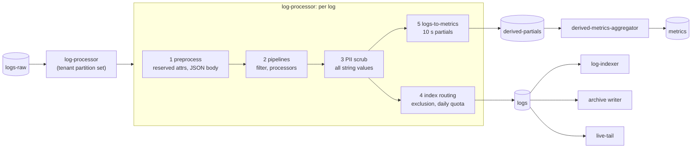
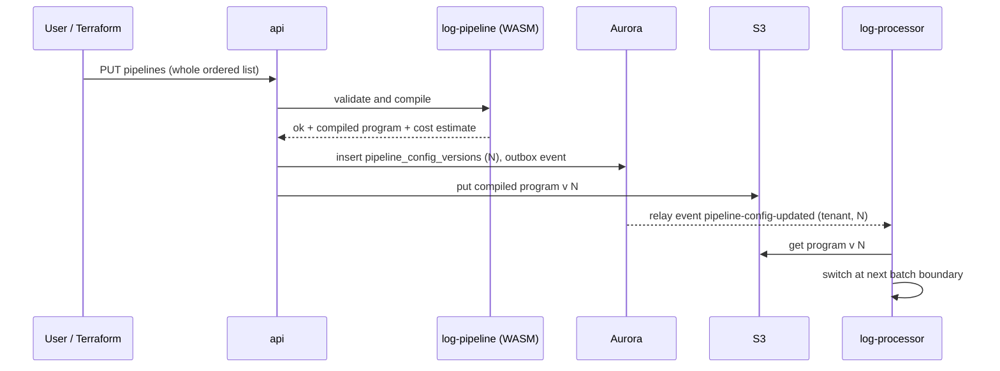
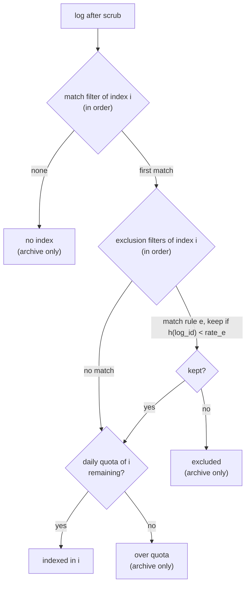
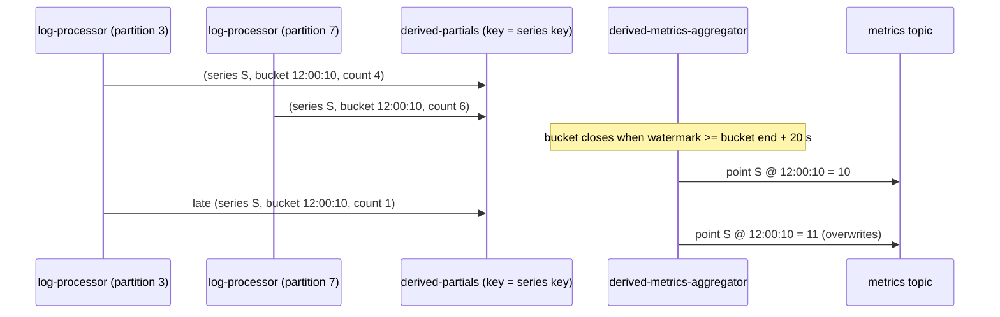

# Logs Pipeline: Datadog

ログの処理の段を決める。`logs-raw` から読み、前処理、パイプラインの規則（JSON の解析、grok の形の解析、付け替え）、PII のマスク、索引の振り分け（除外のフィルター、1 日の上限）、ログから作るメトリクス、ライブテールを経て、`logs` のトピックへ書くまでを扱う。複数行のまとめ（エージェントの側）の規則もここで決める。

前提となる決定は次のとおり。

- MSK の確定の後に 202。`logs-raw` と `logs` の保持は 24 時間。消費者は読み直しで同じ結果になる（[ADR-0002](../decisions/0002-intake-log-on-msk.md)）
- `tenant_id` は認証の文脈からだけ。各段に割り当てと公平なキュー（[ADR-0003](../decisions/0003-tenancy-cells-and-isolation.md)）
- 新しい系列の上限と溢れ（[ADR-0006](../decisions/0006-cardinality-policy.md)）。ログから作るメトリクスもこの上限に従う
- 検索の文法と IR（[ADR-0007](../decisions/0007-query-language.md)）。パイプラインのフィルター、索引のフィルター、ライブテールの条件は、同じ検索の文法で書き、同じ IR にする
- 索引とアーカイブを分ける。除外・上限で索引に入らないログも、アーカイブとログから作るメトリクスへ流れる（[ADR-0005](../decisions/0005-log-storage-columnar-with-bloom.md)）
- 法務の確認待ち：L1（PII のマスクの既定）、L3（中身を機械で読む処理）

この文書で決めたことは次の ADR にある。

| ADR | 決定 |
| --- | --- |
| [0030](../decisions/0030-log-pipeline-execution-model.md) | 組織のパイプラインの設定を、Rust の `log-pipeline` で検証して実行の形にコンパイルし、バージョンを付けて配る。正規表現は線形の時間のものだけにし、1 件あたりの処理の予算を持つ。予算や規則の誤りでは、ログを捨てずに元のまま流す。`logs-raw` から `logs` への処理は、Kafka のトランザクションで 1 回だけにする |
| [0031](../decisions/0031-pii-scrubbing-before-routing.md) | PII のマスクは、パイプラインの後、振り分け・ログから作るメトリクス・ライブテールの前に、すべての文字列の値に当てる。動作は伏せる・一部を残す・組織の鍵での HMAC の 3 つ。終わらない値は全体を伏せる（fail closed）。規則はバージョンを持ち、過去に遡らない。既定の有効化は法務の L1 の後に決める |
| [0032](../decisions/0032-index-routing-and-derived-metrics.md) | 索引の振り分けは最初に当たった索引、除外のサンプリングは `log_id` のハッシュで決める。1 日の上限は Valkey の予算の前借りで数える。ログから作るメトリクスは、振り分けの前のすべてのログから、10 秒の桶の部分の値を `derived-partials` のトピックで系列ごとに集め直し、1 系列を 1 つの書き手で出す。遅れた分は同じ時刻の点を書き直して直す |

## 1. 範囲

- 扱う：
  - 複数行のまとめの規則（エージェントで実行する）
  - 前処理（予約属性、JSON の本文の展開、時刻）
  - パイプラインと処理器（processor）の種類、順序、上限
  - grok の形の解析の文法と、パターンの一覧
  - PII のマスク（検出の種類、動作、規則のバージョン）
  - 索引の振り分け、除外のフィルター、1 日の上限
  - ログから作るメトリクス
  - ライブテール
  - 組織ごとの処理の上限と、うるさい隣人の抑え
- 扱わない：
  - ログの受け口（HTTP の API、OTLP のログ）、受け付けの窓（過去 18 時間）、本文の大きさの上限（[intake-and-agent.md](intake-and-agent.md)、[otlp-and-api-keys.md](otlp-and-api-keys.md)）
  - セグメント、ブルームフィルター、検索、アーカイブ、再水和、削除（[log-storage-and-search.md](log-storage-and-search.md)）
  - スパンの属性のマスク（同じ `pii-scrub` を使う。[traces-and-sampling.md](traces-and-sampling.md)）
  - 利用量の数え方（[usage-and-billing.md](usage-and-billing.md)）
  - マスクの法的な位置づけ（[security.md](security.md)、法務の L1）

## 2. 要件

| 要件 | 目標 | NFR |
| --- | --- | --- |
| 処理の遅れ | `logs-raw` の取り込みの時刻から `logs` への確定まで p99 15 秒（検索に出るまでの p99 60 秒の内訳） | NFR-002 |
| 耐久性 | 202 を返したログを、処理の段で失わない。規則の誤り・予算の超過でも捨てない | NFR-005 |
| 読み直し | 任意の位置で落ちて読み直しても、`logs` の中身（振り分け、マスク、メトリクスの点）が同じ | [ADR-0002](../decisions/0002-intake-log-on-msk.md) |
| 分離 | 1 つの組織の重い規則（遅い正規表現、急増）で、他の組織の処理の遅れが p99 15 秒を超えない | NFR-007 |
| PII | マスクの規則に当たる値が、`logs` のトピック・索引・アーカイブ・ライブテール・ログから作るメトリクスのタグ・本システムのログに、マスクの前の形で出ない | intent の守るべき振る舞い、quality.md の 2.2.1 節 H |
| 遅れたログ | 受け付けの窓（過去 18 時間）の中のログは、時刻どおりに索引に入る。メトリクスの窓（過去 1 時間）の外のログは、ログから作るメトリクスに入れず、数を見せる | NFR-008 |
| エージェントの負荷 | 複数行のまとめで、NFR-013 の CPU 2% 未満・150 MB 以下を超えない | NFR-013 |

## 3. 本家の形（確かめたこと）

- パイプラインは処理器を順に当てる。入れ子は 1 段まで（入れ子のパイプラインは処理器だけを持つ）。1 つのパイプラインの処理器は 20 以下、1 つの grok の処理器の解析の規則は 10 以下を推奨する。遅い規則・処理器・パイプラインは本家が止めることがある（[Log Pipelines](https://docs.datadoghq.com/logs/log_configuration/pipelines/)、2026-10-09 に確認）。
- JSON のログは前処理で予約属性（時刻、本文、状態、サービス、ホスト、`trace_id`・`span_id`）を決める。時刻が 18 時間より古いログは拒む（同上）。
- 索引ごとの除外のフィルター（サンプリングの率つき）、1 日の上限。除外・上限で索引に入らないログも、ライブテール・アーカイブ・ログから作るメトリクスへ流れる（[Log Indexes](https://docs.datadoghq.com/logs/log_configuration/indexes/)、2026-10-09 に確認）。
- 振り分けで「最初に当たった索引に入る」こと、1 日の上限の区切りの時刻の選び方、PII のマスク（本家の Sensitive Data Scanner）の既定の規則と動作の一覧は、この文書の時点で確かめなかった（**未検証**）。本システムの値は下で決める。

## 4. 全体の流れ



- `log-processor` は、組織のパーティションの組（[ADR-0002](../decisions/0002-intake-log-on-msk.md)）を受け持つ。1 つのタスクが複数のパーティションを持ち、パーティションごとに 1 つの処理の流れ（単一スレッド）で順に処理する。
- 1〜4 の結果を 1 つの `logs` のメッセージにする。5 の部分の値は `derived-partials` へ書く。両方の書き込みと `logs-raw` のオフセットの確定を、Kafka のトランザクション（read-process-write）で 1 つにする（[ADR-0030](../decisions/0030-log-pipeline-execution-model.md)）。落ちて読み直しても、`logs` と `derived-partials` には 1 回分だけが見える（消費者は `isolation.level=read_committed` で読む）。
- マスクの前の値は、3 の前までこのプロセスのメモリーの中にだけある。エラーのログ・パニックのメッセージ・トレースに値を出さない（[ADR-0031](../decisions/0031-pii-scrubbing-before-routing.md)）。

## 5. 複数行のまとめ（エージェント）

複数行のログ（例外のスタックトレース）は、ファイルとコンテナのログを追うエージェントで 1 件にまとめる。サーバーの側では、HTTP の API の配列の 1 要素・OTLP の 1 レコードを 1 件として扱い、まとめない。行が分かれて届いた後では、どのホストのどのファイルの続きかを確かに決められないため。実装は [intake-and-agent.md](intake-and-agent.md) で、ここでは規則を決める。

| 項目 | 値 |
| --- | --- |
| 規則 | 追う対象（ファイルのパス、コンテナのラベル）ごとに `multi_line.start_pattern`（新しい 1 件の始まりの正規表現）を設定する |
| 自動の判定（既定で有効） | 始まりの候補：ISO 8601 の時刻（`2026-10-09T12:00:00`）、`YYYY/MM/DD`、`YYYY-MM-DD HH:MM:SS`、syslog の時刻（`Oct  9 12:00:00`）、`[LEVEL]`・`LEVEL:` の形。続きの候補：空白・タブで始まる行、`at `・`Caused by:`・`... N more`・`Traceback (most recent call last):` の後の行。最初の 500 行で、始まりの候補に当たる行が 10% 以上あれば、その形を始まりとして固定する |
| 1 件の上限 | 1,000 行か 256 KiB。超えたら区切って次の件にし、`multiline.truncated:true` を付ける |
| 待ち | 最後の行から 1 秒、続きが来なければ確定する |
| 正規表現 | 線形の時間の正規表現（Rust の `regex` crate の形。後方参照・先読みなし）。長さ 1 KiB まで |

例：

```
2026-10-09T12:00:00.123Z ERROR OrderService failed
java.lang.IllegalStateException: stock < 0
    at com.example.Order.reserve(Order.java:42)
    at com.example.Api.post(Api.java:10)
2026-10-09T12:00:01.002Z INFO OrderService retry
```

自動の判定は、1 行目と 5 行目を始まりにする。1〜4 行目が 1 件（本文は改行を含む 4 行）、5 行目が次の件になる。

## 6. 前処理

[ADR-0030](../decisions/0030-log-pipeline-execution-model.md)。パイプラインの前に、どの組織にも同じ規則で当てる。

1. 本文が JSON のオブジェクトとして読めるとき（先頭の空白の後が `{`、末尾が `}`）、属性に展開する。深さ 10 段まで、属性の道（`a.b.c`）は 256 個まで。超えた部分は `_overflow` という 1 つの文字列の属性に JSON のまま残す。
2. 予約属性を決める。次の順で最初にあった属性を使い、元の属性は残す。

| 予約属性 | 探す属性（順） | 既定 |
| --- | --- | --- |
| `timestamp` | `@timestamp`、`timestamp`、`time`、`ts`、`date`、OTLP の `time_unix_nano` | 取り込みの時刻 |
| `message` | `message`、`msg`、`log`、OTLP の `body` | 本文の全体 |
| `status` | `status`、`severity`、`level`、`log.level`、OTLP の `severity_text` | `info` |
| `service` | `service`、`service.name`、OTLP の資源の `service.name` | なし |
| `host` | 取り込みのタグの `host`、`host`、`hostname`、OTLP の資源の `host.name` | なし |
| `trace_id`・`span_id` | `trace_id`・`span_id`、`otel.trace_id`、OTLP の `trace_id`・`span_id` | なし |

3. 時刻の形は ISO 8601、UNIX の秒・ミリ秒・マイクロ秒・ナノ秒（桁で判定）、RFC 3164。時刻が受け付けの窓（過去 18 時間、未来 10 分）の外なら、ゲートウェイで既に拒んでいる（[intake-and-agent.md](intake-and-agent.md)）。ここでは、本文の中の時刻がゲートウェイの見た時刻と違ったときに、窓の外なら取り込みの時刻に置き換え、`timestamp_adjusted:true` を付ける（ゲートウェイは本文の中の時刻を見ない場合があるため）。
4. `status` を正規の値（`emergency`・`alert`・`critical`・`error`・`warn`・`notice`・`info`・`debug`・`ok`）に揃える。`E`・`ERR`・`3`（syslog の数）などの別名の表を持つ。
5. `log_id` を確かめる。`log_id` はゲートウェイが付けた 128 ビットの ID（取り込みの時刻の 48 ビット＋乱数 80 ビット）で、以後のすべての段の鍵になる（[ADR-0032](../decisions/0032-index-routing-and-derived-metrics.md)）。

## 7. パイプラインと処理器

[ADR-0030](../decisions/0030-log-pipeline-execution-model.md)。

### 7.1 形

- 組織はパイプラインの並びを持つ。各パイプラインは、フィルター（検索の文法。例：`source:nginx`）と、処理器の並びを持つ。ログは並びの順にすべてのパイプラインに当たり、フィルターに合うパイプラインの処理器を順に通る。
- 入れ子は 1 段まで。入れ子のパイプラインは処理器だけを持つ。
- 処理器の失敗（解析が合わない、型が合わない）は、そのログの処理を止めない。次の処理器へ進み、`pipeline.errors` に処理器の ID と理由のコードを足す（値は書かない）。

### 7.2 処理器の種類

| 種類 | 働き | 主な設定 |
| --- | --- | --- |
| `json_parser` | 属性の文字列を JSON として展開する | 元の属性、置く先 |
| `grok_parser` | grok の形の規則で文字列を属性に分ける（7.3 節） | 元の属性、規則（10 まで）、補助の規則 |
| `kv_parser` | `key=value` の並びを分ける | 区切り、引用符 |
| `attribute_remapper` | 属性の名前を付け替え、型を変える | 元、先、型（string・int・double・bool）、元を残すか |
| `date_remapper`・`status_remapper`・`service_remapper`・`message_remapper` | 予約属性を別の属性から決め直す | 元の属性（順） |
| `trace_id_remapper` | `trace_id` を決め直す。16 進の 32 文字か 10 進の 64 ビットを 128 ビットに揃える | 元の属性 |
| `category` | 検索の条件ごとに値を付ける（例：`@http.status_code:[500 TO 599]` → `@http.status_category:server_error`） | 条件と値の組（50 まで） |
| `arithmetic` | 数の属性の四則の式 | 式、先 |
| `string_builder` | 属性を埋め込んだ文字列を作る | 雛形、先 |
| `url_parser` | URL を道・問い合わせ・ホストに分ける | 元、先 |
| `user_agent_parser` | User-Agent を端末・OS・ブラウザーに分ける | 元、先 |
| `lookup` | 表で値を引く（例：`env_id` → `team`）。表は組織ごとに 1 万行まで | 元、表、先 |

### 7.3 grok の形の規則

grok は Logstash で広く使われる名前付きのパターンの書き方で、本家の固有のものではない。パターンの一覧と照合のエンジンは自前で作る（[リポジトリ共通の ADR-0007](../../../../docs/decisions/0007-no-reuse-of-original-implementation.md)）。

```
<規則の名前> <パターン>
パターン := 文字 | %{<マッチャー>:<属性>[:<型や変換>]}
```

- マッチャー：`word`、`notSpace`、`data`（最短）、`greedyData`、`integer`、`number`、`ipv4`、`ipv6`、`ip`、`hostname`、`uuid`、`quotedString`、`isoTimestamp`、`httpDate`、`date("<形>")`、`regex("<正規表現>")`、`keyvalue("<区切り>")`。
- 変換：`integer`、`number`、`boolean`、`nullIf("-")`、`lowercase`、`json`、`keyvalue`。
- コンパイル：規則を 1 つの線形の時間の正規表現（名前付きの捕捉）に変換し、規則を書いた順に試して最初に合ったものを使う。後方参照・先読み・後読みは書けない。
- 補助の規則：`%{_clientip}` のように、同じ処理器の中で名前を付けた部分のパターンを使い回す。再帰はできない（コンパイルで止める）。

例（nginx のアクセスのログ）：

```
access %{ip:network.client.ip} - %{notSpace:usr.id:nullIf("-")} \[%{httpDate:date}\] "%{word:http.method} %{notSpace:http.url} HTTP/%{number:http.version}" %{integer:http.status_code} %{integer:network.bytes_written} "%{data:http.referer}" "%{data:http.useragent}"
```

入力：

```
203.0.113.7 - alice@example.com [09/Oct/2026:12:00:00 +0900] "GET /api/orders?id=42 HTTP/1.1" 504 120 "-" "curl/8.5"
```

出力の属性：`network.client.ip=203.0.113.7`、`usr.id=alice@example.com`、`date=2026-10-09T03:00:00Z`、`http.method=GET`、`http.url=/api/orders?id=42`、`http.status_code=504`（整数）、`network.bytes_written=120`、`http.referer=-`、`http.useragent=curl/8.5`。この後、8 節のマスクで `usr.id` と `network.client.ip` が規則に当たれば置き換わる。

### 7.4 設定のバージョンと配布



- 組織のパイプライン・処理器・マスクの規則・索引の規則・ログから作るメトリクスの定義を 1 つの設定の束にし、変更のたびにバージョン `N` を上げる。束をまとめて検証し、コンパイルの結果（実行の形）を S3 に置く。
- `log-processor` は、イベントを受けてから次のバッチの区切りで新しいバージョンに切り替える。届かないときのため 60 秒ごとに最新のバージョンを確かめる。切り替えまで p99 60 秒。
- 出力の各ログに `pipeline_config_version` を書く。読み直しのときは、そのバッチの最初に使ったバージョンを `logs-raw` のオフセットの範囲と一緒にトランザクションの記録（`processor_batches`）に残し、同じバージョンで処理し直す。読み直しで結果を変えないため。
- 検証は、`api`（TypeScript）から Rust の `log-pipeline` を WASM で呼ぶ。画面の「試す」も同じ WASM で、貼ったサンプルのログに当てた結果を見せる。サンプルは保存しない。

### 7.5 予算

- 1 件あたりの処理の予算は、処理器の手順の数で数える（正規表現の照合は入力のバイト数を手順に数える）。既定 200 万手順（およそ 2 ms）。超えたら、そのログの残りの処理器を飛ばし、`pipeline.errors` に `budget_exceeded` を足す。8 節のマスクは飛ばさない。
- 組織ごとに、直近 5 分の 1 件あたりの平均の手順を数える。平均が 50 万手順を超えたら、組織の管理者に知らせ、設定の画面に重い処理器を示す。
- 線形の時間の正規表現だけなので、1 件の最悪の時間は本文の大きさ（1 MB まで）に比例する。破局的なバックトラックは起きない。

## 8. PII のマスク

[ADR-0031](../decisions/0031-pii-scrubbing-before-routing.md)。

### 8.1 検出の種類

| 種類 | 検出 | 誤検出を減らす確かめ |
| --- | --- | --- |
| `email` | RFC 5322 の簡略の形（`local@domain.tld`） | TLD が 2 文字以上 |
| `phone_jp` | `0[0-9]{1,4}-?[0-9]{1,4}-?[0-9]{3,4}`（10・11 桁）、`+81` で始まる形 | 桁の数。携帯（070・080・090）と固定 |
| `credit_card` | 13〜19 桁（空白・ハイフンを許す） | Luhn のチェック、発行者の番号の範囲 |
| `my_number` | 12 桁 | チェックディジット（行政の定める計算） |
| `ipv4`・`ipv6` | アドレスの形 | 範囲の確かめ。`127.0.0.1` などの予約のアドレスを除く設定を持つ |
| `jwt` | `eyJ` で始まる 3 つの base64url の部分 | 1 つ目の部分が JSON として読める |
| `secret_key` | 本システムのキー（`<brand>_ik_`、`<brand>_ak_`）、クラウドの鍵の形（`AKIA` で始まる 20 文字など）、`Bearer ` の後の値 | 長さと文字の種類 |
| `custom` | 組織が書く正規表現（線形の時間）。属性の道で絞れる | — |

- 対象は、本文と、すべての文字列の属性の値（パイプラインで作ったものを含む）。属性の鍵（名前）は対象にしない。数の属性は、組織が属性の道を指定したときだけ文字列として調べる。
- 同じ値に複数の種類が当たるときは、長い一致を先にし、同じ長さなら上の表の順にする。

### 8.2 動作

| 動作 | 結果の例（`alice@example.com`） | 使いどころ |
| --- | --- | --- |
| `redact` | `[REDACTED:email]` | 既定の動作 |
| `partial` | `a****@example.com`（種類ごとに残す部分を決める。カードは末尾 4 桁） | 調査で形を見たいとき |
| `hash` | `[HMAC:email:9f2c4a1b7e3d5f60]`（組織ごとの鍵の HMAC-SHA256 の先頭 64 ビット） | 同じ値の出現を、値を知らずに数えたいとき |

- `hash` の鍵は組織ごとに KMS で守る（[security.md](security.md)）。鍵を変えると、同じ値でも違う結果になる。鍵の変更の前後で突き合わせられないことを画面に示す。
- マスクした値は戻せない。元の値は `logs-raw`（24 時間）にだけ残る（[ADR-0002](../decisions/0002-intake-log-on-msk.md)）。

### 8.3 失敗のときは伏せる

- マスクにも 1 件あたりの予算（既定 100 万手順）を持つ。予算を超えた・検出器が誤りを返したときは、その値の全体を `[REDACTED:scrub_error]` にする（fail closed）。本文なら本文の全体を伏せる。
- 予算の超過の数は組織ごとに数え、画面に出す。

### 8.4 規則のバージョンと遡らないこと

- マスクの規則は 7.4 節の設定の束に入り、同じバージョンで配る。各ログに `scrub_rules_version` を書く。
- 規則を足しても、既に索引・アーカイブにあるログには当てない。画面の規則の編集で「この変更は、これから取り込むログにだけ効く」と示す。過去のログから消すには、削除の請求を使う（[log-storage-and-search.md](log-storage-and-search.md) の 10 節）。

### 8.5 既定（法務の確認待ち）

- どの種類を、どの組織で、既定で有効にするかは決めない（**法務の確認待ち：L1**）。設計は次の 3 つの案のどれでも動くようにする。組織ごとの設定 `scrub_default_profile` に持つ。
  - A：全種類を既定で有効（`redact`）
  - B：`secret_key` と `credit_card` と `my_number` だけを既定で有効
  - C：既定では無効。組織が選ぶ
- `secret_key` の検出は、本システムのキーの漏れを防ぐ目的もあるため、案に依らず本システムのキーの形（`<brand>_ik_`、`<brand>_ak_`）だけは常に伏せることを提案する（**法務の確認待ち：L1**。security の領域と合わせる）。

## 9. 索引の振り分け

[ADR-0032](../decisions/0032-index-routing-and-derived-metrics.md)。

### 9.1 決め方



- 組織の索引は並びを持つ。ログは、フィルターに合う最初の索引に入る（1 件は高々 1 つの索引）。どの索引にも合わなければ、索引に入れない。
- 除外のフィルターは、索引ごとに並びを持ち、最初に合ったものの率を使う。率 `r`（0〜100%）は「索引に残す割合」とする。
- **サンプリングは決定的にする。** `h = xxh3_64(tenant_id ‖ index_id ‖ rule_id ‖ log_id) / 2^64` とし、`h < r` なら残す。読み直しでも、どの `log-processor` で処理しても同じ結果になる。
- 結果を `logs` のメッセージに書く：`route = indexed(index_id) | excluded(index_id, rule_id) | over_quota(index_id) | unrouted`。どの結果でも、アーカイブとライブテールには流れる。

### 9.2 1 日の上限

- 索引ごとに 1 日の件数の上限を持てる。日の区切りは、索引ごとに時刻と時間帯を選べる（既定は `Asia/Tokyo` の 0 時）。
- 数え方：`log-processor` のパーティションの流れが、Valkey の索引の日の数え（`quota:{tenant}:{index}:{day}`）から 1,000 件ずつの予算を前借り（`INCRBY 1000`）し、手元の予算から 1 件ずつ使う。前借りの結果が上限を超えたら、以後その日はその索引に入れない。
- 上限を超える量は、最大で「前借りの単位 × その組織のパーティションの流れの数」。組織の組が 8 パーティションなら 8,000 件まで超えうる。画面には「上限の付近では数千件を超えることがある」と示す。
- 読み直し：上限の判断は `logs` のメッセージに書いてあり、Kafka のトランザクションで 1 回だけ確定する（[ADR-0030](../decisions/0030-log-pipeline-execution-model.md)）。確定の前に落ちたバッチは、前借りした予算を手元から失う（数が上限に向かって多めに進むだけで、索引に入れすぎることはない）。
- Valkey が落ちたとき：手元の予算を使い切ったら、上限を `上限 ÷ 組織のパーティションの数` として流れごとに数える。Valkey が戻ったら、手元の数を足し戻す。
- 上限に当たったら、組織に通知する（イベントと、組織が設定した通知の先。[notifications-and-integrations.md](notifications-and-integrations.md)）。上限の超過の件数は `<brand>.logs.index.over_quota` のメトリクスで見せる。

### 9.3 例

組織の索引：

| 順 | 索引 | フィルター | 除外 | 1 日の上限 | 保持 |
| --- | --- | --- | --- | --- | --- |
| 1 | `audit` | `source:audit` | なし | なし | 30 日 |
| 2 | `main` | `*` | `@http.url:/healthz` を 0%、`status:debug` を 10% | 5,000 万件 | 15 日 |

- `source:audit` のログ → `audit`。
- `GET /healthz` のログ → `main` に合い、除外の 1 つ目に合い、率 0% → `excluded`。アーカイブにだけ入る。
- `status:debug` の 1,000 件 → 決定的なハッシュで約 100 件が `main` に入る。同じ 1,000 件を読み直しても同じ約 100 件が選ばれる。
- 23 時に `main` が 5,000 万件に達すると、以後 0 時（日本時間）まで `over_quota`。

## 10. ログから作るメトリクス

[ADR-0032](../decisions/0032-index-routing-and-derived-metrics.md)。

### 10.1 定義

- 定義：名前（予約の接頭辞 `<brand>.` は使えない。RED メトリクスの `<brand>.apm.` もこの中）、検索の条件、集計（`count`、または数の属性の `distribution`）、グループのタグ（属性の道、10 まで）。
- 対象は、マスクの後・振り分けの前のすべてのログ（除外・上限・索引なしを含む）。マスクの後の値だけがタグになる。
- 時刻はログの `timestamp`。メトリクスの受け付けの窓（過去 1 時間・未来 10 分、[ADR-0004](../decisions/0004-tsdb-storage-engine.md)）の外のログは入れず、`<brand>.logs.metrics.late_dropped` に数える。「今」は `logs-raw` のメッセージの取り込みの時刻を使う（壁の時計を使わない）。
- 系列は、普通のカスタムメトリクスと同じ上限（[ADR-0006](../decisions/0006-cardinality-policy.md)）と利用量（[usage-and-billing.md](usage-and-billing.md)）に従う。

### 10.2 1 系列を 1 つの書き手で出す

ログは組織の組の中でばらして置くので（[ADR-0002](../decisions/0002-intake-log-on-msk.md)）、同じ系列のログが複数の `log-processor` に分かれる。TSDB は同じ系列・同じ時刻の点を「後に取り込んだもの」にする（[ADR-0004](../decisions/0004-tsdb-storage-engine.md)）ので、各流れが別々に点を出すと、互いに上書きして数が減る。そこで 2 段にする。



- `log-processor` は、流れごとに 10 秒の桶（ログの時刻で揃える）で部分の値（`count` は件数、`distribution` は指数のヒストグラム）を作り、1 秒ごとに `derived-partials` へ書く。パーティションの鍵は系列の鍵。
- `derived-metrics-aggregator`（Rust、状態あり。`log-processor` と同じ実行基盤）は、系列ごとに桶の合計を持ち、桶の終わり＋20 秒を、組織の書き手の処理の水位（書き手が処理し終えた元のパーティションの水位 `F_p` の最小。[ADR-0011](../decisions/0011-intake-gateway-pipeline-and-watermark-ticks.md)）が越えたら、合計の点を `metrics` へ書く。書き手は処理の水位を部分の値のメッセージに入れる。閉じる時刻は遅れにだけ効き、最後の値は遅れた分の書き直しで同じになる。
- 桶を閉じた後に遅れた部分の値が来たら、桶の合計を足し直し、**同じ系列・同じ時刻の点を、新しい合計で書き直す**。TSDB の「後に取り込んだもの」で正しい値に置き換わる。桶の状態は 65 分（メトリクスの窓＋5 分）持つ。それより遅い部分の値は来ない（10.1 節で入れないため）。
- 例：上の図で、12:00:10 の桶は 10 で出た後、遅れた 1 件で 11 に書き直される。ロールアップはブロックの書き出し（区切りから 70 分、[ADR-0004](../decisions/0004-tsdb-storage-engine.md)）で作るので、書き直しの後の値で作られる。
- 部分の値のメッセージは、出どころの鍵（書き手のパーティションと、その書き手の時計の刻み）を持つ。`derived-metrics-aggregator` は、出どころごとに折り込み済みの刻みを持ち、それ以前の刻みのメッセージを飛ばす。`log-processor` はトランザクションで 1 回だけ書くので要らないが、トランザクションを使わない書き手（`trace-assembler`、[traces-and-sampling.md](traces-and-sampling.md) の 7.3 節）の読み直しで二重に数えないため。
- 読み直し：`derived-metrics-aggregator` は、出した点と `derived-partials` のオフセットを Kafka のトランザクションで確定する。桶の状態は 5 分ごとに S3 にチェックポイントを置き、落ちたらチェックポイントとその後のオフセットから作り直す。
- 同じ仕組みを、スパンから作る RED メトリクスとサービスマップの辺にも使う（[traces-and-sampling.md](traces-and-sampling.md) の 7 節）。

### 10.3 遅れ

- ログの取り込みからメトリクスに出るまで：処理の段 p99 15 秒＋部分の値の 1 秒＋桶の 10 秒＋閉じの 20 秒＋ TSDB の反映。メトリクスとしては p99 60 秒を目標にする（RED メトリクスと同じ。NFR-002）。
- モニターがこのメトリクスを使うときは、`derived-metrics` の水位を組織の水位に含める（[monitors-and-alerting.md](monitors-and-alerting.md) の 5 節）。

## 11. ライブテール

- `live-tail`（Rust、状態なし、Fargate）が `logs` のトピックを読み、画面のセッションへ流す。マスクの後の値だけが流れる。
- セッション：利用者が検索の条件を送ると、`web-bff` が IR にコンパイルし、データのアクセスの制限を AND で足す（[ADR-0007](../decisions/0007-query-language.md)）。`live-tail` は組織のパーティションの組だけを読む消費者を、セッションの数に依らず組織ごとに 1 つ持つ（組織の最初のセッションで始め、最後のセッションの 60 秒後に止める）。読み始めは「今」の末尾から。
- 画面へは Server-Sent Events で送る。1 セッションあたり 1 秒 50 件までにし、超えた分は捨てて「1 秒あたり N 件を省いた」を送る。省く件は `log_id` のハッシュで選ぶ。
- 上限：組織ごとに同時 20 セッション、1 セッション 1 時間（延長は利用者の操作で）。操作のない 15 分で切る。
- 漏れ：IR の制限を通らないログは流さない。同じ組織の別のセッションどうしで、読んだメッセージを共有するが、条件はセッションごとに当てる（漏れの経路の表のライブテールの行。[quality.md](../quality.md) の 2.2.1 節 G）。

## 12. 組織ごとの上限とうるさい隣人

| 対象 | 上限（既定） | 超えたとき |
| --- | --- | --- |
| パイプライン | 組織 100（入れ子を含む） | 保存を拒む（400） |
| 1 つのパイプラインの処理器 | 20 | 同上 |
| grok の規則 | 1 つの処理器に 10、補助の規則 20 | 同上 |
| 正規表現 | 1 KiB、線形の時間のものだけ | 同上 |
| `lookup` の表 | 1 万行、1 MiB | 同上 |
| マスクの独自の規則 | 50 | 同上 |
| 索引 | 組織 20 | 同上 |
| 除外のフィルター | 1 つの索引に 20 | 同上 |
| ログから作るメトリクス | 組織 200 | 同上 |
| 設定の束の変更 | 1 分に 10 回 | 429 |
| 1 件の処理の予算 | 200 万手順（7.5 節）、マスク 100 万手順（8.3 節） | 処理器を飛ばす、値を伏せる |
| 属性 | 深さ 10、道 256 | `_overflow` に残す |

- 処理の時間は組織のパーティションの組の中で使う。重い組織は、自分の組のパーティションの遅れとして現れ、組の重ならない組織は影響を受けない（[ADR-0003](../decisions/0003-tenancy-cells-and-isolation.md)）。
- 1 つのタスクに複数の組織のパーティションが乗るので、タスクの中で、パーティションの流れごとの CPU の時間を重み付きの公平なキューで配る（重みは組織の契約の量）。
- 遅れ（`logs-raw` のオフセットの遅れ、秒）を組織ごとに計測し、30 秒を超えた組織のパーティションを、空いたタスクへ移す（消費者のグループの割り当ての手動の上書き、Ops の手順）。

## 13. 障害のときの振る舞い

| 事象 | 起きること | 備え |
| --- | --- | --- |
| `log-processor` が落ちる | 受け持ちのパーティションの処理が止まる | 消費者のグループが別のタスクに割り当て直す。未確定のトランザクションは破棄され、同じオフセットから同じ設定のバージョンで処理し直す |
| 設定の束が壊れている（S3 から読めない・検証に通らない） | 新しいバージョンに切り替えられない | 前のバージョンで処理を続ける。`pipeline_config_stuck` の数を Ops に出す。マスクの規則の追加が届かない間も、前の規則でマスクは続く |
| 処理器の誤り（予期しない入力） | そのログの処理器が失敗 | 7.1 節。ログは流す |
| マスクの検出器の誤り・予算の超過 | 値を伏せる | 8.3 節 |
| Valkey が落ちる | 1 日の上限の数えが手元だけになる | 9.2 節 |
| `derived-metrics-aggregator` が落ちる | ログから作るメトリクスが遅れる | チェックポイントから作り直す。モニターは水位で待つ |
| MSK のトランザクションの調整役（コーディネーター）の障害 | 処理が止まる | MSK の復旧を待つ。`logs-raw` は 24 時間持つ |
| パニック | タスクが落ちる | パニックのメッセージに値を含めない（パニックの処理器で、ログの本文・属性の値を消す）。同じログで 3 回落ちたら、そのログを `poison` として `logs` に本文なし（`[REDACTED:poison]`、`log_id` と組織だけ）で流し、オフセットを進める |

## 14. data-model への項目

| 表・置き場 | 中身 | 主キー・索引 | 節 |
| --- | --- | --- | --- |
| `pipeline_config_versions`（組織の表） | `version`（単調に増える番号）、設定の束の JSON、コンパイルの結果の S3 のキー、作った人、作った時刻 | `(tenant_id, version)` | 7.4 |
| `log_pipelines`・`log_processors`（組織の表） | 編集の正本（並び、フィルター、処理器の設定） | `(tenant_id, pipeline_id)`、`(tenant_id, pipeline_id, position)` | 7 |
| `scrub_rules`（組織の表） | 種類、動作、対象の属性の道、独自の正規表現 | `(tenant_id, rule_id)` | 8 |
| `tenant_settings` に足す列 | `scrub_default_profile`（A・B・C、L1 の後に既定を決める）、`scrub_hmac_key_id` | — | 8.2、8.5 |
| `log_indexes`（組織の表） | 並び、フィルター、1 日の上限、日の区切りの時刻と時間帯、保持の期間 | `(tenant_id, index_id)` | 9 |
| `log_exclusion_filters`（組織の表） | 索引、並び、条件、率 | `(tenant_id, index_id, position)` | 9.1 |
| `log_metrics`（組織の表） | 名前、条件、集計、グループのタグ | `(tenant_id, metric_id)`、`(tenant_id, name)` 一意 | 10 |
| `processor_batches`（Kafka のトランザクションの補助、S3） | パーティション、オフセットの範囲、使った設定のバージョン | `(partition, start_offset)` | 7.4 |
| MSK のトピック `derived-partials` | 系列の鍵、桶の時刻、部分の値、出どころ（`logs`・`spans`） | パーティションの鍵は系列の鍵。保持 24 時間 | 10.2 |
| MSK の `logs` のメッセージに足す項目 | `log_id`、`route`、`pipeline_config_version`、`scrub_rules_version`、`pipeline.errors` | — | 6、9 |
| Valkey | `quota:{tenant}:{index}:{day}` | 失ってよい | 9.2 |
| S3 | `<cell>/<tenant_id>/config/pipelines/v<N>.bin`、`<cell>/derived-metrics/checkpoints/...` | — | 7.4、10.2 |

## 15. テスト

- **PROP-LOGP-001（読み直しで同じ）**：任意のログの列と、任意の位置での停止・再開で、`logs` と `derived-partials` に見えるメッセージの集まりが、1 回だけ処理した場合と一致する（振り分け、マスクの結果、設定のバージョンを含む）。
- **PROP-LOGP-002（マスクの漏れ 0）**：生成した PII の試験のデータ（8.1 節の各種類、日本語の本文に混ぜたもの、属性の深い所、grok で作った属性）で、規則に当たる値が `logs` のメッセージのどこにも元の形で出ない。予算の超過と検出器の誤りを注入しても出ない（[quality.md](../quality.md) の 2.2.1 節 H）。
- **PROP-LOGP-003（決定的なサンプリング）**：任意の `log_id` の集まりと率で、残す件の集まりが処理の順序・タスクの分け方に依らず同じ。残す割合が率の統計の許容（二項の 99.9% の範囲）に入る。
- **PROP-LOGP-004（ログから作るメトリクスの正しさ）**：任意のログの列（遅れ、順序の入れ替え、複数のパーティション）で、最後に TSDB に残る各桶の値が、参照（全ログを 1 か所で数える）と一致する。
- **振り分けの決定表**（[quality.md](../quality.md) の 2.2.1 節 H）：索引のフィルターの当たり方 × 除外の当たり方 × 上限の残り × 索引なし の全行。どの行でもアーカイブとライブテールとログから作るメトリクスに流れる。
- **解析の固定の集まり**：grok のパターンの一覧ごとの入力と期待する属性。規則の変更で既存の集まりが変わらない。
- **試験のベクトル**：マスクの各種類の当たり・外れの境界（Luhn の外れ、マイナンバーのチェックディジットの外れ、11 桁と 12 桁の電話番号）。
- **ファジング**：grok の規則のコンパイル、JSON の展開、日付の解析に壊れた入力を与えても、パニックせず誤りのコードを返す。
- **予算**：破局的なバックトラックを起こす既知の正規表現の形（`(a+)+$`）を受け付けないこと。最悪の入力（1 MB）での 1 件の時間が予算の中。
- **負荷**：処理の段の p99 15 秒を、S1 のピーク（1.5 GB/秒）の縮めた比率で満たす。重い規則の組織と通常の組織を同じタスクに置き、通常の組織の遅れが変わらない（[quality.md](../quality.md) の 2.2.1 節 E）。

## 16. Story の候補

| Epic | Story | 中身 |
| --- | --- | --- |
| E5 | `log-pipelines` | 6・7 節（ADR-0030。PROP-LOGP-001、解析の固定の集まり、ファジング） |
| E5 | `pii-scrubbing` | 8 節（ADR-0031。PROP-LOGP-002）。既定の有効化は法務：L1 |
| E5 | `log-index-routing` | 9 節（ADR-0032。PROP-LOGP-003、振り分けの決定表） |
| E5 | `logs-to-metrics` | 10 節（ADR-0032。PROP-LOGP-004）。`derived-metrics-aggregator` を含む |
| E5 | `live-tail` | 11 節 |
| E2 | `agent-multiline`（新しい Story の提案） | 5 節。[intake-and-agent.md](intake-and-agent.md) の範囲で実装する |

## 17. 未解決の問い

### 決定

2026-10-09 の既定案。

- **実行の形**：設定の束をコンパイルして配り、線形の時間の正規表現、1 件の予算、失敗は流す（ADR-0030）。
- **1 回だけ**：`logs-raw` → `logs` を Kafka のトランザクションで（ADR-0030）。
- **マスクの位置**：パイプラインの後、振り分けの前。fail closed（ADR-0031）。
- **振り分け**：最初に当たった索引、決定的なサンプリング、前借りの上限（ADR-0032）。
- **ログから作るメトリクス**：振り分けの前のすべてのログ、`derived-partials` で 1 系列 1 書き手、遅れは書き直し（ADR-0032）。
- **複数行**：エージェントでだけまとめる。

### 持ち越し

| 問い | いつ・どう決めるか |
| --- | --- |
| PII のマスクの既定（どの種類を既定で有効にするか、本システムのキーの形を常に伏せるか） | **法務の確認待ち：L1** |
| 利用者のログの中身を機械で読む処理（解析、マスク）の位置づけ | **法務の確認待ち：L3** |
| 1 件の処理の予算（200 万手順）の妥当さ、タスクあたりの処理の量 | E5 の負荷試験で測る |
| Kafka のトランザクションの S1 の量での費用と遅れ | `msk-throughput-poc` に項目を足す |
| 本家の振り分けの規則（最初に当たった索引か）、上限の区切り、マスクの既定 | 公式の資料で確かめなかった（**未検証**） |
| 本家との違い：処理の失敗でも捨てずに流す、マスクの fail closed | 統合の工程で、本家の振る舞いが未検証なので 1.4 節の「意図した違い」には足さないと決めた。確かめて違えば足す |
