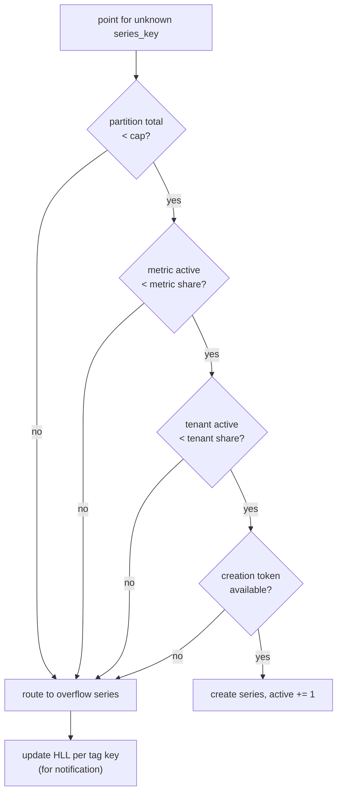
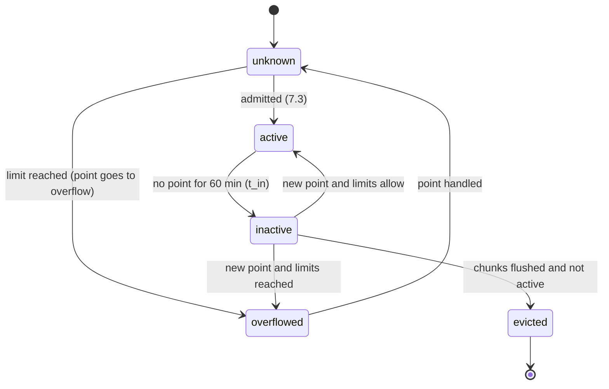

# Metrics model and cardinality: Datadog

メトリクスのデータモデルを決める。指標の種類（gauge・count・rate・分布）、名前とタグの規則、指標の情報（型・単位）、系列の鍵、累積の指標の差への直し方、カーディナリティの上限と溢れ、溢れの知らせ、クエリに残すタグの選択を扱う。

前提となる決定は次のとおり。

- 系列の鍵は `xxh3_128(tenant_id ‖ 指標の名前 ‖ 並べたタグ)`、同じ系列・同じ時刻は後勝ち、累積の指標はインジェスターが差に直す（[ADR-0004](../decisions/0004-tsdb-storage-engine.md)）
- 上限はインジェスターで強制し、超過は溢れの系列へ。クエリに残すタグを選べる（[ADR-0006](../decisions/0006-cardinality-policy.md)）
- タグの正規化はゲートウェイ（[ADR-0011](../decisions/0011-intake-gateway-pipeline-and-watermark-ticks.md)）
- OTLP の型の対応（[ADR-0014](../decisions/0014-otlp-mapping-and-resource-attributes.md)）

この文書で決めたことは次の ADR にある。

| ADR | 決定 |
| --- | --- |
| [0016](../decisions/0016-metric-types-and-cumulative-conversion.md) | 型は gauge・count・rate・分布の 4 つで、組織と指標の名前ごとに最初に見た型で固定する（Aurora の `metric_metadata` に「無ければ入れ、あれば読む」）。rate は取り込みで count（値 × 間隔）に直し、表示だけを rate にする。指標の名前は小文字にする。累積の指標は、ブロックを作るときとヘッドを読むときに、時刻の順に並べた点と、前の時間のブロックの末尾の値から差を求める。読む順序に依らない |
| [0017](../decisions/0017-cardinality-admission-via-control-records.md) | 上限の判断は、インジェスターのパーティションごとに、パーティションの中のデータと制御のレコードだけで決める。組織・指標の上限はパーティションの組の数で割った持ち分（5% の余裕）で、変更と配り直しは MSK の制御のレコードで同じオフセットに届ける。溢れの系列は 10 秒の区間の集計（合計・個数・最小・最大・最後）で持ち、要求の ID で送り直しの重なりを除く。溢れたら 1 分ごとに Aurora に記録し、5 分以内に知らせる |
| [0018](../decisions/0018-tag-selection-preaggregation.md) | クエリに残すタグを選んだ指標は、ヘッドでは元の系列のまま持ち（後勝ちを守る）、ブロックを作るときと読むときに、残すタグの系列へ 10 秒の区間の集計（合計・個数・最小・最大・最後、分布はヒストグラム）として合わせる。有効な系列と課金は合わせた後で数え、元の系列には別の上限（組織の上限の 4 倍）を置く。設定の変更は次の 1 時間の区切りから効く |

## 1. 範囲

- 扱う：
  - 指標の種類とその意味、型の固定、単位と指標の情報
  - 指標の名前とタグの規則（ゲートウェイの正規化の規則の正本）
  - 系列の鍵の作り方
  - 累積の指標（OTLP の cumulative）の差への直し方
  - カーディナリティの上限、溢れの系列、知らせ方、うるさい組織の止め方
  - クエリに残すタグの選択
- 扱わない：
  - 系列の鍵からパーティションの選び方、ヘッドとブロックの形（[tsdb-storage-engine.md](tsdb-storage-engine.md)）
  - 分布の中身（指数のヒストグラム、[distributions-and-sketches.md](distributions-and-sketches.md)）
  - 型ごとの時間の集計の既定（[metrics-query-engine.md](metrics-query-engine.md) の 4 節）
  - 課金の数え方の詳細（usage-and-billing.md）。この文書は「有効な系列」の定義を渡す

## 2. 要件

| 要件 | 目標 | NFR |
| --- | --- | --- |
| 上限 | 組織の有効な系列（既定は契約の 2 倍）、指標ごと 10 万、新しい系列の作成 1 万/秒（組織） | NFR-009 |
| 知らせ | 溢れの開始から 5 分以内に、画面・管理者のメール・指標で知らせる。増えたタグの鍵を示す | NFR-009 |
| 合計を保つ | 上限の超過で、合計の値（count の和、gauge の個数）を失わない | NFR-009、NFR-010 |
| 隣人 | 1 つの組織が 1 秒 10 万の新しい系列を作っても、同じシャードの他の組織の NFR-002 を保ち、インジェスターのメモリーが上限の中 | NFR-007、K6 |
| 決定性 | 2 つの写しと読み直しで、上限の判断（作る・溢れさせる）が同じになる（バイトまで同じブロックの前提） | NFR-005、[ADR-0004](../decisions/0004-tsdb-storage-engine.md) |
| 累積の指標 | 差への直しが、点の届く順序・読み直し・写しに依らない | NFR-010 |

## 3. 本家の形（確かめたこと）

いずれも 2026-10-09 に確認。

| 項目 | 本家 | 出典 |
| --- | --- | --- |
| カスタムメトリクスの単位 | 指標の名前とタグの値の組で 1 つ。時間ごとの数の月の平均。分布はパーセンタイルの有無で 5 つか 10 つ | [Custom Metrics Billing](https://docs.datadoghq.com/account_management/billing/custom_metrics/) |
| 同じ時刻の点 | 同じ時刻とタグの組は最後に送った値を残す | [Historical Metrics Ingestion](https://docs.datadoghq.com/metrics/custom_metrics/historical_metrics/) |
| StatsD の型 | `c`・`g`・`ms`・`h`・`s`・`d` | [Datagram Format and Shell Usage](https://docs.datadoghq.com/developers/dogstatsd/datagram_shell/) |
| 累積の Sum の戻り | 始まりの時刻が点の時刻より前なら、始まりの分かる戻り。同じなら、始まりの分からない戻り（この節は Development の段） | [OpenTelemetry Metrics Data Model](https://opentelemetry.io/docs/specs/otel/metrics/data-model/) |
| 本家の上限を超えたときの振る舞い、型の食い違いの扱い、名前の大文字小文字、タグの選択の後の集計の意味 | 公式の資料で確かめられなかった（**未検証**） | — |

## 4. 指標

### 4.1 名前の規則（ADR-0016）

- `^[a-z][a-z0-9_.]{0,199}$`。ゲートウェイで小文字にしてから確かめる。OpenTelemetry の名前の `-`・`/` は `_` に直す（[ADR-0014](../decisions/0014-otlp-mapping-and-resource-attributes.md)）。
- `<brand>.` で始まる名前は本システムが作るもの。利用者の送る点は拒む。
- 小文字にするのは、OpenTelemetry が計器の名前の大文字小文字を区別しないことと、`CPU.User` と `cpu.user` が別の系列として課金される驚きを避けるため。

### 4.2 型（ADR-0016）

| 型 | 点の意味 | 由来 | 時間の集計の既定（[metrics-query-engine.md](metrics-query-engine.md)） |
| --- | --- | --- | --- |
| gauge | その時刻の値 | StatsD の `g`・`s`、OTLP の Gauge、単調でない累積の Sum | 平均 |
| count | 直前からの増分（差） | StatsD の `c`、OTLP の単調な Sum（累積は差に直す）、単調でない差の Sum | 合計 |
| rate | 間隔あたりの量。取り込みで count（値 × 間隔）に直して持つ | 本システムの API の `rate`（間隔つき） | 合計（表示は `.as_rate()`） |
| 分布 | 指数のヒストグラム | StatsD の `d`・`h`・`ms`、OTLP の Histogram・ExponentialHistogram | ヒストグラムの合わせ |

- **型の固定**：組織と指標の名前ごとに、最初に見た型で固定する。インジェスターが新しい指標の名前を見たら、Aurora の `metric_metadata` に `INSERT ... ON CONFLICT DO NOTHING` してから読み、勝った型を使う。行は不変なので、どの写し・どのシャード・どの読み直しでも同じ答えになる。違う型の点は拒み、`<brand>.intake.rejected_points{reason:type_conflict}` に数える。
- 型を変えるには、指標の名前を変える。MVP では型の変更の操作を持たない（過去のブロックと型が食い違うため）。
- rate を count に直すのは、ロールアップ（合計・個数）とクエリの集計を count と同じ道にするため。`metric_metadata.interval_s` に間隔を持ち、画面の既定で `.as_rate()` を当てる。

### 4.3 指標の情報

- `metric_metadata` は、型、単位、rate の間隔、単調の印、OpenTelemetry の元の名前（`otel_name`）、説明、最初に見た時刻を持つ。
- 単位と説明は、組織が画面と API で直せる。型と最初に見た時刻は直せない。
- 指標の一覧と補完は、この表とブロックの索引から作り、データのアクセスの制限を当てる（tenancy-and-rbac.md）。

### 4.4 タグ

- 鍵：`[a-z][a-z0-9_.\-/]*`、200 バイトまで。値：前後の空白を除き、大文字小文字を保つ。制御文字は不可。200 バイトまで。系列あたり 100 個まで（[ADR-0006](../decisions/0006-cardinality-policy.md)）。
- 値のないタグ（`prod`）は鍵だけのタグ。同じ鍵に複数の値を持てる（`role:web`、`role:api`）。
- 本システムが付けるタグ（`host`、`service` など）と利用者のタグは同じ扱い。`<brand>.` で始まる鍵は予約で、利用者のタグとしては拒む。

## 5. 系列の鍵

- 入力のバイト列：

```
tenant_id (16 bytes, UUID)
‖ u16 len ‖ metric name (UTF-8, lowercase)
‖ u16 count of tags
‖ for each tag in byte order of "key:value": u16 len ‖ "key:value" (key-only tags: "key")
```

- `series_key = xxh3_128(上の列)`。長さを前に付けるので、`a` ＋ `bc` と `ab` ＋ `c` のような区切りの紛れがない。`tenant_id` を先頭に入れるので、別の組織の同じ名前・タグは別の鍵になる（[ADR-0003](../decisions/0003-tenancy-cells-and-isolation.md)）。
- 鍵はゲートウェイで計算し、MSK のレコードに載せる。インジェスターは、新しい系列のときに名前とタグから鍵を計算し直して比べ、違えば点を拒んで運用のアラートにする（ゲートウェイとインジェスターのバージョンの食い違いの検出）。
- 例：`tenant_id = 0190f3c2-…`、`system.cpu.user`、タグ `host:web-1`、`env:prod`、`cpu:0` → 並べると `cpu:0`、`env:prod`、`host:web-1` → 列は `tenant_id ‖ 0x000F "system.cpu.user" ‖ 0x0003 ‖ 0x0005 "cpu:0" ‖ 0x0008 "env:prod" ‖ 0x000A "host:web-1"`。鍵の値の試験のベクトルは開発リポジトリに置く。
- 鍵からパーティションを選ぶ方法は [tsdb-storage-engine.md](tsdb-storage-engine.md) の 3 節。

## 6. 累積の指標（ADR-0016）

OTLP の cumulative の点は、始まりの時刻 `start` と、そこからの累計 `v` を持つ。差への直しを「届いた順」で行うと、読み直しの位置や写しで前の点が変わり、結果が変わる。そこで、**差は時刻の順に並べた点から、読むたびに決まる関数として求める**。

- 保存：ヘッドとブロックは、累積の点を `(ts, start, v)` のまま持つ（型は count）。差は、ブロックの書き出しのとき（ロールアップを作る前）と、ヘッドを読むときに、同じ関数 `cumulative_to_delta` で求める。
- 前の点：時間 `H` の最初の点の前の点は、時間 `H − 1` のブロックの末尾の区画（系列ごとの最後の `(ts, start, v)`）から取る。ヘッドは、書き出したブロックの末尾の区画をメモリーに持つ（再起動のときは S3 のブロックから読む）。
- 直し方の決定表（DT-MET-001）：

| 前の点 | 条件 | 差 | 数える指標 |
| --- | --- | --- | --- |
| なし | `start < ts` かつ `ts − start ≤ 5 分` | `v`（始まったばかり） | — |
| なし | それ以外 | 出さない（基準の点） | `<brand>.metrics.cumulative_baseline_points` |
| あり | `start` が同じ、`v ≥ 前の v` | `v − 前の v` | — |
| あり | `start` が同じ、`v < 前の v` | `v`（戻りとみなす） | `<brand>.metrics.cumulative_resets{reason:decrease}` |
| あり | `start` が変わり、`start < ts` | `v`（始まりの分かる戻り） | `cumulative_resets{reason:restart}` |
| あり | `start = ts` | 出さない（始まりの分からない戻り。基準の点） | `cumulative_resets{reason:unknown_start}` |

- 例：系列の点（時刻は分:秒）

| 点 | `ts` | `start` | `v` | 前の点 | 差 |
| --- | --- | --- | --- | --- | --- |
| 1 | 10:00:15 | 10:00:00 | 5 | なし（15 秒 ≤ 5 分） | 5 |
| 2 | 10:00:30 | 10:00:00 | 12 | 1 | 7 |
| 3 | 10:00:45 | 10:00:40 | 3 | 2（`start` が変わった） | 3 |
| 4 | 10:01:00 | 10:00:40 | 9 | 3 | 6 |

  点 3 が点 4 より後に届いても、並べてから求めるので同じ差になる。点 2 が窓の中で遅れて届いたときも、ヘッドを読むたびに求め直すので、書き出しの前のクエリと後のクエリが同じになる。
- 累積の指数のヒストグラムは、前の点のスケールを今の点のスケールまで下げてから区間ごとに引く。どれかの区間が負になれば、戻りとみなして今の点をそのまま差にする（[distributions-and-sketches.md](distributions-and-sketches.md) の 6.3 節）。

## 7. カーディナリティの上限（ADR-0017）

### 7.1 有効な系列

- **有効な系列**：取り込みの時刻で直近 60 分に点のあった系列。インジェスターのパーティションごとに、系列の最後の `t_in` を持ち、パーティションの最大の `t_in` が分の区切りを越えるたびに、60 分を過ぎた系列を有効の数から外す。壁の時計は使わない（読み直しと写しで同じ判断にするため）。
- 有効でなくなった系列も、ヘッドのチャンクが書き出されるまでは系列の索引に残る。もう一度点が来たら、新しい系列としてではなく、有効の数に戻す（ただし有効の数の上限は確かめる）。

### 7.2 持ち分

組織の系列は、組織のパーティションの組（`k` 個）に、系列の鍵のハッシュで均等に散る。そこで、上限をパーティションに割った持ち分で確かめる。

| 上限 | 組織の値 | パーティションの持ち分 |
| --- | --- | --- |
| 組織の有効な系列 | `L`（既定は契約の 2 倍） | `ceil(L × 1.05 ÷ k)` |
| 指標の有効な系列 | `M`（既定 10 万） | `ceil(M × 1.05 ÷ k)` |
| 新しい系列の作成 | `R`（既定 1 万/秒） | `R ÷ k` 個/秒（取り込みの時刻で補充、深さ 10 秒） |
| 元の系列（タグの選択の指標、8 節） | `4 × L` | `ceil(4 × L × 1.05 ÷ k)` |
| パーティションの全体 | 運用の値（S1 の仮の値 40 万） | — |

- **持ち分の配り直し**：上限を持つ調整の部品（`limits-coordinator`、Rust、Fargate、セルに 1 つ）が、1 分ごとにパーティションごとの有効な系列と、溢れさせた新しい系列の数を集め、偏りで持ち分を直す必要があるか見る。持ち分が 5% を超えて変わるときと、組織の上限が変わったときだけ、**制御のレコード** `LimitUpdate{tenant_id, metric?, active_share, rate_share, epoch}` を、その組織のパーティションのすべてに MSK で書く。インジェスターは、そのオフセットから新しい持ち分を使う。2 つの写しと読み直しは同じオフセットで同じ持ち分を使うので、判断が同じになる（[ADR-0006](../decisions/0006-cardinality-policy.md) の「1 分ごとの配り直し」を、決定的な形にしたもの）。
- 制御のレコードがまだないパーティションは、上の表の既定の持ち分を使う。
- 組織の上限の値は `tenant_quotas`（[intake-and-agent.md](intake-and-agent.md) の 9 節）と同じ管理の画面で、運用のパラメーターとして変える。コードの定数で上書きしない（[ADR-0006](../decisions/0006-cardinality-policy.md)）。

### 7.3 新しい系列の判断



- パーティションの全体の上限に近づいたら（90%）、組織の持ち分を超えていない組織の新しい系列は作り続け、持ち分を超えている組織から止める（[ADR-0006](../decisions/0006-cardinality-policy.md)）。判断に使う数は、すべてパーティションの中のデータから決まる。



### 7.4 溢れの系列

- 溢れの系列は、指標ごと・パーティションごとに 1 つ。タグは `<brand>.cardinality_overflow:true` だけ。系列の鍵は普通の系列と同じ作り方（5 節）で、上限の対象外。
- 点は、10 秒の区間（エポックから 10 秒の倍数）ごとの集計で持つ：合計、個数、最小、最大、最後の値（区間の中で時刻の最も後の点。同じ時刻は後に取り込んだもの）。分布はヒストグラムを合わせる。クエリでは、合計・個数から count の和と gauge の平均を求める（[metrics-query-engine.md](metrics-query-engine.md) の 4.3 節）。
- **送り直しの重なり**：溢れた点は元の系列を持たないので、同じ点の送り直しを後勝ちで除けない。そこで、パーティションごとに「要求の ID」（エージェントが付ける `<Brand>-Request-Id`。[intake-and-agent.md](intake-and-agent.md) の 5.4 節）を、取り込みの時刻で 15 分ぶん覚え、同じ要求の ID のレコードの点を溢れの集計に 2 回足さない。要求の ID を付けない送り手（OTLP）の送り直しは、溢れの系列で重なりうる（概数として画面に示す）。
- 溢れの系列の数は、組織ごとに 1 万の指標まで。超えた指標の溢れた点は、値を持たずに `<brand>.cardinality.dropped_points` に数えるだけにする。

### 7.5 知らせ

- インジェスターは、溢れのある（組織、指標）について 1 分ごとに、溢れた点の数と新しい系列の試みの数を、`cardinality_overflow_events` に書く（X2 の経路で組織を文脈に設定）。同時に、組織の指標 `<brand>.cardinality.overflow_points{metric}` を出す。
- **増えたタグの鍵**：溢れた指標について、パーティションごとに、溢れた新しい系列のタグの鍵ごとの HyperLogLog（精度 10、1 KiB）を持ち、10 分の窓で値の種類の推定の多い鍵の上位 3 つを記録に入れる。値そのものは記録しない。
- `api` が `cardinality_overflow_events` の新しい行を見て、画面の通知と組織の管理者へのメールを outbox に書く。同じ（組織、指標）の通知は 1 時間に 1 回にまとめる。溢れの開始から通知の送信まで 5 分以内（記録 1 分＋ `api` の読み出し 1 分＋送信）。
- 拒んだ点・溢れた点の数は利用量の画面に出し、課金の数に入れない（usage-and-billing.md）。

### 7.6 例

組織 T の上限 `L = 20 万`（契約 10 万の 2 倍）、パーティションの組 `k = 4`、指標の上限 `M = 10 万`、作成の速さ `R = 1 万/秒`。

1. 持ち分は、組織 52,500、指標 26,250、作成 2,500/秒（パーティションごと）。
2. 開発者が `api.requests` に `request_id` のタグを足して出す。1 秒 2,000 の要求が、毎回新しい系列になる。パーティションごとに 1 秒 500 の新しい系列で、作成の速さの持ち分（2,500/秒）の中。
3. `api.requests` の既存の系列は全体で 5,000（パーティションごとに 1,250）。パーティションごとの残りは 25,000 で、約 50 秒で埋まる。
4. 以後の新しい系列の点は、`api.requests{<brand>.cardinality_overflow:true}`（パーティションごとに 1 つ、計 4 つ）に入る。`sum:api.requests{*}.as_count()` は、元の系列と溢れの系列の和で、要求の総数を保つ。`by {endpoint}` のグループの値は、溢れた分だけ欠ける。
5. 1 分後に `cardinality_overflow_events` に行ができ、タグの鍵の上位に `request_id`（推定 3 万の値）が出る。5 分以内に管理者に届く。
6. 開発者がタグを外すと、`request_id` の系列は 60 分で有効の数から外れ、新しい系列を作れるようになる。

## 8. クエリに残すタグの選択（ADR-0018）

- 組織は、指標ごとに残すタグの鍵の一覧を選べる（[ADR-0006](../decisions/0006-cardinality-policy.md)）。選んだ指標の**合わせた系列**の鍵は、残すタグだけで 5 節の作り方で作る。
- **ヘッド**：元の系列のまま持つ。同じ系列・同じ時刻の後勝ちと、送り直しの重なりの除去を、普通の系列と同じに守るため。元の系列は、組織の上限の 4 倍の別の上限で守る（7.2 節）。
- **ブロック**：書き出しのときに、元の系列の点を合わせた系列へ、10 秒の区間の集計（合計・個数・最小・最大・最後。分布はヒストグラムの合わせ）にしてから書く。元の系列はブロックに書かない。
- **ヘッドの読み出し**：同じ関数で、読むたびに合わせた系列の 10 秒の区間の集計を作って返す。これで、書き出しの前と後で同じ結果になる。
- **数え方**：有効な系列（上限）と課金は、合わせた系列で数える。取り込んだ元の系列の数は、利用量の画面に別に見せる。
- **変更の効き方**：選択の変更は、次の 1 時間の区切りから効く（制御のレコード `TagSelectionUpdate{tenant_id, metric, keep_keys, effective_hour}` で届け、どの写しでも同じ時間から効かせる）。過去のブロックは書き換えない（[ADR-0006](../decisions/0006-cardinality-policy.md)）。画面は、変更の時刻をグラフに印として示す。
- **集計の意味**：合わせた系列の gauge の時間の平均は、区間の中の元の系列の点の平均（点の数で重みを付けた平均）になる。元の系列ごとの平均の平均ではない。画面と文書で説明する。
- 例：`http.server.request.duration`（分布）、タグ `host`・`service`・`env`・`pod_name`・`http.route`。Pod 200、経路 50 で元の系列は 1 万。残すタグを `service`・`env`・`http.route` にすると、合わせた系列は 50。課金は 50 系列（分布の数え方は usage-and-billing.md）。

## 9. 失敗と回復

| 事象 | 起きること | 備え |
| --- | --- | --- |
| 制御のレコードの書き込みの失敗 | 持ち分が古いまま | 上限は既定か前の持ち分で守られる。`limits-coordinator` は次の分に書き直す（冪等。`epoch` で古い更新を無視） |
| `limits-coordinator` の停止 | 偏りの配り直しが止まる | 既定の持ち分（均等＋5%）で続く。系列の鍵は均等に散るので、外れは小さい |
| `metric_metadata` に書けない（Aurora の停止） | 新しい指標の型が決まらない | 新しい指標の名前の点は、ヘッドの「型の決まっていない系列」として保留する。Aurora が戻ったら型を決め、違う型の点をそのときに拒んで数える。保留の系列はクエリで「不完全」の印を付ける。既知の指標はメモリーの写しで続ける |
| 溢れの記録が書けない | 知らせが遅れる | インジェスターが 10 分まで溜めて書き直す。組織の指標 `<brand>.cardinality.overflow_points` は止まらない |
| パーティションの全体の上限 | 新しい系列が作れない | 持ち分を超えている組織から止める。運用のアラート（`ingester-memory-pressure.md`） |
| 前の時間のブロックがない（累積の指標の前の点） | 時間の最初の点の差が出ない | 決定表の「前の点なし」で扱う。ブロックの欠けそのものは照合で見つける（[tsdb-storage-engine.md](tsdb-storage-engine.md) の 10 節） |

- 保留にするのは、202 を返した点を Aurora の停止で失わないため（NFR-005）。ブロックの確定も Aurora を要るので（[tsdb-storage-engine.md](tsdb-storage-engine.md) の 6 節）、保留の系列が型の決まらないまま書き出されることはない。保留の系列が多いときのメモリーは `ingester-head` で測る。

## 10. 上限

| 対象 | 値 | 超えたとき |
| --- | --- | --- |
| 指標の名前 | 200 バイト | 点を拒む |
| タグの数・長さ | 100、鍵・値 200 バイト | 点を拒む |
| 組織の有効な系列 | 契約の 2 倍（試用 10 万） | 溢れ |
| 指標の有効な系列 | 10 万 | 溢れ |
| 新しい系列の作成 | 1 万/秒（組織） | 溢れ |
| 元の系列（タグの選択） | 組織の上限の 4 倍 | 溢れ |
| 溢れの系列 | 組織ごとに 1 万の指標 | 数えるだけ |
| 要求の ID の記憶 | パーティションごとに 15 分 | 古いものから忘れる |
| タグの選択の指標 | 組織ごとに 1,000 | 設定の保存を 409 |
| 組織の指標の名前の数 | 10 万 | 新しい名前を拒む（`too_many_metrics`） |

## 11. data-model への項目

| 表・置き場 | 中身 | 主キー・索引 | 節 |
| --- | --- | --- | --- |
| `metric_metadata`（テナントの表） | `metric_name`、`type`（`gauge`・`count`・`rate`・`distribution`）、`interval_s`、`monotonic`、`unit`、`unit_history`、`otel_name`、`description`、`first_seen_at`、`source`（`statsd`・`otlp`・`api`・`derived`）、`conversion`（分布の取り込みの変換。[distributions-and-sketches.md](distributions-and-sketches.md) の 10 節。[data-model.md](data-model.md) の D-8） | `(tenant_id, metric_name)` | 4.2、4.3 |
| `cardinality_limits`・`cardinality_limit_overrides`（テナントの表） | 組織の上限 `L`、作成の速さ `R`、`epoch`、変更者と理由。指標ごとの上限の上書きは別の表（D-9） | `(tenant_id)`、`(tenant_id, metric_name)` | 7.2 |
| `cardinality_overflow_events`（テナントの表） | 分の時刻、`metric_name`、溢れた点の数、新しい系列の試みの数、タグの鍵の上位 3 つと推定の数、パーティション | `(tenant_id, metric_name, minute, partition)`（D-10）。月ごとに分け、90 日で消す | 7.5 |
| `metric_tag_selections`（テナントの表） | `metric_name`、`keep_keys`、`effective_hour`、変更者 | `(tenant_id, metric_name, effective_hour)` | 8 |
| MSK `metrics` の制御のレコード | `LimitUpdate`、`TagSelectionUpdate` | パーティションの鍵は組織のパーティションのすべて | 7.2、8 |
| Valkey | `card:{cell}:{tenant}:{partition}`（1 分ごとの有効な系列と溢れの数）、期限 5 分 | — | 7.2 |
| ブロックの末尾の区画 | 累積の系列ごとの最後の `(ts, start, v)` | [tsdb-storage-engine.md](tsdb-storage-engine.md) の 7 節 | 6 |

## 12. テスト

決定表：

- **DT-MET-001（累積の直し）**：6 節の表の全行。ヒストグラムの区間が負になる行を足す。
- **DT-MET-002（型）**：最初の型 × 次の型（同じ・違う）× `metric_metadata` の状態（なし・あり・書けない）。
- **DT-MET-003（新しい系列の判断）**：7.3 節の 4 つの条件の組み合わせ × パーティションの全体の 90% の前後。

性質ベーステスト：

- **PROP-MET-001（上限）**：任意の系列の生成の列と制御のレコードの列で、パーティションの有効な系列が持ち分を超えない。組織の全体は `L × 1.05` を超えない（[ADR-0006](../decisions/0006-cardinality-policy.md) の確かめ）。
- **PROP-MET-002（合計を保つ）**：任意の生成の列（送り直しなし、または要求の ID つきの送り直し）で、元の系列と溢れの系列の count の合計が、上限なしの参照の合計と一致する。
- **PROP-MET-003（判断の決定性）**：同じパーティションの列を、任意の位置からの読み直し・2 つの写しで流して、作る・溢れさせるの判断の列が一致する。
- **PROP-MET-004（累積の直しの順序の独立）**：任意の累積の点の列を任意の順序で届けても、ヘッドの読み出しとブロックの結果が、参照（並べて決定表を当てる）と一致する。
- **PROP-MET-005（タグの選択）**：任意の元の系列の列で、ブロックの合わせた系列と、ヘッドの読み出しの合わせた系列が同じ。参照（元の点を残すタグで分けて 10 秒ごとに集計）と一致する。
- **PROP-MET-006（系列の鍵）**：タグの順序・重複を変えても同じ鍵。違う（組織、名前、タグの集合）は違う鍵の入力の列になる（単射）。

負荷：1 つの組織が 1 秒 10 万の新しい系列を作り続ける間、同じシャードの他の組織の NFR-002 とインジェスターのメモリー（quality.md の 2.2.1 節 E）。

## 13. Story の候補

| Epic | Story | 中身 |
| --- | --- | --- |
| E3 | `series-index` | 5 節、PROP-MET-006 |
| E3 | `rollups-1m-1h` | 6 節の累積の直し（ADR-0016、DT-MET-001、PROP-MET-004） |
| E4 | `cardinality-limits-and-overflow` | 7 節（ADR-0017、DT-MET-003、PROP-MET-001〜003） |
| E4 | `tag-selection` | 8 節（ADR-0018、PROP-MET-005） |
| E3 | `metric-metadata-registry` | 4 節（DT-MET-002）。新しい Story |

## 14. 未解決の問い

### 決定

2026-10-09 の既定案。

- **型**：4 つの型、最初の型で固定、rate は count に直す、名前は小文字（ADR-0016）。
- **累積の直し**：保存は累積のまま、差は並べた点から読むたびに求める（ADR-0016）。
- **上限の判断**：パーティションの持ち分と制御のレコード（ADR-0017）。
- **溢れの系列**：10 秒の区間の集計、要求の ID で重なりを除く（ADR-0017）。
- **タグの選択**：ヘッドは元の系列、ブロックと読み出しで合わせる（ADR-0018）。

### 持ち越し

| 問い | いつ・どう決めるか |
| --- | --- |
| Aurora の停止の間の保留の系列のメモリー（9 節） | `ingester-head`。重ければ、`metric_metadata` の写しをセルの中に持つ形を ADR にする |
| パーティションの全体の上限（S1 の仮の値 40 万） | `ingester-memory-poc` |
| 持ち分の余裕 5% が、組の数の小さい組織（`k = 4`）で足りるか | 負荷試験で、系列の数の偏りを測る |
| OTLP の送り手の送り直しで、溢れの系列が重なる量 | E13 の負荷試験で測る。大きければ OTLP の受け口で要求の本文のハッシュを要求の ID の代わりにする |
| 本家の上限を超えたときの振る舞いと、タグの選択の後の集計の意味 | 公式の資料で確かめられなかった（**未検証**）。統合の工程で、確かめられない間は 1.4 節の「意図した違い」に足さないと決めた |

## 出典

いずれも 2026-10-09 に確認。

- Datadog Docs, [Custom Metrics Billing](https://docs.datadoghq.com/account_management/billing/custom_metrics/)
- Datadog Docs, [Historical Metrics Ingestion](https://docs.datadoghq.com/metrics/custom_metrics/historical_metrics/)
- Datadog Docs, [Datagram Format and Shell Usage](https://docs.datadoghq.com/developers/dogstatsd/datagram_shell/)
- OpenTelemetry, [Metrics Data Model](https://opentelemetry.io/docs/specs/otel/metrics/data-model/)
