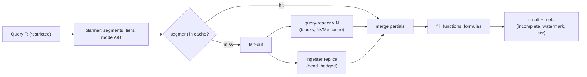

# Metrics query engine: Datadog

メトリクスのクエリのエンジンを決める。クエリの言語の形、型付きの IR、既定の意味（時間の集計と空間の集計の順、区間の選び方と揃え、補間、型ごとの既定）、関数と式、計画（時間の区切りと層の選び方）、扇形の展開と部分の集計の合わせ方、不完全の印、結果のキャッシュ、費用の見積もりと受け付け、重み付きの公平なキューを扱う。

前提となる決定は次のとおり。

- 自前の言語と型付きの IR、1 つのエンジン、既定の意味、受け付けの上限（系列 100 万、生の点 10 億）、キャッシュの鍵、不完全の印（[ADR-0007](../decisions/0007-query-language.md)）
- テナントの公平なキューと並行の上限、評価用の読み手の組（[ADR-0003](../decisions/0003-tenancy-cells-and-isolation.md)、[ADR-0008](../decisions/0008-monitor-evaluation-model.md)）
- ヘッドとブロック、ロールアップ、閉じる時刻（[ADR-0004](../decisions/0004-tsdb-storage-engine.md)、[ADR-0020](../decisions/0020-block-flush-commit-and-replay.md)）
- 型と累積の直し、溢れの系列、タグの選択（[ADR-0016](../decisions/0016-metric-types-and-cumulative-conversion.md)、[ADR-0017](../decisions/0017-cardinality-admission-via-control-records.md)、[ADR-0018](../decisions/0018-tag-selection-preaggregation.md)）

この文書で決めたことは次の ADR にある。

| ADR | 決定 |
| --- | --- |
| [0024](../decisions/0024-query-ir-default-semantics.md) | IR は、時間の窓・区間・揃えの起点・時間の集計・空間の集計・補間・変換・関数・データのアクセスの制限・`tenant_id` をすべて明示した値で持ち、正規の直列化の xxh3_128 で識別する。区間は窓 ÷ 点の数（既定 300）以上の決まった一覧の最小の値で、エポックに揃える。空間の集計は、区間に値のある系列だけで行う。gauge の時間の集計の既定は平均、count・rate は合計。分布のパーセンタイルはヒストグラムを合わせてから求める。NaN は IEEE 754 のまま伝える |
| [0025](../decisions/0025-query-plan-fanout-and-partials.md) | 計画は窓を時間の区切り（ヘッド、時間のブロック、日・月のファイル）に分け、区間ごとに、区間の全体で使える最も粗い層を 1 つ選ぶ（1 つの区間で層を混ぜない）。区切りをまたがない区間は、保存の側が時間の集計を終えて空間の部分の集計（グループ・区間ごとの値の和と系列の数など）を返し、またぐ区間は系列ごとの時間の部分の値を返して合わせる側で仕上げる。ブロックはファイルのキーの一貫したハッシュで読み手に、ヘッドは写しに送り、遅い写しにはもう一方へ重ねて送る |
| [0026](../decisions/0026-query-cache-and-admission.md) | 結果のキャッシュは、閉じた時間の区切りの空間の部分の集計を、（`tenant_id`、制限のハッシュ、IR のハッシュ、層、区間、区切り、組織の世代）の鍵で Valkey に置く。受け付けは、カタログの統計から系列と点の数を上から見積もり、上限を超えれば粗い層に落とすか理由を付けて拒む。キューは組織ごとの赤字ラウンドロビン（重みは契約）で、対話・評価・一括の 3 つの組に分ける |

## 1. 範囲

- 扱う：
  - メトリクスのクエリの言語の形（文法の細部の確定は法務の L9 の後）
  - IR の中身と正規の形、既定の意味の決定表
  - 関数と式の最初の一覧
  - 計画、層の選び方、扇形の展開、部分の集計と合わせ
  - 不完全の印、水位
  - 結果のキャッシュ、同じクエリのまとめ
  - 費用の見積もり、受け付け、公平なキュー
- 扱わない：
  - ログ・トレースの検索の文法と実行（log-storage-and-search.md、traces-and-sampling.md）。IR の共通の部分（制限、`tenant_id`）は同じ
  - ヒストグラムの合わせとパーセンタイルの計算（[distributions-and-sketches.md](distributions-and-sketches.md)）
  - データのアクセスの制限の決め方（tenancy-and-rbac.md）。この文書は IR に足された制限を実行で守る
  - モニターの評価の時刻・水位の待ち（monitors-and-alerting.md）。この文書は不完全の印を返す
  - ダッシュボードのクエリの束ねとライブの更新（dashboards.md）

## 2. 要件

| 要件 | 目標 | NFR |
| --- | --- | --- |
| 速さ | 1 時間の窓・結果 1,000 系列以下 p99 1 秒。1 日 p99 2 秒。15 か月（1 時間のロールアップ）p99 5 秒 | NFR-003、K3 |
| 正しさ | 窓の分け方、シャード、キャッシュ、ヘッドとブロックの境界に依らず同じ結果。参照の実装と一致 | NFR-010、K5 |
| 分離 | 他の組織・制限の外の系列が結果・キャッシュ・エラーに出ない | NFR-007、K7 |
| 隣人 | 重いクエリ（15 か月・100 万系列）を 1 つの組織が並行に投げても、他の組織の NFR-003 と NFR-004 を保つ | NFR-007、K6 |
| 不完全 | 欠けた結果を黙って返さない。理由を付ける | [ADR-0007](../decisions/0007-query-language.md) |
| ダッシュボード | 同じ組織の同じクエリを 1 回の実行にまとめる | NFR-011 |

## 3. 本家の形（確かめたこと）

いずれも 2026-10-09 に確認。

| 項目 | 本家 | 出典 |
| --- | --- | --- |
| クエリの形 | `avg:system.cpu.user{env:prod} by {host}` の形を持つ | [ADR-0007](../decisions/0007-query-language.md)（公開の資料で形を確かめた） |
| 内部の計画、時間と空間の集計の既定、区間の選び方、層の選び方 | 公式の資料で確かめられなかった（**未検証**） | — |

- 文法を本家にどこまで寄せてよいかは **法務の確認待ち：L9**。この文書の文法は IR を説明するための仮の形で、IR と既定の意味は文法と独立に決める。

## 4. 言語と IR（ADR-0024）

### 4.1 言語の形（仮）

```
query     := space_agg ":" metric "{" filter "}" [ "by" "{" tag_key { "," tag_key } "}" ] { "." transform }
space_agg := "avg" | "sum" | "min" | "max" | "count" | "p" digits      (p50, p95, p99, p99.9 ...)
filter    := "*" | term { ("," | "AND" | "OR") term }                   ("," は AND)
term      := [ "NOT" | "!" ] ( tag_key ":" pattern | tag_key "IN" "(" value { "," value } ")" | "(" filter ")" )
pattern   := value | prefix "*" | "*" suffix
transform := "rollup(" time_agg [ "," seconds ] ")" | "as_count()" | "as_rate()"
           | "fill(" ( "null" | "zero" | "last" | "linear" ) [ "," seconds ] ")"
formula   := expr over named queries (a, b, ...) with + - * / and functions
```

- 画面の組み立ては、同じ IR を作り、テキストと往復できる（`query-lang` の WASM。[ADR-0001](../decisions/0001-platform-and-stack.md)）。

### 4.2 IR

```
QueryIR {
  tenant_id: TenantId                     // 認証の文脈から
  restriction: Restricted(Filter) | Unrestricted(RoleProof)   // コンパイルの最後に必ず付く
  metric: MetricName, metric_type: Gauge | Count | Rate | Distribution, preaggregated: bool
  filter: Filter                          // 正規の形（項を並べ、AND・OR を平らに）
  window: { start_ms, end_ms }            // 揃えた後
  interval_ms: i64, align_origin_ms: 0
  time_agg: Avg | Sum | Min | Max | Count | Last | Hist
  space_agg: { fn: Avg | Sum | Min | Max | Count | Quantile(q), group_by: [TagKey] }
  fill: None | Null | Zero | Last{max_gap_ms} | Linear{max_gap_ms}
  unit_transform: None | AsCount | AsRate
  functions: [Function]                   // 空間の集計の後に当てる
  timeshift_ms: i64
}
FormulaIR { queries: Map<Name, QueryIR>, expr: Expr }
```

- **すべての既定を書き出してから実行する**：区間、時間の集計、補間なし、揃えの起点は IR に入る。実行は IR だけを見る（[ADR-0007](../decisions/0007-query-language.md)）。
- **識別**：IR の正規の直列化（欄の順、フィルターの項の並べ方、数の表記を決める）の xxh3_128 を `ir_hash` にする。キャッシュの鍵では、窓を除いた IR のハッシュを使う。
- **制限**：`restriction` の型を持たない IR は `query-frontend` に渡せない（[ADR-0007](../decisions/0007-query-language.md) の lint）。保存の側でも、制限の節を AND で当てたことを確かめる。

### 4.3 既定の意味（DT-QRY-001）

| 指標の型 | 時間の集計の既定 | `.as_count()` | `.as_rate()` | 備考 |
| --- | --- | --- | --- | --- |
| gauge | 平均（合計 ÷ 個数） | 誤り（400） | 誤り（400） | |
| count | 合計 | 合計（既定と同じ） | 合計 ÷ 区間の秒 | |
| rate（count で保存） | 合計 | 合計 | 合計 ÷ 区間の秒（画面の既定） | [metrics-model-and-cardinality.md](metrics-model-and-cardinality.md) の 4.2 節 |
| 分布 | ヒストグラムの合わせ | 個数の合計 | 個数 ÷ 区間の秒 | `avg`・`sum`・`min`・`max`・`count` はヒストグラムの合計・個数・最小・最大から。`pNN` は合わせたヒストグラムから |
| 10 秒の区間の集計（溢れの系列、タグの選択の指標） | gauge は Σ合計 ÷ Σ個数（点の数の重み）。count は Σ合計 | count のみ | count のみ | [ADR-0017](../decisions/0017-cardinality-admission-via-control-records.md)、[ADR-0018](../decisions/0018-tag-selection-preaggregation.md) |

- **順序**：系列ごとに時間の集計を先に行い、その後に空間の集計を行う。空間の `avg` は「区間の値を持つ系列の値の平均」で、点の数の重みを付けない。

**例**：`avg:latency{*} by {env}`、区間 5 分。系列 A（`env:prod`）は 20 点で平均 10、系列 B（`env:prod`）は 4 点で平均 30。結果の `env:prod` は `(10 + 30) ÷ 2 = 20`。全点の平均 `(200 + 120) ÷ 24 = 13.3` ではない。

- **欠け**：区間に点のない系列は、その区間の空間の集計に入れない。`count` は値のある系列の数。全系列が欠けた区間は値なし（null）。
- **補間**：既定はなし。`.fill(zero)` は欠けを 0、`.fill(last, s)` は `s` 秒まで前の値、`.fill(linear, s)` は `s` 秒までの隙間を直線で埋める。補間は時間の集計の後・空間の集計の前に、系列ごとに行う。
- **区間**：既定の点の数 `N = 300`（画面は描く幅から最大 1,500 まで渡せる）。区間 = 一覧 `[10, 15, 20, 30, 60, 120, 300, 600, 1200, 1800, 3600, 7200, 14400, 21600, 43200, 86400]` 秒のうち `(end − start) ÷ N` 以上の最小。`.rollup(fn, s)` で 1 秒まで下げられる。
- **揃え**：区間 `[origin + i × interval, origin + (i+1) × interval)`、`origin` は UTC のエポック。窓の始めは区間に切り下げ、終わりは切り上げる。区間の時刻は始まりで表す。
- **NaN**：IEEE 754 のまま伝える（NaN を含む区間の合計・平均・最小・最大は NaN）。ロールアップも同じ規則（[tsdb-storage-engine.md](tsdb-storage-engine.md) の 9.1 節）で、どの層から読んでも同じ。応答では NaN を null にし、`nan: true` の印を付ける。
- **空間の分位**：分布の `p95 by {service}` は、グループの全系列の区間のヒストグラムを合わせてから分位を求める。系列ごとの p95 の平均にしない。

### 4.4 関数（最初の一覧）

| 関数 | 意味 | 当てる位置 |
| --- | --- | --- |
| `rate(q)` | 隣り合う区間の値の差 ÷ 区間の秒。`monotonic` の指標では負の差を捨てる（戻りとみなす） | 空間の集計の後 |
| `derivative(q)` | 同じ。負の差も残す | 同上 |
| `abs`、`log2`、`log10` | 値ごと | 同上 |
| `cumsum(q)` | 窓の始めからの累計 | 同上 |
| `moving_avg(q, n)` | 前の `n` 区間の平均（欠けは除く） | 同上 |
| `timeshift(q, s)` | 窓を `s` 秒ずらして読み、時刻を戻す | 計画（窓を動かす） |
| `top(q, n, by, dir)` | `by`（`mean`・`max`・`last`・`sum`）で並べて上位 `n` グループ | 空間の集計の後 |

- 式（`a / b * 100`）は、同じ区間の格子に揃えたクエリどうしで計算する。グループは、同じタグの鍵の組なら値の一致で結び、片方にグループがなければもう一方の全グループに広げる。それ以外の組み合わせは 400。片方が欠けた区間・0 での割り算は null。
- 関数の一覧と細部は、表駆動テスト（DT-QRY-002）と一緒に `query-functions-and-formulas` で確定する。

## 5. 計画（ADR-0025）

### 5.1 時間の区切り

`query-frontend` は窓を次の区切りに分ける。区切りの状態は、カタログ（`metric_blocks` の `active` の行）と、インジェスターの確定の状態から、1 つの読み取りの写しで決める。

| 区切り | 単位 | 持つ層 | 読む先 |
| --- | --- | --- | --- |
| ヘッド | まだ閉じていない時間 | 生 | インジェスターの写し |
| 時間のブロック | 閉じて、日の合わせの前の時間 | 生・1 分・1 時間 | `query-reader`（S3、NVMe のキャッシュ） |
| 日のファイル | 合わせた日 | 区分ごと（生 15 日、1 分 63 日、1 時間 15 か月） | `query-reader` |
| 月のファイル | 1 時間のロールアップの月 | 1 時間 | `query-reader` |

### 5.2 層の選び方

- **区間ごとに、区間の全体で使える最も粗い層を 1 つ選ぶ**。層 `r`（1 時間、1 分、生）が使えるのは、`r` が区間を割り切り、区間の全体で `r` のデータが保持の中にあり、区間がヘッドを含まない（ヘッドは生だけ）とき。
- 1 つの区間で層を混ぜない。1 分のロールアップの合計の和と、生の点の和は、浮動小数点の丸めでビットが違いうるため。
- 例：区間 5 分で、区間がヘッドにかかれば生、15 日以内なら生か 1 分（1 分が割り切るので 1 分）、63 日以内なら 1 分、それより古ければ 1 時間は 5 分を割り切らないので使えず、計画は区間を 1 時間に広げる（`interval_adjusted` の印を返す）。

### 5.3 例：`avg:system.cpu.user{env:prod} by {host}`、過去 1 日

今を 2026-10-09 15:07:30（UTC）とする。

1. **IR**：区間 = 86,400 ÷ 300 = 288 秒以上の最小 → 300 秒。窓を揃えて `[10-08 15:05:00, 10-09 15:10:00)`、289 区間。時間の集計は gauge の平均、空間の集計は `avg`、グループは `host`。制限（例：`team:infra`）を AND で足す。
2. **区切り**：
   - 10-08 15:05〜24:00：日のファイル（10-08 は 10-09 02:10 の後に合わせ済み）。`r1m-63d` を使う。
   - 10-09 00:00〜13:00：時間のブロック（12:00 の時間は 14:10 に閉じた。13:00 は 15:10 に閉じる）。
   - 10-09 13:00〜15:10：ヘッド（13:00、14:00、15:00 の時間）。
3. **層**：13:00 は 300 秒の倍数なので、どの区間もヘッドとブロックにまたがらない。ブロックの区間は 1 分、ヘッドの区間は生。
4. **扇形の展開**：組織のパーティションの組 `k = 8`、ホスト 200（系列 200）とする。
   - 日のファイル 1 つ、時間のブロック 13 時間 × 8 パーティション = 104 ファイル → ファイルのキーの一貫したハッシュで `query-reader` に配る。
   - ヘッド：8 パーティションの写しに送る。
5. **保存の側**：ファイルの末尾（キャッシュ済み）→ 転置の表で `metric = system.cpu.user` ∩ `env:prod` ∩ 制限 → 系列 → 系列の表から `host` の値 → 区間ごとに 1 分の行の Σ合計 ÷ Σ個数 で系列の値 → グループ・区間ごとに（値の和、系列の数）を返す。
6. **合わせる側**：（ホスト、区間）ごとに（和、数）を足し、`和 ÷ 数` を出す。区切りの違うものは区間が重ならないので、ほぼ並べるだけ。
7. **量**：1 分の行が 200 系列 × 約 1,325 分 ≈ 26.5 万行、ヘッドの生の点が 200 × 520 ≈ 10.4 万点。
8. **キャッシュ**：日のファイルと時間のブロックの区切りの結果をキャッシュに置く（6 節）。ヘッドは置かない。

### 5.4 区切りをまたぐ区間（部分の集計の 2 つの形）

| 形 | 使うとき | 保存の側が返すもの | 合わせる側 |
| --- | --- | --- | --- |
| A（空間の部分） | 区間が 1 つの区切りの中 | グループ・区間ごとの空間の部分：`avg` は（値の和、系列の数）、`sum`・`min`・`max`・`count` はその値、分位は合わせたヒストグラム | 足す・比べる・合わせるだけ |
| B（時間の部分） | 区間が区切りをまたぐ | 系列・区間ごとの時間の部分：（合計、個数、最小、最大、最後の時刻と値、ヒストグラム） | 系列ごとに合わせて時間の集計を仕上げ、補間し、空間の集計をする |

**例**：区間 2 時間（`.rollup(avg, 7200)`）で、14:00 の時間がまだヘッドにある（閉じるのは 16:10）。区間 `[14:00, 16:00)` はヘッドだけ、`[12:00, 14:00)` は 12:00 の時間（ブロック）と 13:00 の時間（今 15:20 ならブロック、15:05 ならヘッド）にまたがる。15:05 のとき、`[12:00, 14:00)` は層を生にそろえ、ブロックの生のチャンクとヘッドから形 B の（合計、個数）を返す。合わせる側が系列ごとに `(Σ合計) ÷ (Σ個数)` を出してから、ホストごとの空間の集計をする。

- 形 B は系列の数に比例するデータを運ぶので、計画は区切りを区間に合わせられるときは合わせる（時間のブロックの区切りは 1 時間の倍数なので、1 時間以下の区間は常に形 A）。



### 5.5 送り先と重ねた要求

- **ブロック**：ファイルのキーの一貫したハッシュで `query-reader` を選ぶ。同じファイルは同じ読み手に行き、NVMe のキャッシュに当たる。読み手が答えなければ、輪の次の読み手へ。
- **ヘッド**：2 つの写しのうち、水位の進んだほうへ送る。`max(直近 1 分の p95, 200ms)` を過ぎても答えがなければ、もう一方にも送り、先に来たほうを使う（重ねた要求）。写しの結果は同じ入力から同じなので、どちらを使っても同じ。
- **時間切れ**：1 つの送り先は 5 秒。答えがなければ、その区切りを欠けとして不完全の印を付ける。

### 5.6 不完全と水位

- 応答の `meta` に、組織の水位 `F`（[intake-and-agent.md](intake-and-agent.md) の 5.5 節）、使った層、`interval_adjusted`、`incomplete` の理由（`shard_unavailable`、`beyond_watermark`、`pending_metadata`、`series_limit`）を入れる。
- 窓の終わりが `F` より先なら `beyond_watermark`。モニターはこれを見て待つか不完全として扱う（[ADR-0008](../decisions/0008-monitor-evaluation-model.md)）。ダッシュボードは最後の区間を薄く描く。

## 6. 結果のキャッシュ（ADR-0026）

- **置くもの**：閉じた区切り（時間のブロック、日・月のファイル）の、形 A の空間の部分の集計。ヘッドと形 B の区間は置かない。
- **鍵**：`qc:{tenant_id}:{restriction_hash}:{ir_hash_without_window}:{tier}:{interval}:{segment_start}:{gen}`。区切りの単位は時間か日（区間に合わせる）。`gen` は組織の世代。
- **世代**：削除の請求、保持の変更、タグの選択の変更、データのアクセスの制限の定義の変更で、組織の世代を上げる（Aurora の `tenants.query_cache_generation`、Valkey に写し）。古い世代の鍵は読まれずに期限で消える。
- 時間の区切りの結果は日の合わせの後も同じ値なので、区切りは時刻で表し、ファイルで表さない。
- 期限：時間の区切り 24 時間、日・月の区切り 7 日。1 つの値は 4 MiB まで（超えれば置かない）。Valkey は失ってよい。
- **同じクエリのまとめ**：`query-frontend` は、実行中の（`tenant_id`、制限、`ir_hash`）を 1 つにまとめ、後から来た同じクエリは同じ結果を待つ（NFR-011）。

## 7. 受け付けと公平（ADR-0026）

### 7.1 費用の見積もり

- 計画のときに、区切りごとに、カタログの統計（`metric_blocks` の指標ごとの系列の数）から、系列の数の上の見積もり（フィルターの絞りを 1 とみなす）× 区切りの層の点の数 と、読むバイトを求める。
- 上限：系列 100 万、生の点 10 億（[ADR-0007](../decisions/0007-query-language.md)）。見積もりが生の層で超えるなら、区間を広げて粗い層に落とす（`interval_adjusted`）。落としても超えるなら 422 `query_too_expensive`（理由：系列か点か、見積もりの値）。
- 実行の中でも、読み手が実際の系列の数を数え、上限を超えたら止めて `series_limit` の不完全にする（見積もりは上からなので、ふつうは起きない）。

### 7.2 キュー

- `query-frontend` は、組織ごとの待ち行列を持ち、赤字ラウンドロビン（DRR）で取り出す。1 回の量は組織の重み（契約の段階）に比例し、費用の単位は見積もりの点 100 万。
- 組織ごとの並行の上限は契約から決め、`ops.query_concurrency_per_tenant` で下げられる（runbooks の 2 節）。
- 組を 3 つに分け、読み手とヘッドの読み出しの枠も組ごとに分ける。

| 組 | 使う経路 | 時間切れ |
| --- | --- | --- |
| 対話 | 画面、ダッシュボード、API の短い窓 | 30 秒 |
| 評価 | `monitor-evaluator`、SLO（[ADR-0008](../decisions/0008-monitor-evaluation-model.md)） | 20 秒 |
| 一括 | API の長い窓、書き出し | 120 秒 |

- インジェスターのヘッドの読み出しは、シャードごとに同時 4 つまでにし、取り込みの書き込みのスレッドを止めない。

## 8. 失敗と回復

| 事象 | 起きること | 備え |
| --- | --- | --- |
| 読み手の停止 | そのファイルが読めない | 一貫したハッシュの次の読み手。NVMe のキャッシュは冷えている |
| 写しの片方の停止 | ヘッドの読み出しの遅れ | 重ねた要求でもう一方へ |
| 写しの両方の停止 | ヘッドの区切りが欠ける | `shard_unavailable` の不完全 |
| S3 の遅れ・503 | 読み出しの遅れ | 範囲の GET を指数の待ちで繰り返す。全体の時間切れで不完全 |
| Valkey の停止 | キャッシュがない | すべて計算する。受け付けの見積もりは変わらない |
| 重いクエリの殺到 | 待ち行列が伸びる | 組織ごとの並行の上限と DRR。他の組織は自分の量で取り出される |
| カタログの読み出しの失敗 | 計画が作れない | 503。管理の面の障害として扱う |

## 9. 上限

| 対象 | 値 | 超えたとき |
| --- | --- | --- |
| 系列 | 100 万 | 粗い層か 422 |
| 生の点 | 10 億 | 同上 |
| 結果のグループ | 1 万（画面）、10 万（API） | 上位で切り、`truncated` の印 |
| 区間の数 | 1,500 | 区間を広げる |
| 式のクエリ | 10 | 400 |
| 窓 | 15 か月 ＋ 1 日 | 400 |
| 1 つの送り先の時間切れ | 5 秒 | 不完全 |
| キャッシュの値 | 4 MiB | 置かない |

## 10. data-model への項目

| 表・置き場 | 中身 | 主キー・索引 | 節 |
| --- | --- | --- | --- |
| `tenants` に足す列 | `query_cache_generation`（bigint） | — | 6 |
| `query_tenant_limits`（テナントの表） | 重み、並行の上限（組ごと）、一時の引き下げと理由 | `(tenant_id)` | 7.2 |
| `metric_blocks` の統計の列 | 指標ごとの系列の数（見積もり用。JSON か別の表 `metric_block_stats(tenant_id, block_id, metric_name, series_count)`） | `(tenant_id, block_id, metric_name)` | 7.1 |
| Valkey | `qc:...`（6 節）、`qgen:{tenant_id}` | 期限 24 時間・7 日 | 6 |

## 11. テスト

決定表：

- **DT-QRY-001（既定の意味）**：4.3 節の表の全行 × `.fill()` の種類 × 欠けの有無 × NaN の有無。
- **DT-QRY-002（関数と式）**：4.4 節の関数ごとの入力と期待する出力、式のグループの結び方の全組み合わせ。
- **DT-QRY-003（層の選び方）**：区間 × 区切り（ヘッド・時間・日・月）× 保持の境目 × ヘッドとのまたぎ → 層と形 A・B。

性質ベーステスト（[quality.md](../quality.md) の 2.2.1 節 C）：

- **PROP-QRY-001（参照と一致）**：任意の系列とクエリで、結果が参照の実装 `query-ref`（すべての点を 1 か所に集め、定義のとおりに計算）と一致する。min・max・count・last は完全に一致、合計と平均は足す順の違いの相対 1e-12 の中（同じ層なら完全に一致）。
- **PROP-QRY-002（分けても同じ）**：窓を任意の位置で分けて合わせた結果、系列を任意のシャードに置いた結果、ヘッドとブロックの境界を任意に動かした結果が、分けない結果と一致する（形 A と B の両方を通す）。
- **PROP-QRY-003（キャッシュ）**：キャッシュから返した結果が、キャッシュなしと一致する。世代を上げた後に古い結果を返さない。
- **PROP-QRY-004（制限）**：制限を足した IR の結果が、制限の外の系列を先に除いた参照の結果と一致する。別の制限の利用者のキャッシュの値が返らない（quality.md の 2.2.1 節 G）。
- **PROP-QRY-005（層）**：ロールアップの層の min・max・count・last が生の層と完全に一致し、合計が相対 1e-12 の中。
- **PROP-QRY-006（IR の往復）**：任意の IR を文字にして解析し直すと同じ IR。ネイティブと WASM で同じ IR（試験のベクトル）。

負荷：NFR-003 の各値、重いクエリの組織と通常の組織の混在（quality.md の 2.2.1 節 E）。

## 12. Story の候補

| Epic | Story | 中身 |
| --- | --- | --- |
| E4 | `query-language-and-ir` | 4.1〜4.3 節（ADR-0024、DT-QRY-001、PROP-QRY-006）。文法の確定は法務：L9 |
| E4 | `query-planner-and-fanout` | 5.1、5.2、5.5、5.6 節（ADR-0025、DT-QRY-003） |
| E4 | `query-partial-aggregation` | 5.3、5.4 節（PROP-QRY-001・002・005） |
| E4 | `query-functions-and-formulas` | 4.4 節（DT-QRY-002） |
| E4 | `query-results-cache` | 6 節（ADR-0026、PROP-QRY-003） |
| E4 | `query-admission-and-fairness` | 7 節（ADR-0026） |
| E4 | `query-property-tests` | `query-ref` と PROP-QRY-001〜005 |

## 13. 未解決の問い

### 決定

2026-10-09 の既定案。

- **IR と既定の意味**：4.3 節の表、点の数 300、エポックの揃え、欠けは除く、NaN はそのまま（ADR-0024）。
- **層**：区間ごとに 1 つの層、ヘッドにかかる区間は生（ADR-0025）。
- **部分の集計**：区切りの中は形 A、またぎは形 B（ADR-0025）。
- **キャッシュと受け付け**：区切りの形 A の結果、組織の世代、上からの見積もり、DRR と 3 つの組（ADR-0026）。

### 持ち越し

| 問い | いつ・どう決めるか |
| --- | --- |
| 文法の細部（本家に寄せる範囲） | **法務の確認待ち：L9** |
| quality.md の 2.2.1 節 C の「層の一致」を、合計については相対 1e-12 とすること | QA と合意して quality.md を直す（統合の工程） |
| 点の数の既定 300 と区間の一覧が、ダッシュボードの描き方に合うか | dashboards.md と E9 で確かめる |
| フィルターの絞りの見積もり（今は 1 とみなす）を良くするか | 7.1 節の見積もりで拒む誤りが多ければ、タグの値ごとの系列の数の統計をブロックに足す |
| PromQL を IR にコンパイルするときの `rate` の外挿の扱い | MVP の後（E17） |

## 出典

- 本家の内部の計画は公開の資料で確かめられなかった（**未検証**）。クエリの形は [ADR-0007](../decisions/0007-query-language.md) の確認による（2026-10-09）。
