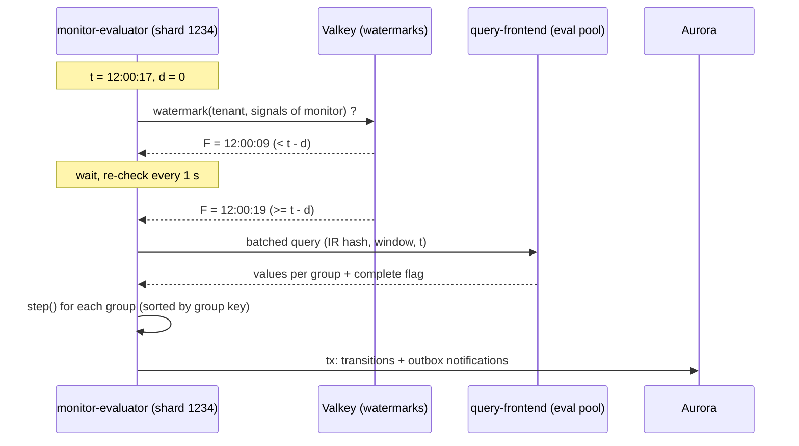

# Monitors and Alerting: Datadog

モニターを決める。モニターの種類と定義のバージョン、数百万のモニターの評価の予定、取り込みの水位の待ち、グループごとの評価（マルチアラート）、状態の機械（回復の閾値、続けての回数、データなし、不完全）、フラッピングの抑えと再通知、ミュートとダウンタイム、複合モニター、遷移の記録と再生を扱う。

前提となる決定は次のとおり。

- 決まった時刻の評価、シャードとリース、水位を待つ、待ちの上限 5 分で「不完全」、不完全ではデータなしと回復に遷移しない、遷移と通知の依頼を 1 つのトランザクションで、入力の写し、5 分ごとのスナップショット、10 分までの抜けを追う（[ADR-0008](../decisions/0008-monitor-evaluation-model.md)）
- モニターのクエリは IR を通し、ダッシュボードと同じエンジンで実行する。「不完全」の印（[ADR-0007](../decisions/0007-query-language.md)）
- 評価は別のクエリの読み手の組で、組織ごとの評価の量の上限（[ADR-0003](../decisions/0003-tenancy-cells-and-isolation.md)）
- フラッピングは 30 分に 6 回を超える遷移、通知を 1 回にまとめる（[architecture/README.md](README.md) の 6 節の決定）
- 通知の送り方は [notifications-and-integrations.md](notifications-and-integrations.md)。SLO のバーンレートのモニターは [slos-and-incidents.md](slos-and-incidents.md)

この文書で決めたことは次の ADR にある。

| ADR | 決定 |
| --- | --- |
| [0041](../decisions/0041-monitor-state-machine.md) | グループごとの状態の遷移を、1 つの純粋な関数 `step(定義, 前の状態, 評価の結果, t)` にし、決定表の行で定める。閾値はヒステリシス（回復の閾値）と、悪くなる向き・良くなる向きの続けての回数で決める。データなしは完全な評価でだけ、方針（通知・0 とみなす・保つ・OK とみなす）で決める。遷移の番号はグループごとに 1 ずつ増やす |
| [0042](../decisions/0042-flapping-and-renotify.md) | フラッピング（30 分に 6 回を超える遷移）と再通知は、状態を変えず、遷移の記録の上の「通知の判断」の段で決める。フラッピングの間は始まりの 1 回だけ知らせ、30 分遷移がなければ終わりと今の状態を知らせる。再通知は状態・間隔・回数の上限で決め、評価の時刻 `t` だけで判断する |
| [0043](../decisions/0043-downtimes-as-evaluation-input.md) | ミュートとダウンタイムは、評価の入力（組織のダウンタイムの設定のバージョン）として扱い、状態は進め、通知だけを抑える。繰り返しは RRULE と時間帯で展開する。終わったときに通知の要る状態が続いていれば知らせる。抑えた遷移も記録する |
| [0044](../decisions/0044-composite-monitors.md) | 複合モニターは子のモニター（10 まで、複合を含まない）の遷移の記録から、評価の時刻 `t` での状態を読み、`AND`・`OR`・`NOT` を 3 値の論理（データなしを不明）で求める。子の評価がすべて `t` まで済むのを待つ。マルチアラートのグループは、タグの鍵と値の組が同じものどうしで合わせる |

## 1. 範囲

- 扱う：
  - モニターの種類（メトリクス、ログ、APM、複合）と定義のバージョン
  - 評価の予定、シャード、同じクエリのまとめ、水位の待ち
  - グループごとの評価と状態の機械、決定表
  - データなし、グループの保持、新しいグループの待ち
  - フラッピング、再通知
  - ミュート、ダウンタイム
  - 複合モニター
  - 遷移の記録、入力の写し、再生、シミュレーター
- 扱わない：
  - 通知のチャネル、本文の雛形、重ねない送信（[notifications-and-integrations.md](notifications-and-integrations.md)）
  - クエリの意味と実行（[metrics-query-engine.md](metrics-query-engine.md)、[log-storage-and-search.md](log-storage-and-search.md)）
  - 水位の計測の仕組み（インジェスター・インデクサー・組み立ての側。[tsdb-storage-engine.md](tsdb-storage-engine.md)、[log-storage-and-search.md](log-storage-and-search.md)、[traces-and-sampling.md](traces-and-sampling.md)）。ここでは使い方を決める
  - 異常検知・予測のモニター（MVP の後）
  - SLO とバーンレート（[slos-and-incidents.md](slos-and-incidents.md)）。評価はこの文書の仕組みで行う

## 2. 要件

| 要件 | 目標 | NFR |
| --- | --- | --- |
| 評価の遅れ | 予定の時刻 `t`（＋評価の遅らせ）から評価の完了まで p99 30 秒（水位が正常なとき） | NFR-004 |
| 通知まで | 遷移から通知の送信まで p95 10 秒 | NFR-004 |
| 誤ったデータなし | 本システムの遅れによるデータなし・回復の通知 0 件 | NFR-004、K4 |
| 決定性 | 同じ定義・入力・前の状態・`t` から同じ遷移。再生の不一致 0 件 | [ADR-0008](../decisions/0008-monitor-evaluation-model.md)、K4 |
| 規模 | S1 でモニター 50 万、グループ 1,000 万、評価のクエリ 2,000 件/秒 | architecture/README.md の 2 節 |
| 可用性 | 評価と通知 月間 99.95%。10 分を超える抜け 0 を目標 | NFR-006 |
| 分離 | 1 つの組織の重いモニターで、他の組織の評価の遅れが p99 30 秒を超えない | NFR-007 |

## 3. 本家の形（確かめたこと）

- 評価の窓（1 分〜48 時間、メトリクスは 1 か月まで）、評価の頻度（24 時間未満の窓は 1 分、48 時間未満は 10 分、それ以上は 30 分）、評価の遅らせ（最大 86,400 秒）、データなしの扱いの選択肢、マルチアラート、グループの保持（既定 24 時間）、回復の閾値（[Monitor Configuration](https://docs.datadoghq.com/monitors/configuration/)、2026-10-09 に確認）。
- 再通知は、間隔と、対象の状態（`alert`・`no data`・`warn`）と、回数の上限を選べる。`{{#is_renotify}}` の節の文を元の本文に足す（[Notifications](https://docs.datadoghq.com/monitors/notify/)、2026-10-09 に確認）。
- ダウンタイムは、モニターの選び方とグループの範囲（タグの条件）を持ち、繰り返しは iCalendar の RRULE。ダウンタイムの間も状態は変わり、通知だけを抑える。終わったときに通知の要る状態（ALERT・WARNING・NO DATA）なら既定で知らせる。ダウンタイムの前に鳴って間に回復したら、最初の回復の通知は既定で送る（[Downtimes](https://docs.datadoghq.com/monitors/downtimes/)、2026-10-09 に確認）。
- 複合モニターは 10 までの子（複合は含めない）を `&&`・`||`・`!` で組む。データなしの子は、`!A` もデータなしになる。マルチアラートの子は、共通のグループだけを評価し、合わせはタグの鍵ではなく値で行う（[Composite Monitor](https://docs.datadoghq.com/monitors/types/composite/)、2026-10-09 に確認）。
- フラッピングの判定の規則、グループの数の上限、再通知の間隔の選択肢は、確かめなかった（**未検証**）。

## 4. モニターの種類と定義

### 4.1 種類

| 種類 | クエリ | 例 |
| --- | --- | --- |
| `metric` | メトリクスのクエリ（IR）を評価の窓で 1 つの値に畳む（`avg`・`sum`・`min`・`max`・`last`・`pNN`） | `avg(last_5m):avg:system.cpu.user{env:prod} by {host} > 90` |
| `metric_change` | 窓の値と、`Δ` 前の同じ窓の値の差（絶対・割合） | 1 時間前より 50% 増えた |
| `log` | ログの検索の件数・集計（索引に入ったログ）を評価の窓で | `count(last_5m):service:checkout status:error > 100` |
| `apm` | RED メトリクス（`<brand>.apm.*`）のメトリクスのモニター。エラーの率・p99 の雛形を持つ | `errors / requests > 0.05` |
| `composite` | 子のモニターの論理式（10 節） | `a && !b` |
| `slo_burn_rate` | [slos-and-incidents.md](slos-and-incidents.md) | — |

- ログのモニターは索引に入ったログだけを見る。除外・上限で索引に入らないログを見張るときは、ログから作るメトリクスのモニターにする（[logs-pipeline.md](logs-pipeline.md) の 10 節）。画面で案内する。

### 4.2 定義

| 項目 | 既定 | 範囲 |
| --- | --- | --- |
| クエリ（IR）、グループのタグ | — | グループのタグは 4 つまで |
| 比べ（`>`・`>=`・`<`・`<=`）、`critical`、`warning`、`critical_recovery`、`warning_recovery` | 回復の閾値なし | `>` 系では `warning < critical`、`critical_recovery < critical`、`warning_recovery < warning`（`<` 系は逆）。保存のときに確かめる |
| 評価の窓 `w` | 5 分 | 1 分〜48 時間 |
| 評価の遅らせ `d` | 0 | 0〜24 時間 |
| 評価の頻度 | [ADR-0008](../decisions/0008-monitor-evaluation-model.md) の規則（1 分、24 時間以上 10 分、48 時間で 30 分） | — |
| `trigger_after`（悪くなる向きの続けての回数）、`recover_after`（良くなる向き） | 1、1 | 1〜10 |
| `require_full_window` | ログ・`count` は偽、他は偽 | 疎な系列で窓の全体にデータがあるときだけ評価する |
| データなしの方針と時間 | 通知、`max(2w, 10 分)` | 通知・0 とみなす・保つ・OK とみなす。時間は 2 分〜48 時間 |
| グループの保持 | 24 時間 | 1〜72 時間 |
| 新しいグループの待ち | 60 秒 | 0〜30 分 |
| 再通知 | なし | 8 節 |
| 本文の雛形、通知の先、優先度、タグ | — | [notifications-and-integrations.md](notifications-and-integrations.md) |
| 評価の主体 | 作った人の役割 | データのアクセスの制限はこの役割のものを IR に足す |

- 定義を保存するたびに `monitor_versions` に新しいバージョンを書く（不変）。評価は `t` の時点で有効なバージョンを使い、遷移の記録にバージョンを書く。
- バージョンの切り替えの決まり：クエリ（IR）かグループのタグが変わったら、グループの状態を捨てて新しく始める（`definition_reset` を記録し、通知しない）。閾値・回数・方針だけが変わったら、状態を保って次の評価から新しい値で判断する。

### 4.3 評価の主体と制限

- モニターのクエリには、評価の主体（既定は作った人の役割、組織の管理者はサービスのアカウントを選べる）のデータのアクセスの制限を IR に足す（[ADR-0007](../decisions/0007-query-language.md)）。作った人が組織を去っても、主体の役割で評価を続ける（[tenancy-and-rbac.md](tenancy-and-rbac.md)）。
- 通知の本文に入る値とグループのタグは、この主体が見られるものだけ（[notifications-and-integrations.md](notifications-and-integrations.md) の 6 節）。

## 5. 評価の予定

[ADR-0008](../decisions/0008-monitor-evaluation-model.md)。

### 5.1 シャード

- 仮想のシャードを 4,096 にし、`xxh3(tenant_id ‖ monitor_id) mod 4096` で割り当てる。シャードの持ち主は Aurora の `eval_shard_leases`（リース 30 秒、10 秒ごとに延長）で決める。
- `monitor-evaluator` のタスクは、受け持つシャードの数がタスクの間で均等になるように、空いたシャードのリースを取る。S1 でタスク 32 なら 1 タスク 128 シャード、1 シャード 約 122 モニター。
- 持ち主が変わったら、新しい持ち主がスナップショット（5 分ごと）とその後の遷移を読み、抜けた時刻を 10 分まで追う（[ADR-0008](../decisions/0008-monitor-evaluation-model.md)）。

### 5.2 評価の時刻

- モニターの評価の時刻：`t = k × 頻度 + offset`。`offset = xxh3(monitor_id) mod 頻度`（秒）。モニターの評価が分の中に散り、毎分 0 秒の山ができない。
- シャードごとに、次の評価の時刻のタイマーホイール（1 秒の目盛り）を持つ。
- 例：頻度 60 秒、`offset = 17` のモニターは、12:00:17、12:01:17、… に評価する。窓 5 分・遅らせ 0 なら、12:00:17 のデータの窓は `[11:55:17, 12:00:17)`。

### 5.3 水位の待ち



- 水位 `F` は、モニターのクエリが読む信号（メトリクス、ログ、`derived-metrics`）ごとに、組織のパーティションのすべてで「取り込みの時刻が `F` 以前のものは反映済み」の最大の時刻（[ADR-0008](../decisions/0008-monitor-evaluation-model.md)）。パーティションの水位 `F_p` は、ゲートウェイの水位の刻みから決まる（[ADR-0011](../decisions/0011-intake-gateway-pipeline-and-watermark-ticks.md)）。`query-frontend` が組織ごと・信号ごとに 1 秒ごとに求め、Valkey に置く。
- 複数の信号を読むモニター（ログとメトリクスの式）は、信号ごとの水位の最小を使う。
- `F ≥ t − d` で評価する。待ちが 5 分を超えたら「不完全」で評価する。クエリの応答の「不完全」の印も同じに扱う。
- 例：12:00:17 の評価で、ふだんの水位の遅れ（p95 10 秒）なら 12:00:27 ごろに `F` が届き、12:00:30 ごろに完了する（遅れ 13 秒）。インジェスターの再起動で水位が 3 分止まれば、評価は 12:03:20 ごろにずれるが、データなし・回復は出ない。

### 5.4 同じクエリのまとめ

- 同じ組織で、（IR のハッシュ、窓、遅らせ、`t`）が同じモニターの評価を、1 つのクエリにまとめる（閾値だけが違うモニター）。シャードの中でまとめ、シャードをまたいではまとめない。まとめの効き（シャードの中で同じ IR に当たる割合）は E7 の負荷試験で測る。
- 評価のクエリは、ダッシュボードと別のクエリの読み手の組で実行する（[ADR-0003](../decisions/0003-tenancy-cells-and-isolation.md)）。

### 5.5 組織の上限と公平

- 組織ごとの評価の量の上限は、1 分あたりの評価のクエリの費用（[metrics-query-engine.md](metrics-query-engine.md) の費用の見積もり）で持つ。超えた組織のモニターは、評価を遅らせる（`t` を飛ばさず、遅れて評価する）。遅れは組織の画面とモニターの状態に出す。
- タスクの中では、組織ごとの重み付きの公平なキューで、クエリの実行の枠を配る。

## 6. 1 回の評価

1. クエリの結果：グループの鍵（グループのタグの値の組を並べたもの）→ 値の時系列と、`complete` の印。
2. グループごとに、窓の時系列を 1 つの値 `v` に畳む（`avg`・`sum`・`min`・`max`・`last`・`pNN`）。窓に点がなければ「値なし」。`require_full_window` なら、窓の全体の区間に点がないときも「値なし（窓の不足）」として、データなしの時間には数えない。
3. グループを鍵の順に並べ、7 節の `step()` を当てる。
4. 遷移と通知の判断（8・9 節）を集め、Aurora の 1 つのトランザクションで書く。
5. 入力の写し（遷移のあったグループの値と、1% の抜き取り）を S3 の評価の記録のバッファーに足す。

## 7. 状態の機械

[ADR-0041](../decisions/0041-monitor-state-machine.md)。

### 7.1 グループの状態

| 項目 | 意味 |
| --- | --- |
| `state` | `OK`・`WARN`・`ALERT`・`NO_DATA` |
| `since` | 今の状態になった `t` |
| `seq` | 遷移の番号（グループごとに 1 ずつ増える） |
| `pending`、`pending_count` | 続けての回数を数えている途中の行き先と回数 |
| `last_value_t` | 最後に値のあった `t` |
| `first_seen_t` | グループが最初に見えた `t` |
| `transitions_30m` | 直近 30 分の遷移の `t` の並び（フラッピング用） |
| `flapping` | 真偽（8 節） |
| `last_notified_t`、`last_notified_state`、`renotify_count` | 通知の判断用（8 節） |

### 7.2 値から行き先を決める

比べが `>` のとき（`<` 系は向きを逆にする）。`CR` は `critical_recovery`（なければ `critical`）、`WR` は `warning_recovery`（なければ `warning`）。

```
target(prev, v):
  if prev == ALERT and v > CR:              return ALERT     # stay until recovered
  if v > critical:                          return ALERT
  if warning is set:
    if prev in (ALERT, WARN) and v > WR:    return WARN
    if v > warning:                         return WARN
  return OK
```

- 「回復」は、ALERT から出るには `v ≤ CR`、WARN から出るには `v ≤ WR` が要る（ヒステリシス）。

### 7.3 決定表

`complete` は完全な評価、`absent_for` は値のない時間（`t − last_value_t`）、`ND` はデータなしの時間。「悪くなる」は OK → WARN → ALERT の向き。

| # | 前の状態 | 評価 | 値 | 条件 | 次の状態 |
| --- | --- | --- | --- | --- | --- |
| 1 | なし（新しいグループ） | 任意 | あり | `t − first_seen_t < 新しいグループの待ち` | 評価しない |
| 2 | なし | 任意 | あり | 待ちを過ぎた | `target(OK, v)` を続けての回数なしで当てる |
| 3 | OK・WARN・ALERT | 完全・不完全 | あり | `target` が今より悪い | `pending_count + 1 ≥ trigger_after` なら `target`、それまでは保つ |
| 4 | OK・WARN・ALERT | 完全 | あり | `target` が今より良い | `pending_count + 1 ≥ recover_after` なら `target`、それまでは保つ |
| 5 | OK・WARN・ALERT | 不完全 | あり | `target` が今より良い | 保つ（回復しない）。`pending` を進めない |
| 6 | OK・WARN・ALERT | 任意 | あり | `target` が今と同じ | 保つ。`pending` を消す |
| 7 | OK・WARN・ALERT | 完全 | なし | `absent_for < ND` | 保つ |
| 8 | OK・WARN・ALERT | 完全 | なし | `absent_for ≥ ND`、方針＝通知 | `NO_DATA` |
| 9 | OK・WARN・ALERT | 完全 | なし | 方針＝0 とみなす | `v = 0` として 3・4・6 |
| 10 | OK・WARN・ALERT | 完全 | なし | `absent_for ≥ ND`、方針＝保つ | 保つ |
| 11 | OK・WARN・ALERT | 完全 | なし | `absent_for ≥ ND`、方針＝OK とみなす | `OK` |
| 12 | 任意 | 不完全 | なし | — | 保つ（データなしにしない） |
| 13 | `NO_DATA` | 任意 | あり | — | `target(OK, v)` を続けての回数なしで当てる（悪くなる向きなら不完全でも当てる、OK への戻りは完全な評価でだけ） |
| 14 | 任意 | 任意 | なし | `absent_for ≥ グループの保持` | グループを消す（`group_removed` を記録、通知しない） |
| 15 | 任意 | 評価の失敗 | — | クエリの誤り | 保つ（12 節） |

- `pending` は行き先が変わったら 1 から数え直す。
- 「保つ」でも、7.1 節の `last_value_t` などは更新する。
- 方針＝0 とみなすは、`count` 系のクエリ（エラーの数）で「来ない＝0 件」の意味のときに使う。

### 7.4 例

`avg(last_5m):avg:system.cpu.user{env:prod} by {host} > 90`、`warning 80`、`critical_recovery 85`、`trigger_after 2`、`recover_after 1`。`host:web-1` の値。

| `t` | 評価 | `v` | `target` | 判断（決定表の行） | 状態 | `seq` |
| --- | --- | --- | --- | --- | --- | --- |
| 12:00 | 完全 | 70 | OK | 6 | OK | 0 |
| 12:01 | 完全 | 92 | ALERT | 3（1 回目、`trigger_after 2` に届かない） | OK | 0 |
| 12:02 | 完全 | 93 | ALERT | 3（2 回目） | **ALERT** | 1 |
| 12:03 | 完全 | 88 | ALERT（`88 > 85`） | 6 | ALERT | 1 |
| 12:04 | 不完全 | 82 | WARN | 5（不完全で回復しない） | ALERT | 1 |
| 12:05 | 完全 | 84 | WARN（`84 ≤ 85`、`84 > 80`） | 4 | **WARN** | 2 |
| 12:06〜12:14 | 完全 | 値なし | — | 7（`ND = max(2 × 5 分, 10 分) = 10 分` に届くまで） | WARN | 2 |
| 12:15 | 完全 | 値なし | — | 8（`absent_for = 12:15 − 12:05 = 10 分`） | **NO_DATA** | 3 |

## 8. フラッピングと再通知

[ADR-0042](../decisions/0042-flapping-and-renotify.md)。状態の機械（7 節）は変えず、遷移の記録の上で「通知を出すか」を決める段に置く。

### 8.1 フラッピング

- グループの `transitions_30m`（`t − 30 分` より後の遷移）が 6 を超えたら（7 回目の遷移で）`flapping = true` にする。その遷移で「フラッピングが始まった」を 1 回知らせ、以後の遷移の通知を出さない（遷移は記録する）。
- 直近 30 分に遷移がなくなったら `flapping = false` にし、「フラッピングが終わった」と今の状態を 1 回知らせる（最後に知らせた状態と同じなら、終わりだけ）。
- 例：閾値の周りで 12:00〜12:20 に OK と ALERT を 4 分ごとに行き来すると、12:24 の 7 回目の遷移で始まりを知らせ、最後の遷移が 12:40 なら 13:10 に終わりと今の状態を知らせる。

### 8.2 再通知

- 定義：間隔（評価の頻度の倍数、10 分〜24 時間）、対象の状態（`ALERT`・`NO_DATA`・`WARN` の組）、回数の上限（なし、1〜100）。
- グループの状態が対象で、`t − last_notified_t ≥ 間隔` で、`renotify_count < 上限` で、フラッピング・ミュートでなければ、再通知を出す。状態は変えない。遷移の記録に `renotify` の行（`seq` と再通知の番号）を書き、通知の重ねない鍵にする（[notifications-and-integrations.md](notifications-and-integrations.md)）。
- 状態が変わったら `renotify_count` を 0 に戻す。
- 判断は `t` だけで行い、壁の時計を使わない。

## 9. ミュートとダウンタイム

[ADR-0043](../decisions/0043-downtimes-as-evaluation-input.md)。

### 9.1 定義

| 項目 | 内容 |
| --- | --- |
| モニターの選び方 | モニターの ID の並び、またはモニターのタグの条件（`team:payments`） |
| グループの範囲 | グループのタグの条件（`env:prod AND host:web-*`）。`*` はすべて。入れ子 2 段まで |
| 予定 | 1 回（始まり、終わり）か繰り返し（RRULE と、1 回の長さ、時間帯。既定 `Asia/Tokyo`）。繰り返しの終わりの日か回数 |
| 終わりの通知 | 終わったときに知らせる状態（既定 ALERT・WARN・NO_DATA） |
| 間の回復の通知 | ダウンタイムの前に知らせた ALERT が間に回復したとき、最初の回復を知らせる（既定 する） |

- ミュート（画面のボタン）は、1 つのモニターかグループを範囲にした、終わりの任意なダウンタイムとして同じ表に持つ。

### 9.2 評価での扱い

- 組織のダウンタイムの集まりは、変更のたびにバージョン（`downtime_set_version`）を上げ、outbox で評価器に配る。評価器は、`t` の評価に使ったバージョンを遷移の記録に書く。再生は同じバージョンで行う。
- `active(グループ, t)`：グループがどれかのダウンタイムの選び方と範囲に合い、`t` がその予定の中。
- ダウンタイムの間も 7 節の状態の機械は動く。遷移を記録し、`muted = true` を付け、通知を出さない（通知の依頼の行を `suppressed` で書き、画面と監査で見える）。再通知も出さない。
- 終わり：`active` が真から偽になった最初の評価で、状態が「終わりの通知」の対象で、その状態をまだ知らせていなければ知らせる。
- 間の回復：ダウンタイムの前に ALERT を知らせたグループが、間に OK へ遷移したら、最初の 1 回だけ回復を知らせる（設定で止められる）。2 回目以降の遷移は抑える。

### 9.3 例

`host:web-1` のモニターに、毎週日曜 2:00〜4:00（`Asia/Tokyo`）の繰り返しのダウンタイム。

| 時刻 | 出来事 | 通知 |
| --- | --- | --- |
| 日 1:50 | ALERT へ遷移 | 知らせる |
| 日 2:30 | OK へ遷移（間の回復） | 最初の回復なので知らせる |
| 日 3:00 | ALERT へ遷移 | 抑える（`muted`） |
| 日 4:00 | ダウンタイムの終わり。状態は ALERT で、まだ知らせていない | 知らせる |

## 10. 複合モニター

[ADR-0044](../decisions/0044-composite-monitors.md)。

- 子は 10 まで。複合を子にできない（循環しない）。子は同じ組織のモニター。式は `a`・`b` のラベルと `&&`・`||`・`!`・括弧。
- 評価の時刻 `t` の複合の値は、各子の「`t` 以前の最後の評価の時刻での状態」から求める。子の状態は遷移の記録（`monitor_transitions`）から読む（最後の遷移の状態）。
- 子の評価が `t` まで済んだ（子の `evaluated_through ≥ t`）のを待つ。`evaluated_through` は評価器がモニターごとに Valkey に書き、5 分ごとのスナップショットにも残す。待ちの上限は 5 分で、超えたら「不完全」として扱う（7.3 節の不完全の行）。
- 3 値の論理：子の `ALERT` を真、`OK` を偽、`NO_DATA` と不明を不明（U）とする。`WARN` は既定で偽（設定で真にできる）。

| A | B | `A && B` | `A \|\| B` | `!A` |
| --- | --- | --- | --- | --- |
| 真 | U | U | 真 | 偽 |
| 偽 | U | 偽 | U | 真 |
| U | U | U | U | U |

- 結果が真なら ALERT、偽なら OK、不明ならデータなしの扱い（複合の方針：既定は「保つ」）に従う。複合の状態の遷移は 7 節と同じ `step()` を通す（値を 1・0 とし、閾値を 0.5 とする）。
- マルチアラートの子：グループの鍵（タグの鍵と値の組）が同じものどうしで合わせる。子のグループのタグが違うとき（`host` と `host,service`）、少ない方のタグの組を共通の鍵にし、多い方の子は共通の鍵ごとに「どれかのグループが ALERT なら ALERT」に畳む。共通のタグがなければ保存のときに拒む。本家はタグの値だけで合わせる（3 節）。本システムは鍵と値の組で合わせる（意図した違い。`host:web04` と `service:web04` を同じにしない）。

## 11. 遷移の記録と再生

[ADR-0008](../decisions/0008-monitor-evaluation-model.md) を細かくする。

- `monitor_transitions`（Aurora、月ごとに分ける）：（組織、モニター、グループ、`seq`）、種類（`transition`・`renotify`・`flapping_start`・`flapping_end`・`downtime_end`・`group_removed`・`definition_reset`）、前と後の状態、`t`、定義のバージョン、`downtime_set_version`、`muted`、値、評価の完全さ、入力の写しの位置（S3 のキーとオフセット）。
- 通知の依頼（outbox）は同じトランザクションで書く。重ねない鍵は（モニター、グループ、`seq`、種類、再通知の番号）。
- 入力の写し：`<cell>/<tenant_id>/evals/eval-30d/<yyyy>/<mm>/<dd>/<hh>/<shard>.rec`。1 分ごとにシャードのバッファーを書く。
- スナップショット：シャードの全グループの 7.1 節の状態を 5 分ごとに S3 に。持ち主の交代と、再生の始まりに使う。
- **再生**：`monitor-replay` が、スナップショット、入力の写し、定義のバージョン、ダウンタイムのバージョンから `step()` を当て直し、遷移の記録と比べる。CI は本番の抜き取り（値を含むので組織の同意の範囲は [security.md](security.md)。CI に持ち込むのは、値を合成の値に置き換えても同じ遷移になる形にしたもの）で、本番は毎日の抜き取りで回す（[quality.md](../quality.md) の 4.2 節）。
- 画面の「なぜ鳴ったか」：遷移の行から、入力の写しの値、閾値、決定表の行の番号を見せる。

## 12. 評価の失敗

- クエリの誤り（構文の誤りではなく、実行の誤り・時間切れ）は、状態を保ち（決定表の 15）、`eval_failed` を数える。
- 同じモニターが 10 回続けて失敗したら、モニターの持ち主に「評価できない」を知らせる（遷移ではない、1 日 1 回まで）。
- 費用の上限で拒まれたクエリ（[metrics-query-engine.md](metrics-query-engine.md)）は、保存のときにも見積もり、上限を超えるモニターの保存を拒む。

## 13. 上限

| 対象 | 上限（既定） | 超えたとき |
| --- | --- | --- |
| 組織のモニター | 5,000（S1 の平均 500） | 保存を拒む（契約で引き上げる） |
| 1 つのモニターのグループ | 10,000 | 鍵の順で最初の 10,000 だけを評価し、`group_limit_exceeded` を持ち主に知らせる |
| グループのタグ | 4 | 保存を拒む |
| 複合の子 | 10 | 同上 |
| ダウンタイム | 組織 1,000（繰り返しを含む） | 同上 |
| 評価の窓、遅らせ | 4.2 節 | 同上 |
| 再通知の間隔 | 10 分以上 | 同上 |
| 本文の雛形 | [notifications-and-integrations.md](notifications-and-integrations.md) | — |

## 14. 障害のときの振る舞い

| 事象 | 起きること | 備え |
| --- | --- | --- |
| 取り込み・インジェスターの遅れ | 水位が止まる | 評価を待つ。5 分で不完全。データなし・回復を出さない（5.3 節） |
| `monitor-evaluator` のタスクが落ちる | 受け持ちのシャードの評価が止まる | リースの切れ（30 秒）で他のタスクが取り、スナップショットから続け、10 分まで追う |
| Aurora の書き込みの失敗 | 遷移を書けない | 評価をやり直す（同じ `t`、同じ結果）。書けるまで次の `t` へ進まない。遅れは評価の遅れの SLI に出る |
| Valkey が落ちる | 水位と `evaluated_through` を読めない | `query-frontend` に水位を直接問う。複合は Aurora の遷移の記録とスナップショットで待つ |
| クエリの読み手の組の過負荷 | 評価が遅れる | 組織ごとの公平なキュー。遅れの大きい組織を画面に出す |
| 10 分を超える抜け | 追わない | 抜けとして記録し、SLI にする（[runbooks/](../runbooks/README.md) の評価と通知の可用性） |

- 本システム自身の監視には、このモニターを使わない（[runbooks/](../runbooks/README.md) の 5 節）。

## 15. data-model への項目

| 表・置き場 | 中身 | 主キー・索引 | 節 |
| --- | --- | --- | --- |
| `monitors`（組織の表） | 名前、種類、今のバージョン、持ち主、評価の主体、タグ、作成・削除 | `(tenant_id, monitor_id)` | 4 |
| `monitor_versions`（組織の表） | 4.2 節の定義（JSON）、IR のハッシュ | `(tenant_id, monitor_id, version)` | 4.2 |
| `monitor_transitions`（組織の表、月ごと） | 11 節の列 | `(tenant_id, monitor_id, group_key, seq, kind, renotify_n)`、`(tenant_id, t)` | 7、8、11 |
| `eval_shard_leases`（RLS の外、X2 の経路） | シャード、持ち主のタスク、期限 | `(cell, shard)` | 5.1 |
| `downtimes`（組織の表） | 9.1 節の定義、バージョン | `(tenant_id, downtime_id)` | 9 |
| `downtime_set_versions`（組織の表） | 組織のダウンタイムの集まりのバージョン | `(tenant_id, version)` | 9.2 |
| `composite_children`（組織の表） | 複合と子、ラベル | `(tenant_id, composite_id, label)` | 10 |
| Valkey | `wm:{tenant}:{signal}`（水位）、`evaluated_through:{tenant}:{monitor}` | 失ってよい | 5.3、10 |
| S3 | `<cell>/<tenant_id>/evals/eval-30d/...`（入力の写し）、`<cell>/evals/snapshots/<shard>/...` | — | 11 |

- `eval_shard_leases` は組織をまたぐので、統合の工程で [ADR-0003](../decisions/0003-tenancy-cells-and-isolation.md) の RLS の外の表の一覧（保守のスキーマ `maint`）に足した。

## 16. テスト

- **PROP-MON-001（本システムの遅れで誤らない）**：任意の場面で、水位が遅れている間・不完全の評価で、データなしと回復（ALERT・WARN から良くなる向き）の遷移が出ない（[quality.md](../quality.md) の 2.2.1 節 D）。
- **PROP-MON-002（決定性）**：同じ定義・入力・前の状態・`t` で同じ遷移。グループの処理の順序を入れ替えても同じ。
- **PROP-MON-003（持ち主の交代）**：任意の時刻で交代しても、10 分までの抜けなら、交代のない場合と同じ遷移の列。
- **PROP-MON-004（通知の重複 0）**：outbox の読み直しを含め、同じ遷移・同じ再通知の通知が 2 回作られない。
- **PROP-MON-005（フラッピング）**：30 分に 6 回を超える遷移で、始まりの通知が 1 回、間の通知 0、終わりの通知が 1 回。
- **PROP-MON-006（ダウンタイム）**：ダウンタイムの間の遷移の通知が出ない（最初の回復を除く）。終わりに通知の要る状態なら 1 回出る。状態の列はダウンタイムのない場合と同じ。
- **PROP-MON-007（複合）**：子の状態の任意の列で、複合の値が 3 値の論理の参照と一致する。子の評価を待つので、子の遷移の後に古い状態で評価しない。
- **決定表**：7.3 節の全行と、7.2 節の閾値の境界（`v = critical`、`v = CR`）。
- **シミュレーター**：`monitor-sim` で、PR 1 万の場面、夜間 100 万の場面（[quality.md](../quality.md) の 2.2.1 節 D）。生成器に、回復の閾値、続けての回数、データなしの方針、ダウンタイム、複合を入れる。
- **再生**：本番の評価の記録の抜き取りの再生で、不一致 0。
- **負荷**：S1 のモニター 50 万・グループ 1,000 万・評価のクエリ 2,000 件/秒で、評価の遅れ p99 30 秒（E13）。

## 17. Story の候補

| Epic | Story | 中身 |
| --- | --- | --- |
| E7 | `ingest-watermarks` | 5.3 節（信号ごと・組織ごとの水位、Valkey） |
| E7 | `monitor-definitions` | 4 節（種類、バージョン、切り替えの決まり） |
| E7 | `evaluator-sharding` | 5 節（シャード、時刻、まとめ、公平） |
| E7 | `monitor-state-machine` | 6・7 節（ADR-0041。決定表、PROP-MON-001・002） |
| E7 | `flapping-and-renotify`（新しい Story の提案） | 8 節（ADR-0042。PROP-MON-005） |
| E7 | `transitions-and-outbox` | 11 節（PROP-MON-004） |
| E7 | `evaluation-records-and-replay` | 11 節（PROP-MON-003、再生） |
| E7 | `mute-and-downtime` | 9 節（ADR-0043。PROP-MON-006） |
| E7 | `composite-monitors`（新しい Story の提案） | 10 節（ADR-0044。PROP-MON-007） |
| E7 | `monitor-simulator` | 16 節のシミュレーター |

## 18. 未解決の問い

### 決定

2026-10-09 の既定案。

- **状態の機械**：純粋な関数 `step()` と決定表、ヒステリシス、続けての回数（ADR-0041）。
- **フラッピングと再通知**：通知の判断の段で、状態を変えない（ADR-0042）。
- **ダウンタイム**：評価の入力のバージョン、状態は進め通知だけを抑える（ADR-0043）。
- **複合**：子の遷移の記録から 3 値の論理、子の評価を待つ、鍵と値の組で合わせる（ADR-0044）。
- **ログのモニター**：索引に入ったログだけ。
- **グループの上限**：1 モニター 10,000。

### 持ち越し

| 問い | いつ・どう決めるか |
| --- | --- |
| 同じクエリのまとめの効き（シャードの中だけで足りるか） | E7 の負荷試験で測る |
| 再生の CI への持ち込みの範囲（本番の値） | security の領域で決める |
| 本家との違い（複合のグループを鍵と値の組で合わせる、ログのモニターは索引だけ） | 統合の工程で、複合の合わせ方を 1.4 節の「意図した違い」に足した。ログのモニターは本家も索引に入ったログだけを評価する（[Log Monitor](https://docs.datadoghq.com/monitors/types/log/)、2026-10-09 に確認）ので、違いではない。1.4 節の「確かめたこと」に足した |
| 本家のフラッピングの判定、グループの上限、再通知の間隔の選択肢 | 公式の資料で確かめなかった（**未検証**） |
| 異常検知・予測のモニター | MVP の後（intent） |
