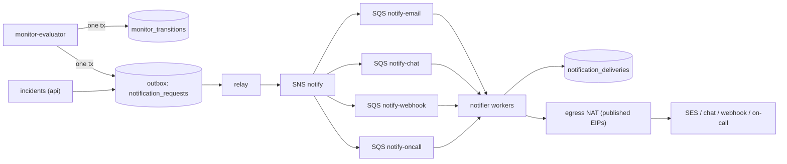
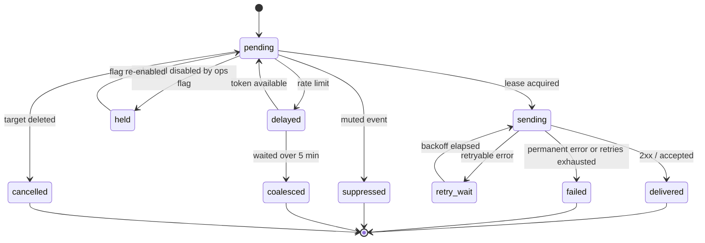

# Notifications and Integrations: Datadog

通知と外部の連携を決める。通知の依頼から送信までの流れ、チャネル（メール、チャット、汎用の Webhook、オンコールのサービス）、本文の雛形、重ねない仕組み、束ねと速さの上限、再試行、送信の記録、Webhook の署名、egress を扱う。

前提となる決定は次のとおり。

- `notifier` は管理の面（TypeScript・Hono、Fargate）。outbox を `relay` が読み、専用の egress から送る。重ねずに少なくとも 1 回（[ADR-0001](../decisions/0001-platform-and-stack.md)、[architecture/README.md](README.md) の 1.2 節）
- 遷移と通知の依頼は Aurora の 1 つのトランザクションで書く。重ねない鍵は（モニター、グループ、遷移の番号）（[ADR-0008](../decisions/0008-monitor-evaluation-model.md)）。再通知とフラッピングの通知の種類（[ADR-0042](../decisions/0042-flapping-and-renotify.md)）、ダウンタイムで抑えた通知（[ADR-0043](../decisions/0043-downtimes-as-evaluation-input.md)）
- 通知は組織ごとの送信の速さの上限とチャネルごとの待ち行列（[ADR-0003](../decisions/0003-tenancy-cells-and-isolation.md)）
- 通知の本文に、通知の先の利用者の権限を超える値を入れない（[quality.md](../quality.md) の 2.2.1 節 G）
- 本システム自身の障害の呼び出しには、この経路を使わない（[runbooks/](../runbooks/README.md) の 5 節）
- 法務の確認待ち：L2（国外の通知の先へ送る本文）、L8（メールの扱い、電話・SMS）

この文書で決めたことは次の ADR にある。

| ADR | 決定 |
| --- | --- |
| [0045](../decisions/0045-notification-delivery-model.md) | 通知は、評価ごとの通知の依頼（outbox）→ チャネルの種類ごとの待ち行列 → 宛先ごとの送信の行、の 3 段で送る。送信の行は（依頼、宛先）で一意にし、リースで 1 つの作業者が送る。受け手には冪等の鍵（送信の ID、オンコールの重ねない鍵）を渡す。再試行は 8 回・約 1 時間 20 分の決まった表。宛先ごとの速さの上限を超えたら遅らせ、5 分を超えたらまとめの 1 通にする |
| [0046](../decisions/0046-notification-templates-and-webhook-signing.md) | 本文の雛形はロジックのない自前の雛形の言語で、遷移の写しの値だけから描き、チャネルごとに逃がす。既定ではログの抜粋・スパンの中身を入れない（L2 の後に決める）。Webhook は `<Brand>-Signature` に時刻と HMAC-SHA256 を入れる。外への接続では、私的なアドレス・メタデータのアドレスを拒み、リダイレクトを追わない |

## 1. 範囲

- 扱う：
  - 通知の依頼、待ち行列、送信の行、状態
  - チャネル（メール、Slack・Microsoft Teams の受信の Webhook、汎用の Webhook、オンコールのサービス）
  - 本文の雛形と変数、宛先の書き方
  - 重ねない仕組み、束ね、速さの上限、再試行
  - 送信の記録と画面
  - Webhook の署名、egress と SSRF の守り
  - オンコールのサービスとの発報と解決の同期
- 扱わない：
  - 通知を出すかの判断（フラッピング、再通知、ダウンタイム。[monitors-and-alerting.md](monitors-and-alerting.md)）
  - インシデントの通知の中身（[slos-and-incidents.md](slos-and-incidents.md)。送り方はこの文書）
  - 秘密（Webhook の秘密、オンコールのキー）の保管の方式（[security.md](security.md)）
  - egress のネットワークの構成（[infrastructure.md](infrastructure.md)）
  - 電話・SMS（MVP の後。法務の L8）

## 2. 要件

| 要件 | 目標 | NFR |
| --- | --- | --- |
| 通知まで | 遷移から送信（宛先の受け付け）まで p95 10 秒 | NFR-004 |
| 可用性 | 遷移のうち 10 秒以内に送信したもの 月間 99.95% | NFR-006、runbooks の評価と通知の可用性 |
| 重複 | 同じ遷移・同じ宛先への送信の行が 2 つできない。受け手に同じ冪等の鍵を渡す | quality.md の 2.2.1 節 D |
| 分離 | 1 つの組織の通知の嵐で、他の組織の通知が p95 10 秒を超えない | NFR-007 |
| 漏れ | 本文に、評価の主体の制限の外の値・他の組織の値が入らない | NFR-007 |
| 守り | Webhook の宛先から本システムの内部・メタデータのアドレスに届かない | security の領域 |

## 3. 本家の形（確かめたこと）

- 本文の雛形は二重の波括弧の変数（`{{host.name}}`）と、状態ごとの条件の節（`{{#is_alert}}`・`{{#is_warning}}`・`{{#is_renotify}}`）を持つ。節の中に宛先の @ を書くと、その状態のときだけ送る。再通知の文は `{{#is_renotify}}` の節に書き、元の本文に足す（[Notifications](https://docs.datadoghq.com/monitors/notify/)、2026-10-09 に確認）。
- 汎用の Webhook の署名の方式、チャネルごとの速さの上限、再試行の回数、オンコールのサービスとの解決の同期の方式は、確かめなかった（**未検証**）。
- Slack の受信の Webhook の速さの上限（1 秒 1 件程度）は、Slack の公式の資料で確かめなかった（**未検証**）。本システムは 1 秒 1 件を宛先の上限の既定にする。

## 4. 流れ

[ADR-0045](../decisions/0045-notification-delivery-model.md)。

1. `monitor-evaluator` は、1 つのモニターの 1 回の評価で出た通知の判断（遷移、再通知、フラッピング、ダウンタイムの終わり）を、1 つの通知の依頼（`notification_requests`、`request_key = (monitor, t)`）にまとめ、遷移と同じトランザクションで書く。依頼はグループごとの出来事の並び（グループのタグ、種類、前後の状態、`seq`、値、閾値）を持つ。抑えた出来事（`muted`）も `suppressed` として入れる（送らない）。
2. `relay` が outbox を読み、SNS に出す。SNS はチャネルの種類ごとの SQS に分ける（依頼の宛先の種類を属性に持ち、フィルターで分ける）。
3. `notifier` は依頼を受けると、モニターのバージョンの雛形から宛先を決め（6 節）、宛先ごとの送信の行を `INSERT ... ON CONFLICT DO NOTHING` で作る。行の鍵は（依頼、宛先、まとめの単位）。
4. 送信の行をリース（60 秒）で取り、描いて送る。結果を行に書く。
5. 組織の待ち行列の公平：SQS のメッセージは組織ごとのグループの ID（FIFO ではなく、`notifier` の中の組織ごとの待ち行列）で取り、組織ごとの同時の送信を契約の量から決める（既定 20）。1 つの組織の嵐は、その組織の待ち行列で詰まる。

## 5. 送信の行の状態

- `coalesced` の行は、まとめの 1 通（7.3 節）の行に紐づける。
- `held`：`ops.notifications_enabled` をチャネルで止めたとき。戻したとき、1 時間より古い `held` の行はまとめの 1 通にする（戻した瞬間の大量の送信を避ける）。
- 送信の行と試行（`notification_attempts`：時刻、結果の種類、状態のコード、遅れ）は 30 日持つ。応答の本文は保存しない。

## 6. 本文の雛形と宛先

[ADR-0046](../decisions/0046-notification-templates-and-webhook-signing.md)。

### 6.1 雛形の言語

- ロジックのない自前の雛形の言語。本家の雛形の考え方（二重の波括弧、状態の節）に寄せるが、エンジンは自前で作る。

| 書き方 | 意味 |
| --- | --- |
| `{{monitor.name}}` | 変数（チャネルごとに逃がす） |
| `{{#is_alert}}…{{/is_alert}}` | 状態の節。`is_alert`・`is_warning`・`is_no_data`・`is_recovery`・`is_renotify`・`is_flapping_start`・`is_flapping_end`・`is_downtime_end` |
| `{{^is_recovery}}…{{/is_recovery}}` | 否定の節 |
| `{{#is_match "group.env" "prod" "stg"}}…{{/is_match}}` | グループのタグの値の一致の節 |
| `@email:ops@example.com`、`@chat:<名前>`、`@webhook:<名前>`、`@oncall:<名前>`、`@team:<ハンドル>` | 宛先。節の中に書けば、その条件のときだけ |

- 変数：`monitor.id`・`.name`・`.url`・`.priority`・`.tags`、`group.<タグの鍵>`、`group.key`、`event.kind`、`event.from`・`event.to`、`event.t`（日本時間の ISO 8601）、`value`、`threshold.critical`・`.warning`、`window`、`query`（モニターのクエリの文字列）、`renotify.count`。
- 未定義の変数は空にし、保存のときに警告する。逃がさない出力（`{{{…}}}`）は持たない。
- 宛先は、保存のときに雛形を解析して、条件つきの宛先の一覧として `monitor_versions` に持つ。送るときは、出来事の種類とグループのタグで条件を当てて宛先を決める。

### 6.2 描くための入力

- 描く入力は、モニターのバージョンと、通知の依頼の出来事の写し（値、閾値、グループのタグ、時刻）だけ。描くときにクエリを実行しない。同じ入力からは同じ本文になる（再送で本文が変わらない）。
- 値とグループのタグは、評価の主体の制限を足したクエリの結果なので（[monitors-and-alerting.md](monitors-and-alerting.md) の 4.3 節）、その主体の見られる範囲を超えない。
- 本文の上限：雛形 8 KiB、描いた後 32 KiB（チャネルの上限に合わせて切り詰め、末尾に「…（続きは画面で）」とリンク）。メールの件名 200 文字。

### 6.3 ログの抜粋とスパンの中身（法務の確認待ち：L2）

- 既定では、本文にログの本文の抜粋・スパンの属性・ログのモニターの一致したログの例を入れない。入るのはモニターの名前、状態、グループのタグ、値、閾値、画面へのリンク（ログインが要る）。
- 組織の設定 `notification_data_level` を用意する：`minimal`（既定）・`samples`（ログの一致の上位 10 行、マスクの後の値、各 200 文字まで）。`samples` を選べるようにするかと、国外の通知の先（チャット、オンコールのサービス）へ送ってよいかは、**法務の確認待ち：L2**。それまで `samples` は `release.notification-samples` の裏に置く。

### 6.4 チャネルごとの形

| チャネル | 形 | 逃がし方 |
| --- | --- | --- |
| メール | 件名＋本文（テキストと HTML の両方）。`Message-ID` は `<送信の ID@alerts.<brand>.<domain>>` | HTML の逃がし |
| Slack の受信の Webhook | JSON（ブロックの形）。状態で色を変える | Slack の mrkdwn の特殊文字（`&`・`<`・`>`）の逃がし |
| Microsoft Teams の受信の Webhook | JSON（カードの形） | JSON の文字列 |
| 汎用の Webhook | 既定の JSON（7.5 節）、または組織の JSON の雛形（変数は JSON の文字列として逃がす） | JSON |
| オンコールのサービス | 発報・解決の API の形（7.6 節） | JSON |

## 7. チャネル

### 7.1 メール

- Amazon SES（東京）から、送り元のドメイン `alerts.<brand>.<domain>` で送る。SPF・DKIM・DMARC を設定する。
- 宛先は、組織の利用者のアドレス、または組織の管理者が足したアドレス。利用者でないアドレスは、確認のメールのリンクを押してから使う（第三者へ大量に送る誤りを防ぐ）。
- バウンスと苦情は SES の通知で受け、（組織、アドレス）の送らない一覧に入れる。ハードバウンスは即時、ソフトバウンスは 72 時間で 5 回。
- 特定電子メール法の上の扱い（業務の通知として扱えるか、表示の義務、配信の停止の手段）は、**法務の確認待ち：L8**。設計は、本文の末尾に通知の設定の画面へのリンクと送り手の表示を入れられる形にする。

### 7.2 チャット

- Slack と Microsoft Teams の受信の Webhook の URL を、組織の管理者が「チャットの宛先」として名前を付けて登録する。URL は秘密として暗号化して持つ（[security.md](security.md)）。
- 送れたかは HTTP の応答（2xx）で判断する。`404`・`410`（URL の失効）は恒久の失敗にし、宛先を `unhealthy` にして管理者に知らせる。
- アプリの形（ボットの権限で投稿、ボタンで確認）は MVP の後。

### 7.3 束ねと速さの上限

| 単位 | 上限（既定） |
| --- | --- |
| メールの 1 つのアドレス | 10 分に 20 通 |
| 組織のメール | 1 時間に 1,000 通 |
| チャットの 1 つの URL | 1 秒 1 件（連続 5 件まで） |
| 汎用の Webhook の 1 つの宛先のホスト | 1 秒 10 件 |
| オンコールの 1 つの連携 | 1 分 60 件 |
| 組織の同時の送信 | 20 |

- **1 回の評価のまとめ**：1 つの依頼（1 つのモニターの 1 回の評価）で、同じ宛先に同じ種類の出来事が 6 グループ以上あれば、メール・チャット・汎用の Webhook はまとめの 1 通（「ALERT：12 グループ」、上位 20 グループの一覧、残りの数）にする。5 グループまでは 1 グループ 1 通。オンコールのサービスは、解決の同期のため常に 1 グループ 1 件。
- **速さの上限**：上限を超えた送信の行は `delayed` にし、トークンが空けば送る。5 分を超えて待った行は、宛先ごとにまとめの 1 通（「ほかに N 件の通知」）に入れる。オンコールのサービスはまとめず、遅らせるだけにする。
- 例：200 台のホストのモニターが同じ評価で ALERT になり、宛先がメール 1 つ・Slack 1 つ・オンコール 1 つのとき：メール 1 通（まとめ）、Slack 1 件（まとめ）、オンコール 200 件（1 分 60 件で約 3.3 分かけて送る）。

### 7.4 再試行

| 試行 | 待ち |
| --- | --- |
| 1 | すぐ |
| 2 | 10 秒 |
| 3 | 30 秒 |
| 4 | 90 秒 |
| 5 | 4.5 分 |
| 6 | 13.5 分 |
| 7 | 30 分 |
| 8 | 30 分 |

- 待ちには ±20% のゆらぎを足す。合計で約 1 時間 20 分。
- 再試行するもの：接続の失敗、時間切れ（接続 5 秒、全体 10 秒）、5xx、`408`、`429`（`Retry-After` を 30 分まで守る）。それ以外の 4xx は恒久の失敗。
- 8 回で届かなければ `failed`。モニターの持ち主に、画面の知らせと、メール（メールの宛先自体の失敗でなければ）で「通知の先に届かない」を知らせる（宛先ごとに 1 日 1 回）。
- 宛先が 50 回続けて失敗したら `unhealthy` にし、管理者に知らせる。送ることは続ける。

### 7.5 汎用の Webhook

- 宛先：URL（`https` だけ）、秘密（32 バイトの乱数、作成のときに 1 回だけ見せる）、任意の固定のヘッダー（10 まで、秘密として暗号化）、本文の形。
- ヘッダー：

| ヘッダー | 値 |
| --- | --- |
| `<Brand>-Signature` | `t=<UNIX 秒>,v1=<16 進の HMAC-SHA256(秘密, t + "." + 本文のバイト)>`。秘密を入れ替える間（24 時間）は `v1=` を 2 つ並べる |
| `<Brand>-Delivery-Id` | 送信の行の ID（UUIDv7）。再試行で同じ |
| `<Brand>-Event-Type` | `monitor.transition`・`monitor.renotify`・`monitor.summary`・`incident.updated` など |
| `<Brand>-Retry-Count` | 0 から |

- 受け手の確かめ方（手引きに書く）：`t` が 5 分より古ければ拒む、`v1` を定数時間で比べる、`<Brand>-Delivery-Id` で重複を除く。
- 既定の本文（JSON、`schema_version: 1`）：`event_type`、`delivery_id`、`monitor`（`id`・`name`・`url`・`priority`・`tags`）、`events`（グループのタグ、`from`・`to`、`seq`、`t`、`value`、`threshold`）、`rendered`（`title`・`body`）。
- 試験の送信（画面の「試す」）は、同じ署名で固定の例の本文を送る。

### 7.6 オンコールのサービス

- 連携の形：`trigger(dedup_key, 要約, 重さ, 詳しい内容, リンク)` と `resolve(dedup_key)`。最初の実装は PagerDuty の Events API と Opsgenie の Alert API の 2 つの組み合わせ（アダプター）。
- `dedup_key = <tenant_id>:<monitor_id>:<group_key のハッシュ>`。同じグループの ALERT と回復が、オンコールのサービスで 1 つの事案になる。
- 対応：ALERT → `trigger`（重さ critical）、WARN → `trigger`（warning。連携ごとに送らない設定）、NO_DATA → `trigger`（error）、OK → `resolve`、グループの削除・定義の変更 → `resolve`。
- 確認・解決の戻り：オンコールのサービスの Webhook を受ける口（`https://app.<brand>.<domain>/api/v1/integrations/oncall/<連携の ID>/events`）を用意し、相手の署名を確かめて、確認（acknowledged）をモニターの出来事とインシデントのタイムラインに記録する（[slos-and-incidents.md](slos-and-incidents.md)）。モニターの状態は変えない。
- 連携のキーは秘密として暗号化して持つ。国外のサービスへ送る本文の範囲は 6.3 節（L2）。

## 8. egress と SSRF の守り

[ADR-0046](../decisions/0046-notification-templates-and-webhook-signing.md)。

- `notifier` は egress のサブネットにだけ置き、専用の NAT（公開する Elastic IP）から出る。他の部品はインターネットへの経路を持たない（[ADR-0058](../decisions/0058-untrusted-senders-egress-and-operator-access.md)、[infrastructure.md](infrastructure.md)）。固定のアドレスの一覧を公開し、利用者が受け口で許可できるようにする。
- `notifier` は送信の直前に名前を引き、次を拒む（[ADR-0058](../decisions/0058-untrusted-senders-egress-and-operator-access.md) の SSRF の拒否を、この文書の値で細かくする）：名前を引いた結果が、私的なアドレス（RFC 1918）、ループバック、リンクローカル（`169.254.0.0/16`、メタデータのアドレスを含む）、CGNAT（`100.64.0.0/10`）、IPv6 の ULA・リンクローカル、本システムの VPC の範囲。名前を 1 回引いた結果のアドレスに接続し、接続の後に引き直さない（DNS の付け替えの攻撃を防ぐ）。
- `https` だけ、ポートは 443 と 8443。リダイレクトを追わない（3xx は恒久の失敗）。応答の本文は 4 KiB まで読んで捨てる。
- `ops.notifications_enabled` で、チャネルごとに送信を止められる（[runbooks/](../runbooks/README.md) の 2 節）。

## 9. 障害のときの振る舞い

| 事象 | 起きること | 備え |
| --- | --- | --- |
| `relay` が遅れる | 依頼が SQS に出ない | outbox に残る。遅れを SLI（遷移から 10 秒）で見る |
| `notifier` が送信の後、結果を書く前に落ちる | 同じ行がリースの切れで再送される | 受け手に同じ `<Brand>-Delivery-Id`・`dedup_key`・`Message-ID` を渡す（受け手で重複を除ける）。少なくとも 1 回 |
| SES の障害・制限 | メールが送れない | 再試行の表。SES の送信の上限は Ops が引き上げを依頼しておく |
| チャット・Webhook の宛先の障害 | その宛先だけ遅れる | 宛先ごとの待ち行列で、他の宛先を止めない |
| 1 つの組織の通知の嵐 | その組織の待ち行列が詰まる | 組織ごとの同時の送信、まとめの 1 通 |
| egress の NAT の障害 | その AZ の外への送信が止まる | AZ ごとに NAT を置く。止まった間の行は `retry_wait` に積まれる |
| Aurora の障害 | 送信の行を作れない | SQS のメッセージが可視性の時間切れで戻る。Aurora の復旧の後に送る |

## 10. data-model への項目

| 表・置き場 | 中身 | 主キー・索引 | 節 |
| --- | --- | --- | --- |
| `notification_requests`（outbox、組織の表） | `request_key`、出どころ（モニター・インシデント）、出来事の並び、作成の時刻、`relay` の済み | `(tenant_id, request_id)`、`(tenant_id, source_id, t)` 一意 | 4 |
| `notification_deliveries`（組織の表、月ごと） | 依頼、宛先、まとめの単位、状態、試行の回数、次の試行の時刻、リース、まとめの行への紐づけ | `(tenant_id, delivery_id)`、`(tenant_id, request_id, target_id, unit)` 一意、`(state, next_attempt_at)` | 5 |
| `notification_attempts`（組織の表、月ごと） | 試行の時刻、結果の種類、状態のコード、遅れ | `(tenant_id, delivery_id, attempt)` | 5 |
| `notification_targets`（組織の表） | 種類、名前、設定（URL・キーは暗号化）、状態（`healthy`・`unhealthy`）、確認の済み（メール） | `(tenant_id, target_id)`、`(tenant_id, kind, name)` 一意 | 6、7 |
| `email_suppressions`（組織の表） | アドレス、理由、時刻 | `(tenant_id, address_hash)` | 7.1 |
| `monitor_versions` に足す列 | 条件つきの宛先の一覧（解析した結果） | — | 6.1 |
| `tenant_settings` に足す列 | `notification_data_level` | — | 6.3 |
| SNS・SQS | `notify`、`notify-email`、`notify-chat`、`notify-webhook`、`notify-oncall` | — | 4 |

## 11. テスト

- **PROP-NTF-001（重ねない）**：任意の依頼の列と、`relay`・`notifier` の任意の位置での停止・再起動で、（依頼、宛先、まとめの単位）の送信の行が 1 つだけ。再送でも受け手に同じ冪等の鍵が届く。
- **PROP-NTF-002（描く結果が決まる）**：同じモニターのバージョンと出来事の写しから、同じ本文と宛先になる。
- **PROP-NTF-003（漏れ 0）**：本文に、評価の主体の制限の外のタグの値・他の組織の値が入らない（[quality.md](../quality.md) の 2.2.1 節 G の通知の行）。
- **PROP-NTF-004（束ね）**：任意の出来事の数と速さの上限で、届く件数が 7.3 節の規則と一致し、どの出来事も、個別かまとめのどちらかに 1 回だけ数えられる。
- **試験のベクトル**：`<Brand>-Signature` の固定の秘密・時刻・本文と期待する値。秘密の入れ替えの間の 2 つの `v1`。
- **SSRF の試験**：8 節の各アドレスの範囲、DNS の付け替え、リダイレクト、IPv6 の表し方の揺れ（`::ffff:127.0.0.1`）で、つながらない。
- **雛形**：節の入れ子、未定義の変数、逃がし（HTML・mrkdwn・JSON）の固定の入力と出力。
- **結合**：Testcontainers（PostgreSQL 18）と LocalStack（SNS・SQS・SES）で、遷移から送信の行まで。
- **負荷**：1 つの組織の 1 万グループの同時の ALERT と、通常の組織の通知を混ぜ、通常の組織の p95 10 秒（E8・E13）。

## 12. Story の候補

| Epic | Story | 中身 |
| --- | --- | --- |
| E8 | `notifier-core` | 4・5・7.3・7.4・8 節（ADR-0045。PROP-NTF-001・004、SSRF の試験） |
| E8 | `notification-templates` | 6 節（ADR-0046。PROP-NTF-002・003）。ログの抜粋は法務：L2 |
| E8 | `email-notifications` | 7.1 節。扱いは法務：L8 |
| E8 | `chat-webhooks` | 7.2 節 |
| E8 | `generic-webhooks` | 7.5 節（試験のベクトル） |
| E8 | `oncall-integrations` | 7.6 節 |

## 13. 未解決の問い

### 決定

2026-10-09 の既定案。

- **配送**：依頼 → チャネルの待ち行列 → 宛先ごとの行、少なくとも 1 回と冪等の鍵（ADR-0045）。
- **束ね**：1 回の評価で 6 グループ以上はまとめの 1 通、速さの上限で 5 分を超えたらまとめ（ADR-0045）。
- **再試行**：8 回・約 1 時間 20 分（ADR-0045）。
- **雛形**：ロジックのない自前の言語、写しの値だけで描く（ADR-0046）。
- **署名**：時刻と HMAC-SHA256、秘密の入れ替えの間は 2 つ（ADR-0046）。
- **egress**：egress のサブネットの専用の NAT（ADR-0058）、`notifier` での私的なアドレスの拒否、リダイレクトを追わない（ADR-0046）。
- **メールの宛先**：組織の利用者でないアドレスは確認の後に使う。

### 持ち越し

| 問い | いつ・どう決めるか |
| --- | --- |
| ログの抜粋・スパンの中身を本文に入れること、国外の通知の先へ送る範囲 | **法務の確認待ち：L2** |
| メールの通知の特定電子メール法の上の扱い、電話・SMS | **法務の確認待ち：L8** |
| Slack・Teams・オンコールのサービスの速さの上限 | 各サービスの公式の資料で確かめる（**未検証**） |
| チャットのアプリの形（ボット、確認のボタン） | MVP の後 |
| 本家の Webhook の署名と再試行 | 公式の資料で確かめなかった（**未検証**） |
