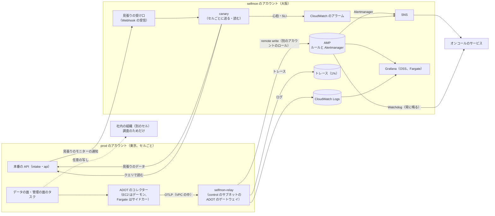

# Observability: Datadog

本システムの自己監視を決める。別の AWS アカウントの独立した経路（AMP、CloudWatch、オンコールのサービスへの直接の連携）、外からの見張り（`canary`）とデッドマンスイッチ、循環の依存の避け方、計装の規則（利用者のデータを出さない）、[runbooks/](../runbooks/README.md) の SLI の計測、バーンレートのアラート、ドッグフーディングの範囲を扱う。SLO の値とアラートの一覧の正本は runbooks で、この文書はその計測とアラートの実装を書く。

| ADR | 決定 |
| --- | --- |
| [0062](../decisions/0062-independent-self-monitoring-path.md) | 自己監視は selfmon のアカウントの大阪のリージョンに置く（本番の東京と別のアカウント・別のリージョン）。本番のタスクの ADOT のコレクターが、VPC の中の `selfmon-relay` を経て、別のアカウントのロールで AMP（メトリクス）と CloudWatch Logs（ログ）へ送る。アラートは AMP のルールと CloudWatch のアラームから SNS を経てオンコールのサービスへ直接送る。デッドマンスイッチは 3 段：`canary` の心拍のアラーム（データの欠けを異常とみなす）、AMP の常に鳴る Watchdog をオンコールのサービスの心拍へ、オンコールのサービスの側の心拍の途切れ |
| [0063](../decisions/0063-slis-from-canary-and-server-histograms.md) | 「取り込みからクエリに出るまで」「通知まで」の SLI は `canary` の端から端までの計測を正にし、クエリの速さと評価の遅れはサーバーのヒストグラムを正にする。組織ごとの「隣人の影響」は、パーティションの水位と取り込みの時刻の差を組織ごとに数える。バーンレートは 1 時間・6 時間・3 日の窓。`canary` の組織はセルごとに 1 つで、SLO と利用量から除く |

前提：[runbooks/](../runbooks/README.md) の 1 節（SLI と SLO）、4 節（アラート）、5 節（自己監視と循環の回避）。selfmon のアカウントは [infrastructure.md](infrastructure.md) の 1 節、水位は [ADR-0008](../decisions/0008-monitor-evaluation-model.md) と [ADR-0011](../decisions/0011-intake-gateway-pipeline-and-watermark-ticks.md)。

## 1. 全体の流れ

- データの面のサブネットは外への経路を持たない（[ADR-0058](../decisions/0058-untrusted-senders-egress-and-operator-access.md)）ので、コレクターは VPC の中の `selfmon-relay` へ送り、`selfmon-relay` だけが NAT と Network Firewall（大阪の AMP・CloudWatch Logs・トレースのエンドポイントの許可リスト）を通って selfmon のアカウントのロールで書く（[infrastructure.md](infrastructure.md) の 2.3 節）。
- 本番のどの部品も、selfmon に送れなくても止まらない。コレクターは最大 15 分をディスクに溜め、溢れたら古いものから捨てて数える（自己の計測の欠けは、selfmon の側で「送り手の沈黙」として見つける。4 節）。
- selfmon のアカウントは、本番の MSK・TSDB・クエリ・モニター・通知を使わない（[runbooks/](../runbooks/README.md) の 5 節）。

## 2. 計装の規則

### 2.1 利用者のデータを出さない

- 本システム自身のログ・トレース・メトリクスに、利用者のログの本文、タグの値、指標の名前、クエリの文字列、キー、IP アドレスを出さない。出してよいのは、`tenant_id`、ID（モニター・ダッシュボード・ブロック・セグメント・キーの ID）、数、大きさ、時間、理由のコード（[AGENTS.md](../../AGENTS.md)）。
- Rust は、利用者のデータの型（`TagValue`、`LogBody`、`QueryText`、`ApiKey`）に `Debug`・`Display` を実装しない（伏せた形だけを出す）。TypeScript は、ログの関数に渡す値を許可リストの項目だけにする lint。
- 毎日、selfmon の CloudWatch Logs の抜き取りを、キーの形（`<brand>_ik_`、`<brand>_ak_`）、メールアドレス、JWT の検出器で走査し、当たりの数を数える（値は記録しない）。1 件で呼び出し（[security.md](security.md) の 9 節）。

### 2.2 メトリクスの名前と次元

- 名前：`svc_<部品>_<量>_<単位>`（例：`svc_ingester_head_bytes`、`svc_gateway_accept_seconds`）。利用者の指標の名前空間 `<brand>.` と分ける。
- 次元：`cell`、`az`、`service`、`task`。パーティションの次元は、水位と消費の遅れの指標だけに付ける（1,024 × 消費者の種類）。
- `tenant_id` の次元は、6.1 節の組織ごとの SLI と、割り当て・溢れ・429 の数だけに付ける。S1 で 1,000、S2 で 1 万の組織。AMP の有効な系列の上限（既定 5,000 万。下の出典）に対し、自己監視の全体を 200 万系列以下に保つ（四半期ごとに見る）。

### 2.3 トレース

- 本システムの要求のトレースを 1%、エラーと遅いもの（p99 を超えたもの）をすべて残す。スパンの属性は 2.1 節の規則に従う。
- 取り込みの経路は量が多いので、ゲートウェイは 0.01% にする。クエリと評価の経路は 1%。

## 3. 外からの見張り（`canary`）

ADR-0062、ADR-0063。

### 3.1 見張りの組織とデータ

- セルごとに見張りの組織（`canary-<cell>`）を 1 つ持つ。SLO の計算、利用量、課金から除く（[runbooks/](../runbooks/README.md) の 1 節）。
- `canary`（selfmon のアカウントの Fargate、大阪）は、取り込みのキーとアプリケーションキー（読み取りの役割のサービスのアカウント）で、本番の公開の入口（`intake`・`otlp`・`api`）を使う。内部の経路を使わない（利用者と同じ道を通す）。

| 信号 | 送るもの（10 秒ごと） | 確かめ |
| --- | --- | --- |
| メトリクス | `canary.sine`（時刻から決まる値 `f(t)`）、`canary.counter`（10 秒ごとに 1 足す count）、`canary.dist`（決まった 100 個の値の分布） | 生・1 分・1 時間の層で、値が `f(t)` と合う。count の合計、パーセンタイルの相対誤差（NFR-010） |
| ログ | 連番つきのログ 10 件（日本語の本文、PII の試験の値を含む） | 検索で全件が出る。連番の欠け 0。PII の試験の値がマスクされている |
| トレース | 決まった形のトレース（3 サービス、エラーを 1 つ含む） | 完成の判断の後に ID で引ける。エラーのトレースが残る |
| モニター | `canary.flip`（1 分ごとに 0 と 1 を繰り返す）に閾値 0.5 のモニター | 毎分、遷移の通知が見張りの受け口に届く |

- 値は時刻から計算できるので、`canary` は状態を持たずに照合できる（[quality.md](../quality.md) の 4.2 節の「見張り」）。

### 3.2 計る時間

| 計測 | 定義 |
| --- | --- |
| メトリクスがクエリに出るまで | 202 を受けた時刻から、クエリでその点が読めた時刻まで（1 秒ごとに読む） |
| ログが検索に出るまで | 202 から、検索でそのログが出た時刻まで |
| トレースが出るまで | 最後のスパンの 202 から、ID で引けた時刻まで（完成の待ち 30 秒を含む）。runbooks の定義（完成の判断から）に合わせ、完成の待ちを引いた値も出す |
| 通知まで | `canary.flip` が変わる時刻（分の区切り）から、見張りの受け口に通知が届いた時刻まで |

## 4. デッドマンスイッチ

ADR-0062。どの 1 つの部品が止まっても、呼び出しが届くように 3 段にする。

| 段 | 何が止まったら鳴るか | 仕組み |
| --- | --- | --- |
| 1. `canary` の心拍 | 本番の取り込み・クエリ・評価・通知のどれか、または `canary` 自身 | `canary` は毎分、「取り込みから読めた」「通知が届いた」を CloudWatch の指標 `CanaryHeartbeat`（セル・信号ごと）に書く。アラームはデータの欠けを異常とみなし（`TreatMissingData=breaching`）、取り込み 2 分・通知 3 分で鳴る（[runbooks/](../runbooks/README.md) の 5 節） |
| 2. AMP の Watchdog | AMP のルールの評価、Alertmanager、SNS への経路 | 常に鳴るルール（`vector(1)`）を、Alertmanager からオンコールのサービスの心拍の受け口へ 1 分ごとに送る。途切れたら、オンコールのサービスが呼び出す |
| 3. 送り手の沈黙 | 本番のコレクター、AMP への書き込み | AMP のルール `absent_over_time(svc_up[5m])` をセル・部品ごとに。CloudWatch の側にも、AMP の書き込みの数（使用量の指標）が 0 になったらのアラーム |

- オンコールのサービスの心拍の機能（一定の間隔の合図が途切れたら呼び出す）は、選ぶサービスで名前と形が違う。E1 の `self-monitoring-baseline` で選び、無ければ外部の心拍の監視のサービスを足す（**未検証**）。
- selfmon の大阪のリージョンの障害では、段 1・2 が同時に止まり、段 2 の心拍の途切れでオンコールのサービスが呼び出す（「監視を失った」）。そのときは東京の本番の CloudWatch の最小のアラーム（5 節）で見る。

## 5. 循環の依存の避け方

| 依存 | 本番 | selfmon | 避け方 |
| --- | --- | --- | --- |
| リージョン | 東京（DR は大阪） | 大阪 | 東京の障害で selfmon が残る。大阪の障害では段 2 で気づく。本番が大阪へ切り替えた後は同じリージョンになるので、切り替えの手順で selfmon の最小の写し（アラームと `canary`）を東京に起こす |
| AWS のアカウント | prod | selfmon | 別のアカウント。selfmon は prod のロールを引き受けない（prod から selfmon へ書くだけ） |
| DNS | `<brand>.<domain>`（shared の Route 53） | 別のホストゾーン | selfmon の Grafana と受け口は本番のドメインを使わない |
| 認証 | IAM Identity Center | Identity Center ＋ break-glass の IAM の利用者 2 人 | Identity Center の障害でも selfmon に入れる |
| 秘密 | 本番の Secrets Manager | selfmon の Secrets Manager | `canary` のキー、オンコールの連携の鍵は selfmon にだけ置く |
| 通知 | 本システムの `notifier` | SNS → オンコールのサービス、SES（selfmon のアカウント） | 本システムの通知の経路を使わない |
| 計測の保存 | 本システムの TSDB・ログの保存 | AMP、CloudWatch Logs | 本システムの保存を使わない |

- **本番の最小のアラーム**：selfmon を失ったときのため、本番のアカウントの CloudWatch に、NLB の 5xx、MSK のオフラインのパーティション、Aurora の可用性の 3 つだけのアラームを置き、SNS からオンコールのサービスへ送る（selfmon と別の経路）。
- 本番の障害の調査は、selfmon の Grafana から始める（[runbooks/](../runbooks/README.md) の 5 節）。

## 6. SLI の計測

ADR-0063。[runbooks/](../runbooks/README.md) の 1 節の SLI ごとに、正とする計測を決める。

| SLI（runbooks） | 正とする計測 | 補助（調べるため） |
| --- | --- | --- |
| 取り込みの可用性 | NLB とゲートウェイの応答のコード（429 を除く 5xx・時間切れの割合） | `canary` の送信の失敗 |
| 取り込みの応答 | ゲートウェイの 202 の時間のヒストグラム（500 KB まで） | NLB の時間 |
| メトリクスがクエリに出るまで | `canary`（3.2 節） | パーティションの水位の遅れ（インジェスター） |
| ログがクエリに出るまで | `canary` | `log-processor`・`log-indexer` の水位、セグメントの書き出しの間隔 |
| トレースが出るまで | `canary`（完成の待ちを引いた値） | 組み立ての水位 |
| クエリの可用性 | `query-frontend` の応答（受け付けの拒否を除く 5xx・時間切れ） | 読み手ごとの失敗 |
| メトリクスのクエリの速さ | `query-frontend` のヒストグラム（1 時間の窓・結果 1,000 系列以下に絞った分） | 計画の段ごとの時間 |
| ログの検索の速さ | 同（15 分の窓に絞った分） | 読んだバイト |
| モニターの評価の遅れ | `monitor-evaluator` の「予定の時刻＋遅らせ → 完了」のヒストグラム | 水位の待ちの時間、クエリの時間 |
| 評価と通知の可用性 | 評価の抜け（10 分を超えて追わなかった時刻）の数と、遷移から送信までが 10 秒以内の割合（`notifier`） | `canary` の通知まで（3.2 節） |
| 不完全の評価 | `monitor-evaluator` の不完全の評価の割合 | 水位の待ちの上限に当たった数 |
| 見張りの照合 | `canary` の不一致の数（3.1 節） | — |
| ブロックの写しの一致 | `metric_block_verifications` の `mismatch` の数（[tsdb-storage-engine.md](tsdb-storage-engine.md)） | — |
| ヘッドの要約の一致 | `svc_ingester_head_digest_mismatch_total`（[tsdb-storage-engine.md](tsdb-storage-engine.md) の 6.7 節。統合の工程で足した） | — |
| ストレージの突き合わせ | 毎週の S3 Inventory とカタログの突き合わせの結果 | — |
| 分離 | 応答の監査の不一致の数（[ADR-0051](../decisions/0051-roles-permissions-and-data-access-restrictions.md)） | — |
| 隣人の影響 | 組織ごとの「取り込みからクエリまで」の p99（6.1 節） | 組織ごとの 429・溢れ |
| 利用量の遅れ | `usage_hourly` の暫定の値が出るまでの時間（[usage-and-billing.md](usage-and-billing.md) の 5.3 節） | `usage-aggregator` の消費の遅れ |

この領域で足した SLI（統合の工程で runbooks の 1 節に足した）：

| SLI | 計測 | 目安 |
| --- | --- | --- |
| 監査の読み出しの記録の欠け | 返したクエリの数と `audit` の読み出しの事象の数の差（[tenancy-and-rbac.md](tenancy-and-rbac.md) の 8.3 節） | 差 0。1 時間で 0.01% を超えたらチケット |
| 自己監視の経路の健全 | 4 節の 3 段のどれかが鳴った回数 | 0 |

### 6.1 組織ごとの「取り込みからクエリまで」

- `canary` は 1 つの組織しか測れないので、組織ごとの値はサーバーの側で数える。
- 各消費者（インジェスター、インデクサー）は、パーティションの水位を 10 秒ごとに出す（[ADR-0011](../decisions/0011-intake-gateway-pipeline-and-watermark-ticks.md) の水位の刻み）。`query-frontend` は組織のパーティションの組の水位の最小を持つ（[ADR-0008](../decisions/0008-monitor-evaluation-model.md)）。
- 組織ごとの遅れ `lag(T) = 今 − 組織 T の水位` を 10 秒ごとに標本にし、5 分の窓の p99 を `svc_tenant_freshness_seconds{tenant_id, signal}` に出す。これは「取り込みからクエリに出るまで」の上限の近似で、`canary` の組織では `canary` の実測と比べて差を確かめる（差が 5 秒を超えたら近似を直す）。
- runbooks の「隣人の影響」：割り当ての中の組織のうち、上位 1% が 10 分 NFR-002 を外れたらチケット、全体の 5% で呼び出し。

## 7. アラート

### 7.1 バーンレート

- 可用性の SLO（取り込み 99.95%、クエリ 99.9%、評価と通知 99.95%）は、runbooks のとおり、1 時間の窓で 14.4 倍かつ 5 分の窓で 14.4 倍（呼び出し）、6 時間で 6 倍（呼び出し）、3 日で 1 倍（チケット）。AMP の記録のルールで比率を作り、アラートのルールで判定する。
- 遅れの SLO（p99）は、runbooks の「p99 が X を Y 分超えたら」を、AMP のヒストグラムの分位数と `for:` で書く。

### 7.2 アラートの一覧

[runbooks/](../runbooks/README.md) の 4 節の表のアラートを、すべて AMP のルールか CloudWatch のアラームで実装する。どのアラートも、注釈に手順の URL を持つ（CI で検査）。この領域で足す行：

| アラート（重さ） | 条件 | 手順 |
| --- | --- | --- |
| 自己監視の経路の停止（page） | 4 節の段 1〜3 | [self-monitoring-path-failure.md](../runbooks/self-monitoring-path-failure.md) |
| 自己の計測の送り手の沈黙（page） | `absent_over_time(svc_up[5m])`（セル・部品） | [self-monitoring-path-failure.md](../runbooks/self-monitoring-path-failure.md) |
| 本システムのログの秘密の漏れ（page） | 2.1 節の走査で 1 件 | `pii-leak-response.md` |
| `canary` と組織ごとの近似の差（ticket） | 6.1 節の差が 5 秒を 1 時間 | `consumer-lag.md` |

### 7.3 費用（初期見積もり）

- AMP：自己監視の系列 200 万、15 秒ごとで 1 秒 13 万の標本。CloudWatch Logs：本システムのログ 100 GB/日（30 日保持）。`canary`：Fargate 数タスク。東京 → 大阪の転送。合わせて 月 約 1 万 USD を見込む（単価は**未検証**。[capacity.md](capacity.md) の 6 節）。

## 8. ドッグフーディング

- 本システムの自己の計測を、本番の別のセルの社内の組織にも写してよい（コレクターから OTLP で、公開の入口へ）。セル `apne1-c1` の計測は `apne1-c0` の社内の組織へ、`apne1-c0` の計測は `apne1-c1` の社内の組織へ。同じセルの社内の組織には写さない（[runbooks/](../runbooks/README.md) の 5 節）。
- 使い道はダッシュボードとトレースでの調査だけ。呼び出し、SLO の判定、リリースの自動のロールバックの条件には使わない。
- 写しの送信は、本番の取り込みの割り当ての中で行い、利用者の取り込みを押しのけない（社内の組織の割り当てを小さくし、超えたら 429 で捨ててよい）。

## 9. ログの保持とアクセス

| 置き場所 | 保持 | アクセス |
| --- | --- | --- |
| selfmon の CloudWatch Logs | 30 日 | Ops（Identity Center）、break-glass |
| selfmon の AMP | 150 日（AMP の既定の保持。**未検証**） | 同上 |
| トレース | 30 日 | 同上 |

## 10. テスト

| 種類 | 中身 | 要件 |
| --- | --- | --- |
| 訓練 | 四半期ごとに、検証のセルで本システムのモニターの評価と通知を止め、段 1 から呼び出しが届く。AMP のルールを止め、段 2 から届く（E13 の `self-monitoring-drill`） | `REQ-OBS-*` |
| lint | 利用者のデータの型に `Debug`・`Display` がない。ログの関数の許可リスト | — |
| 結合 | コレクターが selfmon に届かない間も本番のタスクが止まらない。15 分の後に古いものから捨てて数える | `REQ-OBS-*` |
| 照合 | `canary` の照合の関数を、生成した値の列で参照と比べる（層ごと） | `PROP-OBS-001` |
| アラートの検査 | すべてのアラートに手順の URL がある。runbooks の 4 節の行とアラートの定義が 1 対 1（CI） | — |

## 11. Story の候補

| Epic | Story | 中身 |
| --- | --- | --- |
| E1 | `self-monitoring-baseline` | 1 節の経路、selfmon の大阪、ADOT、AMP、CloudWatch、SNS、オンコールの連携と心拍の機能の選定（roadmap の Story） |
| E1 | `canary-skeleton` | 3 節の `canary`（メトリクスと通知から）、見張りの組織、受け口 |
| E1 | `dead-man-switch` | 4 節の 3 段 |
| E1 | `instrumentation-guidelines` | 2 節の lint と、型の規則 |
| E7 | `ingest-watermarks` | 6.1 節の組織ごとの遅れの指標（roadmap の Story を広げる） |
| E13 | `slo-dashboards-alerts` | 6・7 節の SLI とアラート（roadmap の Story） |
| E13 | `self-monitoring-drill` | 10 節の訓練 |

## 12. 未解決の問い

### 決定

2026-10-09 の既定案。E1 と E13 で覆りうる。

- **selfmon の置き場所**：別のアカウントの大阪（ADR-0062）。
- **デッドマンスイッチ**：3 段（ADR-0062）。
- **SLI の正**：`canary` の端から端まで、クエリと評価はサーバーのヒストグラム、組織ごとは水位の近似（ADR-0063）。
- **統合の工程（2026-10-09）**：Amazon Managed Grafana は大阪で提供されていない（[Supported Regions](https://docs.aws.amazon.com/grafana/latest/userguide/what-is-Amazon-Managed-Service-Grafana.html)、2026-10-09 に確認）ので、Grafana（OSS）を selfmon の大阪の Fargate で動かす。AMP は大阪で提供されている（下の出典）。6 節の 2 つの SLI（監査の読み出しの記録の欠け、自己監視の経路の健全）を runbooks の 1 節に足した。

### 持ち越し

| 問い | いつ・どう決めるか |
| --- | --- |
| オンコールのサービスの選定と心拍の機能 | E1 の `self-monitoring-baseline`（**未検証**） |
| 大阪でのトレースの置き場所の提供 | E1 の `self-monitoring-baseline`（**未検証**） |
| AMP の保持と費用の単価 | E1（**未検証**） |

## 13. quality.md・runbooks・data-model への項目

### quality.md

- 2.2.1 節 K に、4 節の段 2・3 の訓練を足す。
- 4.2 節の「見張り」に、3.1 節の分布とトレースの照合を足す。

### runbooks

- 1 節の表に 6 節の 2 つの SLI を足す（Ops の判断）。
- [self-monitoring-path-failure.md](../runbooks/self-monitoring-path-failure.md)：4 節の段ごとの見分け方、selfmon の大阪の障害のときに本番の最小のアラームで見る手順、本番を大阪へ切り替えたときに selfmon の最小の写しを東京に起こす手順。

### data-model への項目

| 表・置き場所 | 中身 | 節 |
| --- | --- | --- |
| `tenants` の印 | `canary`（SLO・利用量・課金から除く） | 3.1 |
| selfmon の CloudWatch の指標 | `CanaryHeartbeat`（セル・信号） | 4 |
| AMP の指標 | `svc_tenant_freshness_seconds{tenant_id, signal}` | 6.1 |

## 出典

いずれも 2026-10-09 に確認。

- AWS, [Amazon Managed Service for Prometheus endpoints and quotas](https://docs.aws.amazon.com/general/latest/gr/prometheus-service.html)：大阪（ap-northeast-3）と東京で提供。ワークスペースあたり有効な系列 既定 5,000 万（調整可）、取り込み 1 秒 166 万の標本、1 時間より古い標本は受けない
