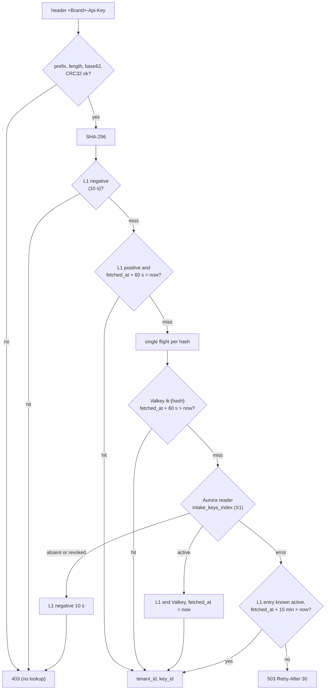
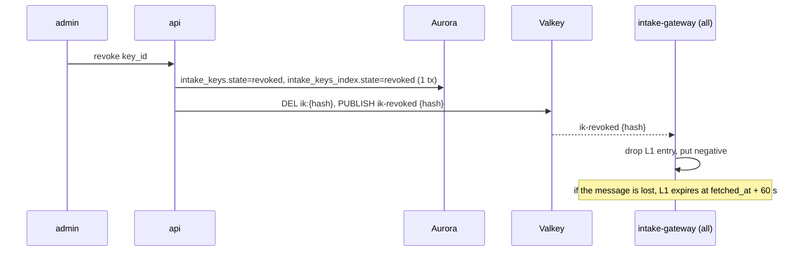
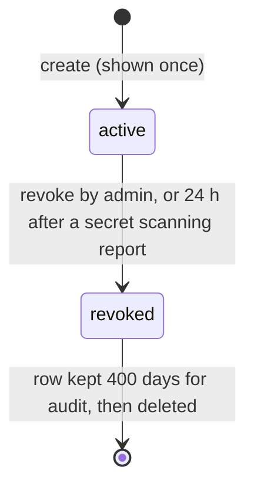

# OTLP and API keys: Datadog

OTLP の受け口と、キーを決める。OTLP の gRPC・HTTP の受け方、応答と送り直しの合図、OTLP のメトリクスの型と本システムの型の対応、資源の属性とタグの対応、取り込みのキー（形式、ハッシュでの保存、エッジでの確かめ、キャッシュ、失効の伝わり）、アプリケーションキー（形式、スコープ、実効の権限）、シークレットスキャンへの備えを扱う。

前提となる決定は次のとおり。

- MSK の確定の後の応答（[ADR-0002](../decisions/0002-intake-log-on-msk.md)）
- `tenant_id` は認証の文脈からだけ。キーの確認は RLS の外の `intake_keys_index` を X1 の経路で引く（[ADR-0003](../decisions/0003-tenancy-cells-and-isolation.md)）
- 累積の指標はインジェスターが差に直す（[ADR-0004](../decisions/0004-tsdb-storage-engine.md)）
- ゲートウェイの処理の順序と応答（[ADR-0011](../decisions/0011-intake-gateway-pipeline-and-watermark-ticks.md)）
- 本家の名前・接頭辞を使わない（[リポジトリ共通の ADR-0006](../../../../docs/decisions/0006-brand-neutral-identifiers.md)）

この文書で決めたことは次の ADR にある。

| ADR | 決定 |
| --- | --- |
| [0014](../decisions/0014-otlp-mapping-and-resource-attributes.md) | OTLP は標準の応答（HTTP 200 と `partial_success`、429・503 と `Retry-After`、gRPC の `RESOURCE_EXHAUSTED`・`UNAVAILABLE` と `RetryInfo`）に寄せる。資源の属性は、決めた一覧（`service.name` → `service` など 12 個）と組織が足した鍵だけをタグにし、他は落として数える。データポイントの属性はすべてタグにし、同じ鍵では資源の属性より勝つ。指標の名前の `-`・`/` は `_` に直し、時刻はミリ秒に切り捨てる |
| [0015](../decisions/0015-key-format-validation-and-revocation.md) | 取り込みのキーは `<brand>_ik_` ＋ 32 文字の base62 の乱数 ＋ 6 文字の CRC32 のチェックサム。SHA-256 のハッシュだけを持つ。ゲートウェイは、形とチェックサムを手元で確かめてから、プロセスのキャッシュ → Valkey → Aurora の順で引く。正のキャッシュの期限は Aurora から読んだ時刻から 60 秒で、失効は通知と期限で 60 秒以内に効く。Aurora が使えない間は既知の有効なキーを 15 分まで受け、知らないキーには 503 を返す。アプリケーションキーは `<brand>_ak_` ＋ 組織の参照 ＋ 秘密で、組織を RLS の外の表なしで決め、実効の権限はスコープと持ち主の役割の積にする |

## 1. 範囲

- 扱う：
  - OTLP の受け口（`otlp.<brand>.<domain>`、gRPC・HTTP、メトリクス・ログ・トレース）の運び方、認証、圧縮、上限、応答
  - OTLP のメトリクスの型・名前・単位・時刻の対応
  - 資源の属性とデータポイントの属性からタグへの対応（すべての信号で共通）
  - 取り込みのキー、アプリケーションキーの形式・保存・確かめ・失効・スコープ
  - シークレットスキャンへの登録の準備
- 扱わない：
  - ログのレコード・スパンの中身の対応（logs-pipeline.md、traces-and-sampling.md）。この文書は資源の属性とタグの対応だけを共有する
  - 累積から差への直し方の詳細（[metrics-model-and-cardinality.md](metrics-model-and-cardinality.md) の 6 節）
  - 指数のヒストグラム・明示の境界のヒストグラムの変換（[distributions-and-sketches.md](distributions-and-sketches.md)）
  - 役割と権限の一覧、サービスのアカウント、監査ログ（tenancy-and-rbac.md）
  - 鍵の暗号化と秘密の管理、脅威モデル（security.md）

## 2. 要件

| 要件 | 目標 | NFR |
| --- | --- | --- |
| 受け付けの応答 | 500 KB までの OTLP の要求の応答 p99 300ms | NFR-001 |
| 標準への寄せ | OpenTelemetry の SDK・Collector が、設定の変更（送り先とヘッダー）だけで送れる。送り直しの合図が OTLP の仕様どおり | — |
| 失効の伝わり | 取り込みのキーの失効から、すべてのゲートウェイで拒むまで 60 秒以内（Aurora が正常なとき） | NFR-007 |
| キーの確かめの速さ | キャッシュに当たるとき 50µs 以内。当たらないとき p99 20ms | NFR-001 |
| 確かめの先の障害 | Aurora の停止で、既知のキーの取り込みを止めない | NFR-006 |
| 漏れ | キーの値を保存しない・ログに出さない。他の組織のキーで書いた点がその組織にだけ入る | NFR-007、quality.md の 2.2.1 節 G |

## 3. 標準と本家の形（確かめたこと）

いずれも 2026-10-09 に確認。

| 項目 | 内容 | 出典 |
| --- | --- | --- |
| OTLP の運び方 | gRPC は 4317、HTTP は 4318。HTTP の道は `/v1/metrics`・`/v1/logs`・`/v1/traces`。本文は `application/x-protobuf` か `application/json` で、同じ形で返す | [OTLP Specification](https://opentelemetry.io/docs/specs/otlp/) |
| 一部の成功 | 応答の `partial_success` に拒んだ数（`rejected_data_points` など）と理由の文を入れる。HTTP は 200。`partial_success` のある応答を送り直してはならない | 同上 |
| 送り直しの合図 | gRPC は `CANCELLED`・`DEADLINE_EXCEEDED`・`ABORTED`・`OUT_OF_RANGE`・`UNAVAILABLE`・`DATA_LOSS` を送り直す。`RESOURCE_EXHAUSTED` は `RetryInfo` があるときだけ。HTTP は 429・502・503・504 を送り直し、`Retry-After` を守る | 同上 |
| 圧縮 | サーバーは `none` と `gzip` を必ず受ける。大きさの上限は展開の前と後の両方にかかる | 同上 |
| 累積と差、始まりの時刻 | Sum は delta か cumulative。cumulative は同じ始まりの時刻を繰り返す。始まりの時刻が点の時刻と同じなら、始まりの分からない戻り | [Metrics Data Model](https://opentelemetry.io/docs/specs/otel/metrics/data-model/) |
| 本家の API キー | 組織の単位で、エージェントの送信に使う。組織ごとに既定 50 本まで。アプリケーションキーは利用者に属し、スコープで絞れる | [API and Application Keys](https://docs.datadoghq.com/account_management/api-app-keys/) |
| 本家の OTLP の資源の属性の対応、本家の API キーの形式とキャッシュ、読み出しの API に 2 つのキーを求めるか | 公式の資料で確かめなかった（**未検証**） | — |

## 4. OTLP の受け口

### 4.1 運び方

| 項目 | 本システム |
| --- | --- |
| 送り先 | `otlp.<brand>.<domain>:443`。gRPC と HTTP を同じ名前で受ける（ALPN の `h2` で gRPC、それ以外は HTTP）。エージェントの中の受け口は 127.0.0.1:4317・4318（[intake-and-agent.md](intake-and-agent.md) の 4.1 節） |
| HTTP の道 | `/v1/metrics`、`/v1/logs`、`/v1/traces` |
| 本文 | Protobuf と JSON。gzip と zstd（zstd は本システムの拡張） |
| 認証 | ヘッダー `<Brand>-Api-Key`（gRPC のメタデータでは小文字の `<brand>-api-key`） |
| 処理 | `intake-gateway` の同じ処理の順序（[ADR-0011](../decisions/0011-intake-gateway-pipeline-and-watermark-ticks.md)）。OTLP の解析の後に内部のレコードへ変換する |

### 4.2 応答（ADR-0014）

| 場合 | HTTP | gRPC | 送り手の振る舞い（仕様） |
| --- | --- | --- | --- |
| すべて受けた | 200（空の `partial_success`） | `OK` | 終わり |
| 一部の点を拒んだ（窓の外、名前・タグの誤り、型の食い違い） | 200、`partial_success.rejected_data_points` と理由の数の文 | `OK` と同じ形 | 送り直さない |
| 解析できない | 400 | `INVALID_ARGUMENT` | 送り直さない |
| キーがない・無効 | 403 | `PERMISSION_DENIED` | 送り直さない |
| 本文が大きすぎる | 413 | `RESOURCE_EXHAUSTED`（`RetryInfo` なし） | 送り直さない |
| 割り当ての超過 | 429 と `Retry-After` | `RESOURCE_EXHAUSTED` と `RetryInfo` | 待って送り直す |
| MSK の確定の失敗、キーの確認ができない | 503 と `Retry-After` | `UNAVAILABLE` と `RetryInfo` | 待って送り直す |

- 本システムの API（[intake-and-agent.md](intake-and-agent.md) の 5.3 節）の成功は 202 だが、OTLP は仕様に寄せて 200 にする。どちらも MSK の確定の後にだけ返す。
- `partial_success.error_message` は英語の 1 文に理由ごとの数を入れる（例：`2 data points rejected: too_old=1, invalid_tag=1`）。値・タグ・指標の名前は入れない。

## 5. メトリクスの対応

### 5.1 型（ADR-0014、ADR-0016）

| OTLP | 条件 | 本システムの型 | 備考 |
| --- | --- | --- | --- |
| Gauge | — | gauge | |
| Sum | 単調、delta | count | |
| Sum | 単調、cumulative | count（インジェスターが差に直す） | [metrics-model-and-cardinality.md](metrics-model-and-cardinality.md) の 6 節 |
| Sum | 単調でない、cumulative | gauge | 値をそのまま（UpDownCounter の今の値） |
| Sum | 単調でない、delta | count | 負の値を含む合計 |
| ExponentialHistogram | delta | 分布 | [distributions-and-sketches.md](distributions-and-sketches.md) の 6 節 |
| ExponentialHistogram | cumulative | 分布（インジェスターが区間ごとに差に直す） | 同上 |
| Histogram（明示の境界） | どちらも | 分布（指数のヒストグラムへ変換） | 同上。精度の印を付ける |
| Summary | — | gauge（分位ごと）＋ count（個数と合計） | 同上。合わせられない |

- 例示（exemplar）は MVP では落とす（`<brand>.otlp.dropped{reason:exemplar}` に数える）。
- 1 つの要求の中で、同じ名前に違う型の点があれば、後のほうを `type_conflict` で拒む。組織の中での型の食い違いは [metrics-model-and-cardinality.md](metrics-model-and-cardinality.md) の 4.2 節。

### 5.2 名前・単位・時刻

- **名前**：OpenTelemetry の名前の文字（`-`、`/` を含む）のうち、`-` と `/` を `_` に直す。それ以外は [metrics-model-and-cardinality.md](metrics-model-and-cardinality.md) の 4.1 節の規則で確かめ、違反は拒む。直した結果が別の名前と同じになる場合も、そのまま同じ指標として扱う（直したことを指標の情報 `otel_name` に残す）。
- **単位**：OTLP の `unit` を指標の情報に持つ。系列の鍵には入れない。同じ名前で単位が変わったら、最後の単位を表示に使い、変わったことを指標の情報の履歴に残す。
- **時刻**：`time_unix_nano` をミリ秒に切り捨てる。同じ系列で同じミリ秒の点は後勝ち。`start_time_unix_nano` もミリ秒にして、累積の指標の差への直しに使う。
- **受け付けの窓**：ミリ秒にした時刻で、本システムの API と同じ窓を当てる。

## 6. 資源の属性とタグ（ADR-0014）

### 6.1 対応の一覧

資源の属性は、多くが値の種類の多いもの（`container.id`、`process.pid`、`service.instance.id`）で、全部をタグにすると系列が爆発する。決めた一覧と、組織が足した鍵だけをタグにする。

| 資源の属性 | タグ |
| --- | --- |
| `service.name` | `service` |
| `service.version` | `version` |
| `deployment.environment.name`（古い `deployment.environment` も） | `env` |
| `host.name` | `host` |
| `cloud.provider` | `cloud_provider` |
| `cloud.region` | `region` |
| `cloud.availability_zone` | `availability_zone` |
| `k8s.cluster.name` | `kube_cluster_name` |
| `k8s.namespace.name` | `kube_namespace` |
| `k8s.deployment.name` | `kube_deployment` |
| `k8s.pod.name` | `pod_name` |
| `container.name` | `container_name` |

- 一覧にない資源の属性は落とし、`<brand>.otlp.dropped_resource_attributes{key_count}` に数える（鍵の名前はタグにしない）。
- 組織は、指標の取り込みの設定（`otlp_resource_attribute_rules`）で、資源の属性の鍵を最大 20 まで足せる（例：`team`）。足した鍵は、属性の鍵をそのまま（小文字にして）タグの鍵にする。
- トレースのスパンとログには、資源の属性をすべて属性として残す（タグの爆発は系列の話で、ログ・スパンの属性は列になる。traces-and-sampling.md、logs-pipeline.md）。この表は、ログ・スパンの `service`・`env`・`host` などの決まった列を決めるのに共有する。

### 6.2 データポイントの属性

- データポイントの属性はすべてタグにする。鍵は小文字にし、値は次のとおり文字列にする。

| 属性の型 | タグの値 |
| --- | --- |
| 文字列 | そのまま（空なら鍵だけのタグ） |
| 整数 | 10 進の文字列 |
| 浮動小数点 | 最短の往復できる表記 |
| 真偽 | `true`・`false` |
| 配列・マップ・バイト列 | 落として `<brand>.otlp.dropped_attributes{reason:complex}` に数える |

- 資源の属性から作ったタグと、データポイントの属性の鍵が同じなら、データポイントの属性を残す。
- スコープの名前・バージョンはタグにしない。

### 6.3 例

```
Resource: service.name=checkout, deployment.environment.name=prod,
          host.name=ip-10-0-1-5, k8s.pod.name=checkout-7f9c-x2k4p,
          container.id=3f2a9c..., telemetry.sdk.language=go
Scope:    go.opentelemetry.io/contrib/instrumentation/net/http
Metric:   http.server.request.duration (ExponentialHistogram, delta, unit "s")
DataPoint attributes: http.request.method=GET, http.response.status_code=200,
                      http.route=/cart
```

- 指標の名前：`http.server.request.duration`（直すところなし）、単位 `s`、型は分布。
- タグ（並べた後）：`env:prod`、`host:ip-10-0-1-5`、`http.request.method:GET`、`http.response.status_code:200`、`http.route:/cart`、`pod_name:checkout-7f9c-x2k4p`、`service:checkout`。
- 落としたもの：`container.id`、`telemetry.sdk.language`（資源の属性 2 つ）、スコープ。
- 系列の鍵は、この組織の `tenant_id` と、名前と、上の 7 つのタグから作る（[metrics-model-and-cardinality.md](metrics-model-and-cardinality.md) の 5 節）。

## 7. 取り込みのキー（ADR-0015）

### 7.1 形式

```
<brand>_ik_<random 32 base62><checksum 6 base62>
例（架空）：<brand>_ik_7QeV2nZk9xTb4LmR1sW8yC3dF6hJ0aPq3xK9mB
```

- 乱数は 32 文字の base62（約 190 ビット）。CSPRNG で作る。
- チェックサムは、接頭辞と乱数の部分の CRC32 を base62 の 6 文字にしたもの。打ち間違いと、シークレットスキャンの誤検出の除去に使う。
- 接頭辞は他の既知のサービスの接頭辞と重ならないことを確かめ、実際の `<brand>` を決めるとき（開発リポジトリの作成時）に登録する（[リポジトリ共通の ADR-0006](../../../../docs/decisions/0006-brand-neutral-identifiers.md)）。

### 7.2 作成と保存

- キーは組織の単位。組織ごとに既定 50 本（本家の既定に寄せる。3 節）。管理者が名前を付けて作る。
- 作成のときに 1 回だけ全体を見せる。保存するのは `SHA-256(キーの文字列)`、最後の 4 文字、名前、作成者、作成の時刻だけ。乱数が 190 ビットあるので、遅いハッシュ（bcrypt など）と塩は使わない（総当たりが成り立たない）。
- 正本は `intake_keys`（テナントの表、RLS）。キーの確認の入口として `intake_keys_index`（RLS の外、[ADR-0003](../decisions/0003-tenancy-cells-and-isolation.md) の X1）に、`key_hash → (tenant_id, key_id, state, revision)` を同じトランザクションで書く。

### 7.3 エッジでの確かめ



- 形とチェックサムの誤りは、引かずに 403。ゴミの値で Aurora を叩かせない。
- 正のキャッシュ（L1：プロセスのメモリー、最大 100 万件。L2：Valkey `ik:{hash}`）は、Aurora から読んだ時刻 `fetched_at` を持ち、**その時刻から 60 秒**で切れる。L2 から L1 に写しても期限は延びない。これで、失効の最悪の伝わりが 60 秒になる。
- 負のキャッシュは L1 だけで 10 秒。作ったばかりのキーが 10 秒拒まれうるので、画面で「有効になるまで最大 10 秒」と示す。
- 同じハッシュの同時の問い合わせは 1 つにまとめる（single flight）。
- 確かめた結果の `key_id` を MSK のレコードの `request_id` と組にして、利用量の「最後に使った時刻」に使う（`usage` に 10 秒ごと）。キーの値・ハッシュはログに出さず、`key_id` だけを出す。

**Aurora が使えない間**：L1 にある「有効」のキーは、`fetched_at` から 15 分まで受ける。この間の失効は効かない（最悪 15 分遅れる）。L1 にないキーは 503（`Retry-After: 30`）にし、403 にしない。403 にするとエージェントは送り直さず、データを失うため。

**例**：ゲートウェイの起動の直後（L1 が空）に、1 万のエージェントが 2,000 のキーで送る。

- 形の確かめで、壊れたキーの要求はその場で 403。
- 2,000 のハッシュがそれぞれ 1 回だけ（single flight）Valkey を引き、ほとんど当たる。外れた分だけ Aurora の読み手を引く（最大 2,000 回、数秒に散る）。
- 以後 60 秒は L1 で答え、60 秒ごとに L2 か Aurora で取り直す。

### 7.4 失効の伝わり



- 通知（Valkey の pub/sub）は速さのためで、正しさは期限（60 秒）で守る。通知を失っても 60 秒で効く。
- 失効の前に送られて MSK に確定した点は残す（失効は取り込みの入口だけを止める）。

### 7.5 状態



- 一時停止や期限つきのキーは MVP に持たない。入れ替えは「新しいキーを作る → エージェントを直す → 古いキーを失効」で行い、画面で古いキーの最後に使った時刻を示す。

## 8. アプリケーションキー（ADR-0015）

- 用途：公開 API（読み出し、モニター・ダッシュボードの管理、Terraform）。ヘッダー `<Brand>-Application-Key`。取り込みには使えず、取り込みのキーは読み出しに使えない。
- 形式：

```
<brand>_ak_<tenant_ref 22 base62>_<random 32 base62><checksum 6 base62>
```

- `tenant_ref` は `tenant_id`（UUID）の base62。秘密ではない。`api` は `tenant_ref` から `SET LOCAL app.tenant_id` を決め、RLS の中の `application_keys` をハッシュで引く。組織を決めるための RLS の外の表を足さない（[ADR-0003](../decisions/0003-tenancy-cells-and-isolation.md) の一覧を増やさない）。引けなければ 401。
- 持ち主は利用者かサービスのアカウント（tenancy-and-rbac.md）。持ち主が無効（SCIM の無効化、組織からの削除）になったら、キーは使えない。`api` は要求ごとに持ち主の状態を確かめる（10 秒のキャッシュ）。
- **実効の権限 = キーのスコープ ∩ 持ち主の今の役割の権限**（[ADR-0052](../decisions/0052-identity-sso-scim-keys-and-audit-trail.md) と同じ）。スコープは権限の部分集合で、権限の名前の一覧は tenancy-and-rbac.md の 5.1 節が正本。スコープのないキーは持ち主の権限をそのまま持つ。
- データのアクセスの制限は、持ち主の役割の制限を IR に足す（[ADR-0007](../decisions/0007-query-language.md)）。キーで制限を外せない。
- 保存は取り込みのキーと同じ（SHA-256、最後の 4 文字）。利用者ごとに 20 本まで。
- 期限（既定 1 年）と、組織ごとの送り元の IP の範囲は、tenancy-and-rbac.md の 7.3 節と [ADR-0052](../decisions/0052-identity-sso-scim-keys-and-audit-trail.md) に従う。
- 本家の読み出しの API が、API キーとアプリケーションキーの両方を求めるかは確かめなかった（**未検証**）。本システムはアプリケーションキーだけで足りるようにする。

## 9. 上限

| 対象 | 値 | 超えたとき |
| --- | --- | --- |
| OTLP/HTTP の本文 | 圧縮の後 5 MiB、展開して 20 MiB | 413 |
| OTLP/gRPC のメッセージ | 展開して 20 MiB | `RESOURCE_EXHAUSTED`（`RetryInfo` なし） |
| 1 つの要求のデータポイント | 10 万 | 413・`RESOURCE_EXHAUSTED` |
| 組織が足せる資源の属性の鍵 | 20 | 設定の保存を 400 |
| 取り込みのキー | 組織ごとに 50（契約で引き上げ） | 作成を 409 |
| アプリケーションキー | 利用者ごとに 20 | 作成を 409 |
| キーの L1 のキャッシュ | ゲートウェイごとに 100 万件 | 古いものから追い出す |
| キーの確かめの失敗（403） | 送り元の IP ごとに 1 秒 100（WAF の規則） | 429 |

- 500 KB を超える OTLP の要求は、NFR-001 の 300ms の対象外にする（Collector はまとめて大きく送る）。

## 10. シークレットスキャン

- 取り込みのキー・アプリケーションキーの形（接頭辞、長さ、チェックサム）を、GitHub のシークレットスキャンのパートナーの仕組みなどに登録する準備をする。登録の手続きと、通報の受け口の署名の確かめは security.md で決める。
- 通報を受けたら、チェックサムで本物の形かを確かめ、該当する `key_hash` のキーを探して組織の管理者に知らせる。通報の本文のキーの値は保存しない。
- 失効の時期は [security.md](security.md) の 3.1 節に従う：取り込みのキーは知らせてから 24 時間の後に自動で失効し（組織はすぐに失効できる。誤った通報で取り込みを止めないため）、アプリケーションキー（読み出しができる）はすぐに失効する。失効の伝わりは 7.4 節。

## 11. 失敗と回復

| 事象 | 起きること | 備え |
| --- | --- | --- |
| Aurora の停止 | 新しいキーを確かめられない | 既知の有効なキーは 15 分まで受ける。知らないキーは 503（7.3 節） |
| Valkey の停止 | L2 と失効の通知がない | L1 と Aurora で続ける。失効は 60 秒の期限で効く |
| 失効の通知の喪失 | L1 に古い有効の行が残る | `fetched_at` から 60 秒で切れる |
| キーの漏えい | 他人が書き込める | 失効（60 秒）。書かれた点は組織のデータとして残る。利用量で急増を知らせる（usage-and-billing.md） |
| 資源の属性の急増（新しい鍵を足した） | 系列の急増 | カーディナリティの上限と溢れ（[metrics-model-and-cardinality.md](metrics-model-and-cardinality.md) の 7 節） |
| 型の食い違い（同じ名前で gauge と count） | 後から来た型の点を拒む | 理由 `type_conflict` を `partial_success` と指標で見せる |

## 12. data-model への項目

| 表・置き場 | 中身 | 主キー・索引 | 節 |
| --- | --- | --- | --- |
| `intake_keys`（テナントの表） | `key_id`（UUIDv7）、`name`、`key_hash`（32 バイト）、`last4`、`state`（`active`・`revoked`）、`created_by`、`created_at`、`revoked_at`、`revoked_reason`（`admin`・`secret_scanning`）、`scan_reported_at`（通報を受けた時刻。24 時間の後に失効）、`last_used_at`（時間の単位） | `(tenant_id, key_id)`、一意 `(key_hash)` | 7.2、7.5 |
| `intake_keys_index`（RLS の外、X1） | `key_hash` → `tenant_id`、`key_id`、`state`、`revision` | `(key_hash)` | 7.2、7.3 |
| `application_keys`（テナントの表） | `key_id`、`owner_type`（`user`・`service_account`）、`owner_id`、`name`、`key_hash`、`last4`、`scopes`（文字列の配列）、`state`、`created_at`、`expires_at`、`revoked_at`、`last_used_at` | `(tenant_id, key_id)`、一意 `(tenant_id, key_hash)` | 8 |
| `otlp_resource_attribute_rules`（テナントの表） | 足す資源の属性の鍵（最大 20）、更新者、更新の時刻 | `(tenant_id, attribute_key)` | 6.1 |
| `metric_metadata` に足す列 | `otel_name`、`unit`、単位の履歴 | [metrics-model-and-cardinality.md](metrics-model-and-cardinality.md) の 11 節 | 5.2 |
| Valkey | `ik:{hash}`（`tenant_id`、`key_id`、`fetched_at`）、期限 60 秒。チャネル `ik-revoked` | — | 7.3、7.4 |

- `intake_keys` の行は失効の後 400 日残し、監査に使う（保持の期間は法務の L6 の結論で見直す）。

## 13. テスト

決定表：

- **DT-KEY-001（キーの確かめ）**：形（正・誤）× L1（正・負・期限切れ・なし）× Valkey（当たる・外れる・停止）× Aurora（有効・失効・なし・停止）× 停止の長さ（15 分の前・後）→ 202・403・503。
- **DT-OTLP-001（応答）**：4.2 節の表の全行を HTTP と gRPC の両方で。
- **DT-OTLP-002（型）**：5.1 節の表の全行。

性質ベーステスト：

- **PROP-KEY-001（失効の 60 秒）**：任意の失効の時刻、通知の喪失、L1・L2 の写しの時刻の列で、失効から 60 秒を超えて受ける要求がない（Aurora が正常なとき）。
- **PROP-KEY-002（組織の取り違えなし）**：任意の組織とキーの組と、本文に任意の `tenant_id` を書いた要求で、点は常にキーの組織にだけ入る（quality.md の 2.2.1 節 G の「取り込み」）。
- **PROP-KEY-003（実効の権限）**：任意のスコープと役割で、アプリケーションキーで許される操作が、スコープと役割の両方で許されるものと一致する。
- **PROP-OTLP-001（属性の対応の決定性）**：資源の属性とデータポイントの属性の順序・重複を任意に変えても、同じタグの集合になる。データポイントの属性が資源の属性に勝つ。
- **PROP-OTLP-002（送り直しの合図）**：任意の失敗の注入で、応答が仕様の送り直しの区分（送り直す・送り直さない）と一致する。OpenTelemetry Collector の送り手で、送り直しのあとの読める点の数が一致する。

結合：OpenTelemetry Collector（`otlphttp`・`otlp` の送り手）と言語の SDK から送り、読める点を数える。Testcontainers の PostgreSQL 18 と Valkey で失効の伝わりを測る。

ファジング：OTLP の Protobuf・JSON の解析、キーの形の解析。

## 14. Story の候補

| Epic | Story | 中身 |
| --- | --- | --- |
| E2 | `intake-keys` | 7 節（ADR-0015、DT-KEY-001、PROP-KEY-001・002） |
| E2 | `otlp-receiver` | 4〜6 節（ADR-0014、DT-OTLP-001・002、PROP-OTLP-001・002） |
| E11 | `application-keys` | 8 節（PROP-KEY-003）。tenancy-and-rbac.md の役割の一覧と合わせる |
| E13 | `secret-scanning-registration` | 10 節。security.md と |

## 15. 未解決の問い

### 決定

2026-10-09 の既定案。

- **OTLP の応答**：仕様に寄せる（HTTP 200、`partial_success`、`RetryInfo`）（ADR-0014）。
- **資源の属性**：決めた 12 個と組織の足した鍵だけをタグに（ADR-0014）。
- **キーの形式と確かめ**：190 ビットの乱数と CRC32、SHA-256 だけを保存、`fetched_at` から 60 秒の期限、Aurora の停止で 15 分まで既知のキー（ADR-0015）。
- **アプリケーションキー**：組織の参照をキーに入れ、RLS の外の表を足さない（ADR-0015）。
- **Aurora の停止の間の失効の遅れ（最悪 15 分）**：書き込みだけのキーなので受け入れる（[security.md](security.md) の 3.1 節）。

### 持ち越し

| 問い | いつ・どう決めるか |
| --- | --- |
| OTLP の Summary と明示の境界のヒストグラムの扱いが、利用者の期待に合うか | [distributions-and-sketches.md](distributions-and-sketches.md) の 13 節 |
| 本家の資源の属性の対応、読み出しの API のキーの要求 | 公式の資料で確かめられなかった（**未検証**）。本システムの値を使う |
| シークレットスキャンのパートナーの手続き | security.md、実際の `<brand>` を決めた後 |
| 監査のための失効したキーの行の保持の期間 | **法務の確認待ち：L6** |

## 出典

いずれも 2026-10-09 に確認。

- OpenTelemetry, [OTLP Specification](https://opentelemetry.io/docs/specs/otlp/)
- OpenTelemetry, [Metrics Data Model](https://opentelemetry.io/docs/specs/otel/metrics/data-model/)
- Datadog Docs, [API and Application Keys](https://docs.datadoghq.com/account_management/api-app-keys/)
