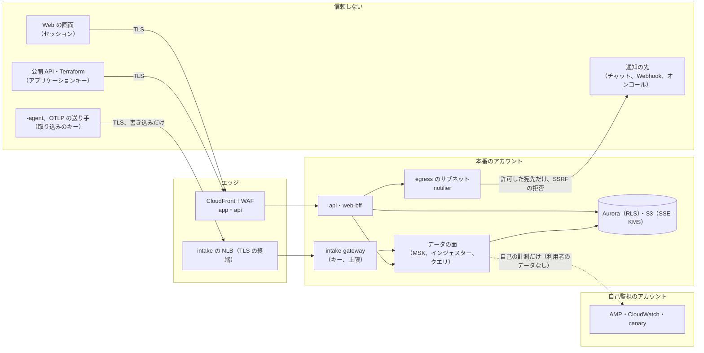
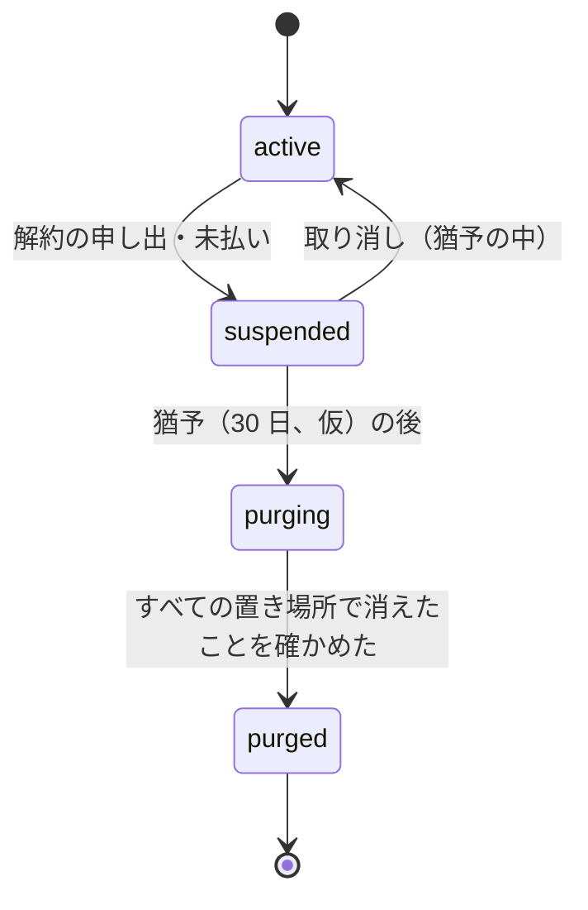

# Security: Datadog

脅威モデル（キーの漏えい、ログの中の秘密、組織をまたぐクエリの漏れ、悪意のあるエージェント、乗っ取られた連携）、信頼境界、暗号化と鍵の置き方、アプリの秘密、本システムの監査、データのライフサイクル（保持、解約、削除の請求、法的な保全）、ログの PII の扱い（L1）、社内の運用者のアクセス、セキュリティの試験とインシデントへの対応を決める。法務の判断が要るもの（L1・L3・L5・L6・L7）は枠だけを作り、結論を出さない。

| ADR | 決定 |
| --- | --- |
| [0056](../decisions/0056-encryption-keys-and-secrets.md) | 転送中は TLS 1.2 以上（取り込みとクエリの内部の経路を含む）。保存時は、データの種類ごと・リージョンごとのカスタマー管理の KMS の鍵（テレメトリー、アーカイブ、MSK、Aurora、監査、秘密、キャッシュ）。S3 はバケットキー。インスタンスの NVMe はハードウェアの暗号化に任せ、ヘッドのチェックポイントは S3 の鍵で守る。組織ごとの鍵（BYOK）は MVP で持たない。アプリの秘密（Webhook の署名、通知の連携の資格、マスクの HMAC の鍵）は、鍵の ID つきで 2 つを並べて回す |
| [0057](../decisions/0057-data-lifecycle-and-deletion-framework.md) | 保持の期間は `retention_policies` の 1 つの表で持ち、`compactor` がカタログを先に「削除中」にしてから消す。解約は 30 日の猶予の後に `tenant_id` の接頭辞ごと消し、S3 の古いバージョン（7 日）と大阪の写しを含めて消えたことを確かめて記録する。個人のデータの削除の請求は墓標と書き直し（[ADR-0036](../decisions/0036-personal-data-deletion-tombstones.md)）で、期限は法務の L5 の後。法的な保全は組織の単位で削除を止める |
| [0058](../decisions/0058-untrusted-senders-egress-and-operator-access.md) | 取り込みの送り手（エージェント、OTLP）は信頼しない。取り込みのキーは書き込みだけで読めず、漏れたときの被害を「データの注入と量の消費」に限る。外への送信（通知、Webhook、オンコールの連携）は egress のサブネットの専用の送信の部品だけから出し、SSRF を拒む。社内の運用者は、利用者のテレメトリーを日常の権限で読めず、読むときは組織の許可（サポートの許可）と JIT と監査の 3 つを要る |

前提：組織とセルと鍵の先頭の `tenant_id`（[ADR-0003](../decisions/0003-tenancy-cells-and-isolation.md)）、データのアクセスの制限（[ADR-0051](../decisions/0051-roles-permissions-and-data-access-restrictions.md)）、キーの形式と失効（[ADR-0015](../decisions/0015-key-format-validation-and-revocation.md)）、PII のマスク（[ADR-0031](../decisions/0031-pii-scrubbing-before-routing.md)）、保持の層（[ADR-0009](../decisions/0009-retention-tiers-on-s3.md)）。アカウントとネットワークは [infrastructure.md](infrastructure.md)、利用者に見せる監査ログは [tenancy-and-rbac.md](tenancy-and-rbac.md) の 8 節にある。

## 1. 目標と前提

- **守るもの**：利用者のテレメトリー（メトリクスの値とタグ、ログの本文、スパンの属性）、組織の設定、キーと資格、アラートが届くこと。
- **目標**：
  - 他の組織・制限の外のデータが、どの経路にも届かない（NFR-007、K7）。
  - 取り込みのキーが漏れても、データは読まれない。
  - ログ・トレースに混ざった個人のデータと秘密は、マスクの規則に当たれば、どこにもマスクの前の形で残らない（intent の「守るべき振る舞い」）。
  - 社内の運用者が、利用者のテレメトリーを日常の権限で読めない。
  - 保持の期間を過ぎたデータ、解約した組織のデータを、決めた期限までに確実に消す。
- **前提**：物理の保存と AWS の基盤は AWS の責任の範囲。暗号化はサーバー側（KMS）。利用者のホストでの秘密の扱いは利用者の責任で、エージェントは送る前に消す道具を持つ（4.2 節）。

## 2. 信頼境界

| 境界 | 守り |
| --- | --- |
| 送り手 → 取り込み | TLS（NLB で終端）、取り込みのキー（書き込みだけ）、本文の大きさ・展開の比率・タグ・窓の上限、割り当て（[ADR-0011](../decisions/0011-intake-gateway-pipeline-and-watermark-ticks.md)、[ADR-0012](../decisions/0012-intake-quota-coordination.md)） |
| 画面・API → 管理の面 | CloudFront＋WAF、セッション・アプリケーションキー、`can()`、RLS（[ADR-0051](../decisions/0051-roles-permissions-and-data-access-restrictions.md)） |
| 管理の面 → データの面 | `RestrictedIr` だけを受ける（[ADR-0007](../decisions/0007-query-language.md)、ADR-0051）。サービスの間は mTLS |
| データの面 → 外 | 外への経路を持たない。外への送信は egress の `notifier` だけ（[ADR-0058](../decisions/0058-untrusted-senders-egress-and-operator-access.md)） |
| 本番 → 自己監視 | 自己の計測（ID と数と理由のコード）だけを送る。自己監視のアカウントは本番に依存しない（[observability.md](observability.md)） |
| 運用者 → 本番 | JIT、人のロールにテレメトリーの読み出しと復号を与えない（8 節） |

## 3. 脅威モデル

### 3.1 取り込みのキーの漏えい

取り込みのキーはエージェントの設定・コンテナのイメージ・CI のログ・公開のリポジトリから漏れやすい。

| 脅威 | 対策 |
| --- | --- |
| 漏れたキーでデータを読む | 取り込みのキーは書き込みだけ。読み出しの API はアプリケーションキーかセッションだけを受ける。ゲートウェイは読み出しの経路を持たない |
| 偽のデータを注入して、グラフとアラートを誤らせる | 組織が気づけるように、キーごとの取り込みの量・送り元の IP の数・ASN・新しい系列の数を指標にし、急な変化を組織の管理者に知らせる（キーの使用の異常）。キーをホストの群れ・環境ごとに分けることを画面で勧める（組織あたり 50 本。[ADR-0015](../decisions/0015-key-format-validation-and-revocation.md)） |
| 量を使い切らせる（割り当て・費用） | 割り当てで 429（[ADR-0012](../decisions/0012-intake-quota-coordination.md)）、系列の上限（[ADR-0006](../decisions/0006-cardinality-policy.md)）、費用の上限（[usage-and-billing.md](usage-and-billing.md) の 7 節）。漏れたキーで生じた超過の扱いは**法務の確認待ち：L7**（利用規約） |
| 公開のリポジトリへの漏えい | キーの形（`<brand>_ik_`＋チェックサム）をシークレットスキャンの提携に登録する。通報を受けたら、組織に知らせ、24 時間の後に自動で失効する（組織が「すぐ失効」「残す」を選べる）。すぐに失効しないのは、本番のエージェントが止まって監視が切れるのを避けるため |
| 失効の遅れ | 60 秒（[ADR-0015](../decisions/0015-key-format-validation-and-revocation.md)）。Aurora の停止の間は既知の有効なキーを 15 分まで受けるので、失効が最大 15 分遅れる。漏えいの被害が書き込みだけなので、この遅れを受け入れる（ADR-0015 の「security.md で受け入れを確かめる」への答え） |

アプリケーションキー（読み出しができる）の漏えいは、スコープ、期限（既定 1 年）、送り元の IP の範囲、持ち主の権限との積（[ADR-0052](../decisions/0052-identity-sso-scim-keys-and-audit-trail.md)）で被害を絞る。シークレットスキャンの通報では、アプリケーションキーは**すぐに**失効する（書き込みのキーと違い、読まれる被害が大きい）。

### 3.2 ログの中の秘密と個人のデータ

| 脅威 | 対策 |
| --- | --- |
| 利用者のアプリケーションが、パスワード・トークン・カードの番号をログに書く | `log-processor` のマスクの規則（`secret_key`、`jwt`、`credit_card` など。[ADR-0031](../decisions/0031-pii-scrubbing-before-routing.md)）を、索引・アーカイブ・ライブテールの前に当てる。秘密の種類（キー、JWT）は既定で有効にする（個人のデータの種類の既定は法務の L1） |
| マスクの前の値が `logs-raw`・エラーのログに残る | `logs-raw` の保持を 24 時間にし、`log-processor` の外へ出さない（[ADR-0002](../decisions/0002-intake-log-on-msk.md)）。本システム自身のログに値を出さない（lint とログの抜き取りの走査、[observability.md](observability.md) の 2 節） |
| エージェントが送る前に消したい | エージェントに送る前のマスクの規則（ファイルのログ、OTLP の受け口）を持つ。既定で、本システムのキーの形と、よく知られた秘密の形（クラウドの鍵の接頭辞など）を消す（[intake-and-agent.md](intake-and-agent.md)） |
| トレースの属性（HTTP のヘッダー、SQL の文） | スパンの属性にも同じマスクを当てる（[traces-and-sampling.md](traces-and-sampling.md)） |
| メトリクスのタグに個人のデータ（利用者の ID、メールアドレス） | タグはマスクしない（系列の鍵が変わる）。画面と文書で、タグに個人のデータを入れないことを勧める。タグの値を消す削除の請求は 6.4 節 |

### 3.3 組織をまたぐクエリの漏れ

[ADR-0003](../decisions/0003-tenancy-cells-and-isolation.md) と [ADR-0051](../decisions/0051-roles-permissions-and-data-access-restrictions.md) の守りに加えて、次を置く。

| 経路 | 対策 |
| --- | --- |
| クエリの IR | `tenant_id` を認証の文脈からだけ入れる。`RestrictedIr` の型。実行の側で `tenant_id` と制限の節を確かめ直す |
| 結果のキャッシュ | 鍵に `tenant_id`・制限のハッシュ。キャッシュの値にも `tenant_id` を入れ、読んだ側で鍵と比べる（鍵の衝突・誤りに備えた 2 重の確かめ） |
| インジェスター・読み手の内部 | 系列の索引・ブロックは組織ごと。複数の組織のデータを 1 つのファイルに混ぜない（ADR-0003）。読み手は要求の `tenant_id` と、ブロックの頭の `tenant_id` を比べ、違えば読まずにアラート |
| 補完・ファセット・サービスマップ・ライブテール | 同じ述語（ADR-0051） |
| 通知の本文 | モニターの評価の主体の制限の中の値だけ（ADR-0051） |
| エラーの応答、時間 | 他の組織・制限の外の指標・索引の有無で、応答の形と時間を変えない（「結果 0」で返す） |
| 本番での確かめ | 応答の監査（[runbooks/](../runbooks/README.md) の 1 節の「分離」）。不一致 1 件で SEV1 の候補 |

### 3.4 悪意のあるエージェント・送り手

送り手は取り込みのキーを持つ利用者自身か、乗っ取られたホストである。

| 脅威 | 対策 |
| --- | --- |
| 解析の脆弱性（OTLP、StatsD、JSON、圧縮） | ゲートウェイは Rust。解析器をファジングする（[quality.md](../quality.md) の 2.2 節）。展開は流しながら、展開の後の大きさの上限（5 MB）と比率の上限で打ち切る（展開の爆弾） |
| 本文で `tenant_id`・他の組織を名乗る | 本文の `tenant_id`・組織のタグを使わない（ADR-0003）。`<brand>.*` の予約の名前空間の指標・タグは、取り込みで拒む（本システムが作るものと区別する） |
| 時刻の悪用（遠い未来・過去） | 受け付けの窓の外を拒む（[ADR-0004](../decisions/0004-tsdb-storage-engine.md)） |
| カーディナリティの爆発で同じシャードの他の組織を巻き込む | 系列の上限と作成の速さの上限（ADR-0006）、割り当て |
| 画面での注入（ログの本文の HTML・スクリプト、ANSI のエスケープ、CSV の式） | 画面はすべての利用者の値をテキストとして描く（`innerHTML` を使わない lint）。厳しい CSP。CSV の書き出しは `=`・`+`・`-`・`@` で始まる値を引用する |
| 利用者のエージェントの更新の乗っ取り | エージェントのパッケージとイメージに署名し、更新の目録を署名する（[delivery.md](delivery.md) の 5 節） |

### 3.5 乗っ取られた連携

MVP の連携は、外への通知（メール、チャットの受信の Webhook、汎用の Webhook、オンコールのサービス）と、オンコールのサービスからの解決の同期（受信）である。クラウドの統合（利用者の AWS のアカウントを読む）は MVP に含めない。

| 脅威 | 対策 |
| --- | --- |
| 通知の先が乗っ取られ、アラートの本文から利用者のデータが漏れる | 本文の既定は、モニターの名前・状態・値・リンク。ログの抜粋を入れるかは**法務の確認待ち：L2**。本文の変数はモニターの評価の主体の制限の中だけ |
| Webhook の宛先で内部の網を狙う（SSRF） | `notifier` は egress のサブネットだけで動き、VPC エンドポイント・内部への経路を持たない。送信の直前に名前を引き、私的・リンクローカル・メタデータのアドレスへの接続を拒む（[ADR-0058](../decisions/0058-untrusted-senders-egress-and-operator-access.md)） |
| 連携の資格（チャットの Webhook の URL、オンコールの連携の鍵）の漏えい | Aurora に、`kms-secrets` での封筒の暗号化で持つ。画面とログに出さない（末尾 4 文字だけ）。`notifier` だけが復号できる |
| 偽の解決の同期（受信） | オンコールのサービスからの受信は、連携ごとの秘密の署名を確かめる。受けるのはインシデントの状態の変更だけ |
| Webhook を受ける利用者が、本システムを名乗る偽物を受ける | `<Brand>-Signature`（HMAC-SHA256、時刻つき）で署名する（[notifications-and-integrations.md](notifications-and-integrations.md)） |

### 3.6 社内の運用者と供給網

- 運用者のアクセスは 8 節。
- 供給網：依存の固定、SBOM、脆弱性の走査、本家の実装と汎用の時系列・ログのデータベースの依存の禁止（[ADR-0001](../decisions/0001-platform-and-stack.md)）。CI は GitHub Actions の OIDC で長い期限の鍵を持たない。エージェントの署名の鍵は release のアカウントで 2 人の承認（[delivery.md](delivery.md) の 5 節）。

## 4. 暗号化と鍵

ADR-0056。

### 4.1 転送中

| 経路 | 方式 |
| --- | --- |
| 送り手 → NLB → ゲートウェイ | TLS 1.2 以上（1.3 を優先）。NLB の TLS のリスナーで終端し、NLB からゲートウェイまでは VPC の中で TLS を張り直す（[infrastructure.md](infrastructure.md) の 3 節） |
| 画面・API → CloudFront → ALB | TLS 1.2 以上 |
| サービスの間（ゲートウェイ → MSK、インジェスター ↔ クエリ、管理の面 → `query-frontend`） | TLS。MSK はクライアントとブローカーの間の TLS とブローカーの間の暗号化を有効にする。データの面の RPC は mTLS（証明書は AWS Private CA、1 日で回す） |
| Aurora、Valkey | `rds.force_ssl`、転送中の暗号化 |
| S3 | バケットの方針で `aws:SecureTransport` を必須にする |

### 4.2 保存時

| 対象 | 鍵 | 注記 |
| --- | --- | --- |
| S3 のブロック・セグメント・トレース・評価の記録・ヘッドのチェックポイント | `kms-telemetry`（リージョンごと） | SSE-KMS とバケットキー（[ADR-0009](../decisions/0009-retention-tiers-on-s3.md)） |
| S3 のアーカイブ | `kms-archive` | 鍵を分け、アーカイブの読み出し（再水和）の権限を別のロールに絞る |
| MSK | `kms-msk` | 保存時の暗号化にカスタマー管理の鍵 |
| Aurora | `kms-aurora` | 大阪の二次は大阪の鍵 |
| 監査（log-archive のアカウント） | `kms-audit` | Object Lock |
| アプリの秘密 | `kms-secrets` | 4.3 節 |
| Valkey | `kms-cache` | |
| インスタンスの NVMe（読み手のキャッシュ、インジェスターの一時の置き場） | ハードウェアの暗号化 | NVMe のインスタンスストアは、インスタンスのハードウェアの XTS-AES-256 で暗号化され、鍵は止めるか終えると消える（[Data protection in Amazon EC2](https://docs.aws.amazon.com/AWSEC2/latest/UserGuide/data-protection.html)、2026-10-09 に確認）。追加の暗号化はしない |
| 自己監視のアカウント | `kms-selfmon` | 本番の鍵と別のアカウント |

- 鍵はデータの種類ごと・リージョンごとに分け、大阪の写しは大阪の鍵で暗号化し直す。マルチリージョンの鍵は使わない（影響の範囲を絞る）。
- 鍵の方針で `kms:Decrypt` を決めたサービスのロールにだけ許す。人のロールは、break-glass を除いて復号できない。鍵の削除の予約・無効化は SCP で break-glass に限る。鍵は 1 年で自動で回す。
- **組織ごとの鍵（BYOK）を持たない**（[ADR-0003](../decisions/0003-tenancy-cells-and-isolation.md)、[ADR-0009](../decisions/0009-retention-tiers-on-s3.md)）。消去は、オブジェクトと行を本当に消すことで行う（5 節）。BYOK は MVP の後。

### 4.3 アプリの秘密

| 秘密 | 置き場所 | 回し方 |
| --- | --- | --- |
| Webhook の署名の秘密（組織・連携ごと） | Aurora、`kms-secrets` の封筒の暗号化 | 組織が作り直す。新旧を 24 時間並べて両方で署名する |
| 通知の連携の資格（チャットの URL、オンコールの鍵） | 同上 | 組織が入れ直す |
| PII のマスクの HMAC の鍵（組織ごと。[ADR-0031](../decisions/0031-pii-scrubbing-before-routing.md)） | 同上 | 回すと同じ値の HMAC が変わる（過去と結び付かない）ことを組織に示す。既定は回さない |
| SAML の SP の署名の鍵、OIDC のクライアントの秘密 | Secrets Manager | 期限の 30 日前に知らせる |
| メールの送信の鍵、オンコールのサービスへの本システムの自己監視の連携の鍵 | Secrets Manager（本番）、自己監視のアカウントの Secrets Manager（自己監視） | 分ける |
| 取り込みのキー、アプリケーションキー、SCIM のトークン | ハッシュだけ（[ADR-0015](../decisions/0015-key-format-validation-and-revocation.md)） | — |

## 5. データのライフサイクル

ADR-0057。

### 5.1 保持の期間（既定）

| データ | 既定 | 決める場所 |
| --- | --- | --- |
| メトリクス | 生 15 日、1 分 63 日、1 時間 15 か月 | [ADR-0009](../decisions/0009-retention-tiers-on-s3.md) |
| ログの索引 | 3・7・15・30 日（組織が索引ごとに選ぶ） | 同上 |
| ログのアーカイブ | 1 年 | 同上 |
| トレース（残したもの） | 15 日 | 同上 |
| MSK（`logs-raw` を含む） | 24 時間 | [ADR-0002](../decisions/0002-intake-log-on-msk.md) |
| モニターの評価の記録 | 30 日 | [ADR-0008](../decisions/0008-monitor-evaluation-model.md) |
| 利用者に見せる監査ログ | 90 日（仮） | **法務の確認待ち：L6** |
| 本システムの監査（log-archive） | 1 年（仮） | **法務の確認待ち：L6** |
| 本システム自身のログ（自己監視） | 30 日 | [observability.md](observability.md) |
| 解約の後の猶予 | 30 日（仮） | **法務の確認待ち：L5・L7** |

- 値は `retention_policies`（データの種類 → 既定・選べる値・法務の確認の状態）の 1 つの表で持ち、`compactor` と画面が同じ表を読む。法務の結論で変えるときは、この表とこの節を同じ変更で直す。

### 5.2 保持の期限の削除

- `compactor` がカタログ（`metric_blocks`、`log_segments` など）を見て、期限を過ぎた行を「削除中」にし、クエリの計画から外してから S3 のオブジェクトを消す。S3 のライフサイクル（保持＋1 日）は後ろの守り（[ADR-0009](../decisions/0009-retention-tiers-on-s3.md)）。
- S3 のバージョニングの古いバージョンは 7 日で消える。大阪の写しは、大阪のバケットのライフサイクルと、削除の写し（CRR の削除マーカーの写し）で消える。削除マーカーの写しの扱いは E1 の `s3-buckets-baseline` で確かめる（**未検証**）。

### 5.3 解約と組織の削除

- `suspended`：取り込みを 403 にし、画面は管理者だけが入れる（書き出しのため）。モニターの評価と通知を止める。
- `purging`：`tenant-purge` の作業が、置き場所ごとに消す：S3 の `<cell>/<tenant_id>/` の接頭辞（東京・大阪、すべての区分）、Aurora の行（`tenant_id` で）、Valkey の鍵、MSK（24 時間の保持で自然に消えるのを待つ）。キャッシュの世代の番号を上げる。
- `purged`：S3 の古いバージョンが消える 7 日の後に、接頭辞の一覧が空であること（東京・大阪）、Aurora の行が 0 であることを確かめ、確かめの記録（数だけ）を本システムの監査に残す。
- 猶予の期間、S3 の古いバージョンを含めた消去の期限の約束は**法務の確認待ち：L5・L7**。

### 5.4 個人のデータの削除の請求

- ログ・トレースの行は、墓標で隠してから書き直しで消す（[ADR-0036](../decisions/0036-personal-data-deletion-tombstones.md)、[log-storage-and-search.md](log-storage-and-search.md)）。
- アーカイブ（1 年、Glacier Instant Retrieval）の書き直しは、取り出しの費用（0.03 USD/GB。[infrastructure.md](infrastructure.md) の出典）がかかる。請求ごとに読む量を見積もる。
- メトリクスのタグの値（系列の鍵に入った個人のデータ）は、系列ごと消す（ブロックの書き直しで、その系列の点を落とす）。合計の値が変わることを組織に示す。手段の細部は [tsdb-storage-engine.md](tsdb-storage-engine.md)。
- 結果のキャッシュは、組織の世代の番号を上げて無効にする（[ADR-0007](../decisions/0007-query-language.md)）。
- 期限と、S3 の古いバージョン・大阪の写しの扱いは**法務の確認待ち：L5**。

### 5.5 法的な保全

- 組織の単位で `legal_hold` を付けると、その組織の保持の削除・解約の消去・削除の請求の物理の消去（墓標は付ける）を止める。付け外しは法務と Ops の 2 人で、本システムの監査に残す。
- 保全の範囲（組織か、期間か、データの種類か）と手順は**法務の確認待ち：L6**。

## 6. ログの PII の扱い（L1 の枠）

- マスクの実行の場所と方式は [ADR-0031](../decisions/0031-pii-scrubbing-before-routing.md)（パイプラインの後、振り分け・ログから作るメトリクス・ライブテールの前、すべての文字列の値）。この節は、法務の結論に合わせて変えられるようにする枠である。
- **既定で有効にする種類**：秘密の種類（`secret_key`、`jwt`）は既定で有効にする（個人のデータではなく、漏れたときの被害が利用者の外に及ぶため）。個人のデータの種類（`email`、`phone_jp`、`ipv4`・`ipv6`、`credit_card`、`my_number`）の既定は**法務の確認待ち：L1**。設定の値（`pii_defaults`）で切り替えられるようにし、結論まで「組織が選ぶ（既定は無効）」で作る。
- **委託の扱い**：本システムが利用者のテレメトリーの個人のデータを、委託として扱うか（安全管理措置、再委託先の一覧、漏えい等の報告の責任と手順）は**法務の確認待ち：L1・L7**。設計は、委託として扱う場合に要る統制（アクセスの記録、運用者の読み出しの制限、再委託先の一覧の管理、漏えいの検知と組織への知らせ）を持つ形にする（8 節、9 節）。
- **通信の秘密**：利用者のログに含まれる他人の通信の中身を、マスク・索引・検索のために機械で読むことの扱いは**法務の確認待ち：L3**。
- **本番での確かめ**：毎日、索引のセグメントの抜き取りを、マスクの規則と同じ検出器で走査し、マスクされずに残った値の数を数える（値は記録しない。[quality.md](../quality.md) の 4.2 節）。

## 7. 本システムの監査

利用者に見せる監査ログ（[tenancy-and-rbac.md](tenancy-and-rbac.md) の 8 節）とは別に、本システムの運用と統制の記録を持つ。

| 記録 | 置き場所 | 改ざんの検出 |
| --- | --- | --- |
| AWS の操作（CloudTrail、組織の証跡）、Config | log-archive のアカウント、Object Lock | CloudTrail のログのファイルの整合性の検証 |
| 運用者のアクセス（JIT の付与、break-glass、サポートの許可での読み出し） | Aurora の `operator_access_log` と log-archive への写し | 日ごとのハッシュの連鎖 |
| 利用者の監査ログの写し | log-archive の Object Lock（[tenancy-and-rbac.md](tenancy-and-rbac.md) の 8.2 節） | 組織・日ごとのハッシュの連鎖 |
| 削除・解約の消去の確かめの記録 | 同上 | 同上 |

- 日ごとのハッシュの連鎖：その日の事象を並べたハッシュに、前の日の連鎖の値を含める。毎日、連鎖を検算し、合わなければ呼び出す。
- 保持（仮 1 年）は**法務の確認待ち：L6**。

## 8. 社内の運用者のアクセス

ADR-0058。

| 種類 | 許す操作 | 条件 |
| --- | --- | --- |
| 日常（Ops の当番） | 自己監視のアカウントの Grafana、本番のメタデータ（組織の ID、数、状態、SLI）、`ops.*` のフラグ | SSO（IAM Identity Center）。テレメトリーの値・ログの本文・クエリの文字列に触れない |
| 本番の変更 | デプロイの承認、Terraform の適用 | 作成者と別の人の承認（[runbooks/](../runbooks/README.md) の 3 節） |
| サポートでの読み出し | 組織のデータを、その組織の利用者として見る（読み取りの役割） | 組織の管理者の「サポートの許可」（期限 72 時間まで、画面で付ける）＋ JIT（4 時間）＋ 監査（組織の監査ログと本システムの監査の両方）。値の書き出しはしない |
| break-glass | KMS の復号、Object Lock の外の操作など | 2 人の承認、使用ですぐに呼び出しとセキュリティの担当への知らせ、事後のレビュー |

- 人のロールに、S3 のテレメトリーの `GetObject`、`kms-telemetry`・`kms-archive` の復号、MSK のトピックの読み出しを与えない。IAM の方針の検査で拒む（[infrastructure.md](infrastructure.md) の 8 節）。
- 開示の請求・捜査機関からの照会への応答の手順（利用者への事前の知らせを含む）は**法務の確認待ち：L6**。応答はサポートでの読み出しと同じ経路で行い、書き出したものは記録する。
- 国外からの運用者の参照（データの所在）は**法務の確認待ち：L2**。SCP と IAM の条件で、運用者の参照の元の国を絞れる形にしておく（送り元の IP の条件）。

## 9. セキュリティの試験と脆弱性の管理

| 試験 | 中身 | いつ |
| --- | --- | --- |
| ファジング | 取り込みの形式、展開、クエリの構文解析、ブロック・セグメントの復号 | 夜間（[quality.md](../quality.md) の 2.2 節） |
| 漏れの経路の表 | [quality.md](../quality.md) の 2.2.1 節 G、[tenancy-and-rbac.md](tenancy-and-rbac.md) の 12 節 | PR |
| IAM・ネットワークの方針の検査 | 8 節の人のロール、egress、データの面の外への経路 | Terraform の plan |
| 秘密の漏れの検査 | 本システムのログ・トレースに、キーの形・利用者のログの本文が出ない（抜き取りの走査） | 毎日 |
| 外部のペンテスト | 取り込み、API、画面、データのアクセスの制限、SSRF、組織をまたぐ漏れ | E13 の `pentest-external`、その後は年 1 回 |
| 脆弱性の走査 | コンテナのイメージ、AMI、依存（Rust の `cargo audit`、npm） | PR と毎日。Critical は 7 日、High は 30 日で直す |

## 10. インシデントへの対応

| 事象 | 最初の手 | 手順 |
| --- | --- | --- |
| 組織をまたぐ漏れの疑い（応答の監査の不一致） | その経路（キャッシュ、補完など）を `ops.*` で止める。組織の `authz_version` を上げる | `access-leak-response.md` |
| PII の漏れ（走査で検出） | 当たったセグメントを墓標で隠し、マスクの規則を直す | `pii-leak-response.md`（法務の L1 の後に確定） |
| 取り込みのキーの大量の漏えい（公開のリポジトリ） | 組織へ知らせ、24 時間の後に失効（3.1 節） | `key-leak-response.md` |
| 運用者の資格の乗っ取りの疑い | Identity Center のセッションの取り消し、break-glass の鍵の回し | `operator-credential-compromise.md` |

- 利用者への知らせと公表、個人情報保護委員会への報告の要否と手順は**法務の確認待ち：L1**。

## 11. テスト

| 種類 | 中身 | 要件 |
| --- | --- | --- |
| 方針の検査 | 人のロールにテレメトリーの読み出し・復号がない。`notifier` の外にインターネットへの経路がない。鍵の方針の復号の主体が決めたロールだけ | `REQ-SEC-*` |
| 結合 | 取り込みのキーで読み出しの API を呼ぶと 401。シークレットスキャンの通報で、取り込みのキーは 24 時間の後、アプリケーションキーはすぐに失効する | `REQ-SEC-*` |
| 性質ベース | 任意の組織の列で、読み手がブロックの頭の `tenant_id` と要求の `tenant_id` の違いを必ず拒む | `PROP-SEC-001` |
| 解約 | 縮めた規模で、組織の解約から `purged` までに、東京・大阪のすべての接頭辞と Aurora の行が 0 になる | `PROP-SEC-002` |
| SSRF | 私的・リンクローカル・メタデータのアドレス、DNS の再結合、リダイレクトで内部へ向ける Webhook を拒む（試験のベクトル） | `REQ-SEC-*` |

## 12. Story の候補

| Epic | Story | 中身 |
| --- | --- | --- |
| E1 | `kms-keys-and-policies` | 4.2 節の鍵と鍵の方針、SCP |
| E1 | `audit-log-table-and-archive` | 7 節の本システムの監査、ハッシュの連鎖（roadmap の Story を広げる） |
| E1 | `operator-access-jit` | 8 節の JIT、サポートの許可、break-glass |
| E2 | `intake-key-anomaly-alerts` | 3.1 節のキーの使用の異常の知らせ、シークレットスキャンの通報の受け口 |
| E5 | `pii-defaults-framework` | 6 節の `pii_defaults` の切り替え（logs-pipeline と共同）。既定は法務：L1 |
| E8 | `egress-ssrf-guard` | 3.5 節（notifications-and-integrations と共同） |
| E11 | `support-access-grants` | 8 節のサポートの許可の画面と監査 |
| E13 | `tenant-purge` | 5.3 節。猶予と期限は法務：L5・L7 |
| E13 | `legal-hold` | 5.5 節。範囲は法務：L6 |
| E13 | `pentest-external` | 9 節 |

## 13. 未解決の問い

### 決定

2026-10-09 の既定案。E1・E11・E13 で覆りうる。

- **鍵**：データの種類ごと・リージョンごとのカスタマー管理の鍵。BYOK なし（ADR-0056）。
- **ライフサイクル**：`retention_policies` の 1 つの表、カタログを先に削除中、解約は接頭辞ごと消して確かめる（ADR-0057）。
- **送り手と外への送信と運用者**：取り込みのキーは書き込みだけ、egress の 1 つの部品、運用者はサポートの許可＋JIT＋監査（ADR-0058）。
- **シークレットスキャンの通報**：取り込みのキーは 24 時間の後に失効、アプリケーションキーはすぐ（3.1 節）。
- **ADR-0015 の Aurora の停止の間の失効の遅れ（15 分）**：書き込みだけのキーなので受け入れる（3.1 節）。

### 持ち越し

| 問い | いつ・どう決めるか |
| --- | --- |
| PII の既定、委託の扱い、漏えいの報告 | **法務の確認待ち：L1** |
| 国外からの運用者の参照、通知の本文 | **法務の確認待ち：L2** |
| 通信の秘密（ログの機械の読み取り） | **法務の確認待ち：L3** |
| 削除の請求の期限、S3 の古いバージョン・大阪の写しの扱い、解約の猶予 | **法務の確認待ち：L5** |
| 監査ログの保持、開示の請求・捜査機関への応答、法的な保全の範囲 | **法務の確認待ち：L6** |
| 漏れたキーで生じた超過の扱い、消去の約束の文言 | **法務の確認待ち：L7** |
| CRR の削除マーカーの写しで大阪の写しが消えるか | E1 の `s3-buckets-baseline`（**未検証**） |
| BYOK | MVP の後 |

## 14. quality.md・runbooks・data-model への項目

### quality.md

- 2.2.1 節 G の表に「読み手のブロックの頭の `tenant_id` の確かめ」「キャッシュの値の `tenant_id` の確かめ」の行を足す。
- E13 の合否基準に `PROP-SEC-002`（解約の消去）を足す。

### runbooks

- `key-leak-response.md`、`operator-credential-compromise.md` を足す（10 節）。
- `access-leak-response.md`、`pii-leak-response.md` に 10 節の最初の手を足す。

### data-model への項目

| 表・置き場所 | 中身 | 節 |
| --- | --- | --- |
| `retention_policies`（保守のスキーマ） | データの種類、既定、選べる値、法務の確認の状態 | 5.1 |
| `tenants` に足す列 | `lifecycle_state`（`active`・`suspended`・`purging`・`purged`）、`suspended_at`、`legal_hold` | 5.3、5.5 |
| `tenant_purge_runs` | 置き場所ごとの消去と確かめの結果（数だけ） | 5.3 |
| `support_access_grants` | 組織、許可した人、期限、範囲 | 8 |
| `operator_access_log` | 運用者、組織、操作、JIT の ID、理由のコード | 7、8 |
| `integration_secrets` | 連携の資格・Webhook の秘密（封筒の暗号化、鍵の ID） | 4.3 |
| `pii_defaults`（AppConfig） | 既定で有効にするマスクの種類 | 6 |

## 出典

いずれも 2026-10-09 に確認。

- AWS, [Data protection in Amazon EC2](https://docs.aws.amazon.com/AWSEC2/latest/UserGuide/data-protection.html)：NVMe のインスタンスストアは、インスタンスのハードウェアの XTS-AES-256 で暗号化され、鍵は顧客・ボリュームごと、止めるか終えると消える。無効にできず、自分の鍵も使えない
