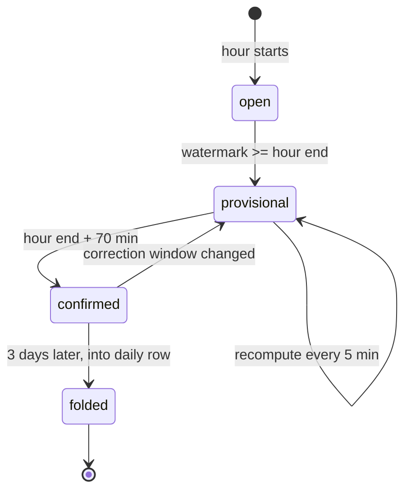
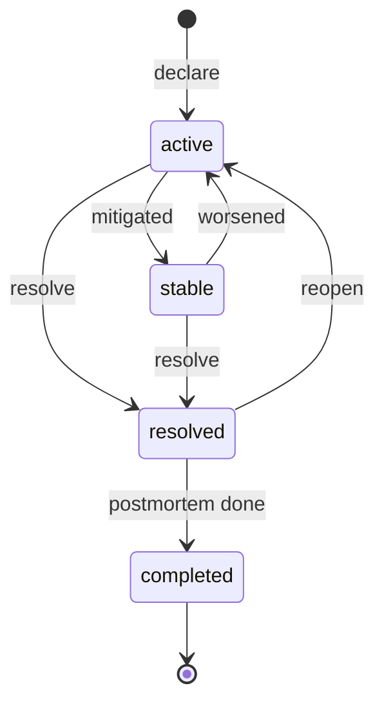

# SLOs and Incidents: Datadog

SLO と軽いインシデント管理を決める。メトリクスの SLO とモニターの SLO、SLI とエラーバジェットの計算、時ごと・日ごとの集計と遅れたデータでの確定、除外の期間、複数の窓のバーンレートのアラート、エラーバジェットの残りのアラート、インシデントの宣言・重さ・状態・担当・タイムライン・通知・振り返りの雛形を扱う。

前提となる決定は次のとおり。

- クエリは IR を通し、ダッシュボード・モニターと同じエンジンで実行する（[ADR-0007](../decisions/0007-query-language.md)）
- メトリクスの受け付けの窓は過去 1 時間。ブロックの書き出しは区切りから 70 分（[ADR-0004](../decisions/0004-tsdb-storage-engine.md)）
- モニターの評価、水位、状態の機械、遷移の記録（[ADR-0008](../decisions/0008-monitor-evaluation-model.md)、[ADR-0041](../decisions/0041-monitor-state-machine.md)）。フラッピングは状態を変えない（[ADR-0042](../decisions/0042-flapping-and-renotify.md)）。ダウンタイムは状態を進め通知だけを抑える（[ADR-0043](../decisions/0043-downtimes-as-evaluation-input.md)）
- 通知は [notifications-and-integrations.md](notifications-and-integrations.md) の経路（[ADR-0045](../decisions/0045-notification-delivery-model.md)）
- インシデント管理は MVP に軽いものを含める。オンコールの当番の表は持たず、外部のオンコールのサービスに渡す（[architecture/README.md](README.md) の 6 節の決定）

この文書で決めたことは次の ADR にある。

| ADR | 決定 |
| --- | --- |
| [0049](../decisions/0049-slo-computation-and-burn-rate.md) | SLO の良い数と全体の数を、時ごとに計算して積む。時の行は水位を越えたら暫定、区切りから 70 分で確定し、3 日後に日の行に畳む。窓の SLI は日の行・時の行・今の時の和から求める。モニターの SLO は遷移の記録から、選んだグループのどれも ALERT でない時間を良い時間とする。バーンレートのアラートはモニターの種類 `slo_burn_rate` で、値を `min(長い窓のバーンレート, 短い窓のバーンレート)` とし、閾値以上で ALERT にする |
| [0050](../decisions/0050-incident-timeline.md) | インシデントは Aurora の行と、追記だけの出来事の列（タイムライン）で持つ。状態は `active` → `stable` → `resolved` → `completed`（振り返りの済み）、`resolved` から `active` に戻せる。出来事は書き換えず、直すときは直しの出来事を足す。モニターの遷移・通知は写さず参照する。通知は outbox を通す |

## 1. 範囲

- 扱う：
  - SLO の種類、目標、窓、除外の期間
  - SLI とエラーバジェットの計算、時ごと・日ごとの集計、確定
  - バーンレートのアラート、エラーバジェットの残りのアラート
  - SLO のウィジェットと画面の値
  - インシデントの宣言、重さ、状態、担当、タイムライン、通知、振り返りの雛形
- 扱わない：
  - モニターの評価のエンジン（[monitors-and-alerting.md](monitors-and-alerting.md)。バーンレートのモニターもそこで評価する）
  - 通知の送り方（[notifications-and-integrations.md](notifications-and-integrations.md)）
  - オンコールの当番の表（MVP の後。外部のサービス）
  - 本システム自身の SLO（[runbooks/](../runbooks/README.md)。本システムのこの機能では測らない）

## 2. 要件

| 要件 | 目標 | NFR |
| --- | --- | --- |
| 計算の正しさ | SLI とエラーバジェットが、参照（窓のすべての点・遷移を素直に数える）と一致する（確定の後） | quality.md の 5 節 E10 |
| 遅れたデータ | 受け付けの窓の中の遅れた点は、確定の前に SLI に入る。確定の後に値が変わらない | NFR-008 |
| 表示の速さ | 30 日の SLO の表示 p95 1 秒（時と日の行の和から） | NFR-003 |
| バーンレートのアラート | モニターと同じ評価の遅れ（p99 30 秒）と決定性 | NFR-004 |
| 分離 | SLO・インシデントの画面と通知に、制限の外のデータが出ない | NFR-007 |
| タイムライン | 出来事を失わず、書き換えない。誰がいつ何をしたかが残る | — |

## 3. 本家の形（確かめたこと）

- バーンレートのアラートは、長い窓（1〜48 時間）と短い窓（画面では長い窓の 1/12）の両方でバーンレートが閾値以上のときに鳴る。閾値の上限は `1 / (1 − 目標)`。メトリクスの SLO、時間の区切りの SLO、メトリクスのモニターだけでできたモニターの SLO で使える（[Burn Rate Alerts](https://docs.datadoghq.com/service_management/service_level_objectives/burn_rate/)、2026-10-09 に確認）。
- 目標 99.9% の推奨の値（同上）：

| 窓 | バーンレート | 長い窓 | 短い窓 |
| --- | --- | --- | --- |
| 7 日 | 16.8・5.6・2.8 | 1・6・24 時間 | 5・30・120 分 |
| 30 日 | 14.4・6・3 | 1・6・24 時間 | 5・30・120 分 |
| 90 日 | 21.6・10.8・4.5 | 1・6・24 時間 | 5・30・120 分 |

- 本家のモニターの SLO でのデータなしの扱い、SLO の除外の期間の形、インシデント管理の状態の名前と重さの段は、確かめなかった（**未検証**）。

## 4. SLO の定義

| 項目 | 内容 |
| --- | --- |
| 種類 | `metric`（良い数と全体の数のクエリ）、`monitor`（モニターと、選んだグループ） |
| 目標 | 90〜99.999%。任意の警告の目標 |
| 窓 | 7・30・90 日の移動の窓（1 つの SLO に 3 つまで） |
| 時間帯 | 日の区切り（既定 `Asia/Tokyo`）。画面の日ごとの表示に使う |
| 除外の期間 | 1 回か RRULE。その間を良い数・全体の数の両方から除く |
| モニターの SLO のデータなし | 既定は数えない（良いにも全体にも入れない）。悪いとして数える設定 |

- メトリクスの SLO の例：良い数 `sum:http.requests{service:checkout,status_class:2xx}.as_count()`、全体の数 `sum:http.requests{service:checkout}.as_count()`。どちらも count のクエリでなければならない（保存のときに IR の型で確かめる）。
- SLO のクエリにも、作った人の役割の制限を IR に足す（モニターの評価の主体と同じ。[monitors-and-alerting.md](monitors-and-alerting.md) の 4.3 節）。

## 5. 計算

[ADR-0049](../decisions/0049-slo-computation-and-burn-rate.md)。

### 5.1 時の行

- `slo-calculator`（`monitor-evaluator` と同じバイナリの別の役割。シャードの割り当ても同じ）が、SLO ごとに時の行（`good`、`total`）を作る。
- **メトリクスの SLO**：良い数と全体の数のクエリを、その時の 1 時間の窓で実行する。水位が時の終わりを越えたら `provisional`（暫定）にし、5 分ごとに計算し直す。時の終わりから 70 分（受け付けの窓 60 分＋猶予 10 分。ブロックの書き出しと同じ）で `confirmed`（確定）にし、以後は変えない。
- **モニターの SLO**：その時のモニターの遷移の記録から、選んだグループのどれも ALERT でない秒を `good`、時の秒（データなしを数えないときは、選んだグループがすべてデータなしの秒を除く）を `total` にする。モニターの `evaluated_through` が時の終わりを越えたら確定する（遷移の記録は後から変わらない）。
- 確定の後は、除外の期間を変えたときだけ、影響する時の行を暫定に戻して計算し直す。

### 5.2 日の行と窓の値

- 確定から 3 日たった時の行を、SLO の時間帯の日ごとに日の行に畳む（和）。日の行は 400 日持つ。
- 窓の SLI：`SLI = Σgood ÷ Σtotal`。和は、窓に入る日の行、日の行に畳む前の時の行、今の時（その場で計算）から取る。窓の端の日は時の行で持つので、窓の始まりは時の単位に揃う。
- 暫定の時の行を含む間、画面に「暫定」を示す。

### 5.3 エラーバジェット

- 悪い数 `bad = total − good`。許される悪い数 `allowed = (1 − 目標) × total`。使った割合 `consumed = bad ÷ allowed`、残り `remaining = 1 − consumed`（負にもなる）。
- モニターの SLO は秒で同じ式。
- 例：30 日、目標 99.9%、`total = 1 億`、`good = 9,994 万` → `bad = 6 万`、`allowed = 10 万`、`consumed = 60%`、`remaining = 40%`、`SLI = 99.94%`。

### 5.4 大きさ

- S1 で組織あたり SLO 50 を見込むと、5 万の SLO。時の行は 92 日分（窓の始まりが時の単位に揃うので、90 日の窓の端の時の行が要る。[data-model.md](data-model.md) の D-28）で 約 1.1 億行、日の行は 400 日で 2,000 万行。日の行への畳みは確定から 3 日。Aurora の組織の表に置き、月ごとに分ける。

## 6. バーンレートのアラート

[ADR-0049](../decisions/0049-slo-computation-and-burn-rate.md)。

### 6.1 定義と評価

- バーンレート：`burn(窓) = (bad ÷ total)（その窓） ÷ (1 − 目標)`。1 なら、SLO の窓のちょうど終わりにバジェットを使い切る速さ。
- モニターの種類 `slo_burn_rate`：SLO、長い窓 `L`（1〜48 時間）、短い窓 `S`（既定 `L ÷ 12`、`L` より短い任意の値）、閾値 `X`（`1 / (1 − 目標)` まで）。
- 評価の値は `v = min(burn(L), burn(S))`。比べは `v ≥ X` で ALERT（警告の閾値も持てる）。「両方の窓で閾値以上」は「小さいほうが閾値以上」と同じなので、ふつうのモニターの `step()`（[ADR-0041](../decisions/0041-monitor-state-machine.md)）にそのまま乗る。
- メトリクスの SLO は、良い数と全体の数のクエリを `L` と `S` の窓で実行する（4 つのクエリを 1 つの評価にまとめる）。評価の頻度は 1 分、水位を待つ（[ADR-0008](../decisions/0008-monitor-evaluation-model.md)）。
- モニターの SLO は、元のモニターの遷移の記録から `L` と `S` の悪い秒を求める。元のモニターの `evaluated_through ≥ t` を待つ（複合モニターと同じ、[ADR-0044](../decisions/0044-composite-monitors.md)）。
- 窓に `total = 0` のときは値なし（データなしの方針は既定「保つ」）。

### 6.2 既定の組

SLO を作ると、窓に応じて次のバーンレートのモニターを作ることを提案する（利用者が選ぶ）。値は 3 節の本家の推奨に合わせる。

| SLO の窓 | 呼び出し（ページ） | 呼び出し | チケット |
| --- | --- | --- | --- |
| 7 日 | 16.8（1 時間・5 分） | 5.6（6 時間・30 分） | 2.8（24 時間・2 時間） |
| 30 日 | 14.4（1 時間・5 分） | 6（6 時間・30 分） | 3（24 時間・2 時間） |
| 90 日 | 21.6（1 時間・5 分） | 10.8（6 時間・30 分） | 4.5（24 時間・2 時間） |

- 30 日の 14.4 は、1 時間で 30 日のバジェットの 2%（`14.4 × 1 ÷ 720`）を使う速さ。

### 6.3 例

30 日、目標 99.9%、閾値 14.4、`L = 1 時間`、`S = 5 分`。

| 時刻 | 1 時間のエラーの率 | `burn(L)` | 5 分のエラーの率 | `burn(S)` | `v` | 状態 |
| --- | --- | --- | --- | --- | --- | --- |
| 10:00 | 0.05% | 0.5 | 0.04% | 0.4 | 0.4 | OK |
| 10:20 | 1.0% | 10 | 3.0% | 30 | 10 | OK（長い窓が届かない） |
| 10:35 | 2.0% | 20 | 1.6% | 16 | 16 | **ALERT** |
| 10:50 | 2.2% | 22 | 0.05% | 0.5 | 0.5 | **OK**（修正の後、短い窓で早く戻る） |

### 6.4 エラーバジェットの残りのアラート

- モニターの種類 `slo_budget`：残り（5.3 節）が閾値（例：25%）以下で ALERT。評価の頻度は 1 時間、値は確定と暫定の行から求める（暫定の値で ALERT にはするが、OK への戻りは確定の値でだけ。不完全の扱いと同じ考え方）。

## 7. インシデント

[ADR-0050](../decisions/0050-incident-timeline.md)。

### 7.1 項目

| 項目 | 内容 |
| --- | --- |
| 番号 | 組織ごとの連番（`INC-128`） |
| 題 | — |
| 重さ | `SEV-1`〜`SEV-5`（組織が名前と説明を変えられる） |
| 状態 | 7.2 節 |
| 指揮者（commander） | 組織の利用者 1 人 |
| 対応者 | 利用者の並び |
| 影響するサービス | サービスの名前の並び（RED・サービスマップの `service`） |
| 顧客への影響 | 有無と説明、始まりと終わりの時刻 |
| 結び付け | モニター、ダッシュボード、SLO |
| 通知の先 | 組織の既定（重さごと）と、インシデントごとの追加 |

### 7.2 状態

- 宣言の入口：画面のボタン、モニターの通知のリンク（モニターとグループを前もって入れる）、公開 API。
- `resolved` で、振り返りの雛形を作る（7.5 節）。

### 7.3 タイムライン

- 出来事は追記だけ（`incident_events`）。種類：`declared`、`status_changed`、`severity_changed`、`field_changed`（題・指揮者・対応者・サービス・影響）、`note_added`、`note_corrected`（直す元の出来事を参照し、元を残す）、`monitor_event`（結び付けたモニターの遷移の参照）、`notification_sent`（送信の行の参照）、`oncall_acknowledged`（オンコールのサービスからの戻り、[notifications-and-integrations.md](notifications-and-integrations.md) の 7.6 節）、`postmortem_created`。
- 各出来事は、`occurred_at`（起きた時刻。メモは利用者が過去の時刻にできる）、`recorded_at`（書いた時刻）、行為者（利用者・システム）を持つ。並びは（`occurred_at`、`recorded_at`、ID）。
- 結び付けたモニターの遷移は、モニターの遷移の記録への参照で持ち、値を写さない。表示のときに、見る人がそのモニターを見られなければ「見られない出来事 1 件」とだけ出す（漏れの経路）。
- メモは Markdown（64 KiB まで、サニタイズ）。利用者が書いた文なので、利用者の顧客の個人のデータを書かないよう画面で案内する。

### 7.4 通知

- 宣言・状態・重さの変更で、通知の依頼（出どころ＝インシデント）を outbox に書き、[notifications-and-integrations.md](notifications-and-integrations.md) の経路で送る。重ねない鍵は（インシデント、出来事の ID）。
- 本文はインシデントの題・重さ・状態・指揮者・画面へのリンク。メモの本文は既定で入れない。
- オンコールのサービスへは、`dedup_key = <tenant>:incident:<番号>` で発報し、`resolved` で解決する。

### 7.5 振り返りの雛形

- `resolved` のときに、Markdown の雛形を作って `incident_postmortems` に置く：概要、影響（顧客への影響の時刻、影響するサービス）、タイムライン（出来事から書き出す。メモと状態と結び付けたモニターの遷移の題）、原因、対応、再発防止（項目、持ち主、期限）。
- 編集はバージョンを付けて保存する。書き出しは Markdown。振り返りの済みで `completed`。

## 8. 上限

| 対象 | 上限（既定） |
| --- | --- |
| 組織の SLO | 500 |
| 1 つの SLO の窓 | 3 |
| モニターの SLO のグループ | 100 |
| 除外の期間 | 1 つの SLO に 50 |
| バーンレートのモニター | 1 つの SLO に 6 |
| 1 つのインシデントの出来事 | 10,000 |
| メモ | 64 KiB |
| 同時に `active` のインシデント | 制限しない |

## 9. 障害のときの振る舞い

| 事象 | 起きること | 備え |
| --- | --- | --- |
| 水位の遅れ | 時の行が暫定にならない | 画面に「計算待ち」を出す。バーンレートのアラートはモニターと同じく待つ |
| `slo-calculator` が落ちる | 時の行の更新が止まる | シャードのリースで他のタスクが続ける。確定の行は変わらない |
| クエリの「不完全」 | 時の行を計算できない | その回は書かず、次の 5 分で計算し直す。確定の時刻を過ぎても完全でなければ、確定を延ばし、Ops に出す |
| 元のモニターの削除 | モニターの SLO が計算できない | SLO を「元がない」にし、以後の時の行を作らない。過去の行は残す |
| Aurora の障害 | インシデントの宣言ができない | 画面に、外部のオンコールのサービスとチャットで直接連絡する手順を出す（本システムのインシデント管理は、本システムの障害の間は使えない前提） |

## 10. data-model への項目

| 表・置き場 | 中身 | 主キー・索引 | 節 |
| --- | --- | --- | --- |
| `slos`（組織の表） | 種類、クエリ（IR）、モニターとグループ、目標、窓、時間帯、データなしの扱い、作った人の役割、バージョン | `(tenant_id, slo_id)` | 4 |
| `slo_corrections`（組織の表） | 1 回か RRULE、時間帯、理由 | `(tenant_id, slo_id, correction_id)` | 4、5.1 |
| `slo_hourly`（組織の表、月ごと） | 時、`good`、`total`、状態（暫定・確定）、計算の時刻。保持 92 日（D-28） | `(tenant_id, slo_id, hour)` | 5.1 |
| `slo_daily`（組織の表、年ごと） | 日、`good`、`total` | `(tenant_id, slo_id, day)` | 5.2 |
| `incidents`（組織の表） | 7.1 節の項目、状態 | `(tenant_id, incident_id)`、`(tenant_id, number)` 一意 | 7 |
| `incident_counters`（組織の表） | 次の番号 | `(tenant_id)` | 7.1 |
| `incident_events`（組織の表、月ごと） | 種類、`occurred_at`、`recorded_at`、行為者、内容（JSON）、参照（遷移・送信の行・直す元の出来事） | `(tenant_id, incident_id, event_id)`、`(tenant_id, incident_id, occurred_at)` | 7.3 |
| `incident_postmortems`（組織の表） | Markdown、バージョン、作った人 | `(tenant_id, incident_id, version)` | 7.5 |
| `monitors` の種類に足すもの | `slo_burn_rate`、`slo_budget` | — | 6 |

## 11. テスト

- **PROP-SLO-001（SLI とバジェットの正しさ）**：任意の点の列（遅れた点を含む）と除外の期間で、確定の後の窓の SLI・バジェットが、参照（窓のすべての点を素直に数える）と一致する。時の行・日の行の和の分け方に依らない。
- **PROP-SLO-002（確定の後に変わらない）**：受け付けの窓の中の任意の遅れた点は確定の前に入り、確定の後の値は、除外の期間の変更のほかで変わらない。
- **PROP-SLO-003（モニターの SLO）**：任意の遷移の列で、良い秒が、選んだグループのどれも ALERT でない秒の数と一致する。データなしの扱いの 2 つの設定の両方。
- **バーンレートの決定表**（[quality.md](../quality.md) の 5 節 E10）：`burn(L)` と `burn(S)` の閾値の上下の 4 つの組 × 不完全 × `total = 0` の全行。6.3 節の例を固定の場面にする。
- **PROP-INC-001（タイムラインを書き換えない）**：任意の操作の列で、出来事の行の数が減らず、どの行の内容も変わらない。直しは新しい行になる。
- **漏れの経路**：インシデントのタイムラインに、見る人が見られないモニターの値が出ない。SLO のクエリに作った人の制限が付く（[quality.md](../quality.md) の 2.2.1 節 G）。
- **E2E**：SLO の作成とバーンレートのモニターの提案、インシデントの宣言から振り返りまで。

## 12. Story の候補

| Epic | Story | 中身 |
| --- | --- | --- |
| E10 | `slo-metric-and-monitor` | 4・5 節（ADR-0049。PROP-SLO-001〜003） |
| E10 | `burn-rate-alerts` | 6 節（ADR-0049。バーンレートの決定表）。E7 のモニターの評価に依る |
| E10 | `incidents-lite` | 7 節（ADR-0050。PROP-INC-001） |

## 13. 未解決の問い

### 決定

2026-10-09 の既定案。

- **計算**：時の行（暫定・確定）と日の行、確定は区切りから 70 分（ADR-0049）。
- **モニターの SLO**：選んだグループのどれも ALERT でない時間。データなしは既定で数えない（ADR-0049）。
- **バーンレート**：`min(長い窓, 短い窓) ≥ 閾値` のモニター。既定の組は本家の推奨の値（ADR-0049）。
- **インシデント**：追記だけのタイムライン、参照で持つ、4 つの状態（ADR-0050）。
- **当番の表**：持たない。

### 持ち越し

| 問い | いつ・どう決めるか |
| --- | --- |
| 時間の区切りの SLO（time slice） | MVP の後。利用者の要望で決める |
| モニターの SLO のデータなしの既定 | E10 の試用で見直す。本家の扱いは確かめなかった（**未検証**） |
| インシデントを組織の一部の人に限る（非公開のインシデント） | MVP の後 |
| 振り返りを外部の文書のサービスに書き出す | MVP の後 |
| 本家のインシデント管理の状態と重さの段 | 公式の資料で確かめなかった（**未検証**） |
