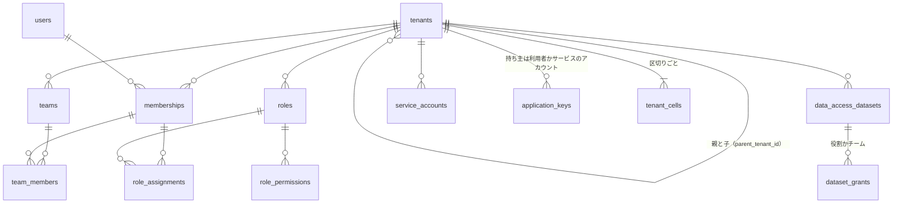
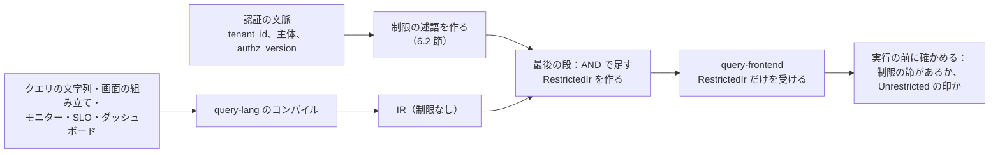
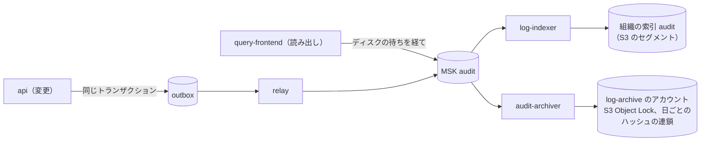
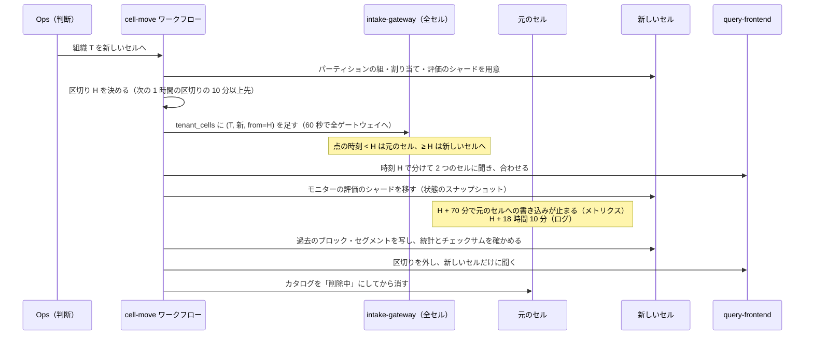

# Tenancy and RBAC: Datadog

組織と子の組織、利用者とチーム、SSO（SAML・OIDC）と SCIM、役割と権限、タグによるデータのアクセスの制限とクエリのエンジンでの付加、アプリケーションキーのスコープとサービスのアカウント、監査ログ（利用者に見せる監査の記録）、セルへの置き方と組織のセルの移し替えを決める。前提は [ADR-0003](../decisions/0003-tenancy-cells-and-isolation.md)（組織をテナント、鍵の先頭の `tenant_id`、FORCE RLS、セル）と [ADR-0007](../decisions/0007-query-language.md)（型付きの IR、制限の節）である。

| ADR | 決定 |
| --- | --- |
| [0051](../decisions/0051-roles-permissions-and-data-access-restrictions.md) | 権限は固定の一覧（`<領域>.<対象>.<操作>`）で、役割は権限の集合。管理の役割 3 つ（管理者・標準・読み取り）と独自の役割を持つ。データのアクセスの制限は「データセット」（信号ごとに 1 つのタグの鍵と値の集合）を役割・チームに結び、利用者の見える範囲を「制限のない付与 → すべて、それ以外はデータセットの条件の OR と、データセットの外の扱い」で 1 つの述語に畳み、IR のコンパイルの最後に AND で足す。制限の鍵のタグは、クエリに残すタグの選択で落とせない |
| [0052](../decisions/0052-identity-sso-scim-keys-and-audit-trail.md) | 利用者は組織をまたいで 1 人で、所属は組織ごと。SSO は組織ごとの SAML 2.0・OIDC で、JIT の作成と IdP のグループからの役割・チームの対応を持つ。SCIM 2.0 で利用者とチームを同期し、停止でセッションと本人のアプリケーションキーを止める。アプリケーションキーの効く権限は「キーのスコープ ∩ 持ち主の今の権限」。監査ログは、変更を outbox で、データの読み出しを `query-frontend` から MSK の `audit` に流し、組織の特別な索引（`audit`）として自前のログの保存に置く |
| [0053](../decisions/0053-child-orgs-and-tenant-cell-moves.md) | 親の組織は子の組織を作れ、子はそれぞれ別のテナント（データを共有しない）。利用量は親で合わせて見せる。組織のセルの移し替えは、点の時刻で区切る：時刻 `H`（1 時間の区切り）より前の点は元のセル、`H` 以後は新しいセルに書き、クエリは `H` で 2 つのセルに分けて合わせる。過去のブロック・セグメントを新しいセルへ写して確かめた後に、元のセルから消す |

組織をまたぐ経路の一覧（X1〜X4）と RLS の外の表は [ADR-0003](../decisions/0003-tenancy-cells-and-isolation.md) のまま変えない。キーの形式・ハッシュでの保存・失効の伝わりは [otlp-and-api-keys.md](otlp-and-api-keys.md)、IR とクエリの計画は [metrics-query-engine.md](metrics-query-engine.md)、利用量は [usage-and-billing.md](usage-and-billing.md)、脅威モデルと運用者のアクセスは [security.md](security.md)、セルの構成は [infrastructure.md](infrastructure.md) にある。

## 1. 目的と範囲

- **扱う**：組織・子の組織、利用者、チーム、招待、役割と権限、独自の役割、データのアクセスの制限、SSO と SCIM、セッション、アプリケーションキーのスコープ、サービスのアカウント、監査ログ、組織のセルへの置き方と移し替え。
- **扱わない**：取り込みのキーとアプリケーションキーの形式と保存（otlp-and-api-keys の領域）、請求（[usage-and-billing.md](usage-and-billing.md)）、本システムの運用者の権限（[security.md](security.md) の 8 節）。

## 2. 要件

| 要件 | 値 | 根拠 |
| --- | --- | --- |
| 他の組織・制限の外のデータが届いた事象 | 0 件。キャッシュ、補完、ファセット、サービスマップ、ライブテール、通知、エラーの応答を含む | NFR-007、K7、[quality.md](../quality.md) の 2.2.1 節 G |
| 制限の変更が効くまで | 役割・データセットの変更から 60 秒以内に、すべてのクエリの経路で効く | 本システムの想定 |
| SCIM の停止が効くまで | 停止の受信から 60 秒以内に、セッションとその人のアプリケーションキーが効かなくなる | 本システムの想定（取り込みのキーの失効と同じ 60 秒） |
| 権限の判定の遅れ | API の要求あたり p99 5ms（キャッシュに当たるとき） | NFR-003 の内側 |
| 監査ログの欠け | 0 件（変更）。読み出しの記録は、照合で欠けを数えて 0 を目標にする | [quality.md](../quality.md) の 5 節 E11 |
| 監査ログの保持 | 既定 90 日（仮の値）。値は**法務の確認待ち：L6** | intent の L6 |
| 組織の移し替えの間の欠け | 移し替えの前後で、クエリの結果が移し替えのない場合と同じ（点の欠けと重複 0） | NFR-005、本システムの想定 |

## 3. 本家の形（確かめたこと）

| 項目 | 本家 | 出典 |
| --- | --- | --- |
| 子の組織 | 親の組織の中に子の組織を作れる。子どうしはデータを見られない。子は親のプランと請求に入る。親は合わせた利用量と組織ごとの内訳を見る。SAML の設定は子へ引き継がれない | [Managing Multiple-Organization Accounts](https://docs.datadoghq.com/account_management/multi_organization/) |
| データのアクセスの制限 | 制限のデータセットを、クエリ（信号ごとに 1 つのタグ・属性）と、見てよいチーム・役割で作る。データセットの外を制限にする設定があり、制限のない付与はデータセットの境界より強い。見られない利用者には、結果・上位のタグ・ファセットを出さない。データセットあたり主体 50、鍵と値の組 10 まで | [Data Access Control](https://docs.datadoghq.com/account_management/rbac/data_access/) |
| 監査ログ | 既定の保持 90 日（3・7・15・30・90 日から選ぶ）。API の要求の事象、製品ごとの変更の事象を記録する | [Audit Trail](https://docs.datadoghq.com/account_management/audit_trail/) |
| キー | API キーは組織の単位で既定 50 本。アプリケーションキーは利用者に属しスコープで絞れる | [API and Application Keys](https://docs.datadoghq.com/account_management/api-app-keys/) |
| 重なるデータセットの合わせ方、役割の権限の一覧の全体 | 公式の資料で確かめられなかった（**未検証**） | — |

いずれも 2026-10-09 に確認。

## 4. モデル



- **組織（`tenants`）**：テナントの単位。`parent_tenant_id` で親を持てる（1 段だけ。孫は作らない）。
- **利用者（`users`）**：メールアドレスで 1 人。複数の組織に属せる（`memberships`）。`users` は RLS の外（[ADR-0003](../decisions/0003-tenancy-cells-and-isolation.md)）。
- **チーム**：組織の中の人の集まり。モニターの持ち主、データセットの付与の主体、通知の宛先の名前に使う。
- **役割**：権限の集合。所属（`memberships`）に複数を付けられる。
- **サービスのアカウント**：人ではない主体。役割を持ち、アプリケーションキーだけで認証する（画面に入れない）。Terraform や CI に使う。

## 5. 権限と役割

ADR-0051。

### 5.1 権限の一覧

権限は `<領域>.<対象>.<操作>` の固定の一覧で、コードの中の 1 つの表（`crates` ではなく管理の面の `packages/authz`）に持つ。足すときは表と試験の行を足す。最初の一覧（抜粋）：

| 領域 | 権限 |
| --- | --- |
| メトリクス | `metrics.data.read`、`metrics.metadata.write`（単位・説明）、`metrics.tag_config.write`（クエリに残すタグ、[ADR-0006](../decisions/0006-cardinality-policy.md)） |
| ログ | `logs.data.read`、`logs.live_tail.read`、`logs.pipelines.write`、`logs.indexes.write`、`logs.rehydrate.write`、`logs.archive.read`、`logs.data.delete`（削除の請求） |
| トレース | `apm.data.read`、`apm.retention.write`（テールサンプリングの規則） |
| モニター | `monitors.read`、`monitors.write`、`monitors.downtime.write` |
| ダッシュボード・SLO・インシデント | `dashboards.read`、`dashboards.write`、`dashboards.share`、`slos.read`、`slos.write`、`incidents.read`、`incidents.write` |
| 組織 | `org.users.write`、`org.teams.write`、`org.roles.write`、`org.sso.write`、`org.data_access.write`、`org.intake_keys.write`、`org.app_keys.write_own`、`org.app_keys.write_all`、`org.service_accounts.write`、`org.children.write` |
| 監査・利用量 | `audit.read`、`usage.read`、`usage.billing.read` |

### 5.2 管理の役割

| 役割 | 中身 | 変えられるか |
| --- | --- | --- |
| 管理者 | すべての権限 | 変えられない。組織に 1 人以上を必ず残す |
| 標準 | `*.read`、`*.write`（データの面の設定）、`org.app_keys.write_own`。組織の管理（`org.*` の他）と `audit.read`・`usage.billing.read` を除く | 変えられない |
| 読み取り | `*.read`（`logs.live_tail.read` と `audit.read` を除く） | 変えられない |
| 独自の役割 | 組織の管理者が権限を選ぶ。組織あたり 100 まで | 変えられる |

- 管理の役割の中身はコードのバージョンで決める。権限を足したら、どの管理の役割に入れるかを同じ変更で決める（試験の表が落ちる）。
- 権限の判定は `can(主体, 権限, 対象)` の 1 つの関数にする。対象ごとの持ち主（モニターを自分のチームだけが編集できる、など）の判定もここに置く。

### 5.3 判定のキャッシュ

- 主体（所属またはキー）の「権限の集合」と「制限の述語」（6 節）を、`authz_version`（組織ごとの数。役割・所属・データセット・チームの変更で 1 上げる）と組で Valkey に持つ。要求ごとに `authz_version` を Valkey から読み、合わなければ Aurora から作り直す。
- Valkey に届かないときは Aurora から作る（遅くなるが誤らない）。キャッシュの失いで権限を広げない。

## 6. データのアクセスの制限

ADR-0051。[ADR-0003](../decisions/0003-tenancy-cells-and-isolation.md) の「クエリのコンパイラが IR に AND の条件として必ず足す」をここで具体にする。

### 6.1 データセット

- **データセット**は、信号（`metrics`・`logs`・`traces`・`rum` は MVP の後）ごとの条件 `<tag_key> IN (<value>, ...)` の組と、見てよい主体（役割かチーム）を持つ。信号ごとにタグの鍵は 1 つ（例：メトリクスとトレースは `team`、ログは `service`）。
- 上限：組織あたりデータセット 100、データセットあたり値 10、主体 50（本家の値に寄せる。[Data Access Control](https://docs.datadoghq.com/account_management/rbac/data_access/)、2026-10-09 に確認）。
- 組織は信号ごとに「データセットの外」の扱いを選ぶ：`visible`（既定。どのデータセットにも当たらないデータは全員が見る）か `restricted`（制限のない付与を持つ主体だけが見る）。
- 役割に信号ごとの「制限のない付与」（`unrestricted:<signal>`）を付けられる。管理者の役割は全信号で制限なし。

### 6.2 見える範囲の述語

利用者 `u`・信号 `s` の見える範囲を、次の 1 つの述語に畳む。

```
visible(u, s) =
  TRUE                                    … u のどれかの役割が unrestricted:s を持つ
  OR  ⋁ { d.filter | d ∈ datasets(s), u ∈ principals(d) }   … u が付与を受けたデータセット
  OR  ( NOT ⋁ { d.filter | d ∈ datasets(s) } )              … outside(s) = visible のときだけ
```

- 重なるデータセットは OR で合わせる（付与が増えると見えるものは増えるだけ）。本家の合わせ方は確かめられなかった（**未検証**）ので、本システムはこの形を決める。1.4 節の「本家との意図した違い」には、本家の形が分かったときに行を足す。
- アプリケーションキーで呼ぶときは、キーの持ち主（利用者かサービスのアカウント）で作る（7.3 節）。
- 述語はタグの条件だけで書けるので、IR の条件の節と同じ型で表す。

### 6.3 IR への付加



- コンパイラは IR を `RestrictedIr { tenant_id, restriction: Restriction, ... }` の型にして出す。`Restriction` は `Predicate(p)` か `Unrestricted { reason }` のどちらか。`query-frontend` はこの型しか受けない（[ADR-0007](../decisions/0007-query-language.md) の lint）。
- 述語は、選ぶもの（指標・索引）のすべての葉に AND で足す。式（`a / b`）の各クエリにもそれぞれ足す。サブクエリ・`top()` などの関数の内側にも足す（葉で足すので漏れない）。
- **結果のキャッシュの鍵**に、制限の述語の正規形のハッシュを入れる（`tenant_id`、IR のハッシュ、制限のハッシュ、区間、時間の区切り）。同じ組織の別の制限の利用者に、他方の結果を返さない。
- **補完とファセット**（タグの値の一覧、指標の一覧、ログのファセットの候補、サービスマップ）も、同じ述語を足した IR で作る。指標の名前とタグの鍵の一覧は制限の外でも見せる（本家に寄せる）。タグの値は、述語に当たる系列にあるものだけを見せる。
- **ライブテール**は `logs` のトピックを読む流れにも、同じ述語を当てる（[logs-pipeline.md](logs-pipeline.md)）。
- **エラーの応答**は、制限の外の指標・索引に当たったときも「結果 0」で返し、「権限がない」と区別しない（有無を推測させない）。

### 6.4 制限とクエリに残すタグ

- データセットのタグの鍵（`team` など）は、クエリに残すタグの選択（[ADR-0006](../decisions/0006-cardinality-policy.md)）で落とせない。データセットを作る・鍵を変えると、その組織の全指標のタグの選択に、その鍵を自動で足す。足す前のブロックでその鍵を落とした系列は、述語に当たらない（`visible` なら外として見え、`restricted` なら見えない）。画面にその期間を示す。
- ログとトレースは属性を落とさないので、この問題はない。

### 6.5 モニター・SLO・ダッシュボード・通知

| 対象 | 誰の制限で評価・表示するか |
| --- | --- |
| ダッシュボード、ノートの表示 | 見ている人の制限（同じダッシュボードでも人で結果が違う。本家に寄せる） |
| モニター、SLO | 定義に持つ「評価の主体」（チームかサービスのアカウント）の制限。保存する人は、評価の主体の見える範囲を自分も見られる必要がある（権限の持ち上げを防ぐ） |
| 通知の本文 | モニターの評価の主体の制限の中の値だけ。宛先（チャットやメール）の人の権限は本システムで確かめられないので、宛先を選んだ持ち主の責任とし、画面で示す |
| インシデントのタイムライン | インシデントを見られる人のうち、最も狭い制限ではなく、各値を足した人の制限の中で書き、表示は見ている人の制限で絞る |
| 共有のリンク（組織の中） | 見ている人の制限 |

- 評価の主体の制限が変わったら、モニターの定義のバージョンを上げずに、次の評価から新しい述語で評価する。評価の記録には `authz_version` を残し、再生で同じ述語を使う（[ADR-0008](../decisions/0008-monitor-evaluation-model.md) の決定性）。

## 7. 利用者、SSO、SCIM、キー

ADR-0052。

### 7.1 ログインとセッション

- ログインの手段：パスワード＋多要素（TOTP・パスキー）、SSO（SAML 2.0・OIDC）。組織は「SSO だけ」（SAML-strict）を選べる。そのときも、組織の管理者のうち指名した 2 人までは、パスキーでのログインを残せる（IdP の障害のときの入口）。
- セッション：アイドル 24 時間、絶対 30 日（組織が短くできる）。表示の専用の端末（NOC の壁の画面）は、読み取りの役割のサービスのアカウントで作る「表示のリンク」を使い、利用者のセッションを長くしない。
- 危ない操作（キーの作成、役割・データセットの変更、SSO の設定、組織の削除）は、10 分以内の再認証を求める。

### 7.2 SSO と SCIM

| 項目 | 決定 |
| --- | --- |
| SSO の単位 | 組織ごと。子の組織は親の設定を引き継がない（本家に寄せる） |
| JIT の作成 | SSO の初回のログインで所属を作り、既定の役割を付ける（組織が選ぶ。既定は読み取り） |
| 役割・チームの対応 | IdP の属性（SAML の属性、OIDC のクレーム）のグループの値 → 役割・チーム の対応表。ログインごとに当て直す。対応のない役割は手で付けたものを残す |
| SCIM | SCIM 2.0 の `Users`・`Groups`。`Groups` はチームに対応する。トークンは組織ごと、ハッシュだけを持つ |
| 停止（`active=false`・削除） | 60 秒以内に、その人のセッションを切り、その人が持ち主のアプリケーションキーを止める。サービスのアカウントのキーは止めない。持ち主のいなくなったモニター・ダッシュボードはチームに残す |
| メールアドレスの変更 | IdP の不変の ID（SAML の `NameID` の永続の形、OIDC の `sub`）で結び、メールアドレスで結ばない |

### 7.3 アプリケーションキーとサービスのアカウント

- アプリケーションキーは、利用者かサービスのアカウントに属し、スコープ（5.1 節の権限の部分集合）を持つ。**効く権限は「スコープ ∩ 持ち主の今の権限」**。持ち主の役割が減れば、キーの権限も減る。制限の述語は持ち主のものを使う。
- 既定の期限：1 年（組織が 30 日〜無期限で選ぶ。無期限は警告を出す）。期限の 14 日前に持ち主へ知らせる。
- 組織ごとに、アプリケーションキーで呼べる送り元の IP の範囲を任意で持てる（画面のセッションには当てない）。
- 取り込みのキー（`<brand>_ik_`）は組織に属し、書き込みだけ。読み出しの権限を一切持たない（[security.md](security.md) の 3.1 節）。形式と失効は [otlp-and-api-keys.md](otlp-and-api-keys.md)。

## 8. 監査ログ

ADR-0052。利用者の組織の管理者が見る「誰が何をしたか」の記録。本システム自身の運用の監査は [security.md](security.md) の 7 節。

### 8.1 記録するもの

| 種類 | 例 | 経路 |
| --- | --- | --- |
| 変更 | モニター・ダッシュボード・索引・パイプライン・役割・データセット・キー・SSO の作成・変更・削除 | 変更と同じ Aurora のトランザクションで outbox に書く → `relay` → MSK の `audit` |
| 認証 | ログイン、失敗、SSO、再認証、キーの使用の初回（キーごとに 1 日 1 回） | `api` から outbox |
| データの読み出し | クエリ（IR のハッシュ、信号、時間の範囲、結果の系列・行の数。値と条件の文字列は持たない）、ログの書き出し、ライブテールの開始 | `query-frontend` が MSK の `audit` に書く（8.3 節） |
| 運用者のアクセス | 本システムの運用者がその組織のデータに触れた記録（[security.md](security.md) の 8 節） | 運用のツールから outbox |

- 監査の事象は、ID と数と理由のコードで持つ。クエリの文字列・タグの値・ログの本文を持たない（利用者のデータを本システムの記録に出さない規則と同じ）。ただし、変更の事象の「変更の前と後」は、組織の設定の値（モニターの定義など）を持つ。設定の中に組織が書いた値（タグの値）を含むのは、組織自身の記録なので許す。

### 8.2 置き場所



- 組織から見る監査ログは、組織の特別な索引 `audit` として、ログと同じ保存と検索（[ADR-0005](../decisions/0005-log-storage-columnar-with-bloom.md)）に置く。検索の文法・ファセット・書き出しをそのまま使える。`audit` の索引は除外のフィルター・1 日の上限・利用量の課金の対象にしない。
- 保持は既定 90 日（3・7・15・30・90 日から選ぶ。本家に寄せる）。長い保持と、組織の S3 への書き出しは MVP の後。値は**法務の確認待ち：L6**。
- 改ざんの検出のため、`audit-archiver` が組織・日ごとのハッシュの連鎖を作り、log-archive のアカウントの Object Lock のバケットへ写す（[security.md](security.md) の 7 節）。

### 8.3 読み出しの記録の欠けを防ぐ

- `query-frontend` は、結果を返す前に監査の事象をタスクのローカルの待ち行列（ディスク、最大 1 GB）に書き、MSK へ非同期に送る。MSK に書けない間も応答は止めない（クエリの可用性を監査で落とさない）。
- 待ち行列が溢れそうなとき（80%）は、そのタスクを新しい要求から外す（他のタスクへ）。溢れたら新しいクエリを 503 で拒む（記録のない読み出しをしない）。
- 照合：`query-frontend` の「返したクエリの数」の指標と、`audit` の索引の読み出しの事象の数を、組織・時間ごとに比べる。差を本システムの SLI にする（[observability.md](observability.md)）。

## 9. 子の組織

ADR-0053。

- 親の組織の管理者（`org.children.write`）が子を作る。子は別の `tenant_id` で、データ・キー・SSO・役割・データセットを親と共有しない（本家に寄せる）。
- 親は、子の利用量を合わせて見る（[usage-and-billing.md](usage-and-billing.md) の 6 節）。請求の契約は親に 1 つ。
- 親の管理者は、子の組織に自動では入れない。子に入るには、子で所属を作る（招待か SSO）。親から子のデータを見る経路を作らない（組織をまたぐクエリは MVP の後。作るときは [ADR-0003](../decisions/0003-tenancy-cells-and-isolation.md) の X 経路を足す）。
- 子は親と同じセルに置かなくてよい。大きな子は専用のセルに置ける。
- 1 段だけ。子は子を持てない。親あたり子 100 まで（運用のパラメーター）。

## 10. セルへの置き方と移し替え

ADR-0053。セルの構成と増やし方は [infrastructure.md](infrastructure.md) の 6 節。

### 10.1 置き方

- 新しい組織は、`tenant_cells` で空きの最も大きい共有のセルに置く（S1 は 1 つ）。空きは、MSK の書き込みの余裕、インジェスターの系列の余裕、契約の量で見る。
- 専用のセルの候補：ホスト 2 万以上か有効な系列 1 億以上（[ADR-0003](../decisions/0003-tenancy-cells-and-isolation.md)）。判断は Ops。

### 10.2 移し替えの流れ



- **点の時刻で分ける。** 書き込みの切り替えの区切り `H` は 1 時間の区切り。ゲートウェイは、点の時刻が `H` より前なら元のセル、`H` 以後なら新しいセルに書く。受け付けの窓（過去 1 時間、未来 10 分）があるので、`H + 70 分` 以後は元のセルにメトリクスが来ない。1 時間のブロックが 2 つのセルにまたがらず、書き出した後のブロックに点を足さない規則（[ADR-0004](../decisions/0004-tsdb-storage-engine.md)）を守れる。
- ログは時刻の窓が 18 時間なので、元のセルへの書き込みは `H + 18 時間 10 分` まで続きうる。
- スパンはトレースの組み立ての都合で、点の時刻ではなく取り込みの時刻で `H` に切り替える。`H` をまたぐトレースは、2 つのセルで別の断片として組み立てられうる（数を記録し、画面で「移し替えで分かれたトレース」と示す）。
- **クエリ**：`query-frontend` は `tenant_cells` の区切りを見て、窓を `H` で分け、`H` より前を元のセル、以後を新しいセルに聞いて合わせる。窓を時間で分けて合わせても結果が変わらない性質（[ADR-0007](../decisions/0007-query-language.md) の性質ベーステスト (1)）に乗る。
- **モニター**：評価のシャードを新しいセルの評価器へ移す。持ち主の交代と同じ手順（状態のスナップショットとその後の遷移、[ADR-0008](../decisions/0008-monitor-evaluation-model.md)）。
- **過去のデータの写し**：S3 のサーバー側のコピーで `<old_cell>/<tenant_id>/...` を `<new_cell>/<tenant_id>/...` に写し、カタログの行を作り、系列ごとの点の数・合計・チェックサム（ブロック）、行の数・チェックサム（セグメント）を比べる。一致したら区切りを外す。元のセルのものは、カタログで「削除中」にしてから消す（[ADR-0009](../decisions/0009-retention-tiers-on-s3.md) と同じ順序）。
- **写さない選択**：保持の短いデータ（生の点 15 日、ログの索引）は、写さずに保持の期限まで区切りを残してもよい。1 時間のロールアップ（15 か月）とアーカイブ（1 年）は写す。
- 移し替えの間も、[ADR-0003](../decisions/0003-tenancy-cells-and-isolation.md) の X4（セルの割り当てと移し替え）の DB のロールだけが `tenant_cells` を書く。

## 11. 障害のときの振る舞い

| 障害 | 振る舞い |
| --- | --- |
| Valkey の停止 | 権限・制限を Aurora から作る（遅くなるが誤らない）。キーの確認のキャッシュはゲートウェイのメモリー（60 秒）で続く |
| Aurora の停止 | 画面の変更は 503。クエリは、キャッシュの残っている主体（`authz_version` の確かめに Aurora が要るので、最後に確かめた値で 60 秒まで）だけ続け、それを超えたら 503 にする。制限を緩めて続けない |
| IdP の停止 | SSO のログインはできない。既存のセッションとアプリケーションキーは続く。SAML-strict の組織は、指名した管理者のパスキーで入る |
| SCIM の誤った一斉の停止 | 1 時間に組織の利用者の 20% を超える停止は、止めずに保留し、組織の管理者に確かめを求める（IdP の設定の誤りに備える） |
| `audit` の MSK への書き込みの停止 | 8.3 節。応答は続け、待ち行列が溢れたら拒む |
| 移し替えの途中のセルの障害 | ワークフローを止める。区切りは保つ（区切りを外すのは確かめの後だけ） |

## 12. テスト

| 種類 | 中身 | 要件 |
| --- | --- | --- |
| 表駆動 | 5.2 節の管理の役割 × 全権限の行列。6.2 節の述語（制限のない付与、付与の OR、外の扱い `visible`・`restricted`）の決定表 | `REQ-RBAC-*`、`DT-RBAC-001` |
| 性質ベース | 任意のデータセット・付与・クエリで、(1) 結果がデータセットの外の系列を事前に除いた参照と一致、(2) 付与を足すと見える集合は増えるだけ（単調）、(3) キャッシュから返した結果が、別の制限の主体の結果と混ざらない | `PROP-RBAC-001`〜`003` |
| 漏れの経路の表 | [quality.md](../quality.md) の 2.2.1 節 G の全行を、主体（他の組織、制限つき、停止した利用者、期限切れのキー、スコープの狭いキー）ごとに | `PROP-RBAC-004` |
| lint・型 | `RestrictedIr` 以外を `query-frontend` に渡せない。`can()` を通さない権限の判定をしない（管理の面の lint） | — |
| 結合 | SCIM の停止から 60 秒以内にセッションとキーが効かない。SAML・OIDC の署名・期限・宛先の誤りを拒む（試験のベクトル） | `REQ-IAM-*` |
| 監査 | 変更の API の全経路で、監査の事象が 1 件ずつ出る（経路の一覧と照らす）。読み出しの照合の差 0 | `PROP-AUDIT-001` |
| 移し替え | 縮めた規模で、任意の時刻・任意の遅れの点の列で移し替え、クエリの結果が移し替えのない場合と一致（点の欠けと重複 0） | `PROP-CELL-001` |

## 13. Story の候補

| Epic | Story | 中身 |
| --- | --- | --- |
| E11 | `orgs-users-teams` | 4 節のモデル、招待、子の組織（9 節） |
| E11 | `roles-and-permissions` | 5 節の権限の一覧、管理の役割、独自の役割、`can()`、判定のキャッシュ |
| E11 | `sso-saml-oidc` | 7.1・7.2 節の SSO、SAML-strict、対応表 |
| E11 | `scim-provisioning` | 7.2 節の SCIM と停止の伝わり、一斉の停止の保留 |
| E11 | `data-access-restrictions` | 6 節のデータセット、述語、`RestrictedIr`、キャッシュの鍵、タグの選択との関係 |
| E11 | `application-keys-and-service-accounts` | 7.3 節（形式は otlp-and-api-keys と共同） |
| E11 | `audit-trail` | 8 節の経路、`audit` の索引、照合。保持は法務：L6 |
| E11 | `leak-path-tests` | 12 節の漏れの経路の表 |
| E13 | `tenant-cell-move` | 10.2 節のワークフロー（S1 では検証のセルと社内のセルの間で訓練する） |

## 14. 未解決の問い

### 決定

2026-10-09 の既定案。E11 と E13 で覆りうる。

- **重なるデータセット**：OR で合わせる。制限のない付与が最も強い（ADR-0051）。
- **モニターの評価の主体**：チームかサービスのアカウントの制限で評価する（ADR-0051）。
- **監査ログの置き場所**：自前のログの保存の特別な索引（ADR-0052）。
- **移し替え**：点の時刻の区切りで分け、クエリで合わせる。[ADR-0003](../decisions/0003-tenancy-cells-and-isolation.md) の「二重の書き込み」は、この形で具体にした（ADR-0053）。

### 持ち越し

| 問い | いつ・どう決めるか |
| --- | --- |
| 監査ログの保持の期間、開示の請求への応じ方 | **法務の確認待ち：L6** |
| 本家の重なるデータセットの合わせ方 | 公式の資料で確かめる（**未検証**）。違えば 1.4 節に行を足す |
| 組織をまたぐクエリ（親から子） | MVP の後。作るときは ADR-0003 の X 経路を足す |
| 「SSO だけ」の組織の非常の入口の人数（2 人） | E11 で組織の管理者に聞く |
| 監査の事象の量（読み出し 1 秒 3,000）の索引の費用 | E11 の後に測る。[capacity.md](capacity.md) |

## 15. quality.md・runbooks・data-model への項目

### quality.md

- 2.2.1 節 G の表に行を足す：「制限の変更から 60 秒の間のキャッシュ」「モニターの評価の主体の制限」「移し替えの間の 2 つのセルの合わせ」「監査ログの索引（他の組織の監査の事象が出ない）」。
- E11 の合否基準に `PROP-RBAC-001`〜`004`、`PROP-AUDIT-001` を足す。

### runbooks

- `access-leak-response.md`：制限のハッシュとキャッシュの鍵の確かめ方、組織の `authz_version` を上げてキャッシュを捨てる手順。
- `tenant-cell-move.md`：10.2 節の手順、止め方、区切りの確かめ。
- `scim-mass-deactivation.md`：保留した一斉の停止の確かめと解き方。

### data-model への項目

| 表・置き場所 | 中身 | 節 |
| --- | --- | --- |
| `tenants` | `tenant_id`、`parent_tenant_id`、名前、状態、`authz_version` | 4、9 |
| `users`（RLS の外） | `user_id`、メールアドレス、多要素の登録 | 4 |
| `memberships` | `(tenant_id, user_id)`、状態、IdP の不変の ID | 4、7.2 |
| `teams`・`team_members` | チームと所属 | 4 |
| `roles`・`role_permissions`・`role_assignments` | 役割、権限、付与。管理の役割は `managed=true` | 5 |
| `data_access_datasets` | `tenant_id`、信号、タグの鍵、値の配列 | 6.1 |
| `dataset_grants` | データセット → 役割かチーム | 6.1 |
| `data_access_outside_policy` | 信号ごとの `visible`・`restricted` | 6.1 |
| `service_accounts` | 主体、役割 | 4、7.3 |
| `application_keys` に足す列 | `owner_type`（`user`・`service_account`。列の正本は [otlp-and-api-keys.md](otlp-and-api-keys.md) の 12 節）、`scopes`、`expires_at`。送り元の範囲は組織ごとの `tenant_settings.app_key_allowed_cidrs`（[data-model.md](data-model.md) の D-16） | 7.3 |
| `sso_configs`・`sso_group_mappings`・`scim_tokens` | SSO の設定、グループの対応、SCIM のトークンのハッシュ | 7.2 |
| `tenant_cells` に足す列 | `cell_id`、`from_ts`（区切り `H`）、`move_state`。主キーは `(tenant_id, from_ts)`（D-17） | 10.2 |
| `cell_moves` | 移し替えの記録と、写しの確かめの結果 | 10.2 |
| MSK の `audit` トピック | 監査の事象（`tenant_id`、種類、主体、対象の ID、数） | 8 |
| S3 `<cell>/<tenant_id>/logs/audit-<日数>/...` | `audit` の索引のセグメント | 8.2 |
| Valkey `authz:<tenant_id>:<principal>` | 権限の集合と述語、`authz_version` | 5.3 |

## 出典

いずれも 2026-10-09 に確認。

- Datadog Docs, [Managing Multiple-Organization Accounts](https://docs.datadoghq.com/account_management/multi_organization/)
- Datadog Docs, [Data Access Control](https://docs.datadoghq.com/account_management/rbac/data_access/)
- Datadog Docs, [Audit Trail](https://docs.datadoghq.com/account_management/audit_trail/)
- Datadog Docs, [API and Application Keys](https://docs.datadoghq.com/account_management/api-app-keys/)
