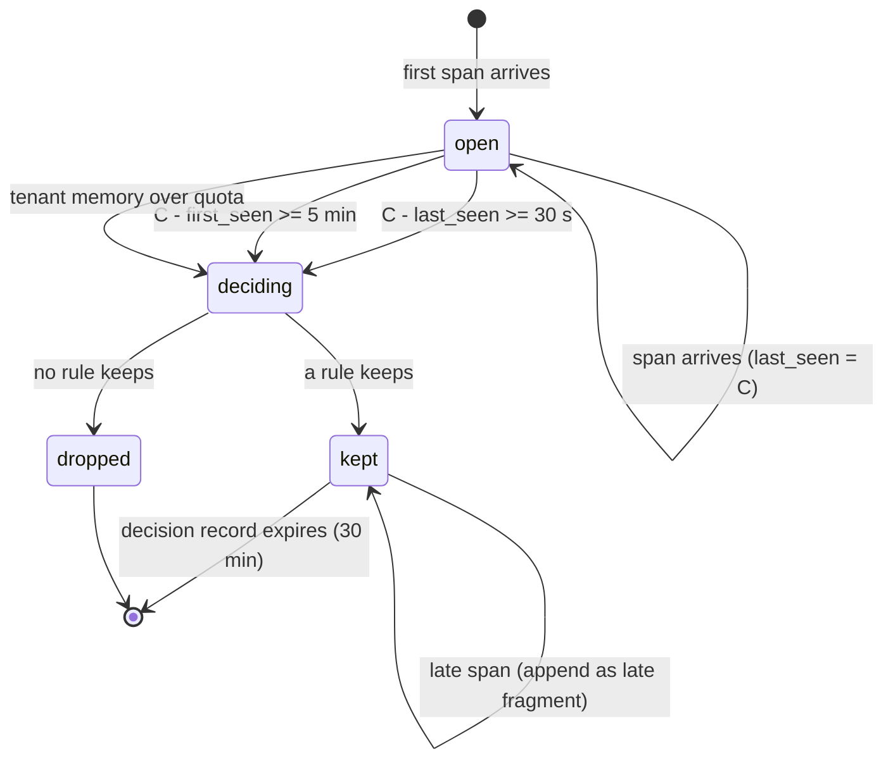
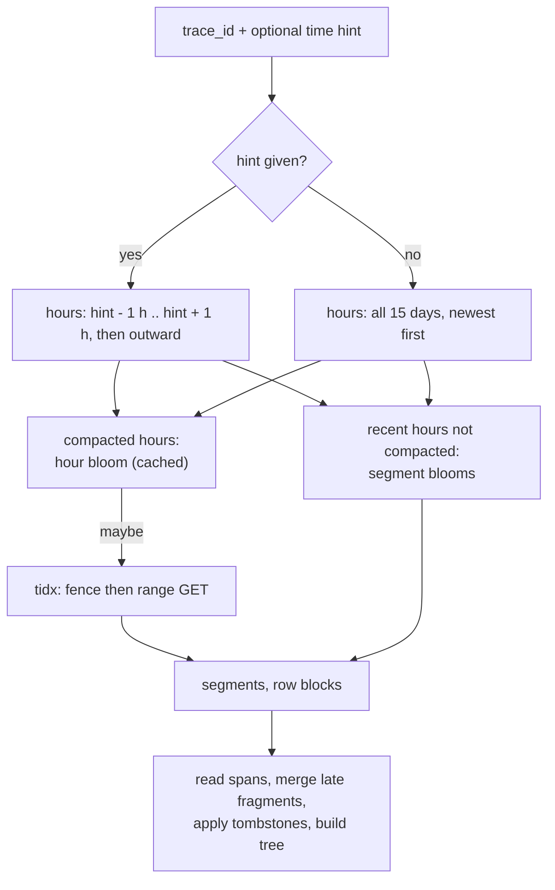

# Traces and Sampling: Datadog

トレースを決める。スパンのモデル、W3C Trace Context と Baggage、SDK のヘッドサンプリングと重み、`trace_id` での組み立て、テールサンプリング（30 秒の待ちと規則）、サンプリングの前に数える RED メトリクスとサービスマップ、残したトレースの保存と ID での引き、トレースとログの結び付けを扱う。

前提となる決定は次のとおり。

- `spans` のトピックは、組織の組の中で `trace_id` のハッシュでパーティションを選ぶ。保持 24 時間。消費者は読み直しで同じ結果を作る（[ADR-0002](../decisions/0002-intake-log-on-msk.md)）
- 自前のトレーサーの SDK を持たず、OpenTelemetry の SDK と Collector を使う。`traceparent` を正とし、`tracestate` の本システムの鍵は `<brand>`（[architecture/README.md](README.md) の 6 節の決定）
- 完成の待ち 30 秒（最大 5 分）。規則の既定は、エラーのトレースをすべて、サービス・リソースごとに遅い上位 1%、まれな組を 1 秒 5 件、残りはテナントの予算の中の確率（同上）
- スパンのセグメントはログと同じ列指向の形式（[ADR-0005](../decisions/0005-log-storage-columnar-with-bloom.md)、[ADR-0033](../decisions/0033-log-segment-format-and-tokenizer.md)）。保持 15 日（[ADR-0009](../decisions/0009-retention-tiers-on-s3.md)）
- 系列の上限と溢れ（[ADR-0006](../decisions/0006-cardinality-policy.md)）。RED メトリクスも従う
- 1 系列を 1 つの書き手で出す集め直しの段 `derived-partials`（[ADR-0032](../decisions/0032-index-routing-and-derived-metrics.md)）
- PII のマスクは `pii-scrub` を共有する（[ADR-0031](../decisions/0031-pii-scrubbing-before-routing.md)）。法務の確認待ち：L1

この文書で決めたことは次の ADR にある。

| ADR | 決定 |
| --- | --- |
| [0037](../decisions/0037-trace-assembly-and-completion.md) | 組み立ては `trace_id` のパーティションの中で、取り込みの時刻で進む時計で行う。最後のスパンから 30 秒の静止で完成、最初のスパンから 5 分で打ち切る。組織ごとのメモリーの割り当てを超えたら、待たずにその場で決める。決めた後に遅れて来たスパンは、残したトレースなら付け足し、それ以外は断片として規則を当て直す |
| [0038](../decisions/0038-tail-sampling-rules-and-consistency.md) | テールサンプリングの規則は、エラー → 組織の規則 → 遅いもの → まれなもの → 予算の中の確率、の順に当て、最初に残すと決めた規則を記録する。確率の採択は `trace_id` から作った 56 ビットの値としきい値の比べで行い、ヘッドサンプリング（OpenTelemetry の `ot=th`）と一貫させる。重みはヘッドの採択の確率の逆数 |
| [0039](../decisions/0039-red-metrics-and-service-map-before-sampling.md) | RED メトリクスはスパンの到着ごとに、サービスマップの辺はトレースの完成ごとに、サンプリングの前のすべてのスパンから作る。部分の値を `derived-partials` へ書き、出どころの鍵（パーティション、時計の刻み）で読み直しの二重を除く。リソースの名前は正規化し、生の URL と SQL の文を使わない |
| [0040](../decisions/0040-trace-storage-and-id-lookup.md) | 残したトレースのスパンを `LSEG` のセグメントに置き、時ごとに `trace_id` の並べた索引（フェンスつき）と時のブルームフィルターを書く。ID での引きは、時刻の手がかりの前後の時から、時のブルームフィルター → 索引 → 行のブロックの順に探す |

## 1. 範囲

- 扱う：
  - スパンのモデルと正規化（サービス、リソース、サービスの入口のスパン）
  - W3C Trace Context、Baggage、`tracestate`
  - SDK のヘッドサンプリングと重み
  - 組み立て、完成の判断、遅れたスパン、メモリー
  - テールサンプリングの規則
  - RED メトリクス、サービスマップ
  - トレースの保存、ID での引き、スパンの検索
  - トレースとログの結び付け
- 扱わない：
  - OTLP の受け口と資源の属性の対応（[otlp-and-api-keys.md](otlp-and-api-keys.md)）
  - スパンの取り込みの割り当てと 429（[intake-and-agent.md](intake-and-agent.md)）
  - セグメントの形式の細部、検索の実行（[log-storage-and-search.md](log-storage-and-search.md)）
  - スパンの利用量（取り込みの GB と保持の件数）の数え方（[usage-and-billing.md](usage-and-billing.md)）
  - トレースを使うモニター（[monitors-and-alerting.md](monitors-and-alerting.md)。RED メトリクスのモニターはメトリクスのモニター）

## 2. 要件

| 要件 | 目標 | NFR |
| --- | --- | --- |
| トレースが出るまで | 完成の判断から検索で見えるまで p95 90 秒 | NFR-002 |
| RED メトリクスが出るまで | 202 からクエリで読めるまで p99 60 秒 | NFR-002 |
| ID で引く | p99 1 秒（時刻の手がかりがあるとき）、手がかりなしで p99 3 秒 | NFR-003 |
| RED の正しさ | サンプリングの前のすべてのスパンから数える。ヘッドサンプリングの重みで数えた値が、全量との比べで相対 5% 以内（試行 1,000 回の 95%） | quality.md の 2.2.1 節 I |
| エラーを残す | 完成の判断で 1 つでもエラーのスパンを持つトレースは、組織のメモリーの割り当ての中にある限りすべて残す | 同上 |
| 読み直し | 任意の位置で落ちて読み直しても、残すトレースの集まり、RED メトリクス、サービスマップの辺が同じ | [ADR-0002](../decisions/0002-intake-log-on-msk.md) |
| 分離 | サービスマップ・RED・トレースの検索に、他の組織・制限の外のサービスの名前と辺が出ない | NFR-007 |
| 保持 | 残したトレース 15 日 | [ADR-0009](../decisions/0009-retention-tiers-on-s3.md) |

## 3. 本家と標準の形（確かめたこと）

- 本家のエージェントのヘッドサンプリングは、既定で 1 秒 10 トレースを目標にする。エラーのサンプラーは 1 秒 10、まれなもののサンプラーは 1 秒 5 トレースまで（[Ingestion Mechanisms](https://docs.datadoghq.com/tracing/trace_pipeline/ingestion_mechanisms/)、2026-10-09 に確認）。
- APM のメトリクスはサンプリングの前のすべてのトレースから計算する（[Ingestion Controls](https://docs.datadoghq.com/tracing/trace_pipeline/ingestion_controls/)、2026-10-09 に確認）。
- 保持のフィルターの既定に、エラー（`status:error`）のフィルターがある。保持のフィルターで索引に入れたスパンは 15 日、多様性のサンプリング（サービスの入口のスパンを見て、環境・サービス・操作・リソースごとに 15 分に少なくとも 1 つ、p75・p90・p95 の遅いもの、いろいろなエラー）で残したものは 30 日（[Trace Retention](https://docs.datadoghq.com/tracing/trace_pipeline/trace_retention/)、2026-10-09 に確認）。
- 本家のサーバーでのテールサンプリングは確かめなかった（**未検証**。[architecture/README.md](README.md) の 1.4 節）。
- **W3C Trace Context**：`traceparent` は `version-trace_id-parent_id-trace_flags`（16 進。`trace_id` 32 文字、`parent_id` 16 文字）。`tracestate` はベンダーごとの鍵と値の並び。
- **OpenTelemetry の確率のサンプリングの `tracestate`**：`ot=th:<16 進>` が 56 ビットの棄却のしきい値 `T`（採択の確率 `p` で `T = (1 − p) × 2^56`）。乱数の値 `R` は `ot=rv:` か、`trace_id` が乱数のときはその下位 56 ビット。`R ≥ T` なら採る。重み（adjusted count）は `2^56 / (2^56 − T)`。この仕様の状態は Development（[TraceState: Probability Sampling](https://opentelemetry.io/docs/specs/otel/trace/tracestate-probability-sampling/)、2026-10-09 に確認）。

**標準と本家の違いと、本システムの寄せ方**：

| 項目 | 本家 | 標準 | 本システム |
| --- | --- | --- | --- |
| ヘッドサンプリングの場所 | エージェントとトレーサー | SDK のサンプラー | SDK（OpenTelemetry）。エージェントは MVP では間引かない |
| ヘッドの重みの運び方 | 本家の形（未検証） | `ot=th` | `ot=th` を読む。ないときは重み 1 として `weight_unknown` を付ける |
| 残す規則 | 保持のフィルター、多様性のサンプリング | — | サーバーのテールサンプリング（8 節）。保持は 15 日の 1 つ |

## 4. スパンのモデル

### 4.1 項目

| 項目 | 元（OTLP） | 備考 |
| --- | --- | --- |
| `trace_id`（128 ビット）、`span_id`（64 ビット）、`parent_span_id` | 同名 | すべて 0 の ID は拒む（ゲートウェイ） |
| `name` | `name` | 操作の名前 |
| `kind` | `kind` | SERVER・CLIENT・PRODUCER・CONSUMER・INTERNAL |
| `service` | 資源の `service.name` | ないときは `unknown_service` |
| `env`・`version` | 資源の `deployment.environment.name`・`service.version` | |
| `resource` | 4.2 節で作る | RED とサービスマップの鍵 |
| `start`・`duration` | `start_time_unix_nano`・`end_time_unix_nano` | 終わりが始まりより前なら `duration = 0` と `clock_skew:true` |
| `error` | `status.code = ERROR` | HTTP の 5xx は SERVER のスパンでだけエラーとする（OTel の意味の規約に寄せる） |
| `attributes`、`resource_attributes`、`events`、`links` | 同名 | 4.3 節の上限 |
| `weight` | `tracestate` の `ot=th` | 5.2 節 |
| `is_entry` | 4.2 節 | サービスの入口のスパン |

### 4.2 サービスの入口とリソース

- **サービスの入口のスパン**：`kind` が SERVER か CONSUMER、または親のスパンが別のサービス（組み立ての後に分かる）か親がないスパン。RED メトリクスはこのスパンで数える。
- **リソース**：入口のスパンの、次の最初にあるもの。
  1. `http.route` があれば `<method> <route>`（`GET /api/orders/{id}`）
  2. RPC なら `rpc.service/rpc.method`
  3. メッセージなら `messaging.destination.name`（`{...}` を含むテンプレートの名前があればそれ）
  4. DB の CLIENT のスパンなら `db.operation.name db.collection.name`（`db.query.text` は使わない）
  5. それ以外は `name` を正規化したもの：道の各部分のうち、数字だけ・UUID・16 文字以上の 16 進・`@` を含むものを `?` に置き換える
- リソースの種類はサービスごとに 1,000 まで。超えたら新しいリソースを `resource:other` にまとめ、利用者に知らせる（[ADR-0006](../decisions/0006-cardinality-policy.md) の溢れと同じ扱い）。

### 4.3 上限

| 対象 | 上限 | 超えたとき |
| --- | --- | --- |
| 1 スパンの属性 | 256、鍵 256 バイト、値 16 KiB | 超えた属性を落とし `dropped_attributes_count` を足す（OTLP と同じ数え方） |
| イベント・リンク | 各 128 | 同上 |
| 1 スパンの大きさ（展開の後） | 256 KiB | 属性の値を切り詰める |
| 1 トレースのスパン | 10,000 | 超えたスパンは保存せず数える（RED には入れる） |
| 1 トレースのバイト | 16 MiB | 同上 |

## 5. 伝搬とヘッドサンプリング

### 5.1 W3C Trace Context と Baggage

- 本システムは利用者のリクエストの経路にいないので、ヘッダーを書かない。SDK が `traceparent`・`tracestate`・`baggage` を運ぶ。
- `trace_id` と `span_id` は OTLP のスパンから取る。ログの `trace_id` も同じ 128 ビットに揃える（[logs-pipeline.md](logs-pipeline.md) の `trace_id_remapper`）。
- `tracestate` の `<brand>` の鍵は予約し、MVP では書かず読まない。
- **Baggage** は読まない。SDK の Baggage を属性に写す処理（BaggageSpanProcessor など）で属性になったものだけを受ける。Baggage は下流のすべてのサービスと外部へ運ばれるので、個人のデータを入れないよう利用者の手引きに書く。

### 5.2 ヘッドサンプリングと重み

- 推奨の SDK の設定：`ParentBased(root = 確率のサンプラー)`。確率は環境変数（`OTEL_TRACES_SAMPLER_ARG`）で、サービスごとに決める。親の決定に従うので、トレースの全体が同じに採られる。
- SDK が `ot=th:<T>` を書いていれば、重み `w = 2^56 / (2^56 − T)` を各スパンに付ける。例：`th:fd70a4` は `p = 1%`、`w = 100`。
- `ot=th` がなければ `w = 1` とし、`weight_unknown:true` を付ける。組織の画面に「重みの分からないスパンが N%」を出し、RED の値が過小になりうることを示す。
- エージェントは MVP ではスパンを間引かない（本家との意図した違い。17 節）。

## 6. 組み立て

[ADR-0037](../decisions/0037-trace-assembly-and-completion.md)。

### 6.1 時計

- `trace-assembler` は、パーティションごとに 1 つの処理の流れ（単一スレッド）で動く。時刻は壁の時計ではなく、**パーティションの時計** `C`＝そのパーティションの水位 `F_p` を使う。`F_p` は `intake-gateway` が 1 秒ごとに書く水位の刻みと、生きているゲートウェイの最後の取り込みの時刻の最小で決まる（[ADR-0011](../decisions/0011-intake-gateway-pipeline-and-watermark-ticks.md)）。ストリームだけから決まるので、読み直しでも同じ値になり、スパンが来ないパーティションでも進む。
- 取り込みの時刻はパーティションの中で単調でない（複数のゲートウェイが書く）。最大値ではなく水位を使うので、`C` より前の取り込みの時刻のスパンは、もう来ない。
- 同じ入力の列からは、同じ時刻に同じ判断になる。読み直しで同じ結果になる。

### 6.2 トレースの状態

- バッファー：`trace_id` → {スパン（組織ごとのアリーナ）、`first_seen`、`last_seen`、バイト、エラーの有無、入口のスパンの有無}。
- 完成：`C − last_seen ≥ 30 秒`（静止）、または `C − first_seen ≥ 5 分`（打ち切り）。打ち切りのトレースには `truncated:true` を付ける。
- 時計の刻み（1 秒）ごとに、完成したトレースを `trace_id` の順に決める（順序に依らない結果のため）。

### 6.3 遅れたスパン

- **決定の記録**：残したトレースの `trace_id` の集まりを、決めてから 30 分持つ。
- 決めた後に来たスパンの `trace_id` が記録にあれば、残したトレースの続きとして保存する（`late:true`）。ID での引きは同じ `trace_id` のすべてのセグメントを合わせるので、1 つのトレースとして見える。
- 記録になければ（落としたトレース、記録の期限の後）、新しいバッファーを作り、**断片**として 8 節の規則を当て直す。確率の採択は `trace_id` で決まるので、落としたトレースの断片は確率では同じく落ちる。エラーのスパンが遅れて来た断片は、エラーの規則で残る（`fragment:true`）。

### 6.4 メモリー

- 組織ごとに、組み立てのメモリーの割り当てを持つ（契約のスパンの量から。最小 64 MiB）。
- 割り当てを超えた組織では、新しいスパンの来たトレースを待たずにその場で決める（**即時の決定**）。即時の決定では、遅いもの・まれなものの規則は当てず、エラー（その時点で見えたもの）と確率だけで決める。即時の決定の割合を組織ごとに数え、画面に出す。
- タスク全体のメモリーが 90% を超えたら、割り当てに対して使っている割合の大きい組織から順に即時の決定に切り替える。
- 見込み（S1、本システムの想定）：スパン 200 万/秒、メモリーの中の 1 スパン 600 バイト、滞在の平均 31 秒（トレースの長さ約 1 秒＋静止 30 秒）で、全体で約 37 GB。`tail-sampling-memory-poc` で確かめる。

### 6.5 例

`checkout` → `payment` → `db` のトレース（`trace_id = 4bf9…`）。

| 取り込みの時刻 | 出来事 | 判断 |
| --- | --- | --- |
| 12:00:00.0 | `checkout` の SERVER のスパン（入口）が届く | バッファーを作る。`first_seen = last_seen = 12:00:00` |
| 12:00:00.4 | `payment` の SERVER のスパン（`error`）が届く | エラーあり。`last_seen = 12:00:00.4` |
| 12:00:01.2 | `db` の CLIENT のスパンが届く | `last_seen = 12:00:01.2` |
| 12:00:31.2 | パーティションの時計が 12:00:31.2 に届く | 静止 30 秒で完成。エラーの規則で残す（`sampling.rule = error`） |
| 12:03:00.0 | 遅れた `checkout` の CLIENT のスパンが届く | 決定の記録にあるので、`late:true` で保存 |

## 7. RED メトリクスとサービスマップ

[ADR-0039](../decisions/0039-red-metrics-and-service-map-before-sampling.md)。

### 7.1 RED メトリクス

- サービスの入口のスパンが**届いた時に**数える（組み立てを待たない）。親が別のサービスかどうかは届いた時に分からないので、`kind` が SERVER か CONSUMER か、親のないスパンを入口とする。組み立ての後に分かる入口（INTERNAL のスパンで親が別のサービス）は、完成の時に数える。
- 系列：

| 指標 | 種類 | 値 |
| --- | --- | --- |
| `<brand>.apm.requests` | count | 重み `w` の和 |
| `<brand>.apm.errors` | count | エラーの入口のスパンの `w` の和 |
| `<brand>.apm.duration` | 分布（指数のヒストグラム） | `duration` を個数 `w` で入れる |

- タグ：`env`、`service`、`resource`、`operation`（`name`）、`span.kind`、`http.status_class`（`2xx` など）、`version`。タグの値はマスクの後の値（11 節）。
- 系列は普通のメトリクスと同じ上限（[ADR-0006](../decisions/0006-cardinality-policy.md)）に従う。

### 7.2 サービスマップの辺

- トレースの**完成の時に**、すべてのトレース（残すかに依らない）から辺を作る：
  - CLIENT・PRODUCER のスパン（サービス A）の子が別のサービス B のスパンなら、辺 A → B。
  - 子がない（相手が計測されていない）なら、`peer.service`、なければ `server.address` から辺 A → `external:<名前>`。
- 系列：`<brand>.apm.edge.requests`・`.errors`（count）、`.duration`（分布）。タグ：`env`、`client_service`、`server_service`。
- サービスマップの画面は、この系列を直近の窓（既定 1 時間）でクエリして描く。ノードはサービス、辺の太さは要求の数、色はエラーの率。

### 7.3 1 系列を 1 つの書き手で

- `trace-assembler` は、10 秒の桶の部分の値を作り、パーティションの時計の 1 秒の刻みごとに `derived-partials` へ書く（[ADR-0032](../decisions/0032-index-routing-and-derived-metrics.md)）。`derived-metrics-aggregator` が系列ごとに合わせて `metrics` へ書く。
- 部分の値のメッセージは、出どころの鍵（`spans` のパーティション、時計の刻み）を持つ。`trace-assembler` は Kafka のトランザクションを使わない（9.1 節で S3 にも書くため）ので、読み直しで同じ刻みの部分の値をもう一度書く。集め直しの段は、出どころごとに折り込み済みの刻みを持ち、それ以前の刻みを飛ばす。同じ入力から同じ刻みに同じ部分の値ができるので、飛ばしても失わない。
- 遅れ：届いてから部分の値まで 1 秒、桶 10 秒、閉じ 20 秒。RED メトリクスの p99 60 秒（NFR-002）に収める。辺は完成（30 秒の静止）の後なので、およそ 40 秒遅い。モニターが辺の系列を使うときは評価の遅らせを勧める。

## 8. テールサンプリング

[ADR-0038](../decisions/0038-tail-sampling-rules-and-consistency.md)。

### 8.1 規則

完成したトレース（断片を含む）に、上から順に当て、最初に「残す」と決めた規則を `sampling.rule` に書く。

| 順 | 規則 | 残す条件 | 上限 |
| --- | --- | --- | --- |
| 1 | `error` | エラーのスパンが 1 つ以上ある | なし（即時の決定のときも当てる） |
| 2 | `tenant_rule` | 組織の規則（検索の条件 × 率）に、どれかのスパンが合い、`R ≥ T_rule` | 組織あたり規則 50 |
| 3 | `latency` | 入口のスパンの `duration` が、その（サービス、リソース）の直近 60 分の p99 以上 | 標本が 100 未満の組は当てない |
| 4 | `rare` | （`env`、`service`、`resource`、`error`）の組が、このパーティションで直近 15 分に残されていない | 組織で 1 秒 5 件（パーティションの組の数で割ったトークンバケット） |
| 5 | `probabilistic` | `R ≥ T_budget` | — |

- `R` は `trace_id` から作る 56 ビットの値。W3C の `trace_flags` の random のビットが立つか `ot=rv` があれば標準の値（`trace_id` の下位 56 ビットか `rv`）、なければ `xxh3_64(trace_id) >> 8`。同じトレースはどのパーティション・どの時点でも同じ `R` になる。
- しきい値 `T = (1 − p) × 2^56`。ヘッドで `T_head` で採ったトレースに `T_budget ≥ T_head` を当てると、残すものはヘッドで採ったものの部分集合になり、確率は掛け算になる（OpenTelemetry の一貫した確率のサンプリングの性質）。
- p99 のしきい値は、パーティションの中の入口のスパンの指数のヒストグラム（[distributions-and-sketches.md](distributions-and-sketches.md)）から 60 秒ごとに求め直す。`trace_id` はパーティションに一様に散るので、パーティションの p99 は全体の p99 に近い。

### 8.2 予算の中の確率

- 組織の保持の予算は、取り込んだスパンのバイトの割合で持つ（既定 10%、[architecture/README.md](README.md) の 2 節の S1 の想定）。
- パーティションの流れは 60 秒ごとに、直近の取り込みのバイト `B_in` と、規則 1〜4 で残したバイト `B_rules` から、`p = max(0, (0.10 × B_in − B_rules) / (B_in − B_rules))` を求め、前の値との指数の移動平均（係数 0.5）で `T_budget` を更新する。`p` の最小は 0.1%（どの組織も少しは残る）。
- 規則 1〜4 だけで予算を超えるとき（障害の日のエラーの急増）は `p` が最小になり、残すバイトは予算を超えうる。超えた分は利用量の「保持の件数」に数える（[usage-and-billing.md](usage-and-billing.md)）。

### 8.3 例

ある組織の 1 つのパーティションで、1 秒に 1,000 トレース（1 トレース平均 20 KB）が完成する。

| 規則 | 残す（1 秒） |
| --- | --- |
| `error`（エラーの率 2%） | 20 |
| `tenant_rule`（なし） | 0 |
| `latency`（p99 以上 ≈ 1%。エラーと重なる 2 を除く） | 8 |
| `rare` | 3 |
| 小計 | 31（620 KB） |
| `probabilistic`：予算 10% ＝ 2,000 KB。残り 1,380 KB ÷ 規則で残らなかった 969 トレース × 20 KB → `p ≈ 7.1%` | 69 |
| 合計 | 約 100 トレース（予算どおり） |

### 8.4 残したトレースの重み

- 残したトレースの各スパンに、`sampling.rule` と `sampling.weight` を書く。`probabilistic` で残したものは `w × 1/p`、他の規則は `w`（その規則の中ではすべて残すので）。
- 残したスパンの集計（スパンの検索の件数のグラフ）は、規則に偏るので、画面で「残したスパンの集計で、全体の数ではない」と示し、全体の数は RED メトリクスで見るよう案内する。

## 9. 保存と ID での引き

[ADR-0040](../decisions/0040-trace-storage-and-id-lookup.md)。

### 9.1 セグメント

- 残したトレースのスパンを、組織ごとのバッファーに入れ、10 秒（パーティションの時計）か 64 MiB で `LSEG` 1 のセグメントにする（[ADR-0033](../decisions/0033-log-segment-format-and-tokenizer.md)）。列はスパンの項目と属性。行は `start` の順。`trace_id`・`span_id` は ID の属性として `道=値` の語をブルームフィルターに入れる。
- S3 のキー：`<cell>/<tenant_id>/traces/raw-15d/<yyyy>/<mm>/<dd>/<hh>/<segment_id>.lseg`。カタログは `trace_segments`（`log_segments` と同じ列）。
- 確定：セグメントの ID は（パーティション、そのセグメントに入れた最初のトレースの完成の刻み、組織）で決める。読み直しで同じものを作ったら `If-None-Match` で飛ばす。パーティションの確定の位置は「開いているバッファーと、書き出していないセグメントのバッファーの、最も古いオフセット」の手前。位置は Aurora の `assembler_offsets` に、カタログの行と同じトランザクションで書く。
- 合わせは時の終わり＋20 分に、（組織、時）ごとに 512 MiB を目標に行う（[log-storage-and-search.md](log-storage-and-search.md) の 5.3 節と同じ）。

### 9.2 時ごとの ID の索引

- 合わせのときに、（組織、時）ごとに `tidx` のファイルを書く：`trace_id`（16 バイト）、セグメントの番号、行のブロックの番号の組を `trace_id` の順に並べ、4,096 件ごとのフェンス（その位置の `trace_id` とオフセット）を末尾に持つ。
- 同じく、時のブルームフィルター（その時に残したトレースの `trace_id`、語あたり 10 ビット）を書く。カタログの `trace_hours` に置き場所を持つ。

### 9.3 ID での引き

- 手がかり（ログの時刻、リンクの元のスパンの時刻）があれば、その前後 1 時間から探し、見つかったら、その時と前後の時の残り（遅れたスパン）を確かめて止める。
- 手がかりがなければ、15 日の 360 時を新しい順に、時のブルームフィルター（読み手の NVMe とメモリーにキャッシュ）で絞る。誤検出 1% で、およそ 4 時が候補になり、`tidx` の範囲の GET 2 回ずつで行のブロックに届く。
- 大きさの見込み：1 時間に 100 万トレースを残す組織で、時のブルームフィルター 1.25 MB、15 日で 450 MB。
- 返す前に、データのアクセスの制限を当てる（制限の外のサービスのスパンを除き、除いた数を示す）。1 つのトレースの表示は 10,000 スパンまで。

### 9.4 スパンの検索

- スパンの属性の検索・集計は、ログと同じ実行（[log-storage-and-search.md](log-storage-and-search.md) の 6・7 節）を `trace_segments` に当てる。検索の文法も同じ（[ADR-0007](../decisions/0007-query-language.md)）。

## 10. トレースとログの結び付け

- ログ → トレース：ログの `trace_id`（ID の属性）から、ログの時刻を手がかりに 9.3 節で引く。
- トレース → ログ：トレースの `[最初の start − 5 分, 最後の end + 5 分]` の範囲で、ログの索引を `trace_id:<id>` で検索する。ID の属性のブルームフィルターで絞れる。
- サービスの名前と `env` がログとトレースで揃うよう、ログの予約属性とスパンの資源の属性の対応を同じにする（[logs-pipeline.md](logs-pipeline.md) の 6 節、[otlp-and-api-keys.md](otlp-and-api-keys.md)）。

## 11. PII

- `trace-assembler` は、スパンが届いた時に、組織のマスクの規則（ログと同じ設定の束、[ADR-0031](../decisions/0031-pii-scrubbing-before-routing.md)）を属性・イベントの文字列に当て、マスクの後の値だけをバッファーに入れる。RED のタグ・サービスマップ・セグメントは、マスクの後の値から作る。
- リソースの名前に生の URL・SQL の文を使わない（4.2 節）。
- マスクの前の値は `spans` のトピック（24 時間）にだけある。既定の有効化は**法務の確認待ち：L1**。
- 削除の請求は、スパンのセグメントにも墓標と書き直しで当てる（[ADR-0036](../decisions/0036-personal-data-deletion-tombstones.md)）。`tidx` と時のブルームフィルターは、書き直しのときに作り直す。

## 12. 上限

| 対象 | 上限（既定） |
| --- | --- |
| スパン・トレースの大きさ | 4.3 節 |
| 完成の待ち | 静止 30 秒、打ち切り 5 分 |
| 決定の記録 | 30 分 |
| 組織の規則（`tenant_rule`） | 50 |
| リソースの種類 | サービスあたり 1,000 |
| 保持の予算 | 取り込みのバイトの 10%（契約で変える） |
| ID での引きの範囲 | 15 日 |
| 1 トレースの表示 | 10,000 スパン |

## 13. 障害のときの振る舞い

| 事象 | 起きること | 備え |
| --- | --- | --- |
| `trace-assembler` が落ちる | 開いているトレースが失われる | 確定の位置から読み直し、同じ時計で同じ判断をする（6.1 節）。出力の二重は 7.3・9.1 節で除く |
| 水位が進まない | パーティションの時計が止まり、完成しない | ゲートウェイが落ちたときは 30 秒で外れて進む（[ADR-0011](../decisions/0011-intake-gateway-pipeline-and-watermark-ticks.md)）。止まりが 60 秒を超えたら Ops に出し、壁の時計で進める例外の経路に切り替え、そのことを記録する（決定性を失うので、その区間の再生の比べから除く） |
| メモリーの不足 | 即時の決定になる | 6.4 節。割合を画面と Ops に出す |
| スパンの急増（リトライの嵐） | 取り込みの割り当てで 429 | [intake-and-agent.md](intake-and-agent.md)。RED は届いた分で数える |
| `derived-metrics-aggregator` が落ちる | RED とサービスマップが遅れる | チェックポイントから作り直す。モニターは水位で待つ |
| S3 の PUT の失敗 | 残したトレースの書き出しが遅れる | 再試行。バッファーを超えたら読み出しを止める |

## 14. data-model への項目

| 表・置き場 | 中身 | 主キー・索引 | 節 |
| --- | --- | --- | --- |
| `trace_segments`（組織の表、月ごと） | `log_segments` と同じ列 | `(tenant_id, segment_id)`、`(tenant_id, t_max)` | 9.1 |
| `trace_hours`（組織の表） | 時、`tidx` と時のブルームフィルターの S3 のキー、トレースの数 | `(tenant_id, hour)` | 9.2 |
| `assembler_offsets` | パーティション、確定の位置 | `(cell, partition)` | 9.1 |
| `trace_retention_rules`（組織の表） | 規則（条件、率）、並び | `(tenant_id, rule_id)` | 8.1 |
| `tenant_settings` に足す列 | `trace_retention_budget`（既定 0.10）、組み立てのメモリーの割り当て | — | 6.4、8.2 |
| S3 | `<cell>/<tenant_id>/traces/raw-15d/...`、`tidx`・時のブルームフィルター | — | 9 |
| MSK `derived-partials` | 出どころの鍵（パーティション、刻み） | — | 7.3 |

## 15. テスト

- **PROP-TRC-001（組み立ての一致）**：任意のスパンの列（順序の入れ替え、遅れ、親のないスパン、重複したスパン、巨大なトレース）で、完成したトレースの中身が参照（全スパンを `trace_id` で集めたもの）と一致する。遅れたスパンの扱いの決定表（決定の記録あり・なし × エラーあり・なし）の全行（[quality.md](../quality.md) の 2.2.1 節 I）。
- **PROP-TRC-002（読み直しで同じ）**：任意の位置で止めて読み直しても、残すトレースの集まり、RED の値、辺の値が同じ。
- **PROP-TRC-003（RED の正しさ）**：重み 1 のとき、`requests`・`errors` が参照と一致する。ヘッドサンプリング（`ot=th`）のとき、重みで数えた値が全量との比べで相対 5% 以内（試行 1,000 回の 95%）。
- **PROP-TRC-004（エラーを残す）**：メモリーの割り当ての中で、エラーのスパンを持つトレースがすべて残る。
- **PROP-TRC-005（一貫した確率）**：同じ `trace_id` の断片は、どのパーティション・どの時点でも `probabilistic` の結果が同じ。ヘッドで落ちたものは残らない（`T_budget ≥ T_head`）。採る割合が `p` の統計の許容に入る。
- **PROP-TRC-006（ID で引く）**：任意の残したトレースが、手がかりあり・なしのどちらでも、遅れた断片を含めて全部引ける。
- **漏れの経路**：サービスマップ・RED・トレースの検索・ID での引きで、制限の外のサービスの名前・辺が出ない（[quality.md](../quality.md) の 2.2.1 節 G）。
- **負荷**：`tail-sampling-memory-poc` と E13 で、S1 のスパン 200 万/秒の縮めた比率で、メモリー、完成からの遅れ p95 90 秒、ID での引き p99 1 秒。

## 16. Story の候補

| Epic | Story | 中身 |
| --- | --- | --- |
| E6 | `tail-sampling-memory-poc` | 6.4 節の見込み、即時の決定の割合 |
| E6 | `span-intake` | 4・5 節（水位の刻みは E2 の `intake-gateway`、ADR-0011） |
| E6 | `trace-assembler` | 6 節（ADR-0037。PROP-TRC-001・002） |
| E6 | `tail-sampling-rules` | 8 節（ADR-0038。PROP-TRC-004・005） |
| E6 | `trace-storage-and-search` | 9 節（ADR-0040。PROP-TRC-006） |
| E6 | `red-metrics-from-spans` | 7.1・7.3 節（ADR-0039。PROP-TRC-003） |
| E6 | `service-map` | 7.2 節（ADR-0039。漏れの経路） |
| E6 | `trace-log-correlation` | 10 節 |

## 17. 未解決の問い

### 決定

2026-10-09 の既定案。

- **時計**：パーティションの取り込みの時刻（ADR-0037）。
- **完成**：静止 30 秒、打ち切り 5 分、メモリーを超えたら即時の決定（ADR-0037）。
- **規則と一貫性**：エラー → 組織の規則 → 遅いもの → まれなもの → 確率。`R` としきい値で一貫（ADR-0038）。
- **RED とサービスマップ**：サンプリングの前、`derived-partials` で集め直し（ADR-0039）。
- **保存と引き**：`LSEG`、時ごとの ID の索引（ADR-0040）。
- **エージェント**：MVP ではスパンを間引かない。
- **保持**：15 日の 1 つ（本家の多様性のサンプリングの 30 日は持たない）。

### 持ち越し

| 問い | いつ・どう決めるか |
| --- | --- |
| スパンの属性のマスクの既定 | **法務の確認待ち：L1** |
| 組み立てのメモリーの見込み、即時の決定の割合 | `tail-sampling-memory-poc` |
| OpenTelemetry の確率のサンプリングの仕様が Development のまま変わったとき | 仕様の変更を追い、`ot=th` の読み方を直す |
| 本家との違い（サーバーのテールサンプリング、エージェントで間引かない、保持 15 日の 1 つ） | architecture/README.md の 1.4 節に行を足すことを提案する（この文書の持ち主の範囲の外） |
| 本家のテールサンプリングの有無 | 公式の資料で確かめなかった（**未検証**） |
