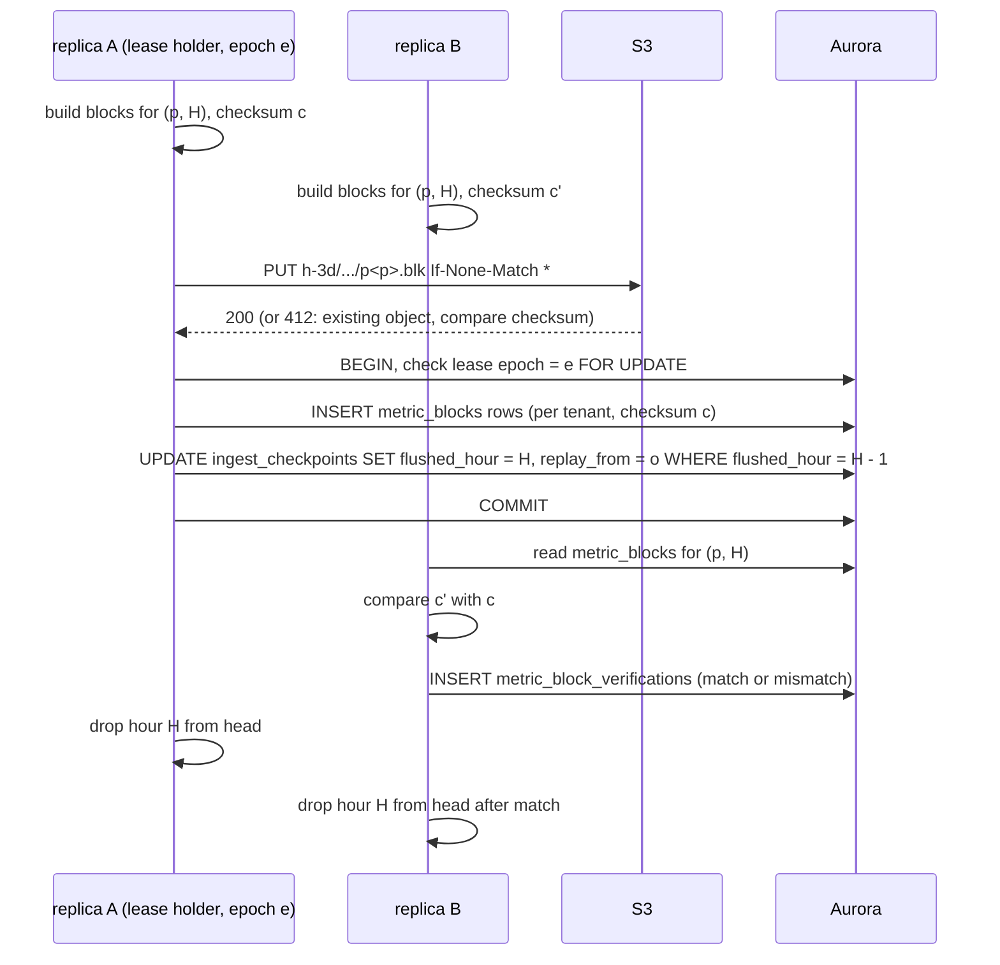
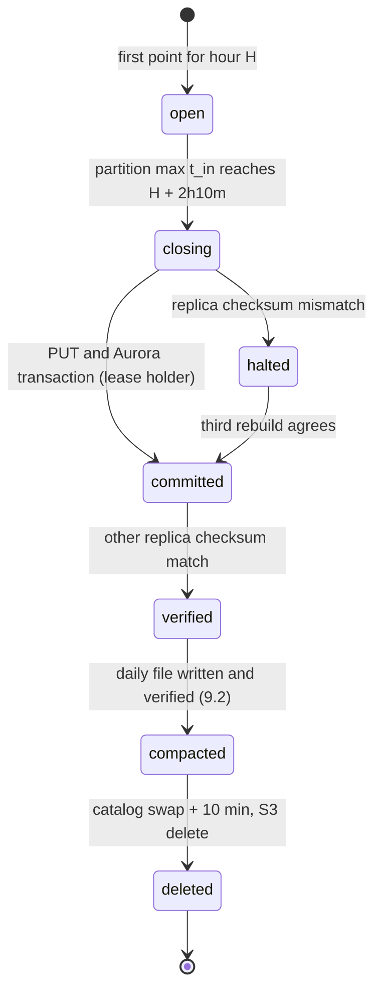

# TSDB storage engine: Datadog

自前の時系列の保存のエンジン（TSDB）を決める。系列からパーティションへの対応、ヘッドの形とメモリー、チャンクとコーデック（`codec_id` 1）、ブロックを閉じる時刻と確定の手順、MSK のオフセットからの作り直し、2 つの写しのバイトの一致、ブロックの形式、遅れたデータ、ロールアップ、日のブロックへの合わせと保持の層、照合を扱う。

前提となる決定は次のとおり。

- Rust、ECS の EC2（NVMe）、シャードごとの単一スレッド（[ADR-0001](../decisions/0001-platform-and-stack.md)）
- MSK が WAL。出力とオフセットを同じ記録で確定（[ADR-0002](../decisions/0002-intake-log-on-msk.md)）
- ブロック・パスは 1 つの組織だけ、`tenant_id` が先頭（[ADR-0003](../decisions/0003-tenancy-cells-and-isolation.md)）
- 128 ビットの系列の鍵、約 2 時間のヘッド、1 時間の不変のブロック、`codec_id` 1、遅れの窓 1 時間で区切りから 70 分で閉じる、1 分・1 時間のロールアップ、写しのバイトの一致（[ADR-0004](../decisions/0004-tsdb-storage-engine.md)）
- 上限の判断と制御のレコード（[ADR-0017](../decisions/0017-cardinality-admission-via-control-records.md)）、累積の直し（[ADR-0016](../decisions/0016-metric-types-and-cumulative-conversion.md)）、タグの選択（[ADR-0018](../decisions/0018-tag-selection-preaggregation.md)）
- 保持の層とキーの形（[ADR-0009](../decisions/0009-retention-tiers-on-s3.md)）

この文書で決めたことは次の ADR にある。

| ADR | 決定 |
| --- | --- |
| [0019](../decisions/0019-partition-mapping-and-head-layout.md) | 組織のパーティションの組はランデブーハッシュの上位 `k` 個、系列のパーティションは組の中で系列の鍵の下位 64 ビットの jump consistent hash で選ぶ。`k` は点の時刻の時間ごとに決まり、変更は 2 時間以上先の区切りから効く。1 つのパーティションを 1 つのシャード（1 スレッド）が受け持ち、ヘッドは系列ごとに時間ごとのチャンク（最大 120 点）と遅れのバッファー（64 点）を持つ。チェックポイントは 5 分ごとの差分で、組織とパーティションごとのファイル |
| [0020](../decisions/0020-block-flush-commit-and-replay.md) | 時間 `H` のブロックは、パーティションの最大の `t_in` が `H + 2 時間 10 分`（パーティションごとに 0〜5 分ずらす）に届いたら閉じる。点を時刻で並べて正規のチャンクに符号化し直すので、2 つの写しのバイトが同じになる。貸し出しの持ち主が条件つきの PUT で S3 に置き、Aurora の 1 つのトランザクション（`epoch` の確かめ、`metric_blocks`、`ingest_checkpoints`）で確定する。作り直しの開始の位置は「最も古い開いた時間の始まり − 20 分」以後の最初のオフセットで、確定の行に持つ。もう一方の写しはチェックサムを比べ、違えばそのパーティションの書き出しを止める |
| [0021](../decisions/0021-block-format-v1.md) | ブロックの形式のバージョン 1：頭、記号の辞書、系列の表（系列の鍵の順）、転置の表（Roaring）、生のチャンク、1 分・1 時間のロールアップの列（合計・個数・最小・最大・最後）、累積の末尾、統計、区画の表と区画ごとの xxh3 のチェックサム。分布のチャンクは `codec_id` 16 |
| [0022](../decisions/0022-compaction-and-rollup-tiers.md) | 時間のブロック（区分 `h-3d`）を、組織と日ごとに、保持の区分（`raw-15d`・`r1m-63d`・`r1h-15mo`）ごとのファイルへ合わせる（2 GiB を超えれば系列の鍵の範囲で分ける）。1 時間のロールアップは月ごとに合わせてからコールドに置く。合わせは、系列ごとの点の数・合計・正規の点の列のハッシュが前後で一致してから、カタログを 1 つのトランザクションで入れ替え、10 分の後に古いファイルを消す |

## 1. 範囲

- 扱う：
  - 系列からパーティションへの対応、パーティションの組の大きさの変更
  - インジェスターのヘッド（メモリーの形、遅れのバッファー、後勝ち、チェックポイント）
  - コーデック（`codec_id` 1）
  - ブロックを閉じる時刻、確定、貸し出し、作り直し、写しの比べ
  - ブロックの形式、S3 のキー
  - 遅れたデータ（窓の中、窓の外）
  - ロールアップ、日・月のファイルへの合わせ、保持の層への移し、保持の削除
  - 照合
- 扱わない：
  - 名前・タグ・系列の鍵・上限（[metrics-model-and-cardinality.md](metrics-model-and-cardinality.md)）
  - 分布のヒストグラムの中身とその符号化（[distributions-and-sketches.md](distributions-and-sketches.md)）。ここはチャンクの入れ物だけ
  - クエリの計画と読み出し（[metrics-query-engine.md](metrics-query-engine.md)）。ここは読み出しの口だけ
  - インスタンスの種類と台数（capacity.md）、写しの AZ の置き方（infrastructure.md）
  - 削除の請求（法務の L5）の手段（security.md、log-storage-and-search.md と合わせる）

## 2. 要件

| 要件 | 目標 | NFR |
| --- | --- | --- |
| クエリに出るまで | MSK の確定からヘッドで読めるまで p99 5 秒（NFR-002 のメトリクス p99 30 秒の内訳） | NFR-002 |
| 耐久性 | 202 の後の点を失わない。AZ の障害で RPO 0。リージョンの障害でテレメトリーの RPO 30 分 | NFR-005、K1 |
| 正しさ | 符号化して戻すとビットで同じ。ロールアップの合計・個数・最小・最大・最後が生の点から計算した値と完全に一致 | NFR-010、K5 |
| 遅れたデータ | 過去 60 分・未来 10 分の点が、ロールアップを含めて正しく入る | NFR-008 |
| 決定性 | 2 つの写しが同じオフセットの範囲からバイトまで同じブロックを作る。読み直しで同じブロック | [ADR-0004](../decisions/0004-tsdb-storage-engine.md) |
| 保存の量 | 生の点 1 点あたり平均 1.5 バイト以下（`tsdb-codec-poc`） | architecture/README.md の 2 節 |
| メモリー | 有効な系列 1 億で、写し 1 つあたり 150 GB 以下を目標（`ingester-memory-poc`） | 2.1 節の費用 |

## 3. パーティションとシャード（ADR-0019）

### 3.1 組織のパーティションの組

- `metrics` のトピックのパーティションの数を `P`（S1 で仮に 1,024）とする。
- 組織 `t` の組は、すべてのパーティション `p` に点数 `score(t, p) = xxh3_64(tenant_id ‖ u16 p)` を付け、大きい順に上位 `k` 個を並べたもの（ランデブーハッシュ）。`k` を増やしても、前の組は新しい組の先頭に残る。
- `k = clamp(ceil(組織の点の割り当て ÷ 1 万点/秒), 4, 256)`。1 パーティションの量の目安（1 万点/秒）は `msk-throughput-poc` で決める。

### 3.2 系列のパーティション

- `p(series) = 組[jump(series_key の下位 64 ビット, k)]`。jump consistent hash は、`k` を `k + 1` にしたとき、系列の約 `1 ÷ (k + 1)` だけを新しいパーティションへ動かす。
- **`k` は点の時刻の時間ごとに決まる**：時間 `[H, H+1h)` の点は、その時間に効いている `k` で選ぶ。ゲートウェイは `k` の変更（`effective_hour` つき）を、管理の DB から 60 秒ごとに読む。変更の `effective_hour` は 2 時間以上先にし、未来 10 分の点を受けるゲートウェイが先に知っているようにする（[ADR-0002](../decisions/0002-intake-log-on-msk.md) の「`k` の変更は 1 時間の区切りでだけ」を具体にしたもの）。
- これで、ある系列のある時間の点は、すべて 1 つのパーティションに入る。ブロック（組織、時間、パーティション）は、その時間の系列の点をすべて持つ。

**例**（値は説明のための仮の値）：組織 T の点数の上位が `p = 812, 77, 403, 958, 15, ...` なら、`k = 4` の組は `[812, 77, 403, 958]`。系列の鍵の下位 64 ビットが `0x0123456789ABCDEF` なら、jump の結果は `k = 4` で 0、`k = 6` で 5。`k` を 4 から 6 に上げると、この系列は `effective_hour` からパーティション 812 から組の 6 番目（`p = 15` の次の）へ移る。系列の約 1/3 が動き、残りは同じパーティションに残る。

### 3.3 シャード

- 1 つのパーティションを 1 つのシャードが受け持つ。シャードは Tokio の現在のスレッドの実行系 1 つで、ヘッドへの書き込みと読み出しを同じスレッドで行う（ロックなし）。読み出しは、時間の区切りごとの読み取りの写し（チャンクの参照の写し）を作ってから別のスレッドで復号する。
- インジェスターのタスクは複数のシャードを持つ。シャードとタスクの対応、2 つの写しを別の AZ に置く規則は infrastructure.md。

## 4. ヘッド（ADR-0019）

### 4.1 系列ごとの形

| 部分 | 中身 | 大きさの目安 |
| --- | --- | --- |
| 系列の行 | 系列の鍵（16）、シャードの中の番号（4）、指標・タグの記号の参照（辞書）、型、最後の `t_in`、状態 | 約 64 バイト |
| 時間ごとのチャンクの列 | 開いている時間（最大 3）ごとに、閉じたチャンク（最大 120 点）と開いているチャンク | 1 点約 1.5 バイト |
| 遅れのバッファー | 時間ごとに最大 64 点、圧縮しない `(ts, value, offset)` | ふだんは空（8 バイトの参照） |
| 累積の末尾 | 前の時間のブロックの末尾の `(ts, start, v)`（累積の系列だけ） | 24 バイト |
| 転置の表 | `タグの鍵:値` → 系列の番号の Roaring のビットマップ | 系列あたり 100〜200 バイト |

- 15 秒ごとの系列で、ヘッドの最大の 2 時間 10 分は 520 点、約 780 バイト。系列あたり合計で約 1.1〜1.5 KB と見込み、有効な系列 1 億で写し 1 つあたり 110〜150 GB。`ingester-memory-poc` で測る。
- タグの文字列は、シャードの記号の辞書に 1 回だけ持つ（参照で数える）。

### 4.2 点を足す

1. 制御のレコードなら、持ち分・タグの選択を更新する（[ADR-0017](../decisions/0017-cardinality-admission-via-control-records.md)）。`Tick` なら水位を更新する（[intake-and-agent.md](intake-and-agent.md) の 5.5 節）。
2. 系列の鍵で系列の行を引く。なければ上限の判断（[metrics-model-and-cardinality.md](metrics-model-and-cardinality.md) の 7.3 節）。
3. 点の時刻の時間が、すでに閉じた時間なら拒み、`<brand>.ingest.late_after_flush` に数える（8.3 節。0 であるべき）。
4. 時間の開いているチャンクの最後の時刻より新しければ、チャンクに足す（120 点で閉じて次を始める）。
5. そうでなければ遅れのバッファーに入れる。同じ時刻の点がバッファーかチャンクにあれば、オフセットの後のもので置き換える（チャンクの中なら、バッファーに「置き換え」として入れ、読み出しと書き出しで勝たせる）。
6. 遅れのバッファーが 64 点を超えたら、その時間のチャンクと合わせて、時刻で並べた正規のチャンクに符号化し直す。

- 読み出しは、チャンクとバッファーを時刻で合わせ、同じ時刻はオフセットの後のものを返す。この関数（`merge_head_points`）は、ブロックの書き出しも使う。

### 4.3 チェックポイント

- 貸し出しの持ち主（6.3 節）が 5 分ごとに、組織とパーティションごとのファイル（`<cell>/<tenant_id>/checkpoints/ckpt-24h/.../p<partition>-<seq>.ckpt`）を S3 に置く。中身は、前のチェックポイントの後に閉じたチャンクと、開いているチャンクの今のバイト、遅れのバッファー、累積の末尾、上限の状態、読んだオフセット。
- 差分の鎖は、ブロックを確定するたびに、閉じた時間の分を外して数を減らす。1 時間ごとに差分を持たない全体のファイルを置く。
- 量の目安：生の点の圧縮の後の量（S1 で約 7.5 MB/秒）に、開いているチャンクの重複を足した程度。ADR-0004 の「5 分ごと」を、差分にして S3 の書き込みの量を抑えたもの。
- 大阪へ CRR で写す（[ADR-0009](../decisions/0009-retention-tiers-on-s3.md)）。リージョンの障害の RPO 30 分は、チェックポイントの 5 分と CRR の 15 分の和の中。

## 5. コーデック（`codec_id` 1）

Gorilla の論文の形（時刻の差分の差分、値の XOR）に倣い、本システムの時刻（ミリ秒）に合わせて区間の幅を決め直した。論文の形は秒の時刻を前提にし、差分の差分の区間は 7・9・12・32 ビット、先頭の 0 の数は 5 ビット（[Pelkonen ほか 2015](https://www.vldb.org/pvldb/vol8/p1816-teller.pdf)、2026-10-09 に確認）。

### 5.1 チャンクの形

- チャンクの頭（バイトの単位）：点の数（u8、1〜120）、`codec_id`（u8）、ビット列の長さ（u16）。
- ビット列：

| 点 | 時刻 | 値 |
| --- | --- | --- |
| 1 つ目 | 64 ビット（`ts`、ミリ秒） | 64 ビット（浮動小数点のビット） |
| 2 つ目 | 32 ビット（1 つ目との差） | XOR の符号化 |
| 3 つ目から | 差分の差分 `D` の符号化 | XOR の符号化 |

- 差分の差分 `D = (t_n − t_{n−1}) − (t_{n−1} − t_{n−2})` の符号化：

| 前置き | 値の範囲（ミリ秒） | ビット |
| --- | --- | --- |
| `0` | `D = 0` | 1 |
| `10` ＋ 7 ビット | −63〜64 | 9 |
| `110` ＋ 12 ビット | −2,047〜2,048 | 15 |
| `1110` ＋ 20 ビット | −524,287〜524,288 | 24 |
| `1111` ＋ 64 ビット | それ以外 | 68 |

- 値の XOR の符号化（前の値との XOR を `x` とする）：
  - `x = 0`：`0`（1 ビット）
  - `x ≠ 0` で、`x` の先頭の 0 の数と末尾の 0 の数が、前の窓（前に書いた先頭と長さ）に収まる：`10` ＋ 前の窓の長さの意味のあるビット
  - それ以外：`11` ＋ 先頭の 0 の数（6 ビット）＋ 意味のあるビットの長さ − 1（6 ビット）＋ 意味のあるビット
- 浮動小数点はビットのまま XOR するので、NaN の各ビットの形、−0.0、無限大、非正規化数もビットで同じに戻る（[ADR-0004](../decisions/0004-tsdb-storage-engine.md)）。

### 5.2 例：5 点の系列

時刻 `T = 1,791,500,000,000`（ミリ秒）から、15 秒ごと（3 つ目だけ 2ms 遅れ）。値は 12.0、12.0、12.5、12.5、13.0。

| 点 | 時刻 | 差分 | 差分の差分 | 時刻のビット | 値 | 値のビット（16 進） | XOR | 値のビット数 |
| --- | --- | --- | --- | --- | --- | --- | --- | --- |
| 1 | `T` | — | — | 64 | 12.0 | `4028000000000000` | — | 64 |
| 2 | `T + 15,000` | 15,000 | — | 32 | 12.0 | `4028000000000000` | 0 | 1 |
| 3 | `T + 30,000` | 15,000 | 0 | 1 | 12.5 | `4029000000000000` | `0001000000000000`（先頭の 0 が 15、末尾の 0 が 48、意味 1 ビット） | 2 ＋ 6 ＋ 6 ＋ 1 = 15 |
| 4 | `T + 45,002` | 15,002 | 2 | 9 | 12.5 | 同上 | 0 | 1 |
| 5 | `T + 60,000` | 14,998 | −4 | 9 | 13.0 | `402A000000000000` | `0003000000000000`（先頭の 0 が 14。前の窓の 15 に収まらない） | 2 ＋ 6 ＋ 6 ＋ 2 = 16 |

- 時刻は 64 ＋ 32 ＋ 1 ＋ 9 ＋ 9 = 115 ビット、値は 64 ＋ 1 ＋ 15 ＋ 1 ＋ 16 = 97 ビット。合計 212 ビット（27 バイト）、頭を足して 31 バイト。生の 80 バイト（1 点 16 バイト）の約 39%。
- 点の数が少ないと、最初の点の 128 ビットが重い。120 点の一定の間隔・一定の値のチャンクでは、時刻 64 ＋ 32 ＋ 118 ＝ 214 ビット、値 64 ＋ 119 ＝ 183 ビット、合計 397 ビット（50 バイト）で、1 点約 0.42 バイト。
- エージェントは点の時刻を予定の時刻（ゆらぎなし）にする（[intake-and-agent.md](intake-and-agent.md) の 4.2 節）。差分の差分がほぼ 0 になり、時刻は 1 点 1 ビットに近づく。ミリ秒のゆらぎのある送り手（OTLP の SDK）は 9 ビットになりやすい。平均 1.5 バイトの見込みは `tsdb-codec-poc` で確かめる。

### 5.3 他の codec

- `codec_id` 2 は、浮動小数点の別の圧縮（ALP など）のために空けておく（[ADR-0004](../decisions/0004-tsdb-storage-engine.md)）。
- `codec_id` 16 は分布のチャンク（[distributions-and-sketches.md](distributions-and-sketches.md) の 7 節）。1〜15 を浮動小数点、16〜31 をヒストグラムに使う（ADR-0021）。

## 6. ブロックを閉じる・確定する（ADR-0020）

### 6.1 閉じる時刻

- 時間 `[H, H+1h)` の点は、ゲートウェイの窓から `t_in ≤ ts + 60 分 < H + 2 時間` で来る。ゲートウェイの時計のずれの余裕 10 分を足し、**パーティションの最大の `t_in` が `H + 2 時間 10 分` 以上になったら閉じる**（区切りから 70 分。[ADR-0004](../decisions/0004-tsdb-storage-engine.md)）。
- 最大の `t_in` は、`Tick` を含むパーティションのレコードから決まる。壁の時計を使わないので、写しと読み直しで同じオフセットで閉じる。
- **ずらし**（統合の工程で採用。[ADR-0020](../decisions/0020-block-flush-commit-and-replay.md) の注記）：閉じる条件は「最大の `t_in` ≥ `H + 2 時間 10 分 + s_p`」、`s_p = xxh3_64(cell ‖ partition) mod 300` 秒。1,024 パーティションの書き出しが区切りから 70〜75 分に散る（[capacity.md](capacity.md) の 2.4 節）。`s_p` はパーティションだけで決まるので、写しと読み直しで同じ。ヘッドの最大の長さは約 2 時間 15 分。

### 6.2 書き出し

1. 閉じる時間の系列ごとに、`merge_head_points` で時刻の順・後勝ちの点の列を作る。
2. タグの選択の指標は 10 秒の区間に合わせ（[ADR-0018](../decisions/0018-tag-selection-preaggregation.md)）、累積の指標は差を求める（[ADR-0016](../decisions/0016-metric-types-and-cumulative-conversion.md)）。
3. 点の列を 120 点ごとの**正規のチャンク**に符号化し直す。ヘッドのチャンクの区切りは届いた順で変わりうるので、そのまま使わない。
4. 1 分・1 時間のロールアップを生の点から作る（9.1 節）。
5. 組織ごとに、系列の鍵の順でブロック（7 節）を組み立てる。

- 入力（時刻の順の点の列と制御のレコード）が同じなら、出力のバイトは同じ。2 つの写しと読み直しで同じブロックになる。

### 6.3 確定（貸し出しの持ち主）

- **貸し出し**：`ingest_shard_leases(cell, partition, holder, epoch, expires_at)`。期限 30 秒、10 秒ごとに延ばす。持ち主が落ちたら、もう一方が `epoch + 1` で取る。確定のトランザクションで `epoch` を確かめ、古い持ち主の確定を拒む（フェンシング）。
- **条件つきの PUT**：キーは決定的（`.../<hh>/p<partition>.blk`）。すでにあれば（412）、置かれたもののチェックサムを読んで比べる。同じなら確定へ進み、違えば 6.5 節。
- **1 つのトランザクション**：`metric_blocks` の行（組織ごと）と `ingest_checkpoints` の行を同時に書く。オフセットを先に進めない（[ADR-0002](../decisions/0002-intake-log-on-msk.md)）。`metric_blocks` はテナントの表なので、X2 の経路で組織ごとに `SET LOCAL app.tenant_id` を切り替えて書く。
- 確定の後、両方の写しがその時間をヘッドから外す。ただし、もう一方の写しは比べが一致してから外す。

### 6.4 作り直しの開始の位置

- 時間 `H` を閉じた時点で開いている最も古い時間は `H + 1h`。その点の `t_in` は `ts − 10 分 − 時計の余裕 10 分` 以上なので、**`replay_from` = `t_in ≥ H + 1h − 20 分` の最初のオフセット**。インジェスターは読みながらこのオフセットを覚え、確定の行に入れる。
- レコードの時刻（CreateTime）は `t_in` なので、Kafka の時刻からオフセットを引く仕組みでも同じ値が求まる（照合に使う）。
- 再起動：最後のチェックポイントの鎖を読み、そのオフセットから MSK を読む。チェックポイントがなければ `replay_from` から読む。どちらでも、閉じる時間のブロックは 6.2 節で作り直すので同じバイトになる。
- MSK の保持は 24 時間。`replay_from` は最大でも約 2 時間 30 分前なので、21 時間の余裕がある。

**例**：パーティション 17、時間 10:00（UTC）。

| 取り込みの時刻（最大の `t_in`） | 起きること |
| --- | --- |
| 09:50 | 10:00 台の点が来うる最初（未来 10 分）。ヘッドに 10:00 の時間を開く |
| 10:40 | この後の `t_in` で 11:00 台の点が来うる（未来 10 分 ＋ 時計の余裕 10 分）。この最初のオフセット `o = 88,412,903` を覚える |
| 11:05 | 時刻 10:20 の遅れた点が来る。窓の中。10:00 の時間の遅れのバッファーへ（8.1 節） |
| 12:00 | 10:00 台の点が来うる最後（過去 60 分） |
| 12:10 | 10:00 を閉じる。ブロックを作り、確定（`flushed_hour = 10:00`、`replay_from = 88,412,903`）。ヘッドは 11:00 と 12:00 の時間を持つ |
| 13:10 | 11:00 を閉じる。ヘッドの長さは閉じる直前に最大の約 2 時間 10 分（ずらしを入れて最大 2 時間 15 分） |

### 6.5 写しの食い違い

- もう一方の写しのチェックサムが違えば、`metric_block_verifications` に `mismatch` を書き、そのパーティションの `ingest_checkpoints.halted = true` にする。書き出しを止め、呼び出す（runbooks の「ブロックの写しの一致」、SEV2 から）。
- 止めている間も、両方の写しはヘッドを持ち続け、クエリに答える。確定済みのブロックはそのまま読める。食い違ったブロックの写しは、調べるために `quarantine/` の接頭辞に置く。
- 3 つ目の作り直し（新しいインジェスターが `replay_from` の前の確定の行から読み直す）で、どちらが正しいかを決める。MSK の 24 時間の保持の中で決めれば、データは失わない。
- 止めている間はヘッドが大きくなる（1 時間あたり約 0.5 倍）。メモリーの余裕は infrastructure.md で、止める長さの上限は 6 時間（それを超えたら、多数の一致したほうで確定する手順を runbook に書く）。

### 6.6 時間のブロックの状態

### 6.7 ヘッドの要約（ダイジェスト）

統合の工程で、delivery の領域の提案を採った（[ADR-0065](../decisions/0065-stateful-rollout-with-replica-handoff.md) の注記）。

- どちらの写しも、パーティションの最大の `t_in` が 5 分の区切り（`t_in` のエポックからの 5 分の倍数）を最初に越えたレコードのオフセットで、要約を作る。
- 要約 = 開いている時間ごとに、系列の鍵の順に `(系列の鍵, merge_head_points の正規の点の列の xxh3_64)` を並べた列の xxh3_128。ブロックの書き出しと同じ関数を使う。
- 作る位置はストリームだけで決まるので、2 つの写しと入れ替えの新しいタスクは、同じ値を作るはずである。要約は 1 時間分をメモリーに持ち、RPC で比べられるようにする。指標 `svc_ingester_head_digest_mismatch_total` に食い違いを数える。
- 使い道：(1) 状態を持つ部品の入れ替えの影の比べ（[delivery.md](delivery.md) の 4.2 節）、(2) 毎時のブロックの比べ（6.3 節）より早い、写しの静かな食い違いの検出。食い違いは「ブロックの写しの一致」と同じ重さで扱う。
- 費用：系列ごとの点の列のハッシュは、書き出しのたびに作る値の途中の形で、5 分ごとに開いている時間を読む CPU が要る（`ingester-memory-poc` で測る）。

## 7. ブロックの形式（ADR-0021）

### 7.1 区画

| 区画 | 中身 |
| --- | --- |
| 頭（64 バイト） | 魔法の数 `TSB1`、形式のバージョン 1、区分（`hourly`・`raw`・`r1m`・`r1h`）、`tenant_id`、時刻の始めと終わり、浮動小数点の `codec_id`、分布の `codec_id`、系列の数、点の数 |
| 記号の辞書 | 指標の名前とタグ（`鍵:値`）の文字列。バイトの順に並べ、前の文字列との共通の接頭辞を省く |
| 系列の表 | 系列の鍵の順。系列ごとに鍵、指標の記号、タグの記号の列、型、区画ごとのチャンクの位置 |
| 転置の表 | 記号（`鍵:値`、指標の名前）ごとに、系列の表の番号の Roaring のビットマップ |
| 生のチャンク | 系列ごとの正規のチャンク（5 節） |
| 1 分のロールアップ | 系列ごとの列：時刻（`codec_id` 1 の時刻の符号化。連続する分は 1 ビット）、合計、個数、最小、最大、最後（それぞれ `codec_id` 1 の値の符号化）。分布はヒストグラムの列 |
| 1 時間のロールアップ | 同じ形 |
| 累積の末尾 | 累積の系列の最後の `(ts, start, v)` |
| 統計 | 指標ごとの系列の数、系列ごとの点の数と生の値の合計（照合用）、正規の点の列の xxh3_64 |
| 区画の表と末尾 | 区画ごとの（種類、位置、長さ、xxh3_64）、全体の xxh3_128、魔法の数 |

- 並べ方と符号化はすべて決定的にする（系列の鍵の順、記号のバイトの順、Roaring は正規の形で直列化）。ファイルの全体の xxh3_128 が写しの比べのチェックサムになる。
- 区画の表を末尾に置くので、クエリは末尾を範囲の GET で読み、要る区画だけを読む。

### 7.2 S3 のキー

| ファイル | キー（[ADR-0009](../decisions/0009-retention-tiers-on-s3.md) の形） |
| --- | --- |
| 時間のブロック | `<cell>/<tenant_id>/metrics/h-3d/<yyyy>/<mm>/<dd>/<hh>/p<partition>.blk` |
| 日の生の点 | `<cell>/<tenant_id>/metrics/raw-15d/<yyyy>/<mm>/<dd>/00/r<range>-<hash8>.blk` |
| 日の 1 分のロールアップ | `<cell>/<tenant_id>/metrics/r1m-63d/<yyyy>/<mm>/<dd>/00/r<range>-<hash8>.blk` |
| 日の 1 時間のロールアップ | `<cell>/<tenant_id>/metrics/r1h-15mo/<yyyy>/<mm>/<dd>/00/r<range>-<hash8>.blk` |
| 月の 1 時間のロールアップ（コールド） | `<cell>/<tenant_id>/metrics/r1h-15mo/<yyyy>/<mm>/01/00/m-r<range>-<hash8>.blk` |
| チェックポイント | `<cell>/<tenant_id>/checkpoints/ckpt-24h/<yyyy>/<mm>/<dd>/<hh>/p<partition>-<seq>.ckpt` |

- `h-3d` は、合わせが済むまでの時間のブロックの区分。S3 のライフサイクルの後ろの守りは 3 日。統合の工程で [ADR-0009](../decisions/0009-retention-tiers-on-s3.md) の区分の一覧に足した。ライフサイクルと複製の規則は、キーの接頭辞ではなくオブジェクトのタグ（`class=h-3d`、`tier=l0`）で絞る（[ADR-0061](../decisions/0061-dr-stage-up-and-cell-expansion.md)）。大阪の写しは Standard に 2 日。
- `<hash8>` は中身の xxh3 の先頭 8 文字。合わせのやり直しで同じ中身なら同じキーになる。

## 8. 遅れたデータ

### 8.1 窓の中

- 例：系列 `s` の時間 10:00 の開いているチャンクの最後が 10:59:45 のとき、時刻 10:20:00 の点が `t_in = 11:05` で届く。窓の中（`11:05 − 60 分 = 10:05 ≤ 10:20`）で、10:00 の時間はまだ開いている（閉じるのは 12:10）。遅れのバッファーに入る。
- 読み出しは、チャンクとバッファーを合わせて返すので、11:05 の後のクエリには 10:20 の点が出る。
- 12:10 の書き出しで、正規のチャンクとロールアップ（10:20 の 1 分、10:00 の 1 時間）に入る。ロールアップは書き出しのときに初めて作るので、遅れた点を含めて正確になる（NFR-008）。
- 同じ時刻の点（送り直し、値の訂正）は、オフセットの後のものが勝つ。

### 8.2 窓の外

- 時刻 10:20 の点が `t_in = 11:20:01` で届くと、ゲートウェイが拒む（`too_old`。`11:20:01 − 60 分 = 10:20:01 > 10:20:00`）。拒んだ数は 202 の本文と `<brand>.intake.rejected_points` に出る。
- 時刻が `t_in + 10 分` より先の点も拒む（`too_far_future`）。
- 1 時間より古い点の取り込み（バックフィル）は MVP の後（E18）。そのときは、閉じたブロックに足さず、別のバックフィルのブロックを書いて合わせで合わせる形を、別の ADR で決める。

### 8.3 閉じた時間への点（あってはならない）

- ゲートウェイの窓と、閉じる時刻の余裕（10 分）から、閉じた時間の点はインジェスターに来ない。来るのは、ゲートウェイの時計が 10 分を超えてずれたときだけで、そのゲートウェイは止める（[intake-and-agent.md](intake-and-agent.md) の 7 節）。
- それでも来たら、インジェスターは拒み、`<brand>.ingest.late_after_flush` に数えて運用のアラート（1 件で）にする。判断は「その時間を閉じたオフセットより後か」で決まり、写しと読み直しで同じ。202 の後に失う点なので、照合の SLI と同じ重さで扱う。

## 9. ロールアップと合わせ（ADR-0022）

### 9.1 ロールアップ

- 1 分と 1 時間のロールアップは、どちらも**生の点から**作る。1 時間を 1 分から作らない（ADR-0004 の「生の点から決まる値だけ」）。
- 値：合計、個数、最小、最大、最後（時刻の最も後の点の値）。合計は時刻の順に足す（参照の実装も同じ順。quality.md の 2.2.1 節 B）。
- 普通の点は `(v, 1, v, v, v)` として、10 秒の区間の集計（溢れの系列、タグの選択）は `(合計, 個数, 最小, 最大, 最後)` として、同じ規則で合わせる。
- count は差の合計と個数。分布は区間のヒストグラムを合わせたもの（[distributions-and-sketches.md](distributions-and-sketches.md) の 8 節）。
- NaN の点は、個数に数え、合計・最小・最大を NaN にする（IEEE 754 のまま）。クエリで NaN をどう見せるかは [metrics-query-engine.md](metrics-query-engine.md)。
- 1 時間の合計は、その時間の 1 分の合計の和と、ビットで一致するとは限らない（足す順と丸め）。クエリは 1 つの区間で層を混ぜない（[metrics-query-engine.md](metrics-query-engine.md) の 5.2 節）。

### 9.2 日のファイルへの合わせ

- `compactor` は、組織の日 `D` の 24 時間ぶんの時間のブロックがすべて `verified` になったら（`D + 1 日 + 2 時間 15 分` の後）、保持の区分ごとに 3 つのファイル（`raw-15d`、`r1m-63d`、`r1h-15mo`）を作る。系列の鍵の順に合わせ、パーティションの違い（`k` の変更）も系列の鍵でまとめる。
- 1 つのファイルが 2 GiB を超えるなら、系列の鍵の範囲（`r<range>`）で分ける。小さな組織は 1 日 3 ファイル。
- **確かめてから消す**：合わせの前後で、系列ごとの点の数・生の値の合計・正規の点の列の xxh3_64 が一致することを確かめる。一致したら、Aurora の 1 つのトランザクションで新しい行を `active`、古い行を `superseded` にする。クエリはトランザクションの写しで行を選ぶので、二重にも欠けにも読まない。10 分の後（走っているクエリの最長）に古いファイルを消す。
- 合わせの途中で落ちたら、同じ入力から同じキー（中身のハッシュ）で作り直す（冪等）。

### 9.3 月のファイルとコールド

- 1 時間のロールアップは、月の最後の日が 63 日を過ぎたら、その月の日のファイルを 1 つ（2 GiB を超えれば範囲で分ける）の月のファイルにまとめ、S3 Glacier Instant Retrieval の区分に書く（[ADR-0009](../decisions/0009-retention-tiers-on-s3.md)）。128 KB の最小の課金を超える大きさにするため。
- 生の点は 15 日、1 分のロールアップは 63 日で、カタログで `deleting` にしてから消す（[ADR-0009](../decisions/0009-retention-tiers-on-s3.md)）。

### 9.4 例：組織 T の 1 日

| 時刻（日 `D` の後） | ファイル |
| --- | --- |
| 各時間の区切り ＋ 70 分 | 時間のブロック × `k` パーティション（`h-3d`） |
| `D + 1 日 + 2 時間 15 分` 以後 | 日の `raw-15d`・`r1m-63d`・`r1h-15mo` を作り、時間のブロックを消す |
| `D + 15 日` | `raw-15d` を消す |
| `D + 63 日` | `r1m-63d` を消す。日の `r1h-15mo` は、月がそろったら月のファイルへ |
| `D + 15 か月` | 月の `r1h-15mo` を消す |

## 10. 照合

| 照合 | 頻度 | 外れたとき |
| --- | --- | --- |
| 2 つの写しのブロックのチェックサム | 書き出しごと | 6.5 節 |
| 合わせの前後の統計 | 合わせごと | 合わせを止める（`ops.compaction_enabled`） |
| 見張りの系列（時刻から計算できる値）を生・1 分・1 時間で読む | 1 分ごと | SEV1 の候補 |
| S3 Inventory とカタログ | 毎週 | オブジェクトのない行は SEV1 の候補 |
| ブロックの全体の xxh3 を読み直す | 毎日 0.1% | SEV2 |
| `late_after_flush` | 常時 | 1 件で呼び出し |

- runbooks の SLI（見張りの照合、ブロックの写しの一致、ストレージの突き合わせ）の数え方の正本は、この表と observability.md。

## 11. 失敗と回復

| 事象 | 起きること | 備え |
| --- | --- | --- |
| 写しの片方の停止 | もう一方が答える。持ち主なら貸し出しが移る | 30 秒で `epoch + 1`。止まった写しはチェックポイントと MSK から作り直す |
| 写しの両方の停止 | その間、そのパーティションのヘッドのクエリが欠ける | クエリは「不完全」（[ADR-0004](../decisions/0004-tsdb-storage-engine.md)）。チェックポイントから数分で戻る |
| S3 の PUT の失敗 | 確定できない | 指数の待ちで繰り返す。ヘッドは持ち続ける。MSK の 24 時間の中 |
| Aurora の停止 | 確定できない | 同上。新しい指標の型の保留（[metrics-model-and-cardinality.md](metrics-model-and-cardinality.md) の 9 節） |
| 写しのチェックサムの食い違い | 書き出しを止める | 6.5 節 |
| 合わせの途中の停止 | 新しいファイルが中途 | 古い行は `active` のまま。作り直しは冪等 |
| チェックポイントの破損 | 読めない | 一つ前の全体のファイル、なければ `replay_from` から読み直す |
| 系列の鍵の衝突（同じ鍵で違うタグ） | 2 つの系列が混ざる | 新しい系列のときにタグを比べて検出し、点を拒んで運用のアラート（[ADR-0004](../decisions/0004-tsdb-storage-engine.md)） |
| リージョンの障害 | 東京のヘッドを失う | 大阪でチェックポイントと CRR から作り直す。RPO 30 分（infrastructure.md） |

## 12. 上限

| 対象 | 値 | 超えたとき |
| --- | --- | --- |
| チャンクの点 | 120 | 次のチャンク |
| 遅れのバッファー | 時間ごとに 64 点 | その時間のチャンクを符号化し直す |
| 開いている時間 | 3 | 構造上の上限（窓から） |
| パーティションの系列 | 運用の値（S1 の仮の値 40 万） | [metrics-model-and-cardinality.md](metrics-model-and-cardinality.md) の 7.2 節 |
| 書き出しの止め（食い違い） | 6 時間 | runbook の手順で決める |
| ブロックのファイル | 2 GiB | 系列の鍵の範囲で分ける |
| 貸し出し | 期限 30 秒、延長 10 秒ごと | 移る |
| チェックポイント | 5 分ごと、全体は 1 時間ごと | — |

## 13. data-model への項目

| 表・置き場 | 中身 | 主キー・索引 | 節 |
| --- | --- | --- | --- |
| `metric_blocks`（テナントの表） | `block_id`、区分（`hourly`・`raw`・`r1m`・`r1h`・`r1h_month`）、時刻の始めと終わり、`partition`（時間のブロック）、`series_range`、S3 のキー、大きさ、系列の数、点の数、全体の xxh3_128、形式のバージョン、`codec_id`、状態（`active`・`superseded`・`deleting`）、`superseded_by`、作成の時刻 | `(tenant_id, block_id)`。索引 `(tenant_id, class, time_start) WHERE state='active'`。月ごとに分ける | 6.3、9.2 |
| `ingest_checkpoints`（組織を持たない運用の表） | `cell`、`partition`、`flushed_hour`、`replay_from_offset`、`halted`、更新の時刻 | `(cell, partition)` | 6.3〜6.5 |
| `ingest_shard_leases`（同上） | `cell`、`partition`、`holder`、`epoch`、`expires_at` | `(cell, partition)` | 6.3 |
| `metric_block_verifications`（同上） | `cell`、`partition`、`hour`、写し、チェックサム、一致・不一致、時刻 | `(cell, partition, hour, replica)` | 6.3、6.5 |
| `partition_set_changes`（テナントの表） | `k`、`effective_hour`、理由 | `(tenant_id, effective_hour)` | 3.2 |
| S3 | 7.2 節のキー。`quarantine/`（食い違いの調べ） | — | 7.2、6.5 |
| MSK `metrics` | 点のレコード、`Tick`、制御のレコード | — | 4.2 |

- `ingest_checkpoints`・`ingest_shard_leases`・`metric_block_verifications` は組織を持たない運用の表で、統合の工程で [ADR-0003](../decisions/0003-tenancy-cells-and-isolation.md) の RLS の外の表の一覧に、保守のスキーマ `maint` の表として足した。

## 14. テスト

決定表：

- **DT-TSDB-001（点を足す）**：4.2 節の分かれ（新しい・古い・同じ時刻・閉じた時間・バッファーの満杯）。
- **DT-TSDB-002（差分の差分の符号化）**：各区間の境界（0、−63、64、65、−2,047、2,048、2,049、−524,287、524,288、524,289、64 ビットの端）。
- **DT-TSDB-003（確定）**：PUT（成功・412 で同じ・412 で違う・失敗）× `epoch`（正・古い）× 確定の行（`flushed_hour = H − 1` か否か）。

性質ベーステスト：

- **PROP-TSDB-001（可逆）**：任意の浮動小数点の列（NaN の各ビットの形、−0.0、±無限大、非正規化数、同じ値の連続、跳ぶ値）と任意の時刻の列で、符号化して戻すとビットで同じ（quality.md の 2.2.1 節 A）。
- **PROP-TSDB-002（参照と一致）**：任意の点の列（重複、逆順、窓の境界、チャンク・バッファー・時間の境界をまたぐ）で、ヘッドの読み出しとブロックの読み出しが参照（並べて同じ時刻は後のオフセットで置き換えた列）と一致する。
- **PROP-TSDB-003（写しのバイトの一致）**：同じパーティションの列を、読み出しの間隔・再起動・チェックポイントからの再開を変えた 2 つの写しで流し、ブロックのバイトが同じ（quality.md の 2.2.1 節 F）。
- **PROP-TSDB-004（読み直し）**：任意の位置（PUT の前後、確定の前後、チェックポイントの前後）で止めて再起動しても、ブロックと確定の行が 1 回だけ読んだ場合と同じで、点の欠けと重複がない。
- **PROP-TSDB-005（ロールアップの正確さ）**：任意の点の列で、1 分・1 時間のロールアップの 5 つの値が、参照で生の点から時刻の順に計算した値とビットで一致する（quality.md の 2.2.1 節 B）。
- **PROP-TSDB-006（合わせの前後）**：任意の時間のブロックの集まりで、日・月のファイルへの合わせの前後で、系列ごとの点の数・合計・点の列のハッシュが同じ。合わせの途中の停止を混ぜても、クエリの結果が変わらない。
- **PROP-TSDB-007（`k` の変更）**：任意の `k` の変更（`effective_hour` つき）と点の列で、ある系列のある時間の点がすべて 1 つのパーティションに入る。累積の末尾が他のパーティションから正しく引かれる。

試験のベクトル：`codec_id` 1 のチャンク（5.2 節の例を含む）、ブロックの形式のバージョン 1 の固定のファイル。以後のバージョンで読めて同じ値になる。

ファジング：チャンク・ブロック・チェックポイントの復号（壊れた入力でパニックせず誤りを返す）。

## 15. Story の候補

| Epic | Story | 中身 |
| --- | --- | --- |
| E3 | `tsdb-codec-poc` | 5 節の形と ALP などの比べ、1 点あたりのバイト |
| E3 | `ingester-memory-poc` | 4.1 節の系列あたりのメモリー |
| E3 | `codec-v1` | 5 節（DT-TSDB-002、PROP-TSDB-001、試験のベクトル） |
| E3 | `ingester-head` | 3、4.2 節（ADR-0019、DT-TSDB-001、PROP-TSDB-002・007） |
| E3 | `block-writer-and-manifest` | 6、7 節（ADR-0020・0021、DT-TSDB-003、PROP-TSDB-003・004） |
| E3 | `rollups-1m-1h` | 9.1 節（PROP-TSDB-005） |
| E3 | `head-checkpoints` | 4.3 節 |
| E3 | `block-compaction-and-tiers` | 9.2〜9.4 節（ADR-0022、PROP-TSDB-006） |
| E3 | `tsdb-reference-compare` | 参照の実装 `tsdb-ref` |

## 16. 未解決の問い

### 決定

2026-10-09 の既定案。

- **パーティションの選び方**：ランデブーハッシュの組と jump hash、`k` は点の時刻の時間ごと（ADR-0019）。
- **チェックポイント**：5 分ごとの差分、組織とパーティションごとのファイル（ADR-0019）。
- **閉じる時刻と確定**：最大の `t_in` で閉じ、正規のチャンクに符号化し直し、貸し出しの `epoch` と 1 つのトランザクションで確定（ADR-0020）。
- **作り直しの位置**：`H + 1h − 20 分` 以後の最初のオフセット（ADR-0020）。
- **形式**：バージョン 1 の区画と、`codec_id` の範囲の割り当て（ADR-0021）。
- **合わせ**：日の区分ごとのファイル、月のコールド、確かめてから入れ替え（ADR-0022）。

- **統合の工程（2026-10-09）**：運用の表を ADR-0003 の RLS の外の一覧（`maint`）に足した。区分 `h-3d` を ADR-0009 に足した。書き出しのずらし（0〜5 分、6.1 節）とヘッドの要約（6.7 節）を採った。

### 持ち越し

| 問い | いつ・どう決めるか |
| --- | --- |
| 1 点あたりのバイト（1.5 の見込み）と ALP などの比べ | `tsdb-codec-poc` |
| 系列あたりのメモリー、パーティションの系列の上限 | `ingester-memory-poc` |
| パーティションの数（1,024）と 1 パーティションの量の目安 | `msk-throughput-poc` |
| 食い違いで止める上限の 6 時間と、ヘッドのメモリーの余裕 | infrastructure.md、capacity.md |
| 削除の請求（法務の L5）で、不変のブロックの中の系列をどう消すか（書き直し、墓標、保持の短縮） | **法務の確認待ち：L5**。形式のバージョン 1 は系列の表に墓標の印の欄を予約しておく |

## 出典

いずれも 2026-10-09 に確認。

- T. Pelkonen ほか, [Gorilla: A Fast, Scalable, In-Memory Time Series Database](https://www.vldb.org/pvldb/vol8/p1816-teller.pdf), PVLDB 8(12), 2015
- Datadog Engineering, [Evolving our real-time timeseries storage again: Built in Rust](https://www.datadoghq.com/blog/engineering/rust-timeseries-engine/)（考え方の参考。コードと形式は使わない）
- J. Lamping, E. Veach, [A Fast, Minimal Memory, Consistent Hash Algorithm](https://arxiv.org/abs/1406.2294), 2014
