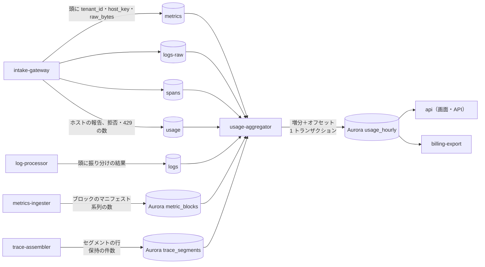

# Usage and Billing: Datadog

利用量の単位と数え方（ホスト、カスタムメトリクスの系列、ログの取り込みの GB と索引の件数、スパンの取り込みの GB と保持の件数、モニター）、計測の経路、MSK からの 1 回だけの集計、時間ごとの集計と月の確定、上限と超過の扱い、課金のシステムへの受け渡し、原価のモデルと製品ごとの粗利を決める。請求書の発行と決済は持たない（[intent.md](../intent.md) の Non-goals）。

| ADR | 決定 |
| --- | --- |
| [0054](../decisions/0054-metering-units-and-host-counting.md) | 課金の単位を 6 つに決める。ホストは「時間ごとの異なるホストの数」の、月の下位 99% の時間の最大（本家に寄せる）。カスタムメトリクスは「時間ごとの異なる系列の数」の月の平均で、標準の指標と溢れの系列を除き、タグの選択の後の系列で数える。分布は 1 系列を 5 と数え、パーセンタイルで足さない。ログは展開した後の受け取ったバイトと、索引に入れた件数。スパンは受け取ったバイトと、保持した件数。モニターは数えるが課金しない |
| [0055](../decisions/0055-exactly-once-usage-aggregation-and-overage.md) | `usage-aggregator` は、データのトピック（`metrics`・`logs-raw`・`logs`・`spans`）のメッセージの頭と `usage` のトピックを読み、組織・時間・単位ごとの増分とオフセットを Aurora の 1 つのトランザクションで、前の位置を条件に書く（1 回だけ）。系列の数と保持の件数は、ブロック・セグメントのカタログの行から ID で 1 回だけ取り込む。時間は 3 時間で確定し、後の訂正は調整の行にする。契約の量の超過は止めずに数え、80%・100%・150% で知らせる。止めるのは組織が自分で決めた費用の上限と、試用の組織だけ |

前提：利用量は取り込んだ時点で、間引く前の量を数える（[AGENTS.md](../../AGENTS.md)）。カーディナリティの上限と溢れ（[ADR-0006](../decisions/0006-cardinality-policy.md)）、取り込みの割り当て（[ADR-0003](../decisions/0003-tenancy-cells-and-isolation.md)）、MSK のトピック（[ADR-0002](../decisions/0002-intake-log-on-msk.md)）。原価の内訳は [capacity.md](capacity.md) の 6 節、単位あたりの原価は [infrastructure.md](infrastructure.md) の 9 節にある。

## 1. 目的と範囲

- **扱う**：課金の単位と数え方、計測の経路、集計の正しさ（1 回だけ）、時間ごとと月ごとの確定、画面と API、上限と知らせ、課金のシステムへの受け渡し、原価と粗利のモデル。
- **扱わない**：値段と契約の文言（PM と営業。表示の文言は**法務の確認待ち：L7**）、請求書と決済（外部の課金のシステム）。

## 2. 要件

| 要件 | 値 | 根拠 |
| --- | --- | --- |
| 正しさ | 参照の数え方（生成したデータの全量を素直に数える）との差 0.1% 以内 | NFR-012、K9 |
| 見えるまで | 時間の区切りから 2 時間以内に画面と API に出る | NFR-012 |
| 数えないもの | 割り当ての超過の 429、受け付けの窓の外の拒否、大きさの上限の拒否、溢れの系列、見張りの組織 | [ADR-0006](../decisions/0006-cardinality-policy.md)、[runbooks/](../runbooks/README.md) の 1 節 |
| 読み直し | 集計の部品をどの位置で止めて読み直しても、結果が 1 回だけ読んだ場合と同じ | [ADR-0002](../decisions/0002-intake-log-on-msk.md) |
| 分離 | 他の組織の利用量が見えない（子の組織は親で合わせて見る） | NFR-007、[tenancy-and-rbac.md](tenancy-and-rbac.md) の 9 節 |

## 3. 本家の形（確かめたこと）

| 項目 | 本家 | 出典 |
| --- | --- | --- |
| ホストの数え方 | ホストとカスタムメトリクスを時間ごとに数える。月の請求は、時間ごとの使用のうち上位 1% を除いた中の最大（high-water mark）。ホストは、監視する物理・仮想の OS のインスタンス。統合で監視するクラウドの VM も数える。エージェントを各コンテナに入れると、コンテナごとにホストと数える。報告のないホストは数えない | [Billing](https://docs.datadoghq.com/account_management/billing/) |
| カスタムメトリクス | 指標の名前とタグの値の組（host のタグを含む）で 1 つ。月の各時間の異なる系列の数の平均。分布は組ごとに 5、パーセンタイルを有効にするとさらに 5 | [Custom Metrics Billing](https://docs.datadoghq.com/account_management/billing/custom_metrics/) |
| ログ | 請求は、月に索引に入れたログの件数で数える。契約の量を超えた分は割増 | [Log Management Billing](https://docs.datadoghq.com/account_management/billing/log_management/) |
| スパン | 索引に入れたスパンのうち、契約の量を超えた件数を請求する | [Billing](https://docs.datadoghq.com/account_management/billing/) |
| ログの取り込みのバイトの数え方（圧縮の前か後か）、スパンの取り込みの GB の数え方 | 公式の資料で確かめられなかった（**未検証**） | — |

いずれも 2026-10-09 に確認。[intent.md](../intent.md) は「ホストの数え方」を未検証としていたが、上の出典で確かめた。

## 4. 単位と数え方

ADR-0054。

| 単位 | 定義 | 数える場所 | 月の確定 |
| --- | --- | --- | --- |
| ホスト | 時間ごとの異なるホストの数（4.1 節） | `usage-aggregator`（`metrics` の頭の `host_key`、`usage` のエージェントの報告） | 下位 99% の時間の最大 |
| カスタムメトリクス | 時間ごとの異なる系列の数（4.2 節） | インジェスターのブロックのマニフェスト | 時間ごとの数の平均 |
| ログの取り込み | 受け取ったログの、展開した後のバイト（4.3 節） | `logs-raw` の頭の `raw_bytes` | 合計 |
| ログの索引 | 索引に入れた件数。索引の保持の区分（3・7・15・30 日）ごと。再水和は別に数える | `logs` の頭の振り分けの結果 | 区分ごとの合計 |
| スパンの取り込み | 受け取ったスパンのバイト（4.4 節） | `spans` の頭の `raw_bytes` | 合計 |
| スパンの保持 | テールサンプリングで残した件数 | トレースのセグメントのカタログ | 合計 |
| モニター（課金しない） | 時間ごとの有効なモニターの数と、評価したグループの数 | `monitor-evaluator` の評価の記録 | 最大と平均を見せる |

- 「数える場所」は、どれも間引く前（ヘッドサンプリングの重み、除外のフィルター、索引の 1 日の上限の前）の量を持つ場所である。ただし「索引」と「保持」の単位は、定義から振り分け・サンプリングの後の量である。

### 4.1 ホスト

- **ホストの鍵（`host_key`）**は次の順で決め、ゲートウェイが MSK のメッセージの頭に入れる。
  1. エージェント：エージェントが起動時に決める安定のホストの ID（クラウドのインスタンスの ID、なければ OS の machine-id の SHA-256）。コンテナで動くエージェントは、ノードの ID を使う。
  2. OTLP：資源の属性 `host.id`、なければ `host.name`。
  3. それ以外（HTTP の API のメトリクスの `host:` タグだけ）：ホストと数えない。系列はカスタムメトリクスとして数える。
- エージェントは 60 秒ごとに「ホストの報告」（ホストの鍵、OS、エージェントのバージョン）を送る。これは `usage` のトピックに入る。メトリクスを送らないエージェント（ログだけ）も、報告でホストと数える。
- コンテナ、Pod、サーバーレスの関数はホストと数えない。エージェントを各コンテナに入れたときは、それぞれの ID でホストに数える（本家に寄せる）。
- 月のホストの数：時間（月 672〜744 時間）ごとの異なるホストの数を並べ、上位 1%（切り上げ。744 時間なら 8 時間）を除いた中の最大。

### 4.2 カスタムメトリクスの系列

- 系列は「指標の名前＋タグの組」（[ADR-0004](../decisions/0004-tsdb-storage-engine.md) の系列の鍵）。クエリに残すタグを選んだ指標は、合わせた後の系列で数える（[ADR-0006](../decisions/0006-cardinality-policy.md)）。
- その時間（`[H, H+1h)`）に点のあった異なる系列の数。インジェスターがブロックを書き出すとき（区切りから 70〜75 分）に、ブロックのマニフェストに組織・種類ごとの数を書く。同じ組織のパーティションの組は 1 時間の区切りでだけ変わり（[ADR-0002](../decisions/0002-intake-log-on-msk.md)）、1 つの系列は 1 時間の中で 1 つのシャードにだけあるので、シャードの数を足すと正確に組織の数になる。写しの片方（貸し出しの持ち主）のマニフェストだけを数える。
- **除くもの**：標準の指標（エージェントが自ら集める `system.*`・`container.*`・`process.*`・`kubernetes.*` と、本システムが作る `<brand>.*`。スパンからの RED メトリクス `<brand>.apm.*` もここに入る）、溢れの系列（`<brand>.cardinality_overflow:true`）。標準の指標の費用はホストの単位に含める。ログから作るメトリクスはカスタムメトリクスに数える。
- **重み**：gauge・count・rate は 1。分布は 5（パーセンタイルを含む。足さない）。本家はパーセンタイルでさらに 5 を足す。本システムは指数のヒストグラムを 1 つ持てば全パーセンタイルが出るので足さない（本家との意図した違い。[architecture/README.md](README.md) の 1.4 節）。
- 月の数：その月の各時間の数の平均（本家に寄せる）。

### 4.3 ログ

- **取り込み**：受け取った各ログについて、HTTP の本文を展開した後の、本文（`message`）と属性を本システムの JSON の形に直した大きさ（バイト）。ゲートウェイが計算して `logs-raw` の頭の `raw_bytes` に入れる。パイプラインでの付け替え・マスク・除外の前の量。本家の数え方（圧縮の前か後か）は確かめられなかった（**未検証**）。
- **索引**：`log-processor` が索引に振り分けた件数（除外のフィルターと 1 日の上限の後）。索引の保持の区分ごと。`logs` のメッセージの頭に振り分けの結果（索引の ID、区分）がある。
- **再水和**：再水和で読んだアーカイブのバイトと、戻した件数を別の単位で数える（課金するかは PM。[log-storage-and-search.md](log-storage-and-search.md)）。
- 監査の索引 `audit`（[tenancy-and-rbac.md](tenancy-and-rbac.md) の 8 節）は数えない。

### 4.4 スパン

- **取り込み**：受け取った各スパンの、OTLP の Protobuf の形での大きさ（資源の属性はスパンの数で割って足す）。ゲートウェイが `spans` の頭の `raw_bytes` に入れる。ヘッドサンプリングで送り手が落としたスパンは届かないので数えない（送り手の側の間引きは利用者の選択）。
- **保持**：`trace-assembler` がテールサンプリングで残し、セグメントに書いた件数。カタログの行の件数から取る。

## 5. 計測の経路と 1 回だけの集計

ADR-0055。

### 5.1 MSK から読む分

- `usage-aggregator` はメッセージの頭（`tenant_id`、`host_key`、`raw_bytes`、件数、振り分けの結果）だけを読み、本文を解釈しない。本文の展開はバッチの展開（zstd）の分だけ。
- `logs` は `log-processor` が Kafka のトランザクションで書く（[ADR-0030](../decisions/0030-log-pipeline-execution-model.md)）ので、`read_committed` で読む。中断したトランザクションのメッセージを数えない。
- 組織・時間（取り込みの時刻の時間）・単位ごとに増分をメモリーに溜め、最大 10 秒か 10 万メッセージごとに Aurora へ書く。
- **1 回だけ**：1 つのトランザクションで、(1) `usage_offsets` の行を `UPDATE ... SET next_offset = $end WHERE consumer = $c AND partition = $p AND next_offset = $start` で進め、(2) `usage_hourly` に増分を足す。(1) が 0 行なら（別のタスクが先に進めた、ゾンビのタスク）トランザクションを捨てる。オフセットと増分が同じ記録で確定するので、どこで止まって読み直しても二重に足さず、欠けない（[ADR-0002](../decisions/0002-intake-log-on-msk.md) の消費者の決まり）。
- ホストは、時間ごとの異なる `host_key` の集合（`usage_hosts_hourly`、`(tenant_id, hour, host_key)` の一意の行）に `INSERT ... ON CONFLICT DO NOTHING` で足す。集合なので読み直しても同じ。数は確定の時に数える。
- エージェントが 503 の後に送り直した要求が、実は MSK に書けていたときは、同じログが 2 回取り込まれる。2 回とも保存されるので、2 回数える（本家の扱いは**未検証**）。

### 5.2 カタログから読む分

- 系列の数（`metric_blocks` の行）、スパンの保持の件数（`trace_segments` の行）は、行の ID（ブロックの ID・セグメントの ID）を `usage_ingested_objects` に一意の鍵で入れるのと同じトランザクションで、`usage_hourly` に足す。同じ行を 2 回取り込まない。
- 合わせ（`compactor`）で作った日のブロック・大きなセグメントは数えない（もとの時間のブロック・セグメントで数え済み）。マニフェストに `origin = ingest | compaction` を持たせて分ける。

### 5.3 時間の確定

| 時点 | 状態 |
| --- | --- |
| 区切りの後、増分が入る間 | `provisional`（画面に「暫定」と示す） |
| `H + 3 時間` | `final`。系列の数（`H + 70〜75 分` に出る）を含め、すべての単位がそろう。水位で確かめてから確定する |
| 確定の後に増分が来た | `usage_adjustments` に調整の行として足す（例：区切りを越えて遅れて読んだメッセージ）。月の確定の前なら月に含め、後なら次の月の調整にする |

- NFR-012（2 時間以内に見える）は暫定の値で満たし、確定は 3 時間とする。
- 月の確定：月の最後の時間の確定の後（翌月 1 日の 03:00 JST）に、`usage_monthly` を作る。

## 6. 画面と API

- 組織の管理者（`usage.read`）は、単位ごとの時間・日・月の値、契約の量への近づき、上位の指標（系列の多い指標と、増えたタグの鍵。[ADR-0006](../decisions/0006-cardinality-policy.md) の知らせと同じ数）、索引ごとの件数、拒否・429・溢れの数（課金に入らない数として別に）を見る。
- 親の組織は、子の組織の合計と内訳を見る（[tenancy-and-rbac.md](tenancy-and-rbac.md) の 9 節）。子の利用量は親の `usage_monthly` の行に子の ID を持つ行として写す（親から子のデータの面は読まない）。
- 利用の属性（タグごとの内訳。本家の Usage Attribution に当たる）は MVP の後。
- 表示の文言（暫定・確定・超過の説明）は**法務の確認待ち：L7**。

## 7. 上限と超過

ADR-0055。

| 仕組み | 何で決まるか | 超えたとき |
| --- | --- | --- |
| 契約の量（月） | 契約（単位ごと） | 止めない。超過として数える。月の初めから日割りで見て 80%・100%・150% で組織の管理者に知らせる |
| 取り込みの割り当て（秒） | 契約の量から（[ADR-0003](../decisions/0003-tenancy-cells-and-isolation.md)） | 429。数えない |
| 有効な系列の上限 | 契約の量の 2 倍（[ADR-0006](../decisions/0006-cardinality-policy.md)） | 溢れの系列。数えない |
| 索引の 1 日の上限 | 組織が索引ごとに決める | 索引に入れない（アーカイブには入る）。取り込みは数える |
| 費用の上限（任意） | 組織が単位ごとに月の上限を決める | ログ：索引への振り分けを止める（アーカイブとログからのメトリクスは続く）。スパン：保持を「エラーのトレースだけ」に下げる。メトリクス：止めない（上限で止めると監視が止まるので、知らせるだけ） |
| 試用の組織 | 試用の量 | ログの索引とスパンの保持を止め、メトリクスは系列の上限（10 万）で溢れにする |

- 超過の単価、割増の率は PM と営業が決める。上の振る舞いの約束の文言は**法務の確認待ち：L7**。

## 8. 課金のシステムへの受け渡し

- `billing-export` は、確定した `usage_hourly`・`usage_monthly`・`usage_adjustments` を、外部の課金のシステムへ日ごとに送る。送り方は、課金のシステムの API への送信（冪等の鍵：`(tenant_id, period, unit, version)`）と、S3 の書き出し（同じ鍵のファイル名）の両方を持てる形にし、使う課金のシステムは E12 の `billing-export` で決める。
- 送信は outbox で行い、重ねても同じ結果になる（冪等）。課金のシステムが受けた値と、本システムの値を毎日突き合わせる。

## 9. 原価のモデルと粗利

[capacity.md](capacity.md) の 6 節の月の原価（S1、本番、約 36 万 USD/月、±50%）を、製品ごとに割り振る。割り振りの規則：MSK・ゾーンをまたぐ転送は信号ごとのバイトの割合、インジェスター・読み手・インデクサー・組み立ては信号の部品、S3 は信号ごとの区分、共有の部品（Aurora、Valkey、ネットワーク、自己監視、大阪の待機）は信号の割合で配る。

| 製品 | 月の原価（USD、概算） | 単位あたりの原価 | [architecture/README.md](README.md) の 2.1 節の仮の予算 | 粗利 70% の下限の値段 |
| --- | --- | --- | --- | --- |
| メトリクス | 約 10.5 万 | 系列 100・月 0.105 USD。100 万点 0.0080 USD | 系列 100・月 0.5 USD（満たす） | 系列 100・月 0.35 USD |
| ホスト（標準の指標 1,500 系列を含む） | 上のメトリクスに含む | ホスト・月 約 1.6 USD | — | ホスト・月 5.2 USD |
| ログの取り込みとアーカイブ | 約 15.1 万 | 取り込み 1 GB 0.100 USD | 最初の仮の予算 1 GB 0.03 USD（**満たさない。約 3 倍**）。統合の工程で仮に 1 GB 0.10 USD に上げた（下の「選択肢」） | 1 GB 0.33 USD |
| ログの索引 | 約 3.4 万 | 100 万件（保持の区分の平均 15 日）0.056 USD | 100 万件・15 日 0.4 USD（満たす） | 100 万件 0.19 USD |
| スパン | 約 7.5 万 | 取り込み 1 GB 0.036 USD。100 万スパン 0.014 USD | — | 1 GB 0.12 USD |

- 前提：S1 の量（[architecture/README.md](README.md) の 2 節）。ログの 1 件は平均 500 バイト、スパンは平均 400 バイト（本システムの想定）。
- **ログの取り込みの原価が予算の約 3 倍**になる。大きい順に、MSK（`logs-raw` と `logs` の 2 回通る。約 5 万 USD）、アーカイブの大阪への写し（CRR の転送と Replication Time Control。約 2.4 万 USD）、アーカイブの保存（東京と大阪の Glacier Instant Retrieval。約 2.3 万 USD）、ゾーンをまたぐ転送（約 1.3 万 USD）、共有の部品の割り振り（約 2 万 USD）。下げる手段と効きの目安：
  - アーカイブの大阪への写しを Replication Time Control なしにする（−0.002 USD/GB）か、アーカイブを NFR-005 のテレメトリーの RPO 30 分の対象から外す（大阪の写しと保存をなくして −0.020 USD/GB）。NFR の変更なので PM の判断。
  - アーカイブの圧縮を 1/8 から 1/12 に上げる（`log-bloom-poc` で測る）。
  - MSK の消費者をラックを意識した読み出し（同じ AZ の写しから読む）にして、ゾーンをまたぐ転送を減らす（[infrastructure.md](infrastructure.md) の 4 節）。
  - MSK のブローカーの数を、ピークの 2 倍の余裕から 1.5 倍に下げる（[ADR-0002](../decisions/0002-intake-log-on-msk.md) の「ピークの 2 倍」の変更）。
  - どれを採っても 0.03 USD/GB には届かない見込み（すべて採って 0.06〜0.07 USD/GB）。予算の値そのものを PM が見直す。13 節の持ち越し。

**ログの取り込みの原価の内訳**（1 GB あたり。月 50 TB/日 × 30 日 ＝ 150 万 GB で割る）：

| 項目 | 月（USD） | 1 GB あたり（USD） |
| --- | --- | --- |
| MSK（`logs-raw` と `logs` の 2 回） | 約 5 万 | 0.033 |
| アーカイブの大阪への写し（CRR の転送と Replication Time Control） | 約 2.4 万 | 0.016 |
| アーカイブの保存（東京と大阪の Glacier Instant Retrieval） | 約 2.3 万 | 0.015 |
| ゾーンをまたぐ転送 | 約 1.3 万 | 0.009 |
| 共有の部品の割り振り | 約 2 万 | 0.013 |
| その他（`log-processor`、アーカイブの書き手、S3 の要求） | 約 2.1 万 | 0.014 |
| 合計 | 約 15.1 万 | 0.100 |

**選択肢**（統合の工程で整理。どれも PM の判断）：

| 案 | 中身 | 1 GB あたりの原価 | 粗利 70% の下限の値段 | 引き受けること |
| --- | --- | --- | --- | --- |
| A. 予算を上げる | 設計を変えず、S1 の予算を 1 GB 0.10 USD にする | 0.100 | 0.33 | 値段が上がる。値段は PM と営業 |
| B. 値段を原価に合わせて分ける | 取り込みの値段を、索引に入れない「アーカイブだけ」と「取り込み＋アーカイブ」に分け、アーカイブの写し・保存の分（0.031）をアーカイブの単位に寄せる | 取り込み 0.069、アーカイブ 0.031 | 取り込み 0.23、アーカイブ 0.10 | 単位が 1 つ増える（ADR-0054 の変更）。合計は A と同じ |
| C. MSK の余裕を 2 倍から 1.5 倍へ | 「ピークの 2 倍以上」を「1.5 倍以上」に下げる。AZ ごとに同じ数なので 12 → 9 台（S1 で 2.0 倍、AZ を失って 1.4 倍。今は 2.7 倍と 1.8 倍）。[ADR-0002](../decisions/0002-intake-log-on-msk.md)・[ADR-0064](../decisions/0064-capacity-headroom-and-load-test-gates.md) の変更 | 0.094（−0.006。MSK 全体で月 約 1.8 万の減り） | 0.31 | 障害の日の全体の急増（3 倍）を受ける幅が減り、429 が早く出る。最大のリスク（取り込みの崩壊）の守りを削る |
| D. アーカイブを DR の対象から外す | 大阪へ写さない（NFR-005 のテレメトリーの RPO 30 分の対象を、索引のセグメントとメトリクスだけにする） | 0.080（−0.020） | 0.27 | リージョンの障害で 1 年のアーカイブを失いうる。NFR の変更 |
| E. 下げる手の全部 | C・D に、Replication Time Control なし（−0.002）、アーカイブの圧縮 1/8 → 1/12（−0.005、`log-bloom-poc` で測る）を足す | 0.06〜0.07 | 0.20〜0.23 | C と D のリスクをすべて引き受けても 0.03 に届かない |

- **推奨の既定（仮。PM の判断待ち）**：A。S1 の予算を 1 GB 0.10 USD に上げ、設計（MSK の 2 倍の余裕、アーカイブの DR）は変えない。理由：C は最大のリスクの守りを削り、D は NFR を変える。どちらを採っても 0.03 には届かず、効きは 0.006〜0.020 にとどまる。圧縮の改善（−0.005）は PoC の結果で予算に反映する。
- **残る問い（PM）**：(1) 1 GB 0.10 USD の原価で、ログの取り込みの値段をいくらにするか（粗利 70% なら 0.33 USD 以上。下げるなら粗利の目標を下げる）。(2) B のようにアーカイブを別の単位にするか。(3) D（アーカイブを DR から外す）を利用者が選べる設定にするか。E13 の `cost-baseline` の前に決める。
- 粗利の目標（70%）は本システムの想定。値段は PM と営業が決める。

## 10. 障害のときの振る舞い

| 障害 | 振る舞い |
| --- | --- |
| `usage-aggregator` の停止 | MSK に溜まる（保持 24 時間）。戻れば位置から読み直し、1 回だけ足す。2 時間を超えて遅れたら `usage-lag` のアラート（[runbooks/](../runbooks/README.md) の 1 節の「利用量の遅れ」） |
| MSK の保持（24 時間）を超える停止 | 欠けた範囲を数える。欠けた時間は確定せず、カタログ（系列・保持）は後から取り込める。バイトの単位は、`logs-raw`・`spans` が消えていれば戻せない。そのときは欠けを記録し、課金のシステムに「推定なし・欠け」として渡す（推定で埋めない） |
| Aurora の停止 | 書けないので止まる。MSK の位置は進まない |
| ゲートウェイの `raw_bytes` の誤り（リリースの誤り） | 参照との比べ（12 節）と、`raw_bytes` の合計と MSK の圧縮の前のバイトの比の急な変化で気づく。直した後に、保持の中の範囲を読み直す別の消費者のグループで数え直し、差を調整の行にする |

## 11. テスト

| 種類 | 中身 | 要件 |
| --- | --- | --- |
| 参照との比べ | 生成したデータ（ホスト、系列、ログ、スパン、索引の振り分け、拒否・429・溢れを混ぜる）の全量を素直に数えた参照と、計測の経路の結果を比べる。差 0.1% 以内。拒否・429・溢れ・見張りの組織が入らない | `PROP-USAGE-001`（[quality.md](../quality.md) の 2.2.1 節 J） |
| 読み直し | `usage-aggregator` を任意の位置（トランザクションの前後）で止めて再開しても、結果が 1 回だけ読んだ場合と一致する。ゾンビのタスクを同時に動かしても二重に足さない | `PROP-USAGE-002` |
| 表駆動 | ホストの鍵の決め方（エージェント、OTLP の `host.id`・`host.name`、API の `host:` タグ）、下位 99% の最大（672・720・744 時間の月）、分布の重み、標準の指標の除外 | `DT-USAGE-001`〜`003` |
| 性質ベース | 系列の数：任意の系列の列とシャードの分け方で、シャードの数の和が組織の異なる系列の数と一致する。タグの選択の後の数で数える | `PROP-USAGE-003` |
| 結合 | 確定の後の遅れた増分が調整の行になる。`billing-export` を 2 回送っても課金のシステムの値が変わらない | `REQ-USAGE-*` |

## 12. Story の候補

| Epic | Story | 中身 |
| --- | --- | --- |
| E12 | `usage-metering-pipeline` | 5.1・5.2 節の経路、`usage_offsets` の条件つきの更新、メッセージの頭の項目（intake-and-agent と共同） |
| E12 | `custom-metrics-counting` | 4.2 節。ブロックのマニフェストの数、標準の指標の一覧、重み |
| E12 | `host-counting` | 4.1 節。ホストの鍵、エージェントの報告、下位 99% の最大 |
| E12 | `usage-finalization` | 5.3 節の暫定・確定・調整、月の確定 |
| E12 | `usage-ui-and-api` | 6 節、7 節の知らせ。文言は法務：L7 |
| E12 | `spend-caps` | 7 節の費用の上限と試用の止め方 |
| E12 | `billing-export` | 8 節。課金のシステムの選定を含む |
| E12 | `usage-reference-compare` | 11 節の参照との比べ |

## 13. 未解決の問い

### 決定

2026-10-09 の既定案。E12 と E13 で覆りうる。

- **ホスト**：本家に寄せて、下位 99% の時間の最大（ADR-0054）。
- **分布の重み**：5 で、パーセンタイルで足さない（ADR-0054）。本家と違う。統合の工程で [architecture/README.md](README.md) の 1.4 節に行を足した。
- **ログの取り込みのバイト**：展開した後の、本システムの JSON の形での大きさ（ADR-0054）。
- **集計**：データのトピックの頭とカタログの行から、条件つきのオフセットの更新で 1 回だけ（ADR-0055）。
- **超過**：止めない。止めるのは組織の費用の上限と試用だけ（ADR-0055）。

### 持ち越し

| 問い | いつ・どう決めるか |
| --- | --- |
| ログの取り込みの値段と単位（9 節の「残る問い」）。統合の工程で予算を仮に 0.10 USD/GB に上げた | PM。E13 の `cost-baseline` の前に決める |
| 本家のログの取り込みのバイトの数え方、送り直しの重複の扱い | 公式の資料で確かめる（**未検証**） |
| 再水和を課金するか | PM（[log-storage-and-search.md](log-storage-and-search.md) と共同） |
| 課金のシステムの選定と受け渡しの形 | E12 の `billing-export` |
| 表示の文言、超過・上限の約束 | **法務の確認待ち：L7** |
| 利用の属性（タグごとの内訳） | MVP の後 |

## 14. quality.md・runbooks・data-model への項目

### quality.md

- 2.2.1 節 J に、読み直しの性質（`PROP-USAGE-002`）とゾンビのタスクの場面を足す。
- E12 の合否基準に `DT-USAGE-001`〜`003` の全行を足す。

### runbooks

- `usage-lag.md`：`usage-aggregator` の遅れ、確定の遅れ、欠けの記録の手順。
- `usage-recount.md`：誤った `raw_bytes` の後の数え直し（別の消費者のグループ）と調整の行の作り方。

### data-model への項目

| 表・置き場所 | 中身 | 節 |
| --- | --- | --- |
| `usage_hourly` | `(tenant_id, hour, unit, class)`、`quantity`、`state`（`provisional`・`final`） | 5 |
| `usage_hosts_hourly` | `(tenant_id, hour, host_key)` の一意の行 | 5.1 |
| `usage_offsets`（RLS の外。X2 の経路） | `(consumer, topic, partition)`、`next_offset` | 5.1 |
| `usage_ingested_objects` | 取り込んだブロック・セグメントの ID | 5.2 |
| `usage_adjustments` | 確定の後の調整の行 | 5.3 |
| `usage_monthly` | 月の確定の値。親の組織の行に子の ID | 5.3、6 |
| `usage_contracts`・`spend_caps` | 契約の量、費用の上限 | 7 |
| `metric_blocks` に足す列 | 種類ごとの系列の数（標準・カスタム・分布）、`origin` | 4.2、5.2 |
| `trace_segments` に足す列 | 保持の件数、`origin` | 5.2 |
| MSK のメッセージの頭に足す項目 | `host_key`、`raw_bytes`、振り分けの結果（`logs`） | 4、5.1 |
| `usage` のトピックのメッセージ | ホストの報告、拒否・429 の数 | 4.1 |

## 出典

いずれも 2026-10-09 に確認。

- Datadog Docs, [Billing](https://docs.datadoghq.com/account_management/billing/)
- Datadog Docs, [Custom Metrics Billing](https://docs.datadoghq.com/account_management/billing/custom_metrics/)
- Datadog Docs, [Log Management Billing](https://docs.datadoghq.com/account_management/billing/log_management/)
