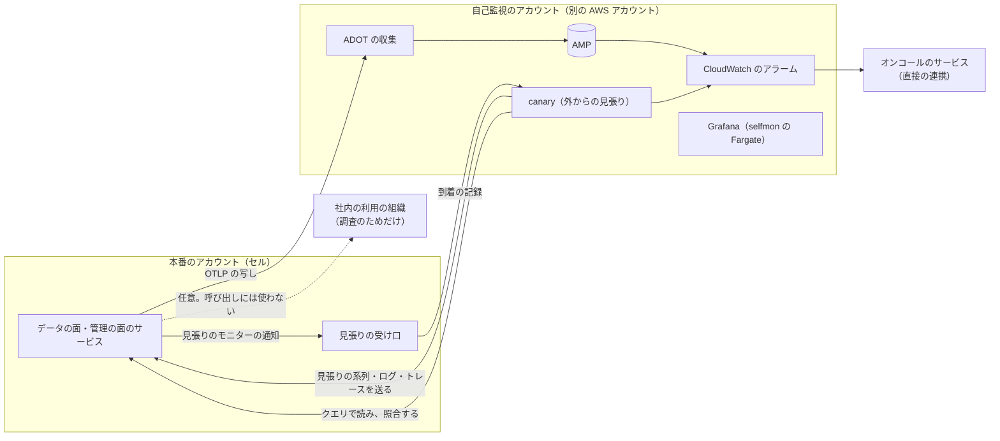

# Runbooks: Datadog

Ops が持つ運用の文書。品質の判定基準は [quality.md](../quality.md) の 4 節にある。SLI の計測とアラートの条件の実装は [observability.md](../architecture/observability.md) にある（どの計測を正にするかは [ADR-0063](../decisions/0063-slis-from-canary-and-server-histograms.md)）。**SLO の値とアラートの一覧の正本はこの文書** で、値を変えるときは、この文書を先に変える。

この題材は、利用者のシステムを監視する側である。本システムが止まれば、利用者は自分の障害にも気づけない。本システムの監視は、本システムに頼らない形で作る（5 節）。

## 1. SLI と SLO

| SLI | 良いイベント（数える場所） | SLO（S1） | 許容範囲を外れたときの扱い | 品質の判定に使う |
| --- | --- | --- | --- | --- |
| 取り込みの可用性 | 取り込みの要求のうち、5xx・時間切れでないもの（429 は割り当ての超過として除く）（NLB、ゲートウェイ） | **月間 99.95%**（NFR-006） | 1 時間のバーンレート 14.4 倍・6 時間で 6 倍で呼び出し、3 日で 1 倍でチケット。エラーバジェットを使い切ったら、修正以外のデプロイを止める | |
| 取り込みの応答 | 500 KB までの要求の 202 が 300ms 以内 | **p99 300ms**（NFR-001） | p99 が 1 秒を 10 分超えたら呼び出し | |
| メトリクスがクエリに出るまで | 見張りの系列の、202 からクエリで読めるまで | **p95 10 秒・p99 30 秒**（NFR-002、K2） | p99 が 2 分を 5 分超えたら呼び出し | ○ |
| ログがクエリに出るまで | 見張りのログの、202 から検索で見えるまで | **p95 20 秒・p99 60 秒**（NFR-002） | p99 が 5 分を 5 分超えたら呼び出し | ○ |
| トレースが出るまで | 見張りのトレースの、完成の判断から検索で見えるまで | **p95 90 秒**（NFR-002） | p95 が 10 分を 10 分超えたらチケット | |
| クエリの可用性 | クエリの要求のうち、5xx・時間切れでないもの（受け付けの拒否は除く） | **月間 99.9%**（NFR-006） | 取り込みと同じバーンレート | |
| メトリクスのクエリの速さ | 1 時間の窓・結果 1,000 系列以下のクエリが 1 秒以内 | **p99 1 秒**（NFR-003） | 1 時間続けて超えたらチケット | |
| ログの検索の速さ | 15 分の検索が 1 秒以内 | **p95 1 秒**（NFR-003） | 1 時間続けて超えたらチケット | |
| モニターの評価の遅れ | 評価の予定の時刻（＋遅らせ）から完了まで 30 秒以内 | **p99 30 秒**（NFR-004） | p99 が 2 分を 5 分超えたら呼び出し | ○ |
| 評価と通知の可用性 | 予定した評価のうち、抜け（10 分を超えて追わなかったもの）でないもの。遷移のうち、10 秒以内に送信したもの | **月間 99.95%**（NFR-006） | バーンレート。抜けは 1 件でチケット | ○ |
| 不完全の評価 | 評価のうち、水位の待ちの上限を超えて不完全で評価したもの | **0.1% 未満** | 1 時間で 1% を超えたら呼び出し | ○ |
| 見張りの照合 | 見張りの系列・ログの、書いた値と読んだ値の不一致 | **0**（NFR-005、K1） | 1 件で呼び出し（SEV1 の候補）。合わせと保持の削除を `ops.compaction_enabled` で止める | ○ |
| ブロックの写しの一致 | 2 つの写しのブロックのチェックサムの不一致 | **0** | 1 件で呼び出し（SEV2 から）。そのシャードの書き出しを止める | ○ |
| ストレージの突き合わせ | カタログの行のうち、S3 のオブジェクトのないもの | **0** | 1 件で呼び出し（SEV1 の候補） | ○ |
| 分離 | 応答の監査の不一致（組織、データのアクセスの制限） | **0**（NFR-007、K7） | 1 件で呼び出し（SEV1 の候補） | ○ |
| 隣人の影響 | 割り当ての中の組織の、取り込みからクエリまでの p99（組織ごと） | **NFR-002 の値を全組織で** | 上位 1% の組織が 10 分外れたらチケット、全体の 5% で呼び出し | ○ |
| 利用量の遅れ | 時間の区切りから、利用量が画面に出るまで | **2 時間以内**（NFR-012） | 4 時間を超えたらチケット | |
| ヘッドの要約の一致 | 2 つの写しの 5 分ごとのヘッドの要約の食い違い（[tsdb-storage-engine.md](../architecture/tsdb-storage-engine.md) の 6.7 節） | **0** | 1 件で呼び出し（SEV2 から）。ブロックの写しの一致と同じ扱い | ○ |
| 監査の読み出しの記録の欠け | 返したクエリの数と、`audit` の読み出しの事象の数の差（組織・時間ごと。[tenancy-and-rbac.md](../architecture/tenancy-and-rbac.md) の 8.3 節） | **差 0** | 1 時間で 0.01% を超えたらチケット | ○ |
| 自己監視の経路の健全 | デッドマンスイッチの 3 段（[observability.md](../architecture/observability.md) の 4 節）のどれかが鳴った回数 | **0** | 鳴ったら呼び出し（[self-monitoring-path-failure.md](self-monitoring-path-failure.md)） | |

- SLO の窓は 30 日の移動の窓（報告は暦の月）。エラーバジェットを使い切ったら、信頼性の作業を機能より先にする。デプロイの前に残りを確かめる。
- **数えないもの**：割り当ての超過の 429、受け付けの窓の外の拒否、クエリの受け付けの拒否（費用の上限）。ただし率の急な上がりは、エージェント・ゲートウェイの食い違いの兆候として見る。社内の見張りの組織は SLO の計算から除き、別に見る。
- 「品質の判定に使う」に○がある指標は、QA が品質の判定基準に使う（[quality.md](../quality.md) の 4.1 節）。定義を変えるときは QA と合意する。
- 下の 3 行（ヘッドの要約、監査の欠け、自己監視の経路）は、統合の工程（2026-10-09）で observability と tsdb-storage-engine の領域の提案を採って足した。
- 復旧の目標：AZ の障害は RPO 0・RTO 5 分。リージョンの障害は、管理の面 RPO 1 分・RTO 1 時間、テレメトリー RPO 30 分、取り込みの再開 RTO 1 時間、過去のデータのクエリ RTO 4 時間（NFR-005）。
- 本家のサービスの SLA は、公式の資料で確かめなかった（**未検証**）。本システムの SLO は、利用者の障害の調査に使われることを考え、取り込みと評価を他の題材より高い水準にする。

## 2. 上限と容量のパラメーター

値の正本は、各 ADR と領域の文書にある。Ops が運用で変えてよいのは、下の「運用で変えるもの」だけで、変えたら記録を残す。

| 対象 | 値 | 正本 | 運用で変えるもの |
| --- | --- | --- | --- |
| 取り込みの本文 | メトリクス 500 KB（展開して 5 MB）、ログ 展開して 5 MB・1 件 1 MB・配列 1,000 件 | intake-and-agent の領域（本家の値に寄せる） | — |
| 受け付けの窓 | メトリクス 過去 1 時間・未来 10 分、ログ 過去 18 時間 | [ADR-0004](../decisions/0004-tsdb-storage-engine.md)、[ADR-0005](../decisions/0005-log-storage-columnar-with-bloom.md) | — |
| 組織の取り込みの割り当て | 契約の量から（点/秒、バイト/秒、ログの件数/秒、スパン/秒） | [ADR-0003](../decisions/0003-tenancy-cells-and-isolation.md) | 組織ごとの一時の引き上げ・引き下げ |
| 有効な系列の上限 | 組織：契約の量の 2 倍、指標：10 万、作成の速さ：1 万/秒 | [ADR-0006](../decisions/0006-cardinality-policy.md) | 組織ごとの引き上げ（記録つき） |
| タグ | 系列あたり 100、鍵・値 200 バイト | 同上 | — |
| MSK の保持 | 24 時間 | [ADR-0002](../decisions/0002-intake-log-on-msk.md) | — |
| ブロックの書き出し | 区切りから 70 分（`H + 2 時間 10 分`）に、パーティションごとのずらし 0〜5 分を足す | [ADR-0004](../decisions/0004-tsdb-storage-engine.md)、[ADR-0020](../decisions/0020-block-flush-commit-and-replay.md) | — |
| ヘッドのチェックポイント | 5 分ごと | 同上 | — |
| 保持 | メトリクス 生 15 日・1 分 63 日・1 時間 15 か月、ログの索引 3・7・15・30 日、再水和 3・7・15・30 日（既定 15 日）、アーカイブ 1 年、トレース 15 日、評価の記録 30 日、ヘッドのチェックポイント 24 時間、監査の索引 既定 90 日（仮。法務の L6） | [ADR-0009](../decisions/0009-retention-tiers-on-s3.md)、[ADR-0035](../decisions/0035-log-rehydration-jobs.md)、[ADR-0052](../decisions/0052-identity-sso-scim-keys-and-audit-trail.md) | — |
| クエリの上限 | 系列 100 万、生の点 10 億、組織ごとの並行（契約から） | [ADR-0007](../decisions/0007-query-language.md) | `ops.query_concurrency_per_tenant`（下げるだけ） |
| 評価の水位の待ち | 最大 5 分 | [ADR-0008](../decisions/0008-monitor-evaluation-model.md) | — |
| 評価の抜けを追う範囲 | 10 分 | 同上 | — |
| 取り込みの受け付け | — | — | `ops.intake_enabled`（セルごとに止めるだけ） |
| 合わせ・保持の削除 | — | — | `ops.compaction_enabled`、`ops.retention_delete_enabled`（止めるだけ） |
| 通知の送信 | — | — | `ops.notifications_enabled`（チャネルごとに止めるだけ） |
| 状態を持つ部品の入れ替え | — | [ADR-0065](../decisions/0065-stateful-rollout-with-replica-handoff.md) | `ops.rollout_paused`（止めるだけ） |
| 割り当ての合計の上限の比（売りすぎ） | 容量の 1.5 倍 | [ADR-0064](../decisions/0064-capacity-headroom-and-load-test-gates.md) | `ops.oversubscription_ratio`（PM と合意して） |

## 3. リリースとロールバック

- **デプロイとリリースを分ける。** デプロイは Ops が承認し、リリース（フラグを広げる）は PM が判断する。未完成の振る舞いは `release.*` のフラグの裏に置く。`release.*` は 100% の後 30 日で消す。
- **保存の形式・圧縮・ロールアップ・評価の規則をフラグにしない。** `codec_id`、ブロックとセグメントの形式、ロールアップの定義、状態の遷移の決定表の変更は、コードのバージョンとして出し、本番の照合の指標で見る。
- **形式の変更の順序**：読む側を先に出し（新しい形式を読める）、全シャードに行き渡ってから、書く側を出す。書く側を戻しても、読む側は新しい形式を読み続ける。
- **データの面のデプロイ**：セルごとに、検証のセル → 社内の見張りのセル → 本番のセルの順。状態を持つサービスは、予備のインスタンスに新しいタスクを先に起こし、MSK に追いつき、影の比べ（系列の抜き取りとヘッドの要約）が通ってから古いタスクを止める。1 つの AZ の写しを入れ替え終え、ブロックのチェックサムがもう一方と一致してから、次の AZ へ進む（[ADR-0065](../decisions/0065-stateful-rollout-with-replica-handoff.md)、[deploy-and-rollback.md](deploy-and-rollback.md)）。`monitor-evaluator` はシャードを 1 つずつ移す。
- **管理の面のデプロイの順**：マイグレーション（広げる段だけ）→ `api`・`web-bff`（ローリング）→ `relay`・`notifier` → Web の資産（置くだけ）。
- **自動のロールバックの条件**：取り込みの 5xx、202 の p99、取り込みからクエリまでの p99、評価の遅れ、写しのチェックサムの不一致、見張りの照合の不一致。
- **エージェントの配布**：社内 → 1% → 10% → 50% → 100%、各段 48 時間以上。止める条件：送信の失敗の率、拒んだ点の率、エージェントの CPU とメモリーが前の 1.5 倍。利用者が自分で更新するので、サーバーは少なくとも 6 か月前までのエージェントのバージョンを受ける。
- **ロールバック**：まずフラグで戻す。次に 1 つ前のイメージ（マイグレーションは広げる段だけなので、前のバージョンが今の DB で動く）。縮める段の後は前へ戻さない。
- 本番へのデプロイは Ops が承認する（作成者と別の人）。

### 3.1 デプロイの時間帯と凍結

| 対象 | 時間帯 | 凍結（修正だけ） |
| --- | --- | --- |
| 管理の面、Web の資産 | 平日 10〜17 時 | 金曜 15 時以降、日本の祝日の前日、年末年始、エラーバジェットを使い切っている間 |
| データの面（状態なし） | 平日 10〜16 時 | 同上 |
| データの面（状態あり：インジェスター、インデクサー、組み立て、評価） | 平日 10〜15 時。1 日 1 セル | 同上。大きな催し（年末の EC の繁忙期、ゲームの大きな公開）の週は、利用者の量の急増に備えて止める |
| 形式・コーデックの変更（書く側） | 計画作業として平日 10〜15 時 | 同上 |
| Terraform（ネットワーク、MSK、S3 の方針） | 平日 10〜16 時。Ops の承認 | 同上 |

- 上の時間帯と凍結は本システムの既定である。繁忙期の凍結は、利用者の障害の多い時期に監視を止めないための本システムの想定で、本家の運用の値ではない。

## 4. アラートと手順

作った手順は次の 5 つ（統合の工程、2026-10-09）。他の手順は、各 Epic の実装に合わせて [templates/runbook.md](../../../../docs/templates/runbook.md) から作る。「作る Story」の列は、そのアラートの計測と手順を作る [roadmap.md](../roadmap.md) の Story である。手順の文書は、その Story の完了の条件に含める（E13 の `runbooks-e13` でまとめて確かめる）。

| 手順 | 内容 |
| --- | --- |
| [incident-response.md](incident-response.md) | 共通の進め方、重さ、最初の切り分け（取り込み、照合の不一致、分離の疑い、評価の遅れ） |
| [deploy-and-rollback.md](deploy-and-rollback.md) | デプロイの止め方と戻し方（管理の面、状態を持つ部品、形式の書く側、エージェントの配布） |
| [disaster-recovery.md](disaster-recovery.md) | 大阪への切り替え、失った範囲の記録、東京へ戻す |
| [self-monitoring-path-failure.md](self-monitoring-path-failure.md) | デッドマンスイッチの段ごとの見分け方、監視を失ったときの当面の見方 |
| [noisy-neighbor.md](noisy-neighbor.md) | うるさい隣人の場面の見分け方、割り当ての引き下げ、クエリの絞り、パーティションの組の拡大 |

**すべてのアラートは、5 節の独立した経路で鳴らす。**

| アラート（重さ） | 手順 | 作る Story |
| --- | --- | --- |
| 取り込みの SLO のバーンレート（page・ticket）、202 の遅れ | [incident-response.md](incident-response.md) の場面 1。詳しい手順は `intake-degraded.md`（予定。セルの取り込みの停止、割り当ての引き下げを含む） | `tenant-quotas-and-backpressure`、`slo-dashboards-alerts` |
| MSK のブローカーの障害、ディスク・書き込みの絞り、ISR の縮み（page） | `msk-broker-incident.md`（予定。Express の絞りへの対応、ブローカーの追加） | `msk-cluster-baseline` |
| 消費者の遅れ（水位の遅れ。メトリクス 2 分、ログ 5 分。page）、`canary` と組織ごとの近似の差（ticket） | `consumer-lag.md`（予定） | `ingest-watermarks` |
| インジェスターのメモリーの上限への接近、系列の急増（page） | `ingester-memory-pressure.md`（予定。割り当ての超過の組織の新しい系列の停止を含む）。組織の急増は [noisy-neighbor.md](noisy-neighbor.md) | `cardinality-limits-and-overflow` |
| 写しのブロックの不一致、ヘッドの要約の食い違い（page） | `block-replica-mismatch.md`（予定） | `block-writer-and-manifest` |
| 見張りの照合の不一致、ストレージの突き合わせの不一致、`late_after_flush`（page、SEV1 の候補） | [incident-response.md](incident-response.md) の場面 2。詳しい手順は `data-integrity-incident.md`（予定。合わせと保持の削除の停止、S3 の古いバージョンからの戻しを含む） | `tsdb-reference-compare`、`block-compaction-and-tiers` |
| 評価の遅れ、評価の抜け、不完全の評価の急増（page） | [incident-response.md](incident-response.md) の場面 4。詳しい手順は `monitor-evaluation-lag.md`（予定） | `evaluator-sharding`、`evaluation-records-and-replay` |
| 通知の送信の失敗の増加、チャネルの停止（page） | `notification-delivery.md`（予定） | `notifier-core` |
| クエリの遅れ、受け付けの拒否の急増 | `query-degraded.md`（予定） | `query-admission-and-fairness` |
| 隣人の影響（割り当ての中の組織の遅れ） | [noisy-neighbor.md](noisy-neighbor.md) | `noisy-neighbor-tests` |
| 分離の疑い（応答の監査。page、SEV1 の候補） | [incident-response.md](incident-response.md) の場面 3。詳しい手順は `access-leak-response.md`（予定） | `leak-path-tests` |
| PII の走査での漏れ、本システムのログの秘密の漏れ（page） | `pii-leak-response.md`（予定。法務の L1 の後に確定） | `pii-scrubbing`、`instrumentation-guidelines` |
| エージェントの送信の失敗の急増（配布の後） | [deploy-and-rollback.md](deploy-and-rollback.md)。詳しい手順は `agent-regression.md`（予定） | `agent-distribution` |
| 自己監視の経路の停止、送り手の沈黙（page） | [self-monitoring-path-failure.md](self-monitoring-path-failure.md) | `self-monitoring-baseline`、`dead-man-switch` |
| CRR の遅れ（15 分を超える。page）、Aurora Global Database の遅延（`AuroraGlobalDBRPOLag` 10 秒が 5 分。page）、リージョンの障害 | [disaster-recovery.md](disaster-recovery.md) | `osaka-warm-standby`、`dr-failover-drill` |
| デプロイ中の自動ロールバック、影の比べの失敗 | [deploy-and-rollback.md](deploy-and-rollback.md) | `ci-pipeline-baseline`、`ingester-rolling-replace` |
| 監査の読み出しの記録の欠け（ticket） | `audit-gap.md`（予定） | `audit-trail` |
| 利用量の遅れ（ticket） | `usage-lag.md`（予定。確定の遅れ、欠けの記録） | `usage-finalization` |
| 開示の請求・捜査機関からの照会 | `legal-request.md`（予定。法務の L6 の後に確定） | `audit-trail` |

計画の手順（領域の文書の提案。どれも予定）：

| 手順 | 中身 | 出どころ |
| --- | --- | --- |
| `capacity-headroom.md` | 使用率の上限を超えたときの群れの台数、MSK のブローカーの追加 | [capacity.md](../architecture/capacity.md) の 13 節 |
| `ec2-fleet-capacity.md` | 予備の使い切り、退避の知らせ、AMI の入れ替えの止め方 | [infrastructure.md](../architecture/infrastructure.md) の 13 節 |
| `format-rollout.md` | 形式の書く側の切り替えと、読める番号の確かめ | [delivery.md](../architecture/delivery.md) の 12 節 |
| `key-leak-response.md`、`operator-credential-compromise.md` | キーの漏えい、運用者の資格の漏えい | [security.md](../architecture/security.md) の 14 節 |
| `tenant-cell-move.md` | セルの移し替えの手順、止め方、区切りの確かめ | [tenancy-and-rbac.md](../architecture/tenancy-and-rbac.md) の 15 節 |
| `scim-mass-deactivation.md` | 保留した一斉の停止の確かめと解き方 | 同上 |
| `usage-recount.md` | 誤った `raw_bytes` の後の数え直しと調整の行 | [usage-and-billing.md](../architecture/usage-and-billing.md) の 14 節 |
| `personal-data-deletion.md` | 削除の請求の期限の超過、書き直しの止まり | [ADR-0036](../decisions/0036-personal-data-deletion-tombstones.md)、[log-storage-and-search.md](../architecture/log-storage-and-search.md) の 10 節。期限は法務の L5 |

- すべてのアラートは、対応する手順の URL を注釈に持つ（CI で検査する）。予定の手順を作るまでは、[incident-response.md](incident-response.md) の一般の手順で対応する。本システムの障害は、利用者の監視の欠けとして公表のページで知らせる（文言は法務の L7 の後）。

## 5. 自己監視と循環の回避

本システムは利用者の監視の道具である。本システムを本システムで監視すると、本システムが止まったときに、監視も通知も止まり、気づけない（循環）。次の形で避ける。

- **独立した経路**：本番のサービスの自己の計測（OpenTelemetry）は、別の AWS アカウントの AMP と CloudWatch に送る。アラートは CloudWatch のアラーム（AMP のルールの結果を含む）から、オンコールのサービスへ直接送る。本システムの MSK・TSDB・クエリ・モニター・通知の経路を通らない。
- **外からの見張り**：別のアカウントの `canary` が、セルごとに、(1) 見張りの系列・ログ・トレースを本番の取り込みに送り、(2) 本番のクエリで読んで値と到着の時間を比べ、(3) 見張りのモニター（1 分ごとに必ず鳴る閾値）の通知が、見張りの受け口に届くことを確かめる。どれかが決まった時間（取り込み 2 分、通知 3 分）を超えたら、CloudWatch のアラームで呼び出す（デッドマンスイッチ）。
- **自己監視の経路の監視**：自己監視のアカウントの部品（AMP の書き込み、アラームの評価）の心拍を、オンコールのサービスの心拍の機能で見る。心拍が途切れたら、オンコールのサービスが呼び出す。
- **社内の利用（ドッグフーディング）**：本システムの指標を、本番の別のセルの社内の組織にも写してよい。ダッシュボードとトレースでの調査に使うが、呼び出しと SLO の判定には使わない。同じセルの社内の組織には写さない（そのセルの障害で同時に止まる）。
- **Grafana**：Amazon Managed Grafana は大阪のリージョンで提供されていない（[Supported Regions](https://docs.aws.amazon.com/grafana/latest/userguide/what-is-Amazon-Managed-Service-Grafana.html)、2026-10-09 に確認）。selfmon を東京に依存させないため、Grafana（OSS）を selfmon の大阪の Fargate で動かす。AMP（大阪で提供）と CloudWatch を読む。
- **依存の向き**：自己監視のアカウントは、本番のアカウントのどの部品にも依存しない（DNS・IdP・秘密の置き場所を分ける）。本番の障害の調査の手順は、自己監視のアカウントの Grafana から始める。
- **訓練**：四半期ごとに、検証のセルで本システムのモニターの評価と通知を止め、外からの見張りの呼び出しが届くことを確かめる（E13 の `self-monitoring-drill`）。

## 6. 定期作業

| 作業 | 頻度 | 持ち主 |
| --- | --- | --- |
| S3 Inventory とカタログの突き合わせの結果の確認 | 毎週 | Ops |
| 評価の再生の抜き取りの結果の確認 | 毎日（自動）、毎週の確認 | QA、Ops |
| 自己監視の訓練（独立した経路からの呼び出し） | 四半期ごと | Ops |
| DR の訓練（大阪への切り替え） | 半年ごと | Ops |
| カーディナリティの上位の組織と、溢れの通知の確認 | 毎週 | Ops、PM |
| 費用の見直し（利用量の単位あたりの原価、層の割合、MSK・EC2 の使用率） | 毎月 | Ops、PM |
