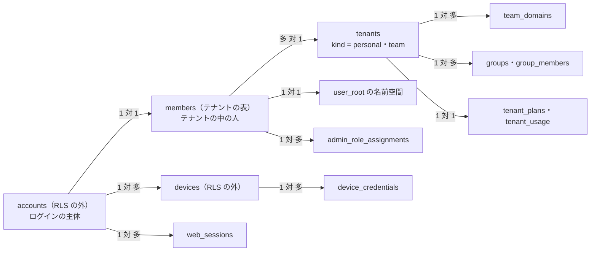
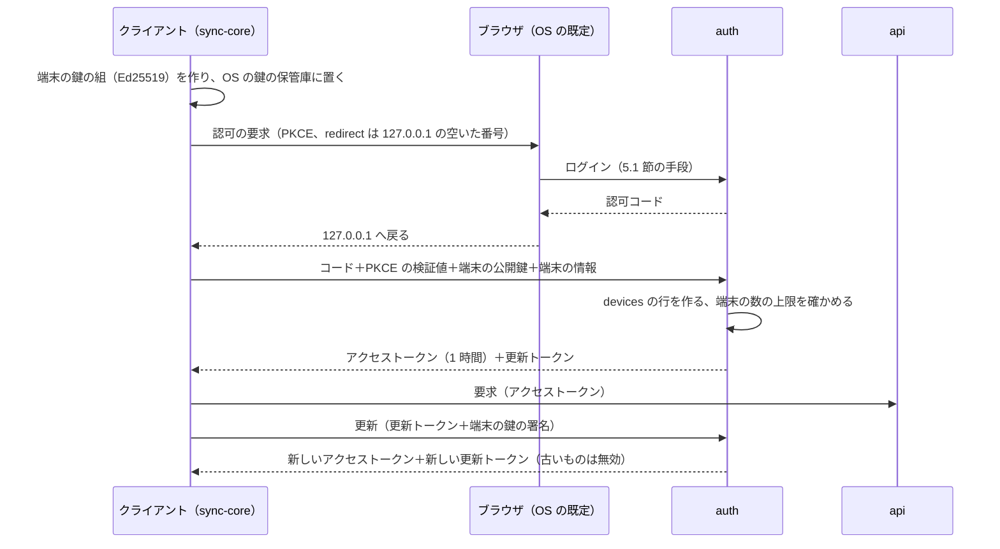
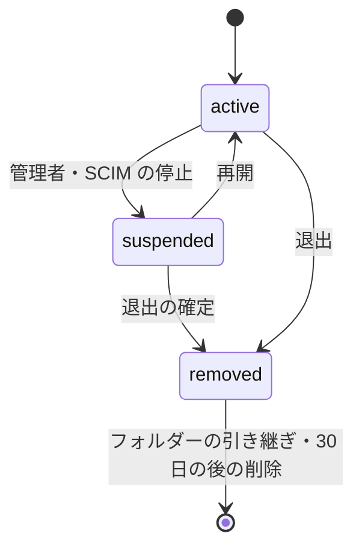
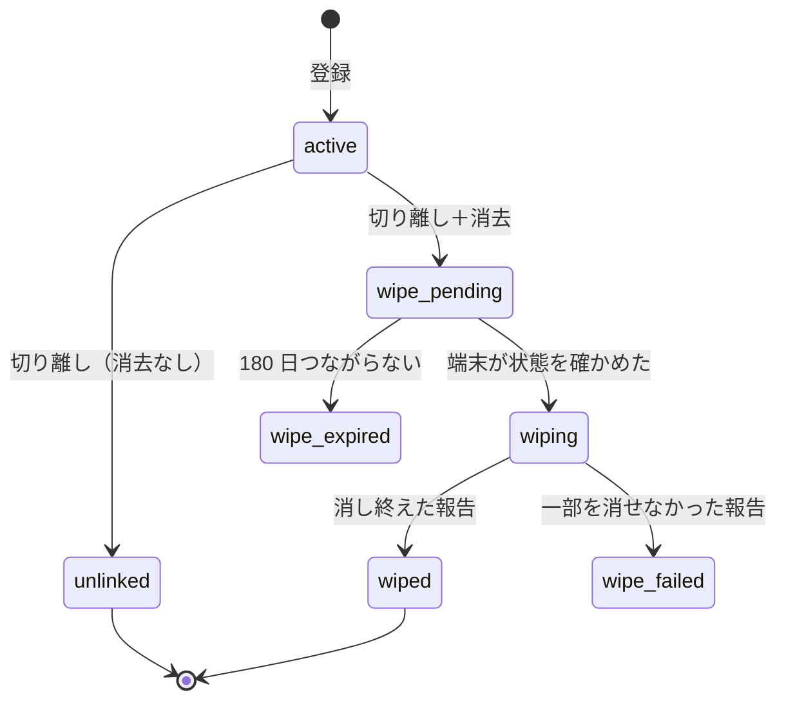

# Accounts and Teams: Dropbox

個人のアカウント、ログインとセッション、端末の登録と端末の一覧、遠隔の切り離しと消去、プランと容量、チーム、チームのドメインの確認、SSO（SAML・OIDC）、SCIM、管理の役割、管理者によるメンバーのフォルダーへのアクセスの枠（法務の L7）を決める。

前提となる決定は、基盤（[ADR-0001](../decisions/0001-platform-and-stack.md)）、重複排除と容量の数え方（[ADR-0003](../decisions/0003-dedupe-scope-and-privacy.md)）、テナントと名前空間と `can()`（[ADR-0004](../decisions/0004-tenancy-namespaces-and-rls.md)）、ジャーナル（[ADR-0005](../decisions/0005-namespace-journal-and-cursors.md)）、同期の衝突（[ADR-0006](../decisions/0006-sync-conflict-model.md)）。認証の部品の選び方は、他の題材（Google Calendar の [ADR-0035](../../../google-calendar/docs/decisions/0035-accounts-auth-library-and-credentials.md)・[ADR-0036](../../../google-calendar/docs/decisions/0036-org-domains-sso-and-scim.md)）に揃える。この文書で決めたことは次の ADR にある。

| ADR | 決定 |
| --- | --- |
| [0041](../decisions/0041-accounts-auth-and-device-credentials.md) | 認証の部品に Better Auth を使い、`packages/auth` で包む。ログインはパスキー、メールのコード、Google、Apple、チームの SSO で、パスワードを持たない。1 つのアカウントは 1 つのテナントに属する。Web はクッキーのセッション、デスクトップとモバイルは OAuth 2.0 の認可コード＋PKCE で端末を登録し、端末の鍵に結んだ回転する更新トークンを持つ。停止と切り離しは 60 秒以内に効かせる。危ない操作は 10 分以内の再認証を求める |
| [0042](../decisions/0042-teams-sso-scim-and-plans.md) | チームのドメインは DNS の TXT で確かめる。SSO は SAML 2.0 か OIDC の IdP を 1 つ持ち、必須にでき、そのとき `team_admin` だけはパスキーで入れる。SCIM 2.0 で利用者とグループを受け、停止を 60 秒以内に効かせる。チームへの参加は個人のアカウントと別のアカウントにする。プランの機能と容量の上限を `plan_features` の 1 つの表で持ち、容量の超過とプランの変更で中身を消さない（容量の数え方は ADR-0026） |
| [0043](../decisions/0043-admin-roles-device-wipe-and-member-access.md) | 管理の役割を 7 つにする。端末の切り離しと消去は状態の機械で持ち、消去は切り離しの時にだけ選べ、端末が次につながったときに行う。管理者によるメンバーのフォルダーへのアクセスは、法務の L7 の結論まで `release.admin-member-access` の裏に置き、期限つきの許可・`can()` の入力・監査ログの仕組みだけを作る |

## 1. 目的と範囲

- 扱う：
  - アカウント、テナント、メンバーの行の関係
  - ログインの手段、Web のセッション、端末の資格情報、取り消し、再認証
  - 端末の登録、端末の一覧、遠隔の切り離しと消去
  - プランと容量、容量を超えたときの振る舞い
  - チーム、招待、メンバー、グループ
  - チームのドメインの確認、SSO、SSO の必須化、SCIM
  - 管理の役割と管理の画面
  - メンバーの退出・停止・削除と、メンバーのフォルダーの引き継ぎ
  - 管理者によるメンバーのフォルダーへのアクセスの枠（法務の L7）
- 扱わない：
  - 名前空間の役割、共有フォルダー、チームのフォルダー、チームの外への共有の方針の決定表（[namespaces-and-sharing.md](namespaces-and-sharing.md)）
  - OAuth 2.0 の公開のアプリとスコープ（[api-and-webhooks.md](api-and-webhooks.md)。トークンの形はこの文書の 5.3 節と揃える）
  - 監査ログの表と保持、データのライフサイクル、脅威モデル（[security.md](security.md)）
  - デスクトップのクライアントの画面と、手元の同期のフォルダーの扱い（[desktop-client.md](desktop-client.md)）

## 2. 要件

| 要件 | 目標 | NFR・基準 |
| --- | --- | --- |
| テナントと権限の分離 | 停止・切り離しの後のアカウントと端末に、名前・中身・有無を返さない | NFR-007、[ADR-0004](../decisions/0004-tenancy-namespaces-and-rls.md) |
| 停止の速さ | 利用者の停止・端末の切り離しから、その主体のすべてのセッション・端末のトークン・OAuth のトークンが効かなくなるまで 60 秒以内 | 本システムの基準（K7 の前提） |
| ログイン | ログインの手続き p95 1 秒（IdP・メールの往復を除く） | NFR-001 に準じる |
| 可用性 | ログインと端末のトークンの更新 月間 99.9% | NFR-006 |
| 端末の消去 | 消去を指示した端末が次につながってから、同期のフォルダーの中身を消し終えるまで p95 10 分（100 万ファイル） | NFR-008 の端末と同じ規模 |
| 容量 | 容量の超過の判定の遅れ 60 秒以内。超過で中身を消さない | [ADR-0003](../decisions/0003-dedupe-scope-and-privacy.md)、[intent.md](../intent.md) の「失わない」 |
| 管理者のアクセス | 法務の L7 の結論まで、管理者がメンバーのフォルダーの中身を見る機能を出さない | [intent.md](../intent.md) の L7 |

## 3. 本家の形（確かめたこと）

いずれも 2026-10-09 に確認。

| 項目 | 内容 | 出典 |
| --- | --- | --- |
| 遠隔の消去（個人） | 有料のプランで使える。端末を切り離すときに「次にその端末がオンラインになったら Dropbox のファイルを消す」を選ぶ。切り離しは直ちに効き、消去は端末がオンラインでアプリが動いたときに行う。消去は安全な消去（上書き）ではない。既に切り離した端末には後から消去を足せない。状態は Pending・In progress・Succeeded・Failed で、失敗したら消せなかったファイルの報告を出す | [How to remote wipe files from a computer](https://help.dropbox.com/delete-restore/delete-dropbox-device) |
| 遠隔の消去（チーム） | チームの管理者は管理の画面のメンバーから、メンバーの端末を消去できる。メンバーが結んだ個人のアカウントのファイルは消さない | [How to remote wipe files from a team member's device](https://help.dropbox.com/delete-restore/remote-wipe) |
| モバイルの切り離し | 電話とタブレットは、遠隔のログアウトが消去と同じ効果を持つとする | 同上 |
| 管理の役割 | 8 つの役割（チームの管理者、利用者の管理、サポート、請求、内容、コンプライアンス、レポート、セキュリティ）。上位のプランだけ役割を分けられる。チームに管理者を 2 人以上置くことを勧め、チームの管理者を 1 人以上残す | [Change admin rights for your Dropbox team](https://help.dropbox.com/security/change-admin-rights) |
| 管理者によるメンバーのファイル | 管理者は「メンバーとしてログイン」で、メンバーのフォルダーの構造を見て、開き、ダウンロードし、削除・復元できる。結んだ個人のアカウントには入れない。メンバーへのメールの通知は管理者が選ぶ。メンバーは止められない | [Dropbox for teams: Can admins see my account?](https://help.dropbox.com/account-access/admin-control) |
| 容量の超過 | 容量を超えると、デスクトップのアプリは同期を止める | [Dropbox stopped syncing](https://help.dropbox.com/sync/files-not-syncing) |

- 本家のログインの手段（パスキー、メールのコード）、SSO と SCIM の設定の細部、プランごとの容量と端末の数の上限、個人とチームのアカウントを 1 つのデスクトップのアプリに結ぶ形は、公式の資料で確かめていない（**未検証**）。
- 管理者のアクセスの形（本家は「メンバーとしてログイン」）は、本システムは法務の L7 の後に決める（11 節）。本家と違う形を採るときは、[architecture/README.md](README.md) の 1.4 節の「本家との意図した違い」に行を足す。

## 4. モデル

| 表 | 置き場所 | 中身 |
| --- | --- | --- |
| `accounts` | RLS の外（[ADR-0004](../decisions/0004-tenancy-namespaces-and-rls.md) の一覧） | 主のメールアドレス（正規化）、表示の名前、ロケール、状態（`active`・`suspended`・`deleted`）、テナント、作成の時刻。Better Auth の表（セッション、パスキー、外部のアカウント、検証の値）を同じスキーマ `auth` に置く |
| `tenants` | RLS の外 | `kind`（`personal`・`team`）、名前、プラン、状態（`active`・`suspended`・`purging`）、データの地域（S1 は `jp` だけ） |
| `members` | テナントの表 | `(tenant_id, member_id)`、`account_id`、表示の名前、状態、ルートの名前空間、SCIM の外部の ID、参加の時刻 |
| `groups`・`group_members` | テナントの表 | チームのグループ、メンバー。SCIM の外部の ID |
| `devices` | RLS の外 | 端末（13 節） |
| `tenant_plans` | テナントの表 | プラン、席の数、容量の上限（7 節）。使用量 `tenant_usage` は [namespaces-and-sharing.md](namespaces-and-sharing.md) の 8 節 |

- **1 つのアカウントは 1 つのテナントに属する**（ADR-0041）。個人のアカウントは 1 人 1 つの `personal` のテナント、チームのメンバーは `team` のテナントに属する（[ADR-0004](../decisions/0004-tenancy-namespaces-and-rls.md)）。同じ人がチームに入るときは、仕事のメールアドレスで別のアカウントを持つ（9 節）。
- 個人のテナント、メンバーの行、ルートの名前空間は、アカウントの作成と同じトランザクションで作る。ルートの名前空間の作成は `packages/committer` を通す（[ADR-0005](../decisions/0005-namespace-journal-and-cursors.md)）。
- メールアドレスからアカウントを引く表（`account_emails`）は RLS の外に置き、`auth` と招待と共有の招待のロールだけが読む。

## 5. ログインとセッション

ADR-0041。

### 5.1 ログインの手段

| 手段 | 部品 | 注記 |
| --- | --- | --- |
| パスキー | Better Auth のパスキー（WebAuthn） | 1 アカウント 10 まで。推す手段にする |
| メールのコード | Better Auth の Email OTP | 6 桁、10 分、1 回限り |
| Google | Better Auth の OIDC の提供者 | `email_verified` が真のときだけ既存のアカウントに結ぶ |
| Apple | Better Auth の Apple の提供者 | iOS のアプリで他社のログインを出すなら、同等のログインを出す必要がある（App Store の審査の指針 4.8） |
| チームの SSO | Better Auth の SSO（10.2 節） | 確認したドメインのメールアドレス |
| パスワード | 持たない | 他の題材と同じ |

- **入口**：`https://auth.<brand>.<domain>`。メールアドレスを入れると、`team_domains` で SSO のチームか、個人かを決め、手段を示す。
- **Apple のメールの中継**：Apple の「メールを非公開」の中継のアドレスは、そのまま主のメールアドレスにする。チームのドメインの判定には使えない（中継のドメインになる）。
- **ログインの失敗の上限**：メールのコードは 1 アカウント 10 分で 5 回、送り直しは 1 時間で 5 回。IP ごとに 10 分で 100 回。WAF の IP ごとの上限は [infrastructure.md](infrastructure.md) の 2.2 節。
- **新しい端末・新しい場所のログイン**は、本人にメールで知らせる（13 節の端末の一覧へのリンクを付ける）。

### 5.2 Web のセッション

- HttpOnly・`Secure`・`SameSite=Lax` のクッキー。`www.<brand>.<domain>` と `api.<brand>.<domain>` で共有するため、親のドメインに付ける。`<brand>usercontent.<domain>` には付かない（[security.md](security.md) の 4 節）。
- 使わないまま 30 日で切れ、使うたびに延びる。チームは最長の長さを 1〜30 日で絞れる。
- 利用者は設定でセッションと端末の一覧を見て、取り消せる（13 節）。

### 5.3 端末の資格情報

デスクトップとモバイルは、Web のクッキーではなく、端末ごとの資格情報を持つ。

| 項目 | 値 |
| --- | --- |
| 登録の流れ | OAuth 2.0 の認可コード＋PKCE（S256）。デスクトップは 127.0.0.1 のループバックへ戻す（RFC 8252）。モバイルは OS の認証のシート（`ASWebAuthenticationSession`、Custom Tabs）と、アプリに結んだ `https` の戻り先 |
| アクセストークン | `<brand>_at_` で始まる不透明な文字列（形は [ADR-0039](../decisions/0039-oauth-apps-scopes-and-rate-limits.md) と同じ）。1 時間。SHA-256 だけを保存する |
| 更新トークン | `<brand>_rt_` で始まる不透明な文字列。使うたびに入れ替え、古いものの再使用を見つけたら、その端末の資格情報をすべて取り消す |
| 端末の鍵 | 登録で作る Ed25519 の鍵の組。秘密鍵は macOS のキーチェーン、Windows の資格情報マネージャー（DPAPI）、iOS のキーチェーン、Android Keystore に置く。更新の要求と、切り離した後の状態の確かめ（13.2 節）に署名する |
| 使わないときの期限 | 更新トークンは 90 日使わなければ切れる（カーソルの 90 日と揃える。[ADR-0005](../decisions/0005-namespace-journal-and-cursors.md)） |
| チームの方針 | 端末の最長の期間を 1〜180 日で決められる。過ぎたら SSO で入り直すまで同期を止める（手元のファイルは残す） |
| 端末の数 | 無料のプランは 3 台（デスクトップとモバイルの和）。有料は上限なし（7.1 節） |

- トークンの接頭辞は、他の既知のサービスの接頭辞と重ならないことを確かめ、シークレットスキャンに独自の形式として登録する（[リポジトリ共通の ADR-0006](../../../../docs/decisions/0006-brand-neutral-identifiers.md)）。
- 公開 API の OAuth のアプリのトークンも同じ接頭辞・形（接頭辞＋32 文字の base62＋CRC32）・保存のしかたにする。期限はアプリのトークンの 4 時間（[ADR-0039](../decisions/0039-oauth-apps-scopes-and-rate-limits.md)）と、端末のトークンの 1 時間で分ける。

### 5.4 取り消しと停止

- 取り消し（ログアウト、端末の切り離し、アカウントの停止、SCIM の停止、チームの方針の変更）は、`accounts` の `auth_epoch` を上げるか、`devices`・`web_sessions` の行を無効にし、Valkey の取り消しの一覧に 30 日置く。
- API・Notify・Link・Auth は、トークンの検証の結果を最大 30 秒だけ手元に持つ。取り消しの合図を Valkey の pub/sub で受けたら、その場で捨てる。Valkey が落ちていれば、DB を引く（遅くなるが、取り消しは効く）。
- Notify は取り消しの合図を受けたら、その端末の WebSocket を 5 秒以内に切り、切る前に `device_revoked` を送る。
- これで「停止から 60 秒以内」（2 節）を満たす。最悪の場合は、手元の結果の 30 秒と、合図の欠けでの DB の確かめの間隔（30 秒）の和。

### 5.5 危ない操作の再認証

アカウントを乗っ取られたときの被害（一括の削除、端末の切り離し、資格情報の追加）を抑えるため、次の操作は 10 分以内にログインの手段で認証し直したこと（`recent_auth`）を求める（[security.md](security.md) の 3.3 節）。

| 区分 | 操作 |
| --- | --- |
| 資格情報 | メールアドレスの変更、パスキー・外部のアカウントの追加と削除、他の端末の切り離しと消去 |
| 中身 | 1 回で 1,000 を超えるノードの削除（Web・API）、保持の期間の前の完全な削除、アカウント全体の巻き戻し、全体の書き出し |
| 連携 | 全体を読み書きできるスコープの OAuth のアプリの許可、Webhook の作成 |
| チーム | SSO・SCIM の設定、管理の役割の変更、チームの外への共有の方針を緩める変更、監査ログの書き出し |

- デスクトップの同期の一括の削除は、別に「消しすぎの止め」で利用者に確かめる（[ADR-0006](../decisions/0006-sync-conflict-model.md)）。
- SSO のチームは、再認証を IdP で行う（SAML の `ForceAuthn`、OIDC の `max_age=0`）。

## 6. 個人のアカウントの作成と削除

- **作成**：5.1 節の手段で入ったメールアドレスに、アカウントがなければ作る。メールのコードか、`email_verified` の外部のアカウントで、メールアドレスを確かめる。チームの確認したドメインのメールアドレスなら、そのチームの招待か SSO へ案内する（10.1 節）。
- **削除**：本人が設定から依頼する（`recent_auth`）。7 日の猶予の間は `suspended` で取り消せる。猶予の後の消し方は [security.md](security.md) の 8 節（法務の L6）。
- 本人が持ち主の共有フォルダーは、削除の前に持ち主を移すよう促す。移さなければ、他のメンバーから外す（`unmount`。[ADR-0005](../decisions/0005-namespace-journal-and-cursors.md)）。

## 7. プランと容量

ADR-0042。

### 7.1 プラン

値は本システムの想定で、価格と合わせて PM が決める。バージョンの保持の期間は [architecture/README.md](README.md) の 6 節の決定。

| プラン | テナント | 容量 | 端末 | バージョンの保持 | 主な違い |
| --- | --- | --- | --- | --- | --- |
| `free` | 個人 | 5 GiB | 3 台 | 30 日 | 共有リンクのパスワード・期限なし、遠隔の消去なし |
| `personal_plus` | 個人 | 2 TiB | 上限なし | 30 日 | 遠隔の消去、リンクのパスワード・期限 |
| `personal_pro` | 個人 | 3 TiB | 上限なし | 180 日 | 上に加えてダウンロードの禁止のリンク |
| `team_standard` | チーム | チーム全体で 5 TiB | 上限なし | 180 日 | SSO、SCIM、管理の役割は `team_admin` だけ |
| `team_advanced` | チーム | 席ごとに 5 TiB をチームで合算 | 上限なし | 365 日 | 管理の役割を分ける、本文の検索、監査ログの書き出し |

- プランの機能の可否は、`can()` と各領域が読む `plan_features`（プラン → 機能 → 値）の 1 つの表にする。画面ごとにプランの名前を比べない。
- 本家のプランごとの容量・端末の数・機能の可否は確かめていない（**未検証**）。

### 7.2 容量の数え方

容量の数え方と判定の仕組みは [namespaces-and-sharing.md](namespaces-and-sharing.md) の 8 節（[ADR-0026](../decisions/0026-membership-lifecycle-and-quota.md)）で決めた。要点だけを書く。

- **論理の大きさで数える**（[ADR-0003](../decisions/0003-dedupe-scope-and-privacy.md)）。名前空間の持ち主のテナントに、削除していないファイルの今のリビジョンの大きさの和で数え、メンバーには数えない。バージョン履歴と削除したファイルは数えない。
- `packages/committer` が commit ごとに名前空間の `logical_bytes` を同じトランザクションで増減し、`quota` の Worker が 1 分ごとに `tenant_usage` を出す。commit は大きさを増やす操作のとき「`tenant_usage` ＋増分 ≤ 上限＋余裕（min(1 GiB, 上限の 1%)）」を確かめ、超えれば 507 `owner_quota_exceeded`。
- この文書が足すのは、上限の値（7.1 節の `plan_features`）と、超えたときの端末と画面の振る舞い（7.3 節）である。

### 7.3 容量を超えたとき

- 増える commit（作成、大きくなる変更、名前空間をまたぐコピー）を拒む。削除、移動、名前の変更、小さくなる変更、読み出し、共有、共有リンクは続ける。
- デスクトップのクライアントは「容量の超過」を表示し、上げられない変更を手元に残したまま、受ける側の同期は続ける（[desktop-client.md](desktop-client.md)）。手元の変更を消さない。
- **容量の超過やプランの変更（下げる）で、中身を消さない。** 長く使われない無料のアカウントの扱いは法務の L9（利用規約）で決める。

## 8. チーム

ADR-0042。

### 8.1 チームの作成

1. 個人のアカウントの利用者が「チームを作る」を選び、チームの名前と仕事のメールアドレスを入れる。
2. 新しい `team` のテナントと、作った人の新しいアカウント（仕事のメールアドレス）を作り、`team_admin` にする（9 節。個人のアカウントとは別）。
3. チームのスペース（`team_space` の名前空間）と、メンバーのルートの名前空間を作る（[ADR-0004](../decisions/0004-tenancy-namespaces-and-rls.md)）。
4. ドメインの確認を始める（10.1 節）。確認が済むまで、招待したメールアドレスの人だけをメンバーにできる。

### 8.2 招待と参加

- 招待はメールで送り、招待のトークン（`<brand>_inv_`、7 日、1 回限り、SHA-256 だけを保存）を付ける。SCIM で作った利用者には招待を送らず、SSO で最初に入ったときに有効にする。
- 招待を受けた人は、招待のメールアドレスでアカウントを作る（既に別のテナントのアカウントがあっても、別のアカウントにする）。
- 席の数を超える招待は拒む。

### 8.3 グループ

- グループは名前空間の役割の主体になる（[ADR-0004](../decisions/0004-tenancy-namespaces-and-rls.md)）。入れ子は持たない（`can()` の判定を単純に保つ）。
- グループのメンバーの変更は、`ns_access` の写しを作り直し、キャッシュを消す。載せる・外すは [namespaces-and-sharing.md](namespaces-and-sharing.md) の手順で、ジャーナルに載る。

## 9. 個人のアカウントからチームへ

ADR-0042。

- **個人のアカウントをチームのテナントに移さない。** チームへの参加は、仕事のメールアドレスで別のアカウントを持つこと。本家と同じく、1 つのデスクトップのアプリに個人とチームの 2 つのアカウントを結ぶ形が便利だが、MVP のデスクトップのクライアントは 1 つのアカウントだけを結ぶ（14 節の持ち越し）。
- **移す手伝い**：個人のアカウントのファイルをチームへ移したい人には、個人のアカウントからチームのアカウントへフォルダーを共有し、チームのアカウントの側で「自分のフォルダーへコピー」する流れを示す。読める共有フォルダーからのコピーなので、ブロックは送り直さず、S3 の中で写す（[ADR-0003](../decisions/0003-dedupe-scope-and-privacy.md) の表の 2 行目、[ADR-0004](../decisions/0004-tenancy-namespaces-and-rls.md) の X1）。テナントをまたぐ新しい経路を足さない。
- 確認したドメインのメールアドレスを持つ既存の個人のアカウントには、チームへの招待を案内するだけにする。個人のアカウントを強制的にチームへ取り込まない。

## 10. ドメイン、SSO、SCIM

ADR-0042。

### 10.1 ドメインの確認

- チームの管理者がドメインを足すと、確認のトークンを出す。DNS の TXT `<brand>-domain-verification=<token>` を `_<brand>-challenge.<ドメイン>` に置く。
- `auth` が確かめ、確かめたら `verified`。毎日確かめ直し、7 日続けて見つからなければ `lapsed` にして、SSO の必須化を止めずに管理者へ知らせる（SSO の設定は残す）。
- 同じドメインを 2 つのチームが確かめることはできない。先に確かめたチームが持つ。

### 10.2 SSO

| 項目 | 決定 |
| --- | --- |
| 方式 | SAML 2.0（SP 起点だけ、署名した主張を必須、`NameID` は永続の形）か OIDC（認可コード＋PKCE、`id_token` の署名を確かめる）。チームに IdP を 1 つ |
| 結び付け | IdP の主体の ID（SAML の `NameID`、OIDC の `sub`）とチームの組で、メンバーを結ぶ。メールアドレスの一致だけで結ばない |
| JIT | 確認したドメインのメールアドレスで、席に空きがあり、チームが JIT を許すときだけ、最初のログインでメンバーを作る |
| 必須化 | チームは SSO を必須にできる。必須なら、パスキー・メールのコード・Google・Apple では入れない。ただし `team_admin` は、IdP が落ちたときのために登録したパスキーで入れる（break-glass。監査ログに残す） |
| IdP のメタデータ | 登録の時に取り、24 時間ごとに取り直す。証明書の期限の 30 日前に管理者へ知らせる |
| 再認証 | 5.5 節の操作は IdP で認証し直す |

- 取得は egress の経路の外向きの許可リスト（チームが登録した IdP のホスト名を自動で足す）を通す（[infrastructure.md](infrastructure.md) の 2.3 節）。

### 10.3 SCIM

- SCIM 2.0（RFC 7643・7644）の `Users` と `Groups`。入口は `https://auth.<brand>.<domain>/scim/v2/`。Bearer のトークン（`<brand>_scim_`、チームごと、SHA-256 だけを保存、作り直せる）。
- `active=false`（停止）は、メンバーを `suspended` にし、5.4 節の取り消しを行う。チームの方針 `on_deprovision`（`unlink`・`unlink_and_wipe`。既定は `unlink`）で、端末を切り離すか、消去も指示する。
- `DELETE` は、停止と同じに扱い、12 節の退出の手順を始める。データはすぐに消さない。
- 要求は冪等にする（外部の ID で引く）。1 チーム 1 秒 20 要求まで。超えれば 429。

## 11. 管理の役割と管理者のアクセス

ADR-0043。

### 11.1 役割

| 役割 | できること |
| --- | --- |
| `team_admin` | すべて。管理の役割の付与と外し、SSO・SCIM、請求、チームの削除 |
| `user_admin` | メンバーの招待・停止・退出、グループ、メンバーのフォルダーの引き継ぎ、端末の切り離しと消去 |
| `content_admin` | チームのフォルダーの作成・削除・メンバー、共有の持ち主の付け替え、チームのフォルダーの復元と巻き戻し |
| `security_admin` | チームの外への共有の方針、共有リンクの方針、端末の方針、セッションの長さ、一斉の変更の検知の知らせの受け取り |
| `support_admin` | メンバーのサインインの問題の手助け（端末の切り離し、セッションの取り消し）。中身には触れない |
| `billing_admin` | 請求と席の数 |
| `auditor` | 監査ログの閲覧と書き出し、利用の報告。変更はできない |

- `team_standard` は `team_admin` だけを使える。`team_advanced` で役割を分けられる（本家の分け方に寄せた。3 節）。
- チームに `team_admin` を必ず 1 人以上残す。最後の `team_admin` は外せない。2 人以上を勧める。
- 役割の判定は `can()` の入力にする（[ADR-0004](../decisions/0004-tenancy-namespaces-and-rls.md)）。管理の API で役割の名前を比べない。
- 委任の範囲（グループの単位）は MVP では持たない。どの役割もチームの全体に効く。

### 11.2 管理者によるメンバーのフォルダーへのアクセス（法務の L7 の枠）

管理者がメンバーのルートの名前空間の中身を見る・変える機能は、法務の L7（労働者のプライバシー、社内の規程での周知）の結論まで出さない。仕組みだけを作り、`release.admin-member-access` の裏に置く。

- **形**：メンバーとしてログインする（本家の形。3 節）のではなく、期限つきの**アクセスの許可**を作る。許可は `admin_member_access_grants(grant_id, tenant_id, admin_member_id, target_member_id, scope, reason, created_at, expires_at)`。`scope` は `read` か `read_write`。期限は最長 24 時間。
- 許可は `can()` の入力になる。管理者は自分の画面から、対象のメンバーのルートの名前空間を読める（`read_write` なら書ける）。書き込みは `actor_id` が管理者、`on_behalf_of` が対象のメンバーとして、ジャーナルと監査ログに載る。
- 許可の作成、許可の下での読み出し（ノードの ID と数）、書き込みを、監査ログに残す（[security.md](security.md) の 7 節）。
- 対象のメンバーへの知らせ（必須にするか）、理由の選択肢、`read_write` を出すか、個人のテナントの共有フォルダーが対象のルートに載っているときの扱い（他のテナントの中身が見えてしまう）は、L7 の結論で決める。既定は「他のテナントの名前空間は許可の範囲に含めない」。
- 本家の形（メンバーとしてログイン）と違う形を採るなら、L7 の後に [architecture/README.md](README.md) の 1.4 節に行を足す。

## 12. メンバーの退出・停止・削除

- **停止**：5.4 節の取り消し。端末は切り離し、方針により消去も指示する（13 節）。ルートの名前空間はそのまま残す。共有フォルダーの役割は残し、`can()` が停止の主体を拒む。
- **退出**：管理者が引き継ぎ先のメンバーを選ぶ。退出したメンバーのルートの名前空間を、引き継ぎ先のメンバーのルートに `<名前> のファイル` のフォルダーとして載せ、持ち主を引き継ぎ先にする（`ns_access` の行と `mount` の書き込みだけ。中身を写さない）。退出したメンバーが持ち主の共有フォルダーは、引き継ぎ先を `editor` として足してから、同じテナントの中の `transfer_owner` で持ち主を移す（[ADR-0026](../decisions/0026-membership-lifecycle-and-quota.md)）。
- 引き継ぎ先を 30 日選ばなければ、ルートの名前空間は `team_admin` の「退出したメンバーのファイル」に載る。消すのは管理者の明示の操作だけ（[security.md](security.md) の 8 節の流れ）。
- 退出したメンバーの監査ログは、チームのテナントに残る（保持は法務の L3・L6）。

## 13. 端末の一覧と、遠隔の切り離し・消去

ADR-0043。

### 13.1 端末の一覧

- 利用者は自分の端末を、チームの `user_admin`・`support_admin`・`security_admin` はメンバーの端末を見る。
- 項目：端末の名前、種類（`desktop`・`mobile`）、OS とそのバージョン、クライアントのバージョン、登録の時刻、最後の接続の時刻、最後の接続の IP アドレス（本人と管理者だけに見せる。保持は法務の L3）、状態。
- Web のセッションは別の一覧（ブラウザ、最後の利用）。

### 13.2 切り離しと消去の流れ

1. 本人（`recent_auth`）か管理者が、端末を切り離す。消去は**切り離しの時にだけ**選べる（本家と同じ。3 節）。消去は有料のプランとチームだけ。
2. 切り離しは直ちに効く：その端末の資格情報を取り消し（5.4 節）、Notify は接続を切る。端末は同期を止める。
3. 消去を選んだら `wipe_pending`。端末は、資格情報が効かなくなったら、端末の鍵で署名した要求で `POST /device/status` を呼ぶ（30 秒・1 分・5 分・以後 15 分ごと）。サーバーは、署名を `devices` の公開鍵で確かめ、`wipe` を返す。消去なしなら `unlinked` を返し、端末はログインの画面を出す。
4. 端末は `wiping` を報告し、次を消す：同期のフォルダーの中のファイルとフォルダー（プレースホルダーを含む）、ローカルの状態の DB、ローカルのブロックの索引とキャッシュ、端末の資格情報、ログ。**OS のゴミ箱へ移さずに消す**（[ADR-0006](../decisions/0006-sync-conflict-model.md) の「OS のゴミ箱へ移す」の例外。消去は利用者・管理者が明示した操作である）。
5. まだサーバーに上げていない手元だけの変更も消す。管理の画面で、消去を選ぶときにそのことを示す。
6. 消し終えたら、消した数と、消せなかったノードの ID の一覧（手元だけのものは数だけ）を報告し、`wiped` か `wipe_failed`。

- 消去は安全な消去（ディスクの上書き）ではない（本家と同じ。3 節）。
- モバイル：切り離しで、アプリは次の起動か接続で、オフラインの保存のファイル、キャッシュ、カメラのアップロードの待ちの一覧、資格情報を消す。写真のライブラリの写真は消さない。オフラインのファイルは、端末の鍵の保管庫に置いた鍵で暗号化して持ち、鍵を消せば読めなくなる（[mobile-and-camera-upload.md](mobile-and-camera-upload.md)）。
- **端末の鍵が盗まれた場合**：攻撃者は `POST /device/status` に答えさせても、`wipe` か `unlinked` を知るだけで、中身は得ない。

## 14. 障害のときの振る舞い

| 障害 | 振る舞い |
| --- | --- |
| IdP が落ちた | SSO のログインはできない。既存の Web のセッションと端末のトークンは期限まで使える。`team_admin` は break-glass のパスキーで入れる |
| メールの送信が落ちた | メールのコードで入れない。パスキー・Google・Apple・SSO は使える。招待は送り直しの待ちに入る |
| Valkey が落ちた | 取り消しの確かめを DB で行う（遅くなる）。レート制限はメモリーの近似 |
| `auth` が落ちた | 新しいログインと更新ができない。アクセストークンの 1 時間の間は同期が続く。クライアントは更新を指数の間隔で試す |
| `quota` の Worker が止まった | `tenant_usage` が古くなり、判定が緩む。古さが 10 分を超えたらチケットにする（判定の仕組みは [namespaces-and-sharing.md](namespaces-and-sharing.md) の 8 節） |
| 端末がずっとつながらない | 消去は `wipe_pending` のまま。180 日で `wipe_expired` にして管理者に知らせる |

## 15. テスト

| 種類 | 内容 |
| --- | --- |
| 性質ベース | 任意の停止・切り離し・方針の変更・役割の変更の列で、停止した主体と切り離した端末の要求が、60 秒（模型の時計）を過ぎた後に、どの経路（API、同期、Notify、Link、SCIM）でも通らない |
| 性質ベース | 更新トークンの任意の使い方の列で、再使用を見つけたら、その端末のすべての資格情報が無効になる。正しい使い方の列では切れない |
| 性質ベース | 容量の数え方は PROP-NS-004（[namespaces-and-sharing.md](namespaces-and-sharing.md)）。この文書では、プランの変更（下げる）と容量の超過の後に、どの経路でも中身が消えないことを確かめる |
| 決定表 | 5.5 節の再認証の要否、11.1 節の役割と操作（`can()` の決定表に入れる）、7.1 節のプランと機能 |
| 状態の機械 | 13.2 節の端末の状態の移り。消去は切り離しの時にしか選べない。`wiped` の後に `active` に戻らない |
| 結合 | SAML（署名なしの主張、署名の範囲の外の主張、期限切れ、別の受け手の主張を拒む）、OIDC（`nonce`、`aud`）、SCIM の冪等、ドメインの確認と `lapsed` |
| ファイルシステムの端の場合（実機） | 消去で、同期のフォルダーの中のファイルとプレースホルダーが消え、同期のフォルダーの外を消さない。消せないファイル（開いたまま、読み取り専用）で `wipe_failed` になり、報告に出る（[quality.md](../quality.md) の 2.2.1 節 B に場面を足す） |
| E2E | ログイン（各手段）、チームの作成と招待、SSO の必須化と break-glass、端末の切り離し |

- テスト名に要件 ID（`REQ-ACCT-*`、`PROP-ACCT-*`）を含める。

## 16. Story の候補

| Epic | Story | 中身 |
| --- | --- | --- |
| E12 | `personal-accounts-and-plans` | 5.1・5.2 節、6 節、7 節（`plan_features`、超過の振る舞い。容量の集計は E6 の `quota-accounting`） |
| E5 | `device-registration` | 5.3 節の登録の流れ、端末の鍵、更新トークンの回転、端末の数の上限 |
| E12 | `session-revocation` | 5.4 節の取り消しの伝わり方と、Notify の切断 |
| E12 | `step-up-auth` | 5.5 節の `recent_auth` と、対象の操作の決定表 |
| E12 | `teams-and-members` | 8 節、9 節、12 節（退出とフォルダーの引き継ぎ） |
| E12 | `sso-saml-oidc` | 10.1・10.2 節 |
| E12 | `scim-provisioning` | 10.3 節 |
| E12 | `admin-roles` | 11.1 節、端末の一覧（13.1 節） |
| E12 | `remote-unlink-and-wipe` | 13.2 節（デスクトップとモバイル。desktop-client・mobile-and-camera-upload と共同） |
| E12 | `admin-member-access` | 11.2 節の枠（`release.admin-member-access`）。法務：L7 |

## 17. 未解決の問い

### 決定

2026-10-09 の既定案。E5・E12 で覆りうる。

- **認証の部品**：Better Auth を `packages/auth` で包む。パスワードを持たない（ADR-0041）。
- **1 アカウント 1 テナント**：チームへの参加は別のアカウント。移す手伝いは共有とコピーで行う（ADR-0042）。
- **端末の資格情報**：認可コード＋PKCE、端末の鍵に結んだ回転する更新トークン（ADR-0041）。
- **容量**：数え方は ADR-0026。この文書はプランの上限と超過の振る舞いを決める（ADR-0042）。
- **端末の消去**：切り離しの時にだけ選ぶ、端末の鍵で署名した状態の確かめ、ゴミ箱を通さない（ADR-0043）。
- **管理の役割**：7 つ。委任の範囲は持たない（ADR-0043）。

### 持ち越し

| 問い | いつ・どう決めるか |
| --- | --- |
| 管理者によるメンバーのフォルダーへのアクセスの形、知らせ、範囲 | **法務の確認待ち：L7** |
| 個人のアカウントのデータを、チームからの委託として扱うか（個人情報保護法） | **法務の確認待ち：L4** |
| 端末の一覧の IP アドレスの保持の期間 | **法務の確認待ち：L3** |
| 長く使われない無料のアカウントの扱い | **法務の確認待ち：L9** |
| 1 つのデスクトップのアプリに個人とチームの 2 つのアカウントを結ぶか | E5 の後。本家の形は**未検証**。結ぶなら、同期のルートを 2 つ持つ形を desktop-client の領域で決める |
| プランの容量・端末の数・機能の値 | PM（価格と合わせて） |
| 委任の範囲（グループの単位の管理者） | S2 の前に、チームの規模の分布を見て |

## 18. quality.md・runbooks・data-model への項目

### quality.md

- 2.2.1 節 F の漏れの経路の表に「停止した主体・切り離した端末」の主体を足す（どの経路にも 60 秒の後に何も返さない）。
- 2.2.1 節 B に、遠隔の消去の場面（同期のフォルダーの中だけを消す、消せないファイルの報告）を足す。
- E12 の合否基準に「停止から 60 秒以内の取り消しの性質が緑」「プランを下げた後・容量の超過の後に中身が消えない」を足す。

### runbooks

- `idp-outage.md`：IdP の障害のときの break-glass のパスキー、チームへの知らせ。
- `account-takeover.md`：乗っ取りの疑いのときの全セッションの取り消し、端末の切り離し、巻き戻しの案内（[security.md](security.md) の 3.3 節と共同）。

### data-model への項目

| 表・置き場所 | 中身 | 節 |
| --- | --- | --- |
| `auth` スキーマ（RLS の外）：`accounts`、`account_emails`、Better Auth の表 | アカウント、メールアドレス → アカウント、セッション、パスキー、外部のアカウント、検証の値。`auth_epoch` | 4、5 |
| `tenants`（RLS の外） | `kind`、プラン、状態、データの地域 | 4 |
| `members`（テナントの表） | `(tenant_id, member_id)`、`account_id`、状態、ルートの名前空間、SCIM の外部の ID | 4、12 |
| `groups`・`group_members`（テナントの表） | グループとメンバー、SCIM の外部の ID | 8.3 |
| `team_domains`（テナントの表） | ドメイン、確認のトークン、状態（`pending`・`verified`・`lapsed`）、最後に確かめた時刻 | 10.1 |
| `team_sso_configs`（テナントの表） | 方式、IdP のメタデータ、証明書、必須化、JIT | 10.2 |
| `scim_tokens`（テナントの表） | トークンのハッシュ、作成と最後の利用 | 10.3 |
| `team_invitations`（テナントの表） | メールアドレス、トークンのハッシュ、期限、状態 | 8.2 |
| `admin_role_assignments`（テナントの表） | メンバー → 役割 | 11.1 |
| `admin_member_access_grants`（テナントの表） | 11.2 節の許可 | 11.2 |
| `devices`（RLS の外） | `device_id`、`account_id`、種類、名前、OS、クライアントのバージョン、公開鍵、状態（13.2 節）、消去の指示者、最後の接続の時刻と IP アドレス | 13 |
| `device_credentials`（RLS の外） | アクセストークン・更新トークンのハッシュ、世代、期限、使用の時刻 | 5.3 |
| `device_wipe_reports`（RLS の外） | 消した数、消せなかったノードの ID、手元だけの失敗の数 | 13.2 |
| `web_sessions`（RLS の外） | Better Auth のセッションの表 | 5.2 |
| `plan_features` | プラン → 機能 → 値 | 7.1 |
| `tenant_plans`（テナントの表） | プラン、席の数、容量の上限。使用量は namespaces-and-sharing の `tenant_usage` | 7.1 |
| Valkey | 取り消しの一覧（30 日）、トークンの検証の結果のキャッシュ（30 秒）、ログインの失敗の数 | 5.4 |

## 出典

いずれも 2026-10-09 に確認。

- Dropbox Help Center, [How to remote wipe files from a computer](https://help.dropbox.com/delete-restore/delete-dropbox-device)
- Dropbox Help Center, [How to remote wipe files from a team member's device](https://help.dropbox.com/delete-restore/remote-wipe)
- Dropbox Help Center, [Change admin rights for your Dropbox team](https://help.dropbox.com/security/change-admin-rights)
- Dropbox Help Center, [Dropbox for teams: Can admins see my account?](https://help.dropbox.com/account-access/admin-control)
- Dropbox Help Center, [Dropbox stopped syncing](https://help.dropbox.com/sync/files-not-syncing)：容量を超えると同期を止める
- Apple, [App Store Review Guidelines](https://developer.apple.com/app-store/review/guidelines/) の 4.8 Login Services：他社のログインで主のアカウントを作る・認証するアプリは、名前とメールアドレスだけを集め、メールアドレスを隠せるログインも出す
- IETF, [RFC 8252: OAuth 2.0 for Native Apps](https://www.rfc-editor.org/rfc/rfc8252)、[RFC 7636: PKCE](https://www.rfc-editor.org/rfc/rfc7636)、[RFC 7643](https://www.rfc-editor.org/rfc/rfc7643)・[RFC 7644](https://www.rfc-editor.org/rfc/rfc7644)（SCIM 2.0）
