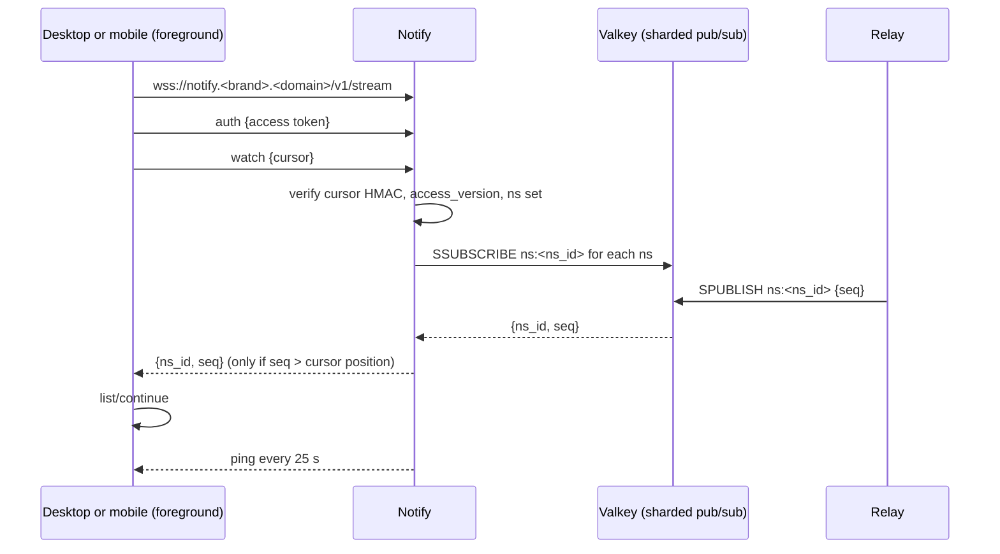
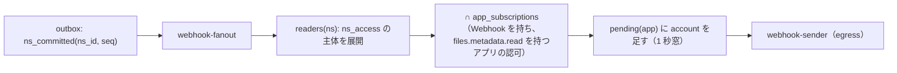
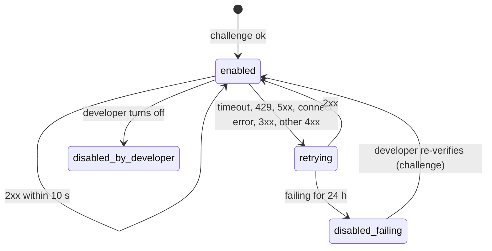

# API and webhooks: Dropbox

公開の REST API、OAuth 2.0 のアプリとスコープ、レート制限、カーソルと long-poll、自社のクライアントへの WebSocket の合図、Webhook（登録の確かめ、署名、再試行、停止）、大きなファイルのアップロードのセッションの API の形を決める。

前提となる決定は次のとおり。

- 公開の API と自社のクライアントの API は同じもの（[architecture/README.md](README.md) の 1.2 節）
- カーソルは名前空間ごとの位置の組を署名した不透明な文字列で、要求の本文で送り、90 日で取り直し。取り直しは 409 `reset`。合図は名前空間の番号だけ。Webhook は合図をアプリと利用者の組にまとめ、中身を入れない（[ADR-0005](../decisions/0005-namespace-journal-and-cursors.md)）
- 条件なしの上書きの API を持たない。公開 API の「上書き」は、サーバーが今の `rev` を条件にする形に直す（[ADR-0006](../decisions/0006-sync-conflict-model.md)）
- 本家の `content_hash` と互換の値は出さない。足すかはこの領域で決める（[ADR-0002](../decisions/0002-chunking-and-block-addressing.md)）
- アップロードのセッションと `chunker_version` 0（[ADR-0018](../decisions/0018-upload-sessions-and-block-grants.md)）
- 端末への合図は WebSocket、使えないときは 60 秒ごとの確かめと long-poll（[architecture/README.md](README.md) の 6 節）
- 名前は `<Brand>`・`<brand>`（リポジトリ共通の [ADR-0006](../../../../docs/decisions/0006-brand-neutral-identifiers.md)）

この文書で決めたことは次の ADR にある。

| ADR | 決定 |
| --- | --- |
| [0038](../decisions/0038-public-api-shape-and-change-feeds.md) | 公開 API は `api.<brand>.<domain>/v1/` の、JSON の本文を持つ `POST` の呼び出しの形にする。ノードはパス・`id:`・`ns:` で指し、書き込みは `add`・`update`・`overwrite` の 3 つの方式を、すべて条件つきの commit に直す。変更は `list_folder`・`continue`・`get_latest_cursor` と、`notify.<brand>.<domain>` の long-poll で取る。WebSocket の合図は自社のクライアントだけ。中身の送受信はブロックの URL の計画で行い、API は中身を通さない。互換の `content_hash` は出さない |
| [0039](../decisions/0039-oauth-apps-scopes-and-rate-limits.md) | OAuth 2.0 は認可コードと PKCE（S256）だけで、秘密を持つアプリにも PKCE を求める。アクセストークン `<brand>_at_`（4 時間）とリフレッシュトークン `<brand>_rt_`（使うたびに替え、再使用を検知したら系列ごと無効）。スコープは対象と読み書きで分ける。アプリのフォルダーのアプリは、専用の名前空間だけに届くトークンを持つ。レート制限は（アプリ, アカウント）・アプリ・アカウント・名前空間の 4 つの桶 |
| [0040](../decisions/0040-signed-webhooks-delivery.md) | Webhook はアプリごとの 1 つの URL に、変更のあったアカウントの一覧だけを送る。登録は `challenge` の応答で確かめる。署名は Webhook 専用の秘密で `<Brand>-Signature: t=<秒>,v1=<hex>`（時刻と本文の HMAC-SHA256）。1 秒ごとにまとめ、再試行で未送のアカウントを合わせ、24 時間失敗し続けたら止める。送る前にアプリの認可を確かめる |
| [0054](../decisions/0054-server-assembled-downloads.md) | （統合の工程）フォルダーの ZIP と 1 つの URL のダウンロードは、Worker の `export-builder` が S3 から S3 の `exports` へ組み立て、署名つき URL で返す。API は中身を通さない。10,000 ファイル・20 GiB まで |

## 1. 範囲

- 扱う：
  - API の形、ドメイン、指し方、エラー、ページング、バージョン
  - 書き込みの方式と条件、アップロードとダウンロードの API の形
  - カーソル、long-poll、WebSocket の合図
  - OAuth 2.0 のアプリ、トークン、スコープ、アプリのフォルダー、チームのアプリの方針
  - レート制限
  - Webhook
- 扱わない：
  - commit の中身と条件の検査（[metadata-and-journal.md](metadata-and-journal.md)）
  - ブロックの検証と許可（[block-storage.md](block-storage.md)）
  - 共有・リンク・検索の意味（[namespaces-and-sharing.md](namespaces-and-sharing.md)、[shared-links.md](shared-links.md)、[search.md](search.md)）。この文書は入口の形だけ
  - ログイン、SSO、端末の登録（[accounts-and-teams.md](accounts-and-teams.md)）
  - egress の経路の構成（[infrastructure.md](infrastructure.md)）

## 2. 要件

| 要件 | 目標 | NFR |
| --- | --- | --- |
| 読み出し | 1 フォルダー 1,000 件まで p99 300ms | NFR-001 |
| commit | 操作 100 件まで p99 500ms | NFR-001 |
| 差分 | 変更 2,000 件以下の `continue` p99 1 秒 | NFR-010 |
| 合図 | 確定から WebSocket の合図・long-poll の戻りまで p99 5 秒 | NFR-002 |
| Webhook | 変更から最初の送信まで p95 30 秒、少なくとも 1 回 | NFR-012 |
| 漏れ | 読めない名前空間の名前・中身・有無が、API・long-poll・Webhook に出ない | NFR-007 |
| 黙って上書きしない | 条件のない書き込みの経路がない | NFR-004 |
| 可用性 | 月間 99.9% | NFR-006 |

## 3. 本家の形（確かめたこと）

| 項目 | 内容 | 出典 |
| --- | --- | --- |
| 差分の取得 | `list_folder` でカーソル、`list_folder/continue` で続き、`list_folder/longpoll` で変化を待つ | [ADR-0005](../decisions/0005-namespace-journal-and-cursors.md) の Context（2026-10-09 に確認） |
| Webhook | 登録は `challenge` を返して確かめる。本文は変更のあったアカウントの一覧だけ。アプリの秘密の HMAC-SHA256 の署名。10 秒で応答。失敗は約 10 分の指数の再試行。失敗が多いと止める | [Webhooks](https://docs.dropboxapi.com/dropbox-api/docs/webhooks)（2026-10-09 に確認） |
| パス | 大文字小文字を区別しない。ID は区別する | [HTTP API documentation](https://www.dropbox.com/developers/documentation/http/documentation)（2026-10-09 に確認） |
| OAuth | PKCE（`S256` を勧め、`plain` もある）。アクセストークンは短命で、期限は応答で返す。`token_access_type=offline` でリフレッシュトークンを受ける | [OAuth Guide](https://docs.dropboxapi.com/dropbox-api/docs/oauth)（2026-10-09 に確認） |
| スコープの名前、レート制限の値、アクセストークンの期限の値 | 同上の資料で確かめられなかった（**未検証**） | — |

本家に寄せるのは振る舞い（RPC の形、カーソル、long-poll、Webhook の本文）で、名前と識別子は独自にする。本家の SDK との互換は目標にしない（[intent.md](../intent.md) の Non-goals）。

**本家との違い**（[architecture/README.md](README.md) の 1.4 節に載せた）：

| 項目 | 本家 | 本システム | 理由 |
| --- | --- | --- | --- |
| Webhook の署名の鍵 | アプリの秘密 | Webhook 専用の秘密（入れ替えられる） | アプリの秘密を Webhook の受け口のサーバーに置かせない |
| Webhook の再試行 | 約 10 分 | 24 時間 | 受け手の短い停止で通知を失わない |
| PKCE | 秘密を持てないアプリ向け、`plain` もある | すべてのアプリに `S256` だけ | 認可コードの横取りを防ぐ（OAuth 2.0 の現在の勧め） |

## 4. API の形

ADR-0038。

### 4.1 ドメインと呼び出し

| ドメイン | 用途 |
| --- | --- |
| `api.<brand>.<domain>/v1/…` | メタデータ、commit、共有、リンク、検索、アップロードとダウンロードの計画 |
| `notify.<brand>.<domain>/v1/…` | long-poll、WebSocket |
| `content.<brand>usercontent.<domain>` | ブロックとプレビューの配信（署名つき URL。API の利用者は URL を受け取るだけ） |
| S3 の `incoming` | ブロックの PUT（署名つき URL） |

- 呼び出しは `POST`、本文は JSON、`Authorization: Bearer <brand>_at_…`。引数は本文に入れ、URL の問い合わせの文字列に名前・パス・カーソルを入れない（ログに残さないため）。
- 応答に `request_id` を付ける。

### 4.2 主な呼び出し

| 呼び出し | 中身 | スコープ |
| --- | --- | --- |
| `files/get_metadata` | ノードの情報 | `files.metadata.read` |
| `files/list_folder` | `{path, recursive, limit ≤ 2000}` → `{entries, cursor, has_more}` | 同上 |
| `files/list_folder/continue` | `{cursor}` → 同上。カーソルが使えなければ 409 `reset` | 同上 |
| `files/list_folder/get_latest_cursor` | 今の位置のカーソルだけ | 同上 |
| `files/list_folder/longpoll`（`notify`） | `{cursor, timeout: 30〜480}` → `{changes, backoff?}` | 同上 |
| `files/commit` | 操作の列（1 名前空間、1,000 件まで）。答えは `committed`・`need_blocks`・`blocks_pending` | `files.content.write`（中身）、`files.metadata.write`（移動など） |
| `files/create_folder`・`move`・`copy`・`delete` | 1 つの操作の簡単な形。中で `files/commit` に直す | `files.metadata.write` |
| `files/upload_session/start`・`blocks`・`status`・`finish` | [block-storage.md](block-storage.md) の 4.4 節 | `files.content.write` |
| `files/download_plan` | `{rev_id | path, first_block?, limit ≤ 1024}` → ブロックの一覧と URL | `files.content.read` |
| `files/export`・`files/export/status` | `{paths | ids, format: zip | file}` → `202 {export_id}`、できたら署名つき URL（[ADR-0054](../decisions/0054-server-assembled-downloads.md)） | `files.content.read` |
| `files/get_thumbnail`・`get_preview` | 署名つき URL | `files.content.read` |
| `files/list_revisions`・`restore` | バージョンと復元（[versions-and-recovery.md](versions-and-recovery.md)） | 読み・`files.content.write` |
| `files/search` | [search.md](search.md) | `files.metadata.read`（本文の抜粋は `files.content.read` も） |
| `sharing/*`、`links/*` | 共有フォルダー、共有リンク | `sharing.read`・`sharing.write` |
| `users/get_current_account`、`users/get_space_usage` | アカウント、容量 | `account.read` |

### 4.3 ノードの指し方

- `path`：利用者の木の中のパス（`/` から）。最上位から `name_key` で 1 段ずつ引く（[ADR-0008](../decisions/0008-node-identity-and-names.md)）。大文字小文字と NFC・NFD を区別しない（本家と同じ。3 節）。
- `id:<node_id>`：ノードの ID。移動しても変わらない。
- `ns:<ns_id>/<相対のパス>`：名前空間の中のパス。共有フォルダーを、マウントの場所に依らずに指す。
- `rev:<rev_id>`：読み出しのとき、リビジョンを指す。
- 応答のノードは `id`、`name`、`path_display`（主体の木の中のパス）、`ns_id`、`rev`、`node_ver`、`size`、`content_sha256`、`modified_at`、`is_folder`、`is_mount` を持つ。
- 読めないもの・ないものは同じ 404 `not_found`。

### 4.4 書き込みの方式

[ADR-0006](../decisions/0006-sync-conflict-model.md) の条件に直す。

| 方式 | 条件 | ぶつかったとき |
| --- | --- | --- |
| `add` | その親にその `name_key` がまだない | 409 `conflict`（`autorename: true` なら ` (1)` などの名前で作る） |
| `update` | `base_rev` が今の `rev`（移動・名前の変更・削除は `base_node_ver`） | 409 `conflict` と今の状態 |
| `overwrite` | サーバーが同じトランザクションで今の `rev` を読み、それを `base_rev` にして書く | 起きない。前の中身はバージョン履歴に残り、ジャーナルに `base_rev` が載る |

- 公式の SDK の既定は `add`。`overwrite` は利用者が明示したときだけ使う。`overwrite` でも前の中身はバージョン履歴に残るので、中身は失われない（黙って消えない）。ただし同時の編集の片方は「古いリビジョン」になるので、SDK の文書で `update` を勧める。
- 409 の本文は今の `rev`・`node_ver`・名前を返す。読めない主体には返さない（その前に 404）。

### 4.5 アップロードとダウンロード

- **小さなファイル**（1,024 ブロック以下）：`files/commit` にブロックの一覧を付ける。`need_blocks` なら PUT して送り直す（[block-storage.md](block-storage.md) の 4.1〜4.3 節）。
- **大きなファイル**：アップロードのセッション（同 4.4 節）。
- 公開 API の利用者は `chunker_version` 0（4 MiB の固定）を使ってよい。公式の SDK（TypeScript、Python）は `sync-core` の WASM で 1 を使う。
- **ダウンロード**：`files/download_plan` でブロックの URL を受け、利用者が組み立てる。1 ブロックのファイル（多くの 1 MiB 以下のファイル）は URL が 1 つで、そのまま GET すればよい。公式の SDK が組み立てを持つ。
- API のサーバーは中身を通さない（[ADR-0001](../decisions/0001-platform-and-stack.md)）。「1 つの URL で大きなファイルを取る」とフォルダーの ZIP は、`files/export` で Worker の `export-builder` が S3 の中で組み立て、`202` と `export_id` を返し、できたら署名つき URL（1 時間）を返す。10,000 ファイル・20 GiB まで（[ADR-0054](../decisions/0054-server-assembled-downloads.md)）。
- ファイルの同一性の値は `content_sha256` を返す。本家の `content_hash` と互換の値は出さない（ADR-0038）。

### 4.6 エラー

| HTTP | `error.tag` | 意味 |
| --- | --- | --- |
| 400 | `bad_request`、`invalid_name`、`nested_share`、`use_upload_session` など | 要求の誤り |
| 401 | `invalid_token`、`expired_token` | トークン |
| 403 | `missing_scope`、`team_policy`、`app_folder_only` | スコープ・方針 |
| 404 | `not_found` | ない、または読めない |
| 409 | `conflict`、`reset` | 条件の不一致、カーソルの取り直し |
| 429 | `too_many_requests`（`reason`） | レート制限。`Retry-After` |
| 507 | `owner_quota_exceeded` | 容量 |
| 5xx | `internal`、`unavailable` | 再試行してよい（`Retry-After` があれば従う） |

- 本文は `{error: {tag, message}, request_id}`。`message` に名前・パスを入れない。

### 4.7 バージョン

- 互換を壊す変更は `/v2/` にし、`/v1/` を少なくとも 12 か月残す。項目の追加は互換とし、利用者は知らない項目を無視する。

## 5. カーソルと long-poll

ADR-0038。

- カーソルの中身と有効の期間は [ADR-0005](../decisions/0005-namespace-journal-and-cursors.md) のとおり。公開 API のカーソルは、`list_folder` の `path` を根に、その下の名前空間の位置を持つ。
- `longpoll` は `notify` の Notify が受け、カーソルの署名と `access_version` を確かめ、カーソルの名前空間を Valkey で購読する。どれかの名前空間の `ns_seq` がカーソルの位置より進めば `{changes: true}`、時間切れなら `{changes: false}` を返す。中身は返さない。
- `timeout` は 30〜480 秒（既定 30）。戻りに ±10% の揺らぎを足す（同時の再接続を散らす）。混んでいるときは `backoff`（秒）を返し、利用者はその間呼ばない。
- （アプリ, アカウント）ごとに同時 4 本まで。
- 読めなくなった名前空間は購読から外す（`access_version` が変われば、次の戻りで `{changes: true}` を返し、`continue` で `unmount` を受けさせる）。

## 6. WebSocket の合図（自社のクライアント）

ADR-0038。



- トークンは接続の後の最初のメッセージで送る（URL に入れない）。
- 1 接続で名前空間 1,000 まで（[namespaces-and-sharing.md](namespaces-and-sharing.md) の 12 節の載せる上限と同じ）。1 アカウント 10 接続まで。
- Notify は 24 時間で接続を閉じ、端末は 1〜30 秒の揺らぎで張り直す。張り直しのとき、端末は `list/continue` で確かめる。
- 合図を受けなくても、端末は 60 秒ごとに `list/continue` で確かめる（[ADR-0005](../decisions/0005-namespace-journal-and-cursors.md)）。WebSocket を張れない環境（プロキシ）では long-poll を使う。
- 公開 API には WebSocket を出さない。形を変えられる余地を残すため。公開 API は long-poll と Webhook を使う。

## 7. OAuth 2.0

ADR-0039。

### 7.1 流れとトークン

- 認可のエンドポイント：`www.<brand>.<domain>/oauth2/authorize`。トークン：`api.<brand>.<domain>/oauth2/token`。
- 認可コード＋PKCE（`S256` だけ）。秘密を持つアプリにも PKCE を求める。暗黙のフロー、パスワードのフローは持たない。
- `redirect_uri` は登録した値と完全一致（`localhost` のループバックはポートだけ任意）。`state` を必須にする。
- 認可コード：1 回だけ、10 分。
- アクセストークン：`<brand>_at_` ＋ 32 文字の base62 ＋ 6 文字の CRC32。4 時間。DB には SHA-256 だけを持つ。
- リフレッシュトークン：`<brand>_rt_` ＋ 同じ形。`token_access_type=offline` のときだけ出す（本家に寄せる。3 節）。使うたびに新しいものに替え、古いものの再使用を見つけたら、その系列（同じ認可から出たすべて）を無効にする。使われないまま 90 日で切れる。
- 接頭辞と検査の値の形は、シークレットの走査に登録する（リポジトリ共通の [ADR-0006](../../../../docs/decisions/0006-brand-neutral-identifiers.md)）。
- 利用者がアプリの認可を取り消したら、そのアプリのその利用者のすべてのトークンを無効にし、Webhook の対象から外す。

### 7.2 スコープ

| スコープ | 中身 |
| --- | --- |
| `account.read` | アカウントの情報、容量 |
| `files.metadata.read` | 一覧、メタデータ、差分、long-poll、検索（名前） |
| `files.metadata.write` | 作成（フォルダー）、移動、名前の変更、削除、復元 |
| `files.content.read` | ダウンロードの計画、プレビュー、検索の抜粋 |
| `files.content.write` | アップロード、commit の中身の変更 |
| `sharing.read`・`sharing.write` | 共有フォルダーのメンバー、共有リンク |
| `team.members.read`、`team.policies.read`・`write`、`team.audit.read` | チームの管理のアプリ（管理者だけが認可できる） |

- 書きのスコープは同じ対象の読みを含む。
- スコープの名前は本システムのもの（本家の名前は**未検証**）。

### 7.3 アプリの種類

| 種類 | 届く範囲 |
| --- | --- |
| フルアクセス | 利用者の木の全体（`can()` の範囲） |
| アプリのフォルダー | 利用者のルートの `アプリ/<アプリの名前>` の専用の名前空間だけ |

- アプリのフォルダーは `shared_folder` の名前空間（利用者だけが `owner`、`app_folder=true`）として作り、利用者のルートの `アプリ` フォルダーの下に載せる。トークンは `root_ns` をこの名前空間に固定し、`app.ns_ids` はこの 1 つだけになる。共有と共有リンクの作成は許さない。名前空間の種類を増やさずに、RLS で範囲を閉じるため（[ADR-0004](../decisions/0004-tenancy-namespaces-and-rls.md)）。
- チームの管理者は、アプリを「許す・止める」で管理でき、止めたアプリのチームのメンバーのトークンを無効にする（[accounts-and-teams.md](accounts-and-teams.md) の管理の画面）。

## 8. レート制限

ADR-0039。値は本システムの既定で、`ops.*` で下げられる。Valkey のトークンの桶で数える。

| 桶 | 上限 | 備考 |
| --- | --- | --- |
| （アプリ, アカウント） | 1 分 1,200 回、瞬間 200 | すべての呼び出し |
| （アプリ, アカウント）の中身の計画 | 1 分 120 回 | `commit` の `need_blocks`、`upload_session/blocks`、`download_plan`（1 回 1,024 ブロックまで） |
| アプリ | 1 分 100,000 回 | 申し出で上げる |
| アカウント（すべてのアプリと自社のクライアントの和） | 1 分 3,000 回 | 1 つのアカウントへの集中を抑える |
| 名前空間の commit | 1 秒 200 件 | [ADR-0005](../decisions/0005-namespace-journal-and-cursors.md) |
| long-poll の同時 | （アプリ, アカウント）4 本 | — |

- 超えたら 429 `too_many_requests`、`reason`（`app_account`・`app`・`account`・`namespace`）、`Retry-After`（秒）。
- 自社のクライアントはアプリとして登録し、同じ桶で数える（アカウントの桶だけは共有）。
- 本家の値は確かめられなかった（**未検証**）。

## 9. Webhook

ADR-0040。

### 9.1 登録

- アプリの開発者の画面で、アプリごとに 1 つの URL を登録する。`https` で、公開の CA の正しい証明書、私的なアドレスに解決しないもの。
- 登録と変更のとき、`GET <url>?challenge=<32 バイトの乱数の hex>` を送り、10 秒以内に本文でその値を返したら有効にする（本家と同じ形。3 節）。
- 署名の秘密 `<brand>_whsec_…` を登録の時に 1 回だけ見せる。入れ替えでは、新旧の 2 つを 24 時間並べて署名する。

### 9.2 送る中身

```http
POST /webhook HTTP/1.1
Content-Type: application/json
<Brand>-Signature: t=1791504000,v1=5f2b…,v1=9a1c…
<Brand>-Delivery-Id: 0192a8f0-…

{"notification":{"accounts":["acc_01J…","acc_01K…"]},"delivery_id":"0192a8f0-…","sent_at":"2026-10-09T03:20:00Z"}
```

- 本文は、変更のあったアカウントの ID の一覧だけ（本家と同じ形。3 節）。名前・パス・名前空間の ID を入れない。受け手はカーソルで取りに来る。
- 署名：`HMAC-SHA256(秘密, t + "." + 本文のバイト)` の hex。受け手は `t` が 5 分以内かを確かめる。入れ替えの間は `v1` が 2 つ並ぶ。
- 1 回の本文のアカウントは 1,000 まで。超えたら分ける。

### 9.3 何を送るか



- `webhook-fanout` は、名前空間の変更ごとに、その名前空間を読める主体（グループを展開）と、Webhook を持つアプリの認可の交わりを求め、アプリごとの「未送のアカウント」に足す。アプリのフォルダーのアプリは、その名前空間だけを見る。
- 同じ名前空間の変更は 1 秒の窓でまとめる。
- 送る直前に、各アカウントについて、アプリの認可が生きていること、チームの方針がアプリを止めていないことを確かめる（60 秒の写し）。外れたアカウントは除く。

### 9.4 送りと再試行



- アプリごとに送りは同時に 1 本。待っている間に増えたアカウントは、次の送り（再試行を含む）に合わせる。少なくとも 1 回届ける。
- 再試行：10 秒、30 秒、2 分、10 分、30 分、以後 1 時間ごと（±10%）。`Retry-After` は 1 時間まで従う。
- 24 時間失敗し続けたら `disabled_failing` にし、開発者にメールで知らせる。未送のアカウントは捨てる（受け手はカーソルで取れるので、中身は失われない）。
- 送りは egress の経路から。名前の解決の結果が私的なアドレスなら送らない。リダイレクトを追わない。接続 3 秒・全体 10 秒で切る。
- 最初の送りは変更から p95 30 秒（NFR-012）。

## 10. 障害のときの振る舞い

| 事象 | 起きること | 備え |
| --- | --- | --- |
| Notify が落ちる | 合図と long-poll が止まる | 端末は 60 秒ごとの確かめで追いつく。long-poll は時間切れの扱いで戻る |
| Valkey の pub/sub が落ちる | 合図が届かない | 同上。合図は失ってよい（[ADR-0005](../decisions/0005-namespace-journal-and-cursors.md)） |
| Webhook の受け手が遅い | 送りが詰まる | アプリごとに 1 本で、他のアプリに影響しない。10 秒で切る |
| `webhook-fanout` の遅れ | 送りが遅れる | outbox の遅れとして監視。p95 が 5 分を超えたらチケット（[runbooks](../runbooks/README.md)） |
| リフレッシュトークンの再使用 | 盗まれた可能性 | 系列を無効にし、利用者にメールで知らせる |
| レート制限の Valkey が落ちる | 制限が効かない | API の前の WAF のレート制限（IP ごと）を外側に持つ。名前空間の commit の上限は DB のロックで守られる |

## 11. data-model への項目

| 表・置き場 | 中身 | 主キー・索引 | 節 |
| --- | --- | --- | --- |
| `oauth_apps`（RLS の外） | アプリ、開発者のアカウント、種類（フル・アプリのフォルダー）、`redirect_uris`、許したスコープ、秘密のハッシュ、Webhook の URL・状態・秘密（KMS で暗号化）、状態 | `(app_id)` | 7、9 |
| `oauth_grants`（RLS の外） | アカウント、アプリ、スコープ、`app_folder_ns_id`、作成・取り消しの時刻 | `(account_id, app_id)`、`(app_id, account_id)` | 7 |
| `oauth_tokens`（RLS の外） | トークンのハッシュ、種類（`at`・`rt`）、系列、期限、使った時刻、取り消し | `(token_hash)`、`(grant_family_id)` | 7.1 |
| `oauth_codes` | コードのハッシュ、PKCE の `code_challenge`、期限 | `(code_hash)` | 7.1 |
| `team_app_policies`（テナントの表） | アプリごとの許す・止める | `(tenant_id, app_id)` | 7.3 |
| `namespaces` に足す列 | `app_folder`（boolean）、`app_id` | — | 7.3 |
| `webhook_deliveries`（RLS の外） | `delivery_id`、アプリ、アカウントの数、試行の数、結果、時刻。30 日で消す | `(app_id, created_at)` | 9.4 |
| Valkey | レート制限の桶、long-poll と WebSocket の購読、Webhook の未送のアカウントの集合 `wh:pending:<app_id>` | — | 5、6、8、9 |

- `oauth_*` の表は名前・パスを持たない。`app_subscriptions` は `oauth_grants` と `oauth_apps` の Webhook の状態から引く（別の表にしない）。

## 12. テスト

決定表：

- **DT-API-001（書き込みの方式）**：4.4 節の 3 方式 × 今の状態（ない・同じ `rev`・違う `rev`・削除済み・読めない）。
- **DT-API-002（スコープ）**：4.2 節の呼び出し × スコープ × アプリの種類。
- **DT-HOOK-001（送りの結果）**：9.4 節の応答の種類 × 経過の時間 → 状態。

性質ベーステスト：

- **PROP-API-001（条件のない書き込みがない）**：API の定義のすべての書き込みの呼び出しが、`files/commit` の条件つきの操作に直る（[ADR-0006](../decisions/0006-sync-conflict-model.md) の Confirmation）。
- **PROP-API-002（カーソル）**：任意の書き込みの列と任意の時点のカーソルで、`continue` を順に当てた結果が全件の取り直しと一致する（[ADR-0005](../decisions/0005-namespace-journal-and-cursors.md) の性質を公開 API の形で確かめる）。
- **PROP-API-003（アプリのフォルダー）**：アプリのフォルダーのトークンで、どの呼び出しも、その名前空間の外の名前・中身・有無を返さない。
- **PROP-HOOK-001（取りこぼさない）**：任意の変更の列と受け手の失敗の列で、24 時間の中に回復した受け手は、変更のあった各アカウントを少なくとも 1 回受ける。
- **PROP-HOOK-002（署名）**：本文か `t` を 1 ビット変えると、署名の検査が失敗する。
- **PROP-HOOK-003（漏れなし）**：送る本文に、アカウントの ID 以外の識別（名前、パス、名前空間の ID）が含まれない。認可を取り消したアカウントは、取り消しの 60 秒後から含まれない。

結合テスト：PKCE の検査（`plain` を拒む）、リフレッシュトークンの再使用での系列の無効化、レート制限の各桶（仮想の時計）、Webhook の SSRF の宛先、証明書の検査、`challenge`。

## 13. Story の候補

| Epic | Story | 中身 |
| --- | --- | --- |
| E11 | `public-api-v1` | 4 節（ADR-0038。DT-API-001、PROP-API-001・002） |
| E11 | `oauth-apps-and-scopes` | 7 節（ADR-0039。DT-API-002、PROP-API-003） |
| E11 | `rate-limits` | 8 節（ADR-0039） |
| E11 | `api-longpoll` | 5 節 |
| E3 | `notify-gateway` | 6 節（WebSocket） |
| E11 | `webhooks` | 9 節（ADR-0040。DT-HOOK-001、PROP-HOOK-001〜003） |
| E11 | `sdk-typescript-python` | 4.5 節の組み立てと分割を持つ公式の SDK（新しい Story の提案） |
| E11 | `files-export` | 4.5 節の `files/export` と、E7 の `web-download`・共有リンクのフォルダーの ZIP の組み立て（ADR-0054） |

## 14. 未解決の問い

### 決定

2026-10-09 の既定案。

- **形**：`POST` と JSON の呼び出し、`/v1/`（ADR-0038）。
- **上書き**：`overwrite` は今の `rev` を条件にし、前の中身はバージョン履歴に残す（ADR-0038）。
- **WebSocket**：自社のクライアントだけ（ADR-0038）。
- **互換の `content_hash`**：出さない（ADR-0038）。
- **OAuth**：すべてのアプリに PKCE（S256）、トークンの形と期限（ADR-0039）。
- **アプリのフォルダー**：専用の名前空間（ADR-0039）。
- **Webhook**：専用の秘密、24 時間の再試行（ADR-0040）。
- **1 つの URL のダウンロードとフォルダーの ZIP**：Worker が S3 の中で組み立てる（統合の工程の ADR-0054）。

### 持ち越し

| 問い | いつ・どう決めるか |
| --- | --- |
| スコープの名前、レート制限、トークンの期限の本家の値 | 公式の資料で確かめられなかった（**未検証**） |
| 公開 API に WebSocket を出すか | E11 の後、利用者の求めで |

## 出典

いずれも 2026-10-09 に確認。

- Dropbox Developers, [Webhooks](https://docs.dropboxapi.com/dropbox-api/docs/webhooks)
- Dropbox Developers, [OAuth Guide](https://docs.dropboxapi.com/dropbox-api/docs/oauth)
- Dropbox Developers, [HTTP API documentation](https://www.dropbox.com/developers/documentation/http/documentation)
