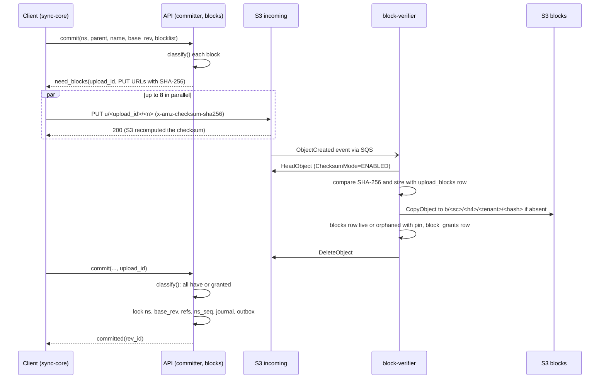
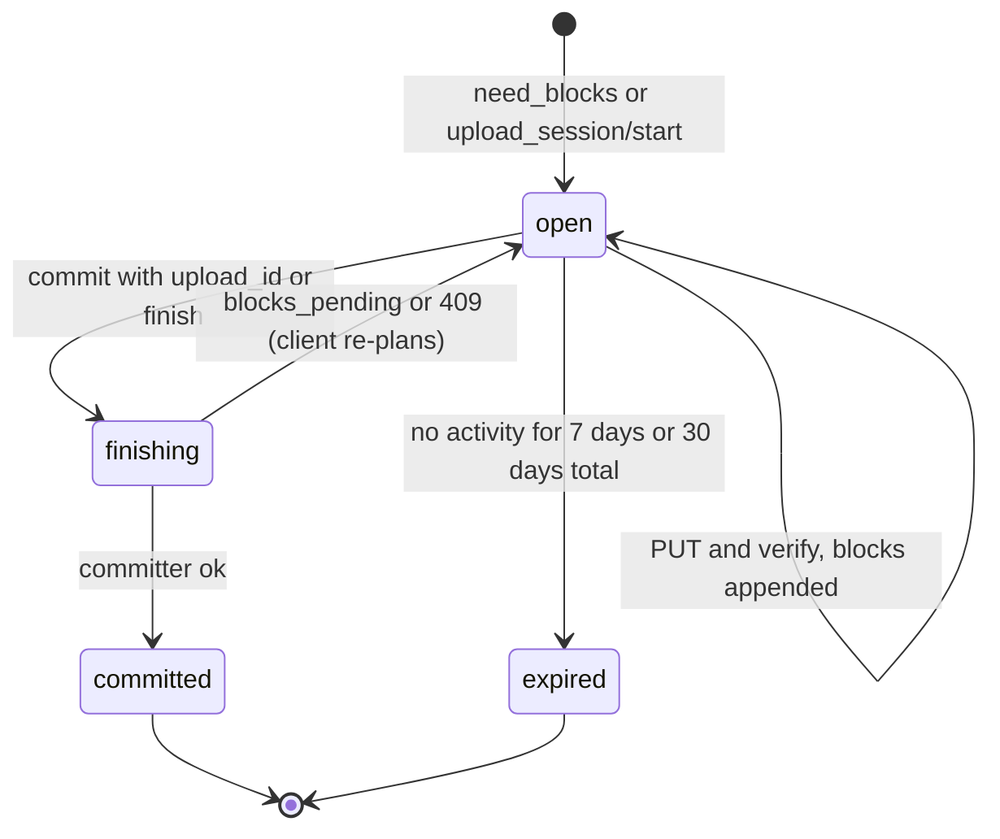
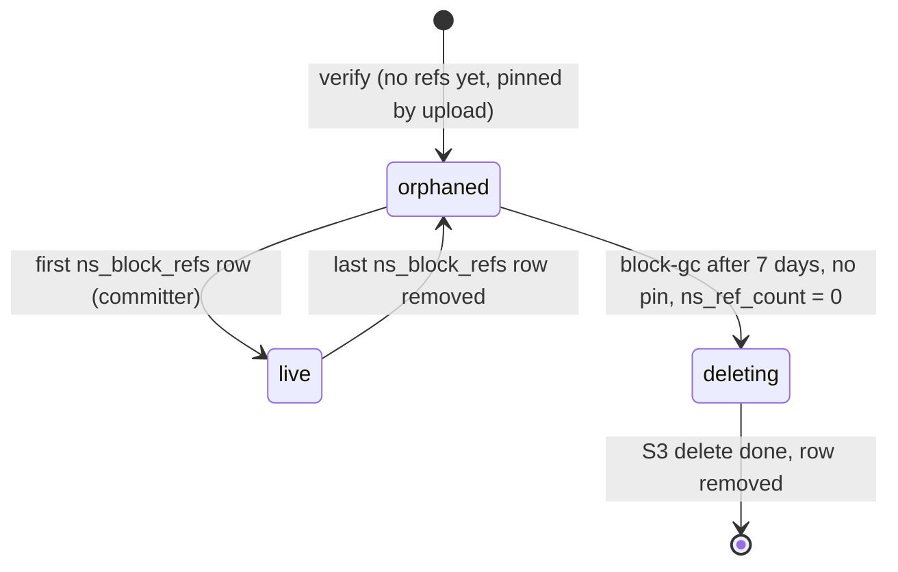

# Block storage: Dropbox

ブロックの保存の流れを決める。アップロードのセッション、足りないブロックだけを求める手順、`incoming/` への署名つきの PUT、サーバーの検証と正規のキーへの写し、ブロックの索引と参照の数、GC、照合（スクラブ）、ダウンロード、小さなブロックのパック（S2）、費用のモデルを扱う。

前提となる決定は次のとおり。

- 分割と番地（[ADR-0002](../decisions/0002-chunking-and-block-addressing.md)）
- 重複排除の範囲と答えの規則（[ADR-0003](../decisions/0003-dedupe-scope-and-privacy.md)）
- テナントと名前空間の RLS（[ADR-0004](../decisions/0004-tenancy-namespaces-and-rls.md)）
- 書き込みはすべて `packages/committer` を通ること（[ADR-0005](../decisions/0005-namespace-journal-and-cursors.md)）
- S3 のバケットとキー、7 日の猶予、30 日のバージョニング（[ADR-0007](../decisions/0007-block-storage-layout-on-s3.md)）

この文書で決めたことは次の ADR にある。

| ADR | 決定 |
| --- | --- |
| [0018](../decisions/0018-upload-sessions-and-block-grants.md) | 「送れ」と答えたら必ずアップロード（`upload_id`）を作り、検証したブロックをそのアップロードの許可（`block_grants`）として記録する。commit が受けるブロックは「読める名前空間の参照にある」か「この主体の許可がある」ものだけで、索引にあるだけでは受けない。1,024 ブロックを超えるファイルはアップロードのセッションで一覧を貯める。公開 API の利用者は固定 4 MiB の分け方（`chunker_version` 0）を使ってよい |
| [0019](../decisions/0019-block-refcount-and-gc-protocol.md) | 名前空間ごとの参照の行（`ns_block_refs`）が 0↔1 で変わるときだけ、ブロックの行の `ns_ref_count` を同じトランザクションで増減する。GC は `orphaned` から 7 日を過ぎ、ピンのないブロックを、`deleting` を DB に確定してから S3 で消し、その後に行を消す。`deleting` のブロックは commit で「送れ」、検証では「待て」にする |
| [0020](../decisions/0020-small-block-packing-for-s2.md) | S2 の前に、128 KiB 未満のブロックを、テナントと名前空間ごとの 64 MiB の不変のパックに詰める形を用意する。配信は範囲を署名に含めた URL だけにし、パックの全体を読ませない。詰め直しは生きている割合が 50% 未満で行う。有効にするのは `small-block-pack-poc` で費用が下がると確かめたとき |

## 1. 範囲

- 扱う：
  - アップロードの流れと状態、再開、署名つき URL、検証と写し
  - commit の「足りないブロック」の答えの形
  - 大きなファイルのアップロードのセッションとブロックの一覧
  - ブロックの索引、参照の数、ピン、GC、照合
  - ダウンロードの計画と組み立て、ローカルのブロックの索引
  - 小さなブロックのパック（S2）
  - 費用のモデル
- 扱わない：
  - 分割の規則そのもの（[ADR-0002](../decisions/0002-chunking-and-block-addressing.md)）
  - commit の操作と条件、ジャーナル（[metadata-and-journal.md](metadata-and-journal.md)）
  - いつ上げるか・いつ受けるかの計画（[sync-engine.md](sync-engine.md)）
  - リビジョンの保持の期限（[versions-and-recovery.md](versions-and-recovery.md)）。この文書は期限切れで参照が減った後を扱う
  - DR の切り替えと中身の待ち（[infrastructure.md](infrastructure.md)）
  - 単価（[capacity.md](capacity.md)）

## 2. 要件

| 要件 | 目標 | NFR |
| --- | --- | --- |
| 送信の速さ | 1 Gbps の回線で回線の 80% 以上。100 GB を 30 分以内 | NFR-003、K4 |
| 再開 | 切断・再起動・URL の期限切れの後、検証済みのブロックを送り直さない | NFR-003 |
| 差分 | 1 ブロックの変更で送るのは、変わったブロックと一覧だけ | NFR-003 |
| 耐久性 | 参照のあるブロックの削除 0 件。確定したリビジョンのブロックはすべて `live` | NFR-005、K2 |
| 漏れ | commit の答え・URL の形・エラー・応答の時間から、読めない名前空間のブロックの有無が分からない | NFR-007、[ADR-0003](../decisions/0003-dedupe-scope-and-privacy.md) |
| 小さなファイルの伝播 | 1 MiB 以下のファイルの確定から他の端末で開けるまで p95 10 秒。そのうち検証と写しに使うのは p95 1 秒 | NFR-002、K3 |
| commit の速さ | 操作 100 件までの commit p99 500ms（ブロックの照会を含む） | NFR-001 |
| 可用性 | アップロード・ダウンロード 月間 99.9% | NFR-006、[runbooks](../runbooks/README.md) |

## 3. 本家の形（確かめたこと）

いずれも 2026-10-09 に確認。

| 項目 | 内容 | 出典 |
| --- | --- | --- |
| ブロックの大きさ | 保存の層は最大 4 MB のブロックを SHA-256 で名付け、1 GB のバケットにまとめる | [Inside the Magic Pocket](https://dropbox.tech/infrastructure/inside-the-magic-pocket) |
| API の `content_hash` | 4 MB の固定のブロックの SHA-256 をつなげて SHA-256 | [Content hash](https://docs.dropboxapi.com/dropbox-api/docs/technical-reference/content-hash) |
| ファイルの上限 | 2 TB。ブラウザから 375 GB を超えると失敗しやすい | [Upload limitations](https://help.dropbox.com/sync/upload-limitations) |
| アップロードのセッションの上限 | 公式の文書の本文で確かめられなかった（**未検証**） | [intent.md](../intent.md) |
| 重複排除の範囲、GC の猶予 | 公開の資料にない（**未検証**） | — |

本システムは 1 ブロック 1 オブジェクトで S3 に置く（[ADR-0007](../decisions/0007-block-storage-layout-on-s3.md)）。本家の保存の層の形は使わない。

## 4. アップロード

### 4.1 commit の答え

クライアントは commit（[metadata-and-journal.md](metadata-and-journal.md)）にブロックの一覧（大きさと SHA-256 の並び）を付ける。`packages/committer` は、名前空間の行をロックする前に、`packages/blocks` の `classify()` で各ブロックを分ける。

| 区分 | 条件（[ADR-0003](../decisions/0003-dedupe-scope-and-privacy.md) の表） | commit での扱い |
| --- | --- | --- |
| `have` | 書き込み先のテナント T の索引で `live` か `orphaned`、かつ主体の読める T の名前空間が参照している | そのまま受ける |
| `copy` | 主体の読める他のテナント T2 の名前空間が参照している | X1 の写し（S3 の中の CopyObject）を同期で行い、T の索引に入れてから受ける |
| `granted` | この主体の、期限の中の許可（`block_grants`）がある | そのまま受ける |
| `need` | それ以外。T の索引にあっても、主体から届かないものを含む | 確定しない。アップロードを作って URL を返す |

- `need` が 1 つでもあれば、commit は確定せず `200 { status: "need_blocks", upload_id, blocks: [{index, url, expires_at}] }` を返す。名前空間のロックは取らない。
- `need` の判定に、T の索引の有無を使わない。T にあっても `need` と同じ形の URL を返す。応答の時間を揃えるため、`classify()` は T の索引を引かずに、読める名前空間の参照（`ns_block_refs` の `(tenant_id, hash, ns_id)` の索引）と許可だけを引く。
- `copy` の写しは 1 回の commit で 64 ブロックまで同期で行う。超えた分は `need` と同じく URL を返す（主体は読めるので、送らせても漏れない）。
- 1 回の commit の一覧は 1,024 ブロックまで。超えるファイルは 4.4 節のセッションを使う。

### 4.2 流れ

1. API はアップロードの行 `uploads` と、ブロックごとの `upload_blocks(upload_id, n, hash, size, state=awaiting)` を作り、`incoming` の署名つきの PUT の URL を返す。URL は `x-amz-checksum-sha256`（番地のハッシュの base64）と `Content-Length` を署名に含める。期限は 15 分（[ADR-0007](../decisions/0007-block-storage-layout-on-s3.md)）。`upload_id` は 128 ビットの乱数にする（UUIDv7 にしない）。`incoming` のキー `u/<upload_id>/<n>` の先頭が時刻で偏り、S3 の接頭辞ごとの要求の上限に当たるのを避けるため（[capacity.md](capacity.md) の指摘。キーの形は ADR-0007 のまま）。
2. クライアントはブロックを並行に PUT する。既定は 8 本で、`ops.client_upload_concurrency` で配る。回線の速さを測り、1 本あたり 50 Mbps に満たなければ 16 本まで広げる。
3. S3 のイベント（`incoming` の ObjectCreated）を SQS に流し、`block-verifier` が受ける。`block-verifier` の処理は `packages/blocks` の `verify(upload_id, n)` にあり、commit も呼べる（4.3 節）。
4. `verify` は、HeadObject で S3 の持つ SHA-256 と大きさを読み、`upload_blocks` の値と比べる。合わなければ `incoming` を消し、`upload_blocks.state=rejected`（理由のコード `checksum_mismatch`・`size_mismatch`）にする。
5. 合えば、正規のキーを HeadObject で確かめ、なければ CopyObject で写す（SHA-256 のチェックサムを付け直す）。既にあれば写さない。同じキーへの二重の写しは同じ中身なので害はない。
6. `blocks` の行を作るか更新し（5.1 節）、`block_grants(tenant_id, actor_id, upload_id, hash, expires_at)` を書き、`upload_blocks.state=verified` にする。`incoming` を消す。
7. クライアントは commit を `upload_id` 付きで送り直す。

- `verify` は冪等にする。同じ `(upload_id, n)` を何度流しても結果は同じ。
- CopyObject は 2025-10-29 から `If-None-Match`（写し先がないときだけ書く）を受ける（[Amazon S3 adds conditional write functionality to copy operations](https://aws.amazon.com/about-aws/whats-new/2025/10/amazon-s3-conditional-write-functionality-copy-operations)、2026-10-09 に確認）。これを使い、5 の HeadObject を省く。バケットの方針での強制の振る舞いは `presigned-upload-poc` で確かめる。

### 4.3 検証の待ちと速い道

- commit の送り直しで、許可がまだないブロック（`upload_blocks.state=awaiting` で、`incoming` に置かれたもの）があれば、commit は同じ要求の中で `verify` を呼ぶ。1 回の commit で 8 ブロック・合計 1 秒までにする。小さなファイルの伝播（NFR-002）を、SQS の遅れに左右させないため。
- それでも残れば `200 { status: "blocks_pending", retry_after_ms: 500 }` を返す。クライアントは 500ms、1 秒、2 秒…（最大 10 秒）で送り直す。
- `incoming` にまだないブロックは `need_blocks` で URL を出し直す（URL の期限切れの扱いを兼ねる）。

### 4.4 アップロードのセッション（大きなファイル）

1,024 ブロックを超えるファイル（平均で約 4 GiB 超）は、一覧を一度に送らず、セッションに貯める（[ADR-0002](../decisions/0002-chunking-and-block-addressing.md)）。

| 呼び出し | 中身 |
| --- | --- |
| `upload_session/start` | `ns_id`、`expected_size`（2 TiB まで）、`chunker_version`。`upload_id` と `session_expires_at` を返す |
| `upload_session/blocks` | `upload_id`、`first_index`、`blocks: [{size, hash}]`（1 回 1,024 まで、`first_index` は続きの番号）。各ブロックの区分（`have`・`copy`・`granted`・`need`）と、`need` の URL を返す |
| `upload_session/status` | 検証済みの番号の範囲、受けた一覧の長さ、期限 |
| `upload_session/finish` | commit の操作（親、名前、`base_rev` など）。一覧の全体が `have`・`granted` なら、一覧を S3 の `blocklists/` に置き、commit を確定する |

- 一覧の行は `upload_session_entries(upload_id, idx, hash, size)` に貯める。`finish` で順に読み、`blocklist_hash` を計算し、`bl/<h4>/<tenant>/<blocklist_hash>` に置く（既にあれば置かない）。リビジョンの行は番地だけを持つ。
- 一覧の大きさの検査：ブロックの大きさの和が `expected_size` と一致し、各ブロックが 16 MiB 以下。合わなければ `finish` は 400。
- `chunker_version` が 1 のセッションでも、サーバーは境界の正しさを確かめない（中身を読まないため）。確かめるのは大きさの上限と一覧のハッシュだけ（[ADR-0002](../decisions/0002-chunking-and-block-addressing.md)）。
- セッションの期限は最後の `blocks` か PUT から 7 日、作成から最大 30 日。期限が切れたら、行を消し、ピンを外す（5.3 節）。

### 4.5 公開 API の分け方

- 公開 API の利用者は、内容で区切る分割を実装しなくてよい。`chunker_version` 0 は「4 MiB の固定の大きさ、最後だけ短い」とする。セッションの使い方は同じ（[ADR-0018](../decisions/0018-upload-sessions-and-block-grants.md)、[api-and-webhooks.md](api-and-webhooks.md) を参照）。
- 0 で分けたブロックも同じ索引と重複排除に入る。CDC のブロックと境界が合わないので、重ならないだけである。
- 公式の SDK（TypeScript、Python）は `sync-core` の WASM で `chunker_version` 1 を使う。

### 4.6 アップロードの状態

- ブロックごとの状態：`awaiting` → `verified` か `rejected`。`rejected` のブロックを含む commit は 400 `block_rejected`。クライアントは手元のファイルを読み直す（書き込みの途中で変わった可能性がある）。
- 409（`base_rev` の不一致）でアップロードは閉じない。クライアントが競合のコピーとして commit し直すとき、同じ `upload_id` の許可を使える。

### 4.7 クライアントの再開

- `sync-core` は、ローカルの状態の DB に `(file の識別, chunker_version, blocklist_hash, upload_id, 検証済みの番号)` を持つ。再起動の後、`upload_session/status`（小さなファイルは commit の送り直し）で、サーバーの検証済みに合わせる。
- 手元のファイルが計画の時から変わっていたら（大きさ・更新の時刻・ファイルの ID）、アップロードを捨てて分割し直す（[sync-engine.md](sync-engine.md)）。
- URL の期限切れ（403）は、その番号の URL を取り直すだけにする。

## 5. ブロックの索引と参照

### 5.1 ブロックの状態

ADR-0019。`blocks` はテナントの表（RLS は `tenant_id`）。

- 検証したばかりのブロックは参照がないので `orphaned` で入れ、`pin_until` をアップロードの期限にする。commit で最初の参照ができたら `live` にする。
- `ns_ref_count` は「そのブロックを参照する名前空間の数」。`ns_block_refs(tenant_id, ns_id, hash, ref_count)` の行が作られたとき +1、消えたとき −1 する。行の中の `ref_count` の増減（同じ名前空間の中の参照の数）は `blocks` の行に触れない。よく使われるブロックの行のロックを避けるため。
- ロックの順：名前空間の行 → `ns_block_refs` → `blocks`（ハッシュの順）。デッドロックを避ける。
- `ns_block_refs.ref_count` は、そのブロックを一覧に持つ、保持の期間の中のリビジョンの数。リビジョンの作成で +1、保持の期限切れの削除で −1（[versions-and-recovery.md](versions-and-recovery.md)）。名前空間の削除・テナントの削除では、`packages/committer` がまとめて行を消し、`ns_ref_count` を減らす。

### 5.2 GC

`block-gc`（ADR-0019）。テナントを 1 つずつ文脈に設定して回る（[ADR-0004](../decisions/0004-tenancy-namespaces-and-rls.md) の X3）。

1. `blocks WHERE state='orphaned' AND orphaned_at < now() - 7 days AND (pin_until IS NULL OR pin_until < now())` を部分索引で 1,000 件ずつ読む。
2. 1 つのトランザクションで `SELECT … FOR UPDATE`、`ns_ref_count = 0` と条件を確かめ直し、`state='deleting'`、`deleting_at=now()` にして確定する。
3. S3 の DeleteObjects（1,000 キーまで）で消す。バージョニングで削除のマーカーが付き、古いバージョンは 30 日残る（[ADR-0007](../decisions/0007-block-storage-layout-on-s3.md)）。
4. 消せたキーの行を消し、`block_gc_log(tenant_id, hash, deleted_at, s3_version_id)` に書く（戻しの手順で使う。37 日で消す）。

- `deleting` の扱い：
  - commit の `classify()` は `deleting` を「参照なし」として扱い、`need` にする。
  - `verify` は、正規のキーの行が `deleting` なら写さずに待つ（SQS に 60 秒の遅れで戻す）。GC の 3 と写しが前後すると、新しい写しに削除のマーカーが重なるため。
  - `deleting` のまま 1 時間を過ぎた行は、`block-gc` が 3 からやり直す（冪等）。
- 速さの上限：テナントごとに 1 秒 1,000 オブジェクト、全体で `ops.block_gc_rate`。止めるのは `ops.block_gc_enabled`。
- 新しいバージョンの `block-gc` は、参照の監査が 24 時間 0 件のときだけ有効にする（[runbooks](../runbooks/README.md) の 3 節）。

### 5.3 ピン

- `pin_until` は、アップロードとセッションが生きている間、検証済みのブロックを GC から守る。セッションの活動のたびに、そのセッションのブロックの `pin_until` をまとめて延ばす（1 時間に 1 回まで）。
- 復元・巻き戻しの作業（[versions-and-recovery.md](versions-and-recovery.md)）で、期限切れの直前のリビジョンを戻すときも、作業の間ピンを付ける。

### 5.4 失敗と戻し

| 事象 | 起きること | 備え |
| --- | --- | --- |
| `verify` の写しの途中の停止 | `incoming` に残る。索引にない | SQS の再配信で冪等にやり直す。`incoming` は 2 日で消える |
| GC の 2 と 3 の間の停止 | `deleting` の行が残る | 1 時間後にやり直す |
| 参照の数の誤り（実装の不具合） | 参照のあるブロックが `orphaned` になる | 7 日の猶予の間に、毎日の参照の監査（6 節）で見つけ、`ns_ref_count` を数え直す。見つける前に消えたら、`block_gc_log` のバージョン ID で S3 から戻す（runbook `block-integrity-incident.md`） |
| S3 の 503（要求の上限） | PUT・写しの失敗 | キーの先頭のハッシュで接頭辞を分ける（[ADR-0007](../decisions/0007-block-storage-layout-on-s3.md)）。クライアントは指数の後退（0.5 秒から 30 秒、±20%） |
| `incoming` の放置 | 置かれたが commit されない | 2 日で消える。許可は 7 日で切れる |

## 6. 照合（スクラブ）

[ADR-0007](../decisions/0007-block-storage-layout-on-s3.md) の照合を、次の値で行う。結果は SLI にする（[runbooks](../runbooks/README.md) の「中身の耐久性」「チェックサムの照合」）。

| 作業 | 頻度 | 中身 | 外れたとき |
| --- | --- | --- | --- |
| 参照の監査 | 毎日 | その日に作られたリビジョンと、抜き取り 0.1% のリビジョンの全ブロックが `live` で、S3 にある（HeadObject） | SEV1 の候補。`ops.block_gc_enabled` を止める |
| 参照の数え直し | 毎週 | 抜き取り 1% の名前空間で、リビジョンから `ns_block_refs` を数え直して比べる。全テナントの `ns_ref_count` を `ns_block_refs` から数え直して比べる | 食い違いを直し、GC を止めて原因を調べる |
| チェックサムの照合 | 毎日 | 0.1% のブロックの HeadObject の SHA-256 と番地を比べる | SEV2 |
| 中身の読み直し | 毎月 | 0.001% のブロックを GET して SHA-256 を計算し直す | SEV2 |
| 在庫の突き合わせ | 毎週 | S3 Inventory と索引。索引にないオブジェクトは GC の候補（7 日の後）、オブジェクトのない索引の行は SEV の候補 | 同上 |
| `content_sha256` の抜き取り | 毎日 | 0.01% のリビジョンのブロックを読んで全体の SHA-256 を計算し、リビジョンの値と比べる | クライアントのバージョンごとに数え、チケット |

- `content_sha256` はクライアントの申告である。サーバーは中身を読まないので、commit では確かめない。抜き取りで、誤ったクライアントのバージョンを見つける。各ブロックの SHA-256 は `verify` で確かめているので信用できる。ハッシュの照合（違法なコンテンツ）は申告を使わず、`content-scanner` が計算した `verified_sha256` を使う（[ADR-0046](../decisions/0046-content-scanning-framework.md)）。
- 照合の読み出しは `X3` の経路で、テナントを 1 つずつ文脈に設定して行う。名前と中身はログに出さない（ID と数だけ）。

## 7. ダウンロード

### 7.1 計画

- `download_plan { rev_id, first_block?, limit ≤ 1024 }` は、`can(actor, read, rev)` を確かめ、ブロックの一覧と、ブロックごとの CloudFront の署名つき URL（`content.<brand>usercontent.<domain>/b/<sc>/<h4>/<tenant>/<hash>`、期限 1 時間）を返す。一覧が `blocklists/` にあれば、サーバーが読んでページに分ける。
- URL は 1 ブロックずつ署名する。テナントの接頭辞の全体を許す署名（ワイルドカード）は使わない。読めないブロックの有無を確かめられてしまうため。
- 署名の量：RSA の署名を 1 ブロック 1 回。配信のピーク 4 GB/秒（平均 4 MiB）で 1 秒約 1,000 回で、API の 1 vCPU 程度。同じ `(tenant, hash)` の URL は、期限の残りが 30 分以上なら Valkey のキャッシュから返す。
- ブロックは不変なので、CloudFront のキャッシュの期間は 1 日（`Cache-Control: max-age=86400, immutable`）。署名の問い合わせの文字列はキャッシュのキーに入れない。1 日にしたのは、GC とテナントの削除の後にエッジに長く残さないため。国外のエッジの扱いは法務の L5。

### 7.2 組み立て

- クライアントは、ローカルのブロックの索引（`local_blocks(hash → file, offset, size, verified_mtime)`）にあるブロックを手元から写し、ないブロックだけを取る（[ADR-0002](../decisions/0002-chunking-and-block-addressing.md)）。手元から写すときは、写した範囲の SHA-256 を計算し直す（手元のファイルが変わっていることがある）。
- 取ったブロックは SHA-256 を確かめる。合わなければ 1 回取り直し、また合わなければ止めて理由のコード `block_hash_mismatch` を匿名の計測で送る。
- 一時のファイルに組み立て、全体の `content_sha256` を確かめてから置き換える（[ADR-0006](../decisions/0006-sync-conflict-model.md)）。
- 並行は 8 本、1 本あたりの速さで 16 本まで広げる（アップロードと同じ）。

## 8. 小さなブロックのパック（S2）

ADR-0020。S1 では使わない。S2 の前に `small-block-pack-poc` で、オブジェクトの数と要求の費用を測り、下がるときだけ `release.small-block-packing` で有効にする。

- **対象**：128 KiB 未満のブロック（`sc=s`）。大きなブロックは今までどおり 1 オブジェクト。
- **パック**：テナントと名前空間ごとに、`pack-builder` が `orphaned` を除く小さなブロックを 64 MiB まで詰めた不変のオブジェクト `pk/<h4>/<tenant>/<pack_id>` を作る。索引に `pack_id`、`pack_offset` を足し、元のオブジェクトは 7 日の後に消す（GC と同じ手順）。
- **名前空間ごとに分ける理由**：配信で範囲を読ませるので、同じパックに読めない名前空間のブロックを入れない。後から別の名前空間が参照しても、パックは最初の名前空間のままでよい（範囲だけを渡すため）。
- **配信**：署名つき URL に範囲 `r=<offset>-<length>` を含め、CloudFront Functions で `Range` のヘッダーを `r` から作り、利用者の `Range` を捨てる。署名の確かめと CloudFront Functions の順序は**未検証**で、PoC で確かめる。確かめられなければ、パックは採らない。
- **詰め直し**：パックの中の生きているバイトが 50% 未満になったら、生きているブロックを新しいパックへ詰め直し、古いパックを GC の手順（`deleting` を経て）で消す。
- **耐久性**：パックも CRR とバージョニングの対象。詰め直しの途中で落ちても、古いパックは索引が指す限り消さない。

## 9. 費用のモデル

[architecture/README.md](README.md) の 2.1 節の式を、要求の数で具体にする。単価は [capacity.md](capacity.md) で入れる。

| 項目 | 1 TiB の新しいデータ（平均 4 MiB のブロック、262,144 個） | 1 TiB の小さなファイル（平均 100 KiB、約 1,070 万個） |
| --- | --- | --- |
| `incoming` への PUT | 262,144 | 10,737,418 |
| 検証の HeadObject（`incoming`、正規のキー） | 524,288 | 21,474,836 |
| CopyObject | 262,144（重複排除で減る） | 10,737,418 |
| `incoming` の DeleteObject | 262,144（無料の要求） | 10,737,418 |
| 東京の保存のクラス | Intelligent-Tiering | Standard（128 KiB 未満） |
| 大阪の写し | Glacier Instant Retrieval | Standard |
| Intelligent-Tiering の監視 | 262,144 オブジェクト | なし |

- 小さなファイルの列が、パック（8 節）を S2 の前に測る理由である。要求の数は 40 倍になる。
- 配信は CloudFront の外への転送の量と、キャッシュに当たらなかった GET で見る。
- GC で消した量は、30 日のバージョニングの間、保存の費用に残る。

## 10. 上限

| 対象 | 値 | 超えたとき |
| --- | --- | --- |
| ファイル | 2 TiB | 400 `file_too_large` |
| ブロック | 16 MiB（`chunker_version` 0 は 4 MiB） | 400 `block_too_large` |
| 1 回の commit の一覧 | 1,024 ブロック | セッションを使う（400 `use_upload_session`） |
| `upload_session/blocks` の 1 回 | 1,024 ブロック | 400 |
| 同時のアップロード（端末） | 開いているもの 64 | 429 |
| 同時のセッション（アカウント） | 32 | 429 |
| 署名つき URL | PUT 15 分、配信 1 時間 | 取り直し |
| アップロードの期限 | 活動から 7 日、作成から 30 日 | `expired` |
| 許可（`block_grants`） | 7 日 | `need` に戻る |
| `copy` の同期の写し | 1 回の commit で 64 ブロック | 残りは `need` |

## 11. data-model への項目

| 表・置き場 | 中身 | 主キー・索引 | 節 |
| --- | --- | --- | --- |
| `blocks`（テナントの表）に足す列 | `block_id`（ログ・照合でハッシュの代わりに指す内部の ID。[observability.md](observability.md) の 2.1 節）、`ns_ref_count`、`state`（`live`・`orphaned`・`deleting`）、`orphaned_at`、`pin_until`、`deleting_at`、`chunker_hint`（0 か 1）、S2 で `pack_id`・`pack_offset` | `(tenant_id, hash)`。部分索引 `(tenant_id, orphaned_at) WHERE state='orphaned'`、`(deleting_at) WHERE state='deleting'` | 5.1、5.2、8 |
| `ns_block_refs`（名前空間の表） | `ref_count` | `(tenant_id, ns_id, hash)`。照会用に `(tenant_id, hash, ns_id)` | 4.1、5.1 |
| `uploads`（テナントの表） | `upload_id`、`actor_id`、`device_id`、`ns_id`、`kind`（`commit`・`session`）、`chunker_version`、`expected_size`、`state`、`created_at`、`last_activity_at`、`expires_at` | `(tenant_id, upload_id)` | 4.2、4.6 |
| `upload_blocks` | `(upload_id, n)`、`hash`、`size`、`state`（`awaiting`・`verified`・`rejected`）、`reason` | `(tenant_id, upload_id, n)` | 4.2 |
| `upload_session_entries` | `idx`、`hash`、`size` | `(tenant_id, upload_id, idx)` | 4.4 |
| `block_grants` | `actor_id`、`upload_id`、`hash`、`expires_at` | `(tenant_id, actor_id, hash, upload_id)` | 4.1 |
| `block_gc_log` | `hash`、`deleted_at`、`s3_version_id`。37 日で消す | `(tenant_id, deleted_at, hash)` | 5.2 |
| `integrity_audit_runs`（保守用のスキーマ、集計だけ） | 照合の種類、件数、不一致の数、`block_id` の一覧 | `(run_id)` | 6 |
| S3 | `incoming`・`blocks`・`blocklists`（[ADR-0007](../decisions/0007-block-storage-layout-on-s3.md)）、S2 で `pk/` | — | 4、8 |
| SQS | `block-verify`（`incoming` の ObjectCreated）、遅れの戻しに 60 秒 | — | 4.2 |
| Valkey | 配信の URL のキャッシュ `dlurl:<tenant>:<hash>` | 期限 30 分 | 7.1 |
| クライアントの SQLite | `local_blocks`、アップロードの再開の行 | — | 4.7、7.2 |

- `uploads`・`upload_blocks`・`block_grants`・`upload_session_entries` はファイルの名前とパスを持たない。

## 12. テスト

決定表：

- **DT-BLK-001（commit の答え）**：4.1 節の 4 区分 ×（T の索引にある・ない・`orphaned`・`deleting`）×（読める・読めない名前空間）× 許可の有無。[ADR-0003](../decisions/0003-dedupe-scope-and-privacy.md) の表を細かくしたもの。
- **DT-BLK-002（検証）**：チェックサムの一致・不一致、大きさの一致・不一致、正規のキーがある・ない・`deleting`。

性質ベーステスト：

- **PROP-BLK-001（参照のあるブロックを消さない）**：任意の commit・保持の期限切れ・GC・アップロード・セッションの期限・テナントの削除の列を並行に流し、保持の期間の中のリビジョンのすべてのブロックが `live` で、S3 にある（quality.md の 2.2.1 節 D）。
- **PROP-BLK-002（`ns_ref_count` の一致）**：同じ列の後、各ブロックの `ns_ref_count` が `ns_block_refs` の行の数と等しい。
- **PROP-BLK-003（許可なしでは受けない）**：任意のテナントの状態で、主体が読めない名前空間だけが参照するハッシュを並べた commit は、アップロードと検証を経ずに確定しない。
- **PROP-BLK-004（2 つの世界）**：主体から読めない名前空間の中身だけが違う 2 つの世界で、`classify()` の答え、URL の形、エラーの種類が一致する（quality.md の 2.2.1 節 G）。
- **PROP-BLK-005（再開）**：任意の位置の切断・再起動・URL の期限切れを混ぜたアップロードで、`verified` のブロックを 2 回 PUT しない。最終の `content_sha256` が一致する（K4）。

結合テスト：

- LocalStack と実の S3：チェックサムの合わない PUT を S3 が拒む、署名に含めないチェックサムの指定で PUT すると拒まれる（`presigned-upload-poc`）。
- GC と `verify` の前後：`deleting` の間に置かれたブロックが、GC の後に正しく写され、削除のマーカーの下に埋もれない。
- IAM の方針の検査：クライアントの署名の役割が `incoming` の PUT だけを持つ（[ADR-0007](../decisions/0007-block-storage-layout-on-s3.md)）。

負荷：100 GB のファイルを 1 Gbps で 30 分以内（K4）、検証と写しの p95 1 秒。

## 13. Story の候補

| Epic | Story | 中身 |
| --- | --- | --- |
| E2 | `presigned-upload-poc` | 4.2 節の署名とチェックサム、CopyObject の条件、検証の速さ |
| E2 | `block-index-and-verifier` | 4.2・4.3 節、5.1 節（ADR-0018・0019、DT-BLK-002） |
| E2 | `commit-need-blocks` | 4.1 節（DT-BLK-001、PROP-BLK-003・004） |
| E2 | `ns-block-refs` | 5.1 節（PROP-BLK-002） |
| E2 | `large-file-upload-session` | 4.4〜4.7 節（PROP-BLK-005） |
| E2 | `block-download` | 7 節 |
| E2 | `block-gc` | 5.2・5.3 節（PROP-BLK-001） |
| E2 | `block-scrubber-and-audit` | 6 節 |
| E2 | `dedupe-two-worlds-tests` | PROP-BLK-004 |
| S2 の前 | `small-block-pack-poc` | 8 節（ADR-0020） |

## 14. 未解決の問い

### 決定

2026-10-09 の既定案。

- **許可の記録**：「送れ」のたびにアップロードを作り、検証したブロックを主体の許可にする（ADR-0018）。
- **参照の数**：名前空間の数だけを `blocks` に持つ（ADR-0019）。
- **GC の手順**：`deleting` を DB に確定してから S3 で消す（ADR-0019）。
- **公開 API の分け方**：`chunker_version` 0（4 MiB の固定）を足す（ADR-0018）。
- **配信のキャッシュの期間**：1 日。
- **パック**：形は決め、有効にするかは計測で決める（ADR-0020）。

### 持ち越し

| 問い | いつ・どう決めるか |
| --- | --- |
| 署名でのチェックサムの強制（AWS の公式の資料で確かめられなかった。**未検証**） | `presigned-upload-poc` |
| モバイルのバックグラウンドの送信で、15 分の URL が切れる頻度 | `mobile-background-upload-poc`（[mobile-and-camera-upload.md](mobile-and-camera-upload.md)）。頻度が高ければ、モバイルの URL の期限を延ばす ADR を起票する（[ADR-0007](../decisions/0007-block-storage-layout-on-s3.md) の値の変更） |
| CloudFront の署名と CloudFront Functions の順序（パックの範囲の配信） | `small-block-pack-poc` |
| 解約・削除の後の最後のバイトの消去の期限（7＋30 日と写し、エッジの 1 日） | **法務の確認待ち：L6** |
| 国外のエッジでのブロックのキャッシュ | **法務の確認待ち：L5** |
| `content_sha256` の申告を、サーバーで確かめる範囲を広げるか | ハッシュの照合の範囲では、サーバーが計算する（ADR-0046）。それ以外は抜き取りの結果を E13 で見て決める |

## 出典

いずれも 2026-10-09 に確認。

- dropbox.tech, [Inside the Magic Pocket](https://dropbox.tech/infrastructure/inside-the-magic-pocket)
- Dropbox Developers, [Content hash](https://docs.dropboxapi.com/dropbox-api/docs/technical-reference/content-hash)
- Dropbox Help Center, [Upload limitations](https://help.dropbox.com/sync/upload-limitations)
- AWS, [Checking object integrity](https://docs.aws.amazon.com/AmazonS3/latest/userguide/checking-object-integrity.html)
