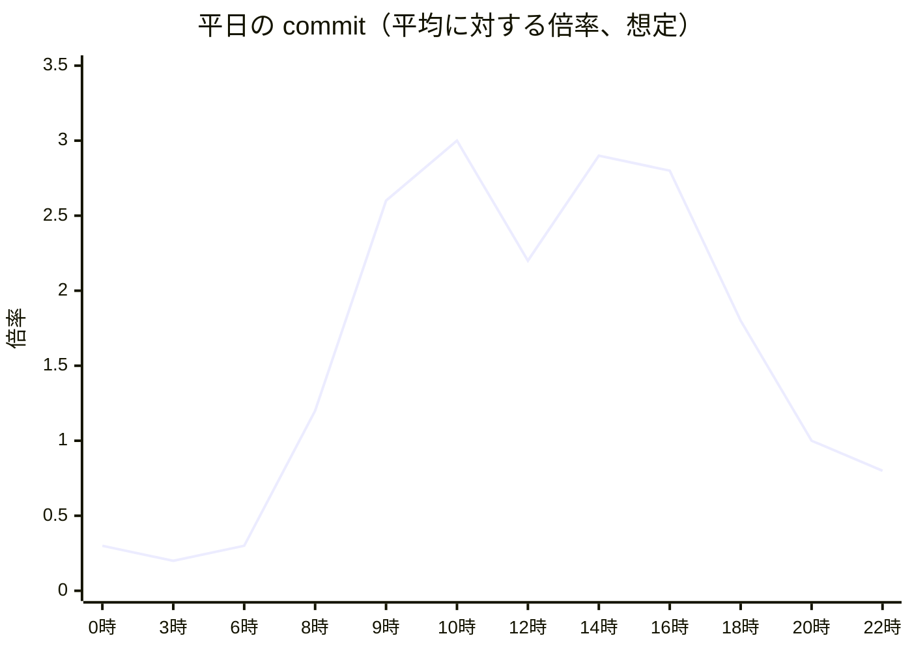
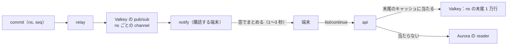

# Capacity: Dropbox

負荷のモデル（送られるバイト、メタデータの commit、ジャーナルの合図の端末への扇、月曜の朝と障害の後の再接続、DR の後の取り直し、カメラのアップロードの集中、配信）、部品ごとの必要量（Aurora、ECS、Valkey、S3 の要求）、S1・S2・S3 の大きさ、月の費用、負荷試験、キャパシティの運用を決める。保存 1 TB と配信 1 TB の単価は [infrastructure.md](infrastructure.md) の 10 節にある。

| ADR | 決定 |
| --- | --- |
| [0051](../decisions/0051-load-shaping-uploads-signals-and-reconnects.md) | 負荷の集中を 4 つの仕組みでならす。アップロードの署名つき URL の発行を、テナントと全体のトークンバケットで絞り、カメラのアップロードと API の一括を `background` の優先度にして先に待たせる。合図は端末と名前空間の組ごとに窓でまとめ、購読の多い名前空間は窓を 3 秒まで広げ、ジャーナルの末尾を Valkey に持つ。再接続は端末が乱数で散らし、`notify` は 1 タスク 1 秒 500 の接続を受ける。取り直しは、サーバーが端末ごとの待ちの時間を割り当てる |

数値は本システムの想定で、「初期見積もり」は E13 の負荷試験の前の仮の値である。本家の利用者の数、ファイルの数、負荷の形は確かめていない（**未検証**）。

## 1. 負荷のモデル（S1）

### 1.1 量

[architecture/README.md](README.md) の 2 節の S1 の値と、ここで置いた想定。

| 項目 | 値 | 根拠 |
| --- | --- | --- |
| アカウント | 個人 40 万、チームの席 10 万（チーム 2,000） | README の 2 節 |
| 端末 | 40 万（デスクトップ 25 万、モバイル 15 万） | 内訳は本システムの想定 |
| `notify` の同時の接続（ピーク） | 20 万（平日の業務の時間に、デスクトップの 70%、モバイルの前面のもの） | 本システムの想定。設計の上限は 40 万 |
| ノード | 25 億 | README の 2 節 |
| 物理の保存 | 13 PB | 同上 |
| 新しい物理のデータ | 1 日 0.3% = 39 TB/日。平均 450 MB/秒 | 同上 |
| ブロックの送信のピーク | 2 GB/秒（平均の 3 倍に余裕を足す） | 同上 |
| 配信のピーク・平均 | 4 GB/秒・1.5 GB/秒（月 約 3.9 PB） | ピークは README、平均は本システムの想定 |
| commit のピーク・平均 | 5,000 件/秒・1,700 件/秒。1 件に平均 3 の操作 | ピークは README |
| 合図の端末への扇（1 commit あたりの購読の端末） | 平均 4.1（利用者のルート 70% で 1.6 台、共有・チームのフォルダー 30% で 10 台） | 本システムの想定 |
| 最大の名前空間の購読 | 4.5 万端末（3 万席のチームのスペースの最上位のチームのフォルダー） | README の最大のチーム |

### 1.2 時刻の形

| 形 | 中身 | 効く部品 |
| --- | --- | --- |
| 平日の業務の時間 | 9〜18 時に commit と送信が平均の 2〜3 倍 | Aurora の writer、`api`、S3 の PUT |
| 月曜の朝 | 8 時 30 分〜9 時 30 分にチームの端末（約 12 万台）が起き、週末の変更を取る。同じ時間に commit が平日のピークの 1.3 倍 | `notify` の接続、`list/continue`、Aurora |
| 年度末（3 月の最後の週） | 書類の受け渡しで共有と配信が増える（[runbooks/README.md](../runbooks/README.md) の 3.1 節の凍結の理由） | 配信、`link` |
| 夜のカメラのアップロード | 22 時〜1 時に、充電と Wi-Fi の端末が写真を上げる | S3 の PUT、`block-verifier` |
| 行事の後の集中 | 元日の 0 時、連休の終わりの夜に、写真と動画が集中する（4.2 節） | 同上 |
| 障害・デプロイの後 | `notify` の接続が一斉に切れて戻る（3.2 節） | `notify`、`list/continue` |
| DR の後 | `epoch` の更新で全端末が木を読み直す（3.3 節） | Aurora の reader |

## 2. commit と名前空間

- commit の 1 件の書き込みの行（初期見積もり）：名前空間の行の更新 1、ノード 3、リビジョン 2、`ns_journal` 3、`ns_block_refs` 2.5、ブロックの行の参照の数 0.5、outbox 1、アップロードの行 2 = 約 15 行。ピークで 1 秒 約 7.5 万行、索引を含めて 20 万の索引の更新。
- 1 名前空間の上限は 1 秒 200 件（[ADR-0005](../decisions/0005-namespace-journal-and-cursors.md)）。E3 の前の `namespace-write-throughput-poc` で確かめる。上限に当たる名前空間（自動の同期の道具、大きなチームのフォルダー）は 429 と `Retry-After` で待たせ、チームのフォルダーを分ける案内を出す。
- 名前空間をまたぐ大きな移動・コピーは、バッチの非同期の操作で、2,000 ノードずつのトランザクションに分ける（[metadata-and-journal.md](metadata-and-journal.md) の 6 節）。復元・巻き戻しのバッチは、`maintenance` の枠（全体の commit の 10% まで）で流し、利用者の commit を押しのけない。

## 3. 合図と再接続

ADR-0051。

### 3.1 合図の扇

- ピークの生の合図：5,000 commit/秒 × 4.1 = 約 2 万/秒。合図に `seq` を入れ、端末は手元の位置以上なら `list/continue` を呼ばない。
- **窓でまとめる**：`notify` は端末と名前空間の組ごとに、窓の間に来た合図を最後の 1 つにまとめる。窓は、購読の端末が 1,000 以下で 1 秒、1 万以上で 3 秒（間は線形）。端末ごとに窓の中の乱数の位置で送る。確定から受け取りまでの p99 5 秒（NFR-002）に、窓の 3 秒と `list/continue` の 1 秒が収まる。
- **購読の多い名前空間**：4.5 万の端末が載せたチームのフォルダーに 1 秒 10 件の commit が続くと、窓 3 秒で 1 秒 1.5 万の `list/continue` になる。購読が 1,000 を超える名前空間は、`api` がジャーナルの末尾（最大 1 万行）を Valkey に持ち、`list/continue` はそこから読む。名前空間の中のファイルごとの権限を持たない（[ADR-0004](../decisions/0004-tenancy-namespaces-and-rls.md)）ので、同じ名前空間の行はどの端末にも同じで、権限の確かめ（`can()`）と載せた場所のパスへの直しだけを端末ごとに行う。
- `list/continue` の速い道：カーソルの位置を Valkey の `ns_head`（名前空間の最新の番号）と比べ、変わっていなければ DB を読まずに返す。

### 3.2 再接続の集中

| 場面 | 量 | 散らし方 |
| --- | --- | --- |
| 月曜の朝 | 12 万台が 1 時間に起きる。30 分の山で 6 万台、1 秒 約 35 | 自然に散る。各端末は載せた名前空間（平均 8）の位置を速い道で確かめる |
| `notify` のデプロイ（1 タスクずつ） | 1 タスク 2 万の接続 | `notify` が切る前に `reconnect` を送り、端末は 0〜30 秒の乱数で待つ。1 秒 約 700 |
| 1 AZ の喪失 | 約 6.7 万の接続 | 同上。1 秒 約 2,200 |
| `notify` 全体の停止からの戻り | 20 万の接続 | 端末は 0〜60 秒の乱数、失敗で指数の後退（最大 5 分）。`notify` は 1 タスク 1 秒 500 の新しい接続まで受け、超えたら 503 と `Retry-After`。1 秒 約 3,300 |

- 再接続の後の `list/continue` は、ほとんどが速い道（変わっていない）で、DB を読まない。
- WebSocket が使えない端末は 60 秒ごとの確かめに落ちる（[ADR-0005](../decisions/0005-namespace-journal-and-cursors.md)）。40 万台がすべて落ちても 1 秒 約 6,700 の速い道の要求で、`api` で受けられる。

### 3.3 取り直しの殺到（DR の後）

- DR で `epoch` を上げると、古いカーソルはすべて 409 `reset` になり、端末は木を読み直す（[ADR-0048](../decisions/0048-disaster-recovery-and-content-pending.md)）。
- 量：40 万台 × 平均 1 万ノード（自分のルートと載せた共有・チームのフォルダー）= 40 億ノードの読み出し。
- **サーバーが待ちの時間を割り当てる**：`reset` の応答に `retry_after` を付け、端末の ID のハッシュで 2 時間の窓に散らす。1 秒 約 55 万ノード。木の一覧は 1 ページ 1,000 件で、1 秒 約 550 ページ。
- 大阪の Aurora は、切り替えの後に reader を 3 台に広げる（[infrastructure.md](infrastructure.md) の 6.3 節のワークフロー）。木の一覧は reader の専用のエンドポイントで読み、commit と取り合わない。
- 全端末の読み直しの完了の目標は 4 時間（本システムの想定）。RTO 1 時間はメタデータの API が使えるようになるまでで、読み直しの間も端末は手元のファイルを使える。
- **改良の案（持ち越し）**：失った commit を見た端末（カーソルの位置が切り替えの時の `ns_seq` を超える名前空間を持つ端末）だけを取り直しにすれば、殺到をほぼ消せる。統合の工程では採らず、テックリードの判断に残した。カーソルの位置だけでは足りないためである：失った commit を自分で確定した端末は、`list/continue` で読む前に Synced をその `rev` へ進めている（[sync-engine.md](sync-engine.md) の 5.2 節）。その端末のカーソルの位置が切り替えの番号以下でも、取り直しをしないと、Remote の古い `rev` との差を「サーバーの変化」と読み、手元の中身を古い中身で置き換えうる。commit の応答の番号を端末が申告する形と、名前空間ごとの取り直しの形をシミュレーターで確かめてから決める（[architecture/README.md](README.md) の 6 節の持ち越し）。

## 4. ブロックの送受信

ADR-0051。

### 4.1 S3 の要求とブロックの検証

- ピークの送信 2 GB/秒。新しく送られるブロックは小さなファイルが多いと見て、平均を保存の平均（2 MiB、5.1 節）より小さい 1 MiB と保守的に置き、1 秒 約 2,000 ブロック。
- 1 ブロックに `incoming` の PUT 1、HeadObject 2、CopyObject 1、DeleteObject 1（[block-storage.md](block-storage.md) の 9 節）。S3 の要求は 1 秒 約 1 万。
- S3 は接頭辞ごとに 1 秒 3,500 の書き込みと 5,500 の読み出しを受け、広がる間は 503 が出る（[optimizing Amazon S3 performance](https://docs.aws.amazon.com/AmazonS3/latest/userguide/optimizing-performance.html)、2026-10-09 に確認）。`blocks` のキーはハッシュの 4 文字で 65,536 の接頭辞に散る（[ADR-0007](../decisions/0007-block-storage-layout-on-s3.md)）。
- **`incoming` のキーの偏り**：`incoming` のキー `u/<upload_id>/<n>` は、`upload_id` が UUIDv7（時刻が先頭）なら、同じ時刻のアップロードが同じ接頭辞に集まる。block-storage の領域が `upload_id` を 128 ビットの乱数にしたので、キーの形を変えずに偏りを避ける（[block-storage.md](block-storage.md) の 4.2 節、[ADR-0007](../decisions/0007-block-storage-layout-on-s3.md) の注記）。
- **CRR の転送の割り当て**：Replication Time Control の SLA は、転送が既定の 1 Gbps の割り当てを超える間は当たらない。S1 の新しいデータは平均 450 MB/秒（約 3.6 Gbps）、ピーク 2 GB/秒なので、割り当てを 20 Gbps へ上げる申請を E1 で行う（[ADR-0007](../decisions/0007-block-storage-layout-on-s3.md)）。
- `block-verifier`：写しの時間を 0.3 秒と見て、同時に 600 の写し。1 タスク 64 の並行で 10 タスク、AZ の余裕で 15 タスク（初期見積もり）。
- 503 の扱い：クライアントと `block-verifier` は指数の後退（[block-storage.md](block-storage.md) の 5.4 節）。新しいバケットの最初の広がりを負荷試験で確かめる。

### 4.2 カメラのアップロードの集中

| 場面 | 量（想定） |
| --- | --- |
| 平常 | カメラのアップロードを使う端末 9 万。1 日 30 枚 × 3 MB で 1 日 8 TB |
| 元日の 0 時の後の 1 時間 | 9 万台の 30% が、写真 20 枚と動画 2 本（計 160 MB）を上げる。4.3 TB/時 = 1.2 GB/秒。commit は 1 秒 約 165 |
| 連休の終わりの夜 | 同じ程度が 3 時間に広がる |

- 集中は夜で、デスクトップの業務の時間の山と重ならない。それでも送信のピークの 60% に当たるので、優先度で押しのけないようにする。

### 4.3 アップロードの受け入れの制御

- アップロードの署名つき URL の発行を、トークンバケットで絞る。

| バケット | 既定 | 変える |
| --- | --- | --- |
| 全体 | 2.5 GB/秒（S1 の送信のピーク＋25%） | `ops.upload_admission_global_bps` |
| テナント | 個人 100 MB/秒、チーム 1 GB/秒 | `ops.upload_admission_tenant_bps` |
| 端末 | 並行 8 本（16 本まで広げる） | `ops.client_upload_concurrency`（[block-storage.md](block-storage.md) の 4.2 節） |

- **優先度**：`interactive`（デスクトップの同期、Web のアップロード）と `background`（カメラのアップロード、公開 API の一括、復元の写し）。全体のバケットが 80% を超えるか、`block-verifier` のキューの最古が 30 秒を超えるか、S3 の 503 の率が 1% を超えたら、`background` に 429 と `Retry-After` を先に返す。`interactive` を止めるのは全体のバケットが空になったときだけ。
- モバイルの OS がアプリに与える時間は短い（[mobile-and-camera-upload.md](mobile-and-camera-upload.md)）。`background` の 429 は、次に OS が時間を与えたときに続ける形で、NFR-012 の p95 5 分の計測から外さない（集中の夜の p95 を別に見る）。

### 4.4 配信

- ピーク 4 GB/秒、平均 2 MiB のブロックで 1 秒 約 2,000 の配信の URL と CloudFront の要求。URL の署名は `api` の 1 vCPU 程度（[block-storage.md](block-storage.md) の 7.1 節）。
- CloudFront のキャッシュはテナントの単位のキーなので、当たるのは同じテナントの多くの端末が同じファイルを取るとき（チームのフォルダーの新しいファイル）に限られる。費用の見積もりはキャッシュに当たらない前提で見る（[infrastructure.md](infrastructure.md) の 10.2 節）。

## 5. 部品ごとの必要量

### 5.1 Aurora（S1、初期見積もり）

| 項目 | 見積もり |
| --- | --- |
| writer | ピーク 5,000 commit/秒、1 秒 約 7.5 万行。`db.r8g.16xlarge`（64 vCPU）。`namespace-write-throughput-poc` で CPU の使い方を測り、5,000 件/秒で 60% を超えるなら `24xlarge` か S2 の前倒しを決める |
| reader | `list/continue`（窓と末尾のキャッシュの後で 1 秒 約 1 万、速い道を除く）、木とフォルダーの一覧（1 秒 約 5,000）、`can()` の `ns_access`（Valkey のキャッシュに当たらない分）。同型 × 2 |
| 容量 | 下の表で 約 17 TB。上限 256 TiB の 7% |

| 表 | 行 | 大きさ（索引を含む） |
| --- | --- | --- |
| `nodes` | 25 億 | 2.2 TB |
| `revisions` | 60 億（今のもの 20 億＋保持の中の古いもの） | 2.4 TB |
| `ns_journal`（92 日） | 平均 5,100 行/秒 × 92 日 = 約 400 億 | 9.5 TB（日の分割 1 つ 約 106 GB） |
| `blocks` | 約 62 億（物理 13 PB、平均 2 MiB） | 1.2 TB |
| `ns_block_refs` | 約 70 億 | 1.0 TB |
| その他（共有、リンク、アップロード、outbox、監査、アカウント） | — | 0.5 TB |

- `ns_journal` が最大の表である。保持（90 日）は法務の L6 で変わりうる。365 日なら 約 38 TB になり、S2 の基準（100 TiB）の前に効く。

### 5.2 ECS（東京、S1、初期見積もり）

| サービス | ピークの vCPU | 平均の vCPU（余裕を含む） | 根拠 |
| --- | --- | --- | --- |
| `api` | 200 | 120 | ピーク 3 万要求/秒（`list/continue` 1 万、commit 5,000、一覧 1 万、URL 4,000）、1 vCPU 150 要求/秒 |
| `notify` | 15 | 15 | 20 万の接続、1 タスク（1 vCPU・4 GB）2 万。AZ の余裕で 15 タスク |
| `auth` | 20 | 12 | 更新 40 万台/時、ログイン |
| `link` | 10 | 6 | |
| `relay` | 4 | 4 | |
| `worker-block-verifier` | 8 | 6 | 4.1 節 |
| `preview-renderer`・`text-extractor`・`content-scanner` | 200 | 130 | [previews-and-thumbnails.md](previews-and-thumbnails.md) の方式（作る時と量）で直す |
| `worker-indexer` | 30 | 20 | [search.md](search.md) |
| その他の Worker | 60 | 40 | |
| **合計** | | **約 350（余裕を足して 450）** | |

- 各サービスは、残る 2 AZ で最大負荷をさばける台数を常に持つ（[infrastructure.md](infrastructure.md) の 3.1 節）。
- 大阪のウォームスタンバイは平均 約 40 vCPU。

### 5.3 Valkey

| 用途 | 量 |
| --- | --- |
| 合図の pub/sub | 1 秒 約 2 万の発行、購読の channel は名前空間の数（載せた名前空間の和で 約 300 万） |
| ジャーナルの末尾のキャッシュ | 購読が 1,000 を超える名前空間（S1 で 数千）× 1 万行 × 200 B = 数 GB |
| `ns_head` | 載せた名前空間ごと。数百 MB |
| 取り消しの一覧、トークンの検証の結果、`ns_access` のキャッシュ、レート制限 | 数 GB |

- `cache.r7g.xlarge` × 6 シャード（プライマリ＋レプリカ）。pub/sub はシャードをまたいで配られるので、シャードの pub/sub（`SSUBSCRIBE`）を使うかを E3 の `notify-gateway` で確かめる。

### 5.4 S2・S3（目安）

| 部品 | S2（10 倍） | S3（50 倍） |
| --- | --- | --- |
| Aurora | 名前空間の持ち主のテナントで 8〜12 クラスタ（各 S1 の writer の 70% 以下）＋ディレクトリのクラスタ（[ADR-0049](../decisions/0049-stage-up-criteria-sharding-and-cells.md)） | セルごとに S2 の形 |
| `notify` | 200 万の接続、100 タスク | セルごと |
| S3 | 送信 20 GB/秒、1 秒 約 10 万の要求。小さなブロックのパック（[ADR-0020](../decisions/0020-small-block-packing-for-s2.md)）の判断がここで効く | セルごとのバケット |
| 配信 | 40 GB/秒。CloudFront の個別の価格が要る | 同上 |

## 6. 月の費用（S1、本番、初期見積もり）

**大まかな見積もりである。** ±50% の幅。サポートプラン、税は含めない。単価は [infrastructure.md](infrastructure.md) の 10 節と、AWS Price List API の公開の価格（2026-10-09 に取得）。

| 項目 | 月額（USD、概算） | 前提 |
| --- | --- | --- |
| S3 の保存と写し（13 PB） | 416,000 | 32 USD/TB（[infrastructure.md](infrastructure.md) の 10.1 節） |
| 配信（約 3.9 PB） | 286,000 | 加重の平均 73 USD/TB（同 10.2 節） |
| Aurora | 45,000 | 東京 `db.r8g.16xlarge` I/O-Optimized 13.856 USD/時 × 3 台、大阪 `8xlarge` 6.928 USD/時 × 1 台、I/O-Optimized の保存 0.27 USD/GB・月 × 17 TB × 2 リージョン。Global Database の複製の書き込みの料金は**未検証** |
| ECS Fargate | 17,700 | 東京 450 vCPU・900 GB、大阪 40 vCPU。ARM の vCPU 0.04045 USD/時、メモリー 0.00442 USD/GB・時 |
| OpenSearch | [search.md](search.md) の大きさの後 | E9 の `search-sizing-poc` |
| ElastiCache、NAT、ALB、Network Firewall | 10,000 | 単価は**未検証** |
| 可観測性（ログ、メトリクス、トレース、Grafana、Firehose・Athena） | 8,000 | 単価は**未検証** |
| GuardDuty、Security Hub、Inspector、Config、CloudTrail、WAF、KMS | 5,000 | 単価は**未検証** |
| **本番の合計（OpenSearch を除く）** | **約 79 万** | |

- 規模の前提は [architecture/README.md](README.md) の 2 節の S1（アカウント 50 万、物理 13 PB）と同じ。保存の単価 32 USD/TB は README の 2.1 節の仮の予算（30〜45 USD）の中にある。
- 保存と配信で 89% を占める。費用の打ち手は、Intelligent-Tiering の層の割合、大阪の写しの範囲（法務の L5 と NFR-005）、CloudFront の個別の価格、小さなブロックのパックである。
- 1 アカウントあたり 月 約 1.6 USD（50 万アカウント）。

## 7. キャパシティの運用

- 月次のレビュー（Ops、PM、Dev）で、[infrastructure.md](infrastructure.md) の 7 節の段階の基準、Intelligent-Tiering の層の割合、TB あたりの費用、購読の多い名前空間の上位、1 名前空間の 429 の数、`background` の 429 の数を見る。
- 年度末・年末年始の前に、配信とカメラのアップロードの集中に合わせて、`notify` と `block-verifier` の最小の台数を上げる（スケジュールのオートスケール）。

## 8. 負荷試験

| 試験 | 中身 | 合否 | いつ |
| --- | --- | --- | --- |
| commit の上限 | 1 名前空間 1 秒 200 件、全体 5,000 件/秒 | commit の p99 500 ms、writer の CPU 60% 以下 | E3 の前の PoC、E13 |
| 合図の扇 | 4.5 万端末の名前空間に 1 秒 10 件の commit、他に S1 の平均の負荷 | 伝播の p99 5 秒（NFR-002） | E3、E13 |
| 再接続 | 20 万の接続を 1 分で切って戻す | 伝播の p99 が 10 分以内に 5 秒へ戻る | E13 |
| DR の後の取り直し | staging で縮めた比率の 40 万台の読み直し | 2 時間の窓の中で、commit の p99 が 2 秒を超えない | E13 の `dr-failover-drill` |
| アップロード | 実の S3（検証のアカウント）へ 2 GB/秒、新しいバケットの広がり | 503 の率 1% 以下が 30 分続く、`block-verifier` の最古 60 秒以内 | E2、E13 |
| カメラの集中 | 4.2 節の元日の形と、デスクトップの平常の負荷 | `interactive` の commit の p99 が変わらない | E10、E13 |
| 配信 | 縮めた比率（0.4 GB/秒）で CloudFront の署名と配信 | 配信の 5xx 0.1% 以下 | E13 |

- 負荷の生成は、k6（API）と、`sync-core` の送受信を使った自前の端末の群れ（`device-swarm`。合成の木を持つ頭のない端末を数万動かす）で行う。本物のデータを使わない（[quality.md](../quality.md) の 2.4 節）。
- 実の S3 と CloudFront の試験は費用がかかるので、時間と量を決めて流し、費用を記録する。

## 9. Story の候補

| Epic | Story | 中身 |
| --- | --- | --- |
| E3 | `notify-gateway` | 3.1 節の窓でまとめる合図、`ns_head`、3.2 節の受け入れの上限（api-and-webhooks と共同） |
| E3 | `journal-tail-cache` | 購読の多い名前空間のジャーナルの末尾のキャッシュ |
| E2 | `upload-admission` | 4.3 節のトークンバケットと優先度 |
| E13 | `device-swarm` | 頭のない端末の群れ |
| E13 | `load-tests` | 8 節の試験 |
| E13 | `dr-reset-slotting` | 3.3 節の取り直しの待ちの割り当て（infrastructure と共同） |

## 10. 未解決の問い

### 決定

2026-10-09 の既定案。E13 で覆りうる。

- **合図**：窓でまとめる（1〜3 秒）、末尾のキャッシュ、速い道（ADR-0051）。
- **再接続**：端末の乱数と、`notify` の受け入れの上限（ADR-0051）。
- **アップロード**：トークンバケットと 2 つの優先度（ADR-0051）。
- **取り直し**：サーバーが 2 時間の窓に割り当てる（ADR-0051）。

### 持ち越し

| 問い | いつ・どう決めるか |
| --- | --- |
| Aurora の writer の大きさ（`16xlarge` か `24xlarge`） | E3 の前の `namespace-write-throughput-poc`、E13 |
| DR の取り直しを、失った commit を見た端末だけに絞る | Dev のテックリード。3.3 節の理由で統合の工程では採らなかった。E13 の `dr-reset-slotting` の前にシミュレーターで確かめる（[ADR-0005](../decisions/0005-namespace-journal-and-cursors.md) の変更） |
| CRR の転送の割り当ての引き上げ（20 Gbps） | E1 の `s3-buckets-baseline` で申請する |
| Valkey のシャードの pub/sub | E3 の `notify-gateway` |
| プレビューの作る時（すぐか、初めて見たときか）と量 | [previews-and-thumbnails.md](previews-and-thumbnails.md) |
| OpenSearch の大きさと費用 | E9 の `search-sizing-poc` |
| ジャーナルの保持（90 日か 365 日か）による容量 | **法務の確認待ち：L6** |

## 11. quality.md・runbooks・data-model への項目

### quality.md

- E13 の合否基準に、8 節の試験の合否を足す。
- 2.2 節の「負荷」の行の道具に `device-swarm` を足す。

### runbooks

- `propagation-lag.md`：窓の広がり、末尾のキャッシュの当たりの率、`notify` の受け入れの上限での 503 の数を見る。
- `upload-pipeline-lag.md`：`background` の 429 の数、トークンバケットの値の変え方（`ops.upload_admission_*`）。
- [runbooks/README.md](../runbooks/README.md) の 2 節の「運用で変えるもの」に `ops.upload_admission_global_bps`・`ops.upload_admission_tenant_bps` を足す。

### data-model への項目

| 表・置き場所 | 中身 | 節 |
| --- | --- | --- |
| Valkey `ns_head:<ns_id>` | 名前空間の最新の `ns_seq` | 3.1 |
| Valkey `ns_tail:<ns_id>` | 購読の多い名前空間のジャーナルの末尾（最大 1 万行） | 3.1 |
| Valkey `upload_bucket:<tenant_id>`・`upload_bucket:global` | トークンバケット | 4.3 |
| `uploads` に足す列 | `priority`（`interactive`・`background`） | 4.3 |
| AppConfig | `ops.upload_admission_global_bps`、`ops.upload_admission_tenant_bps` | 4.3 |

## 出典

いずれも 2026-10-09 に確認。

- AWS, [Best practices design patterns: optimizing Amazon S3 performance](https://docs.aws.amazon.com/AmazonS3/latest/userguide/optimizing-performance.html)
- AWS Price List API の公開の価格（`AmazonRDS`、`AmazonECS` の ap-northeast-1。取得の詳細は [infrastructure.md](infrastructure.md) の出典）
