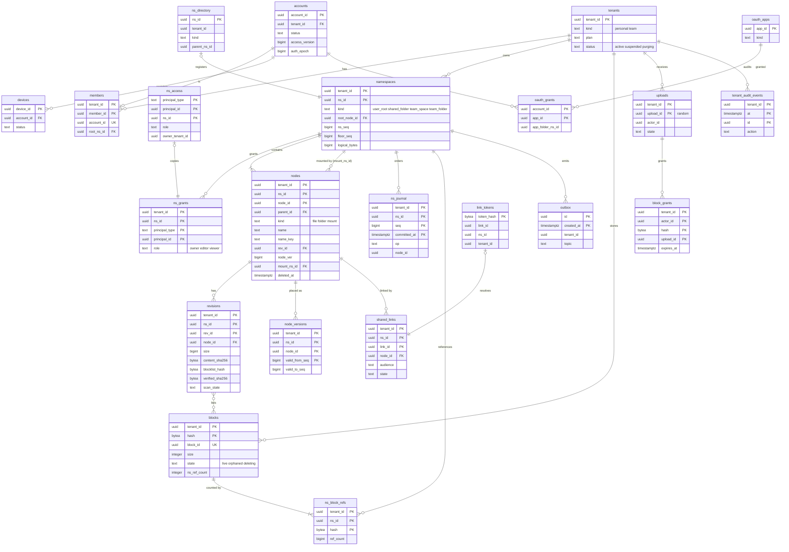
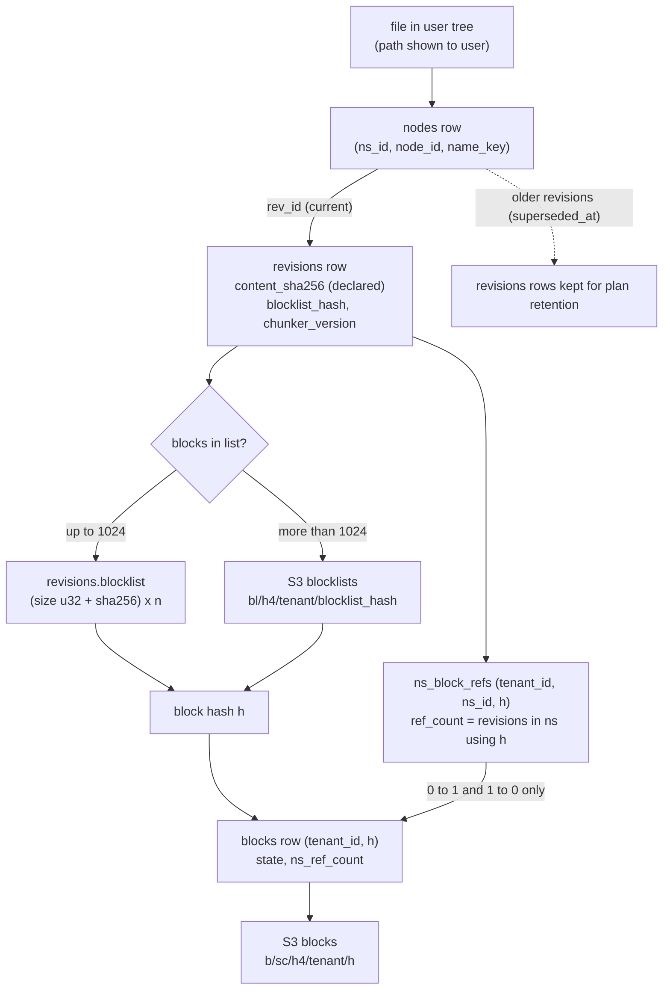
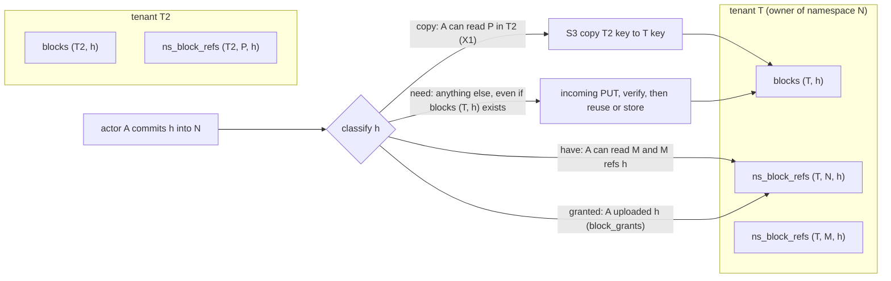
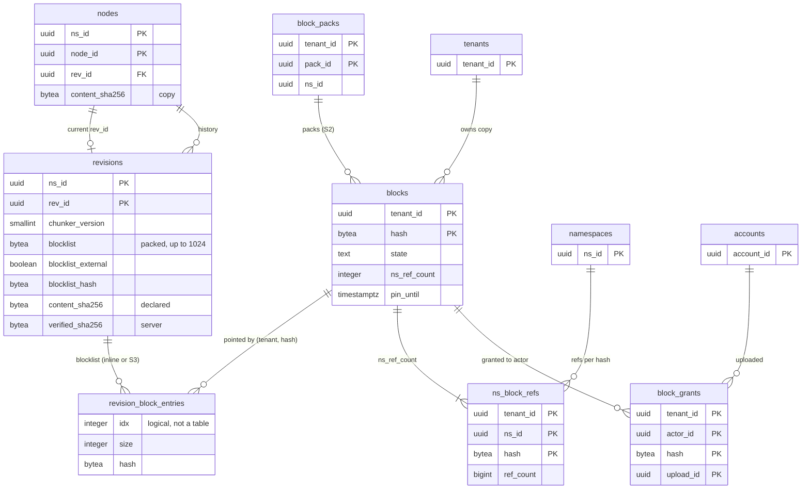

# Data model: Dropbox

データモデルの正本。規約、置き場所、全体の ER 図、ファイルが中身になる形の図、横断の不変条件、領域ごとの表の定義を、ここと [data-model/](data-model/) に置く。

- **列・制約・索引の正本は、このファイルと `data-model/` の各ファイル**である。領域の文書は振る舞いの正本で、各文書の「data-model への項目」の節は提案の記録として残す。両者が食い違ったら、このデータモデルに合わせて領域の文書を直す。
- 実装の変更（開発リポジトリの `changes/`）でマイグレーションを書くときは、同じ PR でここを更新する。マイグレーションの順序は [delivery.md](delivery.md) の 7 節（広げる → 埋めて移る → 縮める → 消す）。
- 方針の元は [ADR-0002](../decisions/0002-chunking-and-block-addressing.md)（ブロックとハッシュ）、[ADR-0003](../decisions/0003-dedupe-scope-and-privacy.md)（重複排除）、[ADR-0004](../decisions/0004-tenancy-namespaces-and-rls.md)（テナント・名前空間・RLS）、[ADR-0005](../decisions/0005-namespace-journal-and-cursors.md)（`ns_seq` とジャーナル）、[ADR-0007](../decisions/0007-block-storage-layout-on-s3.md)（S3）、[ADR-0008](../decisions/0008-node-identity-and-names.md)（ノードと `name_key`）、[ADR-0044](../decisions/0044-encryption-keys-and-secrets.md)（鍵）、[ADR-0045](../decisions/0045-audit-log-and-data-lifecycle.md)（監査と保持）。
- 「S1 の量」は、S1（アカウント 50 万、物理 13 PB、ノード 25 億）での**初期見積もり**である。元は [capacity.md](capacity.md) の 1・5 節。E13 の負荷試験で置き換える。
- 保持の期間の多くは**法務の確認待ち（L6 ほか）**である。結論まで、表の「保持」は既定の値を書き、[security.md](security.md) の 8.1 節と `retention_policies` を正本にする。

## 1. ファイルの構成

| ファイル | 領域 | 表の数 |
| --- | --- | --- |
| [data-model/tenants-accounts-and-teams.md](data-model/tenants-accounts-and-teams.md) | テナント、アカウント（`auth` スキーマ）、メンバー、グループ、ドメイン、SSO、SCIM、招待、管理の役割、管理者のアクセス、プランと容量、チームの方針 | 19 |
| [data-model/devices-and-sessions.md](data-model/devices-and-sessions.md) | Web のセッション、端末、端末の資格情報、消去の報告、通知のトークン | 5 |
| [data-model/namespaces-and-membership.md](data-model/namespaces-and-membership.md) | 名前空間、名前空間の登録簿、主体 → 名前空間、付与、共有の招待、マウントのビュー、外したときの写し | 6＋ビュー 1 |
| [data-model/nodes-and-revisions.md](data-model/nodes-and-revisions.md) | ノード（マウントを含む）、中身のリビジョンとブロックの一覧、置き場所のバージョン | 3 |
| [data-model/journal-and-cursors.md](data-model/journal-and-cursors.md) | ジャーナル、名前空間をまたぐバッチ、待たせる部分木、outbox、全体の `epoch` | 5 |
| [data-model/blocks-and-storage.md](data-model/blocks-and-storage.md) | ブロックの索引、名前空間ごとの参照、アップロード、許可、セッションの一覧、GC の記録、中身の待ち、パック（S2）、照合の記録 | 10 |
| [data-model/sharing-and-links.md](data-model/sharing-and-links.md) | 共有リンク、トークンの索引、アクセスの記録、帯域、通報 | 5 |
| [data-model/versions-and-recovery.md](data-model/versions-and-recovery.md) | 巻き戻しと復元の作業、飛ばした記録、一斉の変更の検知、プランの保持の期間、完全な削除の予約 | 5 |
| [data-model/previews-and-search.md](data-model/previews-and-search.md) | プレビューのキャッシュの行、抽出したテキスト、索引の追いつき | 3 |
| [data-model/mobile-and-camera.md](data-model/mobile-and-camera.md) | カメラのアップロードの重複の防止、設定、通知 | 3 |
| [data-model/api-apps-and-webhooks.md](data-model/api-apps-and-webhooks.md) | OAuth のアプリ・認可・トークン・コード、チームのアプリの方針、Webhook の送信の記録、サーバーで組み立てるダウンロード | 7 |
| [data-model/security-audit-and-lifecycle.md](data-model/security-audit-and-lifecycle.md) | 監査ログ、連鎖の値、保持の方針、法的な保全、テナントの消去、SLI の記録、テナントの登録簿（S2） | 9 |
| [data-model/client-local-db.md](data-model/client-local-db.md) | 端末の SQLite：3 つの木、意図の記録、送った commit、止めた削除、カーソル、手元のブロックの索引、カメラの項目、オフラインの保存 | 13（端末） |
| [data-model/stores.md](data-model/stores.md) | DB の外：S3 のキー、Valkey の鍵、SQS・SNS と outbox の話題、WebSocket の合図、カーソルとトークンの形、Webhook、OpenSearch、AppConfig、OS の鍵の保管庫 | — |

合計：サーバー 80 表とビュー 1（うち S2 で使うもの 2：`block_packs`・`tenant_directory`）、端末 13 表。ER 図は領域ごとに 13 個（`stores.md` を除く）、4 節の全体図 1 個、5 節の中身の概念図 3 個（流れ図 2、ER 図 1）。

## 2. 置き場所

| 置き場所 | 中身 | 詳細 |
| --- | --- | --- |
| Aurora PostgreSQL 18（S1 は `main` の 1 クラスタ） | メタデータの唯一の正本。スキーマは `public`・`auth`・`maint`（3.1 節） | 3.12 節、[infrastructure.md](infrastructure.md) の 4 節 |
| S3 `incoming`・`blocks`・`blocklists` | ブロックの中身の正本、大きなファイルのブロックの一覧、S2 のパック | [data-model/stores.md](data-model/stores.md) の 1 節 |
| S3 `previews`・`exports`・`audit` | プレビューと抽出したテキスト（作り直せる）、組み立てたダウンロード（1 日）、監査の写しと活動の事象 | 同 1 節 |
| ElastiCache（Valkey） | 合図の pub/sub、ジャーナルの末尾、パスの解決、レート制限、取り消しの一覧、キャッシュ。失ってよい | 同 2 節 |
| SNS・SQS | outbox から流す仕事、S3 のイベント、sandbox のジョブと結果 | 同 3 節 |
| OpenSearch | 名前と本文の索引（写し） | 同 7 節 |
| AppConfig | `release.*`・`ops.*`・`client.*`・`content_scan_policy` | 同 8 節、[delivery.md](delivery.md) の 3 節 |
| Firehose → S3（Parquet）、CloudWatch Logs、AMP | ファイルの活動の事象、端末の計測 | 同 1 節、[observability.md](observability.md) の 4 節 |
| 端末（SQLite `sync.db`、OS の鍵の保管庫） | 3 つの木、意図の記録、手元のブロックの索引、資格情報 | [data-model/client-local-db.md](data-model/client-local-db.md) |

## 3. 規約

### 3.1 スキーマ

| スキーマ | 中身 | RLS |
| --- | --- | --- |
| `public` | 名前空間の表、テナントの表、RLS の外の登録簿（`tenants`・`ns_directory`・`ns_access`・`link_tokens`・`oauth_*` など） | 名前空間の表とテナントの表は FORCE RLS（3.3 節） |
| `auth` | Better Auth の表（アカウント、メールアドレス、Web のセッション、外部のアカウント、検証の値、パスキー）、端末、端末の資格情報、消去の報告、通知のトークン | なし。`auth` のロールだけ（[ADR-0041](../decisions/0041-accounts-auth-and-device-credentials.md)） |
| `maint` | 保守用：`platform_state`、プラットフォームの監査、連鎖の値、SLI の記録、照合の記録、テナントの消去の進み、S2 のテナントの登録簿 | なし。保守のロールだけ |

### 3.2 ID

| 種類 | 型 | 作り方 | 対象 |
| --- | --- | --- | --- |
| UUIDv7 | `uuid` | PostgreSQL 18 の `uuidv7()`。クライアントが作るものはない | ほぼすべての ID（`tenant_id`、`ns_id`、`node_id`、`rev_id`、`account_id`、`member_id`、`device_id`、`link_id`、`batch_id`、`job_id`、`block_id`、`event_id` など） |
| 128 ビットの乱数 | `uuid`（v4） | `gen_random_uuid()` | `upload_id` だけ。`incoming` のキーの先頭を時刻で偏らせない（[ADR-0007](../decisions/0007-block-storage-layout-on-s3.md)） |
| 名前空間の番号 | `bigint` | `namespaces.ns_seq` を行のロックの下で進める | `ns_journal.seq`、`node_versions.valid_from_seq`、`revisions.created_seq` ほか |
| 内容の番地 | `bytea`（32 バイト） | SHA-256 | ブロックの `hash`、`content_sha256`、`blocklist_hash`、`verified_sha256`（3.5 節） |
| 秘密のハッシュ | `bytea`（32 バイト） | SHA-256（トークン）、Argon2id の文字列（パスワード） | `token_hash`、`code_hash`、`secret_hash`、`password_hash` |
| 組の主キー | 列の組 | — | `ns_block_refs`、`ns_grants`、`ns_access` など |

- **`node_id` は名前空間をまたぐ移動でも変わらない**（[ADR-0008](../decisions/0008-node-identity-and-names.md)）。コピーは新しい `node_id` を振る。
- **`rev_id` は名前空間をまたぐ移動で引き継ぐ。** 移動の途中（隠した入れ物に写してから元を消すまで）は、同じ `rev_id` の行が 2 つの名前空間にある。だから `rev_id` の一意は `(ns_id, rev_id)` で守る（D-8）。
- クライアントの仮の ID（`tmp:` ＋ UUIDv7）はサーバーの表に入れない。`create` の `temp_id` は応答で `node_id` に付け替える（[metadata-and-journal.md](metadata-and-journal.md) の 4.1 節）。
- API と JSON では ID を UUID の文字列で返す。指し方は `id:<node_id>`・`ns:<ns_id>/…`・`rev:<rev_id>`（[api-and-webhooks.md](api-and-webhooks.md) の 4.3 節）。Webhook の本文のアカウントの ID だけは `acc_` ＋ 26 文字（[data-model/stores.md](data-model/stores.md) の 5 節）。

### 3.3 テナント・名前空間と RLS

[ADR-0004](../decisions/0004-tenancy-namespaces-and-rls.md) の形を、表の単位で次のように決める。

**名前空間の表**（`tenant_id`・`ns_id` を持ち、主キーと索引の先頭に置く）。ポリシーは `ns_id` だけで絞る。

```sql
ALTER TABLE <t> ENABLE ROW LEVEL SECURITY;
ALTER TABLE <t> FORCE ROW LEVEL SECURITY;
CREATE POLICY ns_scope ON <t>
  USING      (ns_id = ANY (current_setting('app.ns_ids')::uuid[]))
  WITH CHECK (ns_id = ANY (current_setting('app.ns_ids')::uuid[]));
```

- `tenant_id` はポリシーに入れない。1 つのトランザクションで、持ち主のテナントの違う 2 つの名前空間を書くことがある（名前空間をまたぐ移動の「出す」の段。[ADR-0022](../decisions/0022-cross-namespace-batch-move-and-copy.md)）。`tenant_id` の正しさは、`(tenant_id, ns_id)` → `namespaces` の外部キーで守る。
- `current_setting` の `missing_ok` を使わない。`app.ns_ids` がなければ問い合わせ自体が失敗する（安全側）。
- `app.ns_ids` に入れるのは 1,000 以下。超えたらバッチに分ける（[ADR-0004](../decisions/0004-tenancy-namespaces-and-rls.md)）。

| 名前空間の表 | ファイル |
| --- | --- |
| `namespaces`、`ns_grants`、`ns_invites`、`ns_mounts`（ビュー、`security_invoker`） | [namespaces-and-membership.md](data-model/namespaces-and-membership.md) |
| `nodes`、`revisions`、`node_versions` | [nodes-and-revisions.md](data-model/nodes-and-revisions.md) |
| `ns_journal`、`ns_batches`（元か先のどちらかの名前空間）、`locked_subtrees` | [journal-and-cursors.md](data-model/journal-and-cursors.md) |
| `ns_block_refs` | [blocks-and-storage.md](data-model/blocks-and-storage.md) |
| `shared_links`、`link_access_events` | [sharing-and-links.md](data-model/sharing-and-links.md) |
| `pending_purges` | [versions-and-recovery.md](data-model/versions-and-recovery.md) |
| `preview_entries`、`extracted_texts`、`index_checkpoints` | [previews-and-search.md](data-model/previews-and-search.md) |
| `camera_upload_index` | [mobile-and-camera.md](data-model/mobile-and-camera.md) |

**テナントの表**（`tenant_id` を持ち、主キーの先頭に置く）。ポリシーは `tenant_id = current_setting('app.tenant_id')::uuid`。トランザクションのテナントは、操作する名前空間の持ち主にする（[ADR-0004](../decisions/0004-tenancy-namespaces-and-rls.md)）。

| テナントの表 | ファイル |
| --- | --- |
| `members`、`groups`、`group_members`、`team_domains`、`team_sso_configs`、`scim_tokens`、`team_invitations`、`admin_role_assignments`、`admin_member_access_grants`、`tenant_plans`、`tenant_usage`、`team_policies` | [tenants-accounts-and-teams.md](data-model/tenants-accounts-and-teams.md) |
| `membership_copy_jobs` | [namespaces-and-membership.md](data-model/namespaces-and-membership.md) |
| `blocks`、`uploads`、`upload_blocks`、`upload_session_entries`、`block_grants`、`block_gc_log`、`content_pending_blocks`、`block_packs`（S2） | [blocks-and-storage.md](data-model/blocks-and-storage.md) |
| `link_bandwidth_daily` | [sharing-and-links.md](data-model/sharing-and-links.md) |
| `rewind_jobs`、`rewind_skips`、`mass_change_events`、`tenant_retention_settings` | [versions-and-recovery.md](data-model/versions-and-recovery.md) |
| `camera_upload_settings`、`notification_events` | [mobile-and-camera.md](data-model/mobile-and-camera.md) |
| `team_app_policies`、`export_jobs` | [api-apps-and-webhooks.md](data-model/api-apps-and-webhooks.md) |
| `tenant_audit_events`、`legal_holds` | [security-audit-and-lifecycle.md](data-model/security-audit-and-lifecycle.md) |
| `outbox`（書き込みだけテナントの文脈。読み出しは Relay の X4） | [journal-and-cursors.md](data-model/journal-and-cursors.md) |

**RLS の外の表**（[ADR-0004](../decisions/0004-tenancy-namespaces-and-rls.md) の一覧の具体）。ファイルの名前・パス・中身の列を持たない。読めるのは決めた DB のロールだけ（3.4 節）。CI のスキーマの検査は、この表の一覧と、上の 2 つの一覧のすべてに FORCE RLS とポリシーがあることを照らす。

| 種類 | 表 | 読むロール |
| --- | --- | --- |
| アカウントとログイン（`auth`） | `accounts`、`account_emails`、`web_sessions`、`external_identities`、`verifications`、`passkeys`、`devices`、`device_credentials`、`device_wipe_reports`、`push_tokens` | `auth`（`api`・`notify`・`link` はトークンの検証の関数だけ） |
| 登録簿 | `tenants`、`ns_directory`、`ns_access`、`link_tokens` | `auth`・`access`・`link`・`relay` |
| 公開 API | `oauth_apps`、`oauth_grants`、`oauth_tokens`、`oauth_codes`、`webhook_deliveries` | `auth`（OAuth）、`webhook` |
| 運用 | `abuse_reports`、`plan_features`、`retention_policies` | `abuse_ops`、全ロール（`plan_features`・`retention_policies` は読むだけ） |
| 保守（`maint`） | `platform_state`、`platform_audit_events`、`audit_chain_heads`、`tenant_purge_jobs`、`delivery_samples`、`slo_minutely`、`integrity_audit_runs`、`tenant_directory`（S2） | `maint`・`slo`・`auditor` |

**テナントをまたぐ経路**（X1〜X5。[ADR-0004](../decisions/0004-tenancy-namespaces-and-rls.md)）。それぞれ専用の DB のロールと関数を通す。

| 経路 | 中身 | DB のロール・関数 | 触れる表 |
| --- | --- | --- | --- |
| X1 | 重複排除の写し：読める他のテナントの名前空間のブロックを、書き込み先のテナントへ S3 の中で写す | `x1_copy`。元のテナントの `ns_block_refs` を `app.ns_ids` の中で読み、先のテナントの文脈で `blocks` を書く | `ns_block_refs`、`blocks` |
| X2 | 共有リンクの解決 | `link`。`link_resolve(token_hash)` が `link_tokens` から `(tenant_id, ns_id, link_id)` を返し、その名前空間の文脈で読む | `link_tokens`、`shared_links`、`nodes`、`revisions` |
| X3 | システムの作業（GC、照合、容量の集計、保持の期限、テナントの消去、通知の行の作成） | `gc`・`lifecycle`・`quota`・`scrubber`・`purge`・`notifier`。テナントを 1 つずつ `app.tenant_id` に設定し、名前空間は `app.ns_ids` に 1,000 ずつ入れる | 各表 |
| X4 | Relay の outbox の読み出し、SLI の集計 | `relay`（`outbox` の `SELECT` と `sent_at` の `UPDATE` だけ、`BYPASSRLS`）、`slo` | `outbox`、`ns_journal`（集計の読み取りだけ）、`maint.*` |
| X5 | 共有の参加と退出の反映 | `access`。外したメンバーのルートに `unmount` を書く。参加は招かれた人のテナントの文脈で、招待を `ns_invite_resolve()` で引く（D-21） | `ns_grants`、`ns_access`、`ns_invites`、`nodes`、`ns_journal` |

- ログインの入口でメールアドレスのドメインからチームを引く処理は、ADR-0004 の「メールアドレスからアカウントの解決」に含め、`auth_resolve_domain()` だけで行う（D-20）。
- 一覧にない経路を足すときは、先に ADR-0004 を直す。

### 3.4 DB のロール

サービスごとにロールを分ける。人の常時のアクセスはない（JIT と break-glass だけ。[security.md](security.md) の 9 節）。

| ロール | 使う | 主な権限 |
| --- | --- | --- |
| `migrator` | マイグレーション | 所有者。DDL |
| `committer` | `packages/committer`（`api`・`restore-runner`・`lifecycle`・`tenant-purge`・`batch-runner`） | `namespaces`（`ns_seq`・`floor_seq`・`logical_bytes`・`share_state`）、`nodes`・`revisions`・`node_versions`・`ns_journal`・`ns_block_refs`・`locked_subtrees`・`ns_batches` の書き込み。`blocks` の `ns_ref_count`・`state`（`live`↔`orphaned`）。`outbox` の `INSERT`。**ノードとジャーナルを書けるのはこのロールだけ**（[ADR-0005](../decisions/0005-namespace-journal-and-cursors.md)） |
| `committer_maint` | 保守の経路の埋め | `nodes.name_key_next` の `UPDATE` だけ（D-4） |
| `api` | `api`・`notify` | 名前空間の表とテナントの表の `SELECT`。`uploads`・`upload_blocks`・`upload_session_entries`・`export_jobs`・`shared_links`（作成の関数）・`pending_purges`・`rewind_jobs` の書き込み |
| `access` | `packages/access`、X5 | `ns_grants`・`ns_access`・`ns_invites`・`ns_directory`、`accounts.access_version` |
| `verifier` | `block-verifier` | `blocks`（作成、`pin_until`）、`block_grants` の `INSERT`、`upload_blocks.state` |
| `gc` | `block-gc` | `blocks` の `deleting` と削除、`block_gc_log` の `INSERT` |
| `x1_copy` | X1 | 3.3 節 |
| `link` | `link` | `link_tokens`・`shared_links` の読み出し、`link_bandwidth_daily`、`link_resolve()` |
| `auth` | `auth` | `auth` スキーマ、`tenants`、`members`・`team_*`・`scim_tokens`・`admin_*`・`tenant_plans` の書き込み、`auth_resolve_domain()` |
| `webhook` | `webhook-fanout`・`webhook-sender` | `oauth_apps`・`oauth_grants` の読み出し、`webhook_deliveries`、`ns_access` の読み出し |
| `relay` | `relay` | 3.3 節の X4 |
| `lifecycle`・`quota`・`scrubber`・`purge`・`notifier` | X3 の Worker | X3。`purge` は `tenant_purge_jobs`、`notifier` は `notification_events` |
| `audit_writer` | すべての書き込みのサービス | `tenant_audit_events` の `INSERT` だけ |
| `auditor` | 監査の画面と書き出し | `tenant_audit_events` の `SELECT`（RLS の中）、名前の列を持たないビュー |
| `abuse_ops` | 通報の受付 | `abuse_reports` |
| `maint`・`slo` | 保守、`slo-aggregator`、照合 | `maint` スキーマ |
| `investigator` | 運用者の JIT | 名前の列（`nodes.name`、`node_versions.name`）を除いたビューだけ（[security.md](security.md) の 9 節） |

- どのロールにも `ns_journal`・`tenant_audit_events`・`platform_audit_events` の `UPDATE` を与えない。削除は保持のジョブ（分割を落とす）だけ。
- `nodes`・`revisions`・`node_versions`・`ns_journal` への直接の書き込みを、`committer` 以外のロールで拒む。結合テストで確かめる（[ADR-0005](../decisions/0005-namespace-journal-and-cursors.md) の Confirmation）。

### 3.5 名前と `name_key`

[ADR-0008](../decisions/0008-node-identity-and-names.md)。

- **名前を持つ列は決めた所だけ**：`nodes.name`・`name_key`、`node_versions.name`・`name_key`、`ns_journal.name`、OpenSearch の名前の索引、S3 `exports` の目録、端末の 3 つの木。ほかの表・ログ・キュー・監査ログに、ファイルの名前・パス・中身を持たせない。共有フォルダー・チームのフォルダーの名前は、載せる側のマウントのノードの名前で持つ（`namespaces` は名前を持たない）。
- `name`：受けた名前を NFC にしたもの。大文字小文字を保つ。CHECK で、空・`.`・`..`・`/`・NUL・制御文字（U+0000〜U+001F、U+007F）を拒み、`octet_length(name) <= 255` を守る。
- `name_key`：NFC → Unicode の完全な case folding → NFC。`names_version` の固定の表で作る。DB の関数では作らない（Rust と TypeScript の `packages/names` で作り、DB は受けるだけ）。DB の照合順序は `"C"` に固定し、OS や ICU の照合に任せない。
- 一意：`UNIQUE (ns_id, parent_id, name_key) WHERE deleted_at IS NULL`（`nodes_live_name_uk`）。マウントのノードも入る。
- 2 段の置き場所：1 つの commit で動くノードは、1 段目で `name_key = E'\\x00' || node_id::text` にする。NUL は名前に使えないので、他の名前とぶつからない（[ADR-0021](../decisions/0021-committer-operations-and-conditions.md)）。CHECK は「NUL で始まる `name_key` は `'\x00' || node_id` と等しい」だけを許す。
- `names_version` を上げる移行では、影の列 `name_key_next` を足して埋め、一意の索引を切り替える（[delivery.md](delivery.md) の 6.3 節、D-4）。
- パスの写しを持つ表を作らない。パスは親をたどって作る（深さ 256）。

### 3.6 ハッシュ

[ADR-0002](../decisions/0002-chunking-and-block-addressing.md)、[ADR-0046](../decisions/0046-content-scanning-framework.md)。すべて `bytea` で 32 バイト（`CHECK (octet_length(x) = 32)`）。

| 値 | 中身 | 誰が計算するか | 信用 | 使う所 |
| --- | --- | --- | --- | --- |
| `hash`（ブロック） | 平文のブロックの SHA-256 | クライアントが計算し、S3 のチェックサムと `block-verifier` が確かめる | 信用できる | `blocks`、`ns_block_refs`、`block_grants`、`revisions.blocklist`、S3 のキー |
| `content_sha256` | ファイル全体の SHA-256 | クライアントの申告。サーバーは commit で確かめない（抜き取りだけ） | **信用しない**（表示・同一性の比べ・重複の防止にだけ使う） | `revisions`、`nodes`（写し）、`ns_journal`、`camera_upload_index`、API |
| `blocklist_hash` | `SHA-256("<brand>-blocklist-v1" ‖ chunker_version ‖ 各ブロックの（大きさ u32 BE ‖ SHA-256）)` | クライアントが計算し、サーバーが一覧から計算し直して確かめる | 信用できる | `revisions`、S3 `blocklists` のキー、端末のアップロードの再開 |
| `verified_sha256` | ファイル全体の SHA-256 | `content-scanner` が sandbox の中で検証済みのブロックをつないで計算する | 信用できる | `revisions`。違法なコンテンツのハッシュの照合はこれだけを使う |

- `chunker_version`：`0`（4 MiB の固定。公開 API）・`1`（CDC）。`smallint`。サーバーは境界の正しさを確かめず、大きさの上限と `blocklist_hash` だけを確かめる（[ADR-0018](../decisions/0018-upload-sessions-and-block-grants.md)）。
- 空のファイルはブロックを持たない。`blocklist_hash` は空の一覧の値、`content_sha256` は空の入力の SHA-256。
- `content_sha256` と `verified_sha256` が違えば、`scan_state = integrity_mismatch`。

### 3.7 バージョンと番号

| 値 | 置き場所 | 進め方 | 意味 |
| --- | --- | --- | --- |
| `ns_seq` | `namespaces.ns_seq` | `packages/committer` が commit の最初に `UPDATE … SET ns_seq = ns_seq + n RETURNING`（行のロック） | 名前空間の中の操作の順。単調、欠けなし（[ADR-0005](../decisions/0005-namespace-journal-and-cursors.md)） |
| `floor_seq` | `namespaces.floor_seq` | 特別な場合（テナントの削除、名前空間の作り直し、手での修復）だけ上げる | これより古い位置のカーソルは取り直し（`truncated`） |
| `epoch` | `maint.platform_state.epoch` | DR の切り替えと、運用者の DB の時点への戻しでだけ上げる | 違うカーソルは取り直し（`epoch`）。利用者の復元・巻き戻しでは上げない |
| `rev_id` | `revisions`、`nodes.rev_id` | 中身が変わるたびに新しい行 | 中身の条件（`base_rev`） |
| `node_ver` | `nodes.node_ver` | 親・名前・削除の状態が変わるたびに 1 上げる | 置き場所の条件（`base_node_ver`） |
| `access_version` | `auth.accounts.access_version` | 主体に関わる付与・グループ・方針・端末の変更で上げる | `acc:` のキャッシュの鍵 |
| `auth_epoch` | `auth.accounts.auth_epoch` | 全セッションの取り消しで上げる | トークンの検証 |
| `password_version` | `shared_links.password_version` | パスワードを変えるたびに上げる | `lk_<link_id>` の Cookie |
| `renderer_version`・`extractor_version`・`index_version`・`chunker_version`・`names_version` | 各表 | コードのバージョンで決める（フラグにしない） | 作り直しの判定 |

- トリガーで、`ns_seq`・`node_ver`・`access_version`・`auth_epoch` を下げる更新を拒む。
- OpenSearch の文書のバージョンは `ns_seq`（`version_type=external`。[search.md](search.md) の 6 節）。

### 3.8 時刻

- 時刻は `timestamptz`（UTC で保存）。API は RFC 3339 の UTC で返す。
- 日付は `date`。日本時間の日を入れる（`link_bandwidth_daily.day`、`audit_chain_heads.day`）。
- 期限・保持の判断は DB の `now()` で行う。端末の時計を信じない（`client_modified_at` は表示だけ）。
- 列の名前：時刻は `_at`、日付は `day`、期限は `expires_at`・`pin_until`。

### 3.9 削除・墓石・消去

- **ノードは墓石にする。** `nodes.deleted_at`・`deleted_reason`（`user`・`moved`・`rewind`・`restore_replaced`）。フォルダーの削除は根の 1 行だけを変え、子孫は祖先の削除で見えなくなる（[ADR-0021](../decisions/0021-committer-operations-and-conditions.md)）。
- **古いリビジョン**は `revisions.superseded_at` を持ち、保持の期間（プラン）の間は残る。今のリビジョンは期限で消さない（[ADR-0029](../decisions/0029-revision-and-placement-retention.md)）。
- **消去（purge）**は `lifecycle` が `packages/committer` で行う。行を消し、`ns_block_refs` を減らし、`ns_journal` に `purge` の 1 行を書く（利用者に返さない）。ジャーナルを通らない削除を作らない。
- **ブロック**は `live` → `orphaned` → `deleting` → 行の削除。S3 は削除のマーカーの後 30 日で消える（[ADR-0019](../decisions/0019-block-refcount-and-gc-protocol.md)）。
- **テナントの消去**は `tenants.status = purging` → `maint.tenant_purge_jobs` が名前空間とテナントの表を `tenant_id` で 1 万行ずつ消す（[ADR-0045](../decisions/0045-audit-log-and-data-lifecycle.md)）。
- **辺がない＝行がない**：`ns_grants`・`group_members`・`admin_role_assignments`・`block_grants` は取り消しで行を消す（履歴は監査ログ）。
- **追記だけ**：`ns_journal`、`tenant_audit_events`、`platform_audit_events`、`block_gc_log`、`link_access_events`。トリガーで `UPDATE` を拒む。
- 状態は `text` と `CHECK (… IN (…))` で持つ。PostgreSQL の列挙型を使わない（値の追加でロックを取らないため）。
- **法的な保全**（`legal_holds`）が立てば、`lifecycle`・`tenant-purge`・`block-gc`・完全な削除が対象を飛ばす。MVP に入れるかは法務の L6。

### 3.10 パーティションと保持

| 表 | パーティション（S1） | DB に置く期間 | その後 |
| --- | --- | --- | --- |
| `ns_journal` | `committed_at` の日（`pg_partman`） | 92 日（カーソルは最後の利用から 90 日。**L6 の確認待ち**） | 分割を `DROP` |
| `node_versions` | `ns_id` のハッシュで 64（D-5） | プランの保持（30・180・365 日。L6・L8） | `lifecycle` が消去 |
| `link_access_events` | `at` の日 | 90 日（**L3 の確認待ち**） | `DROP` |
| `tenant_audit_events` | `at` の月 | 1 年（L3・L6） | `DROP`（写しは S3 の Object Lock） |
| `outbox` | `created_at` の日 | 全部送って 1 日 | `DROP` |
| `maint.delivery_samples` | `served_at` の日 | 14 日 | `DROP` |
| `notification_events` | なし | 90 日 | 日次のジョブ |
| `block_gc_log` | なし | 37 日 | 日次のジョブ |
| `webhook_deliveries` | なし | 30 日 | 日次のジョブ |
| `camera_upload_index` | なし | 1 年 | 日次のジョブ |

- パーティションの境と主キー：分割した表の主キーは分割の鍵を含む（PostgreSQL の制約）。`ns_journal` の `(ns_id, seq)` の一意は、名前空間の行のロックと番号の連続の監視で守る（D-6）。
- パーティションは `pg_partman` で先に作る（日 14 個、月 3 個）。
- 保持の値の正本は [security.md](security.md) の 8.1 節と `retention_policies`。CI が Terraform の S3 のライフサイクルと比べる。

### 3.11 命名と型

- 表は英語の複数形の `snake_case`。列は `snake_case`。参照は `<単数形>_id`。主体を指す列は `actor_id`（操作した人の `account_id`）と `principal_type`・`principal_id`（付与の相手）。
- 内容のハッシュは `bytea`。ID は `uuid`。番号は `bigint`。大きさは `bigint`（バイト）。
- 形の決まった入れ子で検索しないもの（`policy`、`filters`、`signals`、`params`、`payload`）は `jsonb`。形は `packages/contract` の Zod で検証してから書く。
- 配列は上限の小さい集合（`redirect_uris`、`scopes`、`failed_node_ids` の 1,000 まで）にだけ使う。
- 秘密は平文で持たない。ハッシュの列は `*_hash`、封筒の暗号化の列は `*_ciphertext`（3.12 節）。

### 3.12 暗号化

[ADR-0044](../decisions/0044-encryption-keys-and-secrets.md)。鍵はデータの種類ごと・リージョンごとに分け、マルチリージョンの鍵を使わない。

| 鍵 | 使う場所 |
| --- | --- |
| `kms-aurora` | Aurora のクラスタとスナップショット（大阪は大阪の鍵） |
| `kms-blocks` | S3 `incoming`・`blocks`・`blocklists`・`exports` |
| `kms-previews` | S3 `previews` |
| `kms-audit` | S3 `audit`、活動の事象 |
| `kms-search`・`kms-cache` | OpenSearch、Valkey |
| `kms-secrets` | Secrets Manager、Aurora の封筒の暗号化の列（`oauth_apps.webhook_secret_ciphertext`・`webhook_secret_prev_ciphertext`、`shared_links.token_ciphertext`。D-24） |
| `kms-logs` | CloudWatch Logs、Firehose |

- **テナントごとの鍵を持たない。** 消去は行とオブジェクトを本当に消すことで行う。
- **ハッシュだけを持つ秘密**：アクセストークン・更新トークン（`device_credentials`、`oauth_tokens`）、認可コード、アプリの秘密、共有リンクのトークン（`link_tokens`）、招待・SCIM・ドメインの確認のトークンは SHA-256。共有リンクのパスワードは Argon2id。
- 人のロールは名前の列と中身を読めない（`investigator` のビュー、バケットと鍵の方針）。

### 3.13 クラスタと S2

S1 は `main` の 1 クラスタ（writer `db.r8g.16xlarge` 1 台＋reader 2 台、大阪に Global Database）。S2 で、名前空間の持ち主のテナントを単位に、複数のクラスタへ分ける（[ADR-0049](../decisions/0049-stage-up-criteria-sharding-and-cells.md)）。

| S2 のクラスタ | 表 |
| --- | --- |
| ディレクトリ（小さい、Global Database） | `auth` スキーマのすべて、`tenants`、`ns_directory`、`ns_access`、`link_tokens`、`maint.tenant_directory`、`oauth_*`・`webhook_deliveries`・`abuse_reports`・`plan_features`・`retention_policies`（D-23） |
| テナントのクラスタ（8〜12） | 名前空間の表とテナントの表のすべて、`outbox`、`maint` の SLI と照合の記録（クラスタごと） |

- テナントのすべての名前空間・ブロックの索引・参照は同じクラスタにある。commit はクラスタをまたがない（[ADR-0003](../decisions/0003-dedupe-scope-and-privacy.md)）。
- 名前空間をまたぐバッチ（[ADR-0022](../decisions/0022-cross-namespace-batch-move-and-copy.md)）と X1 は、各段が冪等なので、クラスタをまたいでもそのまま動く。`ns_batches` は元の名前空間のクラスタに置く。
- テナントのクラスタの移し方は、S2 の着手の前に別の ADR で決める。

## 4. 全体の ER 図

領域をまたぐ主な関係だけを描く。列の詳細は各領域の図にある。RLS の外の表との関係と、S2 で別のクラスタになる関係は論理の参照で、DB の外部キーを張らないものがある（各ファイルに書く）。



## 5. ファイル・リビジョン・ブロックと重複排除

### 5.1 概念の図

ファイルは、リビジョンの中のブロックの一覧（ハッシュの並び）で中身を指す。ブロックは「テナント × ハッシュ」で 1 回だけ置き、名前空間ごとの参照で数える。重複排除の答えは、要求した人が読める名前空間の参照だけを見る（[ADR-0003](../decisions/0003-dedupe-scope-and-privacy.md)）。





- 1 つ目の図：中身は `nodes` → `revisions` → ブロックの一覧 → `blocks` → S3 の順に指す。参照の数は `ns_block_refs` に名前空間ごとに持ち、`blocks.ns_ref_count` は「参照する名前空間の数」だけを持つ（[ADR-0019](../decisions/0019-block-refcount-and-gc-protocol.md)）。
- 2 つ目の図：同じ中身 h が、テナント T の名前空間 M と、テナント T2 の名前空間 P にある。A が N に commit すると、A が読める参照だけで「送らなくてよい」を決める。A が M も P も読めなければ、`blocks (T, h)` があっても `need` で、受け取ってから保存だけを重ねる。テナントをまたいで保存を重ねない（T と T2 は別の S3 のキー）。

### 5.2 ER 図（中身の鎖）



- `revision_block_entries` は表ではない。`revisions.blocklist` の 36 バイトの組（大きさ u32 ＋ SHA-256）か、S3 の `blocklists` のオブジェクトの中の 1 項目を表す（D-7）。

## 6. 横断の不変条件

| 不変条件 | 守り方（DB・ジョブ・試験） | 根拠 |
| --- | --- | --- |
| **参照のあるブロックを消さない**：保持の期間の中のリビジョン（今のものを含む）の一覧のすべてのブロックは `live` で、S3 にある | `ns_block_refs` を `packages/committer` が同じトランザクションで増減。`blocks.ns_ref_count` は 0↔1 のときだけ。GC は `orphaned` から 7 日・ピンなし・行のロックの下で 0 を確かめ直してから `deleting` を確定し、S3 の削除の後に行を消す。毎日の参照の監査、毎週の数え直し。S3 のバージョニング 30 日 | [ADR-0007](../decisions/0007-block-storage-layout-on-s3.md)、[ADR-0019](../decisions/0019-block-refcount-and-gc-protocol.md)、PROP-BLK-001・002 |
| **commit は `have`・`copy`・`granted` のブロックだけを受ける**：索引にあるだけでは受けない。`deleting` のブロックは `need` | `classify()` は `ns_block_refs` の `(tenant_id, hash, ns_id)` の索引（`app.ns_ids` の中）と `block_grants` だけを引く。commit の同じトランザクションで `blocks.state <> 'deleting'` を確かめる | [ADR-0018](../decisions/0018-upload-sessions-and-block-grants.md)、PROP-BLK-003 |
| **重複排除で他人の有無を漏らさない**：`need` の判定に書き込み先のテナントの索引の有無を使わない。URL・エラー・時間の形を揃える。容量は論理の大きさ | 上の索引の使い方。`incoming` への PUT をいつも求める。`logical_bytes`・`tenant_usage` は論理の大きさだけ。テナントをまたいで保存を重ねない（`blocks` の主キーに `tenant_id`、S3 のキーにテナント） | [ADR-0003](../decisions/0003-dedupe-scope-and-privacy.md)、PROP-BLK-004、NFR-007 |
| **ブロックは検証してから索引に入れる** | `blocks` の行は `verifier` のロールだけが作る。S3 の SHA-256 と大きさを `upload_blocks` と比べてから | [ADR-0007](../decisions/0007-block-storage-layout-on-s3.md) |
| **`ns_seq` は名前空間ごとに単調で、欠けも重なりもない** | `namespaces` の行のロックの下で振る。ロールバックした番号を使い回さない（同じトランザクションの中で振る）。下げる更新をトリガーで拒む。`slo-aggregator` が 1 分ごとに連続を確かめる | [ADR-0005](../decisions/0005-namespace-journal-and-cursors.md)、[observability.md](observability.md) の 3.4 節 |
| **ジャーナルを通らない書き込みがない**：ノード・リビジョン・置き場所の変更は、同じトランザクションで `ns_journal` と `outbox` に載る | `committer` のロールだけが書ける。復元・巻き戻し・保持の期限・管理者の操作も同じ経路。例外は影の列 `name_key_next` の埋めだけ（見え方を変えない。D-4） | [ADR-0005](../decisions/0005-namespace-journal-and-cursors.md) |
| **名前は親ごとに `name_key` で一意** | `UNIQUE (ns_id, parent_id, name_key) WHERE deleted_at IS NULL`。2 段の置き場所で、どの時点でも満たす。マウントのノードも入る | [ADR-0008](../decisions/0008-node-identity-and-names.md)、[ADR-0021](../decisions/0021-committer-operations-and-conditions.md)、PROP-META-003 |
| **黙って上書きしない**：書き込みはすべて条件つきで、ぶつかれば 409。同期の衝突は競合のコピーで残す | `create` は `name_key` の一意、`update` は `rev_id = base_rev`、`move`・`delete` は `node_ver = base_node_ver`、ファイルの `delete` は `base_rev` も、フォルダーの `delete` は `base_seq`。条件なしの上書きの操作を持たない（API の `overwrite` もサーバーが今の `rev` を `base_rev` にし、前の中身は履歴に残る） | [ADR-0006](../decisions/0006-sync-conflict-model.md)、[ADR-0021](../decisions/0021-committer-operations-and-conditions.md)、PROP-META-004 |
| **循環しない、深さ 256 段まで** | `move` の 2 段目の後に祖先をたどって確かめる | [ADR-0021](../decisions/0021-committer-operations-and-conditions.md)、PROP-META-006 |
| **名前空間をまたぐ移動の途中を見せない** | 隠した入れ物（`hidden_batch_id`）の行は一覧と差分から外す。`batch_id` の行は返さない。出すのは 1 トランザクション | [ADR-0022](../decisions/0022-cross-namespace-batch-move-and-copy.md)、PROP-META-005 |
| **読めない名前空間の行は読めない** | 名前空間の表は FORCE RLS（`app.ns_ids`）、テナントの表は FORCE RLS（`app.tenant_id`）。CI のスキーマの検査（3.3 節の一覧）。返す前に `can()` | [ADR-0004](../decisions/0004-tenancy-namespaces-and-rls.md)、NFR-007 |
| **RLS の外の表はファイルの名前・パス・中身を持たない** | スキーマの lint（列の名前の一覧）。3.3 節の一覧を CI が照らす | [ADR-0004](../decisions/0004-tenancy-namespaces-and-rls.md) |
| **カーソルの続きはジャーナルの保持の中にある** | `list/continue` のたびに位置を今の `ns_seq` まで進めて出し直す。最後の利用から 90 日で取り直し、分割は 92 日 | [ADR-0005](../decisions/0005-namespace-journal-and-cursors.md)、[ADR-0023](../decisions/0023-tree-listing-snapshot-and-journal-retention.md) |
| **今のリビジョンと見えているノードの今のバージョンは期限で消さない** | `packages/committer` が今のリビジョンの `purge` を拒む。`nodes.rev_id` → `revisions` の外部キー | [ADR-0029](../decisions/0029-revision-and-placement-retention.md) |
| **復元・巻き戻しは途中の変更を上書きしない** | 計画の時の `rev_id`・`node_ver` を条件にし、409 は `rewind_skips` に記録 | [ADR-0030](../decisions/0030-restore-and-rewind-as-journaled-batches.md)、PROP-VER-003 |
| **容量の超過とプランの変更で中身を消さない** | 容量は commit の判定にだけ使い、削除のジョブに入れない | [ADR-0026](../decisions/0026-membership-lifecycle-and-quota.md)、[ADR-0042](../decisions/0042-teams-sso-scim-and-plans.md) |
| **ハッシュの照合はサーバーが計算した値だけを使う** | 照合の入力は `verified_sha256`。`content_sha256` と違えば `integrity_mismatch` | [ADR-0046](../decisions/0046-content-scanning-framework.md) |
| **プレビューを使い回さない**：リビジョンごとに作る | `preview_entries` の主キーに `rev_id`。同じ `content_sha256` の別のリビジョンでも作り直す | [ADR-0033](../decisions/0033-preview-cache-and-delivery.md) |
| **監査は追記だけで、連鎖が切れない** | `UPDATE`・`DELETE` をトリガーで拒む（分割の `DROP` を除く）。`row_hash = SHA-256(prev_hash ‖ 行)`。日の終わりの値を Object Lock へ | [ADR-0045](../decisions/0045-audit-log-and-data-lifecycle.md) |
| **端末の意図の記録**：手元の操作は「意図 → 操作 → 結果」の順で、二重に消す・作ることがない | `intents` の `prepared` を `synchronous=FULL` で書く。再起動で観測と期待で解く | [ADR-0010](../decisions/0010-local-state-db-and-intent-log.md)、PROP-SYNC-007 |
| **Synced は確かめた結果でしか進まない** | 端末の `synced_nodes` は、commit の成功か手元の操作の完了の後にだけ書く | [ADR-0006](../decisions/0006-sync-conflict-model.md)、PROP-SYNC-006 |

## 7. この工程で決めたこと（2026-10-09）

領域の文書と ADR の間で、名前・列・置き場所が決まっていなかったところを、推奨の案で決めた。ADR の決定は変えていない。[architecture/README.md](README.md) の 6 節にも要点を書いた。

| # | 決めたこと | 理由 |
| --- | --- | --- |
| D-1 | スキーマを `public`・`auth`・`maint` の 3 つにする | RLS の外の表を、ロールの単位で分けて守る |
| D-2 | ノードの種類の正本は `nodes.kind`（`file`・`folder`・`mount`）。`is_folder` は `kind <> 'file'` の生成の列にし、`nodes`・`node_versions`・`ns_journal` に置く。`ns_journal` と `node_versions` も `kind`・`mount_ns_id` を持つ | ADR-0005 の `is_folder` の列を残しつつ、マウントのノードの名前の変更を `upsert` で正しく伝える |
| D-3 | `ns_mounts` は `nodes WHERE kind = 'mount'` のビュー（`security_invoker = true`）にする | 写しの表を同期する仕組みが要らない。RLS はもとの表で効く |
| D-4 | `names_version` の影の列 `name_key_next` の埋めは、ジャーナルに載せない。`committer_maint` のロールがこの列だけを書ける。新しい鍵でぶつかる名前の解き方（名前の変更）は普通の commit でジャーナルに載せる | 見え方が変わらない埋めを 25 億行のジャーナルに載せると、保持の 92 日の容量を超える |
| D-5 | `node_versions` は月ではなく `ns_id` のハッシュで 64 に分ける | 今のバージョンの行は期限で消えず、月の分割を落とせない。時点の木の問い合わせは名前空間ごと |
| D-6 | 分割した表の主キーは分割の鍵を含める（`ns_journal` は `(tenant_id, ns_id, seq, committed_at)`）。`(ns_id, seq)` の一意は行のロックと連続の監視で守る | PostgreSQL の分割の制約 |
| D-7 | `revisions.blocklist` は 1 項目 36 バイト（大きさ u32 BE ＋ SHA-256）を並べた `bytea`。1,024 を超えたら `blocklist_external = true` にし、S3 のキーは `tenant_id` と `blocklist_hash` から作る | 列を 1 つにし、S3 の番地を別の列に持たない |
| D-8 | `rev_id` は名前空間をまたぐ移動で引き継ぎ、`revisions` の一意は `(ns_id, rev_id)` で守る | バージョン履歴がファイルに付いていく（ADR-0022）。端末の Synced の `rev_id` を変えない |
| D-9 | `ns_journal` に `on_behalf_of` を足す | 管理者のアクセスの書き込みを、ジャーナルと監査ログに載せる（ADR-0043） |
| D-10 | `outbox` の表を決める。書き込みはテナントの文脈（`WITH CHECK (tenant_id = app.tenant_id)`）、読み出しは Relay の X4 | ADR-0005 の outbox の形が決まっていなかった |
| D-11 | `export_jobs`（テナントの表）を足す | `files/export/status` に答える行が要る。`export-builder` は DB に書かない（ADR-0054）ので、API が `export-results` を受けて書く |
| D-12 | `block_packs`（テナントの表、S2）を足す | 詰め直しの判定（生きているバイトが 50% 未満。ADR-0020）にパックごとの量が要る |
| D-13 | `tenant_purge_jobs` は `maint` に置く | 消すテナントの行と一緒に消えないようにする |
| D-14 | テナント・名前空間の表の主キーの先頭に `tenant_id` を置く（`locked_subtrees` は `(tenant_id, ns_id, root_node_id)`、`rewind_skips` は `(tenant_id, job_id, node_id)`） | ADR-0004 の「主キーとインデックスの先頭に置く」に揃える |
| D-15 | `ns_batches.tenant_id` は元の名前空間のテナント。先のテナントは `dst_tenant_id` に持つ。RLS は元か先のどちらかの名前空間 | 元の部分木を待たせる行と同じテナントに置く |
| D-16 | `ns_directory` に `kind`・`parent_ns_id` を持つ | `packages/access` が継承（深さ 4）を RLS の外で評価する |
| D-17 | グループは入れ子にしない（namespaces-and-sharing の「入れ子を展開」を直した） | accounts-and-teams の 8.3 節の決定に揃える |
| D-18 | 共有フォルダーの招待のトークンも `<brand>_inv_` の形にする | チームの招待と同じ形で、シークレットの走査に 1 つで登録する |
| D-19 | 端末のクライアントのバージョンの列は `devices.client_version`（desktop-client の `app_version` を直した） | accounts-and-teams の項目の名前に揃える |
| D-20 | ログインの入口のドメイン → テナントの解決は `auth_resolve_domain(domain)`（`SECURITY DEFINER`、`verified` の行からテナントの ID と SSO の必須だけを返す）で行う | ADR-0004 の「メールアドレスからアカウントの解決」に含める。テナントの文脈がない時点で `team_domains` を引く |
| D-21 | 共有の招待の受け入れの読み出しは `ns_invite_resolve(token_hash | invite_id, account_id)` で行い、X5 に含める | 招かれた人は招いた側の名前空間を読めない |
| D-22 | `notification_events` は、受け手のテナントの文脈で `notifier` の Worker が outbox から書く（X3） | 招待の通知は招いた側のテナントの操作から生まれる |
| D-23 | S2 のディレクトリのクラスタに、`oauth_*`・`webhook_deliveries`・`abuse_reports`・`plan_features`・`retention_policies`・`tenants` も置く | どれもアカウントかアプリで引き、テナントのクラスタに属さない |
| D-24 | 封筒の暗号化の列は `*_ciphertext`。`shared_links.token_ciphertext` の鍵は `kms-secrets` | ADR-0044 の Webhook の秘密と同じ扱い |
| D-25 | `blocks.block_id` は UUIDv7 で一意 | ログと照合でハッシュを出さない（observability の 2.1 節） |
| D-26 | `ns_block_refs.ref_count` は、そのハッシュを一覧に持つリビジョンの数（1 つのリビジョンに同じハッシュが 2 回あっても 1） | 増減をリビジョンの作成と消去に 1 対 1 で結ぶ |
| D-27 | `preview_entries`・`extracted_texts` の行は、S3 の 90 日のライフサイクルより前（89 日）に消す | 行があるのにオブジェクトがない状態を作らない |

領域の文書の直し（この工程）：

| 文書 | 直したこと |
| --- | --- |
| [namespaces-and-sharing.md](namespaces-and-sharing.md) | 4.2 節の `ns_mounts` をビューに（D-3）。5.2 節の図のグループの「入れ子を展開」を「入れ子なし」に（D-17）。7.1 節の招待のトークンの形（D-18） |
| [metadata-and-journal.md](metadata-and-journal.md) | 5.1 節に `on_behalf_of`・`kind`・`mount_ns_id`（D-2・D-9）。13 節の `locked_subtrees` の主キー（D-14） |
| [versions-and-recovery.md](versions-and-recovery.md) | 13 節の `node_versions` の分割と `kind`（D-2・D-5）、`rewind_skips` の主キー（D-14） |
| [desktop-client.md](desktop-client.md) | 15 節の `app_version` を `client_version` に（D-19） |
| [delivery.md](delivery.md) | 6.3 節の影の列の埋めの持ち越しを決定に（D-4） |
| [README.md](README.md) | 3 行目と 7 節の data-model の行。6 節に「決定（2026-10-09、データモデル）」 |
| [../README.md](../README.md) | 文書の一覧の data-model の行（「これから作る文書」から外した） |

## 8. 段階ごとの変化

| 段階 | 変化 |
| --- | --- |
| S1 | Aurora の `main` の 1 クラスタ（約 20 TB。最大の表は `ns_journal` の 9.5 TB）。大阪に Global Database。S3 は 1 ブロック 1 オブジェクト |
| S2 | 3.13 節のクラスタに分ける。`ns_directory.cluster_id`・`search_cohort`、`maint.tenant_directory` を使う。`block_packs` と `blocks.pack_id`・`pack_offset`（`release.small-block-packing`、PoC の後） |
| S3 | セル構成。テナントをセルとリージョンに固定し、ディレクトリだけを全体で持つ。トークンにセルの ID を含める（[infrastructure.md](infrastructure.md) の 8.2 節） |

## 9. 持ち越し

| 項目 | いつ・どう決めるか |
| --- | --- |
| 保持の期間（ジャーナル、リビジョン、アクセスの記録、監査、IP アドレス、カメラの索引） | 法務の L3・L6・L8。結論まで既定の値（3.10 節） |
| `node_versions` の行の数（S1 で約 75 億と見込んだ）と大きさ | E8 の前に、バージョンの数の分布を合成で測る（Dev） |
| `delivery_samples` の抜き取りの率（すべてを数えると 1 日 最大 8 億行） | E13 の `slo-aggregator`（Ops） |
| 抽出したテキストを 90 日で消した後の本文の索引の作り直しと抜粋（抽出し直しの費用） | E9 の `search-sizing-poc` |
| `abuse_reports` の通報者の連絡先の保持と暗号化 | 法務の L2・L3 |
| 端末の SQLite のスキーマのバージョンの上げ方（1 リリースは広げるだけ） | [delivery.md](delivery.md) の 7.3 節のとおり。E4 で確かめる |
| 本家の内部のメタデータの形 | 公開の資料にない（**未検証**のまま） |
