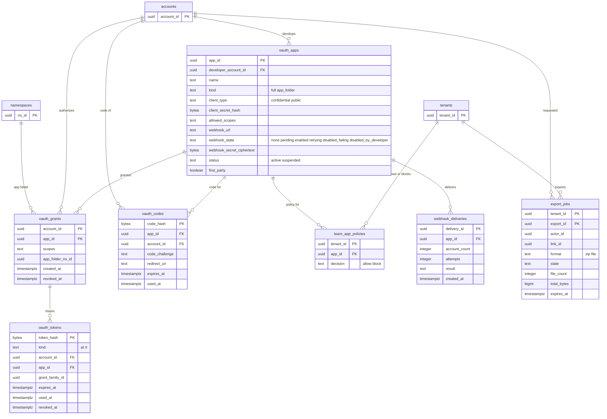

# Data model: 公開 API・アプリ・Webhook・書き出し

[data-model.md](../data-model.md) の一部。規約はそちらの 3 節に従う。振る舞いは [api-and-webhooks.md](../api-and-webhooks.md)（4〜9 節）を正とする。決定は [ADR-0038](../../decisions/0038-public-api-shape-and-change-feeds.md)、[ADR-0039](../../decisions/0039-oauth-apps-scopes-and-rate-limits.md)、[ADR-0040](../../decisions/0040-signed-webhooks-delivery.md)、[ADR-0054](../../decisions/0054-server-assembled-downloads.md)。トークンの形と Webhook の本文・見出しは [stores.md](stores.md) の 5・6 節、レート制限の鍵は同 2 節。

| 表 | 置き場所 | 書く |
| --- | --- | --- |
| `oauth_apps` | `public`、RLS の外 | 開発者の画面（`auth`）、`webhook-sender`（`webhook_state`） |
| `oauth_grants`・`oauth_tokens`・`oauth_codes` | `public`、RLS の外 | `auth`（OAuth の認可サーバー） |
| `team_app_policies` | テナントの表 | 管理の API |
| `webhook_deliveries` | `public`、RLS の外 | `webhook-sender` |
| `export_jobs` | テナントの表 | `api`・`link`（作成）、`api`（`export-results` を受けて状態） |

`oauth_*` の表は名前・パスを持たない。`app_subscriptions` の表は作らず、`oauth_grants` と `oauth_apps` の Webhook の状態から引く。

## 1. ER 図

- `oauth_*` の主体（`accounts`）への関係は論理の参照（S2 で同じディレクトリのクラスタにあるので外部キーを張ってよいが、`auth` スキーマとの間は張らない）。
- `oauth_grants.app_folder_ns_id` → `namespaces` は論理の参照（RLS の外の表から名前空間の表へ）。

## 2. 表

### 2.1 `oauth_apps`

公開 API のアプリ（自社のクライアントも 1 つのアプリとして登録する。`first_party`）。定義元：[api-and-webhooks.md](../api-and-webhooks.md) の 7・9 節。

| 列 | 型 | NULL | 既定 | 説明 |
| --- | --- | --- | --- | --- |
| `app_id` | `uuid` | NOT NULL | `uuidv7()` | `client_id` として使う |
| `developer_account_id` | `uuid` | NOT NULL | — | |
| `name` | `text` | NOT NULL | — | アプリの名前（アプリのフォルダーの名前 `アプリ/<アプリの名前>` にも使う） |
| `kind` | `text` | NOT NULL | — | `full`・`app_folder` |
| `client_type` | `text` | NOT NULL | — | `confidential`・`public`（どちらも PKCE の `S256` を求める） |
| `client_secret_hash` | `bytea` | NULL | — | 秘密を持つアプリの秘密の SHA-256 |
| `redirect_uris` | `text[]` | NOT NULL | — | 完全一致（ループバックはポートだけ任意） |
| `allowed_scopes` | `text[]` | NOT NULL | — | [api-and-webhooks.md](../api-and-webhooks.md) の 7.2 節のスコープの部分集合 |
| `webhook_url` | `text` | NULL | — | `https`、私的なアドレスに解決しないもの |
| `webhook_state` | `text` | NOT NULL | `'none'` | `none`・`pending`（`challenge` の待ち）・`enabled`・`retrying`・`disabled_failing`・`disabled_by_developer` |
| `webhook_failing_since` | `timestamptz` | NULL | — | 24 時間で `disabled_failing` |
| `webhook_secret_ciphertext` | `bytea` | NULL | — | `<brand>_whsec_…`（`kms-secrets` の封筒の暗号化） |
| `webhook_secret_prev_ciphertext` | `bytea` | NULL | — | 入れ替えの間の古い秘密 |
| `webhook_secret_prev_until` | `timestamptz` | NULL | — | 新旧を並べて署名する期限（24 時間） |
| `status` | `text` | NOT NULL | `'active'` | `active`・`suspended` |
| `first_party` | `boolean` | NOT NULL | `false` | 自社のクライアント（レート制限のアカウントの桶を共有） |
| `created_at`・`updated_at` | `timestamptz` | NOT NULL | `now()` | |

- キー：PK `app_id`。
- 索引：`(developer_account_id)` — 開発者の画面。`(webhook_state) WHERE webhook_state IN ('enabled','retrying')` — 送りの対象。
- CHECK：`kind IN (…)`、`client_type IN (…)`、`client_type = 'public' OR client_secret_hash IS NOT NULL`、`webhook_state = 'none' OR webhook_url IS NOT NULL`、`webhook_url IS NULL OR webhook_url LIKE 'https://%'`、`(webhook_secret_prev_ciphertext IS NULL) = (webhook_secret_prev_until IS NULL)`。
- 保持：削除まで（削除で認可とトークンを無効にする）。S1 の量：約 1 万行。

### 2.2 `oauth_grants`

利用者のアプリの認可（[ADR-0039](../../decisions/0039-oauth-apps-scopes-and-rate-limits.md)）。

| 列 | 型 | NULL | 既定 | 説明 |
| --- | --- | --- | --- | --- |
| `account_id` | `uuid` | NOT NULL | — | |
| `app_id` | `uuid` | NOT NULL | — | |
| `scopes` | `text[]` | NOT NULL | — | 許したスコープ（書きは読みを含む） |
| `app_folder_ns_id` | `uuid` | NULL | — | アプリのフォルダーの名前空間（`kind = 'app_folder'`。トークンの `root_ns` をここに固定） |
| `created_at` | `timestamptz` | NOT NULL | `now()` | |
| `revoked_at` | `timestamptz` | NULL | — | 取り消しで、すべてのトークンを無効にし、Webhook の対象から外す |

- キー：PK `(account_id, app_id)`。FK `app_id` → `oauth_apps`。
- 索引：`(app_id, account_id) WHERE revoked_at IS NULL` — Webhook の扇（名前空間を読める主体 ∩ Webhook を持つアプリの認可）。
- 保持：取り消しから 1 年（この文書で決めた）。S1 の量：約 50 万行。

### 2.3 `oauth_tokens`

アプリのアクセストークンとリフレッシュトークン（端末の資格情報は `auth.device_credentials`）。

| 列 | 型 | NULL | 既定 | 説明 |
| --- | --- | --- | --- | --- |
| `token_hash` | `bytea` | NOT NULL | — | `<brand>_at_…`・`<brand>_rt_…` の SHA-256 |
| `kind` | `text` | NOT NULL | — | `at`（4 時間）・`rt` |
| `account_id` | `uuid` | NOT NULL | — | |
| `app_id` | `uuid` | NOT NULL | — | |
| `grant_family_id` | `uuid` | NOT NULL | — | 同じ認可から出た系列（再使用で系列ごと無効） |
| `scopes` | `text[]` | NOT NULL | — | |
| `root_ns_id` | `uuid` | NULL | — | アプリのフォルダーのとき固定する名前空間 |
| `expires_at` | `timestamptz` | NOT NULL | — | `at` 4 時間、`rt` は使わないまま 90 日 |
| `used_at` | `timestamptz` | NULL | — | `rt` を使った時刻（使うたびに替える） |
| `revoked_at` | `timestamptz` | NULL | — | |
| `created_at` | `timestamptz` | NOT NULL | `now()` | |

- キー：PK `token_hash`。FK `app_id` → `oauth_apps`。
- 索引：`(grant_family_id)` — 再使用の検出での系列の無効化。`(account_id, app_id)` — 認可の取り消し、チームの方針でアプリを止めたときの無効化。`(expires_at)` — 掃除。
- CHECK：`kind IN ('at','rt')`。
- 保持：期限か取り消しから 7 日で消す（再使用の検出のため）。S1 の量：約 200 万行。

### 2.4 `oauth_codes`

認可コード（1 回、10 分）。

| 列 | 型 | NULL | 既定 | 説明 |
| --- | --- | --- | --- | --- |
| `code_hash` | `bytea` | NOT NULL | — | |
| `app_id` | `uuid` | NOT NULL | — | |
| `account_id` | `uuid` | NOT NULL | — | |
| `scopes` | `text[]` | NOT NULL | — | |
| `code_challenge` | `text` | NOT NULL | — | PKCE の `S256` の値（`plain` を受けない） |
| `redirect_uri` | `text` | NOT NULL | — | |
| `expires_at` | `timestamptz` | NOT NULL | `now() + 10 min` | |
| `used_at` | `timestamptz` | NULL | — | 2 回目の使用で、そのコードから出したトークンを無効にする |

- キー：PK `code_hash`。索引：`(expires_at)` — 掃除。
- 保持：期限の 1 日後に消す。S1 の量：数千行。

### 2.5 `team_app_policies`

チームの管理者のアプリの許す・止める（[api-and-webhooks.md](../api-and-webhooks.md) の 7.3 節）。

| 列 | 型 | NULL | 既定 | 説明 |
| --- | --- | --- | --- | --- |
| `tenant_id` | `uuid` | NOT NULL | — | |
| `app_id` | `uuid` | NOT NULL | — | |
| `decision` | `text` | NOT NULL | — | `allow`・`block` |
| `decided_by` | `uuid` | NOT NULL | — | `member_id` |
| `decided_at` | `timestamptz` | NOT NULL | `now()` | |

- キー：PK `(tenant_id, app_id)`。
- `block` にしたら、同じトランザクションで outbox に `access_changed` を書き、`auth` がそのテナントのメンバーの、そのアプリのトークンを無効にする。
- RLS：テナント。Webhook の送る前の確かめは 60 秒の写し（Valkey）。S1 の量：約 1 万行。

### 2.6 `webhook_deliveries`

Webhook の送りの記録（[ADR-0040](../../decisions/0040-signed-webhooks-delivery.md)）。本文のアカウントの一覧は持たない（数だけ）。

| 列 | 型 | NULL | 既定 | 説明 |
| --- | --- | --- | --- | --- |
| `delivery_id` | `uuid` | NOT NULL | `uuidv7()` | `<Brand>-Delivery-Id` |
| `app_id` | `uuid` | NOT NULL | — | |
| `account_count` | `integer` | NOT NULL | — | 1,000 まで |
| `attempts` | `smallint` | NOT NULL | `0` | |
| `result` | `text` | NOT NULL | `'pending'` | `pending`・`delivered`・`retrying`・`dropped` |
| `last_status` | `smallint` | NULL | — | 最後の HTTP の状態（接続の失敗は NULL） |
| `last_error` | `text` | NULL | — | `timeout`・`connect`・`redirect`・`private_address`・`tls` |
| `created_at` | `timestamptz` | NOT NULL | `now()` | |
| `next_attempt_at` | `timestamptz` | NULL | — | 10 秒、30 秒、2 分、10 分、30 分、以後 1 時間（±10%） |
| `delivered_at` | `timestamptz` | NULL | — | |

- キー：PK `delivery_id`。FK `app_id` → `oauth_apps`。
- 索引：`(app_id, created_at)` — 開発者の画面、送りの失敗の続き。`(next_attempt_at) WHERE result = 'retrying'` — 再試行。
- 未送のアカウントの集合そのものは Valkey の `wh:pending:<app_id>`（[stores.md](stores.md) の 2 節）。
- 保持：30 日。S1 の量：約 3,000 万行。

### 2.7 `export_jobs`

サーバーで組み立てるダウンロード（フォルダーの ZIP、1 つの URL のファイル。[ADR-0054](../../decisions/0054-server-assembled-downloads.md)）。D-11。

| 列 | 型 | NULL | 既定 | 説明 |
| --- | --- | --- | --- | --- |
| `tenant_id` | `uuid` | NOT NULL | — | 対象の名前空間の持ち主のテナント |
| `export_id` | `uuid` | NOT NULL | `uuidv7()` | S3 の `x/<tenant_id>/<export_id>/` |
| `source` | `text` | NOT NULL | — | `api`・`web`・`link` |
| `actor_id` | `uuid` | NULL | — | ログインした主体（共有リンクの匿名は NULL） |
| `link_id` | `uuid` | NULL | — | 共有リンクから |
| `format` | `text` | NOT NULL | — | `zip`・`file` |
| `state` | `text` | NOT NULL | `'queued'` | `queued`・`building`・`ready`・`failed`・`expired` |
| `reason` | `text` | NULL | — | `export_too_large`・`block_hash_mismatch`・`timeout` |
| `file_count` | `integer` | NOT NULL | — | 10,000 まで |
| `total_bytes` | `bigint` | NOT NULL | — | 20 GiB まで |
| `created_at` | `timestamptz` | NOT NULL | `now()` | |
| `ready_at` | `timestamptz` | NULL | — | |
| `expires_at` | `timestamptz` | NOT NULL | `now() + 1 day` | S3 の 1 日に合わせる |

- キー：PK `(tenant_id, export_id)`。UK `export_id`（`files/export/status`）。
- 索引：`(tenant_id, actor_id) WHERE state IN ('queued','building')` — 1 アカウントの同時 3 つの上限。`(expires_at)` — 掃除。
- CHECK：`file_count <= 10000`、`total_bytes <= 21474836480`、`(source = 'link') = (link_id IS NOT NULL)`、`source = 'link' OR actor_id IS NOT NULL`。
- 対象の名前・パスはここに持たない（S3 の `manifest` だけ）。
- RLS：テナント。保持：作成から 7 日（この文書で決めた）。S1 の量：数百万行。
