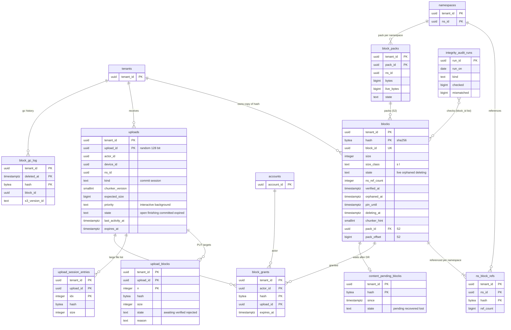

# Data model: ブロックと保存

[data-model.md](../data-model.md) の一部。規約はそちらの 3 節（とくに 3.6 節のハッシュ）に従う。中身の鎖の図は [data-model.md](../data-model.md) の 5 節。振る舞いは [block-storage.md](../block-storage.md)（4〜8 節）、[infrastructure.md](../infrastructure.md) の 6.4 節、[observability.md](../observability.md) の 3.3 節、[capacity.md](../capacity.md) の 4.3 節を正とする。決定は [ADR-0002](../../decisions/0002-chunking-and-block-addressing.md)、[ADR-0003](../../decisions/0003-dedupe-scope-and-privacy.md)、[ADR-0007](../../decisions/0007-block-storage-layout-on-s3.md)、[ADR-0018](../../decisions/0018-upload-sessions-and-block-grants.md)、[ADR-0019](../../decisions/0019-block-refcount-and-gc-protocol.md)、[ADR-0020](../../decisions/0020-small-block-packing-for-s2.md)、[ADR-0048](../../decisions/0048-disaster-recovery-and-content-pending.md)。S3 のキーは [stores.md](stores.md) の 1 節。

| 表 | 置き場所 | 書く |
| --- | --- | --- |
| `blocks` | テナントの表 | `verifier`（作成）、`committer`（`live`↔`orphaned`、`ns_ref_count`）、`gc`（`deleting`、削除）、`x1_copy`、`pack-builder`（S2） |
| `ns_block_refs` | 名前空間の表 | `committer` |
| `uploads`・`upload_blocks`・`upload_session_entries` | テナントの表 | `api`、`verifier`（`upload_blocks.state`） |
| `block_grants` | テナントの表 | `verifier` |
| `block_gc_log` | テナントの表 | `gc` |
| `content_pending_blocks` | テナントの表 | `dr-content-check`、`verifier` |
| `block_packs` | テナントの表（S2） | `pack-builder` |
| `integrity_audit_runs` | `maint` | `scrubber` |

いずれもファイルの名前・パスを持たない（[block-storage.md](../block-storage.md) の 11 節）。

## 1. ER 図

- `blocks` と `ns_block_refs` は `(tenant_id, hash)` で結ぶ。`ns_block_refs` の名前空間の持ち主のテナントと、ブロックのテナントは同じ（ブロックは書き込み先の名前空間の持ち主のテナントに置く。[ADR-0003](../../decisions/0003-dedupe-scope-and-privacy.md)）。DB の外部キーは張らない（`ns_ref_count` の 0↔1 の手順で整合を取り、毎週数え直す）。

## 2. 表

### 2.1 `blocks`

ブロックの索引（[ADR-0003](../../decisions/0003-dedupe-scope-and-privacy.md)、[ADR-0019](../../decisions/0019-block-refcount-and-gc-protocol.md)）。テナントとハッシュの組で一意。定義元：[block-storage.md](../block-storage.md) の 5 節。

| 列 | 型 | NULL | 既定 | 説明 |
| --- | --- | --- | --- | --- |
| `tenant_id` | `uuid` | NOT NULL | — | |
| `hash` | `bytea` | NOT NULL | — | 平文のブロックの SHA-256 |
| `block_id` | `uuid` | NOT NULL | `uuidv7()` | ログと照合でハッシュの代わりに指す（D-25） |
| `size` | `integer` | NOT NULL | — | バイト。16 MiB まで |
| `size_class` | `text` | NOT NULL | 生成 | `CASE WHEN size < 131072 THEN 's' ELSE 'l' END`（S3 のキーの `sc`） |
| `state` | `text` | NOT NULL | `'orphaned'` | `live`・`orphaned`・`deleting` |
| `ns_ref_count` | `integer` | NOT NULL | `0` | 参照する名前空間の数 |
| `verified_at` | `timestamptz` | NOT NULL | `now()` | `block-verifier` が確かめた時刻 |
| `orphaned_at` | `timestamptz` | NULL | — | 参照が 0 になった時刻（7 日の猶予の起点） |
| `pin_until` | `timestamptz` | NULL | — | アップロード・セッション・復元の作業の間、GC から守る |
| `deleting_at` | `timestamptz` | NULL | — | |
| `chunker_hint` | `smallint` | NULL | — | 最初に送られた時の `chunker_version`（0 か 1。統計だけ） |
| `pack_id` | `uuid` | NULL | — | S2：パック |
| `pack_offset` | `bigint` | NULL | — | S2：パックの中の位置 |

- キー：PK `(tenant_id, hash)`。UK `block_id`。
- 索引：
  - `(tenant_id, orphaned_at) WHERE state = 'orphaned'` — GC の候補（`orphaned_at < now() - 7 days`、1,000 件ずつ）
  - `(deleting_at) WHERE state = 'deleting'` — 1 時間を超えた `deleting` のやり直し
  - `(tenant_id, pack_id) WHERE pack_id IS NOT NULL` — S2：パックの生きているブロック
- CHECK：
  - `octet_length(hash) = 32`、`size BETWEEN 1 AND 16777216`
  - `state IN ('live','orphaned','deleting')`
  - `ns_ref_count >= 0`、`state <> 'live' OR ns_ref_count > 0`、`state = 'live' OR ns_ref_count = 0`
  - `(state = 'orphaned') = (orphaned_at IS NOT NULL)`、`(state = 'deleting') = (deleting_at IS NOT NULL)`
  - `(pack_id IS NULL) = (pack_offset IS NULL)`、`pack_id IS NULL OR size < 131072`
- 状態の移り（トリガーで拒む移り）：`deleting` から `live`・`orphaned` に戻らない。`deleting` は `ns_ref_count = 0 AND (pin_until IS NULL OR pin_until < now())` のときだけ。
- ロックの順：名前空間の行 → `ns_block_refs` → `blocks`（ハッシュの順）。
- RLS：テナント。
- 保持：参照 0 から 7 日の後に GC が消す。S3 は削除のマーカーから 30 日で消える（[ADR-0007](../../decisions/0007-block-storage-layout-on-s3.md)）。テナントの消去ではすべてを `orphaned` にする。
- S1 の量：約 62 億行（物理 13 PB、平均 2 MiB）、1.2 TB。

### 2.2 `ns_block_refs`

名前空間ごとのブロックの参照（[ADR-0003](../../decisions/0003-dedupe-scope-and-privacy.md)）。重複排除の `have` の判定の索引でもある。

| 列 | 型 | NULL | 既定 | 説明 |
| --- | --- | --- | --- | --- |
| `tenant_id` | `uuid` | NOT NULL | — | 名前空間の持ち主のテナント |
| `ns_id` | `uuid` | NOT NULL | — | |
| `hash` | `bytea` | NOT NULL | — | |
| `ref_count` | `bigint` | NOT NULL | — | そのハッシュを一覧に持つ、保持の期間の中のリビジョンの数（D-26） |

- キー：PK `(tenant_id, ns_id, hash)`。FK `(tenant_id, ns_id)` → `namespaces`。
- 索引：`(tenant_id, hash, ns_id)` — commit の `classify()`：1 回の commit のブロックをまとめて、`app.ns_ids`（主体の読める名前空間）の中で引く。X1 の `copy` の判定も同じ索引（他のテナントの読める名前空間）。
- CHECK：`ref_count > 0`（0 になったら行を消す）、`octet_length(hash) = 32`。
- 行の作成で `blocks.ns_ref_count` を +1（`orphaned` なら `live` に戻す）、削除で −1（0 なら `orphaned`、`orphaned_at = now()`）。行の中の `ref_count` の増減は `blocks` に触れない（[ADR-0019](../../decisions/0019-block-refcount-and-gc-protocol.md)）。
- RLS：名前空間の表。`classify()` の読み出しは `app.ns_ids` の中だけなので、読めない名前空間の参照は見えない。
- 照合：毎週、抜き取り 1% の名前空間で `revisions` から数え直し、全テナントの `ns_ref_count` をこの表から数え直す（[block-storage.md](../block-storage.md) の 6 節）。
- 保持：参照がなくなったら消す。S1 の量：約 70 億行、1.0 TB。

### 2.3 `uploads`

アップロード（「送れ」の答えのたびに作る）とアップロードのセッション（[ADR-0018](../../decisions/0018-upload-sessions-and-block-grants.md)、[block-storage.md](../block-storage.md) の 4.2・4.4・4.6 節）。

| 列 | 型 | NULL | 既定 | 説明 |
| --- | --- | --- | --- | --- |
| `tenant_id` | `uuid` | NOT NULL | — | 書き込み先の名前空間の持ち主のテナント |
| `upload_id` | `uuid` | NOT NULL | `gen_random_uuid()` | 128 ビットの乱数（UUIDv7 にしない） |
| `actor_id` | `uuid` | NOT NULL | — | |
| `device_id` | `uuid` | NULL | — | |
| `ns_id` | `uuid` | NOT NULL | — | 書き込み先の名前空間 |
| `kind` | `text` | NOT NULL | — | `commit`（1,024 ブロック以下）・`session` |
| `chunker_version` | `smallint` | NOT NULL | — | |
| `expected_size` | `bigint` | NULL | — | セッションの申告（2 TiB まで） |
| `priority` | `text` | NOT NULL | `'interactive'` | `interactive`・`background`（[capacity.md](../capacity.md) の 4.3 節） |
| `state` | `text` | NOT NULL | `'open'` | `open`・`finishing`・`committed`・`expired` |
| `entries_count` | `integer` | NOT NULL | `0` | セッションが受けた一覧の長さ |
| `created_at` | `timestamptz` | NOT NULL | `now()` | |
| `last_activity_at` | `timestamptz` | NOT NULL | `now()` | |
| `expires_at` | `timestamptz` | NOT NULL | — | 活動から 7 日、作成から 30 日の早い方 |

- キー：PK `(tenant_id, upload_id)`。UK `upload_id`（`incoming` のキーからの引き当て）。
- 索引：`(expires_at) WHERE state = 'open'` — 期限の掃除（ピンを外す）。`(tenant_id, actor_id, state) WHERE state = 'open'` — 端末の同時 64、アカウントのセッション 32 の上限。
- CHECK：`kind IN (…)`、`state IN (…)`、`priority IN (…)`、`chunker_version IN (0,1)`、`kind = 'session' OR expected_size IS NULL`、`expected_size IS NULL OR expected_size <= 2199023255552`。
- 名前・パスを持たない。commit の操作（親・名前）は `finish` の要求で受ける。
- RLS：テナント。保持：`committed`・`expired` から 7 日で消す。S1 の量：約 3,500 万行（7 日）。

### 2.4 `upload_blocks`

アップロードのブロックごとの PUT の行（[block-storage.md](../block-storage.md) の 4.2 節）。

| 列 | 型 | NULL | 既定 | 説明 |
| --- | --- | --- | --- | --- |
| `tenant_id` | `uuid` | NOT NULL | — | |
| `upload_id` | `uuid` | NOT NULL | — | |
| `n` | `integer` | NOT NULL | — | `incoming` のキー `u/<upload_id>/<n>` の番号 |
| `hash` | `bytea` | NOT NULL | — | 期待する SHA-256（署名つき URL に含める） |
| `size` | `integer` | NOT NULL | — | |
| `state` | `text` | NOT NULL | `'awaiting'` | `awaiting`・`verified`・`rejected` |
| `reason` | `text` | NULL | — | `checksum_mismatch`・`size_mismatch` |
| `updated_at` | `timestamptz` | NOT NULL | `now()` | SLI の確かめの速さ |

- キー：PK `(tenant_id, upload_id, n)`。FK → `uploads`（`ON DELETE CASCADE`）。
- 索引：`(tenant_id, upload_id, hash)` — commit の送り直しで、許可のまだないブロックを引く。
- CHECK：`state IN (…)`、`(state = 'rejected') = (reason IS NOT NULL)`。
- RLS：テナント。保持：アップロードと同じ。S1 の量：約 1.4 億行（1 日 2,000 万の新しいブロック × 7 日）。

### 2.5 `upload_session_entries`

アップロードのセッションに貯めるブロックの一覧（1,024 を超える大きなファイル。[block-storage.md](../block-storage.md) の 4.4 節）。

| 列 | 型 | NULL | 既定 | 説明 |
| --- | --- | --- | --- | --- |
| `tenant_id` | `uuid` | NOT NULL | — | |
| `upload_id` | `uuid` | NOT NULL | — | |
| `idx` | `integer` | NOT NULL | — | ファイルの中の順（0 から） |
| `hash` | `bytea` | NOT NULL | — | |
| `size` | `integer` | NOT NULL | — | |

- キー：PK `(tenant_id, upload_id, idx)`。FK → `uploads`（`ON DELETE CASCADE`）。
- `finish` で順に読み、`blocklist_hash` を計算し、S3 の `blocklists` に置く。大きさの和が `expected_size` と一致し、各ブロックが 16 MiB 以下であることを確かめる。
- RLS：テナント。保持：アップロードと同じ。S1 の量：数千万行（2 TiB のファイルで最大 約 210 万行）。

### 2.6 `block_grants`

この主体が送って検証されたブロックの許可（[ADR-0018](../../decisions/0018-upload-sessions-and-block-grants.md)）。`granted` の判定。

| 列 | 型 | NULL | 既定 | 説明 |
| --- | --- | --- | --- | --- |
| `tenant_id` | `uuid` | NOT NULL | — | |
| `actor_id` | `uuid` | NOT NULL | — | 送った主体 |
| `hash` | `bytea` | NOT NULL | — | |
| `upload_id` | `uuid` | NOT NULL | — | |
| `expires_at` | `timestamptz` | NOT NULL | `now() + 7 days` | 過ぎたら `need` に戻る |

- キー：PK `(tenant_id, actor_id, hash, upload_id)`。
- 索引：PK の前の部分 `(tenant_id, actor_id, hash)` — `classify()` の `granted`（`expires_at > now()`）。`(expires_at)` — 掃除。
- 書く：`verifier` だけ（検証が通った後）。
- RLS：テナント。保持：期限で消す。S1 の量：約 1.4 億行。

### 2.7 `block_gc_log`

GC で消したブロックの記録（戻しの手順で使う。[ADR-0019](../../decisions/0019-block-refcount-and-gc-protocol.md)）。

| 列 | 型 | NULL | 既定 | 説明 |
| --- | --- | --- | --- | --- |
| `tenant_id` | `uuid` | NOT NULL | — | |
| `deleted_at` | `timestamptz` | NOT NULL | `now()` | |
| `hash` | `bytea` | NOT NULL | — | |
| `block_id` | `uuid` | NOT NULL | — | |
| `size` | `integer` | NOT NULL | — | |
| `s3_key_class` | `text` | NOT NULL | — | `s`・`l`・`pack`（キーを作り直すため） |
| `s3_version_id` | `text` | NOT NULL | — | 削除のマーカーの下の古いバージョン |

- キー：PK `(tenant_id, deleted_at, hash)`。索引：`(block_id)` — 監査の結果からの引き当て。
- 追記だけ。RLS：テナント。
- 保持：37 日（7 日の猶予の後の S3 の 30 日に合わせる）。S1 の量：約 3 億行（1 日 約 800 万の削除 × 37 日。初期見積もり）。

### 2.8 `content_pending_blocks`

DR の切り替えの後、大阪にまだ届いていないブロック（[ADR-0048](../../decisions/0048-disaster-recovery-and-content-pending.md)、[infrastructure.md](../infrastructure.md) の 6.4 節）。

| 列 | 型 | NULL | 既定 | 説明 |
| --- | --- | --- | --- | --- |
| `tenant_id` | `uuid` | NOT NULL | — | |
| `hash` | `bytea` | NOT NULL | — | |
| `since` | `timestamptz` | NOT NULL | `now()` | |
| `state` | `text` | NOT NULL | `'pending'` | `pending`・`recovered`・`lost` |
| `resolved_at` | `timestamptz` | NULL | — | |

- キー：PK `(tenant_id, hash)`。索引：`(state) WHERE state = 'pending'`。
- このブロックを指すリビジョンを `content_state = pending` にする。端末の送り直しで `verifier` が確かめて `recovered`、そろったリビジョンを `ready` に戻す。
- RLS：テナント。保持：解決から 90 日（SEV の報告のため。この文書で決めた）。S1 の量：普段は 0。DR の後に 40 万〜160 万の確かめのうち欠けた分。

### 2.9 `block_packs`（S2）

小さなブロックのパック（[ADR-0020](../../decisions/0020-small-block-packing-for-s2.md)。`release.small-block-packing` の裏、`small-block-pack-poc` の後）。D-12。

| 列 | 型 | NULL | 既定 | 説明 |
| --- | --- | --- | --- | --- |
| `tenant_id` | `uuid` | NOT NULL | — | |
| `pack_id` | `uuid` | NOT NULL | `uuidv7()` | S3 `pk/<h4>/<tenant_id>/<pack_id>` |
| `ns_id` | `uuid` | NOT NULL | — | パックを作った名前空間（同じパックに読めない名前空間のブロックを入れない） |
| `bytes` | `bigint` | NOT NULL | — | 64 MiB まで |
| `live_bytes` | `bigint` | NOT NULL | — | 生きているブロックの和。50% 未満で詰め直す |
| `state` | `text` | NOT NULL | `'live'` | `live`・`compacting`・`deleting` |
| `created_at` | `timestamptz` | NOT NULL | `now()` | |

- キー：PK `(tenant_id, pack_id)`。索引：`(tenant_id, live_bytes) WHERE state = 'live'` — 詰め直しの候補。
- CHECK：`bytes <= 67108864`、`live_bytes BETWEEN 0 AND bytes`。
- 古いパックは、どの `blocks.pack_id` も指さなくなってから、GC と同じ手順（`deleting` を経る）で消す。
- RLS：テナント。S1 の量：0（S2 で使う）。

### 2.10 `maint.integrity_audit_runs`

照合（スクラブ）の結果（[observability.md](../observability.md) の 3.3 節、[block-storage.md](../block-storage.md) の 6 節）。集計だけで、ファイルの名前もハッシュも持たない。

| 列 | 型 | NULL | 既定 | 説明 |
| --- | --- | --- | --- | --- |
| `run_id` | `uuid` | NOT NULL | `uuidv7()` | |
| `run_on` | `date` | NOT NULL | — | |
| `kind` | `text` | NOT NULL | — | `ref_audit`・`ref_recount`・`checksum`・`reread`・`inventory`・`content_sha256_sample`・`dr_content` |
| `cluster_id` | `text` | NOT NULL | `'main'` | S2 のクラスタ |
| `checked` | `bigint` | NOT NULL | — | 調べた数 |
| `mismatched` | `bigint` | NOT NULL | — | 不一致の数 |
| `mismatched_block_ids` | `uuid[]` | NOT NULL | `'{}'` | 1,000 まで |
| `started_at`・`finished_at` | `timestamptz` | — | — | 動かなかった日は行がなく、「不明」として呼び出す |

- キー：PK `run_id`。UK `(run_on, kind, cluster_id)`。
- 保持：400 日（SLO の 1 年の比べのため。この文書で決めた）。S1 の量：1 日 数行。
