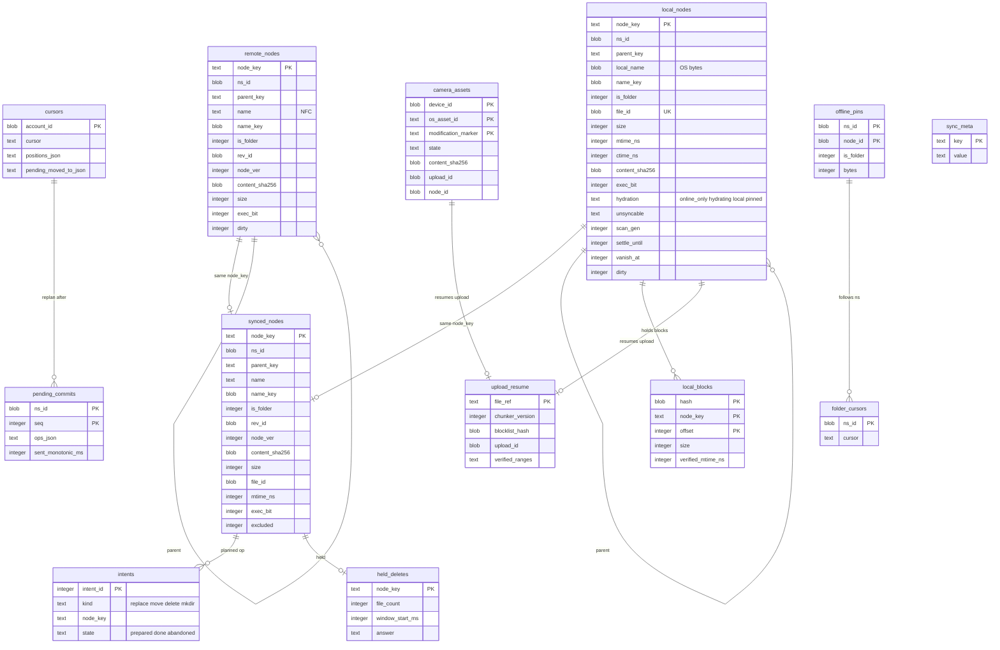

# Data model: 端末のローカルの状態の DB

[data-model.md](../data-model.md) の一部。端末の中の SQLite（WAL）の 1 つのファイル `sync.db`（[ADR-0010](../../decisions/0010-local-state-db-and-intent-log.md)）。サーバーの表と別の世界で、RLS・テナントの考えを持たない（端末の利用者のものだけ）。振る舞いは [sync-engine.md](../sync-engine.md)（5・7・9・10 節）、[file-system-integration.md](../file-system-integration.md)（4・6・8 節）、[desktop-client.md](../desktop-client.md)（5.3・7 節）、[block-storage.md](../block-storage.md) の 4.7・7.2 節、[mobile-and-camera-upload.md](../mobile-and-camera-upload.md) の 5・9・11 節を正とする。決定は [ADR-0006](../../decisions/0006-sync-conflict-model.md)、[ADR-0008](../../decisions/0008-node-identity-and-names.md)、[ADR-0010](../../decisions/0010-local-state-db-and-intent-log.md)、[ADR-0011](../../decisions/0011-selective-sync-and-access-loss.md)、[ADR-0014](../../decisions/0014-desktop-unlink-and-wipe-execution.md)、[ADR-0015](../../decisions/0015-local-change-observation-and-move-detection.md)、[ADR-0016](../../decisions/0016-placeholders-and-hydration-policy.md)、[ADR-0017](../../decisions/0017-local-names-and-unsyncable-items.md)、[ADR-0036](../../decisions/0036-camera-upload-identity-and-background.md)、[ADR-0037](../../decisions/0037-mobile-offline-files-and-content-free-push.md)。

## 1. 規約

- **書くのは制御のループだけ**（`sync-core`）。UI は DB を直接書かない（ホストのコマンドを通す）。
- **書き込みの同期**：`intents` の `prepared` の書き込みは `PRAGMA synchronous=FULL`。ほかは `NORMAL`。木と意図の完了は 1 つのトランザクションで書く（[sync-engine.md](../sync-engine.md) の 7.1 節）。
- **名前の比べは `name_key` だけ**。SQLite の照合順序（`NOCASE` など）を使わない。`name_key` は `sync-core` の `packages/names` と同じ規則で作り、`BLOB` で持つ。
- **ID**：`node_key` はサーバーの `node_id`（UUID の 16 バイト）。手元で作ってまだ確定していないものは仮の ID（`tmp:` ＋ UUIDv7 の文字列）を `TEXT` で持つ。作成の commit が成功したら、3 つの木で同じトランザクションで付け替える。
- **時刻**：単調な時計（`monotonic_ms`、起動ごとに起点が変わるので起動の番号と組にする）と、壁の時計（`unix_ms`。表示だけ）を分ける。判断には単調な時計だけを使う（[sync-engine.md](../sync-engine.md) の 6.4 節）。
- **暗号化しない**（隣の同期のフォルダーが平文のため。OS の利用者の権限で守る。[security.md](../security.md) の 5.4 節）。モバイルのオフラインのファイルの中身は、鍵の保管庫の鍵で暗号化する（DB の外）。
- **スキーマの変更**：新しいバージョンが起動で行い、変更の前の DB を 1 つ残す。1 つのリリースでは広げるだけ（[delivery.md](../delivery.md) の 7.3 節）。`sync_meta.schema_version` で判定する。
- DB が壊れたら作り直す（Remote を番号 0 から、Local を走査で）。Synced がないので、中身の違うファイルはすべて競合のコピーとして残す（[ADR-0010](../../decisions/0010-local-state-db-and-intent-log.md)）。
- **消去**（遠隔の切り離し）では、DB のファイルごと消す。途中で落ちたら `sync_meta.wipe_in_progress` から続ける（[ADR-0014](../../decisions/0014-desktop-unlink-and-wipe-execution.md)）。

| 表 | デスクトップ | モバイル |
| --- | --- | --- |
| `remote_nodes`・`local_nodes`・`synced_nodes`・`intents`・`pending_commits`・`held_deletes`・`cursors` | ○ | — |
| `sync_meta`・`local_blocks`・`upload_resume` | ○ | ○ |
| `camera_assets`・`offline_pins`・`folder_cursors` | — | ○ |

## 2. ER 図

## 3. 表

### 3.1 `remote_nodes`・`local_nodes`・`synced_nodes`

3 つの木（[sync-engine.md](../sync-engine.md) の 5.1 節）。同じ形の行を別の表に持つ。結び付けは `node_key` で行い、名前やパスで結ばない。

| 列 | 型 | Remote | Local | Synced | 説明 |
| --- | --- | --- | --- | --- | --- |
| `node_key` | `TEXT` | ○ | ○ | ○ | サーバーの `node_id`（16 進）か仮の ID |
| `ns_id` | `BLOB` | ○ | ○ | ○ | 名前空間 |
| `parent_key` | `TEXT` | ○ | ○ | ○ | 親（最上位は NULL） |
| `name` | `TEXT` | ○（NFC） | — | ○（NFC） | サーバーの名前 |
| `local_name` | `BLOB` | — | ○ | — | OS が返す名前のバイト列（[file-system-integration.md](../file-system-integration.md) の 8.1 節） |
| `name_key` | `BLOB` | ○ | ○ | ○ | NFC＋case folding（[ADR-0008](../../decisions/0008-node-identity-and-names.md)） |
| `is_folder` | `INTEGER` | ○ | ○ | ○ | マウントのノードはフォルダーとして持ち、`mount_ns_id` を Remote に持つ |
| `mount_ns_id` | `BLOB` | ○ | — | ○ | 載せた名前空間 |
| `rev_id`・`node_ver` | `BLOB`・`INTEGER` | ○ | — | ○ | |
| `content_sha256`・`size` | `BLOB`・`INTEGER` | ○ | ○（分かっていれば） | ○ | |
| `file_id` | `BLOB` | — | ○ | ○ | Windows の 128 ビットの File ID、macOS の File Provider の項目の ID |
| `mtime_ns`・`ctime_ns` | `INTEGER` | — | ○ | ○（`mtime_ns`） | 変わったかもしれないの手がかり |
| `exec_bit` | `INTEGER` | ○ | ○ | ○ | |
| `hydration` | `TEXT` | — | ○ | — | `online_only`・`hydrating`・`local`・`pinned`（[ADR-0016](../../decisions/0016-placeholders-and-hydration-policy.md)） |
| `unsyncable` | `TEXT` | — | ○ | — | 理由のコード：`invalid_char`・`reserved_name`・`trailing_space_dot`・`path_too_long`・`name_too_long`・`name_collision`・`invalid_encoding`・`symlink`・`ignored`・`special_file`（[file-system-integration.md](../file-system-integration.md) の 8.2 節） |
| `scan_gen` | `INTEGER` | — | ○ | — | 走査の世代。古いままの行は消えたもの |
| `settle_until` | `INTEGER` | — | ○ | — | 大きさと更新の時刻が落ち着くまでの単調な時刻（2 秒） |
| `vanish_at` | `INTEGER` | — | ○ | — | 消えた候補の印（移動の結び付けの猶予） |
| `excluded` | `INTEGER` | — | — | ○ | 選択型の同期で外した（[ADR-0011](../../decisions/0011-selective-sync-and-access-loss.md)） |
| `dirty` | `INTEGER` | ○ | ○ | — | 計画の対象の印（[ADR-0009](../../decisions/0009-planner-dirty-set-and-ordering.md)） |

- キー：各表 PK `node_key`。
- 索引：
  - `remote_nodes`：`(parent_key, name_key)`、`(dirty) WHERE dirty = 1`
  - `local_nodes`：`UNIQUE (file_id)`（`local_ids`。手元の ID からノードを引く）、`(parent_key, name_key)`、`(dirty) WHERE dirty = 1`、`(scan_gen)`
  - `synced_nodes`：`(parent_key, name_key)`
- CHECK：`hydration IN (…)`、`unsyncable IS NULL OR unsyncable IN (…)`。
- Synced を進めるのは、操作の結果を確かめた後だけ（PROP-SYNC-006）。
- 量：100 万ファイルで DB は数百 MB。

### 3.2 `intents`

手元のファイルの操作の意図の記録（[ADR-0010](../../decisions/0010-local-state-db-and-intent-log.md)、[sync-engine.md](../sync-engine.md) の 7 節）。

| 列 | 型 | 説明 |
| --- | --- | --- |
| `intent_id` | `INTEGER` | 自動の番号 |
| `kind` | `TEXT` | `replace`（staging → 先）・`move`・`delete`（OS のゴミ箱へ）・`mkdir`・`wipe_delete`（消去。ゴミ箱を通さない） |
| `node_key` | `TEXT` | |
| `src_path`・`dst_path` | `BLOB` | 前後のパス（OS のバイト列） |
| `staging_path` | `BLOB` | `.<brand>.cache/staging` の一時のファイル |
| `expect_before_json` | `TEXT` | 期待する前の観測 `{file_id, size, mtime_ns, sha256}` |
| `expect_after_json` | `TEXT` | 期待する後の観測 |
| `state` | `TEXT` | `prepared`・`done`・`abandoned` |
| `created_monotonic_ms` | `INTEGER` | |

- キー：PK `intent_id`。索引：`(state) WHERE state = 'prepared'` — 再起動での解き方（操作 × 観測の表。DT-SYNC-002）。
- 大量の取り出しでは、意図を 100 件ずつまとめて書く。
- 保持：`done`・`abandoned` は次の起動で消す。

### 3.3 `pending_commits`

送った commit の記録（[sync-engine.md](../sync-engine.md) の 7.3 節）。応答を受けたら消す。残っていれば、その名前空間の差分を読み終えてから計画し直す（commit に冪等のキーを持たせない）。

| 列 | 型 | 説明 |
| --- | --- | --- |
| `ns_id` | `BLOB` | |
| `seq` | `INTEGER` | 端末の中の送りの番号 |
| `ops_json` | `TEXT` | 操作の列（[metadata-and-journal.md](../metadata-and-journal.md) の 4.1 節の形） |
| `upload_id` | `BLOB` | 送り直しに付ける |
| `sent_monotonic_ms` | `INTEGER` | |

- キー：PK `(ns_id, seq)`。

### 3.4 `held_deletes`

消しすぎの止めで止めた削除（[sync-engine.md](../sync-engine.md) の 10 節）。5 分の窓で 1,000 ファイルか木の 10% を超えたら入れる。

| 列 | 型 | 説明 |
| --- | --- | --- |
| `node_key` | `TEXT` | 削除の対象（フォルダーは根） |
| `file_count` | `INTEGER` | 子孫のファイルの数 |
| `window_start_ms` | `INTEGER` | 窓の始まり（単調な時計） |
| `answer` | `TEXT` | NULL・`sync_delete`・`restore_local` |
| `answered_unix_ms` | `INTEGER` | 「削除を同期する」は 1 時間の窓で有効 |
| `notified_unix_ms` | `INTEGER` | 7 日で知らせ直す |

- キー：PK `node_key`。黙って削除を送らない。

### 3.5 `cursors`・`folder_cursors`

| 表 | 列 | キー | 説明 |
| --- | --- | --- | --- |
| `cursors`（デスクトップ） | `account_id BLOB`、`cursor TEXT`（不透明な文字列）、`positions_json TEXT`（名前空間ごとの読み終えた番号）、`pending_moved_to_json TEXT`（`moved_to` の削除の保留：`{ns_id, seq, node_key}`）、`updated_unix_ms` | PK `account_id` | 利用者の木の全体のカーソル（[ADR-0005](../../decisions/0005-namespace-journal-and-cursors.md)） |
| `folder_cursors`（モバイル） | `ns_id BLOB`、`cursor TEXT`、`updated_unix_ms` | PK `ns_id` | オフラインの保存の名前空間ごとのカーソル（[ADR-0037](../../decisions/0037-mobile-offline-files-and-content-free-push.md)） |

- カーソルの中身を端末で読まない（`positions_json` は、端末が `list/continue` の応答から写した表示と判断の手がかり）。形は [stores.md](stores.md) の 5 節。

### 3.6 `sync_meta`

端末の設定と印。鍵と値の表。

| 鍵 | 値 | 定義元 |
| --- | --- | --- |
| `schema_version` | DB のスキーマのバージョン | [delivery.md](../delivery.md) の 7.3 節 |
| `root_id` | 同期のフォルダーの持ち主の印（`.<brand>.cache/root-id` と比べる） | [sync-engine.md](../sync-engine.md) の 10.3 節 |
| `device_id` | サーバーの `devices.device_id` | [desktop-client.md](../desktop-client.md) の 15 節 |
| `account_id` | 結んだアカウント（1 つだけ） | 同上 |
| `names_version`・`chunker_version` | 使う規則のバージョン（`GET /v1/config` に合わせる） | [delivery.md](../delivery.md) の 6.2・6.3 節 |
| `wipe_in_progress` | 消去の途中の印 | [ADR-0014](../../decisions/0014-desktop-unlink-and-wipe-execution.md) |
| `sync_root_path` | 同期のフォルダーの場所（Windows） | [desktop-client.md](../desktop-client.md) の 5.3 節 |
| `new_file_default` | `online_only`・`local` | 同上 |
| `bandwidth_up_kbps`・`bandwidth_down_kbps` | 帯域の制限 | 同上 |
| `proxy` | 手で指定したプロキシ（資格は OS の鍵の保管庫） | 同上 |
| `telemetry_id`・`telemetry_id_rotated_at` | 計測だけの乱数の ID（30 日で作り直す） | [observability.md](../observability.md) の 4.2 節 |

- キー：PK `key`。選択型の同期の選択は `synced_nodes.excluded` に持つ。

### 3.7 `local_blocks`

手元のブロックの索引（ハッシュ → 手元のファイルと位置。[block-storage.md](../block-storage.md) の 7.2 節）。受信で、ここにあるブロックを手元から写す。

| 列 | 型 | 説明 |
| --- | --- | --- |
| `hash` | `BLOB` | ブロックの SHA-256 |
| `node_key` | `TEXT` | 手元のファイル |
| `offset` | `INTEGER` | ファイルの中の位置 |
| `size` | `INTEGER` | |
| `verified_mtime_ns` | `INTEGER` | 索引を作った時のファイルの更新の時刻（違えば使う前に SHA-256 を計算し直す） |

- キー：PK `(hash, node_key, offset)`。索引：`(node_key)` — ファイルの変更・削除での消し込み。
- 手元から写すときも、写した範囲の SHA-256 を計算し直す。

### 3.8 `upload_resume`

アップロードの再開の行（[block-storage.md](../block-storage.md) の 4.7 節）。

| 列 | 型 | 説明 |
| --- | --- | --- |
| `file_ref` | `TEXT` | `node_key` か、カメラの項目の鍵 |
| `chunker_version` | `INTEGER` | |
| `blocklist_hash` | `BLOB` | |
| `upload_id` | `BLOB` | |
| `verified_ranges` | `TEXT` | サーバーで検証済みの番号の範囲（`upload_session/status` で合わせる） |
| `observed_json` | `TEXT` | 計画の時のファイルの観測（大きさ・更新の時刻・ファイルの ID）。変わっていたら捨てて分割し直す |
| `expires_unix_ms` | `INTEGER` | サーバーのアップロードの期限 |

- キー：PK `file_ref`。

### 3.9 `camera_assets`（モバイル）

カメラのアップロードの項目（[ADR-0036](../../decisions/0036-camera-upload-identity-and-background.md)、[mobile-and-camera-upload.md](../mobile-and-camera-upload.md) の 5・9 節）。状態は遷移の前に書く（意図の記録と同じ考え方）。

| 列 | 型 | 説明 |
| --- | --- | --- |
| `device_id` | `BLOB` | |
| `os_asset_id` | `TEXT` | OS の写真の ID |
| `modification_marker` | `TEXT` | 変更の印（編集で変わる） |
| `state` | `TEXT` | `discovered`・`deferred`・`queued`・`exporting`・`hashing`・`uploading`・`committing`・`done`・`duplicate`・`failed_retryable`・`failed_permanent` |
| `deferred_reason` | `TEXT` | `network`・`battery`・`power`・`thermal`・`team_disabled`・`quota` |
| `content_sha256` | `BLOB` | |
| `upload_id` | `BLOB` | |
| `node_id`・`rev_id` | `BLOB` | 作ったノード（編集で同じノードの新しいリビジョン） |
| `retry_count`・`next_retry_unix_ms` | `INTEGER` | 1 分、5 分、15 分、1 時間、以後 6 時間 |
| `temp_path` | `BLOB` | 書き出したファイル（`done`・`failed_permanent` で消す） |
| `captured_unix_ms` | `INTEGER` | 撮影の日時（名前 `YYYY-MM-DD HH.MM.SS.<ext>` に使う） |

- キー：PK `(device_id, os_asset_id, modification_marker)`。索引：`(state, next_retry_unix_ms)` — 送りの順。
- `done` の項目は上げ直さない。アカウントの中の重複は、サーバーの `camera_upload_index` で防ぐ。

### 3.10 `offline_pins`（モバイル）

「オフラインで使う」を指定したファイルとフォルダー（[ADR-0037](../../decisions/0037-mobile-offline-files-and-content-free-push.md)）。

| 列 | 型 | 説明 |
| --- | --- | --- |
| `ns_id` | `BLOB` | |
| `node_id` | `BLOB` | |
| `is_folder` | `INTEGER` | フォルダーは子孫を持つ |
| `bytes` | `INTEGER` | 手元の量（端末の空きの 20% かつ既定 5 GB まで） |
| `pinned_unix_ms` | `INTEGER` | |

- キー：PK `(ns_id, node_id)`。見えなくなったら（削除・移動・権限の取り消し）手元の写しを消し、利用者に知らせる。
