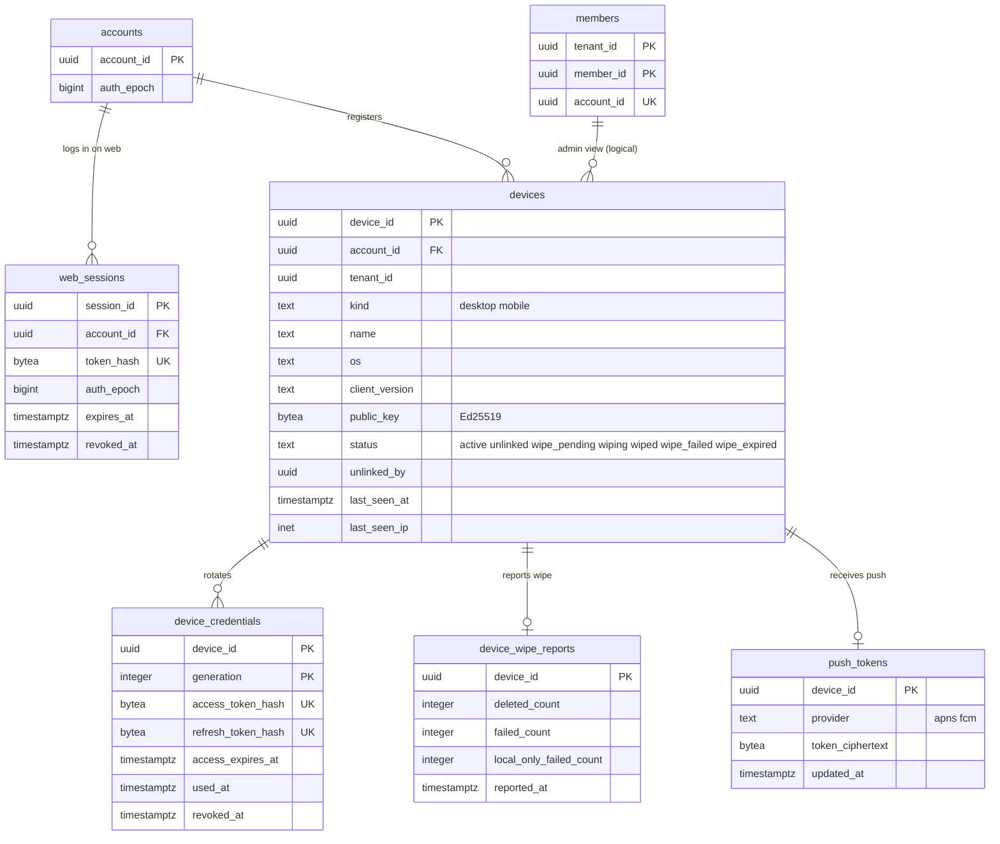

# Data model: 端末とセッション

[data-model.md](../data-model.md) の一部。規約はそちらの 3 節に従う。振る舞いは [accounts-and-teams.md](../accounts-and-teams.md) の 5・13 節、[desktop-client.md](../desktop-client.md) の 7 節、[mobile-and-camera-upload.md](../mobile-and-camera-upload.md) の 10 節を正とする。決定は [ADR-0041](../../decisions/0041-accounts-auth-and-device-credentials.md)、[ADR-0043](../../decisions/0043-admin-roles-device-wipe-and-member-access.md)、[ADR-0014](../../decisions/0014-desktop-unlink-and-wipe-execution.md)、[ADR-0037](../../decisions/0037-mobile-offline-files-and-content-free-push.md)。

すべて `auth` スキーマ（RLS の外）。書くのは `auth` のロールだけ。`api`・`notify`・`link` はトークンの検証の関数 `auth_verify_token(token_hash)` で引く（結果を 30 秒まで手元に持つ）。

## 1. ER 図

- `devices.tenant_id` はアカウントのテナントの写し（管理の画面で、チームのメンバーの端末を引くため）。`members` との関係は論理の参照。

## 2. 表

### 2.1 `auth.web_sessions`

Better Auth の `session` のモデル。Web のクッキーのセッション（[accounts-and-teams.md](../accounts-and-teams.md) の 5.2 節）。

| 列 | 型 | NULL | 既定 | 説明 |
| --- | --- | --- | --- | --- |
| `session_id` | `uuid` | NOT NULL | `uuidv7()` | |
| `account_id` | `uuid` | NOT NULL | — | |
| `token_hash` | `bytea` | NOT NULL | — | クッキーの値の SHA-256 |
| `auth_epoch` | `bigint` | NOT NULL | — | 作った時の `accounts.auth_epoch`。違えば無効 |
| `user_agent_class` | `text` | NULL | — | ブラウザと OS の種類（一覧の表示） |
| `ip` | `inet` | NULL | — | 最後の利用の IP（本人と管理者だけに見せる。L3） |
| `created_at`・`last_used_at` | `timestamptz` | NOT NULL | `now()` | |
| `expires_at` | `timestamptz` | NOT NULL | — | 使わないまま 30 日（チームは 1〜30 日） |
| `revoked_at` | `timestamptz` | NULL | — | |

- キー：PK `session_id`。UK `token_hash`。FK → `auth.accounts`（`ON DELETE CASCADE`）。
- 索引：`(account_id, last_used_at)` — 一覧と一括の取り消し。`(expires_at)` — 掃除。
- 保持：期限か取り消しの 30 日後に消す。`ip` は 90 日で NULL にする（[security.md](../security.md) の 8.1 節。L3）。
- S1 の量：約 100 万行。

### 2.2 `auth.devices`

デスクトップとモバイルの端末（[accounts-and-teams.md](../accounts-and-teams.md) の 13 節）。

| 列 | 型 | NULL | 既定 | 説明 |
| --- | --- | --- | --- | --- |
| `device_id` | `uuid` | NOT NULL | `uuidv7()` | |
| `account_id` | `uuid` | NOT NULL | — | |
| `tenant_id` | `uuid` | NOT NULL | — | アカウントのテナントの写し |
| `kind` | `text` | NOT NULL | — | `desktop`・`mobile` |
| `name` | `text` | NOT NULL | — | 端末の名前（競合のコピーの名前に使う。[ADR-0006](../../decisions/0006-sync-conflict-model.md)） |
| `os`・`os_version` | `text` | NOT NULL | — | `macos`・`windows`・`ios`・`android` とそのバージョン |
| `client_version` | `text` | NOT NULL | — | クライアントのバージョン（D-19） |
| `public_key` | `bytea` | NOT NULL | — | Ed25519 の公開鍵（32 バイト） |
| `status` | `text` | NOT NULL | `'active'` | `active`・`unlinked`・`wipe_pending`・`wiping`・`wiped`・`wipe_failed`・`wipe_expired` |
| `unlinked_by` | `uuid` | NULL | — | 切り離した人の `account_id`（本人か管理者） |
| `unlinked_at` | `timestamptz` | NULL | — | 180 日の `wipe_expired` の起点 |
| `registered_at` | `timestamptz` | NOT NULL | `now()` | |
| `last_seen_at` | `timestamptz` | NULL | — | |
| `last_seen_ip` | `inet` | NULL | — | 90 日で NULL（L3） |
| `max_valid_until` | `timestamptz` | NULL | — | チームの方針の端末の最長の期間 |

- キー：PK `device_id`。FK → `auth.accounts`。
- 索引：`(account_id, status)` — 端末の一覧、無料のプランの 3 台の数え。`(tenant_id, status)` — 管理の画面。`(status, unlinked_at) WHERE status = 'wipe_pending'` — 180 日の期限。
- CHECK：`status IN (…)`、`octet_length(public_key) = 32`、`status = 'active' OR unlinked_at IS NOT NULL`。トリガーで、`wiped`・`wipe_failed`・`wipe_expired`・`unlinked` から `active` に戻る更新を拒む（[ADR-0043](../../decisions/0043-admin-roles-device-wipe-and-member-access.md)）。消去は切り離しの時にだけ選べる（`active` → `wipe_pending` だけ）。
- 保持：切り離しから 1 年で消す（この文書で決めた。L3 の結論で見直す）。
- S1 の量：約 40 万（使っている端末）＋切り離した履歴。

### 2.3 `auth.device_credentials`

端末のアクセストークンと更新トークン（[ADR-0041](../../decisions/0041-accounts-auth-and-device-credentials.md)）。更新のたびに世代を 1 上げる。

| 列 | 型 | NULL | 既定 | 説明 |
| --- | --- | --- | --- | --- |
| `device_id` | `uuid` | NOT NULL | — | |
| `generation` | `integer` | NOT NULL | — | 1 から |
| `access_token_hash` | `bytea` | NOT NULL | — | `<brand>_at_…` の SHA-256。1 時間 |
| `refresh_token_hash` | `bytea` | NOT NULL | — | `<brand>_rt_…` の SHA-256 |
| `access_expires_at` | `timestamptz` | NOT NULL | — | |
| `refresh_idle_expires_at` | `timestamptz` | NOT NULL | — | 使わないまま 90 日 |
| `created_at` | `timestamptz` | NOT NULL | `now()` | |
| `used_at` | `timestamptz` | NULL | — | 更新トークンを使った時刻（次の世代を作った） |
| `revoked_at` | `timestamptz` | NULL | — | |

- キー：PK `(device_id, generation)`。UK `access_token_hash`、`refresh_token_hash`。FK → `auth.devices`。
- 再使用の検出：`used_at` のある世代の更新トークンがもう一度来たら、その端末のすべての世代に `revoked_at` を入れ、端末を `unlinked` にしない（利用者に知らせて入り直させる）。
- 保持：直近の 2 世代を残し、古い世代は使った 7 日後に消す（再使用の検出のため）。
- S1 の量：約 80 万行。

### 2.4 `auth.device_wipe_reports`

遠隔の消去の結果（[ADR-0014](../../decisions/0014-desktop-unlink-and-wipe-execution.md)、[ADR-0043](../../decisions/0043-admin-roles-device-wipe-and-member-access.md)）。

| 列 | 型 | NULL | 既定 | 説明 |
| --- | --- | --- | --- | --- |
| `device_id` | `uuid` | NOT NULL | — | |
| `started_at` | `timestamptz` | NULL | — | `wiping` を報告した時刻 |
| `reported_at` | `timestamptz` | NULL | — | 消し終えた報告 |
| `deleted_count` | `integer` | NOT NULL | `0` | |
| `failed_count` | `integer` | NOT NULL | `0` | 消せなかったノードの数 |
| `failed_node_ids` | `uuid[]` | NOT NULL | `'{}'` | 消せなかったノードの ID（1,000 まで。名前を持たない） |
| `local_only_failed_count` | `integer` | NOT NULL | `0` | サーバーにない手元だけのものの失敗の数 |

- キー：PK `device_id`。FK → `auth.devices`。
- CHECK：`cardinality(failed_node_ids) <= 1000`。
- 保持：端末と同じ。S1 の量：数千行。

### 2.5 `auth.push_tokens`

モバイルの通知のトークン（[mobile-and-camera-upload.md](../mobile-and-camera-upload.md) の 10 節）。**`release.mobile-push` の裏（法務の L4）**。

| 列 | 型 | NULL | 既定 | 説明 |
| --- | --- | --- | --- | --- |
| `device_id` | `uuid` | NOT NULL | — | |
| `provider` | `text` | NOT NULL | — | `apns`・`fcm` |
| `token_ciphertext` | `bytea` | NOT NULL | — | 通知のトークン（`kms-secrets` の封筒の暗号化） |
| `token_hash` | `bytea` | NOT NULL | — | 重複の検出（同じトークンが別の端末の行に移ったとき古い行を消す） |
| `updated_at` | `timestamptz` | NOT NULL | `now()` | |

- キー：PK `device_id`。UK `token_hash`。FK → `auth.devices`（`ON DELETE CASCADE`）。
- APNs・FCM へ渡すのは `{type, event_id}` だけ（[data-model/stores.md](stores.md) の 4 節）。
- 保持：端末の切り離しで消す。S1 の量：約 15 万行。
