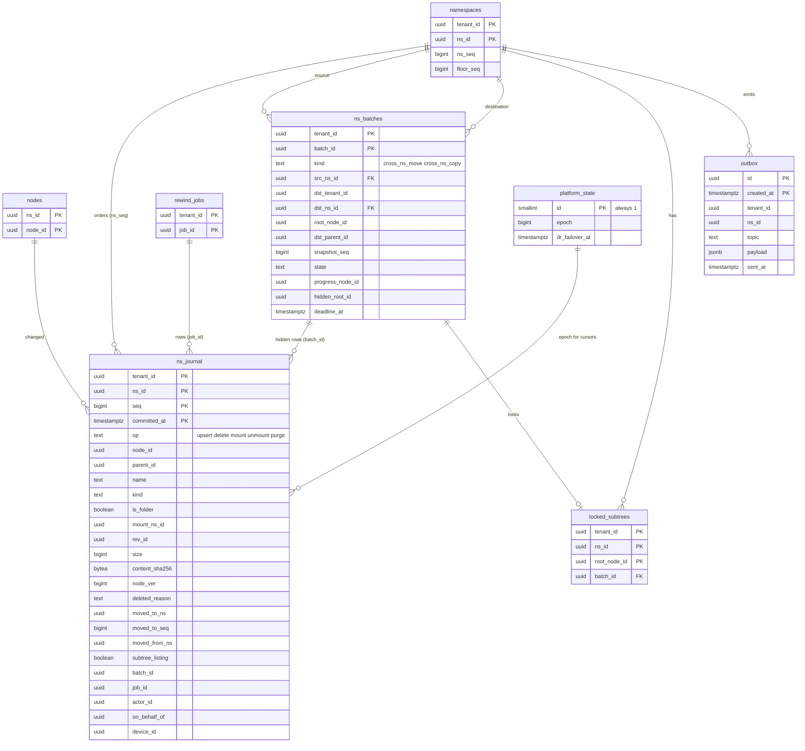

# Data model: ジャーナル・バッチ・outbox・`epoch`

[data-model.md](../data-model.md) の一部。規約はそちらの 3 節（とくに 3.7 節の番号）に従う。振る舞いは [metadata-and-journal.md](../metadata-and-journal.md) の 4〜8 節、[versions-and-recovery.md](../versions-and-recovery.md) の 6・7 節、[infrastructure.md](../infrastructure.md) の 6.3 節を正とする。決定は [ADR-0005](../../decisions/0005-namespace-journal-and-cursors.md)、[ADR-0021](../../decisions/0021-committer-operations-and-conditions.md)、[ADR-0022](../../decisions/0022-cross-namespace-batch-move-and-copy.md)、[ADR-0023](../../decisions/0023-tree-listing-snapshot-and-journal-retention.md)、[ADR-0048](../../decisions/0048-disaster-recovery-and-content-pending.md)。カーソルの形は [stores.md](stores.md) の 5 節。

| 表 | 置き場所 | 書く |
| --- | --- | --- |
| `ns_journal` | 名前空間の表、日の分割 | `committer` だけ（追記） |
| `ns_batches` | 名前空間の表（元か先） | `committer`（`batch-runner`） |
| `locked_subtrees` | 名前空間の表 | `committer` |
| `outbox` | `public`、テナントの文脈で書く | 全部の書き込みのサービス（`INSERT`）、`relay`（`sent_at`） |
| `platform_state` | `maint` | DR のワークフロー、運用者（break-glass） |

## 1. ER 図

## 2. 表

### 2.1 `ns_journal`

名前空間ごとの操作の列（[ADR-0005](../../decisions/0005-namespace-journal-and-cursors.md)）。行は「操作の後のノードの状態」を持ち、読む側は前の状態を知らなくても当てられる。定義元：ADR-0005、[metadata-and-journal.md](../metadata-and-journal.md) の 5.1 節。

| 列 | 型 | NULL | 既定 | 説明 |
| --- | --- | --- | --- | --- |
| `tenant_id` | `uuid` | NOT NULL | — | |
| `ns_id` | `uuid` | NOT NULL | — | |
| `seq` | `bigint` | NOT NULL | — | `ns_seq` の範囲から振った番号 |
| `committed_at` | `timestamptz` | NOT NULL | `now()` | トランザクションの時刻。分割の鍵 |
| `op` | `text` | NOT NULL | — | `upsert`・`delete`・`mount`・`unmount`・`purge` |
| `node_id` | `uuid` | NULL | — | `purge` の件数の行は NULL |
| `parent_id` | `uuid` | NULL | — | 操作の後の親 |
| `name` | `text` | NULL | — | 操作の後の名前（3.5 節の名前を持つ列） |
| `kind` | `text` | NULL | — | `file`・`folder`・`mount`（D-2） |
| `is_folder` | `boolean` | NULL | 生成 | `kind <> 'file'`（ADR-0005 の列） |
| `mount_ns_id` | `uuid` | NULL | — | マウントのノードの載せる名前空間 |
| `rev_id` | `uuid` | NULL | — | 操作の後の今のリビジョン |
| `size` | `bigint` | NULL | — | |
| `content_sha256` | `bytea` | NULL | — | |
| `node_ver` | `bigint` | NULL | — | 操作の後の置き場所のバージョン |
| `deleted_reason` | `text` | NULL | — | `delete` の理由 |
| `moved_to_ns`・`moved_to_seq` | `uuid`・`bigint` | NULL | — | 名前空間をまたぐ移動の元の `delete` |
| `moved_from_ns` | `uuid` | NULL | — | 移動先の `upsert` |
| `subtree_listing` | `boolean` | NOT NULL | `false` | 真なら「このフォルダーの子孫を一覧で読め」 |
| `batch_id` | `uuid` | NULL | — | 利用者に返さない行の印（バッチ） |
| `job_id` | `uuid` | NULL | — | 復元・巻き戻しの行 |
| `purge_count` | `integer` | NULL | — | `purge` の行が消した件数 |
| `actor_id` | `uuid` | NULL | — | 操作した人（システムの作業は NULL） |
| `on_behalf_of` | `uuid` | NULL | — | 管理者のアクセスの対象のメンバー（D-9。[ADR-0043](../../decisions/0043-admin-roles-device-wipe-and-member-access.md)） |
| `device_id` | `uuid` | NULL | — | |

- キー：PK `(tenant_id, ns_id, seq, committed_at)`（分割の鍵を含む。D-6）。`(ns_id, seq)` の一意は、名前空間の行のロックで番号を振ることと、`slo-aggregator` の連続の確かめで守る。
- 索引：
  - PK の `(tenant_id, ns_id, seq)` の前の部分 — `list/continue`（`seq` より後を順に）。ほかの索引を持たない（書き込みの量を抑える）。
- CHECK：
  - `op IN ('upsert','delete','mount','unmount','purge')`
  - `op = 'purge' OR node_id IS NOT NULL`
  - `op <> 'upsert' OR (parent_id IS NOT NULL OR node_id IS NOT NULL) AND kind IS NOT NULL AND node_ver IS NOT NULL`
  - `(moved_to_ns IS NULL) = (moved_to_seq IS NULL)`、`moved_to_ns IS NULL OR (op = 'delete' AND deleted_reason = 'moved')`
  - `op <> 'purge' OR batch_id IS NOT NULL OR purge_count IS NOT NULL`
- トリガー：`UPDATE`・`DELETE` を拒む（分割の `DROP` だけ）。
- 読む：`list/continue` は `batch_id` のある行と `purge` を飛ばし、同じノードの行を最後の 1 件にまとめる（[metadata-and-journal.md](../metadata-and-journal.md) の 5.2 節）。`indexer`・`activity-exporter` は outbox の合図の範囲を読む。
- 分割：`committed_at` の日（`pg_partman`）。1 つの分割は約 106 GB。
- 保持：92 日（カーソルは最後の利用から 90 日）。**法務の確認待ち：L6**（365 日なら約 38 TB）。
- RLS：名前空間の表。
- S1 の量：平均 5,100 行/秒 × 92 日 = 約 400 億行、9.5 TB（最大の表）。

### 2.2 `ns_batches`

名前空間をまたぐ移動とコピー（[ADR-0022](../../decisions/0022-cross-namespace-batch-move-and-copy.md)）。定義元：[metadata-and-journal.md](../metadata-and-journal.md) の 6 節。

| 列 | 型 | NULL | 既定 | 説明 |
| --- | --- | --- | --- | --- |
| `tenant_id` | `uuid` | NOT NULL | — | 元の名前空間の持ち主のテナント（D-15） |
| `batch_id` | `uuid` | NOT NULL | `uuidv7()` | |
| `kind` | `text` | NOT NULL | — | `cross_ns_move`・`cross_ns_copy` |
| `src_ns_id` | `uuid` | NOT NULL | — | |
| `dst_tenant_id` | `uuid` | NOT NULL | — | |
| `dst_ns_id` | `uuid` | NOT NULL | — | |
| `root_node_id` | `uuid` | NOT NULL | — | 元の部分木の根 |
| `dst_parent_id` | `uuid` | NOT NULL | — | 行き先の親 |
| `name` | `text` | NOT NULL | — | 行き先での名前（出す時にふさがっていれば ` 2` を足す） |
| `snapshot_seq` | `bigint` | NULL | — | コピーの元の時点（`node_versions` の木） |
| `state` | `text` | NOT NULL | `'accepted'` | `accepted`・`copying`・`blocks_pending`・`revealing`・`purging`・`done`・`aborting`・`aborted` |
| `progress_node_id` | `uuid` | NULL | — | 写し終えた位置（`node_id` の順。再開の点） |
| `hidden_root_id` | `uuid` | NULL | — | 移動先の隠した入れ物のノード |
| `abort_reason` | `text` | NULL | — | `timeout`・`permission_changed`・`failed` |
| `created_by` | `uuid` | NOT NULL | — | |
| `created_at` | `timestamptz` | NOT NULL | `now()` | |
| `deadline_at` | `timestamptz` | NOT NULL | `now() + 30 min` | 超えたら中止 |
| `finished_at` | `timestamptz` | NULL | — | |

- キー：PK `(tenant_id, batch_id)`。UK `batch_id`。
- 索引：`(state, deadline_at) WHERE state NOT IN ('done','aborted')` — 再開と時間切れの中止。
- CHECK：`kind IN (…)`、`state IN (…)`、`kind = 'cross_ns_copy' OR snapshot_seq IS NULL`、`src_ns_id <> dst_ns_id`。
- RLS：`src_ns_id = ANY(app.ns_ids) OR dst_ns_id = ANY(app.ns_ids)`。
- 保持：終わってから 30 日（この文書で決めた。調査のため）。S1 の量：同時に数百、1 日 数万行。

### 2.3 `locked_subtrees`

移動の間、元の部分木への commit を `subtree_locked` にする（[metadata-and-journal.md](../metadata-and-journal.md) の 6.2 節）。

| 列 | 型 | NULL | 既定 | 説明 |
| --- | --- | --- | --- | --- |
| `tenant_id` | `uuid` | NOT NULL | — | |
| `ns_id` | `uuid` | NOT NULL | — | 元の名前空間 |
| `root_node_id` | `uuid` | NOT NULL | — | |
| `batch_id` | `uuid` | NOT NULL | — | |
| `locked_at` | `timestamptz` | NOT NULL | `now()` | |

- キー：PK `(tenant_id, ns_id, root_node_id)`（D-14）。FK `batch_id` → `ns_batches(batch_id)`。
- `packages/committer` は、commit の対象のノードの祖先をたどるとき、名前空間の `locked_subtrees` の行（多くは 0〜数件）と照らす。
- RLS：名前空間の表。保持：出す・中止で消す。S1 の量：同時に数百。

### 2.4 `outbox`

確定した変更から流す出来事（D-10）。`packages/committer` と各サービスが、変更と同じトランザクションで書く。Relay が読み、Valkey の合図と SNS・SQS へ流す（[stores.md](stores.md) の 3 節）。

| 列 | 型 | NULL | 既定 | 説明 |
| --- | --- | --- | --- | --- |
| `id` | `uuid` | NOT NULL | `uuidv7()` | 消費者の冪等の鍵 |
| `created_at` | `timestamptz` | NOT NULL | `now()` | 分割の鍵 |
| `tenant_id` | `uuid` | NOT NULL | — | |
| `ns_id` | `uuid` | NULL | — | 名前空間の出来事 |
| `topic` | `text` | NOT NULL | — | `ns_committed`・`revision_created`・`commit_summary`・`access_changed`・`link_access`・`content_access`・`notification`・`mail`・`scan_requested`・`export_requested`・`membership_copy`（[stores.md](stores.md) の 3 節） |
| `payload` | `jsonb` | NOT NULL | — | ID・数・理由のコードだけ。名前・パス・中身を入れない |
| `traceparent` | `text` | NULL | — | W3C Trace Context |
| `sent_at` | `timestamptz` | NULL | — | Relay が送った時刻 |

- キー：PK `(id, created_at)`。
- 索引：`(created_at) WHERE sent_at IS NULL` — Relay の未送の読み出し（古い順）。
- CHECK：`topic IN (…)`。`payload` の形は `packages/contract` の Zod で検証してから書く。
- RLS：`FOR INSERT WITH CHECK (tenant_id = current_setting('app.tenant_id')::uuid)`。`SELECT`・`UPDATE` のポリシーは持たず、`relay`（`BYPASSRLS`、X4）だけが読み、`sent_at` を書く。
- 分割：`created_at` の日。保持：全部送ってから 1 日で `DROP`（DR の後、大阪の Relay は未送の行から流し直す）。
- S1 の量：1 日 約 4 億行（commit 1.5 億件 × 話題 2〜3）。

### 2.5 `maint.platform_state`

全体で 1 つの値（[infrastructure.md](../infrastructure.md) の 6.3 節）。

| 列 | 型 | NULL | 既定 | 説明 |
| --- | --- | --- | --- | --- |
| `id` | `smallint` | NOT NULL | `1` | 1 行だけ |
| `epoch` | `bigint` | NOT NULL | `1` | DR の切り替えと運用者の DB の時点への戻しでだけ上げる |
| `epoch_changed_at` | `timestamptz` | NOT NULL | `now()` | |
| `dr_failover_at` | `timestamptz` | NULL | — | 最後の切り替えの時刻（`dr-content-check` の起点） |
| `active_region` | `text` | NOT NULL | `'ap-northeast-1'` | |

- キー：PK `id`。CHECK：`id = 1`、`epoch >= 1`。トリガーで `epoch` を下げる更新を拒む。
- 変更はプラットフォームの監査（`platform_audit_events`）に書く。切り替えの記録の詳細もそちらに残す。
- `api`・`notify` は 60 秒ごとに読み、手元に持つ。カーソルの `epoch` と違えば 409 `reset`（`epoch`）。
