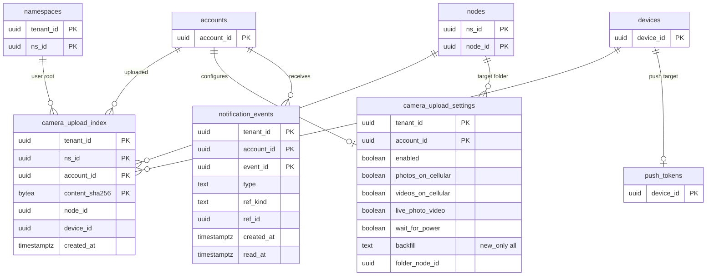

# Data model: モバイルとカメラのアップロード

[data-model.md](../data-model.md) の一部。規約はそちらの 3 節に従う。振る舞いは [mobile-and-camera-upload.md](../mobile-and-camera-upload.md)（5〜11 節）を正とする。決定は [ADR-0036](../../decisions/0036-camera-upload-identity-and-background.md)、[ADR-0037](../../decisions/0037-mobile-offline-files-and-content-free-push.md)。端末の側の表（`camera_assets`・`offline_pins`）は [client-local-db.md](client-local-db.md)、通知のトークンは [devices-and-sessions.md](devices-and-sessions.md) の 2.5 節、通知の送り方は [stores.md](stores.md) の 4 節。

| 表 | 置き場所 | 書く |
| --- | --- | --- |
| `camera_upload_index` | 名前空間の表（利用者のルート） | `committer`（カメラのアップロードの commit と同じトランザクション） |
| `camera_upload_settings` | テナントの表 | `api` |
| `notification_events` | テナントの表（受け手のテナント） | `notifier`（outbox の `notification` から、受け手のテナントの文脈で。D-22） |

## 1. ER 図

## 2. 表

### 2.1 `camera_upload_index`

アカウントの中の、カメラのアップロードの重複の防止（[ADR-0036](../../decisions/0036-camera-upload-identity-and-background.md)）。本人が上げたものだけを引くので、他人の有無を漏らさない。

| 列 | 型 | NULL | 既定 | 説明 |
| --- | --- | --- | --- | --- |
| `tenant_id` | `uuid` | NOT NULL | — | |
| `ns_id` | `uuid` | NOT NULL | — | 利用者のルートの名前空間 |
| `account_id` | `uuid` | NOT NULL | — | |
| `content_sha256` | `bytea` | NOT NULL | — | 端末が計算した全体の SHA-256（申告。重複の防止にだけ使う） |
| `node_id` | `uuid` | NOT NULL | — | 作ったノード（利用者が消しても行は残す） |
| `device_id` | `uuid` | NULL | — | |
| `created_at` | `timestamptz` | NOT NULL | `now()` | |

- キー：PK `(tenant_id, ns_id, account_id, content_sha256)`（一意。2 台が同時に上げたら、後の commit は 409 にして重複として `done`）。FK `(tenant_id, ns_id)` → `namespaces`。
- 索引：`(created_at)` — 1 年の掃除。
- CHECK：`octet_length(content_sha256) = 32`。
- 利用者がサーバーで消しても行を消さない（意図して消したものを蘇らせない）。
- RLS：名前空間の表。保持：1 年。S1 の量：約 5.5 億行（モバイル 15 万台 × 1 日 10 枚 × 365 日。初期見積もり）。

### 2.2 `camera_upload_settings`

アカウントごとのカメラのアップロードの設定（[mobile-and-camera-upload.md](../mobile-and-camera-upload.md) の 7・8.2 節）。チームの無効化は `team_policies.camera_uploads_enabled`。

| 列 | 型 | NULL | 既定 | 説明 |
| --- | --- | --- | --- | --- |
| `tenant_id` | `uuid` | NOT NULL | — | |
| `account_id` | `uuid` | NOT NULL | — | |
| `enabled` | `boolean` | NOT NULL | `false` | |
| `photos_on_cellular` | `boolean` | NOT NULL | `true` | |
| `videos_on_cellular` | `boolean` | NOT NULL | `false` | |
| `live_photo_video` | `boolean` | NOT NULL | `false` | Live Photo の対の動画 |
| `wait_for_power` | `text` | NOT NULL | `'videos'` | `none`・`videos`・`all` |
| `backfill` | `text` | NOT NULL | `'new_only'` | `new_only`・`all`（今までの写真も） |
| `folder_ns_id` | `uuid` | NULL | — | 上げ先のフォルダーの名前空間（利用者のルート） |
| `folder_node_id` | `uuid` | NULL | — | 上げ先のフォルダー（ID で持つ。消されたら新しく作る） |
| `updated_at` | `timestamptz` | NOT NULL | `now()` | |

- キー：PK `(tenant_id, account_id)`。`folder_node_id` は論理の参照（名前空間の表。消されても行は残る）。
- CHECK：`wait_for_power IN (…)`、`backfill IN (…)`、`(folder_ns_id IS NULL) = (folder_node_id IS NULL)`。
- 電池・省データ・ローミング・熱の条件は変えられない既定で、列を持たない。
- RLS：テナント。S1 の量：約 15 万行。

### 2.3 `notification_events`

アプリの中の通知の一覧と、プッシュの中身の取得の元（[ADR-0037](../../decisions/0037-mobile-offline-files-and-content-free-push.md)）。APNs・FCM には `{type, event_id}` だけを渡し、端末が `notifications/get { event_id }` で文を取る。

| 列 | 型 | NULL | 既定 | 説明 |
| --- | --- | --- | --- | --- |
| `tenant_id` | `uuid` | NOT NULL | — | 受け手のテナント |
| `account_id` | `uuid` | NOT NULL | — | 受け手 |
| `event_id` | `uuid` | NOT NULL | `uuidv7()` | 不透明な ID（プッシュに載せる） |
| `type` | `text` | NOT NULL | — | `share_invite`・`link_bandwidth_capped`・`camera_upload_paused`・`mass_change_alert`・`wipe_completed` など |
| `ref_kind` | `text` | NULL | — | `ns_invite`・`shared_link`・`mass_change_event`・`device` |
| `ref_id` | `uuid` | NULL | — | 参照する ID（名前は持たない。文は取得の時に `can()` の範囲で組み立てる） |
| `ref_tenant_id` | `uuid` | NULL | — | 参照先のテナント（招待は招いた側） |
| `params` | `jsonb` | NOT NULL | `'{}'` | 数と理由のコードだけ |
| `created_at` | `timestamptz` | NOT NULL | `now()` | |
| `read_at` | `timestamptz` | NULL | — | |
| `pushed_at` | `timestamptz` | NULL | — | プッシュを出した時刻（`release.mobile-push` の後） |

- キー：PK `(tenant_id, account_id, event_id)`。UK `event_id`（`notifications/get` の引き当て。本人の確かめは `account_id` で行う）。
- 索引：`(tenant_id, account_id, created_at DESC)` — アプリの通知の一覧。`(created_at)` — 90 日の掃除。
- CHECK：`type IN (…)`。`params` に名前・メールアドレス・パスを入れない（Zod の形で検証）。
- RLS：テナント。保持：90 日。S1 の量：約 1 億行（90 日。初期見積もり）。
