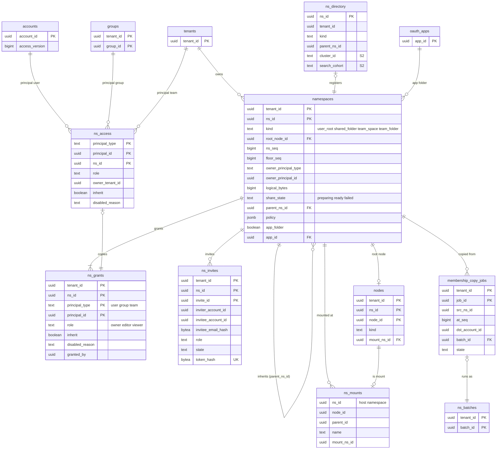

# Data model: 名前空間とメンバー

[data-model.md](../data-model.md) の一部。規約はそちらの 3 節に従う。振る舞いは [namespaces-and-sharing.md](../namespaces-and-sharing.md)（4〜10 節）、[metadata-and-journal.md](../metadata-and-journal.md) の 4・8 節、[api-and-webhooks.md](../api-and-webhooks.md) の 7.3 節を正とする。決定は [ADR-0004](../../decisions/0004-tenancy-namespaces-and-rls.md)、[ADR-0005](../../decisions/0005-namespace-journal-and-cursors.md)、[ADR-0024](../../decisions/0024-shared-folder-mounts-and-grants.md)、[ADR-0025](../../decisions/0025-team-space-and-external-sharing-policy.md)、[ADR-0026](../../decisions/0026-membership-lifecycle-and-quota.md)、[ADR-0039](../../decisions/0039-oauth-apps-scopes-and-rate-limits.md)。

| 表 | 置き場所 | 書く |
| --- | --- | --- |
| `namespaces` | 名前空間の表 | `committer`（作成、`ns_seq`・`floor_seq`・`logical_bytes`・`share_state`） |
| `ns_directory` | `public`、RLS の外 | `access` |
| `ns_access` | `public`、RLS の外 | `access`（`ns_grants` と同じトランザクション） |
| `ns_grants`・`ns_invites` | 名前空間の表 | `access` |
| `ns_mounts` | ビュー（`nodes`） | — |
| `membership_copy_jobs` | テナントの表 | `access`、`batch-runner` |

## 1. ER 図



- `ns_access` の主体（`accounts`・`groups`・`tenants`）への関係は論理の参照（`principal_type` で相手の表が変わる）。DB の外部キーを張らない。
- `namespaces.parent_ns_id` は継承の親（`team_folder` の制限したフォルダー。深さ 4）。

## 2. 表

### 2.1 `namespaces`

名前空間。共有の単位であり、`ns_seq` とジャーナルの単位（[ADR-0004](../../decisions/0004-tenancy-namespaces-and-rls.md)、[ADR-0005](../../decisions/0005-namespace-journal-and-cursors.md)）。名前を持たない（名前は載せる側のマウントのノード）。定義元：[metadata-and-journal.md](../metadata-and-journal.md) の 13 節、[namespaces-and-sharing.md](../namespaces-and-sharing.md) の 13 節、[api-and-webhooks.md](../api-and-webhooks.md) の 11 節。

| 列 | 型 | NULL | 既定 | 説明 |
| --- | --- | --- | --- | --- |
| `tenant_id` | `uuid` | NOT NULL | — | 持ち主のテナント。作った後に変えない（[ADR-0026](../../decisions/0026-membership-lifecycle-and-quota.md)） |
| `ns_id` | `uuid` | NOT NULL | `uuidv7()` | |
| `kind` | `text` | NOT NULL | — | `user_root`・`shared_folder`・`team_space`・`team_folder` |
| `root_node_id` | `uuid` | NOT NULL | — | 最上位のノード（`parent_id` を持たないフォルダー） |
| `ns_seq` | `bigint` | NOT NULL | `0` | 最後に振った番号（3.7 節） |
| `floor_seq` | `bigint` | NOT NULL | `0` | 保持の下限の番号。特別な場合だけ上げる（[ADR-0023](../../decisions/0023-tree-listing-snapshot-and-journal-retention.md)） |
| `owner_principal_type` | `text` | NOT NULL | — | `user`（`user_root`・`shared_folder`）・`team`（`team_space`・`team_folder`） |
| `owner_principal_id` | `uuid` | NOT NULL | — | `account_id` か `tenant_id` |
| `logical_bytes` | `bigint` | NOT NULL | `0` | 削除していないファイルの今のリビジョンの大きさの和。commit ごとに差分で直す（[ADR-0026](../../decisions/0026-membership-lifecycle-and-quota.md)） |
| `share_state` | `text` | NULL | — | 既存のフォルダーの共有の進み：`preparing`・`ready`・`failed` |
| `parent_ns_id` | `uuid` | NULL | — | 継承の親（`team_folder` だけ） |
| `policy` | `jsonb` | NOT NULL | `'{}'` | `{members_can_invite: "editor"|"owner", editors_can_manage: bool}`（`shared_folder`） |
| `app_folder` | `boolean` | NOT NULL | `false` | アプリのフォルダー（[ADR-0039](../../decisions/0039-oauth-apps-scopes-and-rate-limits.md)） |
| `app_id` | `uuid` | NULL | — | `app_folder` のアプリ |
| `created_at` | `timestamptz` | NOT NULL | `now()` | |

- キー：PK `(tenant_id, ns_id)`。UK `ns_id`（ほかの表の外部キーの先）。FK `(tenant_id, root_node_id)` → `nodes`（`DEFERRABLE INITIALLY DEFERRED`。名前空間と最上位のノードを同じトランザクションで作る）、`(tenant_id, parent_ns_id)` → `namespaces`。
- 索引：`(tenant_id, kind)` — テナントの名前空間の和（`quota`）、テナントの消去。`(app_id) WHERE app_folder` — アプリの取り消し。
- CHECK：
  - `kind IN (…)`、`share_state IN (…)`
  - `ns_seq >= floor_seq AND floor_seq >= 0`、`logical_bytes >= 0`
  - `app_folder = (app_id IS NOT NULL)`、`NOT app_folder OR kind = 'shared_folder'`
  - `parent_ns_id IS NULL OR kind = 'team_folder'`
- トリガー：`ns_seq`・`floor_seq` を下げる更新を拒む。`tenant_id` の変更を拒む。
- 書く：`committer` だけ（`ns_seq` を振る行のロックがすべての commit の直列化の点）。
- RLS：名前空間の表。
- 保持：テナントの消去まで（共有の解除でも消さない）。
- S1 の量：約 160 万行（`user_root` 50 万、`shared_folder` 100 万、`team_space` 2,000、`team_folder` 10 万）。

### 2.2 `ns_directory`

名前空間 → テナント（S2 でクラスタ）。RLS の外（[ADR-0004](../../decisions/0004-tenancy-namespaces-and-rls.md)）。`packages/access` と Notify と `link` が引く。

| 列 | 型 | NULL | 既定 | 説明 |
| --- | --- | --- | --- | --- |
| `ns_id` | `uuid` | NOT NULL | — | |
| `tenant_id` | `uuid` | NOT NULL | — | 持ち主のテナント |
| `kind` | `text` | NOT NULL | — | `namespaces.kind` の写し（D-16） |
| `parent_ns_id` | `uuid` | NULL | — | 継承の親の写し（D-16） |
| `cluster_id` | `text` | NULL | — | S2：Aurora のクラスタ |
| `search_cohort` | `text` | NULL | — | S2：検索の索引の集まり（[search.md](../search.md) の 8 節） |
| `created_at` | `timestamptz` | NOT NULL | `now()` | |

- キー：PK `ns_id`。
- 索引：`(tenant_id)` — テナントの名前空間の一覧（消去、検索の経路の `routing`）。
- 書く：名前空間の作成と同じトランザクション（S1）。S2 では作成の後に冪等に写す。
- S1 の量：約 160 万行。

### 2.3 `ns_grants`

名前空間の権限の付与（[ADR-0024](../../decisions/0024-shared-folder-mounts-and-grants.md)、[namespaces-and-sharing.md](../namespaces-and-sharing.md) の 5.1 節）。

| 列 | 型 | NULL | 既定 | 説明 |
| --- | --- | --- | --- | --- |
| `tenant_id` | `uuid` | NOT NULL | — | 名前空間の持ち主のテナント |
| `ns_id` | `uuid` | NOT NULL | — | |
| `principal_type` | `text` | NOT NULL | — | `user`・`group`・`team` |
| `principal_id` | `uuid` | NOT NULL | — | `account_id`・`group_id`・`tenant_id` |
| `role` | `text` | NOT NULL | — | `owner`・`editor`・`viewer` |
| `inherit` | `boolean` | NOT NULL | `true` | 親の名前空間の付与を継ぐか（`team_folder` だけ意味を持つ） |
| `disabled_reason` | `text` | NULL | — | `external_policy`・`account_suspended` など。無効の行は判定に使わない |
| `granted_by` | `uuid` | NOT NULL | — | `account_id` |
| `granted_at` | `timestamptz` | NOT NULL | `now()` | |

- キー：PK `(tenant_id, ns_id, principal_type, principal_id)`。FK `(tenant_id, ns_id)` → `namespaces`。
- 一意：`UNIQUE (ns_id) WHERE role = 'owner'`（`owner` は 1 つ）。
- 索引：`(tenant_id, ns_id, principal_type) WHERE disabled_reason IS NULL` — メンバーの一覧、上限（直接の利用者 5,000、グループ 500）の数え。
- CHECK：`principal_type IN (…)`、`role IN (…)`、`disabled_reason IS NULL OR disabled_reason IN ('external_policy','account_suspended','owner_removed')`。
- 書く：`access`。同じトランザクションで `ns_access` を直し、関わる主体の `access_version` を上げる。
- RLS：名前空間の表。
- 保持：外す・共有の解除で行を消す（履歴は監査ログ）。
- S1 の量：約 400 万行。

### 2.4 `ns_access`

主体 → 名前空間、役割、持ち主のテナント。`ns_grants` の写しで、RLS の外（[ADR-0004](../../decisions/0004-tenancy-namespaces-and-rls.md)）。利用者ごとに展開しない（グループ 1 つは 1 行）。

| 列 | 型 | NULL | 既定 | 説明 |
| --- | --- | --- | --- | --- |
| `principal_type` | `text` | NOT NULL | — | |
| `principal_id` | `uuid` | NOT NULL | — | |
| `ns_id` | `uuid` | NOT NULL | — | |
| `role` | `text` | NOT NULL | — | |
| `owner_tenant_id` | `uuid` | NOT NULL | — | 名前空間の持ち主のテナント（チームの外の判定） |
| `inherit` | `boolean` | NOT NULL | — | |
| `disabled_reason` | `text` | NULL | — | |
| `updated_at` | `timestamptz` | NOT NULL | `now()` | |

- キー：PK `(principal_type, principal_id, ns_id)`。
- 索引：`(ns_id)` — 名前空間を読める主体（Webhook の扇、方針の変更での無効化）。
- 書く：`access` だけ。`ns_grants` と同じトランザクション（S2 ではディレクトリのクラスタへ冪等に写し、作り直しの照合を毎日行う）。
- 読み出し：`packages/access` が主体の集合（利用者、属するグループ、チーム）で引き、継承・役割の最大・外への上限・端末の状態を当てて `{ns_id → role}` を作る。結果は Valkey の `acc:<account_id>:<access_version>`（10 分）。
- S1 の量：約 400 万行。

### 2.5 `ns_invites`

共有フォルダーへの招待（[namespaces-and-sharing.md](../namespaces-and-sharing.md) の 7.1 節）。

| 列 | 型 | NULL | 既定 | 説明 |
| --- | --- | --- | --- | --- |
| `tenant_id` | `uuid` | NOT NULL | — | |
| `ns_id` | `uuid` | NOT NULL | — | |
| `invite_id` | `uuid` | NOT NULL | `uuidv7()` | |
| `inviter_account_id` | `uuid` | NOT NULL | — | |
| `invitee_account_id` | `uuid` | NULL | — | アカウントのある相手 |
| `invitee_email_hash` | `bytea` | NULL | — | アカウントのない相手のメールアドレス（正規化）の SHA-256 |
| `role` | `text` | NOT NULL | — | `editor`・`viewer` |
| `state` | `text` | NOT NULL | `'pending'` | `pending`・`accepted`・`declined`・`revoked`・`expired`・`blocked` |
| `token_hash` | `bytea` | NULL | — | `<brand>_inv_…` の SHA-256（メールの招待。D-18） |
| `expires_at` | `timestamptz` | NOT NULL | `now() + 30 days` | |
| `created_at`・`decided_at` | `timestamptz` | — | — | |

- キー：PK `(tenant_id, ns_id, invite_id)`。UK `token_hash`。FK `(tenant_id, ns_id)` → `namespaces`。
- 索引：`(invitee_account_id) WHERE state = 'pending'` — 招かれた人の待ちの一覧（`ns_invite_resolve()` の中で引く。D-21）。`(tenant_id, ns_id) WHERE state = 'pending'` — 1 名前空間 1,000 の上限。`(expires_at) WHERE state = 'pending'` — 期限。
- CHECK：`(invitee_account_id IS NULL) <> (invitee_email_hash IS NULL)`、`invitee_email_hash IS NULL OR token_hash IS NOT NULL`、`role IN ('editor','viewer')`。
- RLS：名前空間の表。招かれた人の読み出しは `ns_invite_resolve()`（`SECURITY DEFINER`、X5）だけで、招待の状態・役割・共有フォルダーの最上位のノードの名前を返す。
- 保持：決まってから 90 日で消す（この文書で決めた）。S1 の量：数十万行。

### 2.6 `ns_mounts`（ビュー）

マウントのノードの見え方（D-3）。[ADR-0004](../../decisions/0004-tenancy-namespaces-and-rls.md) の名前空間の表の一覧の `ns_mounts` は、このビューを指す。

```sql
CREATE VIEW ns_mounts WITH (security_invoker = true) AS
SELECT tenant_id, ns_id, node_id, parent_id, name, name_key, mount_ns_id, node_ver, deleted_at
FROM nodes
WHERE kind = 'mount';
```

- `nodes` の RLS がそのまま効く。索引は `nodes` の `(mount_ns_id) WHERE kind = 'mount'`（[nodes-and-revisions.md](nodes-and-revisions.md) の 2.1 節）。
- パスの解決で載せた名前空間へ移るとき、利用者の木を組み立てるときに引く。

### 2.7 `membership_copy_jobs`

外された・抜けたメンバーへの写しの作業（[ADR-0026](../../decisions/0026-membership-lifecycle-and-quota.md)、[namespaces-and-sharing.md](../namespaces-and-sharing.md) の 7.2・9 節）。写しそのものは名前空間をまたぐコピーのバッチ（`ns_batches`）で行う。

| 列 | 型 | NULL | 既定 | 説明 |
| --- | --- | --- | --- | --- |
| `tenant_id` | `uuid` | NOT NULL | — | 元の名前空間の持ち主のテナント |
| `job_id` | `uuid` | NOT NULL | `uuidv7()` | |
| `kind` | `text` | NOT NULL | — | `leave_copy`・`remove_copy`・`unshare_copy`・`transfer_copy` |
| `src_ns_id` | `uuid` | NOT NULL | — | |
| `at_seq` | `bigint` | NOT NULL | — | 外した時点の `ns_seq`（その時点の木を写す） |
| `dst_account_id` | `uuid` | NOT NULL | — | 写し先の人（写し先はその人のルート） |
| `allowed_by` | `uuid` | NOT NULL | — | 許した人（監査ログにも残す） |
| `batch_id` | `uuid` | NULL | — | 始めたバッチ |
| `state` | `text` | NOT NULL | `'queued'` | `queued`・`running`・`done`・`failed` |
| `created_at`・`finished_at` | `timestamptz` | — | — | |

- キー：PK `(tenant_id, job_id)`。
- 索引：`(tenant_id, state) WHERE state IN ('queued','running')` — 再試行。
- RLS：テナント。保持：終わってから 90 日（この文書で決めた）。S1 の量：数千行。
