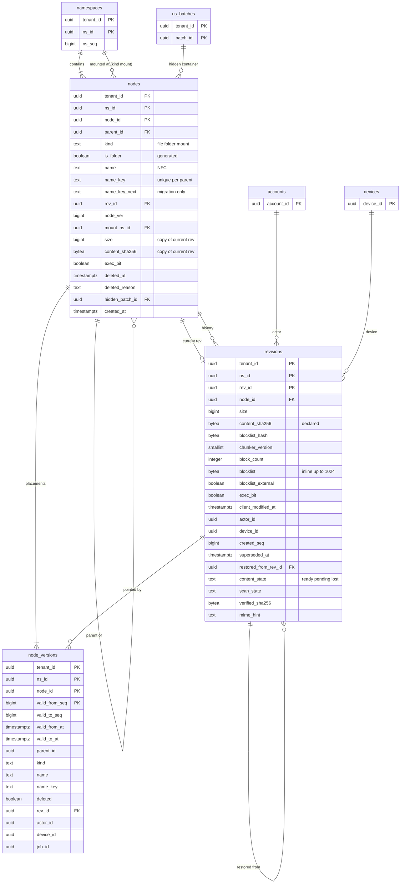

# Data model: ノード・リビジョン・置き場所のバージョン

[data-model.md](../data-model.md) の一部。規約はそちらの 3 節（とくに 3.5 節の名前、3.6 節のハッシュ）に従う。振る舞いは [metadata-and-journal.md](../metadata-and-journal.md) の 4・6・7 節、[versions-and-recovery.md](../versions-and-recovery.md) の 4〜6 節、[block-storage.md](../block-storage.md) の 4.4 節、[security.md](../security.md) の 6 節、[infrastructure.md](../infrastructure.md) の 6.4 節を正とする。決定は [ADR-0002](../../decisions/0002-chunking-and-block-addressing.md)、[ADR-0008](../../decisions/0008-node-identity-and-names.md)、[ADR-0021](../../decisions/0021-committer-operations-and-conditions.md)、[ADR-0022](../../decisions/0022-cross-namespace-batch-move-and-copy.md)、[ADR-0024](../../decisions/0024-shared-folder-mounts-and-grants.md)、[ADR-0029](../../decisions/0029-revision-and-placement-retention.md)、[ADR-0046](../../decisions/0046-content-scanning-framework.md)、[ADR-0048](../../decisions/0048-disaster-recovery-and-content-pending.md)。

3 つとも名前空間の表。書くのは `committer` のロールだけ（`nodes.name_key_next` は `committer_maint`）。

## 1. ER 図

- `revisions.actor_id`・`device_id` → `auth` は論理の参照（S2 で別のクラスタ）。
- `nodes.rev_id` → `revisions` は `(tenant_id, ns_id, rev_id)` の外部キー（`DEFERRABLE INITIALLY DEFERRED`）。

## 2. 表

### 2.1 `nodes`

ファイル・フォルダー・マウントのノード（[ADR-0008](../../decisions/0008-node-identity-and-names.md)、[ADR-0024](../../decisions/0024-shared-folder-mounts-and-grants.md)）。定義元：[metadata-and-journal.md](../metadata-and-journal.md) の 13 節。

| 列 | 型 | NULL | 既定 | 説明 |
| --- | --- | --- | --- | --- |
| `tenant_id` | `uuid` | NOT NULL | — | |
| `ns_id` | `uuid` | NOT NULL | — | |
| `node_id` | `uuid` | NOT NULL | `uuidv7()` | 名前空間をまたぐ移動でも同じ |
| `parent_id` | `uuid` | NULL | — | 最上位のノードだけ NULL |
| `kind` | `text` | NOT NULL | — | `file`・`folder`・`mount`（D-2） |
| `is_folder` | `boolean` | NOT NULL | 生成 | `GENERATED ALWAYS AS (kind <> 'file') STORED` |
| `name` | `text` | NOT NULL | — | NFC。最上位のノードは `''` |
| `name_key` | `text` | NOT NULL | — | 3.5 節。照合順序 `"C"` |
| `name_key_next` | `text` | NULL | — | `names_version` の移行の間だけ使う影の列（D-4） |
| `rev_id` | `uuid` | NULL | — | 今のリビジョン（ファイルだけ） |
| `node_ver` | `bigint` | NOT NULL | `1` | 親・名前・削除の状態が変わるたびに 1 上げる |
| `mount_ns_id` | `uuid` | NULL | — | `kind = 'mount'` のとき載せる名前空間 |
| `size` | `bigint` | NULL | — | 今のリビジョンの大きさの写し（ファイル） |
| `content_sha256` | `bytea` | NULL | — | 今のリビジョンの写し（ファイル） |
| `exec_bit` | `boolean` | NOT NULL | `false` | 実行の属性（[file-system-integration.md](../file-system-integration.md) の 8.4 節） |
| `deleted_at` | `timestamptz` | NULL | — | 墓石 |
| `deleted_reason` | `text` | NULL | — | `user`・`moved`・`rewind`・`restore_replaced` |
| `hidden_batch_id` | `uuid` | NULL | — | 名前空間をまたぐバッチの隠した入れ物（木に出さない。[ADR-0022](../../decisions/0022-cross-namespace-batch-move-and-copy.md)） |
| `created_at` | `timestamptz` | NOT NULL | `now()` | |
| `updated_at` | `timestamptz` | NOT NULL | `now()` | |

- キー：PK `(tenant_id, ns_id, node_id)`。FK `(tenant_id, ns_id)` → `namespaces`、`(tenant_id, ns_id, parent_id)` → `nodes`、`(tenant_id, ns_id, rev_id)` → `revisions`（遅らせる）、`mount_ns_id` → `namespaces(ns_id)`（同じクラスタの間だけ。S2 でテナントのクラスタが違えば論理の参照）。
- 一意：
  - `nodes_live_name_uk`：`UNIQUE (ns_id, parent_id, name_key) WHERE deleted_at IS NULL`（名前の一意。2 段の置き場所で、どの時点でも満たす）
  - `UNIQUE (ns_id) WHERE parent_id IS NULL`（最上位は 1 つ）
  - 移行の間：`UNIQUE (ns_id, parent_id, name_key_next) WHERE deleted_at IS NULL AND name_key_next IS NOT NULL`（`CREATE INDEX CONCURRENTLY`。切り替えの後に元の索引と入れ替える）
- 索引：
  - `(ns_id, parent_id, name_key)` — 上の一意がそのまま、子の一覧（`list_children`、`name_key` の順）とパスの解決に使う
  - `(ns_id, node_id) WHERE deleted_at IS NULL AND hidden_batch_id IS NULL` — 木の一覧（`list_tree`、`node_id` の順、2,000 ずつ）
  - `(ns_id, deleted_at) WHERE deleted_at IS NOT NULL` — 削除したファイルの一覧、保持の期限
  - `(mount_ns_id) WHERE kind = 'mount'` — 名前空間がどこに載っているか（外すときの `unmount`）
  - `(ns_id, hidden_batch_id) WHERE hidden_batch_id IS NOT NULL` — バッチの片付け
- CHECK：
  - `kind IN ('file','folder','mount')`
  - `(kind = 'mount') = (mount_ns_id IS NOT NULL)`
  - `kind = 'file' OR rev_id IS NULL`、`kind <> 'file' OR deleted_at IS NOT NULL OR rev_id IS NOT NULL`（見えているファイルは今のリビジョンを持つ）
  - 名前：`octet_length(name) <= 255`、`name !~ '[\x00-\x1f\x7f/]'`、`name NOT IN ('.','..')`、`parent_id IS NULL OR name <> ''`
  - `name_key` が NUL で始まるなら `name_key = E'\\x00' || node_id::text`（2 段の置き場所の仮の値だけ）
  - `(deleted_at IS NULL) = (deleted_reason IS NULL)`、`deleted_reason IN ('user','moved','rewind','restore_replaced')`
  - `size IS NULL OR size BETWEEN 0 AND 2199023255552`（2 TiB）
- トリガー：`node_ver` を下げる更新を拒む。`parent_id`・`name`・`deleted_at` が変わって `node_ver` が上がらない更新を拒む。`tenant_id`・`ns_id`・`node_id` の変更を拒む（名前空間をまたぐ移動は別の行を作る）。
- 循環の検査と深さ（256 段）は `packages/committer` が 2 段目の後に行う（DB の制約にしない）。
- 書く：`committer` だけ。
- RLS：名前空間の表。`investigator` は `name`・`name_key` を除いたビューだけ。
- 保持：削除したノードは、削除（祖先の削除で見えないものは祖先の削除）からプランの保持の期間の後に `lifecycle` が消す（L6・L8）。
- S1 の量：25 億行、2.2 TB（索引を含む。[capacity.md](../capacity.md) の 5.1 節）。

### 2.2 `revisions`

ファイルの中身のリビジョン。行は不変（`superseded_at`・`content_state`・`scan_state` などの状態の列を除く）。定義元：[metadata-and-journal.md](../metadata-and-journal.md) の 13 節、[versions-and-recovery.md](../versions-and-recovery.md) の 13 節、[security.md](../security.md) の 16 節、[infrastructure.md](../infrastructure.md) の 13 節、[previews-and-thumbnails.md](../previews-and-thumbnails.md) の 12 節。

| 列 | 型 | NULL | 既定 | 説明 |
| --- | --- | --- | --- | --- |
| `tenant_id` | `uuid` | NOT NULL | — | |
| `ns_id` | `uuid` | NOT NULL | — | |
| `rev_id` | `uuid` | NOT NULL | `uuidv7()` | 名前空間をまたぐ移動で引き継ぐ（D-8） |
| `node_id` | `uuid` | NOT NULL | — | |
| `size` | `bigint` | NOT NULL | — | ブロックの大きさの和と一致 |
| `content_sha256` | `bytea` | NOT NULL | — | 申告（信用しない。3.6 節） |
| `blocklist_hash` | `bytea` | NOT NULL | — | サーバーが一覧から計算し直して確かめた値 |
| `chunker_version` | `smallint` | NOT NULL | — | `0`・`1` |
| `block_count` | `integer` | NOT NULL | — | 0（空のファイル）〜約 210 万 |
| `blocklist` | `bytea` | NULL | — | 1,024 ブロックまで：36 バイトの組（大きさ u32 BE ＋ SHA-256）の並び（D-7） |
| `blocklist_external` | `boolean` | NOT NULL | `false` | 真なら S3 の `bl/<h4>/<tenant_id>/<blocklist_hash>` にある |
| `exec_bit` | `boolean` | NOT NULL | `false` | |
| `client_modified_at` | `timestamptz` | NULL | — | 端末の申告（表示だけ） |
| `actor_id` | `uuid` | NOT NULL | — | 書いた人の `account_id` |
| `device_id` | `uuid` | NULL | — | 書いた端末（Web・API は NULL） |
| `created_seq` | `bigint` | NOT NULL | — | 作った commit の `ns_seq` |
| `created_at` | `timestamptz` | NOT NULL | `now()` | |
| `superseded_at` | `timestamptz` | NULL | — | 次のリビジョンに置き換えられた時刻、またはノードの削除の時刻。保持の数え始め（[ADR-0029](../../decisions/0029-revision-and-placement-retention.md)） |
| `restored_from_rev_id` | `uuid` | NULL | — | バージョンの復元・巻き戻しで写した元 |
| `content_state` | `text` | NOT NULL | `'ready'` | `ready`・`pending`・`lost`（DR の後の中身の待ち。[ADR-0048](../../decisions/0048-disaster-recovery-and-content-pending.md)） |
| `scan_state` | `text` | NULL | — | `pending`・`clean`・`malicious`・`hash_match`・`integrity_mismatch`。検査の範囲の外は NULL（[ADR-0046](../../decisions/0046-content-scanning-framework.md)） |
| `scanned_at` | `timestamptz` | NULL | — | |
| `scan_engine_version` | `text` | NULL | — | |
| `verified_sha256` | `bytea` | NULL | — | `content-scanner` が計算した全体の SHA-256 |
| `mime_hint` | `text` | NULL | — | クライアントの申告と先頭のバイトの判定（プレビューの形式の判定。名前の拡張子は使わない） |

- キー：PK `(tenant_id, ns_id, rev_id)`。FK `(tenant_id, ns_id, node_id)` → `nodes`、`(tenant_id, ns_id, restored_from_rev_id)` → `revisions`（`ON DELETE SET NULL`。元が先に期限で消えうる）。
- 索引：
  - `(ns_id, node_id, created_seq)` — バージョンの一覧（新しい順）
  - `(ns_id, superseded_at) WHERE superseded_at IS NOT NULL` — 保持の期限（`lifecycle`）
  - `(ns_id, created_at)` — その日のリビジョンの参照の監査、DR の後の確かめ（`dr_failover_at` の前 60 分）
  - `(content_state) WHERE content_state <> 'ready'` — 中身の待ち
  - `(scan_state) WHERE scan_state IN ('pending','hash_match','integrity_mismatch')` — 検査の待ちと人の確認
- CHECK：
  - `octet_length(content_sha256) = 32`、`octet_length(blocklist_hash) = 32`、`verified_sha256 IS NULL OR octet_length(verified_sha256) = 32`
  - `chunker_version IN (0,1)`
  - `size BETWEEN 0 AND 2199023255552`
  - `blocklist_external = (block_count > 1024)`、`blocklist_external OR octet_length(blocklist) = 36 * block_count`、`NOT blocklist_external OR blocklist IS NULL`
  - `content_state IN (…)`、`scan_state IS NULL OR scan_state IN (…)`
- トリガー：`size`・`content_sha256`・`blocklist_hash`・`blocklist`・`chunker_version`・`node_id`・`created_seq` の更新を拒む（中身は不変）。今のリビジョン（`nodes.rev_id` が指す）の削除を拒む（[ADR-0029](../../decisions/0029-revision-and-placement-retention.md)）。
- 書く：`committer`（作成、`superseded_at`、消去）、`scan-results` の Worker（`scan_state`・`verified_sha256` の列だけ。`committer` のロールの関数 `set_scan_result()` を通す）、`dr-content-check`（`content_state`）。
- 作成と同じトランザクションで、一覧の重なりのないハッシュごとに `ns_block_refs.ref_count` を 1 足す（D-26）。消去で 1 減らす。
- RLS：名前空間の表。
- 保持：今のリビジョンは消さない。古いものは `superseded_at` からプランの保持の期間（30・180・365 日。L6・L8）。
- S1 の量：60 億行（今のもの 20 億＋保持の中の古いもの）、2.4 TB。1,024 ブロック以下の一覧の平均は 2 ブロックで約 72 バイト。

### 2.3 `node_versions`

置き場所のバージョンの履歴（時点の木）。`packages/committer` がノードの置き場所かリビジョンを変えるたびに 1 行足し、前の行の終わりを埋める（[ADR-0029](../../decisions/0029-revision-and-placement-retention.md)）。定義元：[versions-and-recovery.md](../versions-and-recovery.md) の 4.1・6.1 節。

| 列 | 型 | NULL | 既定 | 説明 |
| --- | --- | --- | --- | --- |
| `tenant_id` | `uuid` | NOT NULL | — | |
| `ns_id` | `uuid` | NOT NULL | — | |
| `node_id` | `uuid` | NOT NULL | — | |
| `valid_from_seq` | `bigint` | NOT NULL | — | このバージョンを作った commit の `ns_seq` |
| `valid_to_seq` | `bigint` | NULL | — | 次のバージョンの `valid_from_seq`。今のものは NULL |
| `valid_from_at` | `timestamptz` | NOT NULL | — | 確定の時刻 |
| `valid_to_at` | `timestamptz` | NULL | — | 保持の数え始め |
| `node_ver` | `bigint` | NOT NULL | — | その時の `nodes.node_ver` |
| `parent_id` | `uuid` | NULL | — | |
| `kind` | `text` | NOT NULL | — | D-2 |
| `is_folder` | `boolean` | NOT NULL | 生成 | `kind <> 'file'` |
| `name` | `text` | NOT NULL | — | |
| `name_key` | `text` | NOT NULL | — | |
| `mount_ns_id` | `uuid` | NULL | — | |
| `deleted` | `boolean` | NOT NULL | `false` | |
| `rev_id` | `uuid` | NULL | — | その時の今のリビジョン |
| `actor_id` | `uuid` | NOT NULL | — | |
| `device_id` | `uuid` | NULL | — | |
| `job_id` | `uuid` | NULL | — | 復元・巻き戻しの作業 |

- キー：PK `(tenant_id, ns_id, node_id, valid_from_seq)`。FK `(tenant_id, ns_id)` → `namespaces`。`rev_id` は論理の参照（リビジョンが先に期限で消えうる。期限の処理は同じ期間で両方を消す）。
- 索引：
  - `(ns_id, valid_from_at)` — 時刻 t から S_t を求める、活動のグラフ（1 時間ごとの変化の数）
  - `(ns_id, valid_to_at) WHERE valid_to_at IS NOT NULL` — 保持の期限
  - `(ns_id, valid_from_seq, valid_to_seq)` — 時点の木（`valid_from_seq ≤ S_t < coalesce(valid_to_seq, ∞)`）。名前空間をまたぐコピーの `snapshot_seq` の木
  - `(ns_id, parent_id, valid_from_seq)` — フォルダーの単位の時点の木（子をたどる）
- CHECK：`valid_to_seq IS NULL OR valid_to_seq > valid_from_seq`、`(valid_to_seq IS NULL) = (valid_to_at IS NULL)`、`kind IN (…)`。
- 一意：`UNIQUE (tenant_id, ns_id, node_id) WHERE valid_to_seq IS NULL`（今のバージョンは 1 つ。分割の中の部分の一意で、分割の鍵の `ns_id` を含む）。
- 分割：`ns_id` のハッシュで 64（D-5）。今のバージョンは期限で消えないので、時刻の分割を落とせない。
- 書く：`committer` だけ。名前空間をまたぐ移動では、保持の期間の中の行を移動先へ写し、元を後始末で消す。
- RLS：名前空間の表。`investigator` は `name`・`name_key` を除いたビュー。
- 保持：`valid_to_at` からプランの保持の期間。今のバージョン（`valid_to_seq IS NULL`）は、見えているノードなら消さない。削除したノードの最後のバージョンは、ノードと一緒に消す。
- S1 の量：約 75 億行、約 3 TB（ノード 25 億の今の行＋保持の中の古い行。**初期見積もり**。E8 の前に合成で測る。[data-model.md](../data-model.md) の 9 節）。
