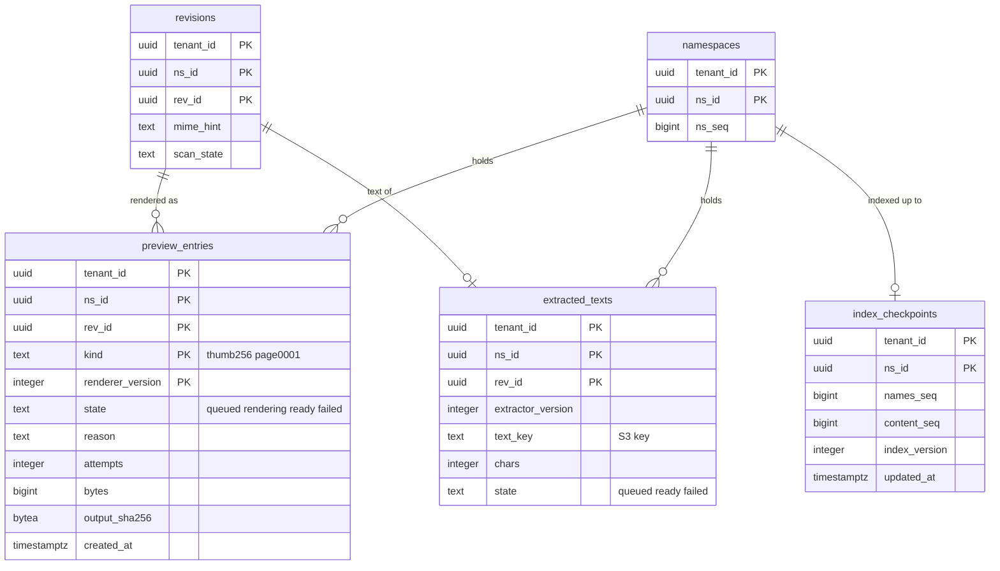

# Data model: プレビューと検索

[data-model.md](../data-model.md) の一部。規約はそちらの 3 節に従う。振る舞いは [previews-and-thumbnails.md](../previews-and-thumbnails.md)（5〜10 節）、[search.md](../search.md)（4〜8 節）を正とする。決定は [ADR-0032](../../decisions/0032-sandboxed-preview-pipeline.md)、[ADR-0033](../../decisions/0033-preview-cache-and-delivery.md)、[ADR-0034](../../decisions/0034-search-index-and-permission-filter.md)、[ADR-0035](../../decisions/0035-ocr-deferred-to-e15.md)。S3 の `previews` のキー、SQS のジョブ、OpenSearch の写像は [stores.md](stores.md) の 1・3・7 節。

3 つとも名前空間の表。プレビューはリビジョンごとに作り、同じ `content_sha256` の別のリビジョンでも使い回さない（[ADR-0033](../../decisions/0033-preview-cache-and-delivery.md)）。

| 表 | 書く |
| --- | --- |
| `preview_entries` | `preview-orchestrator`（`sandbox-results` を受け、HeadObject で大きさと SHA-256 を確かめてから `ready`） |
| `extracted_texts` | `preview-orchestrator`（`text-extractor` の結果） |
| `index_checkpoints` | `indexer` |

## 1. ER 図

- `index_checkpoints` は、索引の対象の名前空間ごとに 1 行（作成の時に作る）。

## 2. 表

### 2.1 `preview_entries`

プレビューのキャッシュの行（[previews-and-thumbnails.md](../previews-and-thumbnails.md) の 8・10 節）。

| 列 | 型 | NULL | 既定 | 説明 |
| --- | --- | --- | --- | --- |
| `tenant_id` | `uuid` | NOT NULL | — | |
| `ns_id` | `uuid` | NOT NULL | — | |
| `rev_id` | `uuid` | NOT NULL | — | |
| `kind` | `text` | NOT NULL | — | 大きさ・頁：`thumb64`・`thumb256`・`thumb1024`・`preview2048`・`page0001`〜`page0300`・`text` |
| `renderer_version` | `integer` | NOT NULL | — | 変換器を直したら上げる |
| `state` | `text` | NOT NULL | `'queued'` | `queued`・`rendering`・`ready`・`failed` |
| `reason` | `text` | NULL | — | `too_large`・`too_many_pixels`・`timeout`・`oom`・`output_too_large`・`bomb`・`unsupported`・`input_mismatch`・`crash` |
| `attempts` | `smallint` | NOT NULL | `0` | タスクを失ったら 3 回まで |
| `bytes` | `integer` | NULL | — | 出力の大きさ（4 MiB まで） |
| `output_sha256` | `bytea` | NULL | — | 出力の SHA-256（オーケストレーターが確かめる） |
| `created_at`・`updated_at` | `timestamptz` | NOT NULL | `now()` | |

- キー：PK `(tenant_id, ns_id, rev_id, kind, renderer_version)`。FK `(tenant_id, ns_id, rev_id)` → `revisions`（`ON DELETE CASCADE`。リビジョンの期限で消える）。
- 同じ `(rev_id, kind)` のジョブは 1 つにまとめる（主キーの `queued` の行で重複を弾く）。`failed` は同じ `renderer_version` では作り直さない。
- 索引：`(created_at)` — 89 日の掃除（D-27）。`(state, updated_at) WHERE state IN ('queued','rendering')` — 見えない時間（2 分）を過ぎたジョブの作り直し。
- CHECK：`state IN (…)`、`(state = 'failed') = (reason IS NOT NULL)`、`state <> 'ready' OR (bytes IS NOT NULL AND output_sha256 IS NOT NULL)`、`bytes IS NULL OR bytes <= 4194304`。
- S3 のキー：`p/<tenant_id>/<rev_id>/<kind>.r<renderer_version>.webp`（[stores.md](stores.md) の 1 節）。
- RLS：名前空間の表。配信の前に `can(actor, read, rev)` と `revisions.scan_state` を確かめる。
- 保持：作成から 89 日（S3 の 90 日の前。D-27）。リビジョンの期限とテナントの消去でも消す。
- S1 の量：90 日で 数億行（先に作る 256 px のサムネイルが主。初期見積もり）。

### 2.2 `extracted_texts`

本文の抽出の結果（チームのプランの名前空間の文書だけ。**`release.fulltext-extraction` の裏、法務の L1**）。定義元：[previews-and-thumbnails.md](../previews-and-thumbnails.md) の 12 節、[search.md](../search.md) の 10 節。

| 列 | 型 | NULL | 既定 | 説明 |
| --- | --- | --- | --- | --- |
| `tenant_id` | `uuid` | NOT NULL | — | |
| `ns_id` | `uuid` | NOT NULL | — | |
| `rev_id` | `uuid` | NOT NULL | — | |
| `extractor_version` | `integer` | NOT NULL | — | |
| `text_key` | `text` | NULL | — | S3 の `p/<tenant_id>/<rev_id>/text.e<version>.txt` |
| `chars` | `integer` | NULL | — | 先頭 1 MiB の文字まで |
| `state` | `text` | NOT NULL | `'queued'` | `queued`・`ready`・`failed` |
| `reason` | `text` | NULL | — | |
| `created_at` | `timestamptz` | NOT NULL | `now()` | |

- キー：PK `(tenant_id, ns_id, rev_id)`。FK → `revisions`（`ON DELETE CASCADE`）。
- 索引：`(created_at)` — 89 日の掃除（D-27）。
- CHECK：`state <> 'ready' OR text_key IS NOT NULL`。
- 抜粋は、検索の確かめ直しが通った結果だけについて、S3 のテキストから作る。行がなければ抜粋を出さず、抽出をやり直す（持ち越し：[data-model.md](../data-model.md) の 9 節）。
- RLS：名前空間の表。保持：89 日。S1 の量：数千万行（チームのプランの文書。初期見積もり）。

### 2.3 `index_checkpoints`

検索の索引の追いつき（[search.md](../search.md) の 6・7 節）。

| 列 | 型 | NULL | 既定 | 説明 |
| --- | --- | --- | --- | --- |
| `tenant_id` | `uuid` | NOT NULL | — | |
| `ns_id` | `uuid` | NOT NULL | — | |
| `names_seq` | `bigint` | NOT NULL | `0` | 名前の索引に当てた番号 |
| `content_seq` | `bigint` | NOT NULL | `0` | 本文の索引に当てた番号 |
| `index_version` | `integer` | NOT NULL | — | `names-v<N>` の `N`（作り直しの間は新旧 2 行を持たず、作り直しの Worker が別に持つ） |
| `updated_at` | `timestamptz` | NOT NULL | `now()` | |

- キー：PK `(tenant_id, ns_id)`。
- 索引：`(updated_at)` — 5 分ごとの掃除で `namespaces.ns_seq` と比べて遅れた名前空間を拾う。
- CHECK：`names_seq >= 0 AND content_seq >= 0`。トリガーで番号を下げる更新を拒む（作り直しの始まりで 0 に戻すときは `index_version` を同時に上げる）。
- RLS：名前空間の表（`indexer` は X3 と同じく名前空間を `app.ns_ids` に入れて書く）。S1 の量：約 160 万行。
